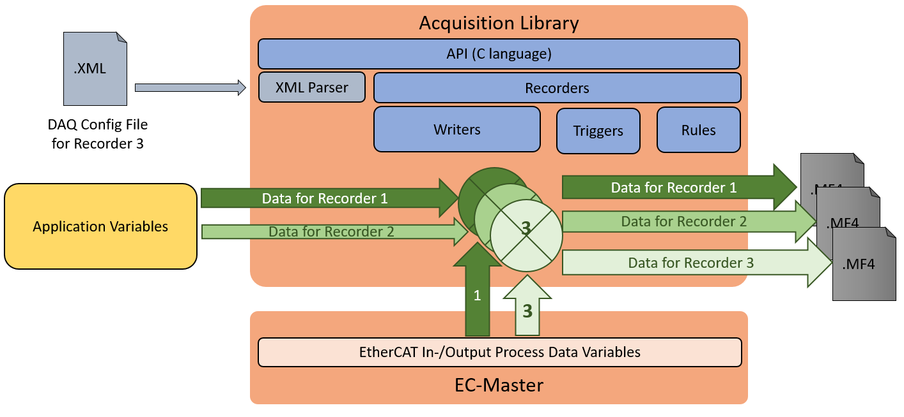
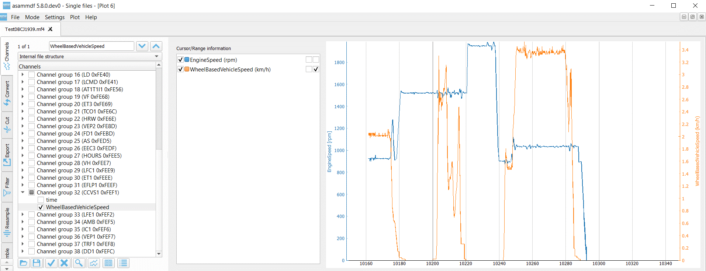

************
Introduction
************

Overview
********

The library `Data Acquisition` allows the application to record data
real-time based on specific trigger conditions.

Architecture
************

The library exports a C-API for parameter setting and trigger
conditions. It is possible to record data to multiple files
concurrently, e. g. with different sample rates. The recorder can be
also configured with a DAQ Config File (XML format).

Recorded Data
*************

Process Variables
=================

The library can record process variables which can be added by:

-  Slave address

-  Name of variable

-  Data range with offset and length

Application Variables
=====================

The library can record application variables which can be registered
from the application by submitting name, data type and address of the
data buffer.

Trigger Recording
*****************

Manual
======

Recording can be started/stopped from application manually by calling
appropriate API.

Automatic
=========

Recording can be started/stopped automatically by adding triggers.

Currently two types are supported:

-  Trigger by value

   -  Variable will be compared against a static value

-  Trigger by variable

   -  Variable will be compared against another variable

Supported comparison operators:

-  Equal

-  Greater

-  Greater or equal

-  Smaller

-  Smaller or equal

Samples

-  Start recorder for infinite time, if variable >= static value

.. figure:: ../Media/DAQ_Recording_1.png
    :alt:

-  Stop recorder, if variable < static value

.. figure:: ../Media/DAQ_Recording_2.png
    :alt:

-  Start recorder for a specific duration, if “Variable 1” is greater
   than “Variable 2”

.. figure:: ../Media/DAQ_Recording_3.png
    :alt:

Supported File Formats
***********************

MDF (Measurement Data Format)
=============================

MDF (Measurement Data Format) is a binary file format for measurement
data that was developed by Vector in collaboration with Robert Bosch
GmbH in 1991.

After the MDF format quickly emerged as the de facto standard in the
automotive industry, the revised Version 4.0 was ultimately published as
an official ASAM standard in 2009.

The format was last updated as ASAM MDF 4.1 in 2012.

Find more at https://www.asam.net/standards/detail/mdf/

CSV (Comma Separated Values)
============================

A comma-separated values (CSV) file is a delimited text file that uses a
comma to separate values.

Find more at https://en.wikipedia.org/wiki/Comma-separated_values

Visualisation Software
**********************

There are various tools available to analyse and evaluate the recorded
data:

-  Open source tool asammdf

-  Vector vSignalyzer

-  MathWorks MATLAB

-  NI Labview with MDF4 DataPlugin

-  Softing MDF.view

-  Bosch WinDarab

-  ETAS INCA

-  Weisang FlexPro

-  Imc FAMOS Reader

asammdf
=======

asammdf is a fast parser and editor for ASAM (Associtation for
Standardisation of Automation and Measuring Systems) MDF (Measurement
Data Format) files.

asammdf supports MDF versions 2 (.dat), 3 (.mdf) and 4 (.mf4).

For more information: https://pypi.org/project/asammdf/

vSignalizer
===========

vSignalyzer is a convenient tool for efficiently evaluating measurement
data of all types. It gives measurement engineers extensive options for
visualizing the data as well as functions for manual and automated
analysis and reporting.

.. figure:: ../Media/DAQ_vsignalizer.png
    :alt:

For more information: http://www.vector.com/vSignalyzer