********************
Software Integration
********************

Network Timing
**************

Interaction between application and EtherCAT network

EC-Master has no internal tasks, the operation is fully controlled by the user's application. The benefits of this design are:

- No synchronization issues between application and EC-Master
- Consistent process data without using any locks
- Various network timings driven by the application possible
- Cyclic part may run within Interrupt Service Routine (ISR)
- Easy to integrate

From the application perspective, EC-Master behaves like a driver that is controlled by the :cpp:func:`emExecJob` function with additional parameters, so-called :cpp:enum:`EC_T_USER_JOB`.

Typical sequence of :cpp:enum:`EC_T_USER_JOB` for :cpp:func:`emExecJob` to be called cyclically by the application:

.. figure:: ../Media/Timing_CycAcycFrames-Single.png
    :align:     center
    :alt:

|Symbol_CycJob-P| Refresh Inputs
    :cpp:enumerator:`EC_T_USER_JOB::eUsrJob_ProcessAllRxFrames`: Process all received frames
|Symbol_CycJob-S| Write Outputs
    :cpp:enumerator:`EC_T_USER_JOB::eUsrJob_SendAllCycFrames`: Send cyclic frames to update process output data.
|Symbol_CycJob-MT| Administration
    :cpp:enumerator:`EC_T_USER_JOB::eUsrJob_MasterTimer`: Trigger master and slave state machines.
|Symbol_CycJob-AS| Send acyclic datagrams/commands
    :cpp:enumerator:`EC_T_USER_JOB::eUsrJob_SendAcycFrames`: Transmit pending acyclic frame(s).

.. |Symbol_CycJob-P| image:: ../Media/Timing_CycJob-P.png
.. |Symbol_CycJob-S| image:: ../Media/Timing_CycJob-S.png
.. |Symbol_CycJob-MT| image:: ../Media/Timing_CycJob-MT.png
.. |Symbol_CycJob-AS| image:: ../Media/Timing_CycJob-AS.png

When a process data update is initiated by calling :cpp:expr:`emExecJob(eUsrJob_ProcessAllRxFrames)` new input data are read from the received frames and copied into the process data image.
After the function returns the application can process the inputs, calculate the outputs and update the values in the process image.
With calling :cpp:expr:`emExecJob(eUsrJob_SendAllCycFrames)` the output data are read from the process data image and stored in Ethernet/EtherCAT frames prior to sending them to the Real-time Ethernet Driver.
When this call returns all output process data values are stored in Ethernet/EtherCAT frames which are then processed by the network controller.

If only one single thread is both writing into the process data image and calling :cpp:expr:`emExecJob(eUsrJob_SendAllCycFrames)` no further output process data synchronization is necessary.
The application is responsible to (cyclically) calling the function :cpp:func:`emExecJob` with the appropriate parameters.

EtherCAT frames are divided into two categories:

1. Cyclic frames
    - Contain process output and input data
    - Distributed Clocks (DC): Contain datagram to distribute network time
    - Typically sent by master in every cycle
    - Defined by the configuration tool (which data to read and to write)
2. Acyclic frames
    - Asynchronous, event triggered communication
    - Mailbox communication (CoE, FoE, EoE)
    - Status requests (e. g. read slave state information)
    - Raw EtherCAT datagrams requested by application

.. raw:: latex

    \newpage

Standard Timing: Short output dead time
=======================================

**Cyclic frames**

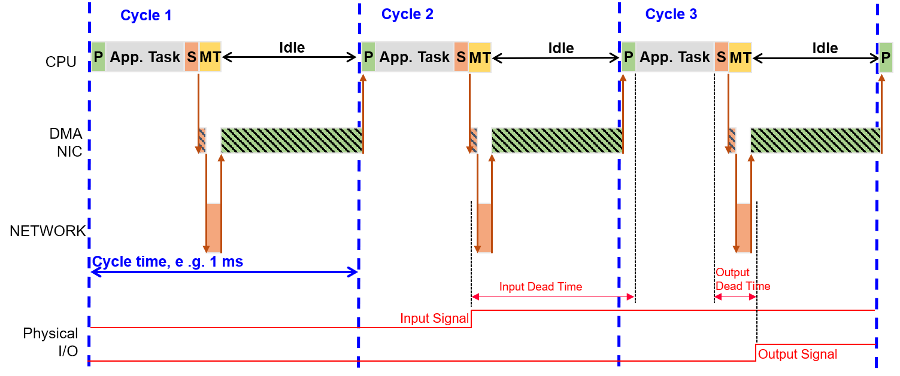

Application has to perform:

.. literalinclude:: ..\..\..\Doc\EcMaster\Snippets\ClassB\software-integration.h
        :start-after: IGNORE_TEST(DocumentationSnippets, Timing_CycFramesPolling)
        :end-before: IGNORE_TEST(DocumentationSnippets, Timing_CycFramesPolling)
        :language: cpp
        :dedent: 4
        :lines: 4-

**Cyclic and acyclic frames**

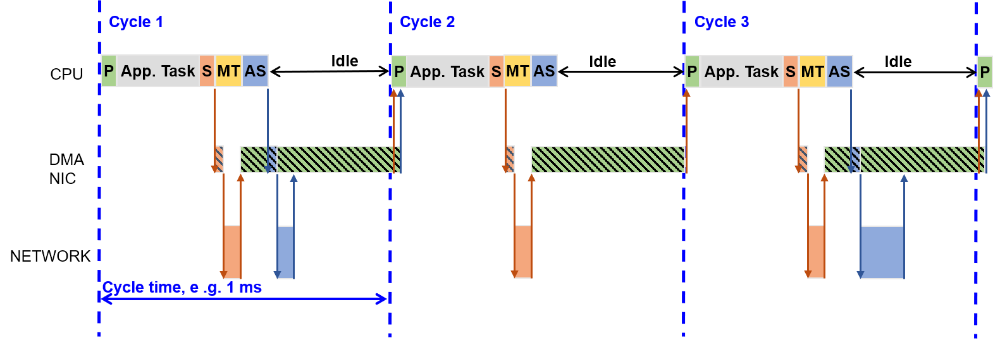

Application has to perform:

.. literalinclude:: ..\..\..\Doc\EcMaster\Snippets\ClassB\software-integration.h
        :start-after: IGNORE_TEST(DocumentationSnippets, Timing_CycAcycFramesPolling)
        :end-before: IGNORE_TEST(DocumentationSnippets, Timing_CycAcycFramesPolling)
        :language: cpp
        :dedent: 4
        :lines: 4-

**Cyclic frames with DC**

.. figure:: ../Media/Timing_CycFrames-DC-Polling.png
    :align:     center
    :alt:

Application has to perform:

.. literalinclude:: ..\..\..\Doc\EcMaster\Snippets\ClassB\software-integration.h
        :start-after: IGNORE_TEST(DocumentationSnippets, Timing_CycFramesPolling)
        :end-before: IGNORE_TEST(DocumentationSnippets, Timing_CycFramesPolling)
        :language: cpp
        :dedent: 4
        :lines: 4-

.. raw:: latex

    \newpage

Alternative Timing: Short Input dead time
=========================================

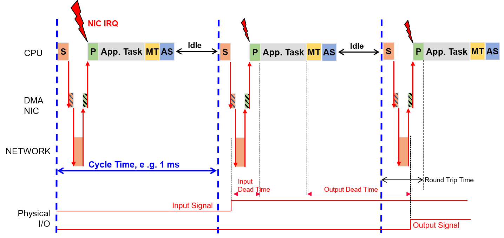

Application has to perform during startup:

.. literalinclude:: ..\..\..\Doc\EcMaster\Snippets\ClassB\software-integration.h
        :start-after: IGNORE_TEST(DocumentationSnippets, Timing_CycAcycFramesInterrupt)_Setup
        :end-before: IGNORE_TEST(DocumentationSnippets, Timing_CycAcycFramesInterrupt)_Setup
        :language: cpp
        :dedent: 4

Application has to perform inside job task:

.. literalinclude:: ..\..\..\Doc\EcMaster\Snippets\ClassB\software-integration.h
        :start-after: IGNORE_TEST(DocumentationSnippets, Timing_CycAcycFramesInterrupt)_JobTask
        :end-before: IGNORE_TEST(DocumentationSnippets, Timing_CycAcycFramesInterrupt)_JobTask
        :language: cpp
        :dedent: 4

For closer details find an example project :file:`Examples/EcMasterDemoSyncSm`

.. raw:: latex

    \newpage

Example application
*******************

The example application EcMasterDemo handles the following tasks:

- Showing basic EtherCAT communication
- Master stack initialization
- Start (set all slaves into OPERATIONAL state)
- "Out of the box" solution for different operating systems, see :ref:`toc_os:Platform and Operating Systems (OS)`
- Thread with periodic tasks and application thread already implemented
- The output messages of the demo application will be printed on the console as well as in some files. The following log files will be created:
    - :file:`ecmaster0.log` all messages
    - :file:`error0.log` application error messages (logged via LogError function)

.. raw:: latex

    \newpage

File reference
==============

The EC-Master Demo application consists of the following files:

.. figure:: ../Media/EcMasterDemoFileOverview.png
    :align:     center
    :alt:

:file:`EcDemoMain.cpp`
    Entrypoint for the different operating systems

:file:`EcDemoPlatform.h`
    Operating system specific settings (taskpriorities, timer settings)

:file:`EcDemoTimingTask.h/.cpp`
    Operating system independent default timing task implementation (base class)

:file:`EcDemoTimingTaskPlatform.h/.cpp`
    Operating system dependent performance increasing overrides of EcDemoTimingTask

:file:`EcDemoApp.cpp`
    Initialize, start and terminate the EtherCAT master

:file:`EcDemoApp.h`
    Application specific settings for EcDemoApp

:file:`EcDemoParms.cpp`
    Parsing of command line parameters

:file:`EcDemoParms.h`
    Basic configuration structs and parameters (EtherCAT master parameter)

:file:`EcSelectLinkLayer.cpp`
    Common Functions which abstract the command line parsing into Real-time Ethernet Driver parameters

:file:`EcNotification.cpp`
    Slave monitoring and error detection (function :cpp:func:`emNotify` )

:file:`EcSdoServices.cpp`
    CoE object dictionary example

:file:`EcSlaveInfo.cpp`
    Slave information services (bus scan, slave properties, getting information of slaves connected to the EtherCAT bus)

:file:`EcLogging.cpp`
    Message logging functions

:file:`EcTimer.cpp`
    Start and monitor timeouts

.. raw:: latex

    \newpage

Master lifecycle
================

This chapter provides a brief overview of starting and stopping the EC-Master.
Basically the operation of the EC-Master is wrapped between the functions:

- :cpp:func:`emInitMaster`
- :cpp:func:`emSetMasterState`

and

- :cpp:func:`emDeinitMaster`

The EC-Master is made ready for operation and started with the first two functions mentioned. During this preparation, a thread is set up and started that handles all the cyclic tasks of the EC-Master.
The last function stops the EC-Master and clears the memory. The following sequence diagram gives an overview of the complete life cycle.

.. uml::

    skinparam ParticipantBorderColor black
    skinparam SequenceMessageAlign direction
    hide footbox
    
    !define APPCOLOR FFD965
    !define CORECOLOR F4A77D

    participant EcDemoMain #APPCOLOR
    participant EcDemoTimingTask
    participant EcDemoApp #APPCOLOR
    participant EcMasterJobTask
    participant EcMaster as "EC-Master" #CORECOLOR

    activate EcDemoMain #APPCOLOR
    EcDemoMain->EcDemoMain : PrepareCommandLine()
    EcDemoMain->EcDemoMain : SetAppParmsFromCommandLine()
    EcDemoMain->EcDemoMain : InitLogging()
    EcDemoMain->EcDemoTimingTask : StartTimingTask(pvJobTaskEvent)
    activate EcDemoTimingTask
    EcDemoMain->EcDemoApp : EcDemoApp()

    activate EcDemoApp #APPCOLOR
    EcDemoApp->EcDemoApp : InitNotificationHandler()
    EcDemoApp->EcMaster : emRasSrvStart()
    activate EcMaster #CORECOLOR
    EcDemoApp<--EcMaster
    deactivate EcMaster
    EcDemoApp->EcMaster : emInitMaster()
    activate EcMaster #CORECOLOR
    EcDemoApp<--EcMaster

    EcDemoApp->EcMasterJobTask : CreateJobTask()
    activate EcMasterJobTask
    par
        loop
            EcDemoTimingTask->EcDemoTimingTask : sleep()
            EcDemoTimingTask->EcMasterJobTask : OsSetEvent(pvJobTaskEvent)
            activate EcMasterJobTask
        end
    else
        EcMasterJobTask->EcMaster : emExecJob(ProcessAllRxFrames)
        EcMasterJobTask<--EcMaster
        EcMasterJobTask->EcMasterJobTask : myAppWorkPd()
        EcMasterJobTask->EcMaster : emExecJob(SendAllCycFrames)
        EcMasterJobTask<--EcMaster
        EcMasterJobTask->EcMaster : emExecJob(MasterTimer)
        EcMasterJobTask<--EcMaster
        EcMasterJobTask->EcMaster : emExecJob(SendACycFrames)
        EcMasterJobTask<--EcMaster
        deactivate EcMasterJobTask
    else
        EcDemoApp->EcMaster : emConfigureNetwork()
        EcDemoApp<--EcMaster
        EcDemoApp->EcMaster: emRegisterClient()
        EcDemoApp<--EcMaster
        EcDemoApp->EcMaster : emScanBus()
        EcDemoApp<--EcMaster
        EcDemoApp->EcDemoApp : PrintSlaveInfos()
        EcDemoApp->EcMaster : emSetMasterState(eEcatState_OP)
        EcDemoApp<--EcMaster
        EcDemoApp->EcDemoApp : idle()
        EcDemoApp->EcMaster : emSetMasterState(eEcatState_INIT)
        EcDemoApp<--EcMaster
        EcDemoApp->EcMasterJobTask : shutdownJobTask()
        deactivate EcMasterJobTask
    end

    EcDemoApp->EcMaster : emUnregisterClient()
    EcDemoApp<--EcMaster
    EcDemoApp->EcMaster : emRasSrvStop()
    EcDemoApp<--EcMaster
    EcDemoApp->EcMaster : emDeinitMaster()
    EcDemoApp<--EcMaster
    deactivate EcMaster

    EcDemoMain<--EcDemoApp
    deactivate EcDemoApp
    EcDemoMain->EcDemoTimingTask : StopTimingTask()
    deactivate EcDemoTimingTask
    EcDemoMain->EcDemoMain : DeinitLogging()

.. raw:: latex

    \newpage

A more detailed description of the functions:

EcDemoMain()
    A wrapper to start the demo from the respective operating system.
    In addition to initializing the operating system, parsing command line parameters, and initializing logging, it also starts the timing task.

EcDemoApp()
    Demo application. The function takes care of starting and stopping the master and all related tasks. In between, the function runs idle, while all relevant work is done by the EcMasterJobTask().

EcMasterJobTask()
    Thread that does the necessary periodic work. Very important here is :cpp:func:`myAppWorkpd` between :cpp:enumerator:`EC_T_USER_JOB::eUsrJob_ProcessAllRxFrames` and :cpp:enumerator:`EC_T_USER_JOB::eUsrJob_SendAllCycFrames`.
    Application-specific working on process data, which must be synchronous with the bus cycle, can be carried out here.

EcDemoTimingTask()
    Timing Thread. This thread sets the timing event that triggers the EcMasterJobTask for the next cycle.

emInitMaster()
    EC-Master API function: Prepare the master for operation and set operational parameters, e.g. used Real-time Ethernet Driver, buffer sizes, maximum number of slaves, ... .

emConfigureNetwork()
    EC-Master API function: Loads the configuration from the ENI (XML file).

emRegisterClient()
    EC-Master API function: Register the application as a client at the EC-Master to receive event notifications.

emSetMasterState()
    EC-Master API function: Startup the EtherCAT master and switch the bus to the different states from INIT to OPERATIONAL.

emDeinitMaster()
    EC-Master API function: Clean up.

.. raw:: latex

    \newpage

Synchronization
===============

This chapter relates the tasks or functions that run in the :cpp:func:`EcMasterJobTask` to the timing and communication on the EtherCAT bus.

.. uml::

    hide time-axis

    !define PCOLOR A9D18E
    !define MTCOLOR FFD966
    !define ASCOLOR 8FAADC
    !define BUSCOLOR EBC301
    !define APPCOLOR FFD965
    !define CORECOLOR F4A77D

    concise "App" as App
    concise "In Buffer" as In
    concise "Out Buffer" as Out
    concise "EtherCAT Bus" as Bus
    scale 10 as 60 pixel

    App is "Idle" #White
    In is ""
    Out is ""
    Bus is "acyclic" #BUSCOLOR

    @App
    0 is "P" #PCOLOR
    10 is "Task" #APPCOLOR
    40 is "S" #CORECOLOR
    50 is "MT" #MTCOLOR
    60 is "AS" #ASCOLOR
    70 is "Idle" #White
    100 is "P" #PCOLOR
    110 is "Task" #APPCOLOR
    140 is "S" #CORECOLOR
    150 is "MT" #MTCOLOR
    160 is "AS" #ASCOLOR
    170 is "Idle" #White

    @In
    0 is {-}
    10 is ""
    100 is {-}
    110 is ""

    @Out
    10 is {-}
    40 is ""
    110 is {-}
    140 is ""

    @Bus
    0 is {hidden}
    40 is "cyclic" #BUSCOLOR
    50 is {hidden}
    60 is "acyclic" #BUSCOLOR
    70 is {hidden}
    100 is {hidden}
    140 is "cyclic" #BUSCOLOR
    150 is {hidden}
    160 is "acyclic" #BUSCOLOR
    170 is {hidden}

    highlight 0 to 0.33 #Blue;line:Blue : Tn
    highlight 100 to 100.33 #Blue;line:Blue : Tn+1

App
    Shown are the tasks/jobs ``P``, ``Task``, ``S``, ``MT`` and ``AS`` which must be done by the application every single cycle. The details of the individual tasks are described below.
    Once all tasks are finished, the application is idle for the next cycle.

In buffer
    Shown are the contents of the input section of the process image. The contents are not valid while the EtherCAT master updates the data ``P``.

Out buffer
    Shown are the contents of the output section of the process image. The contents are not valid while the application updates the data ``Task``.

EtherCAT bus
    Shown are the timing positions, when the EtherCAT master does cyclic and acyclic communication on the EtherCAT bus. Besides the timing position of the start for the cyclic frames, the shown positions may vary, depending on the number of frames.

In :file:`EcDemoApp.cpp` the tasks/jobs shown in the timing-diagram are managed and scheduled by :cpp:func:`EcMasterJobTask`.

Job ``P``
    The job :cpp:enumerator:`EC_T_USER_JOB::eUsrJob_ProcessAllRxFrames` handles the frames and data received from previous bus activity, including both cyclic and acyclic frames. These received frames are analyzed for new input data, and the local process image is updated accordingly. During this update, the input data section of the process image is invalid.

``Task``
    The function :cpp:func:`myAppWorkpd` allows application-specific working on process data. In this function, the application can use updated input information from Job ``P``, perform calculations and manipulations, and write new data to the output section of the process image.

Job ``S``
    The job :cpp:enumerator:`EC_T_USER_JOB::eUsrJob_SendAllCycFrames` initiates the transmission of all cyclic frames on the EtherCAT bus.

Job ``MT``
    The job :cpp:enumerator:`EC_T_USER_JOB::eUsrJob_MasterTimer` serves an administrative role, primarily managing the timeout timers. During these calls, there is no interaction with the process image, nor do they trigger any bus traffic. It is not essential to run this function with every bus cycle, particularly in systems with cycle times shorter than 1 ms. However, it is recommended to run this function at a 1 ms interval.

Job ``AS``
    The job :cpp:enumerator:`EC_T_USER_JOB::eUsrJob_SendAcycFrames` schedules the transmission of acyclic frames.

``Idle``
    Currently implemented to wait for the next cycle, which is triggered by the timing event.

Event notification
==================

The EtherCAT master provides event notification for a great number of events. These events are for example:

- Bus state change
- Link state change
- Working counter errors
- ...

Any thread can register for these events to be notified. This is achieved by calling the API function

.. cpp:alias:: emRegisterClient

In case of the EcMasterDemo the class ``CEmNotification`` is provided. It implements the complete framework to catch and handle the EC-Master notifications. The class is instantiated once and registered at the EC-Master with the call :cpp:func:`emRegisterClient` shown above. The class implements the method :cpp:func:`ecatNotify` as major entry point (or callback function) for events.

There are two different ways events can be handled. The method of handling an event is primarily determined by the time required to handle the event and the processing context in which the event is to be handled. The methods are described below.

Direct notification handling
----------------------------

Smaller events can be handled directly in the context in which they are detected. A possible example of such an event is the detection of a false work counter (WKC). The procedure is as follows:

.. uml::

    skinparam ParticipantBorderColor black
    skinparam SequenceMessageAlign direction
    hide footbox
    
    !define APPCOLOR FFD965
    !define CORECOLOR F4A77D

    participant EcMasterJobTask
    participant EcMaster as "EC-Master" #CORECOLOR
    participant EcNotification

    activate EcMasterJobTask
    EcMasterJobTask->EcMaster : emExecJob(ProcessAllRxFrames)

    activate EcMaster #CORECOLOR
    EcMaster->EcMaster : Receive Frames
    EcMaster->EcMaster : Process Frames
    EcMaster->EcMaster : Detect Errors
    activate EcMaster #CORECOLOR
    EcMaster->EcNotification : invoke EcMasterNotifyCallback()

    activate EcNotification
    EcNotification->EcNotification : ecatNoitfy()
    EcNotification->: Error Log Message
    return

    deactivate EcMaster
    return

    EcMasterJobTask->EcMasterJobTask : myAppWorkPd()

The event handling is reduced to simply issuing a log message, which is not time critical. The event is handled directly within the context of the :cpp:func:`emExecJob` ( :c:enum:`eUsrJob_ProcessAllRxFrames`) function.

Postponed notification handling
-------------------------------

Events that require more time-consuming processing cannot be handled directly in the context in which they are detected. The handling or processing of the event must be postponed. This is accomplished through a queue, which is also readily implemented using the ``CEmNotification`` class. The procedure is as follows:

.. uml::

    skinparam ParticipantBorderColor black
    skinparam SequenceMessageAlign direction
    hide footbox
    
    !define APPCOLOR FFD965
    !define CORECOLOR F4A77D

    participant EcDemoApp #APPCOLOR
    participant EcMasterJobTask
    participant EcMaster as "EC-Master" #CORECOLOR
    box
        participant EcNotification
        database Notifications
    end box

    activate EcDemoApp #APPCOLOR
    activate EcMasterJobTask
    EcMasterJobTask->EcMaster : emExecJob(ProcessAllRxFrames)

    activate EcMaster #CORECOLOR
    EcMaster->EcMaster : Receive Frames
    EcMaster->EcMaster : Process Frames
    EcMaster->EcMaster : Detect Errors
    activate EcMaster #CORECOLOR
    EcMaster->EcNotification : invoke EcMasterNotifyCallback()

    activate EcNotification
    EcNotification->EcNotification : ecatNotify()
    activate EcNotification
    EcNotification->Notifications : EnqueueJob()
    deactivate EcNotification
    return

    deactivate EcMaster
    return
    deactivate EcMasterJobTask
    ...
    EcDemoApp->EcNotification : ProcessNotificationJobs()
    activate EcNotification
    EcNotification->Notifications : DequeueJob()
    EcNotification<--Notifications
    activate EcNotification
    EcNotification->EcNotification : Process()
    deactivate EcNotification
    return

By calling periodically ``CEmNotification::ProcessNotificationJobs()``, the application checks and handles all queued notifications.

.. important::
    The call of ``CEmNotification::ProcessNotificationJobs()`` shall NOT be executed in the :cpp:func:`EcMasterJobTask`. As the CPU time consumption may be high, this would have a high impact to the real-time behavior of the cyclic operation.

.. raw:: latex

    \newpage

Logging
=======

The ``EcMasteDemo`` examples demonstrate how log messages can be processed by the application, see :file:`Examples/Common/EcLogging.cpp`.
The messages processed by ``EcLogging.cpp`` are of different types, e.g. EC-Master log messages, application messages, DCM messages and are logged to the console and/or files.
Identical messages are skipped automatically by default.

.. note:: With some operating systems, logging in files is deactivated, e.g. because a file system is not available.

Parameters
----------

The verbosity of the ``EcMasteDemo`` is specified as a ``-v`` command line parameter. It is used to determine the log level of the application, see EcDemoMain.cpp.
For performance reasons the EC-Master automatically filters log messages according to :cpp:member:`EC_T_LOG_PARMS::dwLogLevel`.
``EcLogging.cpp`` has various parameters beside the log level, like Roll Over setting, log task prio and affinity, log buffer size, etc. See ``EcMasteDemo`` for reference.

Configure EC-Master logging
---------------------------

The EC-Master logging is configured on initialization, see :cpp:member:`EC_T_INIT_MASTER_PARMS::LogParms` in :cpp:func:`emInitMaster`.
The application can provide customized log message handlers of type :cpp:type:`EC_PF_LOGMSGHK` if the default handler in ``EcLogging.cpp`` does not fulfill the needs of the application.

.. note:: The callback is typically called from the context of the EcMasterJobTask and should return as fast as possible.

Master startup
**************

The master stack has to be initialized once when the application is starting. After this one-time initialization one or more clients may register with the master. Finally, after all clients are registered the master can be started.
Starting the master means that all slaves will be set into the operational state. Every time the state of the master has changed the clients are notified about this state-change.

Asynchronous (deferred) startup
===============================

.. uml::

    skinparam ParticipantBorderColor black
    skinparam SequenceMessageAlign direction
    hide footbox
    
    !define APPCOLOR FFD965
    !define CORECOLOR F4A77D

    participant App as "Application" #APPCOLOR
    participant EcMaster as "EC-Master" #CORECOLOR

    activate App #APPCOLOR
    App->EcMaster : emInitMaster()
    activate EcMaster #CORECOLOR
    return

    App->App : Create Job Task

    App->EcMaster : emConfigureNetwork()
    activate EcMaster #CORECOLOR
    return

    autonumber "<b>(<u>##</u>)"
    App->EcMaster : emRegisterClient()
    activate EcMaster #CORECOLOR
    autonumber stop
    return

    autonumber resume
    App->EcMaster : emSetMasterStateReq(<Time-out>, eEcatState_OP)
    activate EcMaster #CORECOLOR
    EcMaster->App : return

    EcMaster->EcMaster : INIT
    EcMaster->App : emNotify()
    autonumber stop
    EcMaster->EcMaster : PREOP
    EcMaster->App : emNotify()
    EcMaster->EcMaster : SAFEOP
    EcMaster->App : emNotify()
    EcMaster->EcMaster : OP
    autonumber resume
    EcMaster->App : emNotify()
    deactivate EcMaster

- Application calls :cpp:func:`emInitMaster` (...)
- Application creates Job Task. See :ref:`software-integration:Master lifecycle`
- Application calls :cpp:func:`emConfigureMaster` (...)
- Application calls :cpp:func:`emConfigureNetwork` (...) (See "1" )
- Application calls :cpp:func:`emSetMasterStateReq` (...) with an appropriate timeout value (See "2" )
- Function :cpp:func:`emSetMasterStateReq` (...) returns immediately (See "3" )
- :cpp:func:`emSetMasterStateReq` (...) initiated the master startup procedure (See "4" )
- The master initializes all slaves until all slaves reach OPERATIONAL state
- After every state change the application will be notified (See "5" )
- After reaching the OPERATIONAL state the system is ready (See "6" )

Synchronous startup
===================

.. uml::

    skinparam ParticipantBorderColor black
    skinparam SequenceMessageAlign direction
    hide footbox

    !define APPCOLOR FFD965
    !define CORECOLOR F4A77D

    participant App as "Application" #APPCOLOR
    participant EcMaster as "EC-Master" #CORECOLOR

    activate App #APPCOLOR
    App->EcMaster : emInitMaster()
    activate EcMaster #CORECOLOR
    return

    App->App : Create Job Task

    App->EcMaster : emConfigureNetwork()
    activate EcMaster #CORECOLOR
    return

    autonumber "<b>(<u>##</u>)"
    App->EcMaster : emRegisterClient()
    activate EcMaster #CORECOLOR
    autonumber stop
    return

    autonumber resume
    App->EcMaster : emSetMasterState(<Time-out>, eEcatState_OP)
    activate EcMaster #CORECOLOR
    EcMaster->EcMaster : INIT
    EcMaster->EcMaster : PREOP
    EcMaster->EcMaster : SAFEOP
    EcMaster->EcMaster : OP
    return

- Application calls :cpp:func:`emInitMaster` (...)
- Application creates Job Task. See :ref:`software-integration:Master lifecycle`
- Application calls :cpp:func:`emConfigureNetwork` (...)
- Application calls :cpp:func:`emRegisterClient` (...) (See "1" )
- Application calls :cpp:func:`emSetMasterState` (...) with an appropriate timeout value (See "2" )
- Inside :cpp:func:`emSetMasterState` (...) the master startup procedure will be initiated (See "3" )
- The application is blocked until the whole startup has finished (See "7" )
- The master initializes all slaves until all slaves reach OPERATIONAL state (See "3-6" )
- After reaching the OPERATIONAL state the system is ready (See "6" )
- :cpp:func:`emSetMasterState` (...) returns (See "7" )

.. raw:: latex

    \newpage

EtherCAT Network Configuration ENI
**********************************

For reading new input data values and writing new output data values (process data update) the EtherCAT configuration file contains one or multiple "Cyclic" entries. These entries contain one or multiple frames (so-called cyclic frames) to be sent cyclically by the master.
Inside the cyclic frames there are one or multiple EtherCAT datagrams containing logical read/write commands for reading and writing process data values.

Single cyclic entry configuration
=================================

By default there is only a single cyclic entry with one or more cyclic frames:

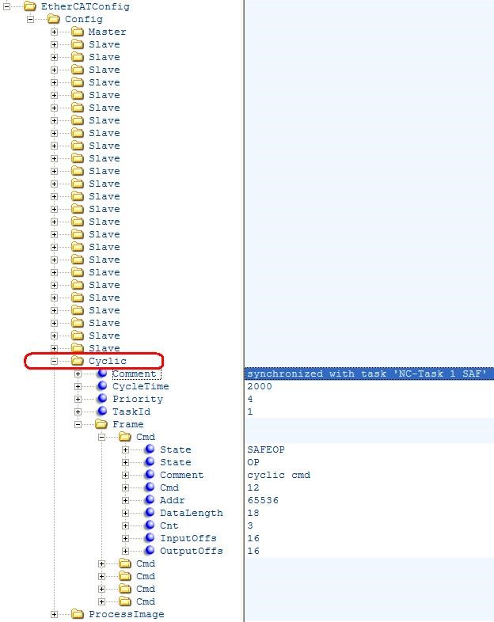

All process data synchronization modes support this configuration variant.

Multiple cyclic entries configuration
=====================================

For more complex scenarios it is possible to configure the system using multiple cyclic entries with one or more cyclic frames for each cyclic entry.

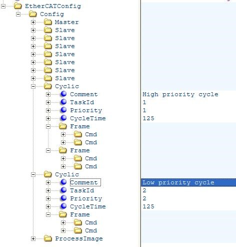

The application has to use the :cpp:enumerator:`EC_T_USER_JOB::eUsrJob_SendCycFramesByTaskId` job call to the master to send the appropriate cyclic frame.

.. seealso:: :cpp:func:`emExecJob`

.. raw:: latex

    \newpage

Copy Information for Slave-to-Slave communication
=================================================

It is possible to configure the system to copy input variables to output variables within EC-Master.
The copy info declarations of the corresponding received cyclic frame are processed in :cpp:expr:`emExecJob(eUsrJob_ProcessAllRxFrames)`.

The exchange of process data takes two communication cycles. The duration is necessary if cable redundancy is used or if the WKC of INPUT needs to be checked before changing OUTPUT.

The copy info declarations are located at ``/EtherCATConfig/Config/Cyclic/Frame/Cmd/CopyInfos`` in the ENI file.

.. seealso::
    - :ref:`software-integration:Cyclic cmd WKC validation`
    - CopyInfosType in ETG.2100

**Configuration with EC-Engineer**

#. In the "Slave to Slave" tab of the Master select Input and Output Variable and connect them:
    .. figure:: ../Media/configengineer.png
        :align:     center
        :alt:

**Configuration with ET9000**

#. Select "Linked to..." from the Output Variable:
    .. figure:: ../Media/configet9000.png
        :align:     center
        :alt:

#. Select Input Variable to be attached to the Output Variable:
    .. figure:: ../Media/outputvariable.png
        :align:     center
        :alt:

.. hint:: Copy info declaration processing is independent of WKC values, but updating the INPUT source depends on successful Cyclic cmd WKC validation.

Swap bytes of variables according to ENI
========================================

The following screenshot (ET9000) shows how to configure variables to be swapped by the EC-Master:

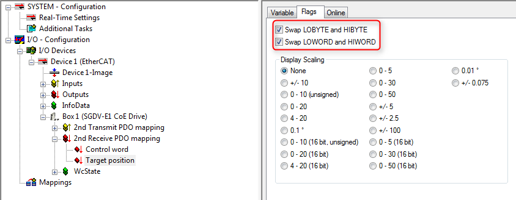

.. hint:: The EC-Master does not distinguish between WORD or BYTE swapping. Setting any PDO swap flag instructs the EC-Master to swap the PDO variable.

The swap declarations are located at DataType's attribute SwapData of RxPdo or TxPdo, e.g. ``/EtherCATConfig/Config/Slave/ProcessData/RxPdo/Entry/DataType`` in the ENI file.

.. raw:: latex

    \newpage

Process Data Access
*******************

The process data is exchanged as variables between the EtherCAT master and the slaves with EtherCAT commands every cycle.

The Master Memory contains the Process Data Image separated in two memory areas, one for input data and another one for output data:

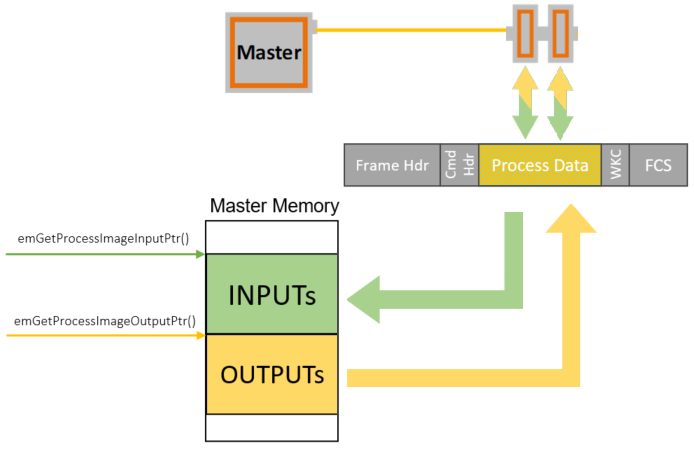

The base addresses of these areas are provided by calling the functions :cpp:func:`emGetProcessImageInputPtr` and :cpp:func:`emGetProcessImageOutputPtr`. 

The size of the Process Data Image INPUT/OUTPUT areas as defined in the ENI file under ``EtherCATConfig/Config/ProcessImage/Inputs/ByteSize`` and ``EtherCATConfig/Config/ProcessImage/Outputs/ByteSize`` is returned by :cpp:func:`emRegisterClient` at :cpp:member:`EC_T_REGISTERRESULTS::dwPDOutSize` and :cpp:member:`EC_T_REGISTERRESULTS::dwPDInSize`. 

.. raw:: latex

    \newpage

All INPUT and OUTPUT process data variables are mapped and contained in the Process Data Image:

.. figure:: ../Media/PdAccess_PdVariablesList.png
    :align:     center
    :alt:

The information about variables is loaded from the ENI file using :cpp:func:`emConfigureNetwork`:

.. literalinclude:: ..\..\..\Doc\EcMaster\Snippets\ClassB\api.h
    :start-after: DocumentationSnippetsConfigureNetworkExample
    :end-before: DocumentationSnippetsConfigureNetworkExample
    :language: cpp
    :dedent: 4
    :lines: 1-

To get the list of all variables, the example application EcMasterDemo can be started with command line option ``-printvars``, see :ref:`running-ecdemo`.
It demonstrates the usage of the functions :cpp:func:`emGetSlaveInpVarInfoEx` and :cpp:func:`emGetSlaveOutpVarInfoEx`.

Sizes of EtherCAT variables are given as bit length, not byte length and their offset within the Process Data Image are given as bit offsets, not byte offsets. 

Due to padding bits within the Process Data Objects (PDOs) defined in the EtherCAT slave description (ESI file) and the calculation algorithms within the configuration tool, process data variables are typically starting at a byte boundary.

The structure of the process data image is read from the ENI file. It includs all offsets of all process data variables and does not change until a new configuration is provided. 
Lookup of variables is therefor only needed once after loading the network configuration (ENI) and is not needed every cycle.
In the example program it can be integrated in :cpp:func:`myAppPrepare()` at application startup.
All variables names are stored in the ENI file under ``EtherCATConfig/Config/ProcessImage/[Inputs|Outputs]/Variable``. 
Application-specific working on process data is supposed to be integrated in :cpp:func:`myAppWorkPd()` . 

Different ways to lookup informations of variables using the parsed information from the ENI by the |Product| stack in :cpp:func:`myAppPrepare()` 
and Application-specific working on process data in :cpp:func:`myAppWorkPd()` is described in this chapter below.

.. raw:: latex

    \newpage

Process data access using hard coded offsets
============================================

The configuration tool assigns the offset and size of each variable within the Process Data Image:

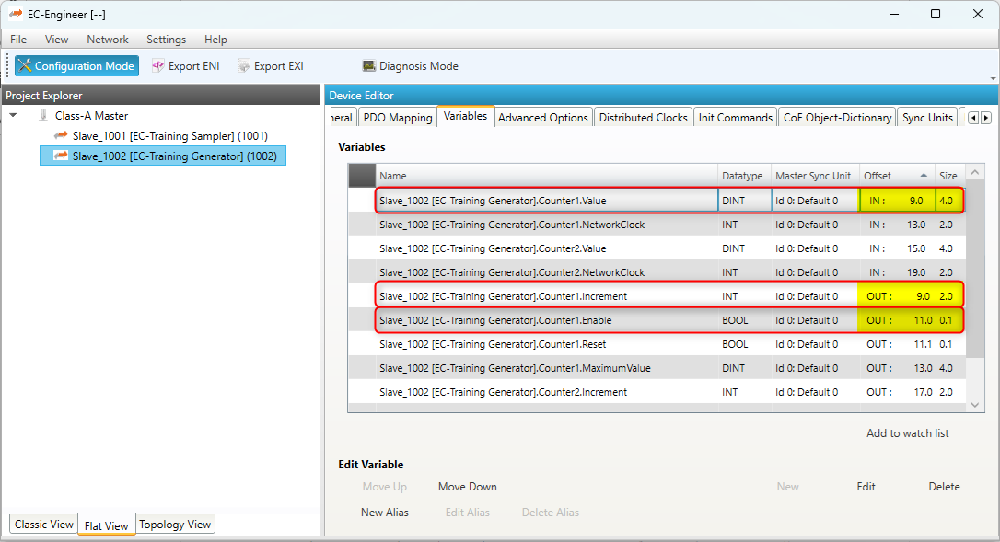

The following example demonstrates how to access the variables with hard coded bit offsets in :cpp:func:`myAppWorkPd()`.

.. dropdown:: **Process data access using hard coded offsets example**

    .. literalinclude:: ..\..\..\Doc\EcMaster\Snippets\ClassB\software-integration.h
        :start-after: DocumentationSnippetsPdAccessHardCodedOffsetsExample
        :end-before: DocumentationSnippetsPdAccessHardCodedOffsetsExample
        :language: cpp
        :dedent: 4
        :lines: 2-

.. note:: The offsets are subject to be changed if the ENI file changes. It is strongly recommended to determine the bit offsets of variables on startup as described in the following chapters instead of using hard coded values!

.. raw:: latex

    \newpage

Process data access using variable names from ENI
=================================================

Using the configuration tool, unique names can be assign to Process Data variables. They are included in the ENI file.

.. note:: The variable name parameter to :cpp:func:`emFindOutpVarByNameEx` / :cpp:func:`emFindInpVarByNameEx` must match the variable name in the ENI file. The variable names of each slave are taken from the ESI file and can be changed using the configuration tool.

The following example demonstrates how to query the bit offset of a variable by its name from the |Product| stack using :cpp:func:`emFindOutpVarByNameEx`, :cpp:func:`emFindInpVarByNameEx`. 

.. dropdown:: **Process data access using variable names from ENI example**

    .. literalinclude:: ..\..\..\Doc\EcMaster\Snippets\ClassB\software-integration.h
        :start-after: DocumentationSnippetsPdAccessFindOutpVarByNameExExample
        :end-before: DocumentationSnippetsPdAccessFindOutpVarByNameExExample
        :language: cpp
        :dedent: 4
        :lines: 2-

.. seealso::
    - :cpp:func:`emFindOutpVarByNameEx`
    - :cpp:func:`emFindInpVarByNameEx`

Process data access using variable object index from ENI
========================================================

The variable offsets can be determined dynamically using the object index and subindex with the functions :cpp:func:`emGetSlaveInpVarByObjectEx` or :cpp:func:`emGetSlaveOutpVarByObjectEx`.

The "PDO Mapping" tab in EC-Engineer shows the Object Index and SubIndex for each variable:

.. figure:: ../Media/PdAccess_ObjIdx.png
    :align:     center
    :alt:

The following example demonstrates how to query the bit offset of a variable by its Process Data variable Object Index and SubIndex from the |Product| stack using :cpp:func:`emGetSlaveOutpVarByObjectEx`, :cpp:func:`emGetSlaveInpVarByObjectEx`. 

.. dropdown:: **Process data access using variable object index from ENI example**

    .. literalinclude:: ..\..\..\Doc\EcMaster\Snippets\ClassB\software-integration.h
        :start-after: DocumentationSnippetsPdAccessGetSlaveOutpVarByObjectExExample
        :end-before: DocumentationSnippetsPdAccessGetSlaveOutpVarByObjectExExample
        :language: cpp
        :dedent: 4
        :lines: 2-

.. seealso::
    - :cpp:func:`emGetSlaveOutpVarByObjectEx`
    - :cpp:func:`emGetSlaveInpVarByObjectEx`

Process data access using slave station address
===============================================

Based on the unique station address of a specific slave the base offset of INPUTs and OUTPUTs can be determined using :cpp:func:`emGetCfgSlaveInfo`.
The offsets are stored in :cpp:member:`EC_T_CFG_SLAVE_INFO::dwPdOffsIn` and :cpp:member:`EC_T_CFG_SLAVE_INFO::dwPdOffsOut`:

The following example demonstrates how to query the bit offset of a slave's process data by its station address from the |Product| stack using :cpp:func:`emGetCfgSlaveInfo` . 

.. dropdown:: **Process data access using slave station address example**

    .. literalinclude:: ..\..\..\Doc\EcMaster\Snippets\ClassB\software-integration.h
        :start-after: DocumentationSnippetsPdAccessGetCfgSlaveInfoExample
        :end-before: DocumentationSnippetsPdAccessGetCfgSlaveInfoExample
        :language: cpp
        :dedent: 4
        :lines: 2-

.. seealso::
    - :cpp:func:`emGetCfgSlaveInfo`

.. note:: A slave may have multiple sync units with individual offsets and sizes, see :cpp:member:`EC_T_CFG_SLAVE_INFO::dwPdOffsIn2` :cpp:member:`EC_T_CFG_SLAVE_INFO::dwPdOffsOut2`, ... .

.. note:: The example application EcMasterDemo demonstrates the usage of :cpp:func:`emGetCfgSlaveInfo` with its process data OUPPUT flashing. See command line option ``-flash`` in :ref:`running-ecdemo`.

Process data access using generated PD layout C-header file
===========================================================

The EC-Engineer can export the process variables to a PD layout C-header file via the menu item :menuselection:`Network --> Export Process Variables` as shown in the following screenshots:

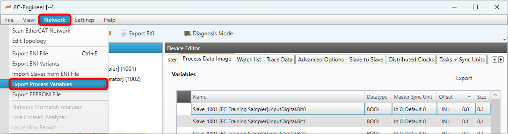

.. figure:: ../Media/PdAccess_ExportPdImage.png
    :align:     center
    :alt:

This will generate a header file containing the variables of the slaves as follows:

.. literalinclude:: ..\..\..\Doc\EcMaster\Snippets\ClassB\software-integration.h
    :start-after: DocumentationSnippetsPdAccessGeneratedPdLayoutHeaderStructure
    :end-before: DocumentationSnippetsPdAccessGeneratedPdLayoutHeaderStructure
    :language: cpp
    :lines: 2-

The following example demonstrates how to access process data variables using a generated PD layout C-header file in :cpp:func:`myAppWorkPd()`.

.. dropdown:: **Process data access using generated PD layout C-header file example**

    .. literalinclude:: ..\..\..\Doc\EcMaster\Snippets\ClassB\software-integration.h
        :start-after: DocumentationSnippetsPdAccessGeneratedPdLayoutHeaderExample
        :end-before: DocumentationSnippetsPdAccessGeneratedPdLayoutHeaderExample
        :language: cpp
        :dedent: 4
        :lines: 2-

.. note:: The offsets from the PD layout C-header file (:file:`PdLayout.h`) are byte offsets, *not* bit offsets!

It is possible to change the variable names of slaves before generating the PD layout C-header file to give them custom names:

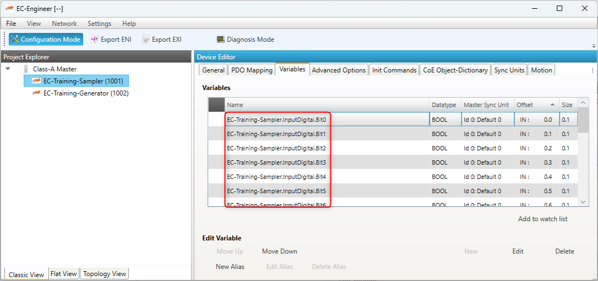

This will generate a header file containing the customized variable names of the slaves as follows:

.. literalinclude:: ..\..\..\Doc\EcMaster\Snippets\ClassB\software-integration.h
    :start-after: DocumentationSnippetsPdAccessGeneratedCustomPdLayoutHeaderStructure
    :end-before: DocumentationSnippetsPdAccessGeneratedCustomPdLayoutHeaderStructure
    :language: cpp
    :lines: 2-

.. dropdown:: **Process data access example using generated PD layout C-header file with customized variable names of the slaves**

    .. literalinclude:: ..\..\..\Doc\EcMaster\Snippets\ClassB\software-integration.h
        :start-after: DocumentationSnippetsPdAccessGeneratedCustomPdLayoutHeaderExample
        :end-before: DocumentationSnippetsPdAccessGeneratedCustomPdLayoutHeaderExample
        :language: cpp
        :dedent: 4
        :lines: 2-

.. note:: The offsets are subject to be changed if the ENI file changes. It is strongly recommended to determine the bit offsets of the variables on startup e.g. by querying the bit offset of a slave's process data by its station address from the |Product| stack using :cpp:func:`emGetCfgSlaveInfo` as described in the previous chapters instead of using hard coded values!

Process Data Access Functions
=============================

Process data variables that are packed as array of bits are bit aligned and not byte aligned in process data. See :c:macro:`EC_COPYBITS` for how to copy data areas with bit offsets that are not byte aligned. Getting and setting bits that are bit aligned and not byte aligned should be done using :c:macro:`EC_SETBITS` and :c:macro:`EC_GETBITS`. Accessing complete :c:macro:`EC_T_BYTE`, :c:macro:`EC_T_WORD`, :c:macro:`EC_T_DWORD`, :c:macro:`EC_T_QWORD` can be accessed more efficiently using the appropriate macros according to the following table.

.. note:: These functions do not initiate any transmission on the line. Process data is typically transmitted as little endian and must therefore be swapped on big endian systems such as PPC in order to be correctly interpreted, see e.g. :c:macro:`EC_SET_FRM_WORD`, :c:macro:`EC_GET_FRM_WORD` .

.. list-table::
    :widths: auto
    :header-rows: 1

    * - Variable Type
      - Bit Size
      - EC Type
      - Macro
    * - INTEGER8, UNSINGED8, BIT8
      - 8
      - EC_T_BYTE
      - N/A
    * - INTEGER16, UNSINGED16
      - 16
      - EC_T_WORD
      - :c:macro:`EC_SET_FRM_WORD`, :c:macro:`EC_GET_FRM_WORD`
    * - INTEGER32, UNSINGED32, REAL32
      - 32
      - EC_T_DWORD
      - :c:macro:`EC_SET_FRM_DWORD`, :c:macro:`EC_GET_FRM_DWORD`
    * - INTEGER64, UNSINGED64, REAL64
      - 64
      - EC_T_UINT64
      - :c:macro:`EC_SET_FRM_QWORD`, :c:macro:`EC_GET_FRM_QWORD`
    * - BOOLEAN, BIT1...BIT7
      - 1
      - EC_T_BOOL
      - :c:macro:`EC_SETBITS`, :c:macro:`EC_GETBITS`

.. raw:: latex

    \newpage

Process Data Memory
*******************

All mapped process data objects of the slaves are copied by the master into a process data memory image. New input values received from the slaves are written to the input process data image. New output values to be sent to the slaves are read from the output process data image.

The EC-Master uses two separate buffers where process data input values and process data output values are stored. The buffers used may either be always the same (fixed buffers) or be changed on every process data transfer cycle (dynamic buffers).

The EC-Master has different options for how the process data memory is provided.

#. EC-Master provides process data memory (fixed buffers)
#. User application registers an external memory provider with fixed buffers
#. User application registers an external memory provider with dynamic buffers

EC-Master as process data memory provider
=========================================

If the application does not register a memory provider, the EC-Master internally allocates the required memory needed to store input and output process data values during :cpp:func:`emConfigureNetwork`.
The EC-Master always uses the same buffers for reading/writing process data.

.. uml::

    skinparam monochrome true
    skinparam  SequenceBoxBorderColor transparent
    hide footbox

    participant App as "Application"
    box
    participant EcMaster as "EC-Master"
    database "PD-Memory"
    end box

    activate App

    App->EcMaster : emExecJob(eUsrJob_ProcessAllRxFrames)
    activate EcMaster
    EcMaster->EcMaster : Receive Frames
    EcMaster->"PD-Memory" : Write Input
    return
    |||
    App->EcMaster : emGetProcessImageInputPtr()
    activate EcMaster
    EcMaster->"PD-Memory"
    activate "PD-Memory"
    EcMaster<--"PD-Memory"
    deactivate "PD-Memory"
    App<--EcMaster : PD Input Pointer
    deactivate EcMaster
    |||
    App<-"PD-Memory" : **Read Input**

    App->App : Process
    |||
    App->EcMaster : emGetProcessImageOutputPtr()
    activate EcMaster
    EcMaster->"PD-Memory"
    activate "PD-Memory"
    EcMaster<--"PD-Memory"
    deactivate "PD-Memory"
    App<--EcMaster : PD Output Pointer
    deactivate EcMaster
    |||
    App->"PD-Memory" : **Write Output**
    |||
    App->EcMaster : emExecJob(eUsrJob_SendAllCycFrames)
    activate EcMaster
    EcMaster<-"PD-Memory" : Read Output
    EcMaster->EcMaster : Send Frames
    return

Application as process data memory provider with fixed buffers
==============================================================

The application may register a memory provider with :ref:`api:emIoControl - EC_IOCTL_REGISTER_PDMEMORYPROVIDER` in case the master shall use externally allocated memory to store input and output process data values.

.. uml::

    skinparam monochrome true
    skinparam  SequenceBoxBorderColor transparent
    hide footbox

    box
    database "PD-Memory"
    participant App as "Application"
    end box
    participant EcMaster as "EC-Master"

    activate App

    App->EcMaster : emExecJob(eUsrJob_ProcessAllRxFrames)
    activate EcMaster
    EcMaster->EcMaster : Receive Frames
    EcMaster->"PD-Memory" : **Write Input**
    return
    |||
    App<-"PD-Memory" : Read Input
    App->App : Process
    App->"PD-Memory" : Write Output
    |||
    App->EcMaster : emExecJob(eUsrJob_SendAllCycFrames)
    activate EcMaster
    EcMaster<-"PD-Memory" : **Read Output**
    EcMaster->EcMaster : Send Frames
    return

The memory provider may optionally supply callback functions to synchronize memory access between the application and the EC-Master.

Receiving new input process data:
    - :cpp:member:`EC_T_MEMPROV_DESC::pfPDInDataWriteRequest`
    - :cpp:member:`EC_T_MEMPROV_DESC::pfPDInDataWriteRelease`
Sending new output process data:
    - :cpp:member:`EC_T_MEMPROV_DESC::pfPDOutDataReadRequest`
    - :cpp:member:`EC_T_MEMPROV_DESC::pfPDOutDataReadRelease`

.. uml::

    skinparam monochrome true
    skinparam  SequenceBoxBorderColor transparent
    hide footbox

    box
    database "PD-Memory"
    participant App as "Application"
    end box
    participant EcMaster as "EC-Master"

    activate App
    App->EcMaster : emExecJob(eUsrJob_ProcessAllRxFrames)
    activate EcMaster
    EcMaster->EcMaster : Receive Frames
    EcMaster->App : pfPDInDataWriteRequest()
    activate EcMaster
    activate App
    App-->EcMaster
    deactivate App
    EcMaster->"PD-Memory" : **Write Input**
    EcMaster->App : pfPDInDataWriteRelease()
    activate App
    App-->EcMaster
    deactivate App
    |||
    deactivate EcMaster
    return
    |||
    App<-"PD-Memory" : Read Input
    App->App : Process
    App->"PD-Memory" : Write Output
    |||
    App->EcMaster : emExecJob(eUsrJob_SendAllCycFrames)
    |||
    activate EcMaster
    EcMaster->App : pfPDOutDataReadRequest()
    activate EcMaster
    activate App
    App-->EcMaster
    deactivate App
    EcMaster<-"PD-Memory" : **Read Output**
    EcMaster->App : pfPDOutDataReadRelease()
    activate App
    App-->EcMaster
    deactivate App
    deactivate EcMaster

    EcMaster->EcMaster : Send Frames
    return

Application as process data memory provider with dynamic buffers
================================================================

The application registers an external memory provider without fixed buffers via :ref:`api:emIoControl - EC_IOCTL_REGISTER_PDMEMORYPROVIDER` with the parameters :cpp:member:`EC_T_MEMPROV_DESC::pbyPDInData` and :cpp:member:`EC_T_MEMPROV_DESC::pbyPDOutData` set to :c:macro:`EC_NULL`. In this case, the EC-Master requests via the callback functions the buffer addresses cyclically when reading or writing process data. This mode can be used to implement dynamic buffering mechanisms between the application and the EC-Master, e.g. double buffering, triple buffering.

.. uml::

    skinparam monochrome true
    skinparam  SequenceBoxBorderColor transparent
    hide footbox

    box
    database "PD-Output"
    database "PD-Input"
    participant App as "Application"
    end box
    participant EcMaster as "EC-Master"

    activate App
    App->"PD-Input" : allocPdInBuffer()
    activate "PD-Input"
    App<--"PD-Input" :
    |||
    App->EcMaster : emExecJob(eUsrJob_ProcessAllRxFrames)
    activate EcMaster
    EcMaster->EcMaster : Receive Frames
    EcMaster->App : pfPDInDataWriteRequest()
    activate EcMaster
    activate App
    App->"PD-Input" : requestPdInBuffer()
    "PD-Input"-->App
    App-->EcMaster : return PdInBuffer
    deactivate App
    EcMaster->"PD-Input" : **Write Input**
    EcMaster->App : pfPDInDataWriteRelease()
    activate App
    App->"PD-Input" : releasePdInBuffer()
    App<--"PD-Input"
    App-->EcMaster
    deactivate App
    |||
    deactivate EcMaster
    return
    |||
    App<-"PD-Input" : Read Input
    activate App
    App->App : Process
    App->"PD-Input" : freePdInBuffer()
    App<--"PD-Input"
    deactivate "PD-Input"
    App->"PD-Output" : allocPdOutBuffer()
    activate "PD-Output"
    App<--"PD-Output"
    App->"PD-Output" : Write Output
    deactivate App
    |||
    App->EcMaster : emExecJob(eUsrJob_SendAllCycFrames)
    |||
    activate EcMaster
    EcMaster->App : pfPDOutDataReadRequest()
    activate EcMaster
    activate App
    App->"PD-Output" : requestPdOutBuffer()
    "PD-Output"-->App
    App-->EcMaster : return PdOutBuffer
    deactivate App
    EcMaster<-"PD-Output" : **Read Output**
    EcMaster->App : pfPDOutDataReadRelease()
    activate App
    App->"PD-Output" : freePdOutBuffer()
    App<--"PD-Output"
    deactivate "PD-Output"
    App-->EcMaster
    deactivate App
    deactivate EcMaster

    EcMaster->EcMaster : Send Frames
    EcMaster-->App

Error detection and diagnosis
*****************************

The EC-Master API generally return :c:macro:`EC_E_NOERROR` or an error code.

One of the parameters that the client must set when registering with the EC-Master is a generic notification callback function (:cpp:func:`emNotify`). If an error is detected, the master calls this function.

The EC-Master log messages are enabled if :cpp:struct:`EC_T_LOG_PARMS` is configured as described in :cpp:func:`emInitMaster` or configured using :cpp:func:`emSetLogParms`.

Cyclic cmd WKC validation
=========================

New input values received from the slaves will be written into the input process data memory only if the WKC of the corresponding datagram is not 0 and not greater than the configured WKC value.

.. seealso:: :ref:`api:emNotify - EC_NOTIFY_CYCCMD_WKC_ERROR`

Working Counter (WKC) State in Diagnosis Image
==============================================

Each cyclic Process Data cmd has its own WKC State bit in the diagnosis image. The state is updated on frame receiving, frame loss detection or link disconnection. All process data variables within a datagram have the same WKC State value.
If the WKC value of the received datagram is not as expected, the WKC State bit is set to 1 for this datagram (error). In case of Master Sync Units (MSU) if all the commands related to the MSU return WKC 0, the WKC State will be set to 1.

The WKC State offset within the Diagnosis Image is available at :cpp:struct:`EC_T_CFG_SLAVE_INFO` and :cpp:struct:`EC_T_PROCESS_VAR_INFO_EX`, :cpp:struct:`EC_T_MSU_INFO` see :cpp:func:`emGetDiagnosisImagePtr`, :cpp:func:`emGetCfgSlaveInfo`, :cpp:func:`emGetSlaveInpVarInfoEx`, :cpp:func:`emGetSlaveOutpVarInfoEx`, :cpp:func:`emGetMasterSyncUnitInfo`.

The application can check the WKC State of a variable e.g. as follows:

.. code-block:: cpp

    EC_T_CFG_SLAVE_INFO oSlaveInfo;
    EC_T_BYTE* pbyDiagnosisImage = emGetDiagnosisImagePtr();
    EC_T_BYTE byWkcState = 1;

    if (EC_NULL != pbyDiagnosisImage)
    {
        if (EC_NOERROR == emGetCfgSlaveInfo(EC_TRUE, 2302, &oSlaveInfo))
        {
            EC_GETBITS(pbyDiagnosisImage, &byWkcState, oSlaveInfo.wWkcStateDiagOffsOut[0], 1);
        }
    }

    if (1 == byWkcState)
    {
        /* ... error ... */
    }

.. seealso:: :ref:`software-integration:Cyclic cmd WKC validation`

Behavior in case of automatically adjusted expected WKC value
-------------------------------------------------------------

Optionally, the expected WKC value can be automatically adjusted according the state and the presence of the slaves. See :ref:`api:emIoControl - EC_IOCTL_SET_AUTO_ADJUST_CYCCMD_WKC_ENABLED`.
The WKC State bits change synchronized to the corresponding notification, e.g. on link disconnection all slaves disappear and the behavior is as follows:

- All WKC State bits are set to 1 as missing data is not expected.
- The Master notifies the application about the link disconnection and the disappearing of slaves
- All WKC State bits are set to 0 as it is now expected to have no process data if all slaves are absent.

.. seealso::
    - :ref:`api:emNotify - EC_NOTIFY_ETH_LINK_NOT_CONNECTED`
    - :ref:`api_busscan:emNotify - EC_NOTIFY_SLAVE_PRESENCE`

Master Sync Units (MSU)
=======================

MSUs are useful in grouping specific data (into consistency units)
- Process Image: Variables are stored together within one memory block
- Error checking: Own datagram(s) allow individual WKC state check (consistency unit)

.. figure:: ../Media/MasterSyncUnits_MSU.png
    :align:     center
    :alt:

Figure out the MSU offsets by calling the functions :cpp:func:`emGetMasterSyncUnitInfoNumOf` and :cpp:func:`emGetMasterSyncUnitInfo`, as described in the corresponding documentation.

EtherCAT traffic logging in application
***************************************

:cpp:func:`emLogFrameEnable`
:cpp:func:`emLogFrameDisable`

All network traffic can be recorded by starting EcMasterDemo with the parameter ``-rec``. For this ``EcMasterDemo`` needs to be compiled with preprocessor definition INCLUDE_PCAP_RECORDER defined. 
See ``class CPcapRecorder`` in :file:`EcLogging.h/cpp`.

.. dropdown:: **EtherCAT traffic logging Example**

    .. literalinclude:: ..\..\..\Doc\EcMaster\Snippets\ClassB\api.h
        :start-after: DocumentationSnippetsLogFrameEnableExampleHandler
        :end-before: DocumentationSnippetsLogFrameEnableExampleHandler
        :language: cpp
        :dedent: 4
        :lines: 1-

    .. literalinclude:: ..\..\..\Doc\EcMaster\Snippets\ClassB\api.h
        :start-after: DocumentationSnippetsLogFrameEnableExampleSetup
        :end-before: DocumentationSnippetsLogFrameEnableExampleSetup
        :language: cpp
        :dedent: 4
        :lines: 1-

    .. literalinclude:: ..\..\..\Doc\EcMaster\Snippets\ClassB\api.h
        :start-after: DocumentationSnippetsLogFrameDisableExample
        :end-before: DocumentationSnippetsLogFrameDisableExample
        :language: cpp
        :dedent: 4
        :lines: 1-

Trace Data
**********

Trace Data allows applications to trace data in real time on the network. To ensure real-time transmission, it is implemented as part of the cyclic process data.
They are placed behind the slave output data in the output area of the process data image of the EtherCAT application.
The trace data area can be configured either via the ENI with the help of the EC-Engineer or without changing the ENI using the API :cpp:func:`emTraceDataConfig`.

Trace Data can be captured with a network monitoring tool like Wireshark.

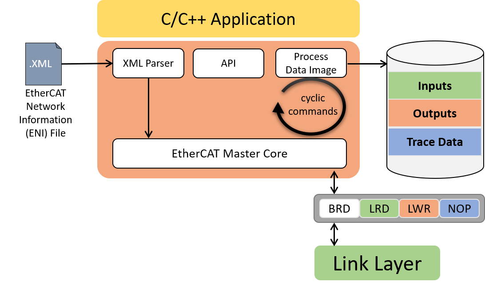

To transfer the data, an additional NOP cmd is appended to the end of the cyclic EtherCAT frame. The NOP cmd has ADP 0 and ADO 0x4154.
The EC-Master automatically fills the data area of the NOP Cmd with the current trace data when sending cyclic frames.
Since the trace data are transferred to the network as NOP Cmd, they are not evaluated by any ESC. Therefore, the WKC of the trace data remains 0 and the application cannot validate the data.

Trace Data configuration via EC-Engineer
========================================

The easiest and most comfortable way to create trace data variables is with the help of the EC-Engineer.
The necessary NOP cmd and the process data variables are automatically created and exported to the ENI. The process variables can be accessed as usual using the :cpp:func:`emFindOutpVarByNameEx` function.

Trace data variables of any size and number can be created in the Variables tab of the EC-Engineer:
    .. figure:: ../Media/TraceData_EcEng-NewVar.png
        :align:     center
        :alt:

The automatically created variable names can also be edited:
    .. figure:: ../Media/TraceData_EcEng-EditVar.png
        :align:     center
        :alt:

The generated process variables can be found in the exported ENI file:
    .. figure:: ../Media/TraceData_ENI-ProcImage.png
        :align:     center
        :alt:

As well as the NOP cmd:
    .. figure:: ../Media/TraceData_ENI-Cyclic.png
        :align:     center
        :alt:

Trace Data configuration via API
================================

The application can configure the trace data size using the :cpp:func:`emTraceDataConfig` API.
The trace data configuration must take place between the initialization of the EC-Master (:cpp:func:`emInitMaster`) and the configuration of the network (:cpp:func:`emConfigureNetwork`).
During :cpp:func:`emConfigureNetwork` the EC-Master tries to expand the process image output area by the trace data buffer and generates the corresponding NOP cmd.

Access to the trace data buffer is via an offset to the process data output image. The offset can be determined via the API :cpp:func:`emTraceDataGetInfo`.

Configuration of the trace data buffer:

.. literalinclude:: ..\..\..\Doc\EcMaster\Snippets\ClassB\software-integration.h
    :start-after: IGNORE_TEST(DocumentationSnippets, TraceData_ConfigViaApi)_Config
    :end-before: IGNORE_TEST(DocumentationSnippets, TraceData_ConfigViaApi)_Config
    :language: cpp
    :dedent: 4

Access to the trace data buffer:

.. literalinclude:: ..\..\..\Doc\EcMaster\Snippets\ClassB\software-integration.h
    :start-after: IGNORE_TEST(DocumentationSnippets, TraceData_ConfigViaApi)_GetInfo
    :end-before: IGNORE_TEST(DocumentationSnippets, TraceData_ConfigViaApi)_GetInfo
    :language: cpp
    :dedent: 4

.. warning::
    - Trace data, encapsulated in an additional EtherCAT Cmd, must fit in the first cyclic frame.
    - Trace data is not available for the fixed cyclic frame layout :cpp:enumerator:`EC_T_CYCFRAME_LAYOUT::eCycFrameLayout_FIXED`.

EtherCAT Master Stack Source Code
*********************************

In a source code delivery the master stack sources are divided into 4 parts:

- SDK Header files
- Real-time Ethernet Driver files (multiple Real-time Ethernet Drivers may be shipped)
- Link OS driver files (only valid for the Real-time Ethernet Drivers)
- Master stack files (configuration, core and interface layer)
- OS layer files (only valid for the master stack)

The master stack can be ported to several different operating systems and CPU architectures with different compilers and development environments. Typically no supported build environment files like IDE projects are shipped with the source code.

To build the master stack the appropriate build environment for the target operating system has to be used. If an integrated development environment (IDE) exists (Visual Studio, Eclipse, etc.) several projects containing all necessary files are needed to build the artefacts. If no integrated development environment is available makefiles and dependency rules may have to be created which contain the necessary master stack source and header files.

Components
==========

For most platforms three separate independent binaries will have to be generated:

#. Real-time Ethernet Driver Binary (e.g. a downloadable object moduel in VxWorks or a DLL in Windows). The Real-time Ethernet Driver binary will be dynamically bound to the application at runtime. (currently not for On Time RTOS-32 which uses static libraries)
#. Master Stack Library
#. Remote API Server Library

Real-time Ethernet Driver Binaries
----------------------------------

The following files have to be included into an IDE project or makefile:

- Real-time Ethernet Driver files. Only one single Real-time Ethernet Driver must be selected even if multiple Real-time Ethernet Drivers are shipped. For each Real-time Ethernet Driver a separate binary has to be created.
- Link OS layer files
- Windows: a dynamic link library (.dll) has to be created. The name of the DLL has to be emllXxxx.dll where Xxxx shall be replaced by the Real-time Ethernet Driver type (e.g. emllI8255x.dll for the I8255x Real-time Ethernet Driver).
- VxWorks: a downloadable kernel module (.out) has to be created. The name of the module has to be emllXxxx.out where Xxxx shall be replaced by the Real-time Ethernet Driver type (e.g. emllI8255x.out for the I8255x Real-time Ethernet Driver). sysLoSalAdd.c should be included in BSP if needed and should not be compiled within the Real-time Ethernet Driver binary
- Linux/QNX: a shared object library (.so) has to be created.
- RTX a RTX dynamic link library (.rtdll) has to be created. The name of the DLL has to be emllXxxx.dll where Xxxx shall be replaced by the Real-time Ethernet Driver type (e.g. emllI8255x.dll for the I8255x Real-time Ethernet Driver).
- INtime: a shared library (.rsl) has to be created. The name of the RSL has to be emllXxxx.rsl where Xxxx shall be replaced by the Real-time Ethernet Driver type (e.g. emllI8255x.rsl for the I8255x Real-time Ethernet Driver).

Master Stack Binaries
---------------------

The following files have to be included into an IDE project or makefile:

- Master stack files
- OS layer files
- For all platforms a static library has to be created. This library will have to be linked together with the application.

Remote API Server Binaries
--------------------------

The following files have to be included into an IDE project or makefile:

- Remote API server files.
- For all platforms a static library has to be created. This library will have to be linked together with the application.

.. seealso:: :ref:`toc_os:Platform and Operating Systems (OS)` for required tool chain settings

Excluding features
==================

It is possible to reduce the footprint of the master library and improve its execution performance by compiling less features.

EXCLUDE_EOE_ENDPOINT
    FP-EoE-Endpoint
EXCLUDE_HOTCONNECT
    FP-Hot-Connect
EXCLUDE_JUNCTION_REDUNDANCY
    FP-Cable-Redundancy
EXCLUDE_MASTER_OBD
    FP-Master-Object-Dictionary
EXCLUDE_RED_DEVICE
    FP-Cable-Redundancy
EXCLUDE_SPLITTED_FRAME_PROCESSING
    FP-Split-Frame-Processing
EXCLUDE_DC_SUPPORT
    Class-A

The following defines and their impact are described below:

EXCLUDE_ADS_ADAPTER
    | :cpp:func:`emAdsAdapterStart`
    | :cpp:func:`emAdsAdapterStop`
EXCLUDE_AOE_SUPPORT
    | :cpp:func:`emAoeGetSlaveNetId`
    | :cpp:func:`emAoeRead`
    | :cpp:func:`emAoeReadReq`
    | :cpp:func:`emAoeWrite`
    | :cpp:func:`emAoeWriteReq`
    | :cpp:func:`emAoeReadWrite`
    | :cpp:func:`emAoeWriteControl`
EXCLUDE_BAD_CONNECTIONS
    | :cpp:func:`emBadConnectionsDetect`
EXCLUDE_CONFIG_EXTEND
    | :cpp:member:`EC_T_CFG_SLAVE_INFO::bExtended`
    | :cpp:func:`emConfigExtend`
EXCLUDE_DCX
    | DCM DCX mode
EXCLUDE_EEPROM_SUPPORT
    | :cpp:func:`emReadSlaveEEPRom`
    | :cpp:func:`emReadSlaveEEPRomReq`
    | :cpp:func:`emWriteSlaveEEPRom`
    | :cpp:func:`emWriteSlaveEEPRomReq`
    | :cpp:func:`emReloadSlaveEEPRom`
    | :cpp:func:`emReloadSlaveEEPRomReq`
    | :cpp:func:`emAssignSlaveEEPRom`
    | :cpp:func:`emAssignSlaveEEPRomReq`
    | :cpp:func:`emActiveSlaveEEPRom`
    | :cpp:func:`emActiveSlaveEEPRomReq`
EXCLUDE_EOE_DEFFERED_SWITCHING
    :cpp:enumerator:`EC_T_USER_JOB::eUsrJob_SwitchEoeFrames`
EXCLUDE_EOE_ENDPOINT
    :cpp:func:`emEoeRegisterEndpoint`
EXCLUDE_EXECJOB_REENTRANCY_SUPPORT
    |
EXCLUDE_FOE_SUPPORT
    | :cpp:func:`emFoeFileUpload`
    | :cpp:func:`emFoeUploadReq`
    | :cpp:func:`emFoeFileDownload`
    | :cpp:func:`emFoeDownloadReq`
    | :cpp:func:`emFoeSegmentedUploadReq`
    | :cpp:func:`emFoeSegmentedDownloadReq`
EXCLUDE_FORCE_PROCESSDATA
    | :cpp:func:`emForceProcessDataBits`
    | :cpp:func:`emReleaseProcessDataBits`
    | :cpp:func:`emReleaseAllProcessDataBits`
EXCLUDE_FRAME_LOGGING
    | :cpp:func:`emLogFrameEnable`
EXCLUDE_FRAME_LOSS_SIMULATION
    | :ref:`api:emIoControl - EC_IOCTL_SET_FRAME_LOSS_SIMULATION`
    | :ref:`api:emIoControl - EC_IOCTL_SET_RXFRAME_LOSS_SIMULATION`
    | :ref:`api:emIoControl - EC_IOCTL_SET_TXFRAME_LOSS_SIMULATION`
EXCLUDE_GEN_OP_ENI
    | :cpp:func:`emConfigExtend`
EXCLUDE_INTERFACE_LOCK
    | No API protection against InitMaster/DeinitMaster
EXCLUDE_LINE_CROSSED_DETECTION
    | No line crossed detection
EXCLUDE_LOG_MESSAGES
    | No Log messages generated
EXCLUDE_MAILBOX_STATISTICS
    | :cpp:member:`EC_T_MASTER_INFO::MailboxStatistics`
EXCLUDE_MASTER_OBD
    | :cpp:member:`EC_T_MASTER_INFO::BusDiagnosisInfo`
EXCLUDE_MASTERSYNCUNITS
    | :cpp:member:`EC_T_CFG_SLAVE_INFO::awMasterSyncUnitIn`
    | :cpp:func:`emGetMasterSyncUnitInfoNumOf`
    | :cpp:func:`emGetMasterSyncUnitInfo`
EXCLUDE_MEMORY_PROVIDER
    | :ref:`api:emIoControl - EC_IOCTL_REGISTER_PDMEMORYPROVIDER`
EXCLUDE_MULTIPLE_CYC_ENTRIES
    | :ref:`api:emIoControl - EC_IOCTL_GET_CYCLIC_CONFIG_INFO`
    | :cpp:enumerator:`EC_T_USER_JOB::eUsrJob_ProcessRxFramesByTaskId`
    | :cpp:enumerator:`EC_T_USER_JOB::eUsrJob_SendCycFramesByTaskId`
EXCLUDE_PORT_OPERATION
    | :cpp:func:`emBlockNode`
    | :cpp:func:`emOpenBlockedPorts`
    | :cpp:func:`emSetSlavePortState`
EXCLUDE_RAWMBX_SUPPORT
    | :cpp:func:`emClntSendRawMbx`
EXCLUDE_RED_DEVICE
    | :cpp:member:`EC_T_MASTER_INFO::RedundancyDiagnosisInfo`
EXCLUDE_RESCUE_SCAN
    | :cpp:func:`emRescueScan`
EXCLUDE_S2SMBX_SUPPORT
    | :cpp:member:`EC_T_INIT_MASTER_PARMS::dwMaxS2SMbxSize`
    | :cpp:member:`EC_T_INIT_MASTER_PARMS::dwMaxQueuedS2SMbxTfer`
EXCLUDE_SLAVE_HANDLING
    | :cpp:member:`EC_T_CFG_SLAVE_INFO::bDisabled`
    | :cpp:member:`EC_T_CFG_SLAVE_INFO::bDisconnected`
    | :cpp:func:`emSetSlaveDisabled`
    | :cpp:func:`emSetSlavesDisabled`
    | :cpp:func:`emSetSlaveDisconnected`
    | :cpp:func:`emSetSlavesDisconnected`
EXCLUDE_SLAVE_IDENTIFICATION
    | ``/EtherCATConfig/Config/Slave/Info/Identification``
    | :cpp:member:`EC_T_CFG_SLAVE_INFO::wIdentifyAdo`
    | :cpp:func:`emReadSlaveIdentification`
EXCLUDE_SLAVE_STATISTICS
    | :cpp:func:`emGetSlaveStatistics`
    | :cpp:func:`emClearSlaveStatistics`
EXCLUDE_SOE_SUPPORT
    | :cpp:func:`emSoeRead`
    | :cpp:func:`emSoeReadReq`
    | :cpp:func:`emSoeWrite`
    | :cpp:func:`emSoeWriteReq`
    | :cpp:func:`emSoeAbortProcCmd`
EXCLUDE_SPLITTED_FRAME_PROCESSING
    | EC_IOCTL_SET_SPLITTED_FRAME_PROCESSING_ENABLED
    | :cpp:enumerator:`EC_T_USER_JOB::eUsrJob_ProcessRxFramesByTaskId`
EXCLUDE_TEXT
    | :cpp:func:`ecatGetText`
    | :cpp:func:`ecatGetNotifyText`
EXCLUDE_TRACE_DATA
    |
EXCLUDE_TRACE_DATA_VARINFO
    | :cpp:func:`emTraceDataConfig`
    | :cpp:func:`emTraceDataGetInfo`
EXCLUDE_VARREAD
    | :cpp:member:`EC_T_CFG_SLAVE_INFO::wNumProcessVarsInp`
    | :cpp:member:`EC_T_CFG_SLAVE_INFO::wNumProcessVarsOutp`
    | :cpp:func:`emGetSlaveInpVarInfoNumOf`
    | :cpp:func:`emGetSlaveOutpVarInfoNumOf`
    | :cpp:func:`emGetSlaveInpVarInfo`
    | :cpp:func:`emGetSlaveInpVarInfoEx`
    | :cpp:func:`emGetSlaveOutpVarInfo`
    | :cpp:func:`emGetSlaveOutpVarInfoEx`
    | :cpp:func:`emGetSlaveOutpVarByObjectEx`
    | :cpp:func:`emGetSlaveInpVarByObjectEx`
    | :cpp:func:`emFindOutpVarByName`
    | :cpp:func:`emFindOutpVarByNameEx`
    | :cpp:func:`emFindInpVarByName`
    | :cpp:func:`emFindInpVarByNameEx`
EXCLUDE_VOE_SUPPORT
    | :cpp:func:`emVoeRead`
    | :cpp:func:`emVoeWrite`
    | :cpp:func:`emVoeWriteReq`
EXCLUDE_WKCSTATE
    | :cpp:member:`EC_T_CFG_SLAVE_INFO::wWkcStateDiagOffsIn`
    | :cpp:member:`EC_T_CFG_SLAVE_INFO::wWkcStateDiagOffsOut`
    | :cpp:func:`emGetDiagnosisImagePtr`

Reduced Feature Set
*******************

On chosen platforms several EC-Master libraries with excluded features are available. They can be used to increase the performances or to reduce the footprint.
They are defined incrementally as following. Each level includes the previous one:

Rfs1: Convenience functionality excluded
========================================

.. doxygengroup:: EC_BUILD_RFS1
    :content-only:

Rfs2: Rare functionalities excluded
===================================

.. doxygengroup:: EC_BUILD_RFS2
    :content-only:

Rfs3: Common functionalities excluded
=====================================

.. doxygengroup:: EC_BUILD_RFS3
    :content-only:

Rfs4: Error detection and diagnosis excluded
============================================

.. doxygengroup:: EC_BUILD_RFS4
    :content-only:

Rfs5: Only CoE slaves supported
===============================

.. doxygengroup:: EC_BUILD_RFS5
    :content-only:

