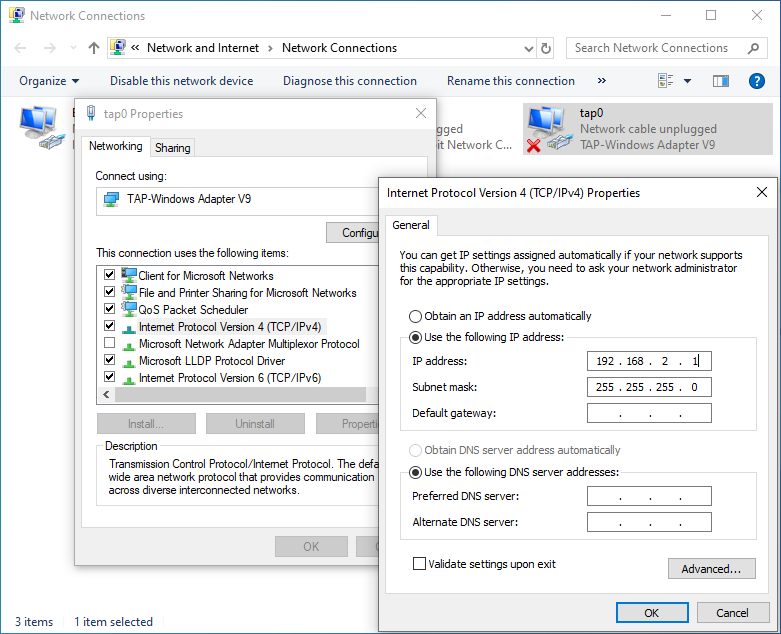

*************************
TAP devices
*************************

TAP devices are virtual network devices. Being network devices supported entirely in software, they differ from ordinary network devices which are backed up by hardware network adapters. 
Packets sent by an operating system via a TAP device are delivered to a user-space program which attaches itself to the device. A user-space program may also pass packets into a 
TAP device. In this case the TAP device "injects" these packets to the operating-system network stack thus emulating their reception from an external source.

Overview
********
    .. figure:: ../Media/EoE-Endpoint_Architecture.PNG
        :align:     center
        :alt:   

Integration in the EC-Master application
****************************************

1. Add :file:`taped.cpp` to your project
2. Include :file:`taped.h` into your EC-Master application
3. Start the EoE endpoint driver: Add the following code once for example in myAppSetup():
    .. code-block:: cpp
        
        TapEdParams_t tapedParams;
        TapEdInitParams(&tapedParams);
        strcpy(tapedParams.IfaceName, "tap0");
        tapedParams.CreateTxEvent = true;
        tapedParams.MasterInstanceID = 0; // 0 first, 1 2nd,
        TapEdHandle_t S_hTapDrv = TapEdInstall(&tapedParams); 
        //else S_hTapDrv  must be initialized with zero
    
4. In any cyclic loop trigger the send thread with:
    .. code-block:: cpp

        TapEdTriggerTxEvent(S_hTapDrv);

    For optimal performance, it is recommended, but not required, to make this call in the EtherCAT job task (e.g. in tEcJobTask()) after cyclic frames are received from the EtherCAT bus.

5. Stop EoE endpoint driver with:
    .. code-block:: cpp
    
       TapEdUninstall(S_hTapDrv);
       S_hTapDrv = EC_NULL;

Windows
*******

1. Download and install the TAP-Windows driver from OpenVPN (https://openvpn.net/community-downloads/).

.. note:: The OpenVPN Service or traffic encryption is not related to the EC-EoE-EndPoint. Only the `TAP Virtual Ethernet Adpater` component is required (https://github.com/OpenVPN/tap-windows6/releases).

2. Configure the interface

.. figure:: ../Media/OpenVPN_Setup.png
    :alt:

The EoE devices and the TAP adapter must be **in the same IPv4 subnet** and it must be **independent of the other network addresses** used on the EC-EoE-EndPoint system.

Example of independent subnets for LAN and EoE:

.. code-block::

    LAN: 192.168.0.1, netmask 255.255.255.0 (192.168.0.x)
    EoE: 192.168.2.1, netmask 255.255.255.0 (192.168.2.x)

The command `ipconfig /all` shows the ip addresses and netmasks of the networks. The EoE network must be independent from the other network addresses.

The IPv4 addresses of the EoE devices are manually assigned in the EtherCAT network configuration using EC-Engineer or another EtherCAT configuration tool and are finally part of the ENI file loaded at EC-Master.

The IPv4 address for EoE must be assigned at the TAP adapter:

.. note:: Disabling and re-enabling the "NonAdmin Access" on the TAP driver can sometimes fix communication issues.

3. Start EC-Master application

   Check if there are two additional threads ``tTapTx`` and ``tTapRx``.

4. The EoE endpoint driver should work now. Try to ping your EoE device.

Linux
*****

#. Create the TAP interface. On your shell type:
    .. code-block:: bash
  
        tunctl -t tap0
   
    If tunctl is not installed, e.g. for Ubuntu you can type:
  
    .. code-block:: bash
   
        apt-get install uml-utilities
   
#. Configure the interface. E.g. on your shell type:
    .. code-block:: bash

        ip link set tap0 up
        ip addr add 10.0.0.2/24 dev tap0
   
#. Start the EC-Master application
    Check if there are two additional threads ``tTapTx`` and ``tTapRx``. E.g. with:
  
    .. code-block:: bash
  
        ps -eL -o pid,tid,rtprio,pri,class,cmd,comm,psr,%cpu
    
#. The EoE endpoint driver should work now. Try to ping your EoE device.

Windows-CE
**********
1. Modify your BSP

   * Put the NDIS/tap folder inside your CE-BSP. E.g. in :file:`[WINCE700]/platform/CeWin/SRC/DRIVERS/tap`

   * Add tap directory to your "dirs" file: DIRS=tap

   * Modify your :file:`.bib` file. E.g. :file:`platform.bib`: :file:`tap-ce.dll`  :file:`$(_FLATRELEASEDIR)/tap-ce.dll`  NK  SHK  

   * Modify your :file:`.reg` file and setup an IP address. Please see content of :file:`NDIS-TAP.config`

2. Integrate :file:`taped.c` and :file:`taped.h` as decribed above

    .. note::
    
        Please use TAP0: as interface name
    
    .. code-block:: cpp
        
        wcscpy (tapedParams.IfaceName, L"TAP0:"); 
   
3. Start EC-Master application

   Check if there are two additional threads ``tTapTx`` and ``tTapRx``.

4. The EoE endpoint driver should work now. Try to ping your EoE device.

