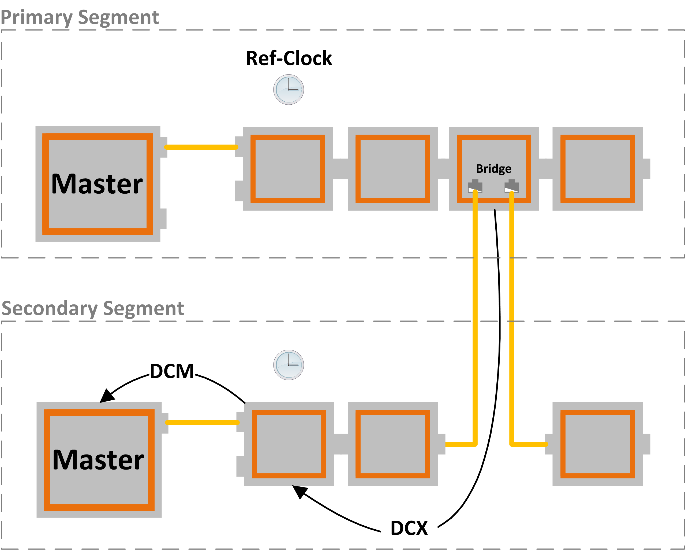

************
Introduction
************

The external synchronization feature pack allows the synchronization of two or more EtherCAT segments by a Bridge device as shown in the picture below. 

The Bridge has two EtherCAT connections. The primary port is connected to the primary segment; the secondary port is connected to the secondary segment. The Bridge provides an internal (primary port) and an external (secondary port) time stamp which is used by the Master to adjust the Ref-Clock. 

The Bridge device must support the *“External Synchronization Status”* PDO 0x10F4 see document ETG.1020 chapter *“21.1.2 Synchronization by a Bridge device”*.

During startup the two segments can be powered-on at different times. That means that there will be an absolute time difference between the two segments.

The synchronization process is divided in two parts; DCM and DCX.
  - DCM: MasterShift, synchronize Master timer to slave.
  - DCX: BusShift, Synchronize slaves to bridge device.

.. note:: This document contains only *“External Synchronization”* specific details. For any basic knowledge about EC-Master, Distributed Clocks and DCM that may be required, see the EC-Master manuals https://developer.acontis.com/ec-master#manuals.
