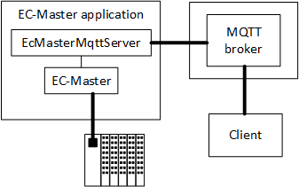

************
Introduction
************

The MQTT (Message Queueing Telemetry Transport) functionality allows to query configuration of and to control EC-Master stack running on a target.

Typical setup
***************

In common case EC-Master is connected to a MQTT broker and serves requests over EcMasterMqttServer library.

