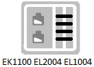
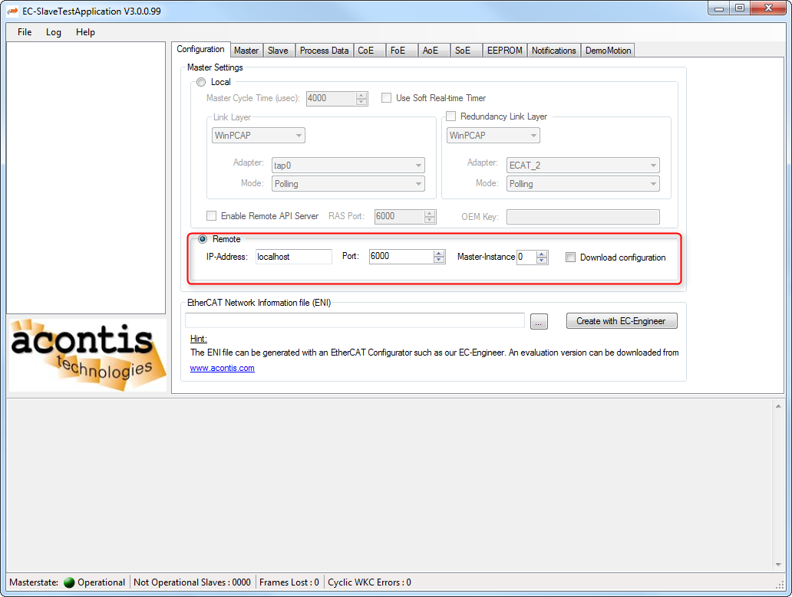
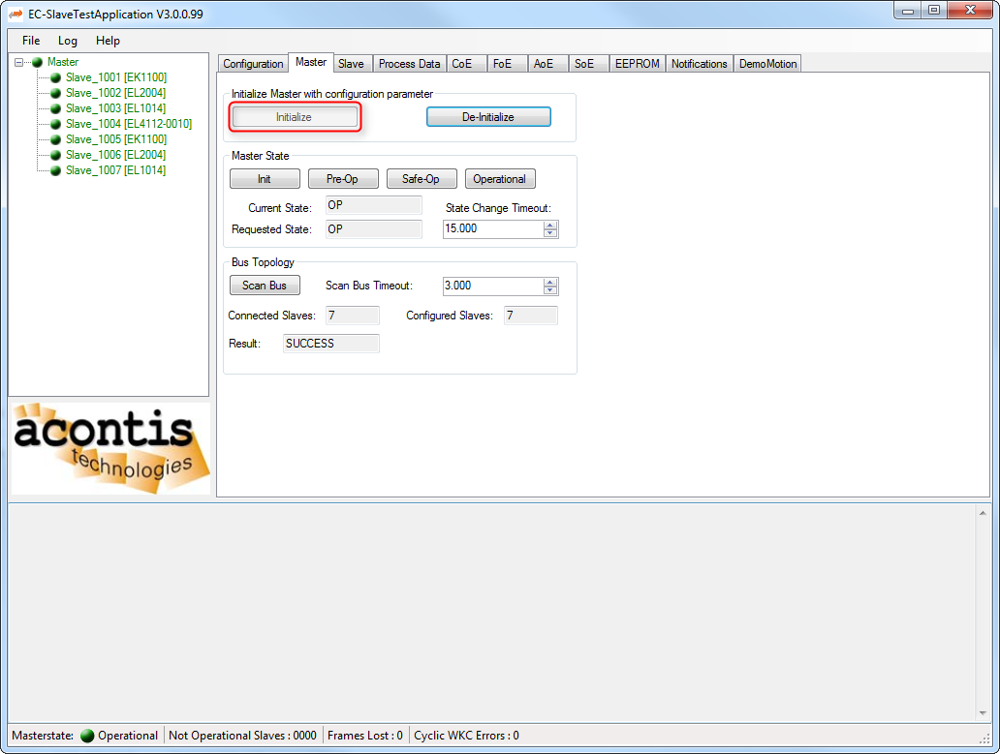

***************
Getting started
***************

The EcMasterDemoMasterRed that is part of the EC-Master Feature Pack Master Redundancy rudimentary demonstrates how to apply Master Redundancy. 

.. important:: Disclaimer: The EcMasterDemoMasterRed may lead to system failure, crashes or other harm and is not intended for usage in productive environments!

The EcMasterDemoMasterRed can be used to demonstrate and analyze the behavior at fail-over. Furthermore the network payload and content like process data exchange can be analyzed using e.g. Wireshark.

Topology
********

The following figure shows the failure locations that are demonstrated within this chapter. As shown in the figure a diagnostic PC can connect to the EcMasterDemoMasterRed at e.g. Master 1. This can be used to establish a TCP/IP connection to Master 2. Therefore the EcMasterDemoMasterRed must be started with parameter “-sp”.

.. figure:: ../Media/master-red_demo-topology.png
    :alt:
    
The topology contains two stations each consistent of e.g. an EK1100, EL2004, EL1004. To demonstrate INPUT update at INACTIVE Master, physically connect the IOs of EL2004 and EL1004:

    
The network description must be provided as ENI file to EcMasterDemoMasterRed with parameter “-f”.

Virtual Networking
******************

In order to apply networking using Master-To-Master EtherCAT® communication the EcMasterDemoMasterRed needs a TAP adapter. On Microsoft© Windows the Tap-windows installer from https://openvpn.net/index.php/open-source/downloads.html and on Linux the package uml-utilities provide this. 

The IP addresses of the Masters must be different and setup at the network adapter properties of the Master’s operating system. 

.. important:: The default MTU of 1500 must be reduced to because fragmentation is not supported at encapsulating the Master-To-Master communication in EtherCAT®! (REQ039)

Simple Arbitration
******************

The EcMasterDemoMasterRed awaits on start-up communication from an eventual ACTIVE Master. After waiting this time, the EcMasterDemoMasterRed gets ACTIVE. Just in case that two instances got ACTIVE at the same time, collisions are handled with a simple arbitration by randomly sleeping 1 … 10 ms. Therefore if both Masters are simultaneously starting up, one will win the arbitration and become ACTIVE (OPERATIONAL) and the other will fall back to INACTIVE.
 
When the Master is OPERATIONAL, the EcMasterDemoMasterRed immediately exits on collisions:

.. figure:: ../Media/master-red_state-changes.png
    :alt:
    
Fail-over
*********

Fail-over with failing Master
=============================

The following steps demonstrate fail-over with line break between slaves:

#. On Master 1, start EcMasterDemoMasterRed. It will become ACTIVE.
#. Master 1 reports EtherCAT® State OPERATIONAL.
#. Master 1 changes OUTPUTs automatically.
#. Master 1 logs INPUT changes automatically.
#. On Master 2, start EcMasterDemoMasterRed. It will be INACTIVE (receives frames from ACTIVE). 
#. Master 2 updates its Process Data Image OUTPUTs and INPUTs when processing frames from Master 1 at Store and Forward.
#. Master 2 reports EtherCAT® State OPERATIONAL, too.
#. Master 2 logs INPUT changes, too.
#. Disconnect cable between Master 1 and Master 2.
#. Disconnect cable between Master 1 and the slaves.
#. Master 1 becomes INACTIVE (because all links lost) and Master 2 becomes ACTIVE (due to communication time-out).

-> Master 1 will report EtherCAT® State UNKNOWN.

-> Master 2 changes OUTPUTs automatically (Fail-over done).

-> On reconnecting the cables, Master 1 will synchronize again with Master 2.
 
Fail-over with failing Master and failing Slaves
================================================

The following steps demonstrate fail-over with line break between slaves:

#. On Master 1, start EcMasterDemoMasterRed. It will become ACTIVE.
#. Master 1 changes OUTPUTs automatically.
#. Master 1 logs INPUT changes automatically.
#. On Master 2, start EcMasterDemoMasterRed. It will be INACTIVE (receives frames from ACTIVE). 
#. Master 2 updates its Process Data Image OUTPUTs and INPUTs when processing frames from Master 1 at Store and Forward.
#. Master 2 logs INPUT changes automatically, too.
#. Disconnect cable between the two slave stations.
#. The network is still full OPERATIONAL due to Cable Redundancy and Store and Forward.
#. Disconnect cable between Master 1 and the slaves. The disconnected slaves disappear, but the others are still reachable.
#. Disconnect cable between Master 1 and Master 2.
#. Master 1 becomes INACTIVE (because all links lost) and Master 2 becomes ACTIVE (due to communication time-out).
#. Master 1 will report EtherCAT® State UNKNOWN.

-> Master 2 changes OUTPUTs automatically (Fail-over).

-> Master 2 scans the network. If the missing slaves are mandatory according to the network configuration (ENI), Master 2 reports Bus Mismatch.

-> Master 2 fully applied the topology change (Fail-over done).

-> Re-connecting the cable as EcMasterDemoMasterRed needs collision handling!

Master-To-Master networking
***************************

Accessing the target operating system using TCP/IP needs EoE-Endpoints installed. See pre-processor define “INCLUDE_TAPED”

The following steps establish a TCP connection between Master 1 and Master 2:

#.	On Master 1, start EcMasterDemoMasterRed. It will become ACTIVE.
#.	On Master 2, start EcMasterDemoMasterRed. It will be INACTIVE.
#.	It is now possible to ping Master 2 from Master 1 and vice versa.

IP communication is now possible with the following restrictions:

- The MTU must be reduced so the Master can encapsulate the IP frames from TAP in EtherCAT®.

- The communication has reduced bandwidth as it must be encapsulated in acyclic frames.  (REQ040)

- The transmission timing is determined by the EtherCAT® cycle.

Remote connection
*****************

The following steps establish a RAS connection to Master 2 via Master 1:

#.	On Master 1, start EcMasterDemoMasterRed. It will become ACTIVE.
#.	On Master 2, start EcMasterDemoMasterRed. It will be INACTIVE.
#.	Start the EC-Engineer or EC-Lyser and connect to Master 1 with EoE over RAS enabled.
#.	It is now possible to connect to Master 2 from another EC-Engineer instance.

*********************
EcMasterDemoMasterRed
*********************

The FP Master Redundancy contains the EcMasterDemoMasterRed including its sources.

Setting up and running EcMasterDemoMasterRed in Hot Standby
***********************************************************

The virtual network feature needs a TAP interface. To install and configure execute the following steps:

#. Install uml-utilities on your Linux distribution, e.g.

    .. prompt:: bash
    
        apt-get install uml-utilities
    
#. Create the TAP interface

    .. prompt:: bash
    
        tunctl -t tap0
    
#. Configure the interface, e.g.

    .. prompt:: bash

        ip link set tap0 up
        ip addr add 10.0.0.2/24 dev tap0
        ifconfig tap0 mtu 200 up
    
#. Add static ip-route(if necessary)

    .. prompt:: bash

        ip route add xxx.xxx.xx.x/24 via 10.0.0.2
        echo 1 > /proc/sys/net/ipv4/ip_forward

The EcMasterDemoMasterRed will install the tap driver if compiled with INCLUDE_TAPED defined.

To start EcMasterDemoMasterRed the full path and file name of the configuration file has to be 
given as a command line parameter as well as the appropriate Main/Red Real-time Ethernet Drivers in interrupt mode.

.. prompt:: bash

    ./EcMasterDemoMasterRed -f MasterRedENI.xml -intelgbe 0x01bbddff 0 -intelgbe 0x01bbddff 0 -b 50000 -t 0 -sp [-standby]

.. seealso:: Command line parameters and Intel Pro/1000 - emllIntelGbe

Parameter -standby prevents the master to get ACTIVE. As soon as the Masters are ready they can be switched from Permanent Standby to Hot Standby using :ref:`emNotify - EC_NOTIFY_APP_MASTER_RED_UNFORCE_STANDBY`.

Switchover EcMasterDemoMasterRed
********************************

The EcMasterDemoMasterRed demo program implements the functionality to switchover the ACTIVE Master to INACTIVE and the INACTIVE Master to ACTIVE via notifications.

To coordinate a switchover the following steps are required:

#. Start Master 1 demo in permanent INACTIVE state (Parameter -standby).
#. Start Master 2 demo which will become ACTIVE.
#. Unforce permanent standby with :ref:`emNotify - EC_NOTIFY_APP_MASTER_RED_UNFORCE_STANDBY` (Code = 2) notification sent to Master 1.
#. Set Master 2 in INACTIVE state with notification :ref:`emNotify - EC_NOTIFY_APP_MASTER_RED_FORCE_STANDBY` (Code = 1). Master 1 will automatically get ACTIVE on communication timeout.

The notifications can be send with the EC-SlaveTestApplication via a remote connection to the masters see Figures 16-18.
To enable remote connection start EcMasterDemoMasterRed with command line parameter -sp. 

    
.. figure:: ../Media/master-red_notification-ec-sta.png
    :alt:
    