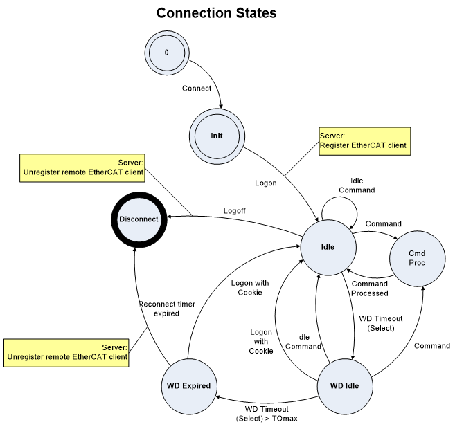

************
Introduction
************

In a Linux system, when a secondary process, such as an OPC Server, needs to access EtherCAT® bus data or perform operations on the EtherCAT® stack, the Remote API provides an interface to facilitate this access. Since two applications in Linux cannot directly access each other’s memory, the Remote API utilizes a TCP/IP connection. This approach not only enables inter-process communication within the same device but also allows access to the Remote Interface from other host systems, such as Windows or similar platforms.

Remote API Structure
********************

The Remote API works based on TCP/IP sockets, which is almost completely transparent to the calling application.

.. figure:: ../Media/ras_structure.png
    :alt:
    
All a remote application has to take care for is, to initialize the remote API DLL which contains the abstraction of the connection to the Remote Server. After initializing the connection all calls (which are supported remotely) may be used as usual with a “local” master stack. Of course the master stack itself has to run with the additional Remote API Server library which has to be set - up to accept remote clients.

.. figure:: ../Media/ras_code-module.png
    :alt:
    
Connection states
*****************

In some cases, it is necessary to take care about the internal structure of the Remote API connection, while using a Remote connection. The Remote API library supports a reconnect to the Master Stack in case of a temporary disconnection (e.g. line break). This recoverage of a connection may take place within a well-defined time if it does not, the connection is established newly and an error is notified which has to be taken in account by the fact that the Registered Client has to be Re-Registered and all used Mailbox objects have to be created again after such a reconnect attempt. This is necessary due to the fact, the Remote API Server tries to keep the Master Stack free from unused Memory to provide the highest possible availability and a minimum influence on the Real-Time Application used with the Master Stack (e.g. the PLC Runtime system).

The different states used within the connection’s life are shown in below figure. This illustration is only shown to give a clue about the things happening within the Remote API “Layer”. All the programmer of a remote application has to take care for is, if the reconnect to the Remote API Server fails because the reconnection timeout has expired, all volatile objects described before have to be re - created.

    