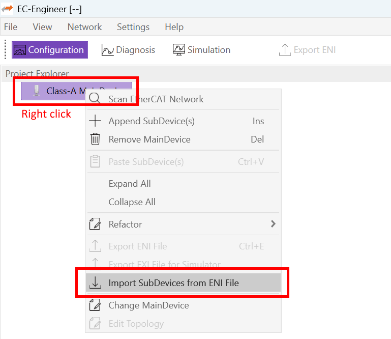
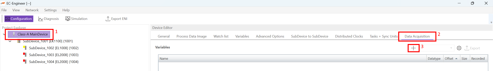
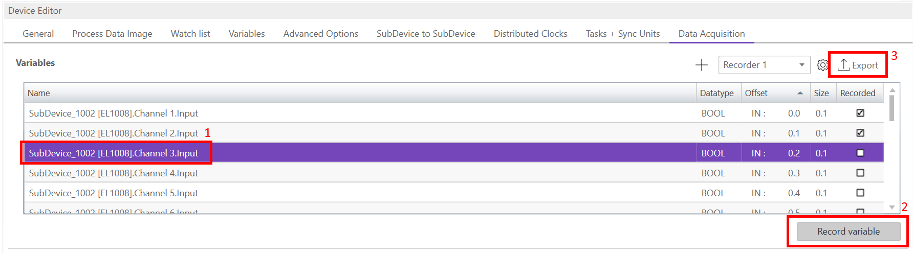
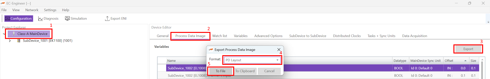
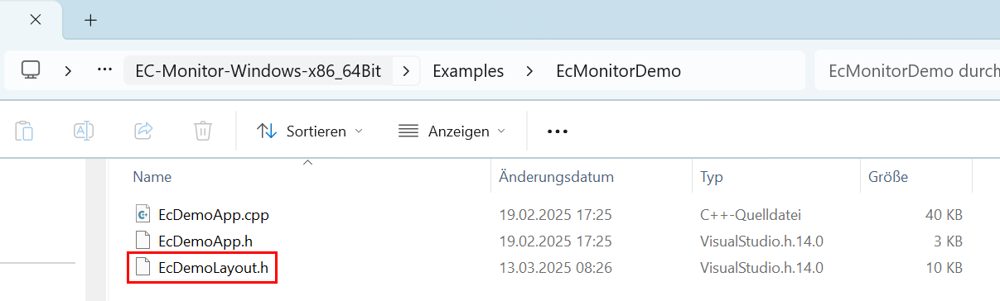

.. _Running:

**************************
Running the |Product| Demo
**************************

After the |Product| is installed and the network adapter connected to the TAP device and the |ECAT| Network Information (ENI) file are prepared, the demo can be run.

- Connect the network as specified by the ENI file. Insert the TAP device, ideally between the MainDevice and the first SubDevice.
- Open a terminal to :file:`<InstallPath>\\Bin\\Windows\\x64`.
- On Windows, run

  .. prompt:: bash

    ./EcMonitorDemo -ndis <adapter ip address> 1 -f <path to eni.xml> -rec <path to record>
- On Linux, run

  .. prompt:: bash

    ./EcMonitorDemo -sockraw <network link name> 1 -f <path to eni.xml> -rec <path to record>

The respective adapter ip address or network link name connected to the TAP device has to be used, see :ref:`install`. For other operating systems, see chapter *"Platform and Operating Systems (OS)"* in the |Product| User Manual. Alternatively, the :command:`-play <path to *.pcap / *.pcapng>` parameter can be used to process previously recorded instead of live traffic.

The |Product| will record the |ECAT| network traffic in pcap-ng format to the file provided to the :command:`-rec` parameter. For a full list of command line parameters, see chapter *"Command line parameters"* in the |Product| User Manual.

.. _Acquisition:

Data Acquisition
****************

The |Product| Demo is capable of periodically recording variable values of SubDevices in the |ECAT| network in MF4 and CSV formats.

In EC-Engineer, configure the network or import the |ECAT| Network Information (ENI) file.

After the network is configured, select the MainDevice, navigate to the :command:`Data Acquisition` tab, and press :command:`+` to create a new record file. Select the file format (MF4 or CSV) and path as needed.

Select the variable(s) to be included in the record and press :command:`Record variable` for each. After all desired variables have been selected, press :command:`Export` to export the recorder configuration file to the desired path.

Finally, run the |Product| Demo according to :ref:`Running`, but replace the :command:`-rec <path to record>` parameter with :command:`-daqrec <path to recorder.xml>`. The output file according to the recorder configuration file will contain the recorded data.

Extending the |Product| Demo
****************************

The source code of the |Product| Demo is included with each installation. It is located in the :file:`<InstallPath>\\Examples` folder. The |Product| Demo serves as an application template and can be expanded as needed, see chapter *"Software Integration"* of the |Product| User Manual.

The |Product| SDK provides direct access to the process data of the |ECAT| network, see chapter *"Process Data Access"* of the |Product| User Manual. The demo will be extended to print a notice to the command line each time a specific SubDevice variable changes.

In EC-Engineer, configure the network or import the |ECAT| Network Information (ENI) file. See :ref:`Acquisition` for a screenshot how to import the file.

After the network is configured, select the MainDevice, navigate to the :command:`Process Data Image` tab, and press :command:`Export` to export the PDI layout. Select the :command:`PD Layout` format and press :command:`To File` to generate a header file for the extension. Save the file to :file:`<InstallPath>\\Examples\\EcMonitorDemo\\EcDemoLayout.h`.

Open the project in Visual Studio. The project file can be found in :file:`<InstallPath>\\Workspace\\WindowsVS2015\\EcMonitorDemo\\EcMonitorDemo.vcxproj`. Add the newly created header file to the project.

The file :file:`EcDemoApp.cpp` is designed to be extended with custom functionality. Include the new header file here.

.. code-block:: cpp

    #include "EcDemoLayout.h"

First, add a member to the type :c:struct:`_T_MY_APP_DESC` to hold the status of the variable. We will observe a 1 bit variable, so the type :c:type:`EC_T_BYTE` is appropriate.

.. literalinclude::  ../Snippets/EcMonitorSnippets.cpp
    :start-after: IGNORE_TEST(DocumentationSnippets, quickstartDemoExtension)_Appdesc
    :end-before: IGNORE_TEST(DocumentationSnippets, quickstartDemoExtension)_Appdesc
    :language: cpp
    :dedent: 4

The function :command:`myAppWorkPd` is called for each observed cycle, thus it is appropriate to add our custom processing logic here.

.. literalinclude::  ../Snippets/EcMonitorSnippets.cpp
    :start-after: IGNORE_TEST(DocumentationSnippets, quickstartDemoExtension)_Workpd
    :end-before: IGNORE_TEST(DocumentationSnippets, quickstartDemoExtension)_Workpd
    :language: cpp
    :dedent: 4

Compile the application. Copy the necessary dll files from :file:`<InstallPath\\Bin\\Windows\\x64>` to :file:`<InstallPath\\Bin\\Windows\\x64\\Debug>`.

- EcDaq.dll
- EcMonitor.dll
- EcMonitorRasServer.dll
- emllNdis.dll, if NDIS Ethernet Driver will be used

Finally, run the application according to :ref:`Running`. The :command:`-rec <path to record>` parameter can be omitted. Once the |ECAT| network is in operational state, the console output is visible whenever the designated SubDevice variable changes.