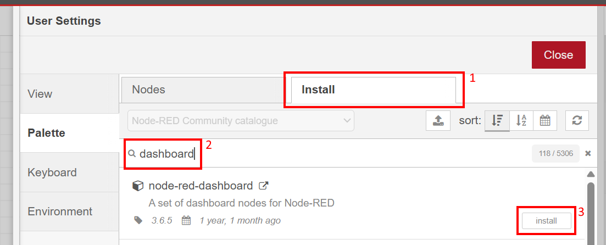
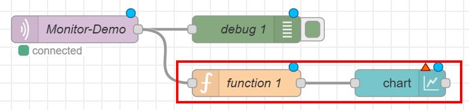

.. _mqttdemo:

*******************************
Running the |Product| MQTT Demo
*******************************

MQTT (https://docs.oasis-open.org/mqtt/mqtt/) is a lightweight publish/subscribe messaging protocol using a message broker.

In addition to the regular demo, the |Product| includes a MQTT demo. This client regularly publishes all input and output variables of all configured SubDevices to a MQTT broker. Each variable is published under a unique topic. The payload is a byte buffer including various information. See section *Running EcMonitorDemoMqtt* of the |Product| User Manual for dependency setup and details about the topics and the buffer layout.

Variables can be published cyclically as well as based on change detection in the process image, both with a configurable minimum time between messages. 

Run the EcMonitorDemoMqtt, similarly to :ref:`Running`. Add a parameter to connect to the MQTT broker.
    
    :command:`-mqtt <broker address>`

Additionally, the minimum times between messages can be configured in milliseconds:

    :command:`-mqttCycTime <time ms>` for cyclic messages

    :command:`-mqttChgTime <time ms>` for messages based on change detection

It is recommended to set at least one of the time parameters. If neither is set, all variables are published on every cycle, which can exhaust the internal message queue.

Setting up Eclipse Mosquitto MQTT broker
****************************************

If no MQTT broker is available yet, the Eclipse Mosquitto broker can be set up quickly using Docker.

#. Create the Mosquitto configuration file:

    :file:`<workingDirectory>/mosquitto/config/mosquitto.conf`.

#. Add configuration for the listener port and anonymous authentication. Optionally, enable verbose logging to later see if the |Product| MQTT Demo can connect and publish messages successfully:

    .. code-block::

        listener 1883
        allow_anonymous true
        log_type all

#. Launch the container using the following command:

    .. prompt:: bash

        docker run -it -p 1883:1883 -v "$PWD/mosquitto/config:/mosquitto/config" eclipse-mosquitto

#. Run the EcMonitorDemoMqtt, similarly to :ref:`Running`, and connect to the broker using the parameter :command:`-mqtt localhost`

The container output will show a notice for each message published by the |Product| MQTT Demo, e.g.

.. code-block::

    1744109196: Received PUBLISH from EcMonitor0 (d0, q0, r0, m0, '/EtherCAT/Monitor0/slavebyname/SubDevice_1006 [EC-Training Generator]/variable/input/SubDevice_1006 [EC-Training Generator].Counter1.NetworkClock', ... (14 bytes))

Processing data with Node-RED
******************************

Node-RED (https://nodered.org) is a low-code programming environment for data processing. See the Node-RED documentation for setup instructions and open the web-based configurator.

#. The *"MQTT in"* node can be used to connect to a MQTT broker and subscribe to a topic. Drag and drop it to the flow.

    .. figure:: ../Media/Node-RED_MQTT_In_Node.png
        :scale: 70%

#. Double click the new node to open the configuration. If a MQTT broker is already configured, select it from the server dropdown, otherwise press the :command:`+` sign next to it. Enter the broker address in the server field. Press :command:`Add` to save the MQTT broker connection. If Node-RED is running in a Docker container on Windows, :command:`host.internal.docker` can be used to address the host.

    .. figure:: ../Media/Node-RED_Add_MQTT_Server.png
        :scale: 70%

    .. figure:: ../Media/Node-RED_MQTT_Server.png
        :scale: 70%

#. Set the topic to :command:`#`, the wildcard topic which matches all topics, see the MQTT specification (https://docs.oasis-open.org/mqtt/mqtt/). Choose the output type :command:`buffer`. Press :command:`Done` to save the node configuration.

    .. figure:: ../Media/Node-RED_Configure_Subscription.png
        :scale: 70%

#. Add and connect a debug node to view the output data of the MQTT in node. Press :command:`Deploy` to launch the flow on the Node-RED instance. If everything is configured correctly, the MQTT in node reads *"Connected"*.

#. Press the bug icon to open the debug view. Run the |Product| MQTT Demo according to :ref:`mqttdemo` and the variable data begins to appear in the debug view.

    .. figure:: ../Media/Node-RED_Add_Debug.png
        :scale: 70%

Visualizing data with Node-RED
******************************

Node-RED can be extended with many more nodes than it ships by default. Go ahead and install the :command:`node-red-dashboard` module via the palette manager.

.. figure:: ../Media/Node-RED_Manage_Palette.png
    :scale: 70%

Double click the MQTT in node to open the configuration. Copy the topic of the variable to be visualized to the topic property of the node and press :command:`Done` to save the changes.

.. figure:: ../Media/Node-RED_Subscribe_Single.png
    :scale: 70%

If the flow is now :command:`Deployed` and demo launched, the debug view only shows messages for the desired variable. Add a function and a chart node to the flow and connect them to the MQTT in node in this order.

Double click the chart node to configure it. If a dashboard group is already configured, select it from the group dropdown, otherwise press the :command:`+` sign next to it. Proceed accordingly for the dashboard tab within the dashboard group configuration. Press :command:`Add` until the chart configuration is visible again.

.. figure:: ../Media/Node-RED_Add_Dashboard_Group.png
    :scale: 70%

Choose an appropriate timespan and interpolation for the variable. Because we are using a digital input, we will choose to visualize the last 5 seconds with step interpolation. Press :command:`Done` to save the changes.

.. figure:: ../Media/Node-RED_Chart_Node.png
    :scale: 70%

Because the MQTT payload is a raw byte buffer, it must first be processed. The first 4 bytes encode a buffer version. As of writing, the buffer version is 0, followed by an 8 byte timestamp, and finally the variable data.

Double click the function node to open the configuration. The :command:`timestamp` property of the message should be set, and the :command:`payload` property should be replaced with the variable value. The JavaScript buffer offers various functions to read an integer from a buffer at a specified offset. Use a function appropriate for the variable type to turn it into a JavaScript number, see the Node.js documentation (https://nodejs.org/docs/latest/api/buffer.html). Press :command:`Done` to save the changes.

- For 1-byte variables: :command:`readInt8 / readUInt8`
- For 2-byte variables: :command:`readInt16LE / readUInt16LE`
- For 4-byte variables: :command:`readInt32LE / readUInt32LE`
- For 8-byte variables: :command:`readBigInt64LE / readBigUInt64LE`

.. code-block:: javascript

    msg.timestamp = Number(msg.payload.readBigUInt64LE(4) / 1000000n);
    msg.payload = msg.payload.readUInt8(12);
    return msg;

.. figure:: ../Media/Node-RED_Function_Node.png
    :scale: 70%

:command:`Deploy` the flow and launch the demo. To open the dashboard, use the same base address and port as the Node-RED configurator with the :command:`/ui` route. E.g., if the configurator is running on :command:`http://localhost:1880/#flow/abc`, open :command:`http://localhost:1880/ui`. If the variable changes, the data should be visible in the dashboard near instantly.

.. figure:: ../Media/Node-RED_Chart_Result.png
    :scale: 70%