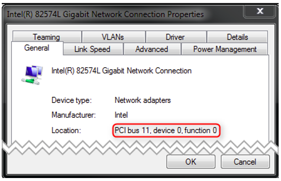

***********************************
Real-time Ethernet Driver selection
***********************************

The |Product| currently supports a variety of different Real-time Ethernet Driver modules, each of which contained in a single library file, which is loaded by the core library dynamically. The |Product| shipment consist of a core library and one (or more) libraries each containing support for one specific Real-time Ethernet Driver module (type of hardware card).
Which library actually is loaded, is depending on the Real-time Ethernet Driver parameters at runtime. 

Real-time means operating directly on the network device's register set instead of using the operating system's native driver.

The principle of Real-time Ethernet Driver selection is that the name of the Real-time Ethernet Driver (Real-time Ethernet Driver Identification) is used to determine the location and name of a registration function, which is called by the |Product| and registers function pointers which allow access to the Real-time Ethernet Driver functional entries.

The EtherCAT® Real-time Ethernet Driver will be initialized using a Real-time Ethernet Driver specific configuration parameter set.
A pointer to this parameter set is part of the |Product| initialization settings.

The |Product| supports two Real-time Ethernet Driver operating modes:
- Interrupt mode all received Ethernet frames will be processed immediately in the context of the Real-time Ethernet Driver receiver task.
- Polling mode the |Product| will call the Real-time Ethernet Driver receiver polling function prior to processing received frames.

Real-time Ethernet Driver and PHY OS Driver
*******************************************

Some operating systems, e.g. Linux and Xenomai, provide drivers for most common Ethernet controllers and their related physical transceivers (PHY).
The manufacturer specific PHY circuits can be handled by a dedicated driver.
Using the PHY OS Driver interface it is possible to use the manufacturer's dedicated PHY driver without modification of the Real-time Ethernet Driver driver.
Depending on the hardware architecture, an additional module from acontis, e.g. atemsys for Linux, grants access to the MDIO bus to the OS drivers, or request MDIO operations from the OS drivers.

.. figure:: ../../EcMaster/Media/emll_phy_os_driver_architecture.png
    :align:     center
    :alt:       

.. note:: Real-time Ethernet Driver modules not listed here may be available if purchased additionally

Real-time Ethernet Driver selection and initialization
******************************************************

The different Real-time Ethernet Driver modules are selected and parameterized by a common structure :cpp:struct:`EC_T_LINK_PARMS` shared by all Real-time Ethernet Driver and a Real-time Ethernet Driver specific structure, pointed to by an element within the common structure. This parameter set is given to :cpp:member:`EC_T_MONITOR_INIT_PARMS::pLinkParms` with the call of :cpp:func:`emonInitMonitor`. 

.. doxygenstruct:: EC_T_LINK_PARMS
    :members:

.. doxygenstruct:: EC_T_LINKLAYER_TIMINGTASK
    :members:

Real-time Ethernet Driver instance selection via PCI location
*************************************************************

For some operating systems it is possible to address the Real-time Ethernet Driver instance using its PCI address as an alternative. To do this, EC_LINKUNIT_PCILOCATION (0x01000000) and the PCI location must be set as :cpp:member:`EC_T_LINK_PARMS::dwInstance`.

On Linux the PCI address  can be shown using e.g.:

.. prompt:: bash

    lspci | grep Ethernet

.. prompt:: bash

    00:19.0 Ethernet controller: Intel Corporation Ethernet Connection I217-LM (rev 04)
    04:00.0 Ethernet controller: Intel Corporation 82574L Gigabit Network Connection
    05:00.0 Ethernet controller: Intel Corporation 82574L Gigabit Network Connection

The format of :cpp:member:`EC_T_LINK_PARMS::dwInstance` using PCI bus address is:

`0x01bbddff`
    - `bb` Bus Number
    - `dd` Device Number
    - `ff` Function Number

.. code-block:: cpp

    EC_T_LINK_PARMS::dwInstance = 0x01001900; //"0000:00:19.0"

On Windows the integer value displayed in properties dialog must be converted to HEX. E.g the number from the following dialog `(PCI bus 11, device 0, function 0)` corresponds to `0x010B0000` (bus `0x0B`).

