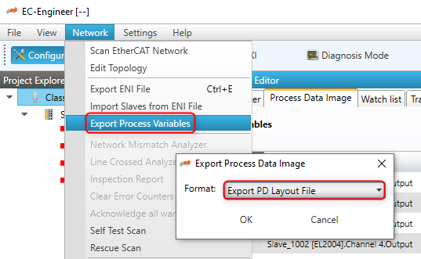
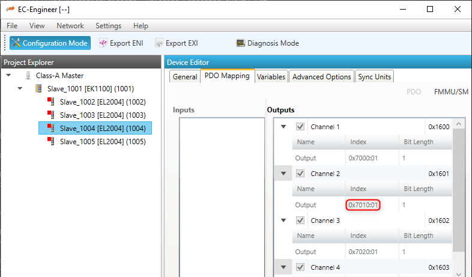

*******************
Process Data Access
*******************

The process data that is exchanged between an EtherCAT® master and the slaves in each cycle is stored in the process data image. There are two separate memory areas, one for the input data and one for the output data.
The base addresses of these areas are provided by calling the functions :cpp:func:`emonGetProcessImageInputPtr` and :cpp:func:`emonGetProcessImageOutputPtr`.
The size of the process data input image is defined in the ENI file under ``EtherCATConfig/Config/ProcessImage/Inputs/ByteSize`` and ``EtherCATConfig/Config/ProcessImage/Outputs/ByteSize`` and is returned by :cpp:func:`emonRegisterClient` at :cpp:member:`EC_T_REGISTERRESULTS::dwPDOutSize` and :cpp:member:`EC_T_REGISTERRESULTS::dwPDInSize`. 

Process Data Access Functions
*****************************

Process data variables that are packed as array of bits are bit aligned and not byte aligned in process data. Accessing bits that are bit aligned and not byte aligned should be done using :c:macro:`EC_GETBITS`. See :c:macro:`EC_COPYBITS` for how to copy data areas with bit offsets that are not byte aligned.
Access to corresponding aligned variables, e.g. of the types :cpp:type:`EC_T_BYTE`, :cpp:type:`EC_T_WORD`, :cpp:type:`EC_T_DWORD`, :cpp:type:`EC_T_UINT64`, can be accessed more efficiently using the appropriate macros according to the following table.

.. note:: Process data is typically transmitted as little endian and must therefore be swapped on big endian systems in order to be correctly interpreted.

.. list-table::
    :widths: auto
    :header-rows: 1

    * - Variable type
      - Bit size
      - Macro
      - Hint
    * - Bit
      - 1
      - :c:macro:`EC_GETBITS`
      - Contains swap for big endian systems
    * - :cpp:type:`EC_T_BYTE`
      - 8
      - N/A
      - Bytes can be directly addressed at pbyBuffer[BitOffset/8]
    * - :cpp:type:`EC_T_WORD`
      - 16
      - :c:macro:`EC_GET_FRM_WORD`
      - Contains swap for big endian systems
    * - :cpp:type:`EC_T_DWORD`
      - 32
      - :c:macro:`EC_GET_FRM_DWORD`
      - Contains swap for big endian systems
    * - :cpp:type:`EC_T_UINT64`
      - 64
      - :c:macro:`EC_GET_FRM_QWORD`
      - Contains swap for big endian systems

Process variables' offset and size
**********************************

The following screenshot shows variables' offset and size within the Process Data Image:

.. figure:: ../Media/PdAccess_PdVariablesList.png
    :align:     center
    :alt:

Accessing the process data of a specific slave always works by adding an offset to the base address. All offsets are given as bit offsets! 

There are different ways possible to get this offset. The offset values will not change until a new configuration is provided, therefore it is sufficient to load them once right after :cpp:func:`emonConfigureNetwork`, it is not needed every cycle.

Process variable access via hard coded offsets
**********************************************

The offset value can be determined from an EtherCAT® configuration tool. It is not recommended to use fixed values as the offsets will change as slaves are added/removed from the configuration.

As shown in the screenshot above, `Slave_1004 [EL2004].Channel 3.Output` is at offset 1.2 with size 0.1 in the example.

The numbering is `Byte.Bit` so the offset in the example is `Byte 1`, `Bit 2`, Bit offset:
    :math:`8*1+2 = 10`

Bit size
    :math:`0*8+1 = 1`

.. literalinclude:: ..\Snippets\EcMonitorSnippets.cpp
    :start-after: IGNORE_TEST(DocumentationSnippets, PdAccess_HardCodedOffsets)
    :end-before: IGNORE_TEST(DocumentationSnippets, PdAccess_HardCodedOffsets)
    :language: cpp
    :dedent: 4
    :lines: 2-

Process variable access via generated PD Layout
***********************************************

The EC-Engineer / EC-Inspector can export the process variables to a PD-Layout C-Header via the menu item :menuselection:`Network --> Export Process Variables` as shown in the following screenshot:

This will generate a header file containing the slaves' variables as follows:

.. literalinclude::  ..\Snippets\EcMonitorSnippets.cpp
    :start-after: IGNORE_TEST(DocumentationSnippets, PdAccess_GeneratedLayout)_Header
    :end-before: IGNORE_TEST(DocumentationSnippets, PdAccess_GeneratedLayout)_Header
    :language: cpp

Example how a value can be accessed:

.. literalinclude::  ..\Snippets\EcMonitorSnippets.cpp
    :start-after: IGNORE_TEST(DocumentationSnippets, PdAccess_GeneratedLayout)_Set
    :end-before: IGNORE_TEST(DocumentationSnippets, PdAccess_GeneratedLayout)_Set
    :language: cpp
    :dedent: 4

Process variable access dynamically from ENI
********************************************

emonGetCfgSlaveInfo
===================

The slave offsets can be determined dynamically with the function :cpp:func:`emonGetCfgSlaveInfo`.
The offsets are stored in :cpp:member:`EC_T_CFG_SLAVE_INFO::dwPdOffsIn` and :cpp:member:`EC_T_CFG_SLAVE_INFO::dwPdOffsOut`.

Example of how `Slave_1004 [EL2004].Channel 3.Output` can be accessed:

.. literalinclude::  ..\Snippets\EcMonitorSnippets.cpp
    :start-after: IGNORE_TEST(DocumentationSnippets, PdAccess_GetCfgSlaveInfo)
    :end-before: IGNORE_TEST(DocumentationSnippets, PdAccess_GetCfgSlaveInfo)
    :language: cpp
    :dedent: 4
    :lines: 2-
    
emonGetSlaveOutpVarInfo
=======================

All variables of a specific slave can be determined dynamically with the functions :cpp:func:`emonGetSlaveInpVarInfoEx` or :cpp:func:`emonGetSlaveOutpVarInfoEx`.
The offset is stored in :cpp:member:`EC_T_PROCESS_VAR_INFO_EX::nBitOffs`.

Example of how `Slave_1004 [EL2004].Channel 3.Output` can be accessed:

.. literalinclude::  ..\Snippets\EcMonitorSnippets.cpp
    :start-after: IGNORE_TEST(DocumentationSnippets, PdAcces_GetSlaveOutpVarInfoEx)
    :end-before: IGNORE_TEST(DocumentationSnippets, PdAcces_GetSlaveOutpVarInfoEx)
    :language: cpp
    :dedent: 4
    :lines: 2-

emonFindOutpVarByName
=====================

The variable offsets can be determined dynamically using the names with the functions :cpp:func:`emonFindInpVarByNameEx` or :cpp:func:`emonFindOutpVarByNameEx`.
Each input or output has a unique variable name, all variables names are stored in the ENI file under ``EtherCATConfig/Config/ProcessImage/[Inputs|Outputs]/Variable``.
The offset is stored in :cpp:member:`EC_T_PROCESS_VAR_INFO_EX::nBitOffs`. 

Example of how `Slave_1004 [EL2004].Channel 3.Output` can be accessed:

.. literalinclude::  ..\Snippets\EcMonitorSnippets.cpp
    :start-after: IGNORE_TEST(DocumentationSnippets, PdAcces_FindOutpVarByNameEx)
    :end-before: IGNORE_TEST(DocumentationSnippets, PdAcces_FindOutpVarByNameEx)
    :language: cpp
    :dedent: 4
    :lines: 2-

emonGetSlaveOutpVarByObjectEx
=============================

The variable offsets can be determined dynamically using the object index and subindex with the functions :cpp:func:`emonGetSlaveInpVarByObjectEx` or :cpp:func:`emonGetSlaveOutpVarByObjectEx`.

The object index and subindex can be get with the EC-Engineer:

Example of how `Slave_1004 [EL2004].Channel 3.Output` can be accessed:

.. literalinclude::  ..\Snippets\EcMonitorSnippets.cpp
    :start-after: IGNORE_TEST(DocumentationSnippets, PdAcces_GetSlaveOutpVarByObjectEx)
    :end-before: IGNORE_TEST(DocumentationSnippets, PdAcces_GetSlaveOutpVarByObjectEx)
    :language: cpp
    :dedent: 4
    :lines: 2-