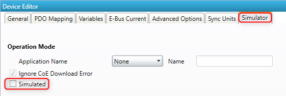
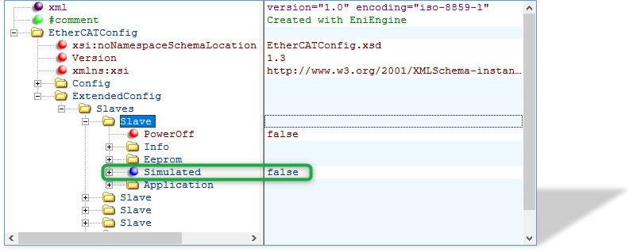

***************
Getting Started
***************

EC-Simulator Architecture
*************************

The EC-Simulator library is implemented in C++ and can be easily ported to any embedded OS platforms using an appropriate C++ compiler. The API interfaces are C language interfaces, thus the stack can be used in ANSI-C as well as in C++ environments.

There are two different architecture editions as described below. The architectures contain the following:

- EC-Simulator stack Core: In the core module cyclic (process data update) and acyclic (mailbox) EtherCAT commands are sent and received. Among others there exist some state machines to handle for example the mailbox protocols.
- Configuration Layer: The EC-Simulator stack is configured using a XML file whose format is fixed in the EtherCAT specification ETG.2100 (ENI) with extended information (EXI). The EC-Simulator contains an OS independent XML parser.
- Real-time Ethernet Driver Layer: This layer exchanges Ethernet frames between the master and the simulator. If hard real-time requirements exist, this layer has to be optimized for the network adapter card in use.
- OS Layer: All OS dependent system calls are encapsulated in a small OS layer. Most functions are that easy that they can be implemented using simple C macros.

Extended EtherCAT Network Configuration (EXI)
*********************************************

The EC-Simulator stack has to know about the EtherCAT bus topology and the cyclic/acyclic frames to exchange with the slaves. This configuration is determined in a configuration file which has to be available in the EtherCAT Network Information Format (ENI). This format is completely independent from EtherCAT slave vendors, from master stack vendors and from EtherCAT configuration tools. Thus inter-operability between those vendors is guaranteed.

Because the ENI file does not include information about the slave hardware, the EXI (EtherCAT Extended Information) file includes EEPROM content and Slave Object Dictionary from ESI and ESC register values from real network is typically needed. The EXI file can be exported using EC-Engineer.

.. figure:: ../Media/EXI.png
    :alt:

.. only:: EcSimulatorHiL

    HiL Simulation Software architecture
    ************************************

    The EC-Simulator software is ready-to-run on various operating systems, e. g. Linux and Windows, and makes use of the Real-time Ethernet Drivers.

    The EC-Simulator offers a "C" language API for integration into a Software PLC (LogicLab, logi.cals) or into professional simulation software like ISG Virtuos, etc.

    .. figure:: ../Media/HiL-architecture.png
        :alt:

.. only:: EcSimulatorSiL

    SiL Simulation Software architecture
    ************************************

    The SiL Simulation Software architecture does not need a physical network interface for slave simulation. The EC-Simulator is loaded as Ethernet Driver instead to simulate the EtherCAT Network on a System controller running the EC-Master.

    .. figure:: ../Media/SiL-architecture.png
        :alt:

Mixed mode of real slaves and simulated slaves
**********************************************

In order to implement restbus simulation it is possible to mix real slaves and simulated slaves like this:

.. figure:: ../Media/mix_real_slaves_and_simulated_slaves.png
    :alt:

All real slaves must be configured accordingly:

See also /EtherCATConfig/ExtendedConfig/Slaves/Slave/Simulated in the EXI file:

The EC-Simulator will automatically assign the network adapters to the corresponding ports in order of
configuration. 

.. seealso:: :cpp:member:`EC_T_SIMULATOR_INIT_PARMS::apLinkParms` at :cpp:func:`esInitSimulator`.

Operating system configuration
******************************

The main task is to setup the operating system to support the appropriate network adapter for EtherCAT usage and for some systems real-time configuration may be needed.

The operating system-specific settings and configurations are described in :ref:`toc_os:Platform and Operating Systems (OS)`.

.. raw:: latex

    \newpage

.. only:: EcSimulatorHiL

    Running EcSimulatorHilDemoGuiDotNet
    ***********************************

    EC-Simulator HiL for Windows contains an .NET example application, the EcSimulatorHilDemoGuiDotNet.

    Selecting the appropriate network adapter and providing an EtherCAT Network Configuration file (ENI / EXI) is mandatory before clicking "Start" to run the EC-Simulator:

    .. figure:: ../Media/EcSimulatorHilDemoGuiDotNet-start-parameters.png
        :alt: EcSimulatorHilDemoGuiDotNet start parameters

    .. raw:: latex

        \newpage

    .. _running-ecdemo:

    Running EcSimulatorHilDemo
    **************************

    The EcSimulatorHilDemo is an EC-Simulator example application that handles the following tasks:

    - Showing basic EtherCAT communication
    - Stack initialization
    - Process Data operations for e.g. Beckhoff EL2004, EL1004 and EL4132
    - Periodic diagnosis task 
    - Periodic Job Task 
    - Logging to EcSimulator0.log, error0.log

    The EcSimulatorHilDemo is available "out of the box" for different operating systems. The operating system must be prepared for running EtherCAT® applications, 

    .. seealso:: :ref:`architecture:Operating system configuration`

    Setting up and running EcSimulatorHilDemo
    =========================================

    Linux (EcSimulatorHilDemo)
    --------------------------

    #. Operating system configuration: See the section Operating system configuration for how to prepare the operating system

    #. Starting EcSimulatorHilDemo

    .. prompt:: bash

        cd /opt/EC-Simulator/Bin/Linux/x64
        LD_LIBRARY_PATH=. ./EcSimulatorHilDemo -f exi.xml -intelgbe 2 1 -perf

    Microsoft Windows (EcSimulatorHilDemo)
    --------------------------------------

    #. Windows configuration: See the section Operating system configuration for how to prepare the operating system

    #. Determine the network interface: Using the command line option the network interface card used by the example application can be determined. For example the option -ndis 192.168.157.2 0 will be using the network adapter card with the IP address 192.168.157.2 .

    #. Simulating EtherCAT modules: The simulator has to be connected with the target system using an Ethernet switch or a patch cable. Local IT infrastructure should not be mixed with EtherCAT modules at the same switch as the master will send many broadcast packets! EtherCAT® requires a 100Mbit/s connection. Gigabit-Ethernet connections between simulator and master can be typically used, too.

    #. Copy all of the example application files into one directory: The application EcSimulatorHilDemo.exe together with the stack DLL EcSimulator.dll, the Ethernet Driver DLL emllPcap.dll and the EXI file have to be copied into one directory.

    #. Run the example application: EcSimulatorHilDemo.exe has to be executed. The file name of the EXI file has to be given as a command line parameter as well as the appropriate Real-time Ethernet Driver settings.

    .. prompt:: bash

        EcSimulatorHilDemo.exe -ndis 192.168.157.2 0 -f exi.xml -t 0 -v 3

    .. program:: EcSimulatorHilDemo
    .. include:: ../../Examples/ecdemo-cmdline.rst
    .. include:: ../../Examples/ecdemo-cmdline-emll.rst

.. only:: EcSimulatorSiL

    Using emllSimulator (SiL)
    *************************

    The EcSimulatorSilDemo example program as well as all EC-Master example programs like EcMasterDemo, EcMasterDemoDc, etc. support the EC-Simulator (SiL) Ethernet Driver emllSimulator.
    In this case no physical Real-time Ethernet Driver is passed to the EC-Master. Instead the emllSimulator (SiL) simulates the physical network.
    The command line syntax is for example:

    .. prompt:: bash

        EcSimulatorSilDemo -simulator 1 1 <exi-file> -f <eni-file> -t 0 -sp

    The EC-Simulator Instance ID when calling EC-Simulator APIs is the Real-time Ethernet Driver Instance ID given at command line:

    .. prompt:: bash

        EcSimulatorSilDemo -simulator <Instance-ID> 1 exi.xml -f exi.xml -t 0 -sp
        
    Valid values for Instance ID of emllSimulator are 1 ... 24 . 

    emllSimulator is dynamically loaded within ecatInitMaster() . In contrast to HiL, in case of SiL, ecatInitMaster() automatically calls esInitSimulator(), so the EC-Simulator SiL application may not call esInitSimulator() for the given Instance ID.

    The EC-Simulator APIs can be used in the EcMasterDemo, too. 
    The APIs are declared in SDK\\INC\\EcSimulator.h and EcSimulator.lib / libEcSimulator.so must be linked to the application to import the EC-Simulator APIs.

    The EC-Simulator SiL Protected version with MAC based protection needs the corresponding Real-time Ethernet Driver settings provided. 

    .. seealso:: :ref:`intro:Protected version`

    Simulator Ethernet Driver parameters
    ====================================

    The parameters to the Simulator Ethernet Driver are setup-specific. 
    The function :cpp:func:`CreateLinkParmsSimulator` in :file:`EcSelectLinkLayer.cpp` demonstrates how to initialize the Ethernet Driver instance.

    .. doxygenstruct:: EC_T_LINK_PARMS_SIMULATOR
        :members:

    emllSimulator accepts optional parameters, e.g.:

    .. prompt:: bash

        -simulator 1 1 <exi-file> [--mac <address>] [--lic <key>] [--link <link-parms>] [--sp] [--connect <type> <id> <address> <port>]

EC-Simulator Software Development Kit (SDK)
*******************************************

The EC-Simulator SDK is needed to write applications based on the EC-Simulator stack. 
The EC-Simulator stack is shipped as a library which is linked together with the application.

The following components are supplied together with an SDK:

- ....\Bin: Executables containing the EC-Simulator stack
- ....\Doc: Documentation
- ....\Examples: Example application(s) 
- Libraries and header files to build C/C++-applications.
    - ....\\SDK\\INC: header files to be included with the application
    - ....\\SDK\\LIB: libraries to be linked with the application
    
- ....\\Sources\\Common: Shared C++-files

For all operating systems the same principal rules to generate the example applications can be used.

Include search path

The header files are located in the following directories:

#. <InstallPath>\\Examples\\<ExampleName> (whith e.g. <ExampleName>=EcSimulatorHilDemo)
#. <InstallPath>\\Examples\\Common\\<OS> (where <OS> is a placeholder for the operating system)
#. <InstallPath>\\Examples\\Common
#. <InstallPath>\\SDK\\INC\\<OS> (where <OS> is a placeholder for the operating system)
#. <InstallPath>\\SDK\\INC
#. <InstallPath>\\Sources\\Common

Preprocessor macro

The demo applications are the same for all operating systems. The appropriate pre-processor macro has to be set for the operating system.

.. seealso:: :ref:`architecture:OS Compiler settings`

Libraries

The libraries located in <InstallPath>\\SDK\\LIB\\<OS>\\<ARCH> have to be added (<OS> is a placeholder for the operating system used and <ARCH> for the architecture if different architectures are supported).

.. _compile-ecdemo:

OS Compiler settings
====================

Linux Compiler settings
-----------------------

The following settings are necessary to build the example application for Linux.

- Possible ARCHs (see ATECAT_ARCHSTR in :file:`SDK/INC/Linux/EcOsPlatform.h`):

aarch64 (ARM 64Bit), armv4t-eabi (ARM 32Bit), armv6-vfp-eabihf (ARM 32Bit), armv7-vfp-eabihf (ARM 32Bit), PPC (PPC 32Bit with "-te500v2"), riscv64 (RISC-V 64Bit), x64 (x86 64Bit), x86 (x86 32Bit)

The ARM 32Bit architectures armv4t-eabi and armv6-vfp-eabihf/armv7-vfp-eabihf are incompatible with each other. An ARM VFP system returns success on "readelf -A /proc/self/exe | grep Tag_ABI_VFP_args". If "readelf" isn't available on the target, the matching ARM version can be figured out by trying to run EcSimulatorHilDemo.

- Extra include paths:
    <InstallPath>/Examples/EcSimulatorHilDemo
    <InstallPath>/SDK/INC/Linux 
    <InstallPath>/SDK/INC
    <InstallPath>/Sources/Common

- Extra source paths:
    <InstallPath>/Examples/EcSimulatorHilDemo
    <InstallPath>/Sources/Common/EcTimer.cpp

- Extra library paths to the main EtherCAT components (replace "x86" according to ARCH):
    <InstallPath>/SDK/LIB/Linux/x86

- Extra libraries (in this order)
    EcSimulatorRasServer EcSimulator pthread dl rt

Microsoft Windows
-----------------

The following settings are necessary to build the example application for Windows:

- Library path of the main EtherCAT components: 
    <InstallPath>/SDK/LIB/Windows/<Arch>

- Include path: 
    <InstallPath>/SDK/INC/Windows 
    <InstallPath>/SDK/INC 
    <InstallPath>/Sources/Common

.. only:: EcSimulatorHiL

    Real-time Ethernet Driver configuration for EcSimulatorHilDemo
    **************************************************************

    The different Real-time Ethernet Driver modules are selected and parametered by a common structure (shared by all Real-time Ethernet Driver) and a Real-time Ethernet Driver specific structure, pointed to by an element within the common structure. This parameter set is given to the EC-Simulator stack with the call of :cpp:func:`esInitSimulator`. 

    .. seealso:: :cpp:func:`esInitSimulator`

