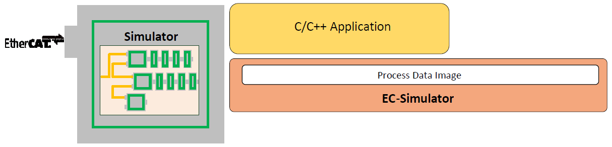
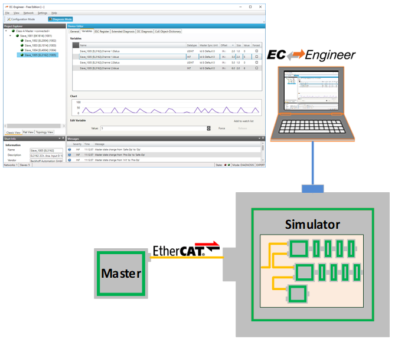

********************
Software Integration
********************

.. only:: EcSimulatorHiL

    EcSimulatorHilDemo
    ******************

    The example application EcSimulatorHilDemo will handle the following tasks:

    - Stack initialization
    - Flash process data
    - Out of the box solution for different operating systems:
      - Windows
      - Linux
      - LxWin
      - ...
    
    - Example implementation for polled mode or interrupt mode operation
    - Thread with periodic tasks and application thread already implemented
    - The output messages of the demo application will be printed on the console as well as in log files (\*.log).
    
    File reference
    ==============
        
    The Demo application consists of the following files:

    +-----------------------+-------------------------------------------------------+
    | EcDemoMain.cpp        | Entry point for the different operating               |
    |                       | systems                                               |
    +-----------------------+-------------------------------------------------------+
    | EcDemoPlatform.h      | Operating system specific settings (task              |
    |                       | priorities, timer settings)                           |
    +-----------------------+-------------------------------------------------------+
    | EcDemoApp.cpp         | Initialize, start and terminate the                   |
    |                       | |Product| stack                                       |
    +-----------------------+-------------------------------------------------------+
    | EcDemoApp.h           | Application specific settings for                     |
    |                       | EcSimulatorHilDemo                                    |
    +-----------------------+-------------------------------------------------------+
    | EcDemoParms.cpp       | Parsing of command line parameters and                |
    |                       | generic helper functions                              |
    +-----------------------+-------------------------------------------------------+
    | EcDemoParms.h         | Basic configuration parameters                        |
    +-----------------------+-------------------------------------------------------+
    | EcSelectLinkLayer.cpp | Common Functions which abstract the command           |
    |                       | line parsing into Real-time Ethernet Driver parameter |
    +-----------------------+-------------------------------------------------------+
    | EcNotification.cpp    | Slave monitoring and error detection                  |
    |                       | (function :cpp:func:`NotifyWrapper` )                 |
    +-----------------------+-------------------------------------------------------+
    | EcSlaveInfo.cpp       | Slave information services                            |
    +-----------------------+-------------------------------------------------------+
    | EcLogging.cpp         | Message logging functions                             |
    +-----------------------+-------------------------------------------------------+
    | EcTimer.cpp           | Start and monitor timeouts                            |
    +-----------------------+-------------------------------------------------------+

    Simulator lifecycle
    ===================

    This chapter gives brief information about the starting and stopping of the |Product|.

    Basically the operation of the |Product| stack is wrapped between the functions

    - :cpp:func:`esInitSimulator`
    - :cpp:func:`esConfigureNetwork`
    - :cpp:func:`esDeinitSimulator`

    Logging
    =======

    The Example programs cpp demonstrates how messages can be processed by the application, see Examples\Common\EcLogging.cpp. 

    The messages handled by EcLogging.cpp are of different type, e.g. |Product| Log Messages and Application Messages are logged to console and/or to files. 
    The verbosity of the demo given as console parameter "-v" is used to determine the log level of the application, see "set application log level" in EcSimulatorHilDemoMain.cpp.
    Logging is configured on initialization, see the structure documentation of EC_T_SIMULATOR_INIT_PARMS::LogParms in :cpp:func:`esInitSimulator`.
    The |Product| automatically filters log messages according to EC_T_SIMULATOR_INIT_PARMS::LogParms.dwLogLevel . Log messages which are less relevant according their severity (see EC_LOG_LEVEL...) are filtered out.

    CAtEmLogging has various parameters beside the log level, like Roll Over setting, log task priority and affinity, log buffer size, etc. See InitLogging in EcLogging.h, EcSimulatorHilDemoMain.cpp for reference.

    The application can override CAtEmLogging::PrintConsole / CAtEmLogging::PrintMsg if the default handler in EcLogging.cpp does not fulfill the application's needs.

    .. important:: The callback is typically called from the Job Task's context and should return as fast as possible.

    .. important:: logging to files is disabled by default for some OS. Because e.g. a file system must be added explicitly. Setting bLogFileEnb to 1 is needed for some operating systems to enable file logging.

    Identical messages are skipped automatically by default. 

Process data update and synchronization
***************************************

The EtherCAT© Master cyclically sends frames containing the outputs of the Process Data Image to the EtherCAT© network and the Simulator synchronizes the Process Data Image with the frames from the Master and sends the response back to the Master. The Master cyclically receives the inputs of the Process Data Image from the Simulator.

.. figure:: ../Media/Process_data_update_and_synchronization_Overview.png
    :alt:

The HiL Application directly accesses the Process Data Image at Simulator:

The SiL Application directly accesses the Process Data Image at Master and Simulator:

.. figure:: ../Media/Process_data_update_and_synchronization_Overview_SiL.png
    :alt:

Forced Data, Firmware Data, DPRAM
=================================

The |Product| stack synchronizes the outputs and inputs from the Process Data Image and the slave DPRAM areas containing process data objects individually.

.. figure:: ../Media/Process_data_update_and_synchronization_Forced_Data.png
    :alt:

|Product| stack as process data memory provider
===============================================

By default the |Product| stack internally allocates the memory needed to store input and output process data values.

.. figure:: ../Media/data-memory-provider.png
    :alt:
    
In order to update process data, the application's JobTask has to call:

- eUsrJob_ProcessAllRxFrames (polling mode only)
    Process all received frames from Real-time Ethernet Driver
    
- eUsrJob_SimulatorTimer
    Trigger state machines

.. important:: In polling mode, the master cycle time must be at least two times higher than the simulator cycle time. E.g. if the simulator runs with 1 ms, the master cycle time must be at least 2 ms. If the Real-time Ethernet Driver is running in interrupt mode (non-standard), processing of received frames is done immediately after the frame is received.

.. seealso:: :cpp:member:`EC_T_SIMULATOR_INIT_PARMS::bDisableProcessDataImage` at :cpp:func:`esInitSimulator` (HiL) or :cpp:member:`EC_T_LINK_PARMS_SIMULATOR::bDisableProcessDataImage` (SiL) for how to disable allocation and usage of the process data image. 

Cyclic frames - Real-time Ethernet Driver in polling mode
---------------------------------------------------------

.. figure:: ../Media/cyclic-frames.png
    :alt:
    
Application has to perform:

.. code-block:: cpp

    /* Job 1: incoming process data is stored to Process data image (polling mode only) */
    esExecJob(dwSimulatorInstanceId, eUsrJob_ProcessAllRxFrames, &bPrevCycProcessed); 
    ...
    ...
    /* do process data cycle */
    ...
    ...
    /* Job 2: trigger state machines, which are necessary to perform any status change or internal administration tasks */
    esExecJob(dwSimulatorInstanceId, eUsrJob_SimulatorTimer, EC_NULL);

For closer details find an example project "EcSimulatorHilDemo" in the folder "Examples".

.. raw:: latex

    \newpage

Accessing process data in the application
*****************************************

The process data, exchanged between the |Product| stack and the slaves in every cycle, are stored in the process data image. There are two separate memory areas, one for the input data and another one for the output data. 
The base addresses of these areas are provided by calling the functions :cpp:func:`esGetProcessImageInputPtr` and :cpp:func:`esGetProcessImageOutputPtr`. 
The size of the process data image is defined in the ENI file under "EtherCATConfig/Config/ProcessImage/Inputs/ByteSize" and "EtherCATConfig/Config/ProcessImage/Outputs/ByteSize" and is returned by :ref:`api_general:esIoControl - EC_IOCTL_GET_PDMEMORYSIZE` and :cpp:func:`esRegisterClient` at :cpp:member:`EC_T_REGISTERRESULTS::dwPDOutSize` and :cpp:member:`EC_T_REGISTERRESULTS::dwPDInSize`. 

.. seealso:: 
    - :cpp:func:`esGetProcessImageOutputPtr`
    - :cpp:func:`esGetProcessImageInputPtr`
    - :ref:`api_general:esIoControl - EC_IOCTL_GET_PDMEMORYSIZE`
    - :cpp:func:`esRegisterClient`: :cpp:member:`EC_T_REGISTERRESULTS::dwPDOutSize`, :cpp:member:`EC_T_REGISTERRESULTS::dwPDInSize`

Process Data Access Functions selection
=======================================

Process data variables that are packed as array of bits are bit aligned and not byte aligned in process data.

.. seealso:: :ref:`api_process_data_access_functions:EC_COPYBITS` for how to copy data areas with bit offsets that are not byte aligned. 

Getting and setting bits that are bit aligned and not byte aligned should be done using EC_SETBITS and EC_GETBITS. Accessing complete :cpp:struct:`EC_T_BYTE`, :cpp:struct:`EC_T_WORD`, :cpp:struct:`EC_T_DWORD`, :cpp:struct:`EC_T_QWORD` can be accessed more efficiently using the appropriate macros according to the following table. 

Note that these function do not initiate any transfer on wire. Typically process data is transferred as little endian on wire and therefor must be swapped on big endian systems like PPC to be correctly interpreted, see hints in table below.

+--------------------------+-------------------+--------------+
| Variable type (Bit size) | Macro             | Hint         |
|                          |                   |              |
+==========================+===================+==============+
| EC_T_BYTE                | N/A               | Bytes are    |
| (8)                      |                   | byte-aligned |
|                          |                   | and can be   |
|                          |                   | directly     |
|                          |                   | addressed    |
|                          |                   | at           |
|                          |                   | pbyBuffer[   |
|                          |                   | BitOffset/8] |
+--------------------------+-------------------+--------------+
| EC_T_WORD                | EC_SET_FRM_WORD,  | Contains     |
| (16)                     | EC_GET_FRM_WORD   | swap for     |
|                          |                   | big endian   |
|                          |                   | systems      |
+--------------------------+-------------------+--------------+
| EC_T_DWORD               | EC_SET_FRM_DWORD, | Contains     |
| (32)                     | EC_GET_FRM_DWORD  | swap for     |
|                          |                   | big endian   |
|                          |                   | systems      |
+--------------------------+-------------------+--------------+
| EC_T_QWORD               | EC_SET_FRM_QWORD, | Contains     |
| (64)                     | EC_GET_FRM_QWORD  | swap for     |
|                          |                   | big endian   |
|                          |                   | systems      |
+--------------------------+-------------------+--------------+
| Bit(1)                   | EC_SETBITS /      |              |
|                          | EC_GETBITS        |              |
+--------------------------+-------------------+--------------+

Process variables' offset and size
==================================

The following screenshot shows variables' offset and size within the Process Data Image:

.. figure:: ../Media/process-variables.png
    :alt:
    
Accessing the process data of a specific slave always works by adding an offset to the base address.

There are different ways possible to get this offset. All offsets are given as bit offsets! The offset values will not change until a new configuration is provided (s.a. :cpp:func:`esConfigureNetwork`) therefore it is sufficient to load them once right after :cpp:func:`esConfigureNetwork`, it is not needed every cycle. 

Manually hard coded offsets (compiled in application)
-----------------------------------------------------

The offset value is figured out from the EtherCAT configuration tool. It's not recommended to use fixed values because the offsets changes in case of adding/removing slaves to/from the configuration.

As listed in the screenshot above "Slave_1004 [EL2004].Channel 3.Output" in the example is at offset 1.2 with size 0.1. The numbering is Byte.Bit so the offset in the example is Byte 1, Bit 2 means bit offset 8*1+2 = 10 and size is 0*8+1 = 1.

Sample code:

.. code-block:: cpp

    EC_T_BYTE byNewValue = 0x01;
    
    /* get variable from process data */
    
    EC_GETBITS(esGetProcessImageOutputPtr(dwSimulatorInstanceId), &byNewValue, 10 /* offset in bits */, 1 /* size in bits */);
    
Generated PD Layout (compiled in application)
---------------------------------------------

The EC-Engineer can export the process variables to a PD Layout File (C-Header) using the menu item "Network > Export Process Variables" as shown in the following screenshots:

.. figure:: ../Media/generated-PD-layout.png
    :alt:
    
.. figure:: ../Media/generated-PD-layout-2.png
    :alt:
    
This will generate a header file containing the slaves' variables like this:

.. code-block:: cpp

        [...] 
    #include EC_PACKED_INCLUDESTART(1)
    #define PDLAYOUT_OUT_OFFSET_SLAVE_2002 22
    typedef struct _T_PDLAYOUT_OUT_SLAVE_2002
    {
        EC_T_SWORD  swChannel_1_Output; // Slave_2002 [EL4132].Channel 1.Output ...
        EC_T_SWORD  swChannel_2_Output; // Slave_2002 [EL4132].Channel 2.Output ...
    } EC_PACKED(1) T_PDLAYOUT_OUT_SLAVE_2002;
    #include EC_PACKED_INCLUDESTOP

Example for changing values in e.g. myAppWorkPd:

.. code-block:: cpp

    EC_T_WORD wVal = EC_GET_FRM_WORD(&((T_PDLAYOUT_OUT_SLAVE_2002*)(pbyPDOut + 
    PDLAYOUT_OUT_OFFSET_SLAVE_2002))->swChannel_1_Output);

Slave / variable offset from configuration
------------------------------------------

esGetCfgSlaveInfo
~~~~~~~~~~~~~~~~~

Figure out the slave offsets dynamically by calling the function :cpp:func:`esGetCfgSlaveInfo`:
The offsets are stored in :cpp:member:`EC_T_CFG_SLAVE_INFO::dwPdOffsIn` and :cpp:member:`EC_T_CFG_SLAVE_INFO::dwPdOffsOut`.
E.g. setting "Slave_1004 [EL2004].Channel 3.Output" according to the screenshot above is like:

.. code-block:: cpp

    EC_T_BYTE byNewValue = 0x01;
    
    EC_T_CFG_SLAVE_INFO SlaveInfo;
    dwRes = esGetCfgSlaveInfo(dwSimulatorInstanceId, EC_TRUE, 1004, &SlaveInfo);
    
    /* get variable from process data */
    EC_GETBITS(esGetProcessImageOutputPtr(dwSimulatorInstanceId), &byNewValue, SlaveInfo.dwPdOffsOut + 2 /* variable relative offset in bits within slave sync unit */, 1 /* variable size in bits */);

esFindInpVarByName
~~~~~~~~~~~~~~~~~~

Figure out the variable offset by calling the function :cpp:func:`esFindInpVarByName` or :cpp:func:`esFindOutpVarByName`:
The offset is stored in :cpp:member:`EC_T_PROCESS_VAR_INFO::nBitOffs`. Each input or output has a unique variable name. All variables names are stored in the ENI file under "EtherCATConfig/Config/ProcessImage/Inputs/Variable".
E.g. setting "Slave_1004 [EL2004].Channel 3.Output" according to the screenshot above is like:

.. code-block:: cpp
    
    EC_T_BYTE byNewValue = 0x01;
    
    EC_T_PROCESS_VAR_INFO VarInfo;
    dwRes = esFindOutpVarByName(dwSimulatorInstanceId, "Slave_1004 [EL2004].Channel 3.Output", &VarInfo)
    
    /* get variable from process data */
    EC_GETBITS(esGetProcessImageOutputPtr(dwSimulatorInstanceId), &byNewValue, VarInfo.nBitOffs /* variable absolute offset in bits within Process Data Image */, VarInfo.nBitSize /* size in bits */);

Hot Connect
***********

The |Product| supports Hot Connect. The initial presence of Hot Connect groups can be configured.
If bConnectHcGroups is set, all Hot Connect groups will be initially connected, else only the mandatory slaves will be initially connected.

.. seealso::
    - HiL: :cpp:member:`EC_T_SIMULATOR_INIT_PARMS::bConnectHcGroups` at :cpp:func:`esInitSimulator`
    - SiL :cpp:member:`EC_T_LINK_PARMS_SIMULATOR::bConnectHcGroups` at ecatInitMaster
    - :cpp:func:`esPowerSlave` , :cpp:func:`esDisconnectPort` , :cpp:func:`esConnectPorts`

Configured Station Alias
========================

The network configuration contains the initial setting of the Configured Station Alias e.g. used by the Master to identify Hot Connect Group Heads.

In order to change the Configured Station Alias after loading the configuration, the EEPROM must be updated and the slave needs to be power cycled.

The following examples demonstrates this:

.. dropdown:: **Configured Station Alias Update Example**

    .. literalinclude:: ..\..\..\Doc\EcSimulator\Snippets\software-integration.h
        :start-after: DocumentationSnippetsConfiguredStationAliasUpdateExample
        :end-before: DocumentationSnippetsConfiguredStationAliasUpdateExample
        :language: cpp

Cable Redundancy
****************

The |Product| supports Cable Redundancy by using two Network Interfaces to provide the Redundancy feature.
Frames are sent from and received on both interfaces.

.. only:: EcSimulatorHiL

    The EC-Simulator HiL automatically connects the red adapter to a matching port within the simulated network topology. 
    An explicit connection can be set using :cpp:member:`EC_T_SIMULATOR_INIT_PARMS::aoDeviceConnection` at :cpp:func:`esInitSimulator` . 

    Running EcSimulatorHilDemo with Cable Redundancy
    ************************************************

    Linux (EcSimulatorHilDemo)
    ==========================

    - Starting EcSimulatorHilDemo with two links configured

    .. prompt:: bash

        cd /opt/EC-Simulator/Bin/Linux/x64
        LD_LIBRARY_PATH=. ./EcSimulatorHilDemo -f exi.xml -intelgbe 1 1 -intelgbe 2 1 -perf

    EcSimulatorHilDemoPython
    ========================

    - Script arguments for :file:`Examples/EcSimulatorHilDemoPython/EcDemoApp.py` with two links configured:

    .. prompt:: bash

        --mode 4 -f exi.xml -t 20000 -v 3 --link "intelgbe 1 1" --linkred "intelgbe 2 1"

.. only:: EcSimulatorSiL

    The EC-Simulator SiL cannot automatically connect the red adapter to a matching port within the simulated network topology.
    The connection must be set explicitly at :cpp:member:`EC_T_LINK_PARMS_SIMULATOR::oDeviceConnection` . 

    Running EcSimulatorSilDemo with Cable Redundancy
    ************************************************

    Linux (EcSimulatorSilDemo)
    ==========================

    - Starting EcSimulatorSilDemo with two links configured and red adapter connected to simulator instance 1, slave 1001, Port C:

    .. prompt:: bash

        cd /opt/EC-Simulator/Bin/Linux/x64
        LD_LIBRARY_PATH=. ./EcSimulatorSilDemo -f exi.xml -simulator 1 1 exi.xml -simulator 2 1 exi.xml --connect slave 1 1001 2

    EcMasterDemoPython (SiL)
    ========================

    - Script arguments for :file:`Examples/EcMasterDemoPython/EcDemoApp.py` with two emllSimulator instances configured and red adapter connected to simulator instance 1, slave 1001, Port C:

    .. prompt:: bash

        --mode 1 -f exi.xml -t 20000 -v 3 --link "simulator exi.xml 1 1" --linkred "simulator exi.xml 2 1" --simconnect "slave 1 1001 2"
        
.. important:: The Master has restrictions in case of cable redundancy, e.g. it is not allowed to use LRW EtherCAT® commands. 

Error detection and diagnosis
*****************************

The |Product| API generally return EC_E_NOERROR or an error code.

.. seealso: :ref:`error-codes:Error Codes`

Messages are logged as described in :cpp:func:`esInitSimulator`.

.. important:: Logging is typically from JobTask context so the handler should queue the messages and process in a low priority task. See logging in EcSimulatorHilDemo .

RAS-Server for EC-Lyser and EC-Engineer
***************************************

Integration Requirements
========================

To use the diagnosis tool EC-Lyser with a customer application, some modifications have to be done during integration of the |Product|. The task is to integrate and start the Remote API Server system within the custom application, which provides a socket based uplink, which later on is connected by the EC-Lyser.

An example on how to integrate the Remote API Server within the application is given with the example application EcSimulatorHilDemo, which in case is preconfigured to listen for EC-Lyser on TCP Port 6000 when command line parameter "-sp" is given.

To clarify the steps, which are needed within a custom application, a developer may use the following pseudo-code segment as a point of start. The Remote API Server library "EcSimulatorRasServer" must be linked.

Pseudo Code
===========

.. code-block:: cpp

    #include "EcRasServer.h"
    
    /* custom Remote API Notification handler, example in EcSimulatorHilDemo (EcNotification.cpp) */
    EC_T_DWORD RasNotifyCallback(
        EC_T_DWORD          dwCode,     /**< [in]   Notification code identifier */
        EC_T_NOTIFYPARMS*   pParms      /**< [in]   Notification data portion */
                        )
    {
        /* custom notification handler */
    }

.. code-block:: cpp

        /* initialization  */
        ECMASTERRAS_T_SRVPARMS  oRemoteApiConfig;
        OsMemset(&oRemoteApiConfig, 0, sizeof(ECMASTERRAS_T_SRVPARMS));
        EC_T_PVOID          pvRemApiHandle;
        oRemoteApiConfig.dwSignature          = ECMASTERRASSERVER_SIGNATURE;
        oRemoteApiConfig.dwSize               = sizeof(ECMASTERRAS_T_SRVPARMS);
        /* INADDR_ANY */
        oRemoteApiConfig.oAddr.dwAddr         = 0;
        /*< default is port 6000 > */
        oRemoteApiConfig.wPort                = wServerPort;
        /*< default is 2 msec */
        oRemoteApiConfig.dwCycleTime          = ECMASTERRAS_CYCLE_TIME;
        oRemoteApiConfig.dwCommunicationTimeout = ECMASTERRAS_MAX_WATCHDOG_TIMEOUT;
        EC_CPUSET_ZERO(oRemoteApiConfig.oAcceptorThreadCpuAffinityMask);
        oRemoteApiConfig.dwAcceptorThreadPrio           = MAIN_THREAD_PRIO;
        oRemoteApiConfig.dwAcceptorThreadStackSize      = JOBS_THREAD_STACKSIZE;
        EC_CPUSET_ZERO(oRemoteApiConfig.oClientWorkerThreadCpuAffinityMask);
        oRemoteApiConfig.dwClientWorkerThreadPrio       = MAIN_THREAD_PRIO;
        oRemoteApiConfig.dwClientWorkerThreadStackSize  = JOBS_THREAD_STACKSIZE;
        /* RAS notification callback function */
        oRemoteApiConfig.pfnRasNotify     = RasNotifyCallback;
        /* RAS notification callback function context */
        oRemoteApiConfig.pvRasNotifyCtxt = pAppContext->pNotificationHandler;
        /* pre-allocation */
        oRemoteApiConfig.dwMaxQueuedNotificationCnt = 100;
        /* pre-allocation */
        oRemoteApiConfig.dwMaxParallelMbxTferCnt       = 50;
        /* span between to consecutive cyclic notifications of same type */
        oRemoteApiConfig.dwCycErrInterval              = 500;

        /* init simulator */
        esInitSimulator(...);

        /* start remote API server */
        esRasSrvStart(dwSimulatorInstanceId, &oRemoteApiConfig, &pvRemApiHandle);

        /* stop remote API server */
        esRasSrvStop(dwSimulatorInstanceId, pvRemApiHandle, 2000)

        esDeinitSimulator(...);
    }

Required API Calls
==================

esRasSrvStart
-------------

.. doxygenfunction:: esRasSrvStart

.. doxygenstruct:: ECMASTERRAS_T_SRVPARMS
    :members:
    
.. doxygenunion:: EC_T_IPADDR

.. doxygenstruct:: EC_T_INNER_IPADDR 
    :members:

esRasSrvStop
------------

.. doxygenfunction:: esRasSrvStop

RasNotifyCallback - xxx
-----------------------

Callback function called by Remote API Server in case of State changes or error situations.

Data structure filled with detailed information about the according notification.

.. cpp:alias:: EC_T_NOTIFYPARMS
        :maxdepth: 0

RasNotifyCallback - ECMASTERRAS_NOTIFY_CONNECTION
-------------------------------------------------

Notification about a change in the Remote API's state.

.. RasNotifyCallback:: ECMASTERRAS_NOTIFY_CONNECTION
    :pbyInBuf: Pointer to data of type ECMASTERRAS_T_CONNOTIFYDESC
    :dwInBufSize: Size of the input buffer in bytes
    
Data structure containing the new Remote API state and the cause of state change.

.. doxygenstruct:: ECMASTERRAS_T_CONNOTIFYDESC
    :members:

RasNotifyCallback - ECMASTERRAS_NOTIFY_REGISTER
-----------------------------------------------

Notification about a connected application registered a client to the stack.

.. RasNotifyCallback:: ECMASTERRAS_NOTIFY_REGISTER
    :pbyInBuf: Pointer to data of type ECMASTERRAS_T_REGNOTIFYDESC
    :dwInBufSize: Size of the input buffer in bytes
    
.. doxygenstruct:: ECMASTERRAS_T_REGNOTIFYDESC
    :members:

RasNotifyCallback - ECMASTERRAS_NOTIFY_UNREGISTER
-------------------------------------------------

Notification about a connected application un-registered a client from the simulator stack.

.. RasNotifyCallback:: ECMASTERRAS_NOTIFY_UNREGISTER
    :pbyInBuf: Pointer to data of type ECMASTERRAS_T_REGNOTIFYDESC
    :dwInBufSize: Size of the input buffer in bytes
    
:ref:`software-integration:RasNotifyCallback - ECMASTERRAS_NOTIFY_REGISTER`

RasNotifyCallback - ECMASTERRAS_NOTIFY_MARSHALERROR
---------------------------------------------------

Notification about an error during marshalling in Remote API Server connection layer.

.. RasNotifyCallback:: ECMASTERRAS_NOTIFY_MARSHALERROR
    :pbyInBuf: Pointer to data of type ECMASTERRAS_T_MARSHALERRORDESC
    :dwInBufSize: Size of the input buffer in bytes
    
.. doxygenstruct:: ECMASTERRAS_T_MARSHALERRORDESC
    :members:

RasNotifyCallback - ECMASTERRAS_NOTIFY_ACKERROR
-----------------------------------------------

Notification about an error during creation of ack / nack packet.

.. RasNotifyCallback:: ECMASTERRAS_NOTIFY_ACKERROR
    :pbyInBuf: Pointer to EC_T_DWORD containing error code
    :dwInBufSize: Size of the input buffer in bytes

RasNotifyCallback - ECMASTERRAS_NOTIFY_NONOTIFYMEMORY
-----------------------------------------------------

Notification given, when no empty buffers for notifications are available in pre-allocated notification store. This points to a configuration error. 

.. RasNotifyCallback:: ECMASTERRAS_NOTIFY_NONOTIFYMEMORY
    :pbyInBuf: Pointer to EC_T_DWORD containing unique identification cookie of connection instance
    :dwInBufSize: Size of the input buffer in bytes

RasNotifyCallback - ECMASTERRAS_NOTIFY_STDNOTIFYMEMORYSMALL
-----------------------------------------------------------

Notification given, when buffer size for standard notifications available in pre-allocated notification store are too small to carry a specific notification. This points to a configuration error. 

.. RasNotifyCallback: ECMASTERRAS_NOTIFY_STDNOTIFYMEMORYSMALL
    :pbyInBuf: Pointer to EC_T_DWORD containing unique identification cookie of connection instance
    :dwInBufSize: Size of the input buffer in bytes

RasNotifyCallback - ECMASTERRAS_NOTIFY_MBXNOTIFYMEMORYSMALL
-----------------------------------------------------------

Notification given, when buffer size for Mailbox notifications available in pre-allocated notification store are too small to carry a specific notification. This points to a configuration error. 

.. RasNotifyCallback:: ECMASTERRAS_NOTIFY_MBXNOTIFYMEMORYSMALL
    :pbyInBuf: Pointer to EC_T_DWORD containing unique identification cookie of connection instance
    :dwInBufSize: Size of the input buffer in bytes

This is a serious error. If this error is given, Mailbox Transfer objects may have been become out of sync and therefore no more valid usable. 

.. seealso:: :cpp:func:`esRasSrvStart` for Mailbox notifications should be dimensioned correctly.

.. only:: EcSimulatorHiL

    EcSimulatorHilDemoMotion
    ************************

    The EcSimulatorHilDemoMotion is an extension of the EcSimulatorHilDemo that handles the following additional tasks:

    - Simulating CiA402 capabilities of slaves

    The EcSimulatorHilDemoMotion is available "out of the box" for different operating systems. 

    .. seealso:: :ref:`software-integration:EcSimulatorHilDemo`

    Command line parameters
    =======================

    EcSimulatorHilDemoMotion supports all parameters supported by :ref:`software-integration:EcSimulatorHilDemo` . The following additional parameters are supported:

    - "-ds402 <FixedAddress1,...,FixedAddressN>": Simulate CiA402 capability of slaves. Slaves are passed as comma separated list of fixed Slave addresses to simulate.

    The Demo uses the following files in addition to the files used by the EcSimulatorHilDemo:

    - :file:`Examples/Common/EcSimulatorDs402.h` : Simulation of CiA402 capabilities using slave application's callback functions, see :cpp:func:`esSetSlaveSscApplication` .
