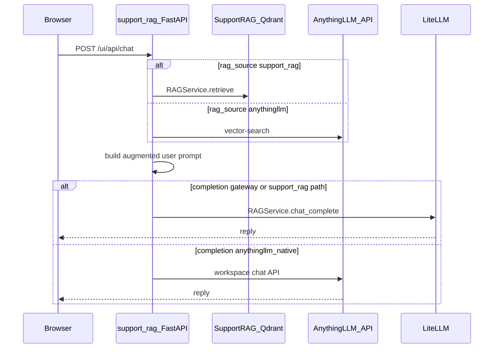

# Dual-RAG: web UI and FastAPI routes

## Execution boundary (manual handoff)

- **Start this plan only** when the user (or a new agent session) **explicitly** targets this file. Do **not** run it as an automatic follow-up to the config plan.
- **In scope:** sections below (routes, `web_routes` HTML/JS, ingest admin route). **Stop when done** (or blocked).
- **Do not automatically continue** to [dual_rag_e2e.plan.md](dual_rag_e2e.plan.md). E2E scripts and runbook work require a **separate** run when the user is ready.
- **Prerequisite (optional):** [dual_rag_config.plan.md](dual_rag_config.plan.md) should be implemented first; this plan references it, but the user may run this only after a merge or in parallel with agreement — the agent must **not** assume a prior run completed in the same session.

**Related (reference):** [dual_rag_config.plan.md](dual_rag_config.plan.md) (config, `anythingllm_client`, secrets) · [dual_rag_e2e.plan.md](dual_rag_e2e.plan.md) (E2E scripts, runbook — **not** executed in this same run).

---

## Architecture (retrieval + completion)



- **Retrieval:** `service.retrieve` ([`../support_rag/web_routes.py`](../support_rag/web_routes.py)) vs AnythingLLM `vector-search` via [anythingllm_client](dual_rag_config.plan.md#2-anythingllm-client-module-library).
- **Gateway completion:** `RAGService.chat_complete` → LiteLLM. **Native completion:** AnythingLLM `workspace_chat` (see config plan for mode / double-retrieval).
- **Runbook (Option B vs completion toggle):** [dual_rag_e2e.plan.md](dual_rag_e2e.plan.md#5-documentation).

---

## 2b. `UIChatBody` fields

Include: `rag_source`, `anythingllm_completion` (`gateway` | `anythingllm_native`, only when `rag_source == "anythingllm"` and `use_rag`), `top_k`, `top_n`, `score_threshold`, `include_retrieval`.

## 2c. `ui_chat` logic

- If **`not use_rag`:** always **`service.chat_complete`** → LiteLLM (no AnythingLLM retrieval; `anythingllm_completion` ignored).
- If **`use_rag` and `rag_source == "support_rag"`:** `service.retrieve` → build prompt → **`service.chat_complete`**.
- If **`use_rag` and `rag_source == "anythingllm"`:**  
  1. `vector_search` → synthetic `RetrievalResponse` → augmented user text.  
  2. If **`anythingllm_completion == "gateway"`** (default): **`service.chat_complete`** → LiteLLM.  
  3. If **`anythingllm_completion == "anythingllm_native"`:** **`workspace_chat`** → reply; **no** `chat_complete` on that path.

**Response shape:**

```json
{
  "reply": "string",
  "retrieval": "optional, when include_retrieval=true",
  "completion_route": "gateway | anythingllm_native | n/a",
  "rag_source": "support_rag | anythingllm | none",
  "meta": {
    "alm_chat_mode": "string (only when completion_route=anythingllm_native)",
    "filters_applied": "bool (AnythingLLM retrieval only)",
    "retrieval_truncated": "bool",
    "request_id": "string"
  }
}
```

**Payload size cap (NFR):** when `include_retrieval=true`, cap retrieval payload before JSON response:

- per-chunk `text` truncated to `WebUiState.retrieval_chunk_char_cap` (default e.g. **2000** chars; marker `…[truncated]`).
- max **N** chunks (default e.g. **20**, hard cap **50**).
- `meta.retrieval_truncated: true` when any cap fired.

**Server-side observability:** one structured log line per request: `rag_source`, `completion_route`, `top_k` / `top_n`, `score_threshold` (if applicable), `latency_ms_total`, `latency_ms_retrieval`, `latency_ms_completion`, retrieval count, `request_id`. **No** prompts, replies, or chunk text in logs.

**Failure modes:** structured errors; error→UI mapping in §3 item 6. If `anythingllm_native` and chat API fails, surface like other ALM failures.

## 2d. Relationship: model source (A/B) vs completion (gateway / native)

| `anythingllm_models_source` | Meaning |
|-----------------------------|---------|
| `alm_desktop` | Configure models only in AnythingLLM Desktop. |
| `litellm_gateway` | In AnythingLLM, set LLM + embedder to project LiteLLM. |

| `anythingllm_completion` | Meaning |
|--------------------------|--------|
| `gateway` | `support_rag` → `chat_complete` → LiteLLM. |
| `anythingllm_native` | `support_rag` → AnythingLLM workspace chat. |

**Docs:** [dual_rag_e2e.plan.md](dual_rag_e2e.plan.md#5-documentation) — Option B does not replace the completion toggle; gateway completion remains `support_rag` → LiteLLM unless native is selected.

## 2e. `anythingllm_models_source` in the web app + Verify Option B

- Selection persists (debounced `PUT /ui/api/web-ui`); drives guidance panels and runbook anchors.
- **Status line:** if ALM API exposes current LLM/embedder provider, include `chat-context.alm_provider_summary`; else **“Mode A/B = guidance only — verify in AnythingLLM Desktop.”**
- **Optional:** `litellm_reachable` from `GET llm_gateway.base_url/health` (no automatic mutation of ALM config).

**Verify Option B (requirement):**

- **UI:** in §3a fieldset, enabled when `anythingllm_models_source == litellm_gateway`.
- **Route:** `POST /ui/api/anythingllm/verify-option-b` (admin/operator scope, same CSRF/SameSite as other admin POSTs).
- **Server checks (no secrets in response):** (1) probe LiteLLM with server-held key → `litellm_reachable`. (2) `GET` ALM system/workspace settings; extract only provider name + **host** (no keys); compare to `llm_gateway.base_url` host. (3) Return `{ litellm_reachable, alm_provider_seen, host_match, verified_at }`.
- **UI feedback:** green / yellow / red with remediation link to runbook `#option-b-verify`.

**Out of scope (MVP):** push ALM provider config via admin API (spike only if stable).

- `UIChatBody` / `ui_chat` need not include `anythingllm_models_source` for pipeline correctness; completion is driven by `anythingllm_completion` and retrieval params.

## 2f. `GET /ui/api/chat-context`

**Route:** `GET /ui/api/chat-context`.

**Auth:** same as existing `/ui/api/web-ui` GET in [`../support_rag/web_routes.py`](../support_rag/web_routes.py) — web UI enabled, operator session; do not relax. `Cache-Control: no-store`. Same origin.

**Response shape (no secrets):**

```json
{
  "rag_source": "support_rag | anythingllm",
  "anythingllm": {
    "models_source": "alm_desktop | litellm_gateway",
    "completion": "gateway | anythingllm_native",
    "base_url_display": "http://127.0.0.1:3001",
    "workspace_slug": "support-kb",
    "alm_provider_summary": "string | null",
    "alm_chat_mode_default": "string | null"
  },
  "llm_gateway": {
    "base_url_display": "http://127.0.0.1:4000",
    "litellm_reachable": "bool | null"
  },
  "retrieval_caps": {
    "support_rag_top_k_max": 20,
    "anythingllm_top_n_max": 12,
    "retrieval_chunk_char_cap": 2000
  },
  "ui": {
    "show_retrieval_context": "bool",
    "links": [
      { "label": "AnythingLLM API docs", "url": "http://127.0.0.1:3001/api/docs" },
      { "label": "Runbook (Option A)", "url": "docs/e2e-anythingllm.md#option-a-alm-desktop-only" },
      { "label": "Runbook (Option B)", "url": "docs/e2e-anythingllm.md#option-b-via-litellm-gateway" }
    ]
  }
}
```

**Forbidden in response:** API keys, bearer tokens, header values, embedded credentials in URLs. Builder may assert no known secret substrings. **Error policy:** partial JSON with `null` for failed probes; do not 500 the whole response for one failing probe. Redaction: [dual_rag_config.plan.md §7a](dual_rag_config.plan.md#7a-secrets-policy-single-source-of-truth).

---

## 3. Browser UI (same `/ui` app)

**No second web server** — one FastAPI app; ALM is a separate process.

1. **Per-source retrieval** — Support RAG: `top_k` → `RetrievalRequest`. AnythingLLM: `topN`, `scoreThreshold` (from `WebUiState` + config defaults). Dim/hide inapplicable controls.
2. **Show retrieved context** — checkbox; `include_retrieval` on chat POST; second panel with JSON or readable chunks; persist in `WebUiState`.
3. **Status line** — from `chat-context`; examples in prior work; refresh after `web-ui` save and after Verify Option B.
4. **3a — Option A/B** — fieldset, radios, dynamic panel, **Verify Option B** (when B), debounced `PUT /ui/api/web-ui`. Visible at minimum when RAG source = AnythingLLM; selection retained when switching to Support RAG. No auto-write of ALM on-disk config.
5. **3b — Completion** — only when **Use RAG** and RAG source = AnythingLLM; hidden for Support RAG and when RAG off. Map to `anythingllm_completion` / `UIChatBody`.
6. **4 — Ingest to AnythingLLM** — fieldset: path, optional server folder name, workspace (slug: config + optional override in `WebUiState`), **Ingest** button. `POST /ui/api/ingest-folder-anythingllm` walks files like [`../support_rag/folder_ingest.py`](../support_rag/folder_ingest.py) via client helpers. **Idempotency:** `var/anythingllm_ingest_state.json` (logical id → `alm_doc_id`, etc.); on change, delete old doc in ALM then re-upload; if delete API missing, WARN and allow duplicates. Report added/skipped/replaced.
7. **5 — Operator links** — runbook (relative or configurable), `GET /rag/health`, ALM `http://<host>:<port>/api/docs`. New tab, no secrets in URLs.
8. **6 — Error detail** — `detail` / `http_status` / `body_snippet` from server. **Mapping** (in client/helpers, rendered here):
   - ALM `401` — API key / env. · `404` workspace — bad slug. · `404` chat path — version may lack API; use gateway or upgrade. · `5xx` — check Desktop logs. · timeout/refused — Desktop / port. · LiteLLM `401/4xx` + `#litellm-key`. · LiteLLM unreachable. · `verify-option-b` `host_match=false` — yellow banner to fix Desktop provider.
9. **7 — a11y / mobile** — `<fieldset>` / `<legend>`, labels, keyboard order, larger tap targets, `meta viewport`, `word-break` for long errors.

**Persistence:** `WebUiPatch` for all new fields (debounced `saveUiPatch`).

## E2E note: same-process web UI

The dual-RAG UI is not a second process. Start/stop and `/ui/` probe: [dual_rag_e2e.plan.md](dual_rag_e2e.plan.md#3b-e2e-stack-explicit-dual-rag-web-ui-same-process).

## Implementation order (this plan)

3. `UIChatBody` + `ui_chat` + caps + logging.  
4. `GET /ui/api/chat-context` + `POST /ui/api/anythingllm/verify-option-b`.  
5. HTML/JS for §3.  
6. `POST /ui/api/ingest-folder-anythingllm` + fieldset.  

**Dependency:** items 1–2 are the [dual_rag_config.plan.md](dual_rag_config.plan.md) implementation (in another run unless the user has combined steps explicitly). **End of this plan** — do **not** start [dual_rag_e2e.plan.md](dual_rag_e2e.plan.md) in the same session.
