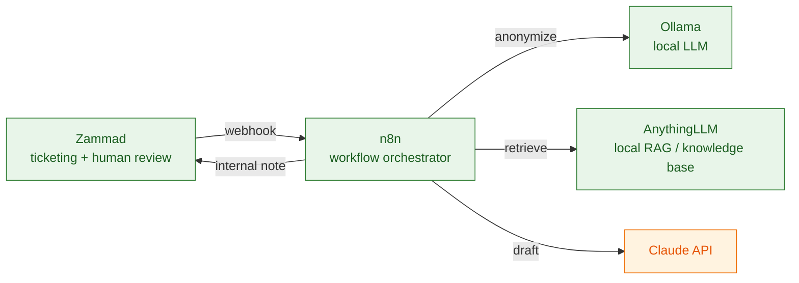
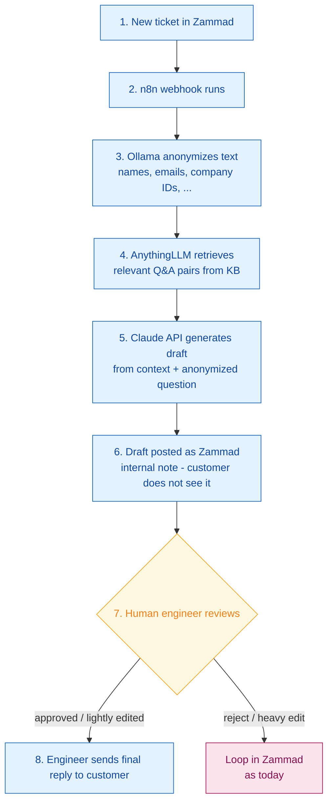
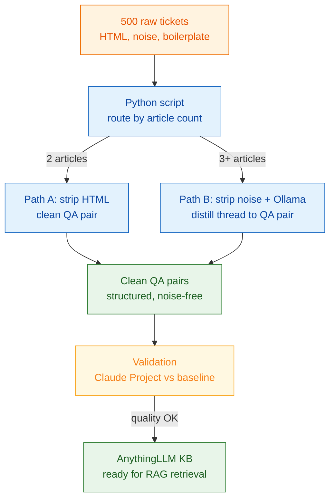

# AI Support Strategy Paper
**acontis technologies GmbH — EC-Support Automation**
*Status: Fixed design snapshot — April 30, 2026*

---

## 1. Basic Idea

The EC-Support team handles a high volume of repetitive technical questions about EtherCAT, PROFIBUS, ENI files, and related tooling. A significant portion of answers already exist in 7,000+ historical support tickets.

The goal is to **draft answers automatically from historical knowledge**, while keeping a human engineer in control of every customer-facing reply. No answer is ever sent to a customer without explicit human approval.

A proof-of-concept using Claude Desktop with 500 tickets manually loaded into a project has already demonstrated that the quality of AI-generated draft answers is feasible and useful.

---

## 2. Strategy and Architecture

### Core Principles

- **Human control** — every draft is reviewed and approved by an engineer before reaching the customer.
- **Privacy first** — customer PII is anonymized locally before touching any external API.
- **Minimal complexity** — use off-the-shelf tools connected via REST APIs; avoid building and maintaining a custom application.
- **Iterative delivery** — ship a working first iteration quickly; improve incrementally.

### Component Overview

| Component | Tool | Purpose |
|-----------|------|---------|
| Ticketing | Zammad | Ticket intake, internal notes, customer communication |
| Orchestration | n8n (local) | Visual workflow automation; connects all components |
| Anonymization | Ollama (local LLM) | Strips PII before any data leaves the local network |
| Knowledge base | AnythingLLM (local) | RAG: indexes clean Q&A pairs, retrieves relevant context |
| Draft generation | Claude API | Generates proposed answer from retrieved context |
| Human review | Zammad (engineer) | Reviews draft internal note, edits, sends final reply |

### Diagram 1 — System Landscape

Components and their connections via REST API.

> All components except Claude API run locally on-premises.

---

### Diagram 2 — Automation Workflow

Step-by-step flow from new ticket to customer reply.

---

### Diagram 3 — Distillation Pipeline

One-time batch process that builds the knowledge base from 500 raw tickets.

### What This Is Not

- Not a fully automated reply system
- Not a RAG system built from scratch
- Not a complex custom application
- Not a system that auto-updates its knowledge base from new tickets (future step)

---

## 3. Distillation Phase

### Purpose

The Claude API cannot receive all 500 tickets in a single prompt — the context window is too small. A clean, structured knowledge base of Q&A pairs must be built first and indexed in AnythingLLM.

### Source Material

- 500 historical tickets currently producing good results in Claude Desktop project
- Each ticket is a structured text file with `ARTICLE00`, `ARTICLE01`, etc.
- Tickets contain significant noise: HTML tags, email signatures, legal disclaimers, quoted reply chains, images with no extractable text, multilingual boilerplate

### Routing Logic

Tickets are routed by article count — a simple, deterministic split requiring no AI:

**Path A — 2-article tickets (Python only):**
- `ARTICLE00` = customer question
- `ARTICLE01` = support answer
- Python script extracts, cleans, outputs Q&A pair
- No LLM involvement

**Path B — 3+ article tickets (Python + local LLM):**
- Conversation spans multiple exchanges; resolution may be spread across articles
- Python script extracts all articles, strips noise
- Local LLM (Ollama) distills the full thread into a single clean Q&A pair

### Python Script Specification

The preprocessing script shall:

1. **Parse ticket structure** — identify `### ARTICLE__HEADER` and `### ARTICLE__BODY` blocks
2. **Route by article count** — 2 articles → Path A; 3+ articles → Path B
3. **Strip HTML** — remove all HTML tags using `beautifulsoup4`; keep plain text only
4. **Remove signatures** — detect and remove blocks starting with the `____________________________` pattern
5. **Remove legal disclaimers** — detect and remove standard boilerplate (Italian and English confidentiality footers)
6. **Remove quoted reply chains** — strip content inside `<blockquote>` tags
7. **Remove image references** — drop `` tags entirely (no extractable content)
8. **Output Path A tickets** — save as structured text file: `QUESTION:` block + `ANSWER:` block
9. **Output Path B tickets** — save as structured text file with all cleaned articles labeled `ARTICLE_00`, `ARTICLE_01`, etc., ready for LLM distillation
10. **Log routing statistics** — report how many tickets went to each path

### Local LLM Distillation (Path B)

- Tool: Ollama running **Qwen 2.5 72B** or **Llama 3.3 70B** (requires 64GB RAM — Mac Mini M2 2023)
- Input: cleaned multi-article thread from Python script
- Task: distill the full conversation into a single `QUESTION:` / `ANSWER:` pair
- The answer should capture the final resolution, not just the first response
- Speed is not critical; batch processing over multiple hours or days is acceptable

### Validation Step

Before feeding distilled tickets into AnythingLLM:

1. Load all 500 distilled Q&A pairs into a **new Claude Project** (Claude Desktop)
2. Run the same test questions used to validate the original 500-ticket project
3. Compare quality: if results hold or improve, distillation is trustworthy
4. If quality drops, inspect a sample of distilled tickets manually to identify pipeline errors
5. Only proceed to AnythingLLM after validation passes

---

## 4. Step-by-Step Implementation Plan

### Phase 0 — Preparation (Day 1)
- [ ] Install Ollama on Mac Mini; pull Qwen 2.5 72B or Llama 3.3 70B model
- [ ] Install AnythingLLM locally
- [ ] Install n8n locally
- [ ] Verify Zammad webhook and REST API access
- [ ] Obtain Claude API key

### Phase 1 — Knowledge Base Construction (Days 2–4)
- [ ] Write and test Python preprocessing script on a sample of 10 tickets (both paths)
- [ ] Run script on all 500 tickets; review routing statistics
- [ ] Run Ollama distillation on all Path B tickets
- [ ] **Validation**: load 500 distilled Q&A pairs into new Claude Project; compare quality against baseline
- [ ] If validation passes: import distilled Q&A pairs into AnythingLLM

### Phase 2 — Pipeline Assembly (Days 4–5)
- [ ] Configure AnythingLLM workspace and verify RAG retrieval via its API
- [ ] Build n8n workflow step by step:
  - [ ] Step 1: Zammad webhook trigger on new ticket
  - [ ] Step 2: HTTP call to Ollama for anonymization
  - [ ] Step 3: HTTP call to AnythingLLM for RAG retrieval
  - [ ] Step 4: HTTP call to Claude API for draft generation
  - [ ] Step 5: Zammad REST API — save draft as internal note
  - [ ] Step 6: Zammad REST API — reassign ticket to engineer

### Phase 3 — First End-to-End Test (Day 5–7)
- [ ] Manually trigger pipeline on one existing ticket with known answer
- [ ] Verify draft appears as internal note in Zammad
- [ ] Verify ticket is reassigned to engineer
- [ ] Engineer reviews and judges quality
- [ ] Fix any integration issues at component seams

### Phase 4 — Live Trial (Week 2)
- [ ] Enable webhook for incoming tickets
- [ ] Engineers review every draft; record quality judgments (good / edited / rejected)
- [ ] Identify systematic failure patterns
- [ ] Decide on next iteration priorities

---

## 5. Decision Log

The following decisions were made explicitly and should not be revisited without good reason:

| Decision | Rationale |
|----------|-----------|
| Local LLM for anonymization | PII must not leave the local network |
| Claude API for draft generation | Highest quality for the cognitive task of answering technical questions |
| Static knowledge base for now | Simplicity; auto-updating from new tickets is a future step |
| Human review mandatory | Quality control; no customer risk; provides evaluation signal |
| AnythingLLM for RAG | No-code RAG pipeline with REST API; runs locally |
| n8n for orchestration | Visual workflow; no custom application to maintain |
| Ollama for local LLM | Exposes REST API directly; n8n can call it natively |
| 2-article routing heuristic | Simple, deterministic, no ML required; good enough for first iteration |
| 500 tickets as starting knowledge base | Already validated in proof-of-concept; manageable scope |
| Speed not critical for distillation | One-time batch job; quality preferred over speed |

---

## 6. Known Limitations and Future Steps

### Current Limitations
- Knowledge base is static — new tickets do not enrich it automatically
- 2-article heuristic may include unresolved tickets (e.g. "please send logs" exchanges) — accepted for now
- Local LLM distillation quality for complex multi-article tickets is unvalidated until Phase 1
- Pipeline covers only the 500 currently validated tickets, not all 7,000

### Future Steps (not in scope for this iteration)
- Automated pipeline to distill and add new resolved tickets to the knowledge base
- Expand knowledge base from 500 to full 7,000 ticket archive
- Quality scoring based on engineer review signals (approved / edited / rejected)
- Fine-tuning or prompt optimization based on observed failure patterns
- Evaluation of whether local LLM can eventually replace Claude API for draft generation

---

## 7. Risk Assessment

| Risk | Likelihood | Impact | Mitigation |
|------|-----------|--------|------------|
| Local LLM distillation introduces subtle errors | Medium | High | Validation step (Phase 1) with Claude Project A/B test |
| Integration friction between components | High | Medium | Test one ticket end-to-end before enabling automation |
| AnythingLLM retrieval surfaces wrong tickets | Medium | Low | Human review catches bad drafts before customer sees them |
| PII slips through anonymization | Low | High | Engineer reviews every draft; Zammad note is internal only |
| Mac Mini performance insufficient for Ollama + pipeline load | Low | Medium | Speed not critical; batch and pipeline can run sequentially |
| n8n workflow maintenance burden | Low | Low | Visual tool; no custom code to maintain |

---

*Document owner: Stefan Zintgraf, acontis technologies GmbH*
*This document reflects design decisions made on April 30, 2026 and should be treated as a fixed snapshot. Changes require a new versioned document.*
