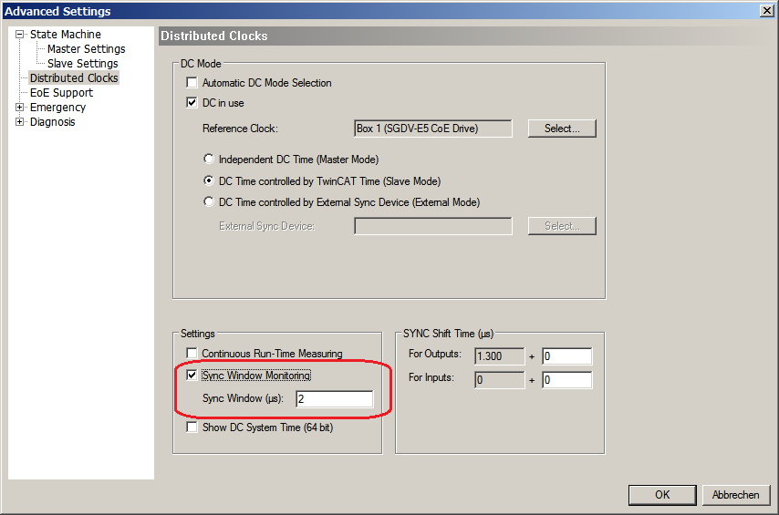

*************************
Configuration with ET9000 
*************************

Enable "DC Mode" for slave
**************************

If a slave supports DC, an additional tab in ET9000 appears.

.. figure:: ../Media/DC_Mode.png
    :align:     center
    :alt:       

 
In the "Advanced Settings" additional slave specific parameters may be set. By default the cycle time for "SYNC 0" is equal to the bus cycle time (Sync Unit Cycle).

.. figure:: ../Media/DC_Mode2.png
    :align:     center
    :alt:       

Enable Sync Window Monitoring for master
****************************************

By enabling the option "Sync Window Monitoring" in the "Advanced Settings" of the master, the EtherCAT configurator will insert a command (datagram) in the cyclic frame to read the ESC registers 0x092C. If this is selected the master will throw the notification :ref:`dc_api:emNotify - EC_NOTIFY_DC_SLV_SYNC`.

******************************
Configuration with EC-Engineer
******************************

The EC-Engineer automatically choses the DC settings for slaves as proposed by the device's vendor and sets DCM mode to bus shift.

The settings can be changed according to the project's needs. DC options are part of the EC-Engineer Expert Mode. The Expert Mode can be activated from the menu:

.. figure:: ../Media/EC-Engineer.png
    :align:     center
    :alt:   

Distributed Clocks Master settings (Expert)
*******************************************

In this tab, the user can change distributed clocks related settings. The tab is only available if the configuration contains slaves.

 .. figure:: ../Media/EC-Engineer2.png
    :align:     center
    :alt:   

- Reference Clock Name: Name of the reference clock. By default, this is the first slave with DC support.
- Master Shift: The reference clock controls the Master time
- Bus Shift: The Master time controls the reference clock. A command will be inserted in the Cyclic frame to adjust the reference clock system time (write to register 0x0910). 
- Continuous Propagation Compensation: A command will be inserted in the Cyclic frame which allows the EtherCAT master to measure and compensate the propagation delay time by time.
- Sync Window Monitoring: A command will be inserted in the cyclic frame to read the ESC registers 0x092C. If this is selected the master will throw a notification.
- Show 64Bit System Time: Master supports slaves with 32bit and 64bit system time register (0x0910). If this is selected he will interpret it as 64bit system time.

.. note:: If no reference clock is displayed, please ensure at least one slave in the network is configured for DC operation mode :ref:`dc_config:Distributed Clocks Slave settings (Expert)`

Distributed Clocks Slave settings (Expert)
******************************************

In this tab, the user can change distributed clocks related settings. The tab is only available if the device's vendor specified the DC usage. Sync signal generation or DC latching is selected automatically according to Operation Mode.

.. figure:: ../Media/Device_Editor.png
    :align:     center
    :alt:   

- Operation Mode: Selectable DC operation modes. The modes cannot be edited.
- Sync Unit Cycle: Base interval in microseconds which will be used from master. The Sync Units can be activated and configured to generate signals. 

.. seealso:: SyncSignal Generation in the ET1100 Datasheet for time describing

.. figure:: ../Media/Sync_Units.png
    :align:     center
    :alt:   