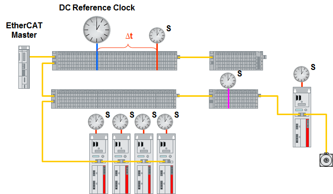
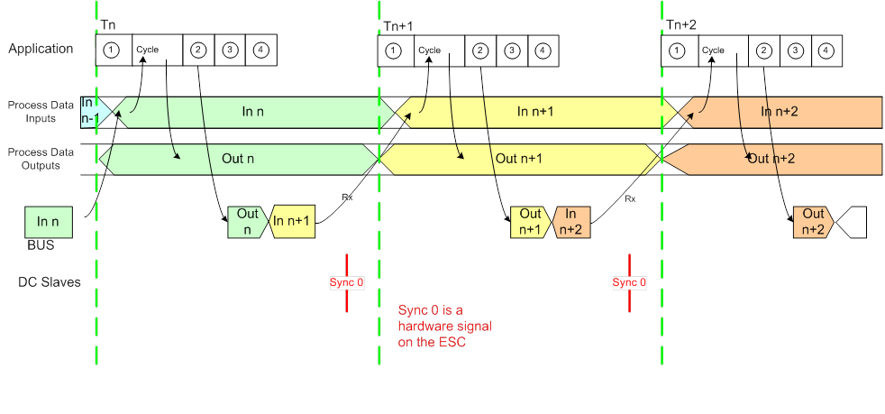

******************
Technical overview
******************

Support slaves and topologies
*****************************

EC-Master supports all currently existing slave types and possible topologies:

- Slaves with 32 bit or 64 bit system time register (0x0910)
- Reference Clock with 32 bit or 64 bit system time register (0x0910)
- Reference Clock as first slave (auto increment address 0) or in the middle. Only slaves behind the reference clock could be synchronized.
- Drift compensation with 32 bit or 64 bit ARMW command in the cyclic frame
- Topologies: Line, Daisy chain, Daisy chain with drop lines, tree structure, star topology with EK1122 junctions

Typical Bus Timing
******************

The following diagram gives detailed information about the timing of the system:

The timing of the Job Task must be accurate if the system must operate in real-time.
It can be disturbed by jitter or drift. Small jitter values are irrelevant, but high jitter values can compromise process data exchange by causing delays that violate strict cycle deadlines.
Timing disturbances may have various causes on the master system like hardware or software delays which are beyond the EC-Master stack's control.
However, different DCM modes and parameters are available to compensate the natural drift of master and slaves and to fine-tune synchronization.

Implementation Details
**********************

The generation of Sync impulses is started after initialization and sending of 10000 FRMW frames which are required to bring slaves initially into sync. 
After this FRMW generation a grace period of 50 ms under real-time OSes is used and 500 ms using Windows is configured before start of cyclic operation of slaves, 
which causes the Sync impulse generation delayed by this grace period. 

Initial propagation delay measurement and offset compensation commands are not part of the ENI file. The ARMW command for drift compensation is part of the cyclic frame.

Slaves in sync
**************

Slaves in sync means that the system time difference of all DC slaves do not exceed a configured limit. Out of sync is detected individually and immediately for each slaves. 

The master awaits that the slaves are in sync in Master state transition INIT->PREOP. Therefore the master state transition may timeout if the slaves do not get in sync.

Due to technology the slaves are always getting in sync as long as there is no error in setup. In order to detect system time difference exceeding, :ref:`dc_technical:Sync Window Monitoring` is used. 

Sync Window Monitoring
**********************

Sync Window Monitoring must be explicitly enabled in configuration. 

The system time difference exceeding detection in Sync Window Monitoring uses a deviation limit and a settle time and is issued continuously with configured commands (Ado 0x092C) in cyclic frames.

In sync is assumed if there is no violation of the system time difference limit (for all DC slaves!) detected within the settle time.
The deviation limit (dwDevLimit) and settle time (dwSettleTime) can be configured using :cpp:func:`emDcConfigure`. 

If the configuration only contains the cyclic commands for SAFE-OP or OP (e.g. ET9000) the master queues acyclic datagrams (Ado 0x092C) for system time difference measurement.

If there are at less than two DC slaves on bus (e.g. it the reference clock is the only DC slave on bus), Sync Window Monitoring is skipped. If it is skipped, because it is not enabled in configuration or there are less than two DC slaves on bus, slaves are immediately considered in sync.
