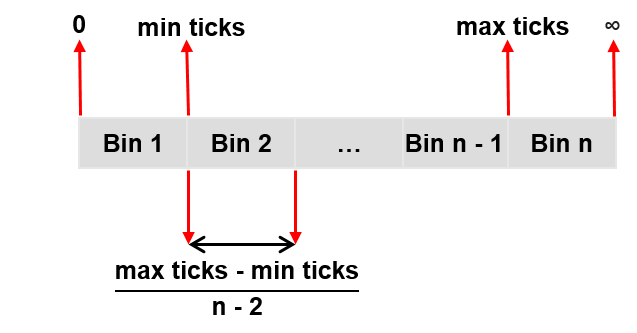

***********************
Performance Measurement
***********************

The acontis EC-Master software has a built-in performance measurement capability. This can be used to measure the execution times of the job functions that are called within the cyclic part of the application, as well as application specific functions. These executions times can be recorded both in form of overall statistics (min/avg/max) and in form of histograms.

Enabling performance measurements
*********************************

Performance measurements need to be enabled inside the master init parms.

.. code-block:: cpp

    /* enable performance measurements */
    oInitParms.PerfMeasInternalParms.bEnabled = EC_TRUE;

    /* initialize the master */
    dwRes = ecatInitMaster(&oInitParms);

.. seealso:: :cpp:struct:`EC_T_PERF_MEAS_INTERNAL_PARMS`

Retrieving overall performance statistics (min/avg/max)
*******************************************************

Performance measurements in the example application can be activated using the command line parameter (-perf). It enables performance measurements and performance histograms as well. The resulting measurement values are recorded every few seconds to the log file, and printed to the console in the following format:

.. code-block:: text

    PerfMsmt 'JOB_ProcessAllRxFrames' (min/avg/max) [usec]:   12.5/  15.9/  25.6
    PerfMsmt 'JOB_SendAllCycFrames  ' (min/avg/max) [usec]:    3.6/   5.7/  14.8
    PerfMsmt 'JOB_MasterTimer       ' (min/avg/max) [usec]:    2.1/   3.7/   8.2
    PerfMsmt 'JOB_SendAcycFrames    ' (min/avg/max) [usec]:    0.3/   0.6/   2.6
    PerfMsmt 'Cycle Time            ' (min/avg/max) [usec]:  918.4/ 999.6/1067.9
    PerfMsmt 'myAppWorkPd           ' (min/avg/max) [usec]:    0.1/   0.4/   0.8
    PerfMsmt 'JOB_Total             ' (min/avg/max) [usec]:   19.0/  25.9/  39.2

In an application these values can be retrieved using the `emPerfMeasGet`/`emPerfMeasAppGet` APIs. These APIs require the index of a measurement point. Note that the index of a particular measurement point is implementation defined and not the same in all versions. It should therefore be detected at runtime using `emPerfMeasGetInfo`. The following example shows how measurements for `JOB_ProcessAllRxFrames` can be retrieved:

.. code-block:: cpp

    EC_T_DWORD dwProcessAllRxFramesIdx = 0;
    EC_T_DWORD dwMeasNum = 0;
    dwRes = ecatPerfMeasGetNumOf(&dwMeasNum);

    /* find index of perf measurement */
    for (EC_T_DWORD i = 0; i < dwMeasNum; ++i)
    {
        EC_T_PERF_MEAS_INFO PerfMeasInfo;
        dwRes = ecatPerfMeasGetInfo(i, &PerfMeasInfo, 1);

        if (0 == OsStrncmp("JOB_ProcessAllRxFrames", PerfMeasInfo.szName, OsStrlen("JOB_ProcessAllRxFrames") + 1))
        {
            dwProcessAllRxFramesIdx = i;
            break;
        }
    }

    /* retrieve values */
    EC_T_PERF_MEAS_VAL PerfMeasVal;
    dwRes = ecatPerfMeasGetRaw(dwProcessAllRxFramesIdx, &PerfMeasVal, EC_NULL, 1);

Recording performance histograms
********************************

In addition to the overall statistics described above it is possible to create a histogram of all results of a particular benchmark. The histogram has the following format:

.. code-block:: cpp

    /* enabling histograms */
    EC_T_PERF_MEAS_COUNTER_PARMS* pHistParms = EC_NULL;
    pHistParms = &oInitParms.PerfMeasInternalParms.HistogramParms;
    /* amount of bins to use for the histogram */
    pHistParms->dwBinCount = 1000;
    /* range of the histograms.
     * - results below qwMinTicks are stored in the first bin
     * - results above qwMaxTicks are stored in the last bin
     *
     * a good starting point is the range 0 <-> 2 * the amount of ticks per cycle
     */
    pHistParms->qwMinTicks = 0;
    pHistParms->qwMaxTicks = 2 * qwTicksPerCycle;

    /* initialize the master */
    dwRes = ecatInitMaster(&oInitParms);

.. seealso:: :cpp:struct:`EC_T_PERF_MEAS_HISTOGRAM_PARMS`

Similar to the overall statistics it is possible to retrieve the histograms using `emPerfMeasGetRaw`:

.. code-block:: cpp

    /* retrieve values */
    EC_T_PERF_MEAS_HISTOGRAM PerfMeasHist;
    PerfMeasHist.aBins = (EC_T_DWORD*)OsMalloc(dwBinCount * sizeof(EC_T_DWORD));
    PerfMeasHist.dwBinCount = dwBinCount;
    dwRes = ecatPerfMeasGetRaw(dwProcessAllRxFramesIdx, EC_NULL, &PerfMeasHist, 1);

Special benchmark types
***********************

In addition to the normal benchmarks as described above, there are some special benchmark types which are flagged in :cpp:struct:`EC_T_PERF_MEAS_INFO`.

.. datatemplate:xml:: EC_T_PERF_MEAS_FLAG
    :source: ../_build/doxygen/xml/combined.xml
    :template: doxygroups.jinja

Application benchmarks
**********************

In addition to the internal benchmarks it is possible to create application specific benchmarks using the `emPerfMeasApp` API.

.. code-block:: cpp

    static EC_T_PERF_MEAS_INFO_PARMS S_aPerfMeasInfos[] =
    {
        {"myBench", 0}
    };
    #define APPL_PERF_MEAS_NUM    (sizeof(S_aPerfMeasInfos) / sizeof(S_aPerfMeasInfos[0]))
    #define PERF_myBench          0

    EC_T_PERF_MEAS_APP_PARMS oPerfMeasAppParms;
    OsMemset(&oPerfMeasAppParms, 0, sizeof(EC_T_PERF_MEAS_APP_PARMS));
    oPerfMeasAppParms.dwNumMeas = APPL_PERF_MEAS_NUM;
    oPerfMeasAppParms.aPerfMeasInfos = S_aPerfMeasInfos;

    dwRes = ecatPerfMeasAppCreate( &oPerfMeasAppParms, EC_NULL);

    ecatPerfMeasAppStart(EC_NULL, PERF_myBench);
    /* benchmarked work */
    ecatPerfMeasAppEnd(EC_NULL, PERF_myBench);

API
***

emPerfMeasAppCreate
===================

.. doxygenfunction:: ecatPerfMeasAppCreate
    :outline:

.. doxygenfunction:: emPerfMeasAppCreate

.. doxygenstruct:: EC_T_PERF_MEAS_APP_PARMS
    :members:

emPerfMeasAppDelete
===================

.. doxygenfunction:: ecatPerfMeasAppDelete
    :outline:

.. doxygenfunction:: emPerfMeasAppDelete

emPerfMeasAppStart
==================

.. doxygenfunction:: ecatPerfMeasAppStart
    :outline:

.. doxygenfunction:: emPerfMeasAppStart

emPerfMeasAppEnd
================

.. doxygenfunction:: ecatPerfMeasAppEnd
    :outline:

.. doxygenfunction:: emPerfMeasAppEnd

emPerfMeasAppReset
==================

.. doxygenfunction:: ecatPerfMeasAppReset
    :outline:

.. doxygenfunction:: emPerfMeasAppReset

emPerfMeasAppGetNumOf
=====================

.. doxygenfunction:: ecatPerfMeasAppGetNumOf
    :outline:

.. doxygenfunction:: emPerfMeasAppGetNumOf

emPerfMeasAppGetInfo
====================

.. doxygenfunction:: ecatPerfMeasAppGetInfo
    :outline:

.. doxygenfunction:: emPerfMeasAppGetInfo

.. doxygenstruct:: EC_T_PERF_MEAS_INFO
    :members:

emPerfMeasAppGetRaw
===================

.. doxygenfunction:: ecatPerfMeasAppGetRaw
    :outline:

.. doxygenfunction:: emPerfMeasAppGetRaw

.. doxygenstruct:: EC_T_PERF_MEAS_VAL
    :members:

.. doxygenstruct:: EC_T_PERF_MEAS_HISTOGRAM
    :members:

emPerfMeasResetByTaskId
===============================

.. doxygenfunction:: ecatPerfMeasResetByTaskId
    :outline:

.. doxygenfunction:: emPerfMeasResetByTaskId

emPerfMeasGetNumOfByTaskId
==================================

.. doxygenfunction:: ecatPerfMeasGetNumOfByTaskId
    :outline:

.. doxygenfunction:: emPerfMeasGetNumOfByTaskId

emPerfMeasGetInfoByTaskId
=================================

.. doxygenfunction:: ecatPerfMeasGetInfoByTaskId
    :outline:

.. doxygenfunction:: emPerfMeasGetInfoByTaskId

emPerfMeasGetRawByTaskId
================================

.. doxygenfunction:: ecatPerfMeasGetRawByTaskId
    :outline:

.. doxygenfunction:: emPerfMeasGetRawByTaskId
