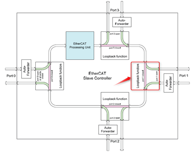
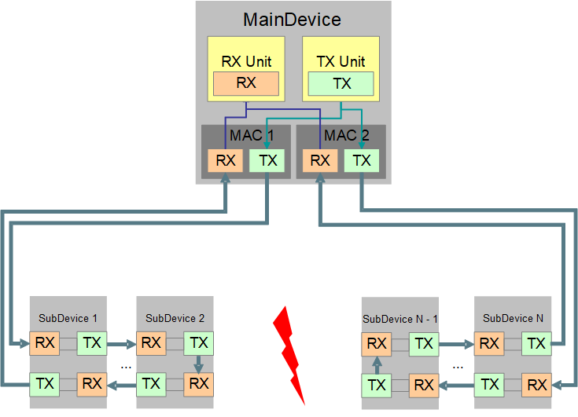
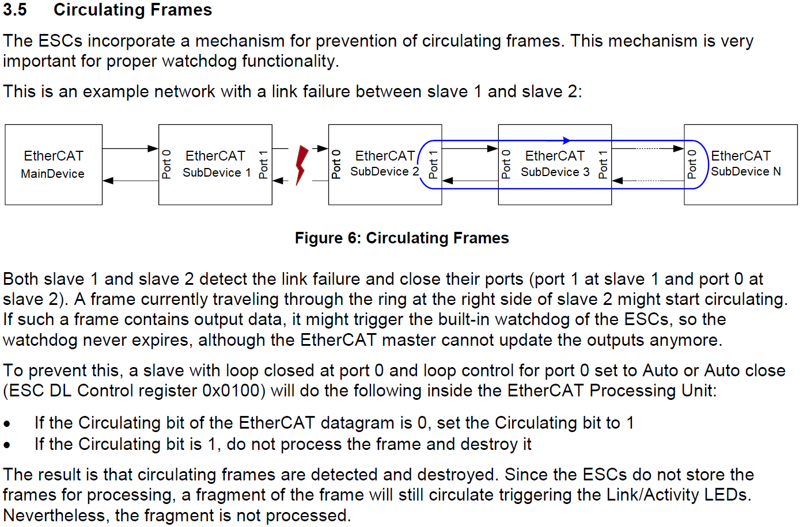
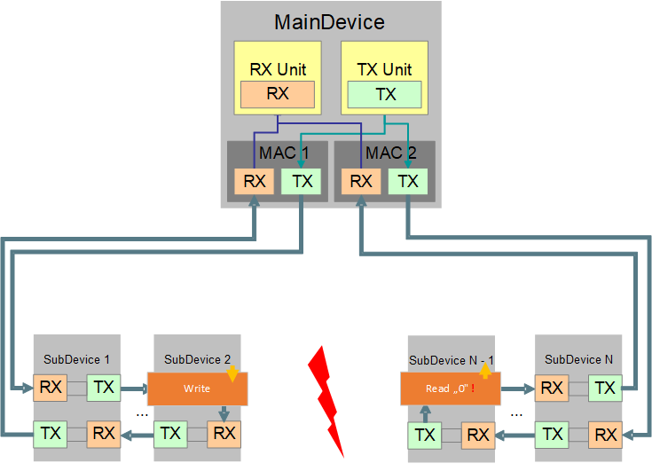
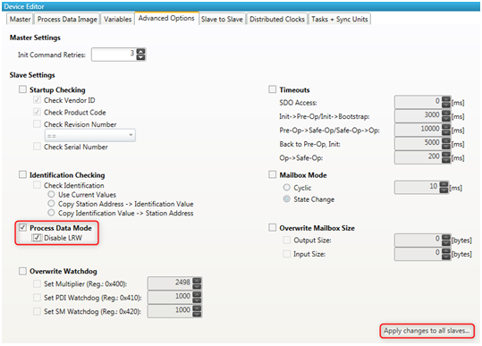

************
Introduction
************

Licensing
*********

Redundancy support is not included within the standard EC-Master license, thus the Redundancy support has to be licensed separately.
To activate Redundancy support, the EC-Master Stack has to be compiled with the option INCLUDE_RED_DEVICE set, which is the default,
if not explicitly disabled with EXCLUDE_RED_DEVICE.

Motivation
**********

Cables expose cause of defects. Without cable redundancy one broken line will lead to unreachable
devices. Applying cable redundancy eliminates the line as single point of failure within the EtherCAT®
solution. This feature pack offers cable redundancy with simple and intuitive integration.

Overview
********

The acontis EC-Master EtherCAT® MainDevice allows the support of two Network Interfaces to provide a Redundancy
feature.

A typical redundant configuration can be:

.. figure:: ../Media/cable-red_configuration.png
    :alt:
    
In this configuration the bus is connected from both sides (front and back) to two different network interfaces (main and redundant) on the Control Unit, carrying the EC-Master EtherCAT® MainDevice Stack. The frames are sent from and received on both interfaces. The main interface leads to the front and the redundancy interface to the back of the Control Unit.

The device is aware at which ports other devices are connected and opens and closes the ports accordingly by means of the port’s loopback function. The following figure shows the four ports of the ET1100, each with loopback control:
 

In case of line break the loopback function closes the connection to the next EtherCAT®-device. If the redundancy line is not equipped all devices behind the closed loop would be not accessible anymore!

In order to keep all EtherCAT®-devices reachable in case of line break each used EtherCAT®-device has to provide at least two EtherCAT® ports.
If somewhere in the middle a line breaks up, the loop is closed within the “bordering” SubDevices and both bus stubs are still communicating with the EC-Master stack. The following figure illustrates this:

All EtherCAT® devices still receive frames either from the main interface or from the redundant interface.

From an application’s point of view, the bus operates as usual as long all SubDevices are still powered and operating. By means of the API calls still operate the same like before the bus split up. Especially Auto Increment addressed and logical commands are still unchanged after the bus split. Process data is sent to and received from all devices accordingly and the integrity check by means of working counters (WKC) is still ensured. Even Hot Connect Groups that are configured to be immediately connected to each other and get separated by a line break are still functional. Therefore the application developer doesn’t need to change any calls or addresses during runtime.

The system automatically recovers from the situation as soon as the EtherCAT®-devices report the link to be established again. The EC-Master Stack scans the bus to verify that all lines are available while continuing the operation.

In case of a line break the EC-Master Stack detects the redundancy requirement and throws a notification ( :ref:`api:emNotify - EC_NOTIFY_RED_LINEBRK`) to the application, which enables a front-end or application user to be informed about the redundancy situation. The situation is handled immediately without any further needed interaction by the application. When the line break is fixed another notification ( :ref:`api:emNotify - EC_NOTIFY_RED_LINEFIXED`) is thrown to inform about the absence of the error situation.

The system can handle at most one line break at a time having all EtherCAT® devices reachable. If there are two or more lines broken the reachability of the EtherCAT® devices cannot be ensured anymore. The system automatically recovers from multiple line breaks as soon as the lines are fixed.
 
Junction Redundancy
===================

If the EtherCAT® MainDevice stack is running on systems with just a single Ethernet controller, it is possible to implement cable redundancy using junction devices, this is called “Junction Redundancy”.

.. figure:: ../Media/cable-red_junction-red.png
    :alt:

Behind the junction it is possible to set up a local ring which supports redundant operation. The whole system will stay operational in case of a break in this local ring.
Multiple such local rings are supported, each of them will become an independent redundant system.

By default, junction redundancy is disabled.
By calling :ref:`api:emIoControl - EC_IOCTL_SB_SET_JUNCTION_REDUNDANCY_MODE` it must be enabled by the user’s application.

In case of a line break the EC-Master Stack detects the redundancy requirement and throws a notification ( :ref:`api:emNotify - EC_NOTIFY_JUNCTION_RED_CHANGE`) to the application, which enables a front-end or application user to be informed about the redundancy situation. The situation is handled immediately without any further needed interaction by the application. Whenever the line break is fixed the same notification is thrown again to inform about the absence of the error situation.

.. important:: Just one single line break can be handled no matter how many local rings you have. Single fault tolerant. This can be explained by the circulating frame bit of the datagram header described in the EtherCAT® SubDevice Controller (ESC) Hardware Data Sheet ET1100 Section I – Technology Chapter 3.5. A frame will not be processed and destroyed when it traverses a second ESC with a auto closed port 0.

Application notes
*****************

Use LRD/LWR instead of LRW
==========================

.. important:: It is not allowed to use LRW EtherCAT® commands because they force that multiple EtherCAT® devices operate on the same frame. In the following figure, “SubDevice 1” gets the frame from MAC 1 and “SubDevice N+1” gets the frame from MAC 2. These are different frames. MainDevice and/or SubDevices may receive data other than what is expected.

LDR/LWR instead of LRW must be configured if multiple SubDevices are addressed by the same EtherCAT® Cmd. If in doubt, configure LDR/LWR. The following screenshots show how to configure the SubDevices.
 
Configuring with EC-Engineer 
----------------------------

In the MainDevice Advanced Options tab (Expert Mode View) the user can configure LRD/LWR usage instead of LRW for all SubDevices:

 
Configuring with ET9000
-----------------------

Chosing LDR/LWR instead of LRW within the ET9000 is located at the Advanced settings of the EtherCAT® SubDevice in the section General > Behavior.
 
.. figure:: ../Media/cable-red_config-LRD-LWR-2.png
    :alt:

Distributed clocks
==================

As an outstanding solution the acontis EC-Master EtherCAT® MainDevice Stack is fully capable of distributed clocks operation for bus shift as well as Master shift.
