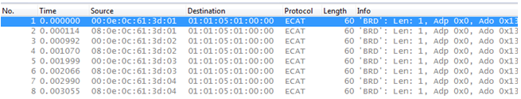

***************
Troubleshooting
***************

Evaluating the notifications
****************************

The EcMasterDemo demonstrates how to consume the notifications ( :ref:`api:emNotify - EC_NOTIFY_RED_LINEBRK` and :ref:`api:emNotify - EC_NOTIFY_RED_LINEFIXED`). 

Within the EcMasterDemo logs, the messages `Line is fixed` and `Line break between SubDevice <x> and <y>`` indicate the line state changes that application received as notifications.

.. seealso:: EcMasterDemo for how to start with two interfaces and :file:`EcNotification.cpp` for details about the implementation.

Tracing main and redundancy frames
**********************************

When tracing a redundancy enabled setup there are two different network adapters that send and receive EtherCAT® frames.
In order to know which frames are sent and which are responses from EtherCAT® SubDevices, the source MAC address gives the needed information. It also includes additional state information.
The destination MAC address of the EtherCAT® frames are fixed to the EtherCAT® unicast address 01:01:05:01:00:00.

The source MAC address of frames sent from any EtherCAT® interface of the Control Unit contains a part of the main EtherCAT® interface’s MAC address (e.g. 00:0e:0c:61:3d:7c). Before sending the frames, the source address gets modified to contain frame state information like the Redundancy Bit, Retry Index and the Redundancy Frame ID. Actual EtherCAT® SubDevices modify bit three in Byte 1 (mask: 0x02) to give clue about the Forwarding mode. According to the ET1100 datasheet, the Forwarding Rule bit is set if the ESC is configured to drop non-EtherCAT® frames. The Redundancy Bit is set for all frames sent at the redundant EtherCAT® interface and it is not set for all frames sent at the main EtherCAT® interface. The retry index is set to indicate sending retries of asynchronous frames. It defaults to Byte 2 of the MAC address and is incremented according to the retries. Byte three through five of the MAIN EtherCAT® interface’s MAC address are kept as they are. The Redundancy Frame ID at the last byte is incremented with every frame per interface.

The frame is structured the following way: 

+-----------+------------+------------------+--------+--------+--------+------------+
| Red. Bit  | Forwarding | Retry Index      | MAC    | MAC    | MAC    | RedFrameId |
| Mask 0x80 | Mask 0x02  | MAC Byte 2 + Idx | Byte 3 | Byte 4 | Byte 5 |            |
+===========+============+==================+========+========+========+============+
| 0x00      | 0x00       | 0x0e             | 0x0c   | 0x61   | 0x3d   | 0x01       |
+-----------+------------+------------------+--------+--------+--------+------------+

The remaining bits of MAC Byte 1 (mask 0x7d) are reserved.

The following sample trace of EtherCAT® frames with main and redundancy link shows the Redundancy bit 0x08 at the first byte and the incrementing RedFrameId:

When receiving frames, the EC-Master-Stack performs consistency checks and fast error detection. 
By means of the Redundancy Bit the EC-Master Stack detects if the line between main and redundancy link is broken. It expects for frames received at the redundant interface that they were sent from main interface and therefore their Redundancy Bit is not set. Frames received at main interface are marked with the Redundancy Bit if the line between main and redundancy link is not broken.

The Redundancy Frame ID at the last byte is used to merge received frames and to detect frame loss.
