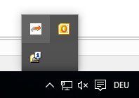

**************************
EC-EoE Gateway for Windows 
**************************

Installation 
************

The EC-EoE-Gateway for Windows package contains :file:`EcEoeGatewaySetup.msi` used for installation:

.. figure:: ../Media/EoE-Gateway_Setup.png
    :alt:

Additionally the TAP-Windows driver from OpenVPN (https://openvpn.net/community-downloads/) must be installed.

.. note:: The OpenVPN Service or traffic encryption is not related to the EC-EoE-Gateway. Only the `TAP Virtual Ethernet Adpater` component is required (https://github.com/OpenVPN/tap-windows6/releases).

.. figure:: ../Media/OpenVPN_Setup.png
    :alt:

After both installers finished, the TAP adapter and the EC-EoE-Gateway must be configured and started as described below.

EoE IPv4 configuration
**********************

The EoE devices and the TAP adapter must be **in the same IPv4 subnet** and it must be **independent of the other network addresses** used on the EC-EoE-Gateway system.

Example of independent subnets for LAN and EoE:

.. code-block::

    LAN: 192.168.0.1, netmask 255.255.255.0 (192.168.0.x)
    EoE: 192.168.2.1, netmask 255.255.255.0 (192.168.2.x)

The command `ipconfig /all` shows the ip addresses and netmasks of the networks. The EoE network must be independent from the other network addresses.

The IPv4 addresses of the EoE devices are manually assigned in the EtherCAT network configuration using EC-Engineer or another EtherCAT configuration tool and are finally part of the ENI file loaded at EC-Master.

The IPv4 address for EoE must be assigned at the TAP adapter:

.. figure:: ../Media/EoE-Gateway-Network_Connections.png
    :alt:

.. note:: Disabling and re-enabling the "NonAdmin Access" on the TAP driver can sometimes fix communication issues.

Gateway configuration and run control
*************************************

Configuration and run control are available by double click or right click to the EC-EoE-Gateway’s tray icon:

.. figure:: ../Media/EoE-Gateway_App.png
    :alt:

You have to select your network TAP-Windows adapter at first. Then enter the IP Adress of the running master unit, the port, the master instance and press :guilabel:`Start`.

:guilabel:`Start` will automatically save your config, so it is available if you start the program again. You can also :guilabel:`Save` your config without starting the gateway.

Press :guilabel:`Stop` if you like to stop the gateway.

If you click :guilabel:`Close` or on the :guilabel:`x` in the top right corner, the window will minimize to the tray icon again and the gateway is still running if you did not press stop before.

To close the gateway you have to :guilabel:`Close` the tray icon.

If you like the gateway to start as soon as the tool is started, you only have to select the :guilabel:`checkbox`, save your config and the tool will try to connect automatically at the next start.

If you like to start the tool with windows, please put it in the autostart folder.

There is also a possibility to use a local master. Therefore, click the box :guilabel:`Use local Master`, select the :guilabel:`Network Adapter`, set the :guilabel:`Cycle Time` and the :guilabel:`ENI file` and press :guilabel:`Start`.
