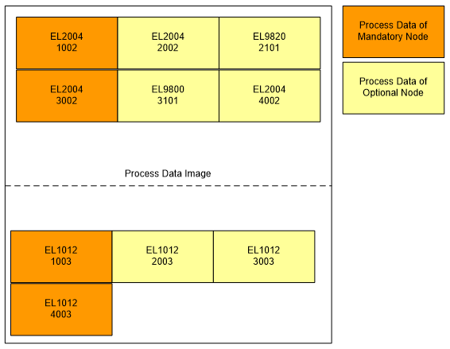

******************
Process Data Image
******************

All mandatory and optional slave are configured into a fixed process data image. The process data of absent slaves is not updated. The process data for each slave is mapped to its own process data image offset.

    
Since the frames on the wire are not changed by absent slaves following rules has to be taken in concern:

#. A Logical Write (LWR) is send, but the process data, which would hit an absent slave, has no effect.
#. A Logical Read (LRD) is send, but the process data, which would hit an absent slave, is overwritten by ``0`` because the EC-Master sends empty read frames.
#. A Logical Read/Write (LRW) is send, output process data located on positions where an absent slave would exchange in and out data. The out data sent is stored in the in data portion of the process data. To avoid this mirroring, it is recommended to use LWR/LRD instead of LRW for process data exchange to optional nodes. If this mirroring does not influence the application, it may still be used.