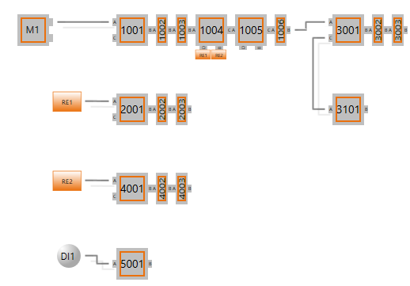

*********
Use cases
*********

This chapter describes which use cases are covered by the current revision of EC-Master Hot-Connect Feature Pack. Each use case is described with a small snippet of pseudo-code, for the integration in the application. All use cases which are described refer to following topology: 

Machine (plant) Start-Up
************************

Having a complex hardware application or a huge plant, application engineers often have to manage the task of bringing the device into service section by section. While doing so there is the requirement of starting the device with the final configuration (ENI File). The Hot-Connect Feature Pack allows to startup the EC-Master with such an “incomplete” configuration.

Preface
	To cover this use case it is required, that groups of slaves, which form a meaningful module, are combined into a Hot-Connect group within the ENI.

	.. seealso:: :ref:`Create Hot-Connect groups <createGroup>`

Operation
	A subset of modules (Hot-Connect groups) or all slaves are connected to the control system and the EC-Master stack is started into operational mode. There is no requirement of application intervention for this use case.

Mandatory slave fails
*********************

Since the network configuration can contain optional and mandatory slaves, it may happen that a mandatory slave becomes inaccessible (power loss or disconnected). 

-> This is by intention a scenario which Hot-Connect cannot cope with.

Scenario
	#. **Slave** All connected slaves are in operational state
	#. **Slave** Slave 4001 is shut down (power-off). The EtherCAT port on previous slave (1004 Port B) is loop closed automatically.
	#. **Master** Slave fail is detected. Topology change was completed (with error) and notified to the EtherCAT application by means of a notification callback. EC_NOTIFY_HC_TOPOCHGDONE notification is only raised once.
	#. **Master** Cyclic commands are continued. 
	#. **Application** Receives the notification and processes it.
	#. **Master** Cyclic working counter errors are notified to the application.
	#. **Application** Network is stopped by the application. :cpp:func:`emSetMasterState` INIT 

Mandatory slave returns / is powered up
***************************************

Since Hot-Connect cannot cover the use case :ref:`use-case:Mandatory slave fails`, no operation is performed on power up of a mandatory slave.

Shutdown of optional slave
**************************

Since the network configuration can contain optional and mandatory slaves, it may happen that an optional slave becomes inaccessible (power loss or disconnected). This is one of the main purposes of the Hot-Connect Feature Pack.

Scenario
	#. **Slave** All connected slaves are in operational state.
	#. **Slave** Slave 3101 is shut down (Power off). The EtherCAT Port on previous slave (3001 Port C) is loop closed automatically.
	#. **Master** Slave fail is detected. Topology change was completed (with no error) and notified to the application by means of a notification callback. EC_NOTIFY_HC_TOPOCHGDONE  notification is only raised once.
	#. **Application** Receives the notification and processes it.
	#. **Master** Network stays operational
	#. **Master** Master corrects expected working counters, cyclic commands are continued.

Power up of an optional slave
*****************************

An optional slave is connected to the network. It shall be integrated into the network and set to the master operation state.

Scenario
	#. **Slave** All connected slaves are in operational state.
	#. **Slave** Slave 3101 is (re-) connected to the Bus. The EtherCAT Port on previous slave (3001 Port C) is opened.
	#. **Master** Cyclic commands are continued. Topology change was completed (with no error) and notified to the application by means of a notification callback. EC_NOTIFY _HC_TOPOCHGDONE notification is only raised once.
	#. **Application** Receives the notification and processes it.
	#. **Master** Master corrects expected working counter values, sets new connected slave to the current master state.
	#. **Slave** New connected slave (3101) transits to master operation state.

Wrong / unknown slave connected to network
******************************************

If a wrong slave is connected to the network, either not configured, wrong address or invalid location placement, the application may cut off the wrong slave and the subsequent slaves behind it.

Scenario
	#. **Slave** All connected slaves are in operational state.
	#. **Slave** Unknown slave (5001) is connected to the network. The EtherCAT port on previous slave (3001 Port C) is opened.
	#. **Master** Cyclic commands are continued. EC-Master bus scan starts, detects an invalid slave and notifies EC_NOTIFY_SB_MISMATCH to the application. Topology change was completed (with error) and notified to the application by means of a notification callback. EC_NOTIFY _HC_TOPOCHGDONE notification is only raised once.
	#. **Application** Receives EC_NOTIFY_SB_MISMATCH and EC_NOTIFY_HC_TOPOCHGDONE
	#. **Application** Issues the block of the invalid slave by calling :cpp:func:`emBlockNode`
	#. **Master** Issues a manual loop close on the previous slave’s port (3001 Port C), which disconnects all slaves behind this port.
	#. **Application** May poll manually the closed port(s) to be re-opened to check whether the wrong slave is disappeared. :cpp:func:`emOpenBlockedPorts`

Slave connected to the network at wrong position
************************************************

If a known slave with dedicated previous port ( Blue Group: Connectible only at the specified position ) is connected to the wrong position, the application may handle this like :ref:`use-case:Wrong / unknown slave connected to network`, therefore this use case is described there.

Unexpected slave state
**********************

It may happen, that a slave is not responding to state change requests, because of a slave application error, or a slave drops back to a lower state because of any kind of slave side errors. In this case the Hot-Connect Feature Pack can be used to lock out such a faulty slave from disturbing the remaining network. Mandatory nodes must not be locked out by closing corresponding ports.

Scenario
	#. **Slave** All connected slaves are in operational state.
	#. **Slave** Optional slave (2101) is not accepting state change request or state change request results in timeout.
	#. **Master** Slave state was not successful. The application is informed  by the return value of a state change request, e.g. with :cpp:func:`emSetMasterState`, or of an init command error.
	#. **Master** Cyclic commands are continued.
	#. **Application** Receives the notification and processes it.
	#. **Application** Locks out the faulty node by calling :cpp:func:`emSetSlavePortState`
	#. **Master** Closes loop at requested position (2004 Port B)
	#. **Application** Retries to reach the desired network state.

Connect of duplicate slave
**************************

In field applications it may happen, that an identical slave of one that is already present is connected. Means vendor id-, product code and the identification information (e.g. alias address) are identical. In this case the Hot-Connect instance is going to use the first found slave at the network as the expected one. The second detected slave is treated like connecting an invalid or unknown slave and is therefore handled like described in :ref:`use-case:Wrong / unknown slave connected to network`.

Border close operation
**********************

In some environment it may be required, that a network is protected against connection of new slaves. It can be required that the network consists of a vast amount of Hot-Connect groups which all can be connected only at a specific port. This can be the case for example on a tooling machine, where the tools are all groups of Hot-Connect slaves. To avoid bus disturbance by connecting any different slave at any point which is not desired one, the application may use the option Border Close of the Hot-Connect Feature Pack ( :ref:`api:emIoControl - EC_IOCTL_HC_SETMODE`). This allows the EC-Master to close all ports to which no Hot-Connect groups may be connected.

Configuration
	A network configuration ENI file with one or more Hot-Connect groups that can be connected to a specific point in the network (see section Blue Group: Connectible only at the specified position).

Scenario
	#. **Application** Activate Border Close feature by calling of :ref:`api:emIoControl - EC_IOCTL_HC_SETMODE`
	#. **Application** Sets the bus into OP state
	#. **Master** Transits to state OP
	#. **Master** Ports at the bus where no Hot-Connect group can be connected are set to port mode Closed. The Port where Hot-Connect groups may be connected remains in mode Open            
	#. **Slave** Ports are closed
	#. **Slave** A slave is connected anywhere at the network, not at the Hot-Connect connection port
	#. **Master** Since the other ports are closed, the EC-Master doesn’t even recognize the connection of a slave.    
	#. **Slave** A Hot-Connect Group is connected to the Hot-Connect connection port
	#. **Master** Performs a Topology Change
	#. **Slave** Newly connected slave transit to state OPERATIONAL via INIT
	#. **Master**  Ports at the end of the added Hot-Connect group are also port closed
	#. **Slave** Ports are closed
	#. **Slave** Hot-Connect group is disconnected
	#. **Master** Performs topology change, ports remain unchanged