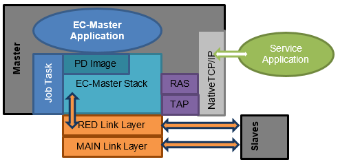
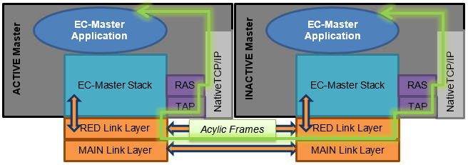

**************************
Master Device Architecture
**************************

Overview
********

The following diagram shows the EC-Master integration to the Application.

Job Task
********

The JobTask of the ACTIVE Master’s application generates the ECAT cycles by a local timer. The frame processing is triggered on frame interrupt (Real-time Ethernet Driver Mode: Interrupt). Because both Masters operate on frame receiving interrupt, their myAppWorkPd implementations (“App. Task”) automatically do not drift. 

.. seealso:: :ref:`EcMasterDemoMasterRed`

The following figure shows the Job Task timing at ACTIVE and INACTIVE:

.. figure:: ../Media/master-red_job-task-timing.png
    :alt:
    
Process Data (PD Image)
***********************

The Process Data Image contains Slave Process Data and Master-To-Master Process Data. The ACTIVE Application’s Job Task cyclically triggers the EC-Master to send it and the INACTIVE Master reads it cyclically.

Acyclic Master-To-Master Communication
**************************************

The ACTIVE Master and the INACTIVE Master can communicate with each other using TCP/IP. Push data from ACTIVE to INACTIVE Master and to pull data from INACTIVE to ACTIVE Master with acyclic frame is part of the “Acyclic Master-To-Master Communication”.
The network load can be tuned by means of the MTU configuration at the TAP adapter.

The Acyclic Master-To-Master Communication data flow is as follows:

    
Remote Access
*************

Accessing the EC-Master via TCP/IP
==================================

It is possible to remotely access the EoE network using the following applications:

- EC-Engineer 
- EC-Lyser
- EC-EoE-Gateway
- EC-Master FP RAS with FP EoE Endpoint

The EC-Master RAS Server (EcMasterRasServer.dll / libEcMasterRasServer.a) is a library to provide access to the Master via TCP/IP. 

TCP/IP communication between the ACTIVE and the INACTIVE Master must be possible at any state without additional hardware. As long as there is no ACTIVE Master, the communication stops, because no Master sends EtherCAT® frames. (REQ034, REQ035).

An EoE endpoint must be registered as network adapter to the EC-Master. The integration depends on the Master’s operating system, e.g. for Windows, Windows CE and Linux the TAP driver which is freely available from OpenVPN is needed. The installation description and an example is part of the Feature Pack EoE Endpoint Interface Manual. (REQ036) 

Data from the INACTIVE Master is queued. The poll size must be configurable.
The INACTIVE Master must transmit EoE data from the Frames of the ACTIVE Master to its EoE-Endpoint.

The RAS cycle time impacting the RAS API latency is configurable.

Concurrent access to ACTIVE and INACTIVE Masters
================================================

Diagnosis and remote control is possible at any state using a RAS connection to the ACTIVE Master. The Application must start the RAS Server for this functionality. (REQ037)

The EC-Engineer and EC-Lyser offer diagnosis of multiple connections in parallel, configured with individual IP addresses:

.. figure:: ../Media/master-red_multiple-connections-in-ec-engineer.png
    :alt:
    
