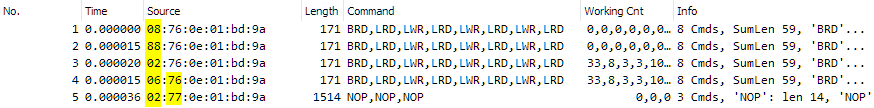

****************
Frame Processing
****************

Cyclic Slave Frames and Cyclic Master Red Frames
************************************************

Process Data exchange is distributed to Cyclic Slave Frames (CSF) and Cyclic Master Red Frames (CMF). The ACTIVE Master sends the Slave Process Data in Cyclic Slave Frames according to the ENI file. The ACTIVE Master merges the Slave INPUT Process Data from last cycle and sends it together with the ACTIVE to INACTIVE Master Process Data in Cyclic Master Frames to the INACTIVE Master. The INACTIVE Master gets the Slave OUTPUT Process Data from the Cyclic Slave Frames and forwards the Cyclic Slave Frames. The INACTIVE Master gets the ACTIVE to INACTIVE Master Process Data from the Cyclic Master Red Frames, inserts the INACTIVE to ACTIVE Master Process Data accordingly and forwards the Cyclic Master Red Frames to the ACTIVE Master.

+-----------+--------+----------------------+--------+----------------------+
| Slave     |        | ACTIVE Process       |        | INACTIVE Process     |
|           |        | Data Image           |        | Data Image           |
+===========+========+======================+========+======================+
| INPUTs    | CSF -> | Slave INPUTs         | CMF -> | Slave INPUTs         |
+-----------+--------+----------------------+--------+----------------------+
| OUTPUTs   | <- CSF | Slave OUTPUTs        | CSF -> | Slave OUTPUTs        |
+-----------+--------+----------------------+--------+----------------------+
|           |        | INACTIVE to ACTIVE   | <- CMF | INACTIVE to ACTIVE   |
|           |        | Master               |        | Master               |
+-----------+--------+----------------------+--------+----------------------+
|           |        | ACTIVE to INACTIVE   | CMF -> | ACTIVE to INACTIVE   |
|           |        | Master               |        | Master               |
+-----------+--------+----------------------+--------+----------------------+

The process order is as follows.

At ACTIVE Master:

#. The ACTIVE Master sends the CSF (write Slave OUTPUT Process Data, read Slave INPUT Process Data) to MAIN and RED
#. The ACTIVE Master send the CMF (write Slave INPUT Process Data and from last cycle and ACTIVE to INACTIVE Master Process Data) to MAIN and RED
#. The ACTIVE Master sends acyclic Frames to MAIN and RED

At INACTIVE Master:

#. The INACTIVE Master receive each frame from MAIN and RED
#. The INACTIVE Master parses the CMF and gets the Slave INPUT Process Data from last cycle and ACTIVE to INACTIVE Master Process Data and it inserts INACTIVE to ACTIVE Master Process Data to CMF
#. The INACTIVE Master forwards each received frame and stores it for further processing
#. The INACTIVE Master parses each frame received from MAIN and RED and gets the Slave OUTPUT Process Data
#. The INACTIVE Master notifies the application about all cyclic data available as soon as both last cyclic frames (CMF from MAIN and RED) are processed

At ACTIVE Master:

#. The ACTIVE Master stores each received frame for processing
#. Each frame received from MAIN and RED gets processed (update Slave INPUTs and INACTIVE to ACTIVE Master Process Data)
#. The ACTIVE Master notifies the application about all cyclic data available as soon as both last cyclic frames (CMF from MAIN and RED) are processed

Example Trace
*************

The Wireshark screenshot below shows the combined cyclic EtherCAT® traffic recorded by two EcMasterDemoMasterRed instances in OPERATIONAL The Source address (1) contains flags stating where the frame was sent / forwarded / received and if it hit slaves.

Cmds at Ado 0x4155 (2) contain cyclic Master Master data:

.. figure:: ../Media/master-red_example-trace.png
    :alt:
    
Split and Merge
***************

The frames are sent from and received on both interfaces. If somewhere in the middle a line breaks up, the loop is closed within the “bordering” slaves and both bus stubs are still communicating with the EC Master.

The EC-Master knows of each Slave if it is visible to the MAIN or RED EtherCAT® interface. The datagrams are included in the frame corresponding to the EtherCAT® interface that the Slave is visible to and the datagrams are merged as soon as they return.

The API calls still operate the same way as before the bus split up and therefore, from an application’s point of view, the bus still operates as usual (as long as all slaves are still powered and operating). Especially Auto Increment addressed and logical commands used within API calls are still unchanged after the bus split. Therefore the application developer doesn’t need to change any calls or addresses during runtime.

In case a line break is detected, a notification is thrown to the application, which enables a front-end or application user to be informed about the redundancy situation. When the bus is reconnected another notification is thrown to inform about the absence of the error situation.

Frame processing at INACTIVE Master
***********************************

The INACTIVE Master automatically issues Store and Forwards of the received frames. 
The frames are processed immediately after receiving (Interrupt Mode used). After both frames (from MAIN and RED) are received they are automatically processed.

Ethernet source address semantic
********************************

The destination MAC address of the EtherCAT® frames are fixed to the EtherCAT® unicast address 01:01:05:01:00:00 or broadcasted to ff:ff:ff:ff:ff:ff.

The source MAC address of frames sent from any EtherCAT® interface of the Master contains the Network Interface Controller (NIC) Specific bytes of the EtherCAT® interface MAC address and frame state information like the Redundancy Bit, Retry Index and the Redundancy Frame ID. Furthermore it contains the Forwarding Rule bit 0x02 that the Slaves set if the ESC is configured to drop non-EtherCAT® frames (see ET1100 datasheet).
 
The Redundancy Bit 0x08 is set for all frames sent at the RED EtherCAT® interface and it is not set for all frames sent at the MAIN EtherCAT® interface. The retry index is set to indicate sending retries of asynchronous frames. It is incremented according to the retries. The Redundancy Frame ID is incremented with every frame per interface. 

The frame is structured the following way: 

+-------------+-----------+-------------------+------------------+---------------+-------------+----------+
| Retry Index | Red. Bit  | Master Forwarding | Slave Forwarding | Red. Frame Id | LL Reserved | MAC      |
+=============+===========+===================+==================+===============+=============+==========+
| Mask 0x70   | Mask 0x08 | Mask 0x84         | Mask 0x02        | Byte 1        | Byte 2      | Byte 3-5 |
+-------------+-----------+-------------------+------------------+---------------+-------------+----------+

When receiving frames, the EC-Master performs consistency checks and fast error detection. 
The EC-Master detects by means of the Redundancy Bit if there is a line break (disregarding local rings). It expects for frames received at RED that they were sent at MAIN and therefore their Redundancy Bit is not set. Frames received at MAIN are marked with the Redundancy Bit if the line is not broken (disregarding local rings).

The Redundancy Frame ID is used to merge received frames and to detect frame loss.

The Master Forwarding Bits are used to prevent circulating forwarded frames.

.. seealso:: :ref:`Circulating frame prevention`

The following sample trace of EtherCAT® frames with MAIN and RED link shows in first source byte the Redundancy bit 0x08 and the Forwarding Rule bits 0x08, 0x04 and 0x02 and in the second source byte the incrementing RedFrameId (0x76, 0x77):

    
E.g. from the Wireshark above the semantics are as follows:

- Frame 1: 0x08: Received at INACTIVE MAIN from ACTIVE RED (Red. Bit)
- Frame 2: 0x88: Received at ACTIVE MAIN from INACTIVE RED (Red. Bit + Master Forwarding RED)
- Frame 3: 0x02: Received at INACTIVE RED from ACTIVE RED and Slaves (Slave Forwarding)
- Frame 4: 0x06: Received at ACTIVE RED from INACTIVE MAIN and Slaves (Slave Forwarding + Master Forwarding MAIN)
- Frame 5: 0x02: Received at INACTIVE RED from ACTIVE RED and Slaves (Slave Forwarding)

Data consistency
****************

The WKC field of EtherCAT® datagrams are used to ensure the consist datagram processing of each addressed Slave.

If there is a line break the ACTIVE Master has to be aware of the EtherCAT® interface, each Slave is visible to. Using Split & Merge, the Slaves that are not visible to MAIN anymore due to the line break are visible to RED. In order to reach all Slaves disregarding if they are visible at MAIN or RED in case of a line break, the EC-Master has to send all frames on both lines. If there is a line break, a bitwise OR operation has to be performed by the EC-Master when merging the processed frames. If a datagram is addressed to several Slaves and those are distributed to both EtherCAT® interfaces MAIN and RED, the WKC of each frame is evaluated accordingly after merging the frames from MAIN with the corresponding frames from RED.

As long as there is no line break, all Slaves operate on the same frames and increase the WKC fields whenever they are processing datagrams. In contrast to Split & Merge, only the WKCs of MAIN need to be considered to check the data consistency.

EtherCAT® LRW commands may not be sent if there is a line break, because the addressed Slave to be read from may be at the other EtherCAT® interface than the Slaves to be written to. The EC-Master respects this to ensure the integrity, e.g. configurations containing LRW commands are refused by the EC-Master when applying Cable Redundancy.

The INACTIVE Master increments at the NOP cmds in the CMF the WKC on ACTIVE to INACTE Master Process Data access by 2 and for INACTIVE to ACTIVE Master Process Data by 1.

Circulating frame prevention
****************************

EtherCAT® provides a circulating frame prevention mechanism. A frame may hit a device with unconnected port 0 at most one time. Allowing to hit once is needed to handle line break. If it hits a device with unconnected port 0 a second time, the frame will be destroyed to stop delivering outdated data. This is realized at ESCs by setting the Circulating Frame bit in the EtherCAT® command. The mechanism is documented in the “EtherCAT® Slave Controller Hardware Data Sheet Section I” chapter “3.5 Circulating Frames”. As the Circulating Frame bit semantic cannot be fully applied for Master Redundancy to handle all circulating frame scenarios, the two different Master Forwarding Bits are considered to drop frames that are scheduled to be forwarded for the same network adapter again, in order to prevent circulating frames. 

The following figure shows the regular Master Redundancy setup with ACTIVE and INACTIVE Master:

.. figure:: ../Media/master-red_network-adapters.png
    :alt:
    
If the ACTIVE Master got disconnected from the network and the INACTIVE Master is about to forward frames of the current cycle, each frame may only be forwarded once per adapter in order to prevent circulating frames:

.. figure:: ../Media/master-red_removed-network.png
    :alt:
    
In this case the forwarded frame of the previously connected ACTIVE Master is marked to be forwarded on MAIN (Master Forwarding Bit Mask 0x04 = 1). On returning it is dropped as else it would be forwarded to MAIN again. The same applies to the RED network adapter (Master Forwarding Bit Mask 0x80 = 1).