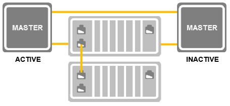
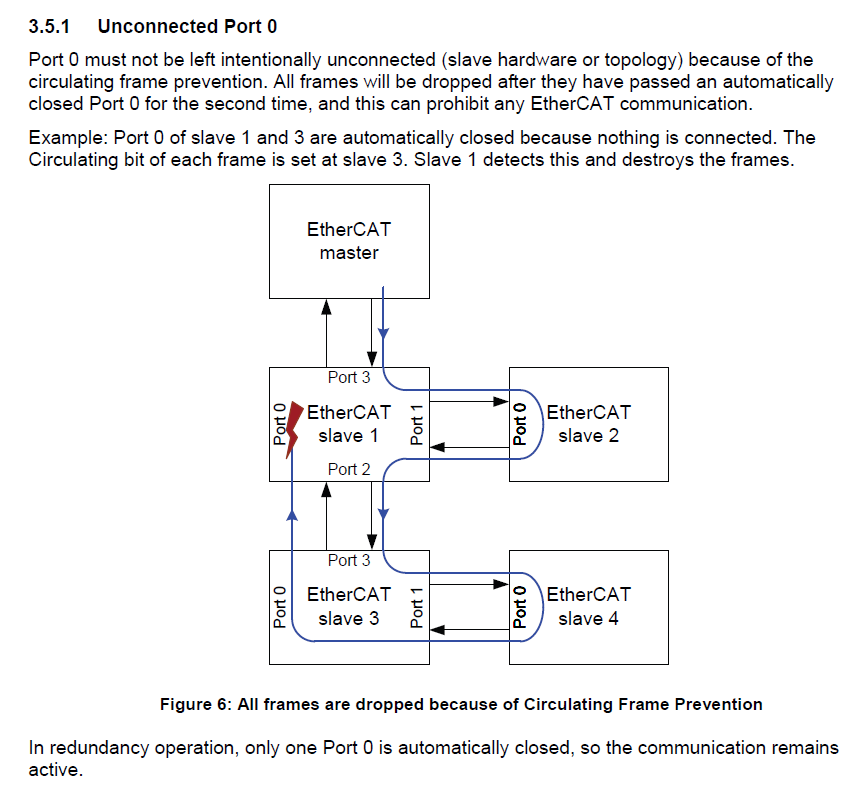

********
Topology
********

The Masters have the two Real-time Ethernet Driver Instances “MAIN” and “RED”. The Slaves are connected between the ACTIVE and INACTIVE Master so each Master:

    
This topology can apply Cable Redundancy and Master Redundancy.

The System needs permanent access to the ACTIVE and the INACTIVE Master, therefore the INACTIVE Master must be always connected to the network. (REQ038) The INACTIVE Master may not drop the Frames because the ACTIVE Master needs the Frame returning to detect slaves, retrieve input and detect data inconsistency. The NICs at the Master cannot process Frames on the fly. The Frames must be stored and forwarded. Hence the EC-Master functionality must be extended.

Slaves must be connected on same line (REQ013) else it will not match the ordering in the ENI file, so the following configuration is invalid:

.. figure:: ../Media/master-red_same-line-connected.png
    :alt:

Only the ACTIVE Master controls all Slaves that are visible to it. The INACTIVE Master does not control any Slave, but receives and stores all Frames and forwards all foreign Frames from one Real-time Ethernet Driver Instance to the other. Destroyed Frames are dropped. These two different functionalities are called Controlling the bus and Store and Forward.

The Master-To-Master communication is considered to be encapsulated in the Frames so there is no additional line for native TCP/IP support needed. 

Frame Processing Order with Store and Forward
*********************************************

The Bus is owned by the ACTIVE Master that cyclically receives and sends Frames at its two Real-time Ethernet Driver Instances. All frames traverse INACTIVE Masters and Slaves and are evaluated there respectively. 

The ACTIVE Master regularly sends its data using the MAIN Real-time Ethernet Driver Instance. All Slaves and the INACTIVE Master forward the Frames until the ACTIVE Master receives them at the RED Real-time Ethernet Driver Instance. To accomplish Cable Redundancy purposes the ACTIVE Master uses its RED Real-time Ethernet Driver Instance regularly for sending frames, too.
Process data is sent at the ACTIVE Master at MAIN and returns at ACTIVE Master at RED. The Master notifies the Application if frames are not received as expected and handles the error.

The ACTIVE and the INACTIVE Master act on their Real-time Ethernet Driver Instances by default as follows:

+-----------------------------------------+---------------------+-------------------+
|                               | ACTIVE Master       | INACTIVE Master   |
+=========================================+=====================+===================+
| MAIN Real-time Ethernet Driver Instance | Controlling the bus | Store and Forward |
+-----------------------------------------+---------------------+-------------------+
| RED Real-time Ethernet Driver Instance  | Controlling the bus | Store and Forward |
+-----------------------------------------+---------------------+-------------------+

.. seealso:: :ref:`Job Task`

Frame Processing without Line-Break
===================================

The following figure shows in green the Frame processing order of ACTIVE Master’s MAIN Real-time Ethernet Driver Instance and in red the Frame processing order of the RED Real-time Ethernet Driver Instance as on regular operation without line break. The slaves forward, but don’t process the RED frame.

.. figure:: ../Media/master-red_regular-fpo.png
    :alt:
    
Frame Processing at Failover
============================

If the ACTIVE Master fails, the RED port gets deactivated and the frames from MAIN return on MAIN:

.. figure:: ../Media/master-red_failover-fpo-2.png
    :alt:
    
Frame Processing with Line-Break
================================

If a line breaks or if the ACTIVE Master fails, the system handles the error without dividing the Bus into independent sub networks:

.. figure:: ../Media/master-red_line-break-fpo.png
    :alt:
    
Store and forward delay time
****************************

The Master cannot process the Frames on the fly. The INACTIVE Master must Store and Forward the Frame. This increases the roundtrip time significantly. The roundtrip time furthermore depends on the delay introduced by the INACTIVE Master between storing the Frame and sending it again. This has to be considered when calculating the available bandwidth.

Bus scan timing at fail-over
****************************

The sequence at the take-over Master on fail-over is as follows:

- Application detects communication timeout
- Application sets Master ACTIVE ( :cpp:func:`emSetMasterRedStateReq`)
- Master starts sending frames, exchanges process data, scans the network

A sample fail-over profiling without optimizing the Bus Scan shows the following timing:

.. prompt:: bash

    Cycle time: 5 ms
    Process Data Payload: 5kB
    Communication timeout: 15 ms
    Topology: 33 slaves
    Time Offset: Master 2 received last frame from Master 1

+----------------------+--------------------------+--------------+
| Time Offset [ms]     | Event at Master 2        | Duration     |
|                      | since Last Frame Recv    |              |
|                      | From Master 1            |              |
+======================+==========================+==============+
| 14.890               | Communication timeout    | 15 ms        |
|                      | detected                 |              |
+----------------------+--------------------------+--------------+
| 14.910               | Became Active            | 20 us        |
+----------------------+--------------------------+--------------+
| 14.940               | First Frame Sent         | 30 us        |
+----------------------+--------------------------+--------------+
| 15.040               | Process Data Received    | 100 us       |
+----------------------+--------------------------+--------------+
| 329.910              | Bus Scan done, Topology  | 315 ms       |
|                      | Known (further scans     |              |
|                      | follow)                  |              |
+----------------------+--------------------------+--------------+
|                      |    Thereof Readout       | 110 ms       |
|                      |    EEPROM Information    |              |
+----------------------+--------------------------+--------------+
| 340.020              | Coe Upload Done          | 10 ms        |
+----------------------+--------------------------+--------------+

Port 0 must be connected
************************

The ET1100 datasheet explains the circulating frame prevention. If there is more than one Slave with unconnected port 0, frames are destroyed. Therefore port 0 of Slaves always has to be connected to the bus:

    
Destroyed Frames are not passed from the Real-time Ethernet Driver Instance to the Master and therefore lost from the Master’s point of view!

This must be considered especially for Master Redundancy (REQ011).

********************
System Configuration
********************

The application must provide parameters for operation. The EC-Master initialization parameters and ENI files of INACTIVE and ACTIVE Master must be identical (REQ010).

Operating System Configuration
******************************

Real-time Ethernet Driver Instances
===================================

The Operating System may not use the Real-time Ethernet Driver Instances while they are assigned to the EC-Master. This is realized by either unbinding the Real-time Ethernet Driver Instances before starting the EC-Master or removing the Operating Systems device driver handling the Real-time Ethernet Driver Instance. Each Real-time Ethernet Driver Instance must have a unique MAC address. The Real-time Ethernet Driver must support Interrupt Mode.

Remote Access
=============

The System must configure a Network TAP with unique MAC and IP Address assignment at each Master as described in the Feature Pack EoE Endpoint Interface Manual. (REQ008)

EC-Master configuration
***********************

EC-Master initialization parameters
===================================

The EcMasterDemoMasterRed demonstrates how to configure the EC-Master including the Real-time Ethernet Driver Instances.

EC-Master Master Redundancy Parameters
======================================

The EC-Master Master Redundancy Parameters EC_T_MASTER_RED_PARMS contain:

- INACTIVE to ACTIVE Master Process Data size (INPUTs)
- ACTIVE to INACTIVE Master Process Data size (OUTPUTs)
- The max. amount of Queued Acyclic Master Red Frames send per cycle

EtherCAT® Network Information File
==================================

The EC-Master has to know about the EtherCAT® bus topology and the cyclic/acyclic frames to exchange with the slaves. This configuration is determined in a configuration file which has to be available in the EtherCAT® Network Information Format (ENI). This format is completely independent from EtherCAT® slave vendors and from EtherCAT® configuration tools. Thus inter-operability between those vendors is guaranteed.

The Slaves need to be explicitly configured within the ENI-file. 

The Process Data definition is also part of the ENI file and structures the bidirectional data exchanged between the EC-Master and the Slaves.

If the Masters do have an internal ESC, it must be configured within the ENI file. 

The Applications must provide identical ENI files (REQ010).

Applying cable redundancy forbids usage of LRW EtherCAT® commands. This can be configured using the EC-Engineer by means of applying “Disable LRW” to all slaves from the Advanced Options tab in the Expert View.

The Sync Manager Watchdog settings of the Slaves should be checked to match the system’s needs.
