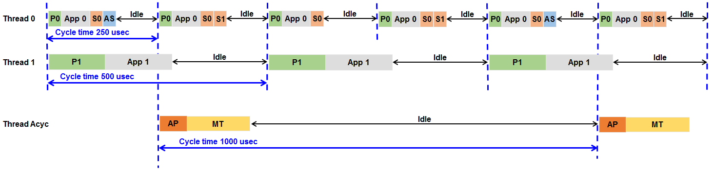

************
Introduction
************

The Split-Frame Processing Feature Pack enables the processing of multiple EtherCAT cyclic tasks in separate application threads. From the application perspective, this makes it possible to structure EtherCAT process data across multiple threads. Therefore, process data that requires different cycle times can be handled accordingly.
Additionally, the processing of acyclic communication can also be outsourced to a separate thread.

For example, a typical application for the Split-Frame Processing Feature Pack would have one tasks for servo drives that requires very fast cycle times, and another task for I/O data that does not need very fast processing or special cycle time requirements.

EC-Engineer makes it easy to create configurations with several EtherCAT cyclic tasks:

.. figure:: ../Media/Split_Frame-ConfigEngineer.png
    :align: center
    :alt:

The timing of an application utilizing Split-Frame Processing application would look like the following:
    - Thread 0 runs with a 250 microsecond cycle time and handles the processing of EtherCAT task 0. This thread also sends out the process data for all other tasks.
    - Thread 1 runs with a 500 microsecond cycle time and handles only the processing of EtherCAT task 1.
    - Thread Acyc runs with a 1 millisecond cycle time and processes only the acyclic communication and also the Master management tasks.

The operation modes polling and interrupt of the Ethernet Driver are supported.