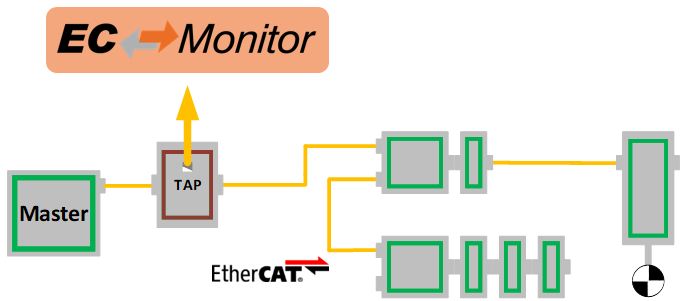

************
Architecture
************

The Ethernet TAP device should be inserted in the network between the |ECAT| MainDevice and the first SubDevice or, if this is not possible, between two SubDevices. The position of the TAP is detected automatically and the |ECAT| traffic is processed accordingly.

Different positions of the TAP device are possible. For more information about available options and their limitations, see chapter *"TAP positioning"* in the |Product| User Manual.

********************************
|ECAT| Network Information (ENI)
********************************

The |Product| needs knowledge about the network to be observed which must be configured using a configuration file in the |ECAT| Network Information (ENI) format. It is strongly recommended to use the same configuration file for MainDevice and |Product|.

The |ECAT| Network can be configured using EC-Engineer, which can be obtained from https://www.acontis.com/en/ecdownloads.html\ .

See the EC-Engineer User Manual or tutorial videos at https://developer.acontis.com/ec-engineer\ . After configuring the network, press :command:`Export ENI` to export the ENI file.

.. figure:: ../Media/EC-Engineer_Export_ENI.png