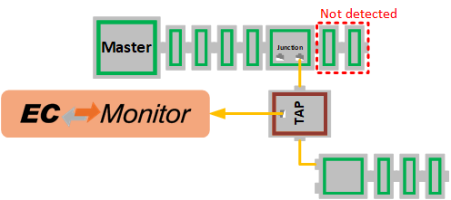
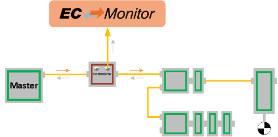

************
Ethernet TAP
************

To capture the EtherCAT® traffic, EC-Monitor supports a variety of different Ethernet Test Access Points (TAP). These can be special real-time optimized TAPs with minimal propagation delay and extended diagnostic options, or simple 100MBit/s Ethernet switches. The only requirement is that the input (RX) and output (TX) traffic is forwarded to the EC-Monitor via a common up-link port.

The various Ethernet TAP devices can be automatically detected by the EC-Monitor via :cpp:member:`EC_T_MONITOR_INIT_PARMS::eEthTapType` set to :cpp:enumerator:`EC_T_ETHERNET_TAP_TYPE::eEthTap_AutoDetect`.

TAP positioning
***************

The Ethernet TAP device should be inserted in the network between the EtherCAT® master and slaves or, if this is not possible, between two slaves. The position of the Ethernet TAP is detected automatically and the EtherCAT® traffic is processed accordingly.

.. figure:: ../Media/EC-Monitor_Master-Tap-Slaves.png
    :align: center
    :alt: 

For configurations where the EtherCAT® master has a direct interface to the slaves without an RJ45 cable, e.g. Beckhoff IPCs. Is it possible to connect the input port of the Ethernet TAP device to the RJ45 port of the topologically last slave. The output port of the Ethernet TAP device must be bridged using an RJ45 loopback plug so that the EtherCAT® frames are forwarded back to the master. 

.. figure:: ../Media/EC-Monitor_Master-Slaves-Tap.png
    :align: center
    :alt: 
    
In configurations where the TAP can only be inserted at an EtherCAT® Junction Slave, the port closest to the end of the topology should be used. Any slaves connected to the subsequent port will no longer be detected.

    
.. warning:: 
    Positioning the TAP within the topology can lead to inconsistencies in the process data image. This affects the outputs of the slaves preceding the TAP and that are read by an ``Logical Read-Write`` (``LRW``) command. The affected outputs are set to 0 by the |Product|.

Generic 100MBit/s Ethernet Switch
*********************************

A generic 100MBit/s Ethernet switch with at least 3 ports can be used with EC-Monitor. The propagation delay can be up to several hunderd μs per port and should therefore only be used for slower cycle times.

To manually select this device set :cpp:member:`EC_T_MONITOR_INIT_PARMS::eEthTapType` to  :cpp:enumerator:`EC_T_ETHERNET_TAP_TYPE::eEthTap_Generic`.

Beckhoff ET2000
***************

The Beckhoff ET2000 comes with propagation delay below 1 μs, a high-precision timestamp and extended frame error detection capabilities.
The TAP offers the possibility to determine on which port the frame was received. The EC-Monitor uses this to evaluate whether it is a TX or RX frame. Therefore, the outgoing connection from the EtherCAT master should be connected to either port ``X1.0``, ``X2.0``, ``X3.0`` or ``X4.0``.

To manually select this device set :cpp:member:`EC_T_MONITOR_INIT_PARMS::eEthTapType` to  :cpp:enumerator:`EC_T_ETHERNET_TAP_TYPE::eEthTap_Beckhoff_ET2000`.

Dualcomm ETAP-1000
******************

The Dualcomm ETAP-1000 has a propagation delay below 1 μs. Since it has no other extended capabilities it can be used as generic Ethernet TAP :cpp:enumerator:`EC_T_ETHERNET_TAP_TYPE::eEthTap_Generic`.

Kunbus TAP Curious
******************

The Kunbus TAP Curious comes with propagation delay below 1 μs, a high-precision timestamp and extended frame error detection capabilities.
The TAP offers the possibility to determine on which port the frame was received. The EC-Monitor uses this to evaluate whether it is a TX or RX frame. Therefore, the outgoing connection from the EtherCAT master should be connected to either port ``A`` or ``C``.

To manually select this device set :cpp:member:`EC_T_MONITOR_INIT_PARMS::eEthTapType` to  :cpp:enumerator:`EC_T_ETHERNET_TAP_TYPE::eEthTap_Kunbus_TapCurious`.

ProfiTap ProfiShark
*******************

The ProfiTap ProfiShark devices are USB3.0 based Ethernet TAPs with a propagation delay below 1 μs. Since the devices appear as a virtual Ethernet interface in the operating system they can be used as a generic Ethernet TAP :cpp:enumerator:`EC_T_ETHERNET_TAP_TYPE::eEthTap_Generic`.

Port Mirror
***********

A TAP or switch with port mirroring functionality can also be used with EC-Monitor. Typically, a port mirroring device has four Ethernet ports, two input ports for the network and two mirroring output ports. Incoming traffic on the respective network port is mirrored to the corresponding mirror port. 

In the EtherCAT® use case, this means that the Ethernet frames outgoing from the EtherCAT® master are mirrored on one port and the Ethernet frames returning from the EtherCAT® slaves are output on another port.
Since EC-Monitor currently only supports one port for connecting to the TAP, the mirror port with the returning Ethernet frames must be connected.

    
This device must be selected manually by setting :cpp:member:`EC_T_MONITOR_INIT_PARMS::eEthTapType` to :cpp:enumerator:`EC_T_ETHERNET_TAP_TYPE::eEthTap_PortMirror`.
    
.. warning:: 
    Since only the returning frames are processed, inconsistencies occur in the process data image of the outputs for EtherCAT® frames with ``LRW`` commands.