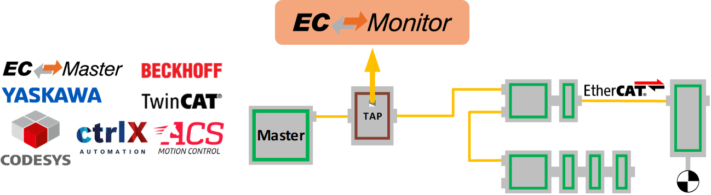

***************
Getting Started
***************

To enable a quick and easy start, every EC-Monitor package comes with a pre-compiled EcMonitorDemo executable. This example application handles the following tasks:

- EC-Monitor initialization
- Process Data acquisition with EC-DAQ
- Periodic Job Task in polling or interrupt mode
- Record and replay wireshark traces
- Logging

.. seealso::  :ref:`integration_example:Example application` for detailed explanation

.. _running-ecdemo:

Running EcMonitorDemo
*********************

To capture the EtherCAT® traffic insert a TAP device after the Master Controller.

Start the EcMonitorDemo from the command line to process the captured EtherCAT® frames. At least a Real-time Ethernet Driver and a ENI file must be specified.

.. prompt:: text >
    
    EcMonitorDemo -ndis 192.168.157.2 1 -f eni.xml -t 0 -v 3

.. seealso::
    
    :ref:`os:Platform and Operating Systems (OS)` for OS specific additional instructions to run the demo application

.. program:: EcMonitorDemo
.. include:: ../../Examples/ecdemo-cmdline.rst
.. include:: ../../Examples/ecdemo-cmdline-emll.rst

Running EcMonitorDemoMqtt
*************************

The EcMonitorDemoMqtt includes additional functionality to publish process data to a MQTT broker, for example Eclipse Mosquitto (https://mosquitto.org). It additionally requires at least the MQTT broker address.

.. prompt:: text >

    EcMonitorDemoMqtt -ndis 192.168.157.2 1 -f eni.xml -mqtt localhost -t 0 -v 3

The Eclipse Paho MQTT C client library is also required. The EcMonitorDemoMqtt has been developed and tested with version 1.3.10.

A dynamic library file is required in the directory :file:`<InstallPath>/Bin/<OS>/<Arch>`.

- Eclipse Paho MQTT C 1.3.10 download: https://github.com/eclipse-paho/paho.mqtt.c/releases/tag/v1.3.10
- For Linux, the file :file:`paho-mqtt3c.so.1` is included in the binary release.
- For Windows, the file :file:`paho-mqtt3c.dll` must be built from source, see the file :file:`README.md` section *"Building with CMake"* in the source code.

The EcMonitorDemoMqtt publishes process data cyclically and on change detection. The frequency of these messages can be configured, see :ref:`gettingstarted:Command line parameters`. Each slave variable is assigned a separate MQTT topic:

.. code-block::

    /EtherCAT/Monitor<instance ID>/slavebyname/<slave name>/variable/[output/input]/<variable name>

The payload is a raw byte buffer beginning with a 4-byte unsigned integer payload version. The structure of the following bytes is version-specific.

Payload version 0
=================

The payload contains the process image data of the variable. Because the size differs for each variable, this data is also of variable size, but is always rounded up to full bytes. E.g. a 1-bit variable will be sent as a :cpp:type:`BYTE`.

.. list-table::
    :widths: auto
    :header-rows: 1

    * - Variable type
      - Offset
      - Description
      - Hint
    * - :cpp:type:`UINT32`
      - 0 bytes
      - Payload version (0)
      - Little-endian
    * - :cpp:type:`UINT64`
      - 4 bytes
      - Data timestamp in nanoseconds
      - Little-endian
    * - Variable data
      - 12 bytes
      - Process image data of the variable
      - Variable size rounded up to full bytes

.. _compile-ecdemo:

Compiling the EcMonitorDemo
***************************

The following main rules can be used to generate the example applications for all operating systems.

- :file:`<OS>` is a placeholder for the operating system used.
- :file:`<ARCH>` for the architecture. If different architectures are supported.

Software Development Kit (SDK)
==============================

The EC-Monitor development kit is needed to write applications based on the EC-Monitor core. 
The EC-Monitor core is shipped as a library which is linked together with the application.

The following components are supplied together with an SDK:

- :file:`/Bin`:       Executables containing the EC-Monitor core
- :file:`/Doc`:       Documentation
- :file:`/Examples`:  Example applications as source code
- :file:`/SDK`:       EtherCAT® Software Development Kit containing libraries and header files to build C/C++-applications
- :file:`/SDK/INC`:   Header files to be included with the application
- :file:`/SDK/LIB`:   Libraries to be linked with the application
- :file:`/SDK/FILES`: Additional files for platform integration
- :file:`/Sources/Common`: Shared source code

Include search path
===================

The header files are located in the following directories:

.. code-block::

    <InstallPath>/SDK/INC/<OS>/<ARCH>
    <InstallPath>/SDK/INC
    <InstallPath>/Sources/Common

Libraries
=========

The libraries are delivered as static, dynamic or both. This is depending on the operating system. They are located in the following directories:

Static libraries
    .. code-block::

        <InstallPath>/SDK/LIB/<OS>/<ARCH>
        
    EC-Monitor core
        .. code-block::
        
            libEcMonitor.a

    EC-Monitor RAS server (optional)
        .. code-block::
        
            libEcMonitorRasServer.a
            
Dynamic libraries
    .. code-block::

        <InstallPath>/Bin/<OS>/<ARCH>
        
    EC-Monitor core
        .. code-block::
        
            libEcMonitor.so

    EC-Monitor RAS server (optional)
        .. code-block::
        
            libEcMonitorRasServer.so
            
Whether it is a Shared Object :file:`*.so` or a Dynamic Link Library :file:`*.dll` depends on the operating system.

Preprocessor definitions
========================

The following preprocessor directives must be set in the build environment or project:

.. code-block::

    EC_MONITOR

Exclude the EC-DAQ support in the demo:

.. code-block::

    EXCLUDE_DAQ_SUPPORT