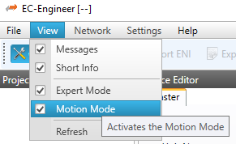
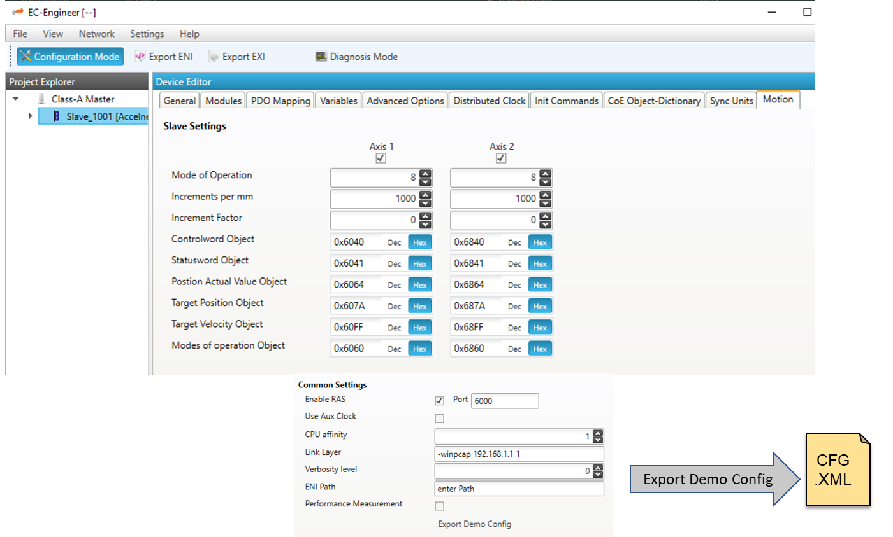

***************
Getting Started
***************

EC-Motion-Advanced Architecture
*******************************

The EC-Motion-Advanced library is implemented in C++ and offers a C++ API. The library
exports an opaque class *AxisRef* which serves as an abstraction level to the hardware.
The motion control function blocks are implemented as callable classes with writable input
and readable output parameters. Most function blocks have an *AxisRef* as input parameter.
Furthermore functions for initialization, deinitialization, axis creation and cyclic tasks
are exported.

.. kroki::
    :type: tikz
    :align: center
    :filename: ../Media/Architecture.tex

Running EcMasterDemoMotionAdvanced
**********************************

The demo application *EcMasterDemoMotionAdvanced* is part of the delivery as source code
and "out of the box" application. It serves as a reference implementation of a motion
control application. The example located in the folder *Example* can be extended or used
as a starting point for an own motion control application.

The demo depends on the EC-Master product (which is not included in the delivery). In
order to control the drives externally the EC-Engineer is also needed. Figure
:numref:`DemoApplArch` shows the whole architecture used to control three servo drives
that are connected to the EtherCAT fieldbus.

.. figure:: ../Media/ExampleOverview.png
    :name: DemoApplArch
    :align: center
    :alt:

    Building blocks of EC-Motion-Advanced control system

Because motion control applications run with small cycle times a real-time operating
system is highly recommended to use.

Start the EcMasterDemoMotionAdvanced from the command line to put the EtherCAT network
into operation and to initiate the Remote Access Server (RAS server). Furthermore start
the EC-Engineer or EC-STA under Windows to send motion commands via TCP/IP sockets to the
demo application.

.. prompt:: text >

    EcMasterDemoMotionAdvanced DemoConfig.xml

.. include:: ../../Examples/ecdemo-cmdline.rst

Configuration
=============

The EC-Engineer tool can create the configuration file. In oder to activate the motion
tabs inside EC-Engineer the *Motion Mode* view has to be selected (see also Figure
:numref:`ActivateMotionMode`).

    Activate Motion Mode

After the *Motion Mode* was activated there is a motion tab inside the Class-A or Class-B
master and each EtherCAT slave. Here the different parameters for the drives and the
EtherCAT network can be set and finally exported. Figure :numref:`ExportConfigXml` shows
an example.

    Export configuration parameter

Afterwards the parameters can be adjusted directly within the xml file when the
configuration changes or to customize the drives. The entries of the configuration file
are as follows:

.. option:: Config/Common/RASEnabled

    Start the RAS server or not when the application starts. If the RAS server is not
    enabled a remote control is not possible.

.. option:: Config/Common/RASPort

    The TCP/IP socket port number for the RAS server. Default is 6000.

.. option:: Config/Common/BusCycleTime

    Cycle period of the cyclic task in microseconds. Default is 1000.

.. option:: Config/Common/AuxClk

    Auxiliary clock period in microseconds. Default is 1000. Set to 0 if
    the auxillary clock (Hardware interrupt timer) is not supported for this particular
    platform.

.. option:: Config/Common/CpuAffinity

    Index of the CPU on which the various threads are running. Default is 0 (first CPU).
    1 is CPU2, 2 is CPU3, …

.. option:: Config/Common/LinkLayer

    Initialization string for the LinkLayer driver. Please see the
    `EC-Master manual <https://public.acontis.com/manuals/EC-Master/3.2/html/ec-master-class-b/gettingstarted.html#link-layer>`_
    for details.

.. option:: Config/Common/ENIFileName

    Path to the EtherCAT Network Information (ENI) file.

.. option:: Config/Common/VerbosityLevel

    Verbosity level for log messages. Default is 2.

.. option:: Config/Common/DemoDuration

    How long in seconds the program should run.

.. option:: Config/Common/PerfMeasurement

    Enable tracing of performance related data. Default is 1.

.. option:: Config/MotionDemo/NoDCMBusShift

    Disable Distributed Clocks Master (DCM) bus shift controller. Default is 0 for enable DCM.

.. option:: Config/MotionDemo/DCMCtlSetVal

    DCM controller set value in nanoseconds.

.. option:: Config/MotionDemo/CmdMode

    If the value is zero, the demo application runs standalone and turns the configured
    axes forward and backward using MCFB McMoveRelative.

    If the value is one, the motion is remotely commanded with either EC-Engineer or
    EC-STA.

.. option:: Config/MotionDemo/Drive[N]/Address

    EtherCAT station address of drive.

.. option:: Config/MotionDemo/Drive[N]/OperationMode

    Set the mode of operation for axis. Please read the manual of your servo drive
    controller for detailed information about the different drive operating modes.

.. option:: Config/MotionDemo/Drive[N]/IncPerMM

    Increments per physical unit [u].

.. option:: Config/MotionDemo/Drive[N]/IncFactor

    Internal resolution factor of the motion kernel. When new positions are computed
    using fixpoint mathematics, the internally used positions are scaled by two to the
    power of the given value. So if you see poor resolution (e.g. drive will not move
    at very low velocities), increment this value one by one.

.. option:: Config/MotionDemo/Drive[N]/Idx[Status|Control|Mode|ModeDisplay|Posact|Targetpos|Targetvel]

    PDO index in the format "0xXXXX:0xYY" of the corresponding variable in the PDO
    mapping. If an entry is not present, the default value according to DS402 is used.
    The relevant PDO's and PDO-variables should be included inside the EtherCAT
    configuration tool and exported to the ENI file.

.. option:: Config/MotionDemo/Drive[N]/DriveProfile

    Define the drive profile. If set to "DS402", the drive acts like a DS402 drive. If
    set to "VIRTUAL", no drive profile is selected and a virtual axis is created with no
    hardware connection.

.. option:: Config/MotionDemo/Drive[N]/CoeIdxOpMode

    If the PDO variable 'Mode of Operation' is not part of the EtherCAT network configuration,
    the index in the CoE object dictionary could be set here to transfer the given
    operation mode via SDO request.

.. option:: Config/MotionDemo/Drive[N]/[Vel|Acc|Dec|Jerk|Distance]

    Maximal values for velocity, acceleration, decceleration, jerk and distance used
    during the standalone application run (see also 'CmdMode').

Compiling the EcMasterDemoMotionAdvanced
****************************************

The application EcMasterDemoMotionAdvanced is delivered as binary and also as source code.
So the demo can be adjusted to fit the given hardware configuration. E.g. by default four
axes are supported by EcMasterDemoMotionAdvanced. This number can be adjusted by changing
the define DEMO_MAX_NUM_OF_AXIS within the source code.

The following main rules can be used to generate the example applications for all operating systems.

- :file:`<OS>` is a placeholder for the operating system used.
- :file:`<ARCH>` for the architecture. If different architectures are supported.

EC-Motion-Advanced Software Development Kit (SDK)
=================================================

The EC-Motion-Advanced development kit is needed to write applications based on the EC-Motion-Advanced core.
The EC-Motion-Advanced core is shipped as a library which is linked together with the application.

The following components are supplied together with an SDK:
    .. code-block::

        <InstallPath>/Bin
        <InstallPath>/Doc
        <InstallPath>/SDK
        <InstallPath>/Examples
        <InstallPath>/SDK/INC
        <InstallPath>/SDK/LIB
        <InstallPath>/SDK/FILES
        <InstallPath>/Sources/Common

:file:`/Bin`
    Executables containing the EC-Motion-Advanced core.
:file:`/Doc`
    Documentation
:file:`/Examples`
    Example applications as source code.
:file:`/SDK`
    EtherCAT Software Development Kit containing libraries and header files to build C/C++-applications.
:file:`/SDK/INC`:
    Header files to be included with the application
:file:`/SDK/LIB`:
    Libraries to be linked with the application
:file:`/SDK/FILES`:
    Additional files for platform integration (e.g. Windows CE registry files)
:file:`/Sources/Common`:
    Shared .cpp-files

Include search path
===================

The header files are located in the following directories:
    .. code-block::

        <InstallPath>/SDK/INC
        <InstallPath>/SDK/INC/<OS>/<ARCH>
        <InstallPath>/Sources/Common

Library
=======

The library is located in the following directory:
    .. code-block::

        <InstallPath>/SDK/LIB/<OS>/<ARCH>