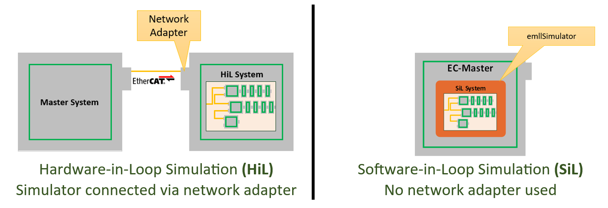

*****
About
*****

The |Product| virtualizes EtherCAT\ |R| networks to run Master systems without real slaves to test and develop EtherCAT\ |R| systems. 

The |Product| is available in two editions, HiL and SiL, depending on the connection between Master and Simulator:

This Quick Start Guide is about |Product| |Edition|. It briefly shows how to install and run the included example program. The |Product|'s User Manual 
contains information that is more detailed and is available at https://developer.acontis.com/ec-simulator.html\ .

The |Product| can be obtained from https://www.acontis.com/en/ecdownloads.html\ .

If you have questions, please contact us at https://www.acontis.com/en/contactform.html\ .

********************
Get Your License Key
********************

A valid license key is needed to run |Product| |Edition|, see chapter "*Protected version*" in the |Product| |Edition| User Manual for how to obtain it.

It is possible to continue this Quick Start Guide without a valid license key with limited functionality.

.. only:: EcSimulatorHiL

   The license key **must match the network adapter** used by |Product| |Edition|!
   
.. only:: EcSimulatorSiL

   The license key **must match the network adapter** given as parameter for license purposes!