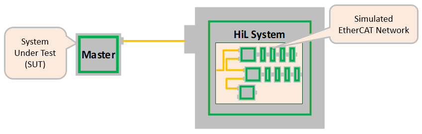
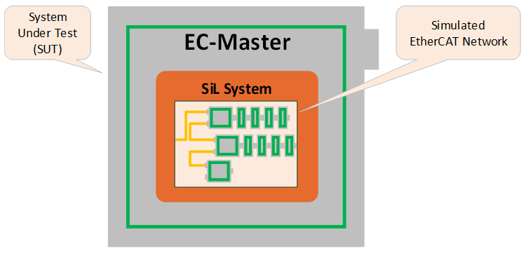

************
Introduction
************

What is EtherCAT?
*****************

EtherCAT® (Ethernet for Control Automation Technology) is a high-performance Ethernet Fieldbus technology that provides a reliable, efficient, and cost-effective communication solution for a wide variety of industrial automation applications. Originally developed as an open technology by Beckhoff Automation in 2003, and subsequently turned over to an independent organization known as the EtherCAT Technology Group, EtherCAT has since become one of the most widely used industrial Ethernet protocols in the world.

.. seealso:: A comprehensive introduction to EtherCAT technology can be found at https://www.acontis.com/en/what-is-ethercat-communication-protocol.html.

EC-Simulator - Features
***********************

Feature ID:  Unique identification used in ETG.1500 EtherCAT Master Classes

.. list-table::
    :widths: 25 45 17 13
    :header-rows: 1
    
    * - Feature name
      - Short description
      - Implemented
      - Feature ID
    
    * - Service 
      - Support of all commands 
      - x 
      - 101
    
    * - IRQ field in datagram
      - Use IRQ information from Slave in datagram header 
      - x 
      - 102
    
    * - Slaves with Device Emulation
      - Support Slaves with and without application controller 
      - x 
      - 103
    
    * - EtherCAT State Machine
      - Support of ESM special behavior 
      - x 
      - 104
    
    * - Error Handling
      - Checking of network or slave errors, e.g., Working Counter 
      - -- 
      - 105
    
    * - VLAN
      - Support VLAN Tagging 
      - -- 
      - 106
    
    * - EtherCAT Frame Types
      - Support EtherCAT Frames 
      - x 
      - 107
    
    * - UDP Frame Types
      - Support UDP Frames 
      - -- 
      - 108
    
    * - Cyclic PDO
      - Cyclic process data exchange 
      - x 
      - 201
    
    * - Multiple Tasks
      - Different cycle tasks, Multiple update rates for PDO 
      - x 
      - 202
    
    * - Frame repetition
      - Send cyclic frames multiple times to increase immunity 
      - x 
      - 203
    
    * - Online scanning
      - Network configuration functionality included in EtherCAT Master 
      - x 
      - 301
    
    * - Reading ENI
      - Network Configuration taken from ENI file 
      - x 
      - --
    
    * - Compare Network configuration
      - Compare configured and existing network configuration during boot-up 
      - x 
      - 302
    
    * - Explicit Device identification
      - Identification used for Hot Connect and prevention against cable swapping 
      - x 
      - 303
    
    * - Station Alias Addressing
      - Support configured station alias in slave, i.e., enable 2nd Address and use it 
      - x 
      - 304
    
    * - Access to EEPROM
      - Support routines to access EEPROM via ESC register 
      - x 
      - 305
    
    * - Support Mailbox
      - Main functionality for mailbox transfer 
      - x 
      - 401
    
    * - Mailbox Resilient Layer
      - Support underlying resilient layer 
      - x 
      - 402
    
    * - Multiple Mailbox channels
      - Support multiple channels 
      - x 
      - 403
    
    * - Mailbox polling
      - Polling Mailbox state in slaves 
      - x 
      - 404
    
    * - SDO Up/Download
      - Normal and expedited transfer 
      - x 
      - 501
    
    * - Segmented Transfer
      - Segmented transfer 
      - x 
      - 502
    
    * - Complete Access
      - Transfer the entire object (with all sub-indices) at once 
      - x 
      - 503
    
    * - SDO Info service
      - Services to read object dictionary 
      - x 
      - 504
    
    * - Emergency Message
      - Receive Emergency messages 
      - x 
      - 505
    
    * - PDO in CoE
      - PDO services transmitted via CoE 
      - -- 
      - 506
    
    * - EoE protocol
      - Services for tunneling Ethernet frames. Includes all specified EoE services 
      - x 
      - 601
    
    * - Virtual Switch
      - Virtual Switch functionality 
      - -- 
      - 602
    
    * - EoE Endpoint to Operation Systems
      - Interface to the Operation System on top of the EoE layer 
      - -- 
      - 603
    
    * - FoE Protocol
      - Support FoE Protocol 
      - x 
      - 701
    
    * - Firmware Up-/Download
      - Password, FileName should be given by the application 
      - x 
      - 702
    
    * - Boot State
      - Support Boot-State for Firmware Up/Download 
      - x 
      - 703
    
    * - SoE Services
      - Support SoE Services 
      - x 
      - 801
    
    * - AoE Protocol
      - Support AoE Protocol 
      - x 
      - 901
    
    * - VoE Protocol
      - External Connectivity supported 
      - x 
      - 1001
    
    * - DC support
      - Support of Distributed Clock 
      - -- 
      - 1101
    
    * - Continuous Propagation Delay
      - Continuous Calculation of the compensation propagation delay 
      - -- 
      - 1102
    
    * - Sync window monitoring
      - Continuous monitoring of the Synchronization difference in the slaves 
      - -- 
      - 1103
    
    * - via Master
      - Information is given in ENI file or can be part of any other network configuration. Copying of the data can be handled by master stack or master's application 
      - x 
      - 1201

.. raw:: latex

    \newpage   
   

Editions (HiL / SiL)
********************

Hardware-in-Loop (HiL) Simulation
==================================

The System-Under-Test (SUT) is communicating via an EtherCAT cable with the |Product| software running on an external hardware, the HiL System.
In this setup the unchanged application together with the EtherCAT master can be tested using the standard physical network interface.

.. only:: EcSimulatorHiL

   The EC-Simulator is released for EC-Master, which is integrated into the majority of EtherCAT controllers as well as TwinCAT.
   It is also known to run with other EtherCAT Masters, such as CODESYS. ENI import from CODESYS needs at least CODESYS EtherCAT Modul Version 4.2.0.0 .

    
Software-in-the-Loop (SiL) Simulation
=====================================

The EtherCAT network is simulated by a software running on the System Under Test (SUT).
Instead of communicating with the Ethernet Controller, the EC-Master EtherCAT master is directly exchanging EtherCAT frames with the simulation software.

    
Protected version
*****************

The |Product| software is available in different protected versions:

Dongled
    Binary with dongle protection (Linux x64, x86, Windows only)
Protected
    Binary with MAC protection. Requires a physical network adapter for license check (HiL/SiL).
Unrestricted:
    Binary without MAC protection

The protected version is limited to 5 slaves and will automatically stop after about 10 minutes of continuous operation. In order to remove this restriction a valid runtime license key or a dongle is required. The runtime license protection with license key is based on the MAC address of the Ethernet controller used for the EtherCAT protocol. With a valid license key and Protected version the purchased features are automatically unlocked. The Dongled version needs the Dongle and WIBU service to be installed and running. The purchased features stored on the Dongle are automatically unlocked.

.. only:: EcSimulatorHiL

    .. seealso:: :cpp:func:`esSetLicenseKey`

.. only:: EcSimulatorSiL
        
    .. seealso:: :cpp:func:`esSetLicenseKey`, :ref:`architecture:Simulator Ethernet Driver parameters`

Licensing procedure for Development Licenses
============================================

#. Installation of |Product| Protected or Dongled version accordingly
#. In case of |Product| Protected: Determine the MAC Address by calling esGetSrcMacAddress(0, &oSrcMacAddress)/ecatGetSrcMacAddress(&oSrcMacAddress) or from a sticker applied on the hardware near the Ethernet controller.
#. Send an Email with the subject "**Development License Key Request, Commission** *your commission number*" with the MAC address to sales@acontis.com
#. Acontis will create the license keys and return them in a **License Key Text File (CSV format)**.

   .. code-block:: none

       Number;MAC Address;License Key
       1;00-00-5A-11-77-FE;DA1099F2-15C249E9-54327FBC-3BA579B2-318AB2B6-CD13B221
       2;64-31-50-80-20-4E;A2B4C98D-00185EF9-22134567-DA1099F2-15C249E9-54327FBC

#. Activate the License Key by calling :cpp:func:`esSetLicenseKey` or EC_T_LINK_PARMS_SIMULATOR (SiL) with the license key that corresponds to the MAC address on the hardware and check the return code. The license key is 53 characters long. For HiL the API :cpp:func:`esSetLicenseKey` must be called after :cpp:func:`esInitSimulator` and before :cpp:func:`esConfigureNetwork`. For SiL the license key must be set at  :cpp:member:`EC_T_SIMULATOR_INIT_PARMS::szLicenseKey` .

   Example HiL:

   .. code-block:: cpp

       esSetLicenseKey(0, "A2B4C98D-00185EF9-22134567-DA1099F2-15C249E9-54327FBC");

   Example SiL:

   .. prompt:: bash

       EcMasterDemo -simulator 1 1 eni.xml --lic A2B4C98D-00185EF9-22134567-DA1099F2-15C249E9-54327FBC --link -intelgbe 1 1

Licensing procedure for Runtime Licenses
========================================

#. Installation of |Product| Protected or Dongled version accordingly
#. In case of |Product| Protected: Determine the MAC Address by calling esGetSrcMacAddress(0, &oSrcMacAddress)/ecatGetSrcMacAddress(&oSrcMacAddress) or from a sticker applied on the hardware near the Ethernet controller.
#. Provide the MAC Addresses and numbers from **previously ordered and unused runtime license stickers** in a text file to acontis as described in the example below. Please use a separate line for each runtime license sticker number and MAC Address.

   .. code-block:: none

       100-105-1-1/1603310001;00-00-5A-11-77-FE  
       100-105-1-1/1603310002;64-31-50-80-20-4E

#. Send an Email with the subject "**Runtime License Key Request, Commission** *your commission number*" with the MAC address to sales@acontis.com

#. Acontis will create the license keys and return them in a **License Key Text File (CSV format)**.

   .. code-block:: none  
   
       Number;MAC Address;License Key
       1;00-00-5A-11-77-FE;DA1099F2-15C249E9-54327FBC    
       2;64-31-50-80-20-4E;A2B4C98D-00185EF9-22134567-DA1099F2-15C249E9-54327FBC

#. Activate the License Key by calling :cpp:func:`esSetLicenseKey` or EC_T_LINK_PARMS_SIMULATOR (SiL) with the license key that corresponds to the MAC address on the hardware and check the return code. The license key is 53 characters long. For HiL the API :cpp:func:`esSetLicenseKey` must be called after :cpp:func:`esInitSimulator` and before :cpp:func:`esConfigureNetwork`. For SiL the license key must be set at  :cpp:member:`EC_T_SIMULATOR_INIT_PARMS::szLicenseKey` .

   Example HiL:

   .. code-block:: cpp

       esSetLicenseKey(0, "A2B4C98D-00185EF9-22134567-DA1099F2-15C249E9-54327FBC");

   Example SiL:

   .. prompt:: bash

       EcMasterDemo -simulator 1 1 eni.xml --lic A2B4C98D-00185EF9-22134567-DA1099F2-15C249E9-54327FBC --link -intelgbe 1 1

Known restrictions
******************

Some slaves require extended information to be simulated.

.. seealso:: :ref:`architecture:Extended EtherCAT Network Configuration (EXI)`

The "<ExtendedInfo>"-Tag in EXI are currently not importable to EC-Engineer and must be removed before importing EXI as ENI file. Simulator settings contained in the extended information are stored in the .ecc file and can be copied between EC-Engineer instances using Copy and Paste.

Value Information (Default, Min, Max) from object dictionary cannot be retrieved using SSC, see SSC\\sdoserv :
„the transmission of the value info is not supported yet of the sample code".

Occasional start up error (timeout) in case of DCM Bus Shift (DC control loop not included in |Product|), work-around with OsQueryMsecCount() replacement possible.

.. include:: ../../Common/license.rst