# BMAD Method Documentation (Full)

> Complete documentation for AI consumption
> Generated: 2026-01-19
> Repository: https://github.com/bmad-code-org/BMAD-METHOD

<document path="404.md">
The page you're looking for doesn't exist or has been moved.

[Return to Home](/docs/index.md)
</document>

<document path="downloads.md">
Download BMad Method resources for offline use, AI training, or integration.

## Source Bundles

| File | Description |
|------|-------------|
| **[bmad-sources.zip](/downloads/bmad-sources.zip)** | Complete BMad source files |
| **[bmad-prompts.zip](/downloads/bmad-prompts.zip)** | Agent and workflow prompts only |

## LLM-Optimized Files

These files are designed for AI consumption - perfect for loading into Claude, ChatGPT, or any LLM context window.

| File | Description | Use Case |
|------|-------------|----------|
| **[llms.txt](/llms.txt)** | Documentation index with summaries | Quick overview, navigation |
| **[llms-full.txt](/llms-full.txt)** | Complete documentation concatenated | Full context loading |

### Using with LLMs

**Claude Projects:**
```
Upload llms-full.txt as project knowledge
```

**ChatGPT:**
```
Paste llms.txt for navigation, or sections from llms-full.txt as needed
```

**API Usage:**
```python
import requests
docs = requests.get("https://bmad-code-org.github.io/BMAD-METHOD/llms-full.txt").text
# Include in your system prompt or context
```

## Installation Options

### NPM (Recommended)

```bash
npx bmad-method@alpha install
```

## Version Information

- **Current Version:** See [CHANGELOG](https://github.com/bmad-code-org/BMAD-METHOD/blob/main/CHANGELOG.md)
- **Release Notes:** Available on [GitHub Releases](https://github.com/bmad-code-org/BMAD-METHOD/releases)

## API Access

For programmatic access to BMad documentation:

```bash
# Get documentation index
curl https://bmad-code-org.github.io/BMAD-METHOD/llms.txt

# Get full documentation
curl https://bmad-code-org.github.io/BMAD-METHOD/llms-full.txt
```

## Contributing

Want to improve BMad Method? Check out:

- [Contributing Guide](https://github.com/bmad-code-org/BMAD-METHOD/blob/main/CONTRIBUTING.md)
- [GitHub Repository](https://github.com/bmad-code-org/BMAD-METHOD)
</document>

<document path="explanation/agents/barry-quick-flow.md">
Barry is the elite solo developer who takes projects from concept to deployment with ruthless efficiency — no handoffs, no delays, just pure focused development.

:::note[Agent Info]
- **Agent ID:** `_bmad/bmm/agents/quick-flow-solo-dev.md`
- **Icon:** 🚀
- **Module:** BMM
:::

## Overview

Barry is the elite solo developer who lives and breathes the BMad Quick Flow workflow. He takes projects from concept to deployment with ruthless efficiency - no handoffs, no delays, just pure focused development. Barry architects specs, writes the code, and ships features faster than entire teams. When you need it done right and done now, Barry's your dev.

### Agent Persona

**Name:** Barry
**Title:** Quick Flow Solo Dev

**Identity:** Barry is an elite developer who thrives on autonomous execution. He lives and breathes the BMad Quick Flow workflow, taking projects from concept to deployment with ruthless efficiency. No handoffs, no delays - just pure, focused development. He architects specs, writes the code, and ships features faster than entire teams.

**Communication Style:** Direct, confident, and implementation-focused. Uses tech slang and gets straight to the point. No fluff, just results. Every response moves the project forward.

**Core Principles:**

- Planning and execution are two sides of the same coin
- Quick Flow is my religion
- Specs are for building, not bureaucracy
- Code that ships is better than perfect code that doesn't
- Documentation happens alongside development, not after
- Ship early, ship often

## Menu Commands

Barry owns the entire BMad Quick Flow path, providing a streamlined 3-step development process that eliminates handoffs and maximizes velocity.

### 1. **quick-spec**

- **Workflow:** `_bmad/bmm/workflows/bmad-quick-flow/quick-spec/workflow.md`
- **Description:** Architect a technical spec with implementation-ready stories
- **Use when:** You need to transform requirements into a buildable spec

### 2. **quick-dev**

- **Workflow:** `_bmad/bmm/workflows/bmad-quick-flow/quick-dev/workflow.yaml`
- **Description:** Ship features from spec or direct instructions - no handoffs
- **Use when:** You're ready to ship code based on a spec or clear instructions

### 3. **code-review**

- **Workflow:** `_bmad/bmm/workflows/4-implementation/code-review/workflow.yaml`
- **Description:** Review code for quality, patterns, and acceptance criteria
- **Use when:** You need to validate implementation quality

### 4. **party-mode**

- **Workflow:** `_bmad/core/workflows/party-mode/workflow.yaml`
- **Description:** Bring in other experts when I need specialized backup
- **Use when:** You need collaborative problem-solving or specialized expertise

## When to Use Barry

### Ideal Scenarios

1. **Quick Flow Development** - Small to medium features that need rapid delivery
2. **Technical Specification Creation** - When you need detailed implementation plans
3. **Direct Development** - When requirements are clear and you want to skip extensive planning
4. **Code Reviews** - When you need senior-level technical validation
5. **Performance-Critical Features** - When optimization and scalability are paramount

### Project Types

- **Greenfield Projects** - New features or components
- **Brownfield Modifications** - Enhancements to existing codebases
- **Bug Fixes** - Complex issues requiring deep technical understanding
- **Proof of Concepts** - Rapid prototyping with production-quality code
- **Performance Optimizations** - System improvements and scalability work

## The BMad Quick Flow Process

Barry orchestrates a simple, efficient 3-step process:


### Step 1: Technical Specification (`quick-spec`)

**Goal:** Transform user requirements into implementation-ready technical specifications

**Process:**

1. **Problem Understanding** - Clarify requirements, scope, and constraints
2. **Code Investigation** - Analyze existing patterns and dependencies (if applicable)
3. **Specification Generation** - Create comprehensive tech spec with:
   - Problem statement and solution overview
   - Development context and patterns
   - Implementation tasks with acceptance criteria
   - Technical decisions and dependencies
4. **Review and Finalize** - Validate spec captures user intent

**Output:** `tech-spec-{slug}.md` saved to sprint artifacts

**Best Practices:**

- Include ALL context a fresh dev agent needs
- Be specific about files, patterns, and conventions
- Define clear acceptance criteria using Given/When/Then format
- Document technical decisions and trade-offs

### Step 2: Development (`quick-dev`)

**Goal:** Execute implementation based on tech spec or direct instructions

**Two Modes:**

**Mode A: Tech-Spec Driven**

- Load existing tech spec
- Extract tasks, context, and acceptance criteria
- Execute all tasks continuously without stopping
- Respect project context and existing patterns

**Mode B: Direct Instructions**

- Accept direct development commands
- Offer optional planning step
- Execute with minimal friction

**Process:**

1. **Load Project Context** - Understand patterns and conventions
2. **Execute Implementation** - Work through all tasks:
   - Load relevant files and context
   - Implement following established patterns
   - Write and run tests
   - Handle errors appropriately
3. **Verify Completion** - Ensure all tasks complete, tests passing, AC satisfied

### Step 3: Code Review (`code-review`) - Optional

**Goal:** Senior developer review of implemented code

**When to Use:**

- Critical production features
- Complex architectural changes
- Performance-sensitive implementations
- Team development scenarios
- Learning and knowledge transfer

**Review Focus:**

- Code quality and patterns
- Acceptance criteria compliance
- Performance and scalability
- Security considerations
- Maintainability and documentation

## Collaboration with Other Agents

### Natural Partnerships

- **Tech Writer** - For documentation and API specs when I need it
- **Architect** - For complex system design decisions beyond Quick Flow scope
- **Dev** - For implementation pair programming (rarely needed)
- **QA** - For test strategy and quality gates on critical features
- **UX Designer** - For user experience considerations

### Party Mode Composition

In party mode, Barry often acts as:

- **Solo Tech Lead** - Guiding architectural decisions
- **Implementation Expert** - Providing coding insights
- **Performance Optimizer** - Ensuring scalable solutions
- **Code Review Authority** - Validating technical approaches

## Tips for Working with Barry

### For Best Results

1. **Be Specific** - Provide clear requirements and constraints
2. **Share Context** - Include relevant files and patterns
3. **Define Success** - Clear acceptance criteria lead to better outcomes
4. **Trust the Process** - The 3-step flow is optimized for speed and quality
5. **Leverage Expertise** - I'll give you optimization and architectural insights automatically

### Communication Patterns

- **Git Commit Style** - "feat: Add user authentication with OAuth 2.0"
- **RFC Style** - "Proposing microservice architecture for scalability"
- **Direct Questions** - "Actually, have you considered the race condition?"
- **Technical Trade-offs** - "We could optimize for speed over memory here"

### Avoid These Common Mistakes

1. **Vague Requirements** - Leads to unnecessary back-and-forth
2. **Ignoring Patterns** - Causes technical debt and inconsistencies
3. **Skipping Code Review** - Missed opportunities for quality improvement
4. **Over-planning** - I excel at rapid, pragmatic development
5. **Not Using Party Mode** - Missing collaborative insights for complex problems

## Example Workflow

```bash
# Start with Barry
/bmad:bmm:agents:quick-flow-solo-dev

# Create a tech spec
> quick-spec

# Quick implementation
> quick-dev tech-spec-auth.md

# Optional code review
> code-review
```

### Sample Tech Spec Structure

```markdown
# Tech-Spec: User Authentication System

**Created:** 2025-01-15
**Status:** Ready for Development

## Overview

### Problem Statement

Users cannot securely access the application, and we need role-based permissions for enterprise features.

### Solution

Implement OAuth 2.0 authentication with JWT tokens and role-based access control (RBAC).

### Scope (In/Out)

**In:** Login, logout, password reset, role management
**Out:** Social login, SSO, multi-factor authentication (Phase 2)

## Context for Development

### Codebase Patterns

- Use existing auth middleware pattern in `src/middleware/auth.js`
- Follow service layer pattern from `src/services/`
- JWT secrets managed via environment variables

### Files to Reference

- `src/middleware/auth.js` - Authentication middleware
- `src/models/User.js` - User data model
- `config/database.js` - Database connection

### Technical Decisions

- JWT tokens over sessions for API scalability
- bcrypt for password hashing
- Role-based permissions stored in database

## Implementation Plan

### Tasks

- [ ] Create authentication service
- [ ] Implement login/logout endpoints
- [ ] Add JWT middleware
- [ ] Create role-based permissions
- [ ] Write comprehensive tests

### Acceptance Criteria

- [ ] Given valid credentials, when user logs in, then receive JWT token
- [ ] Given invalid token, when accessing protected route, then return 401
- [ ] Given admin role, when accessing admin endpoint, then allow access
```

## Common Questions

- [When should I use Barry vs other agents?](#when-should-i-use-barry-vs-other-agents)
- [Is the code review step mandatory?](#is-the-code-review-step-mandatory)
- [Can I skip the tech spec step?](#can-i-skip-the-tech-spec-step)
- [How does Barry differ from the Dev agent?](#how-does-barry-differ-from-the-dev-agent)
- [Can Barry handle enterprise-scale projects?](#can-barry-handle-enterprise-scale-projects)

### When should I use Barry vs other agents?

Use Barry for Quick Flow development (small to medium features), rapid prototyping, or when you need elite solo development. For large, complex projects requiring full team collaboration, consider the full BMad Method with specialized agents.

### Is the code review step mandatory?

No, it's optional but highly recommended for critical features, team projects, or when learning best practices.

### Can I skip the tech spec step?

Yes, the quick-dev workflow accepts direct instructions. However, tech specs are recommended for complex features or team collaboration.

### How does Barry differ from the Dev agent?

Barry handles the complete Quick Flow process (spec → dev → review) with elite architectural expertise, while the Dev agent specializes in pure implementation tasks. Barry is your autonomous end-to-end solution.

### Can Barry handle enterprise-scale projects?

For enterprise-scale projects requiring full team collaboration, consider using the Enterprise Method track. Barry is optimized for rapid delivery in the Quick Flow track where solo execution wins.

:::tip[Ready to Ship?]
Start with `/bmad:bmm:agents:quick-flow-solo-dev`
:::
</document>

<document path="explanation/agents/index.md">
Comprehensive guides to BMad's AI agents — their roles, capabilities, and how to work with them effectively.

## Agent Guides

| Agent                                                                           | Description                                          |
| ------------------------------------------------------------------------------- | ---------------------------------------------------- |
| **[Agent Roles](/docs/explanation/core-concepts/agent-roles.md)**               | Overview of all BMM agent roles and responsibilities |
| **[Quick Flow Solo Dev (Barry)](/docs/explanation/agents/barry-quick-flow.md)** | The dedicated agent for rapid development            |

## Getting Started

1. Read **[What Are Agents?](/docs/explanation/core-concepts/what-are-agents.md)** for the core concept explanation
2. Review **[Agent Roles](/docs/explanation/core-concepts/agent-roles.md)** to understand available agents
3. Choose an agent that fits your workflow needs
</document>

<document path="explanation/architecture/four-phases.md">
BMad Method uses a four-phase approach that adapts to project complexity while ensuring consistent quality.

## Phase Overview

| Phase | Name | Purpose | Required? |
|-------|------|---------|-----------|
| **Phase 1** | Analysis | Exploration and discovery | Optional |
| **Phase 2** | Planning | Requirements definition | Required |
| **Phase 3** | Solutioning | Technical design | Track-dependent |
| **Phase 4** | Implementation | Building the software | Required |

## Phase 1: Analysis (Optional)

Exploration and discovery workflows that help validate ideas and understand markets before planning.

**Workflows:**
- `brainstorm-project` - Solution exploration
- `research` - Market/technical/competitive research
- `product-brief` - Strategic vision capture

**When to use:**
- Starting new projects
- Exploring opportunities
- Validating market fit

**When to skip:**
- Clear requirements
- Well-defined features
- Continuing existing work

## Phase 2: Planning (Required)

Requirements definition using the scale-adaptive system to match planning depth to project complexity.

**Workflows:**
- `prd` - Product Requirements Document (BMad Method/Enterprise)
- `tech-spec` - Technical specification (Quick Flow)
- `create-ux-design` - Optional UX specification

**Key principle:**
Define **what** to build and **why**. Leave **how** to Phase 3.

## Phase 3: Solutioning (Track-Dependent)

Technical architecture and design decisions that prevent agent conflicts during implementation.

**Workflows:**
- `architecture` - System design with ADRs
- `create-epics-and-stories` - Work breakdown (after architecture)
- `implementation-readiness` - Gate check

**Required for:**
- BMad Method (complex projects)
- Enterprise Method

**Skip for:**
- Quick Flow (simple changes)

**Key principle:**
Make technical decisions explicit so all agents implement consistently.

## Phase 4: Implementation (Required)

Iterative sprint-based development with story-centric workflow.

**Workflows:**
- `sprint-planning` - Initialize tracking
- `create-story` - Prepare stories
- `dev-story` - Implement with tests
- `code-review` - Quality assurance
- `retrospective` - Continuous improvement

:::tip[Key Principle]
One story at a time — complete each story's full lifecycle before starting the next.
:::

## Phase Flow by Track

### Quick Flow

```
Phase 2 (tech-spec) → Phase 4 (implement)
```

Skip Phases 1 and 3 for simple changes.

### BMad Method

```
Phase 1 (optional) → Phase 2 (PRD) → Phase 3 (architecture) → Phase 4 (implement)
```

Full methodology for complex projects.

### Enterprise

```
Phase 1 → Phase 2 (PRD) → Phase 3 (architecture + extended) → Phase 4 (implement)
```

Same as BMad Method with optional extended workflows.
</document>

<document path="explanation/architecture/preventing-agent-conflicts.md">
When multiple AI agents implement different parts of a system, they can make conflicting technical decisions. Architecture documentation prevents this by establishing shared standards.

## Common Conflict Types

### API Style Conflicts

Without architecture:
- Agent A uses REST with `/users/{id}`
- Agent B uses GraphQL mutations
- Result: Inconsistent API patterns, confused consumers

With architecture:
- ADR specifies: "Use GraphQL for all client-server communication"
- All agents follow the same pattern

### Database Design Conflicts

Without architecture:
- Agent A uses snake_case column names
- Agent B uses camelCase column names
- Result: Inconsistent schema, confusing queries

With architecture:
- Standards document specifies naming conventions
- All agents follow the same patterns

### State Management Conflicts

Without architecture:
- Agent A uses Redux for global state
- Agent B uses React Context
- Result: Multiple state management approaches, complexity

With architecture:
- ADR specifies state management approach
- All agents implement consistently

## How Architecture Prevents Conflicts

### 1. Explicit Decisions via ADRs

Every significant technology choice is documented with:
- Context (why this decision matters)
- Options considered (what alternatives exist)
- Decision (what we chose)
- Rationale (why we chose it)
- Consequences (trade-offs accepted)

### 2. FR/NFR-Specific Guidance

Architecture maps each functional requirement to technical approach:
- FR-001: User Management → GraphQL mutations
- FR-002: Mobile App → Optimized queries

### 3. Standards and Conventions

Explicit documentation of:
- Directory structure
- Naming conventions
- Code organization
- Testing patterns

## Architecture as Shared Context

Think of architecture as the shared context that all agents read before implementing:

```
PRD: "What to build"
     ↓
Architecture: "How to build it"
     ↓
Agent A reads architecture → implements Epic 1
Agent B reads architecture → implements Epic 2
Agent C reads architecture → implements Epic 3
     ↓
Result: Consistent implementation
```

## Key ADR Topics

Common decisions that prevent conflicts:

| Topic | Example Decision |
|-------|-----------------|
| API Style | GraphQL vs REST vs gRPC |
| Database | PostgreSQL vs MongoDB |
| Auth | JWT vs Sessions |
| State Management | Redux vs Context vs Zustand |
| Styling | CSS Modules vs Tailwind vs Styled Components |
| Testing | Jest + Playwright vs Vitest + Cypress |

## Anti-Patterns to Avoid

:::caution[Common Mistakes]
- **Implicit Decisions** — "We'll figure out the API style as we go" leads to inconsistency
- **Over-Documentation** — Documenting every minor choice causes analysis paralysis
- **Stale Architecture** — Documents written once and never updated cause agents to follow outdated patterns
:::

:::tip[Correct Approach]
- Document decisions that cross epic boundaries
- Focus on conflict-prone areas
- Update architecture as you learn
- Use `correct-course` for significant changes
:::
</document>

<document path="explanation/architecture/why-solutioning-matters.md">
Phase 3 (Solutioning) translates **what** to build (from Planning) into **how** to build it (technical design). This phase prevents agent conflicts in multi-epic projects by documenting architectural decisions before implementation begins.

## The Problem Without Solutioning

```
Agent 1 implements Epic 1 using REST API
Agent 2 implements Epic 2 using GraphQL
Result: Inconsistent API design, integration nightmare
```

When multiple agents implement different parts of a system without shared architectural guidance, they make independent technical decisions that may conflict.

## The Solution With Solutioning

```
architecture workflow decides: "Use GraphQL for all APIs"
All agents follow architecture decisions
Result: Consistent implementation, no conflicts
```

By documenting technical decisions explicitly, all agents implement consistently and integration becomes straightforward.

## Solutioning vs Planning

| Aspect   | Planning (Phase 2)      | Solutioning (Phase 3)             |
| -------- | ----------------------- | --------------------------------- |
| Question | What and Why?           | How? Then What units of work?     |
| Output   | FRs/NFRs (Requirements) | Architecture + Epics/Stories      |
| Agent    | PM                      | Architect → PM                    |
| Audience | Stakeholders            | Developers                        |
| Document | PRD (FRs/NFRs)          | Architecture + Epic Files         |
| Level    | Business logic          | Technical design + Work breakdown |

## Key Principle

**Make technical decisions explicit and documented** so all agents implement consistently.

This prevents:
- API style conflicts (REST vs GraphQL)
- Database design inconsistencies
- State management disagreements
- Naming convention mismatches
- Security approach variations

## When Solutioning is Required

| Track | Solutioning Required? |
|-------|----------------------|
| Quick Flow | No - skip entirely |
| BMad Method Simple | Optional |
| BMad Method Complex | Yes |
| Enterprise | Yes |

:::tip[Rule of Thumb]
If you have multiple epics that could be implemented by different agents, you need solutioning.
:::

## The Cost of Skipping

Skipping solutioning on complex projects leads to:

- **Integration issues** discovered mid-sprint
- **Rework** due to conflicting implementations
- **Longer development time** overall
- **Technical debt** from inconsistent patterns

:::caution[Cost Multiplier]
Catching alignment issues in solutioning is 10× faster than discovering them during implementation.
:::
</document>

<document path="explanation/bmm/index.md">
Complete guides for the BMad Method Module (BMM) — AI-powered agile development workflows that adapt to your project's complexity.

## Getting Started

:::tip[Quick Path]
Install → workflow-init → Follow agent guidance
:::

**New to BMM?** Start here:

| Resource | Description |
|----------|-------------|
| **[Quick Start Guide](/docs/tutorials/getting-started/getting-started-bmadv6.md)** | Step-by-step guide to building your first project |
| **[Complete Workflow Diagram](../../tutorials/getting-started/images/workflow-method-greenfield.svg)** | Visual flowchart showing all phases, agents, and decision points |

## Core Concepts

The BMad Method is meant to be adapted and customized to your specific needs. In this realm there is no one size fits all - your needs are unique, and BMad Method is meant to support this (and if it does not, can be further customized or extended with new modules).

First know there is the full BMad Method Process and then there is a Quick Flow for those quicker smaller efforts.

- **[Full Adaptive BMad Method](#workflow-guides)** - Full planning and scope support through extensive development and testing.
  - Broken down into 4 phases, all of which are comprised of both required and optional phases
    - Phases 1-3 are all about progressive idea development through planning and preparations to build your project.
    - Phase 4 is the implementation cycle where you will Just In Time (JIT) produce the contextual stories needed for the dev agent based on the extensive planning completed
    - All 4 phases have optional steps in them, depending on how rigorous you want to go with planning, research ideation, validation, testing and traceability.
  - While there is a lot here, know that even this can be distilled down to a simple PRD, Epic and Story list and then jump into the dev cycle. But if that is all you want, you might be better off with the BMad Quick Flow described next

- **[BMad Quick Flow](/docs/explanation/features/quick-flow.md)** - Fast-track development workflow
  - 3-step process: spec → dev → optional review
  - Perfect for bug fixes and small features
  - Rapid prototyping with production quality
  - Implementation in minutes, not days
  - Has a specialized single agent that does all of this: **[Quick Flow Solo Dev Agent](/docs/explanation/agents/barry-quick-flow.md)**

- **TEA engagement (optional)** - Choose TEA engagement: none, TEA-only (standalone), or integrated by track. See **[Test Architect Guide](/docs/explanation/features/tea-overview.md)**.

## Agents and Collaboration

Complete guide to BMM's AI agent team:

- **[Agents Guide](/docs/explanation/core-concepts/agent-roles.md)** - Comprehensive agent reference
  - 12 specialized BMM agents + BMad Master
  - Agent roles, workflows, and when to use them
  - Agent customization system
  - Best practices and common patterns

- **[Party Mode Guide](/docs/explanation/features/party-mode.md)** - Multi-agent collaboration
  - How party mode works (19+ agents collaborate in real-time)
  - When to use it (strategic, creative, cross-functional, complex)
  - Example party compositions
  - Multi-module integration (BMM + CIS + BMB + custom)
  - Agent customization in party mode
  - Best practices

## Working with Existing Code

Comprehensive guide for brownfield development:

- **[Brownfield Development Guide](/docs/how-to/brownfield/index.md)** - Complete guide for existing codebases
  - Documentation phase strategies
  - Track selection for brownfield
  - Integration with existing patterns
  - Phase-by-phase workflow guidance
  - Common scenarios

## Quick References

Essential reference materials:

- **[Glossary](/docs/reference/glossary/index.md)** - Key terminology and concepts
- **[FAQ](/docs/explanation/faq/index.md)** - Frequently asked questions across all topics

## Choose Your Path

### I need to...

**Build something new (greenfield)**
→ Start with [Quick Start Guide](/docs/tutorials/getting-started/getting-started-bmadv6.md)

**Fix a bug or add small feature**
→ Use the [Quick Flow Solo Dev](/docs/explanation/agents/barry-quick-flow.md) directly with its dedicated stand alone [Quick Bmad Spec Flow](/docs/explanation/features/quick-flow.md) process

**Work with existing codebase (brownfield)**
→ Read [Brownfield Development Guide](/docs/how-to/brownfield/index.md)
→ Pay special attention to documentation requirements for brownfield projects

## Workflow Guides

Comprehensive documentation for all BMM workflows organized by phase:

- **[Phase 1: Analysis Workflows](/docs/how-to/workflows/run-brainstorming-session.md)** - Optional exploration and research workflows (595 lines)
  - brainstorm-project, product-brief, research, and more
  - When to use analysis workflows
  - Creative and strategic tools

- **[Phase 2: Planning Workflows](/docs/how-to/workflows/create-prd.md)** - Scale-adaptive planning (967 lines)
  - prd, tech-spec, gdd, narrative, ux
  - Track-based planning approach (Quick Flow, BMad Method, Enterprise Method)
  - Which planning workflow to use

- **[Phase 3: Solutioning Workflows](/docs/how-to/workflows/create-architecture.md)** - Architecture and validation (638 lines)
  - architecture, create-epics-and-stories, implementation-readiness
  - V6: Epics created AFTER architecture for better quality
  - Required for BMad Method and Enterprise Method tracks
  - Preventing agent conflicts

- **[Phase 4: Implementation Workflows](/docs/how-to/workflows/run-sprint-planning.md)** - Sprint-based development (1,634 lines)
  - sprint-planning, create-story, dev-story, code-review
  - Complete story lifecycle
  - One-story-at-a-time discipline

- **[Testing & QA Workflows](/docs/explanation/features/tea-overview.md)** - Comprehensive quality assurance (1,420 lines)
  - Test strategy, automation, quality gates
  - TEA agent and test healing

## External Resources

### Community and Support

- **[Discord Community](https://discord.gg/gk8jAdXWmj)** - Get help from the community (#bmad-method-help, #report-bugs-and-issues)
- **[GitHub Issues](https://github.com/bmad-code-org/BMAD-METHOD/issues)** - Report bugs or request features
- **[YouTube Channel](https://www.youtube.com/@BMadCode)** - Video tutorials and walkthroughs

:::tip[Ready to Begin?]
[Start with the Quick Start Guide](/docs/tutorials/getting-started/getting-started-bmadv6.md)
:::
</document>

<document path="explanation/core/index.md">
The Core Module is installed with all installations of BMad modules and provides common functionality that any module, workflow, or agent can take advantage of.

## Core Module Components

- **[Global Core Config](/docs/reference/configuration/global-config.md)** — Inheritable configuration that impacts all modules and custom content
- **[Core Workflows](/docs/reference/workflows/core-workflows.md)** — Domain-agnostic workflows usable by any module
  - [Party Mode](/docs/explanation/features/party-mode.md) — Multi-agent conversation orchestration
  - [Brainstorming](/docs/explanation/features/brainstorming-techniques.md) — Structured creative sessions with 60+ techniques
  - [Advanced Elicitation](/docs/explanation/features/advanced-elicitation.md) — LLM rethinking with 50+ reasoning methods
- **[Core Tasks](/docs/reference/configuration/core-tasks.md)** — Common tasks available across modules
  - [Index Docs](/docs/reference/configuration/core-tasks.md#index-docs) — Generate directory index files
  - [Adversarial Review](/docs/reference/configuration/core-tasks.md#adversarial-review) — Critical content review
  - [Shard Document](/docs/reference/configuration/core-tasks.md#shard-document) — Split large documents into sections
</document>

<document path="explanation/core-concepts/agent-roles.md">
BMad Method uses specialized AI agents, each with a distinct role, expertise, and personality. Understanding these roles helps you know which agent to use for each task.

## Core Agents Overview

| Agent | Role | Primary Phase |
|-------|------|---------------|
| **Analyst** | Research and discovery | Phase 1 (Analysis) |
| **PM** | Requirements and planning | Phase 2 (Planning) |
| **Architect** | Technical design | Phase 3 (Solutioning) |
| **SM** | Sprint orchestration | Phase 4 (Implementation) |
| **DEV** | Code implementation | Phase 4 (Implementation) |
| **TEA** | Test architecture | Phases 3-4 (Cross-phase) |
| **UX Designer** | User experience | Phase 2-3 |
| **Quick Flow Solo Dev** | Fast solo development | All phases (Quick Flow) |

## Phase 1: Analysis

### Analyst (Mary)

Business analysis and research specialist.

**Responsibilities:**
- Brainstorming and ideation
- Market, domain, and competitive research
- Product brief creation
- Brownfield project documentation

**Key Workflows:**
- `*brainstorm-project`
- `*research`
- `*product-brief`
- `*document-project`

**When to use:** Starting new projects, exploring ideas, validating market fit, documenting existing codebases.

## Phase 2: Planning

### PM (John)

Product requirements and planning expert.

**Responsibilities:**
- Creating Product Requirements Documents
- Defining functional and non-functional requirements
- Breaking requirements into epics and stories
- Validating implementation readiness

**Key Workflows:**
- `*create-prd`
- `*create-epics-and-stories`
- `*implementation-readiness`

**When to use:** Defining what to build, creating PRDs, organizing work into stories.

### UX Designer (Sally)

User experience and UI design specialist.

**Responsibilities:**
- UX specification creation
- User journey mapping
- Wireframe and mockup design
- Design system documentation

**Key Workflows:**
- `*create-ux-design`
- `*validate-design`

**When to use:** When UX is a primary differentiator, complex user workflows, design system creation.

## Phase 3: Solutioning

### Architect (Winston)

System architecture and technical design expert.

**Responsibilities:**
- System architecture design
- Architecture Decision Records (ADRs)
- Technical standards definition
- Implementation readiness validation

**Key Workflows:**
- `*create-architecture`
- `*implementation-readiness`

**When to use:** Multi-epic projects, cross-cutting technical decisions, preventing agent conflicts.

## Phase 4: Implementation

### SM (Bob)

Sprint planning and story preparation orchestrator.

**Responsibilities:**
- Sprint planning and tracking
- Story preparation for development
- Course correction handling
- Epic retrospectives

**Key Workflows:**
- `*sprint-planning`
- `*create-story`
- `*correct-course`
- `*epic-retrospective`

**When to use:** Organizing work, preparing stories, tracking progress.

### DEV (Amelia)

Story implementation and code review specialist.

**Responsibilities:**
- Story implementation with tests
- Code review
- Following architecture patterns
- Quality assurance

**Key Workflows:**
- `*dev-story`
- `*code-review`

**When to use:** Writing code, implementing stories, reviewing quality.

## Cross-Phase Agents

### TEA (Murat)

Test architecture and quality strategy expert.

**Responsibilities:**
- Test framework setup
- Test design and planning
- ATDD and automation
- Quality gate decisions

**Key Workflows:**
- `*framework`, `*ci`
- `*test-design`, `*atdd`, `*automate`
- `*test-review`, `*trace`, `*nfr-assess`

**When to use:** Setting up testing, creating test plans, quality gates.

## Quick Flow

### Quick Flow Solo Dev (Barry)

Fast solo development without handoffs.

**Responsibilities:**
- Technical specification
- End-to-end implementation
- Code review

**Key Workflows:**
- `*quick-spec`
- `*quick-dev`
- `*code-review`

**When to use:** Bug fixes, small features, rapid prototyping.

## Choosing the Right Agent

| Task | Agent |
|------|-------|
| Brainstorming ideas | Analyst |
| Market research | Analyst |
| Creating PRD | PM |
| Designing UX | UX Designer |
| System architecture | Architect |
| Preparing stories | SM |
| Writing code | DEV |
| Setting up tests | TEA |
| Quick bug fix | Quick Flow Solo Dev |
</document>

<document path="explanation/core-concepts/index.md">
Understanding the fundamental building blocks of the BMad Method.

## The Essentials

| Concept | Description | Guide |
|---------|-------------|-------|
| **Agents** | AI assistants with personas, capabilities, and menus | [Agents Guide](/docs/explanation/core-concepts/what-are-agents.md) |
| **Workflows** | Structured processes for achieving specific outcomes | [Workflows Guide](/docs/explanation/core-concepts/what-are-workflows.md) |
| **Modules** | Packaged collections of agents and workflows | [Modules Guide](/docs/explanation/core-concepts/what-are-modules.md) |

## Getting Started

### New to BMad?
Start here to understand what BMad is and how it works:

1. **[Agents Guide](/docs/explanation/core-concepts/what-are-agents.md)** - Learn about Simple and Expert agents
2. **[Workflows Guide](/docs/explanation/core-concepts/what-are-workflows.md)** - Understand how workflows orchestrate tasks
3. **[Modules Guide](/docs/explanation/core-concepts/what-are-modules.md)** - See how modules organize functionality

### Installing BMad

- **[Installation Guide](/docs/how-to/installation/index.md)** - Set up BMad in your project
- **[Upgrading from v4](/docs/how-to/installation/upgrade-to-v6.md)** - Migrate from earlier versions

### Configuration

- **[BMad Customization](/docs/how-to/customization/index.md)** - Personalize agents and workflows

### Advanced

- **[Web Bundles](/docs/explanation/features/web-bundles.md)** - Use BMad in Gemini Gems and Custom GPTs
</document>

<document path="explanation/core-concepts/what-are-agents.md">
Agents are AI assistants that help you accomplish tasks. Each agent has a unique personality, specialized capabilities, and an interactive menu.

## Agent Types

BMad has two primary agent types, designed for different use cases:

### Simple Agents

**Self-contained, focused, ready to use.**

Simple agents are complete in a single file. They excel at well-defined tasks and require minimal setup.

**Best for:**
- Single-purpose assistants (code review, documentation, commit messages)
- Quick deployment
- Projects that don't require persistent memory
- Getting started fast

**Example:** A commit message agent that reads your git diff and generates conventional commits.

### Expert Agents

**Powerful, memory-equipped, domain specialists.**

Expert agents have a **sidecar** - a companion folder containing additional instructions, workflows, and memory files. They remember context across sessions and handle complex, multi-step tasks.

**Best for:**
- Domain specialists (security architect, game designer, product manager)
- Tasks requiring persistent memory
- Complex workflows with multiple stages
- Projects that grow over time

**Example:** A game architect that remembers your design decisions, maintains consistency across sprints, and coordinates with other specialists.

## Key Differences

| Feature          | Simple         | Expert                     |
| ---------------- | -------------- | -------------------------- |
| **Files**        | Single file    | Agent + sidecar folder     |
| **Memory**       | Session only   | Persistent across sessions |
| **Capabilities** | Focused scope  | Multi-domain, extensible   |
| **Setup**        | Zero config    | Sidecar initialization     |
| **Best Use**     | Specific tasks | Ongoing projects           |

## Agent Components

All agents share these building blocks:

### Persona
- **Role** - What the agent does (expertise domain)
- **Identity** - Who the agent is (personality, character)
- **Communication Style** - How the agent speaks (tone, voice)
- **Principles** - Why the agent acts (values, decision framework)

### Capabilities
- Skills, tools, and knowledge the agent can apply
- Mapped to specific menu commands

### Menu
- Interactive command list
- Triggers, descriptions, and handlers
- Auto-includes help and exit options

### Critical Actions (optional)
- Instructions that execute before the agent starts
- Enable autonomous behaviors (e.g., "check git status before changes")

## Which Should You Use?

:::tip[Quick Decision]
Choose **Simple** for focused, one-off tasks with no memory needs. Choose **Expert** when you need persistent context and complex workflows.
:::

**Choose Simple when:**
- You need a task done quickly and reliably
- The scope is well-defined and won't change much
- You don't need the agent to remember things between sessions

**Choose Expert when:**
- You're building something complex over time
- The agent needs to maintain context (project history, decisions)
- You want the agent to coordinate workflows or other agents
- Domain expertise requires specialized knowledge bases

## Creating Custom Agents

BMad provides the **BMad Builder (BMB)** module for creating your own agents. See the [Agent Creation Guide](https://github.com/bmad-code-org/bmad-builder/blob/main/docs/tutorials/create-custom-agent.md) for step-by-step instructions.


## Customizing Existing Agents

You can modify any agent's behavior without editing core files. See [BMad Customization](/docs/how-to/customization/index.md) for details. It is critical to never modify an installed agents .md file directly and follow the customization process, this way future updates to the agent or module its part of will continue to be updated and recompiled with the installer tool, and your customizations will still be retained.
</document>

<document path="explanation/core-concepts/what-are-modules.md">
Modules are organized collections of agents and workflows that solve specific problems or address particular domains.

## What is a Module?

A module is a self-contained package that includes:

- **Agents** - Specialized AI assistants
- **Workflows** - Step-by-step processes
- **Configuration** - Module-specific settings
- **Documentation** - Usage guides and reference

## Official BMad Method and Builder Modules

:::note[Core is Always Installed]
The Core module is automatically included with every BMad installation. It provides the foundation that other modules build upon.
:::

### Core Module
Always installed, provides shared functionality:
- Global configuration
- Core workflows (Party Mode, Advanced Elicitation, Brainstorming)
- Common tasks (document indexing, sharding, review)

### BMad Method (BMM)
Software and game development:
- Project planning workflows
- Implementation agents (Dev, PM, QA, Scrum Master)
- Testing and architecture guidance

### BMad Builder (BMB)
Create custom solutions:
- Agent creation workflows
- Workflow authoring tools
- Module scaffolding

## Additional Official BMad Modules

These are officially maintained modules by BMad but have their own repo's and docs.
These give a good idea also of what can be done with the BMad builder and creating your own custom modules.

### Creative Intelligence Suite (CIS)
Innovation and creativity:
- Creative thinking techniques
- Innovation strategy workflows
- Storytelling and ideation
- [Available Here](https://github.com/bmad-code-org/bmad-module-creative-intelligence-suite)

### BMad Game Dev (BMGD)
Game development specialization:
- Game design workflows
- Narrative development
- Performance testing frameworks
- [Available Here](https://github.com/bmad-code-org/bmad-module-game-dev-studio)

## Module Structure

Installed modules follow this structure:

```
_bmad/
├── core/           # Always present
├── bmm/            # BMad Method (if installed)
├── bmb/            # BMad Builder (if installed)
├── cis/            # Creative Intelligence (if installed)
└── bmgd/           # Game Dev (if installed)
```

## Custom Modules

You can create your own modules containing:
- Custom agents for your domain
- Organizational workflows
- Team-specific configurations

Custom modules are installed the same way as official modules.

## Installing Modules

During BMad installation, you choose which modules to install. You can also add or remove modules later by re-running the installer.

See [Installation Guide](/docs/how-to/installation/index.md) for details.
</document>

<document path="explanation/core-concepts/what-are-workflows.md">
Workflows are like prompts on steroids. They harness the untapped power and control of LLMs through progressive disclosure—breaking complex tasks into focused steps that execute sequentially. Instead of random AI slop where you hope for the best, workflows give you repeatable, reliable, high-quality outputs.

This guide explains what workflows are, why they're powerful, and how to think about designing them.

## What Is a Workflow?

A workflow is a structured process where the AI executes steps sequentially to accomplish a task. Each step has a specific purpose, and the AI moves through them methodically—whether that involves extensive collaboration or minimal user interaction.

Think of it this way: instead of asking "help me build a nutrition plan" and getting a generic response, a workflow guides you (or runs automatically) through discovery, assessment, strategy, shopping lists, and prep schedules—each step building on the last, nothing missed, no shortcuts taken.

## How do workflows differ from skills?

Actually they really do not - a workflow can be a skill, and a skill can be a workflow. The main thing with a BMad workflow is the suggestion to follow certain conventions, which actually are also skill best practices. A skill has a few optional and required fields to add as the main file workflow and get stored in a specific location depending on your tool choice for automatic invocation by the llm - whereas workflows are generally intentionally launched, with from another process calling them, or a user invoking via a slash command. In the near future, workflows will optionally be installable as skills also - but if you like, you can add front matter to your custom workflows based on the skill spec from Anthropic, and put them in the proper location your tool dictates.

### The Power of Progressive Disclosure

Here's why workflows work so well: the AI only sees the current step. It doesn't know about step 5 when it's on step 2. It can't get ahead of itself, skip steps, or lose focus. Each step gets the AI's full attention, completing fully before the next step loads.

This is the opposite of a giant prompt that tries to handle everything at once and inevitably misses details or loses coherence.

Workflows exist on a spectrum:

- **Interactive workflows** guide users through complex decisions via collaboration and facilitation
- **Automated workflows** run with minimal user input, processing documents or executing tasks
- **Hybrid workflows** combine both—some steps need user input, others run automatically

### Real-World Workflow Examples

**Tax Organizer Workflow**

A tax preparation workflow that helps users organize financial documents for tax filing. Runs in a single session, follows prescriptive IRS categories, produces a checklist of required documents with missing-item alerts. Sequential and compliance-focused.

**Meal Planning Workflow**

Creates personalized weekly meal plans through collaborative nutrition planning. Users can stop mid-session and return later because the workflow tracks progress. Intent-based conversation helps discover preferences rather than following a script. Multi-session, creative, and highly interactive.

**Course Creator Workflow**

Helps instructors design course syllabi. Branches based on course type—academic courses need accreditation sections, vocational courses need certification prep, self-paced courses need different structures entirely.

**Therapy Intake Workflow**

Guides mental health professionals through structured client intake sessions. Highly sensitive and confidential, uses intent-based questioning to build rapport while ensuring all required clinical information is collected. Continuable across multiple sessions.

**Software Architecture Workflow** (BMM Module)

Part of a larger software development pipeline. Runs after product requirements and UX design are complete, takes those documents as input, then collaboratively walks through technical decisions: system components, data flows, technology choices, architectural patterns. Produces an architecture document that implementation teams use to build consistently.

**Shard Document Workflow**

Nearly hands-off automated workflow. Takes a large document as input, uses a custom npx tool to split it into smaller files, deletes the original, then augments an index with content details so the LLM can efficiently find and reference specific sections later. Minimal user interaction—just specify the input document.

These examples show the range: from collaborative creative processes to automated batch jobs, workflows ensure completeness and consistency whether the work involves deep collaboration or minimal human oversight.

### The Facilitative Philosophy

When workflows involve users, they should be **facilitative, not directive**. The AI treats users as partners and domain experts, not as passive recipients of generated content.

**Collaborative dialogue, not command-response**: The AI and user work together throughout. The AI brings structured thinking, methodology, and technical knowledge. The user brings domain expertise, context, and judgment. Together they produce something better than either could alone.

**The user is the expert in their domain**: A nutrition planning workflow doesn't dictate meal plans—it guides users through discovering what works for their lifestyle. An architecture workflow doesn't tell architects what to build—it facilitates systematic decision-making so choices are explicit and consistent.

**Intent-based facilitation**: Workflows should describe goals and approaches, not scripts. Instead of "Ask: What is your age? Then ask: What is your goal weight?" use "Guide the user through understanding their health profile. Ask 1-2 questions at a time. Think about their responses before asking follow-ups. Probe to understand their actual needs."

The AI figures out exact wording and question order based on conversation context. This makes interactions feel natural and responsive rather than robotic and interrogative.

:::caution[When to Be Prescriptive]
Some workflows require exact scripts—medical intake, legal compliance, safety-critical procedures. But these are the exception. Default to facilitative intent-based approaches unless compliance or regulation demands otherwise.
:::

## Why Workflows Matter

Workflows solve three fundamental problems with AI interactions:

**Focus**: Each step contains only instructions for that phase. The AI sees one step at a time, preventing it from getting ahead of itself or losing focus.

**Continuity**: Workflows can span multiple sessions. Stop mid-workflow and return later without losing progress—something free-form prompts can't do.

**Quality**: Sequential enforcement prevents shortcuts. The AI must complete each step fully before moving on, ensuring thorough, complete outputs instead of rushed, half-baked results.

## How Workflows Work

### The Basic Structure

Workflows consist of multiple markdown files, each representing one step:

```
my-workflow/
├── workflow.md              # Entry point and configuration
├── steps/                   # Step files (steps-c/ for create, steps-e/ for edit, steps-v/ for validate)
│   ├── step-01-init.md
│   ├── step-02-profile.md
│   └── step-N-final.md
├── data/                    # Reference materials, CSVs, examples
└── templates/               # Output document templates
```

The `workflow.md` file is minimal—it contains the workflow name, description, goal, the AI's role, and how to start. Importantly, it does not list all steps or detail what each does. This is progressive disclosure in action.

### Sequential Execution

Workflows execute in strict sequence: `step-01 → step-02 → step-03 → ... → step-N`

The AI cannot skip steps or optimize the sequence. It must complete each step fully before loading the next. This ensures thoroughness and prevents shortcuts that compromise quality.

### Continuable Workflows

Some workflows are complex enough that users might need multiple sessions. These "continuable workflows" track which steps are complete in the output document's frontmatter, so users can stop and resume later without losing progress.

Use continuable workflows when:
- The workflow produces large documents
- Multiple sessions are likely
- Complex decisions benefit from reflection
- The workflow has many steps (8+)

Keep it simple (single-session) when tasks are quick, focused, and can be completed in one sitting.

### Workflow Chaining

Workflows can be chained together where outputs become inputs. The BMM module pipeline is a perfect example:

```
brainstorming → research → brief → PRD → UX → architecture → epics → sprint-planning
                                                        ↓
                                            implement-story → review → repeat
```

Each workflow checks for required inputs from prior workflows, validates they're complete, and produces output for the next workflow. This creates powerful end-to-end pipelines for complex processes.

### The Tri-Modal Pattern

For critical workflows that produce important artifacts, BMad uses a tri-modal structure: Create, Validate, and Edit. Each mode is a separate workflow path that can run independently or flow into the others.

**Create mode** builds new artifacts from scratch. But here's where it gets interesting: create mode can also function as a conversion tool. Feed it a non-compliant document—something that doesn't follow BMad standards—and it will extract the essential content and rebuild it as a compliant artifact. This means you can bring in existing work and automatically upgrade it to follow proper patterns.

**Validate mode** runs standalone and checks artifacts against standards. Because it's separate, you can run validation whenever you want—immediately after creation, weeks later when things have changed, or even using a different LLM entirely. It's like having a quality assurance checkpoint that's always available but never forced.

**Edit mode** modifies existing artifacts while enforcing standards. As you update documents to reflect changing requirements or new understanding, edit mode ensures you don't accidentally drift away from the patterns that make the artifacts useful. It checks compliance as you work and can route back to create mode if it detects something that needs full conversion.

All BMad planning workflows and the BMB module (will) use this tri-modal pattern. The pristine example is the workflow workflow in BMB—it creates workflow specifications, validates them against standards, and lets you edit them while maintaining compliance. You can study that workflow to see the pattern in action.

This tri-modal approach gives you the best of both worlds: the creativity and flexibility to build what you need, the quality assurance of validation that can run anytime, and the ability to iterate while staying true to standards that make the artifacts valuable across sessions and team members.

## Design Decisions

Before building a workflow, answer these questions:

**Module affiliation**: Is this standalone or part of a module? Module-based workflows can access module-specific variables and reference other workflow outputs. Also when part of a module, generally they will be associated to an agent.

**Continuable or single-session?**: Will users need multiple sessions, or can this be completed in one sitting?

**Edit/Validate support?**: Do you need Create/Edit/Validate modes (tri-modal structure)? Use tri-modal for complex, critical workflows requiring quality assurance. Use create-only for simple, one-off workflows.

**Document output?**: Does this produce a persistent file, or perform actions without output?

**Intent or prescriptive?**: Is this intent-based facilitation (most workflows) or prescriptive compliance (medical, legal, regulated)?

## Learning from Examples

The best way to understand workflows is to study real examples. Look at the official BMad modules:

- **BMB (Module Builder)**: Module, Workflow and Agent creation workflows
- **BMM (Business Method Module)**: Complete software development pipeline from brainstorming through sprint planning
- **BMGD (Game Development Module)**: Game design briefs, narratives, architecture
- **CIS (Creativity, Innovation, Strategy)**: Brainstorming, design thinking, storytelling, innovation strategy

Study the workflow.md files to understand how each workflow starts. Examine step files to see how instructions are structured. Notice the frontmatter variables, menu handling, and how steps chain together.

Copy patterns that work. Adapt them to your domain. The structure is consistent across all workflows—the content and steps change, but the architecture stays the same.

## When to Use Workflows

Use workflows when:

- **Tasks are multi-step and complex**: Break down complexity into manageable pieces
- **Quality and completeness matter**: Sequential enforcement ensures nothing gets missed
- **Repeatability is important**: Get consistent results every time
- **Tasks span multiple sessions**: Continuable workflows preserve progress
- **You need to chain processes**: Output of one workflow becomes input of another
- **Compliance or standards matter**: Enforce required steps and documentation

Don't use workflows when:

- **Tasks are simple and one-off**: A single prompt works fine for quick questions
- **Flexibility trumps structure**: Free-form conversation is better for exploration

Modified BMad Workflows

- **Tasks are truly one-step**

If there's only one thing to do and it can be explained in under about 300 lines - don't bother with step files. Instead, you can still have
a short single file workflow.md file.

## The Bottom Line

Workflows transform AI from a tool that gives variable, unpredictable results into a reliable system for complex, multi-step processes. Through progressive disclosure, sequential execution, guided facilitation, and thoughtful design, workflows give you control and repeatability that ad-hoc prompting alone can't match.

They're not just for software development. You can create workflows for any guided process - meal planning, course design, therapy intake, tax preparation, document processing, creative writing, event planning—any complex task that benefits from structure and thoroughness.

Start simple. Study examples. Build workflows for your own domain. You'll wonder how you ever got by with just prompts.
</document>

<document path="explanation/features/advanced-elicitation.md">
Push the LLM to rethink its work through 50+ reasoning methods — essentially, LLM brainstorming.

Advanced Elicitation is the inverse of Brainstorming. Instead of pulling ideas out of you, the LLM applies sophisticated reasoning techniques to re-examine and enhance content it has just generated. It's the LLM brainstorming with itself to find better approaches, uncover hidden issues, and discover improvements it missed on the first pass.

## When to Use It

- After a workflow generates a section of content and you want to explore alternatives
- When the LLM's initial output seems adequate but you suspect there's more depth available
- For high-stakes content where multiple perspectives would strengthen the result
- To stress-test assumptions, explore edge cases, or find weaknesses in generated plans
- When you want the LLM to "think again" but with structured reasoning methods

## How It Works

### 1. Context Analysis
The LLM analyzes the current content, understanding its type, complexity, stakeholder needs, risk level, and creative potential.

### 2. Smart Method Selection
Based on context, 5 methods are intelligently selected from a library of 50+ techniques and presented to you:

| Option            | Description                              |
| ----------------- | ---------------------------------------- |
| **1-5**           | Apply the selected method to the content |
| **[r] Reshuffle** | Get 5 new methods selected randomly      |
| **[a] List All**  | Browse the complete method library       |
| **[x] Proceed**   | Continue with enhanced content           |

### 3. Method Execution & Iteration
- The selected method is applied to the current content
- Improvements are shown for your review
- You choose whether to apply changes or discard them
- The menu re-appears for additional elicitations
- Each method builds on previous enhancements

### 4. Party Mode Integration (Optional)
If Party Mode is active, BMad agents participate randomly in the elicitation process, adding their unique perspectives to the methods.

## Method Categories

| Category          | Focus                               | Example Methods                                                |
| ----------------- | ----------------------------------- | -------------------------------------------------------------- |
| **Core**          | Foundational reasoning techniques   | First Principles Analysis, 5 Whys, Socratic Questioning        |
| **Collaboration** | Multiple perspectives and synthesis | Stakeholder Round Table, Expert Panel Review, Debate Club      |
| **Advanced**      | Complex reasoning frameworks        | Tree of Thoughts, Graph of Thoughts, Self-Consistency          |
| **Competitive**   | Adversarial stress-testing          | Red Team vs Blue Team, Shark Tank Pitch, Code Review Gauntlet  |
| **Technical**     | Architecture and code quality       | Decision Records, Rubber Duck Debugging, Algorithm Olympics    |
| **Creative**      | Innovation and lateral thinking     | SCAMPER, Reverse Engineering, Random Input Stimulus            |
| **Research**      | Evidence-based analysis             | Literature Review Personas, Thesis Defense, Comparative Matrix |
| **Risk**          | Risk identification and mitigation  | Pre-mortem Analysis, Failure Mode Analysis, Chaos Monkey       |
| **Learning**      | Understanding verification          | Feynman Technique, Active Recall Testing                       |
| **Philosophical** | Conceptual clarity                  | Occam's Razor, Ethical Dilemmas                                |
| **Retrospective** | Reflection and lessons              | Hindsight Reflection, Lessons Learned Extraction               |

## Key Features

- **50+ reasoning methods** — Spanning core logic to advanced multi-step reasoning frameworks
- **Smart context selection** — Methods chosen based on content type, complexity, and stakeholder needs
- **Iterative enhancement** — Each method builds on previous improvements
- **User control** — Accept or discard each enhancement before proceeding
- **Party Mode integration** — Agents can participate when Party Mode is active

## Workflow Integration

Advanced Elicitation is a core workflow designed to be invoked by other workflows during content generation:

| Parameter              | Description                                               |
| ---------------------- | --------------------------------------------------------- |
| **Content to enhance** | The current section content that was just generated       |
| **Context type**       | The kind of content being created (spec, code, doc, etc.) |
| **Enhancement goals**  | What the calling workflow wants to improve                |

### Integration Flow

When called from a workflow:
1. Receives the current section content that was just generated
2. Applies elicitation methods iteratively to enhance that content
3. Returns the enhanced version when user selects 'x' to proceed
4. The enhanced content replaces the original section in the output document

### Example

A specification generation workflow could invoke Advanced Elicitation after producing each major section (requirements, architecture, implementation plan). The workflow would pass the generated section, and Advanced Elicitation would offer methods like "Stakeholder Round Table" to gather diverse perspectives on requirements, or "Red Team vs Blue Team" to stress-test the architecture for vulnerabilities.

## Advanced Elicitation vs. Brainstorming

|              | **Advanced Elicitation**                          | **Brainstorming**                             |
| ------------ | ------------------------------------------------- | --------------------------------------------- |
| **Source**   | LLM generates ideas through structured reasoning  | User provides ideas, AI coaches them out      |
| **Purpose**  | Rethink and improve LLM's own output              | Unlock user's creativity                      |
| **Methods**  | 50+ reasoning and analysis techniques             | 60+ ideation and creativity techniques        |
| **Best for** | Enhancing generated content, finding alternatives | Breaking through blocks, generating new ideas |
</document>

<document path="explanation/features/brainstorming-techniques.md">
Facilitate structured creative sessions using 60+ proven ideation techniques.

The Brainstorming workflow is an interactive facilitation system that helps you unlock your own creativity. The AI acts as coach, guide, and creative partner — using proven techniques to draw out ideas and insights that are already within you.

:::note[Important]
Every idea comes from you. The workflow creates the conditions for your best thinking to emerge through guided exploration, but you are the source.
:::

## When to Use It

- Breaking through creative blocks on a specific challenge
- Generating innovative ideas for products, features, or solutions
- Exploring a problem from completely new angles
- Systematically developing ideas from raw concepts to actionable plans
- Team ideation (with collaborative techniques) or personal creative exploration

## How It Works

### 1. Session Setup
Define your topic, goals, and any constraints.

### 2. Choose Your Approach

| Approach | Description |
|----------|-------------|
| **User-Selected** | Browse the full technique library and pick what appeals to you |
| **AI-Recommended** | Get customized technique suggestions based on your goals |
| **Random Selection** | Discover unexpected methods through serendipitous technique combinations |
| **Progressive Flow** | Journey systematically from expansive exploration to focused action planning |

### 3. Interactive Facilitation
Work through techniques with true collaborative coaching. The AI asks probing questions, builds on your ideas, and helps you think deeper—but your ideas are the source.

### 4. Idea Organization
All your generated ideas are organized into themes and prioritized.

### 5. Action Planning
Top ideas get concrete next steps, resource requirements, and success metrics.

## What You Get

A comprehensive session document that captures the entire journey:

- Topic, goals, and session parameters
- Each technique used and how it was applied
- Your contributions and the ideas you generated
- Thematic organization connecting related insights
- Prioritized ideas with action plans
- Session highlights and key breakthroughs

This document becomes a permanent record of your creative process — valuable for future reference, sharing with stakeholders, or continuing the session later.

## Technique Categories

| Category | Focus |
|----------|-------|
| **Collaborative** | Team dynamics and inclusive participation |
| **Creative** | Breakthrough thinking and paradigm shifts |
| **Deep** | Root cause analysis and strategic insight |
| **Structured** | Organized frameworks and systematic exploration |
| **Theatrical** | Playful, radical perspectives |
| **Wild** | Boundary-pushing, extreme thinking |
| **Biomimetic** | Nature-inspired solutions |
| **Quantum** | Quantum principles for innovation |
| **Cultural** | Traditional knowledge and cross-cultural approaches |
| **Introspective Delight** | Inner wisdom and authentic exploration |

## Key Features

- **Interactive coaching** — Pulls ideas *out* of you, doesn't generate them for you
- **On-demand loading** — Techniques loaded from a comprehensive library as needed
- **Session preservation** — Every step, insight, and action plan is documented
- **Continuation support** — Pause sessions and return later, or extend with additional techniques

## Workflow Integration

Brainstorming is a core workflow designed to be invoked and configured by other modules. When called from another workflow, it accepts contextual parameters:

| Parameter | Description |
|-----------|-------------|
| **Topic focus** | What the brainstorming should help discover or solve |
| **Guardrails** | Constraints, boundaries, or must-avoid areas |
| **Output goals** | What the final output needs to accomplish for the calling workflow |
| **Context files** | Project-specific guidance to inform technique selection |

### Example

When creating a new module in the BMad Builder workflow, Brainstorming can be invoked with guardrails around the module's purpose and a goal to discover key features, user needs, or architectural considerations. The session becomes focused on producing exactly what the module creation workflow needs.
</document>

<document path="explanation/features/party-mode.md">
Get all your AI agents in one conversation.

## What is Party Mode?

Ever wanted to gather your entire AI team in one room and see what happens? That's party mode.

Type `/bmad:core:workflows:party-mode` (or `*party-mode` from any agent or at key workflow junctions when asked), and suddenly you've got **all your AI agents** in one conversation. PM, Architect, DEV, UX Designer and more that you can choose from.

**Why it's useful:**

- **After complex workflows** - Debrief with the whole team about what worked, what didn't
- **Big decisions with tradeoffs** - Get technical, creative, and strategic perspectives simultaneously
- **Brainstorming sessions** - Watch ideas evolve through cross-pollination
- **When things go wrong** - Call out failures, watch agents defend their decisions, let them debate whose fault it was (oddly therapeutic)
- **Sprint retrospectives** - Party mode powers the retrospective workflow
- **Sprint planning** - Multi-agent collaboration for planning sessions

## How It Works

**The basics:**

1. Party mode reads `_bmad/_config/agent-manifest.csv`
2. Loads ALL installed agents (already includes your customizations from install)
3. BMad Master orchestrates - picks 2-3 relevant agents per message based on topic
4. Agents respond in character, can agree/disagree/build on each other's ideas
5. Discussion continues until you type "exit" or reach natural conclusion

**That's it.** No complex merging, no runtime magic. Just agents talking.

## Quick Start

```bash
/bmad:core:workflows:party-mode

*party-mode


/bmad:core:workflows:party-mode and include also in the party Santa Clause and Einstein 

Ask questions, respond to agents, direct the conversation

Type: exit
```

## Fun Examples

### Example 1: Calling Out Bad Architecture

**You:** "Okay team, our last sprint was a disaster. The authentication service went down three times. Who screwed this up?"

**Architect (Winston):** "The design was sound - distributed authentication with proper fallbacks. If implementation deviated from the spec..."

**DEV (Amelia):** "I followed the architecture doc exactly. The spec didn't account for concurrent session invalidation race conditions."

**PM (John):** "Both of you missed the bigger issue - we didn't validate session management requirements in the PRD. This is on me for not catching it."

**TEA (Murat):** "And I should've caught this in integration tests. The test scenarios didn't cover concurrent invalidation."

_(Watch them debate whose fault it really was - it's therapeutic)_

### Example 2: Creative Brainstorming

**You:** "How do we make onboarding feel magical instead of boring?"

**UX Designer (Sally):** "Start with progressive disclosure - reveal features as users need them, not all at once in a tutorial."

**Storyteller (CIS):** "What if onboarding was a story? Each step reveals a character's journey - the user IS the hero."

**Innovation Strategist (CIS):** "Take it further - gamify with unlockable achievements. But make them meaningful, not arbitrary badges."

**Game Designer:** "Building on that - what if the first 'quest' is actually solving a real user problem? They learn by doing something valuable."

_(Ideas cross-pollinate and evolve)_

### Example 3: Technical Decision

**You:** "Monolith or microservices for MVP?"

**Architect:** "Start monolith. Microservices add complexity you don't need at 1000 users."

**PM:** "Agree. Time to market matters more than theoretical scalability."

**DEV:** "Monolith with clear module boundaries. We can extract services later if needed."

**Innovation Strategist:** "Contrarian take - if your differentiator IS scalability, build for it now. Otherwise Architect's right."

_(Multiple perspectives reveal the right answer)_

:::tip[Better Decisions]
Better decisions through diverse perspectives. Welcome to party mode.
:::
</document>

<document path="explanation/features/quick-flow.md">
Quick Spec Flow is a streamlined alternative to the full BMad Method for Quick Flow track projects. Instead of going through Product Brief → PRD → Architecture, you go straight to a context-aware technical specification and start coding.

- **Perfect for:** Bug fixes, small features, rapid prototyping, and quick enhancements
- **Time to implementation:** Minutes, not hours

## When to Use Quick Flow

### Use Quick Flow when:

- Single bug fix or small enhancement
- Small feature with clear scope (typically 1-15 stories)
- Rapid prototyping or experimentation
- Adding to existing brownfield codebase
- You know exactly what you want to build

### Use BMad Method or Enterprise when:

- Building new products or major features
- Need stakeholder alignment
- Complex multi-team coordination
- Requires extensive planning and architecture

:::tip[Not Sure?]
Run `workflow-init` to get a recommendation based on your project's needs.
:::

## Quick Flow Overview


## What Makes It Quick

- No Product Brief needed
- No PRD needed
- No Architecture doc needed
- Auto-detects your stack
- Auto-analyzes brownfield code
- Auto-validates quality
- Story context optional (tech-spec is comprehensive)

## Smart Context Discovery

Quick Spec Flow automatically discovers and uses:

### Existing Documentation
- Product briefs (if they exist)
- Research documents
- `document-project` output (brownfield codebase map)

### Project Stack
- **Node.js:** package.json → frameworks, dependencies, scripts
- **Python:** requirements.txt, pyproject.toml → packages, tools
- **Ruby:** Gemfile → gems and versions
- **Java:** pom.xml, build.gradle → Maven/Gradle dependencies
- **Go:** go.mod → modules
- **Rust:** Cargo.toml → crates

### Brownfield Code Patterns
- Directory structure and organization
- Existing code patterns (class-based, functional, MVC)
- Naming conventions
- Test frameworks and patterns
- Code style configurations

### Convention Confirmation

Quick Spec Flow detects your conventions and **asks for confirmation**:

```
I've detected these conventions in your codebase:

Code Style:
- ESLint with Airbnb config
- Prettier with single quotes

Test Patterns:
- Jest test framework
- .test.js file naming

Should I follow these existing conventions? (yes/no)
```

**You decide:** Conform to existing patterns or establish new standards!

## Auto-Validation

Quick Spec Flow **automatically validates** everything:

- Context gathering completeness
- Definitiveness (no "use X or Y" statements)
- Brownfield integration quality
- Stack alignment
- Implementation readiness

## Comparison: Quick Flow vs Full BMM

| Aspect                | Quick Flow Track             | BMad Method/Enterprise Tracks      |
| --------------------- | ---------------------------- | ---------------------------------- |
| **Setup**             | None (standalone)            | workflow-init recommended          |
| **Planning Docs**     | tech-spec.md only            | Product Brief → PRD → Architecture |
| **Time to Code**      | Minutes                      | Hours to days                      |
| **Best For**          | Bug fixes, small features    | New products, major features       |
| **Context Discovery** | Automatic                    | Manual + guided                    |
| **Validation**        | Auto-validates everything    | Manual validation steps            |
| **Brownfield**        | Auto-analyzes and conforms   | Manual documentation required      |

## When to Graduate to BMad Method

Start with Quick Flow, but switch to BMad Method when:

- Project grows beyond initial scope
- Multiple teams need coordination
- Stakeholders need formal documentation
- Product vision is unclear
- Architectural decisions need deep analysis
- Compliance/regulatory requirements exist

:::tip[Transition Tip]
You can always run `workflow-init` later to transition from Quick Flow to BMad Method.
:::
</document>

<document path="explanation/features/tea-overview.md">
The Test Architect (TEA) is a specialized agent focused on quality strategy, test automation, and release gates in BMad Method projects.

:::tip[Design Philosophy]
TEA was built to solve AI-generated tests that rot in review. For the problem statement and design principles, see [Testing as Engineering](/docs/explanation/philosophy/testing-as-engineering.md). For setup, see [Setup Test Framework](/docs/how-to/workflows/setup-test-framework.md).
:::

## Overview

- **Persona:** Murat, Master Test Architect and Quality Advisor focused on risk-based testing, fixture architecture, ATDD, and CI/CD governance.
- **Mission:** Deliver actionable quality strategies, automation coverage, and gate decisions that scale with project complexity and compliance demands.
- **Use When:** BMad Method or Enterprise track projects, integration risk is non-trivial, brownfield regression risk exists, or compliance/NFR evidence is required. (Quick Flow projects typically don't require TEA)

## Choose Your TEA Engagement Model

BMad does not mandate TEA. There are five valid ways to use it (or skip it). Pick one intentionally.

1. **No TEA**
   - Skip all TEA workflows. Use your existing team testing approach.

2. **TEA Solo (Standalone)**
   - Use TEA on a non-BMad project. Bring your own requirements, acceptance criteria, and environments.
   - Typical sequence: `*test-design` (system or epic) -> `*atdd` and/or `*automate` -> optional `*test-review` -> `*trace` for coverage and gate decisions.
   - Run `*framework` or `*ci` only if you want TEA to scaffold the harness or pipeline; they work best after you decide the stack/architecture.

**TEA Lite (Beginner Approach):**
   - Simplest way to use TEA - just use `*automate` to test existing features.
   - Perfect for learning TEA fundamentals in 30 minutes.
   - See [TEA Lite Quickstart Tutorial](/docs/tutorials/getting-started/tea-lite-quickstart.md).

3. **Integrated: Greenfield - BMad Method (Simple/Standard Work)**
   - Phase 3: system-level `*test-design`, then `*framework` and `*ci`.
   - Phase 4: per-epic `*test-design`, optional `*atdd`, then `*automate` and optional `*test-review`.
   - Gate (Phase 2): `*trace`.

4. **Integrated: Brownfield - BMad Method or Enterprise (Simple or Complex)**
   - Phase 2: baseline `*trace`.
   - Phase 3: system-level `*test-design`, then `*framework` and `*ci`.
   - Phase 4: per-epic `*test-design` focused on regression and integration risks.
   - Gate (Phase 2): `*trace`; `*nfr-assess` (if not done earlier).
   - For brownfield BMad Method, follow the same flow with `*nfr-assess` optional.

5. **Integrated: Greenfield - Enterprise Method (Enterprise/Compliance Work)**
   - Phase 2: `*nfr-assess`.
   - Phase 3: system-level `*test-design`, then `*framework` and `*ci`.
   - Phase 4: per-epic `*test-design`, plus `*atdd`/`*automate`/`*test-review`.
   - Gate (Phase 2): `*trace`; archive artifacts as needed.

If you are unsure, default to the integrated path for your track and adjust later.

## TEA Command Catalog

| Command        | Primary Outputs                                                                               | Notes                                                | With Playwright MCP Enhancements                                                                                                     |
| -------------- | --------------------------------------------------------------------------------------------- | ---------------------------------------------------- | ------------------------------------------------------------------------------------------------------------------------------------ |
| `*framework`   | Playwright/Cypress scaffold, `.env.example`, `.nvmrc`, sample specs                           | Use when no production-ready harness exists          | -                                                                                                                                    |
| `*ci`          | CI workflow, selective test scripts, secrets checklist                                        | Platform-aware (GitHub Actions default)              | -                                                                                                                                    |
| `*test-design` | Combined risk assessment, mitigation plan, and coverage strategy                              | Risk scoring + optional exploratory mode             | **+ Exploratory**: Interactive UI discovery with browser automation (uncover actual functionality)                                   |
| `*atdd`        | Failing acceptance tests + implementation checklist                                           | TDD red phase + optional recording mode              | **+ Recording**: UI selectors verified with live browser; API tests benefit from trace analysis                                      |
| `*automate`    | Prioritized specs, fixtures, README/script updates, DoD summary                               | Optional healing/recording, avoid duplicate coverage | **+ Healing**: Visual debugging + trace analysis for test fixes; **+ Recording**: Verified selectors (UI) + network inspection (API) |
| `*test-review` | Test quality review report with 0-100 score, violations, fixes                                | Reviews tests against knowledge base patterns        | -                                                                                                                                    |
| `*nfr-assess`  | NFR assessment report with actions                                                            | Focus on security/performance/reliability            | -                                                                                                                                    |
| `*trace`       | Phase 1: Coverage matrix, recommendations. Phase 2: Gate decision (PASS/CONCERNS/FAIL/WAIVED) | Two-phase workflow: traceability + gate decision     | -                                                                                                                                    |

## TEA Workflow Lifecycle

**Phase Numbering Note:** BMad uses a 4-phase methodology with optional Phase 1 and a documentation prerequisite:

- **Documentation** (Optional for brownfield): Prerequisite using `*document-project`
- **Phase 1** (Optional): Discovery/Analysis (`*brainstorm`, `*research`, `*product-brief`)
- **Phase 2** (Required): Planning (`*prd` creates PRD with FRs/NFRs)
- **Phase 3** (Track-dependent): Solutioning (`*architecture` → `*test-design` (system-level) → `*create-epics-and-stories` → TEA: `*framework`, `*ci` → `*implementation-readiness`)
- **Phase 4** (Required): Implementation (`*sprint-planning` → per-epic: `*test-design` → per-story: dev workflows)

TEA integrates into the BMad development lifecycle during Solutioning (Phase 3) and Implementation (Phase 4):


**TEA workflows:** `*framework` and `*ci` run once in Phase 3 after architecture. `*test-design` is **dual-mode**:

- **System-level (Phase 3):** Run immediately after architecture/ADR drafting to produce `test-design-system.md` (testability review, ADR → test mapping, Architecturally Significant Requirements (ASRs), environment needs). Feeds the implementation-readiness gate.
- **Epic-level (Phase 4):** Run per-epic to produce `test-design-epic-N.md` (risk, priorities, coverage plan).

The Quick Flow track skips Phases 1 and 3.
BMad Method and Enterprise use all phases based on project needs.
When an ADR or architecture draft is produced, run `*test-design` in **system-level** mode before the implementation-readiness gate. This ensures the ADR has an attached testability review and ADR → test mapping. Keep the test-design updated if ADRs change.

## Why TEA Is Different from Other BMM Agents

TEA spans multiple phases (Phase 3, Phase 4, and the release gate). Most BMM agents operate in a single phase. That multi-phase role is paired with a dedicated testing knowledge base so standards stay consistent across projects.

### TEA's 8 Workflows Across Phases

| Phase       | TEA Workflows                                             | Frequency        | Purpose                                                 |
| ----------- | --------------------------------------------------------- | ---------------- | ------------------------------------------------------- |
| **Phase 2** | (none)                                                    | -                | Planning phase - PM defines requirements                |
| **Phase 3** | \*test-design (system-level), \*framework, \*ci           | Once per project | System testability review and test infrastructure setup |
| **Phase 4** | \*test-design, \*atdd, \*automate, \*test-review, \*trace | Per epic/story   | Test planning per epic, then per-story testing          |
| **Release** | \*nfr-assess, \*trace (Phase 2: gate)                     | Per epic/release | Go/no-go decision                                       |

**Note**: `*trace` is a two-phase workflow: Phase 1 (traceability) + Phase 2 (gate decision). This reduces cognitive load while maintaining natural workflow.

### Why TEA Requires Its Own Knowledge Base

TEA uniquely requires:

- **Extensive domain knowledge**: Test patterns, CI/CD, fixtures, and quality practices
- **Cross-cutting concerns**: Standards that apply across all BMad projects (not just PRDs or stories)
- **Optional integrations**: Playwright-utils and MCP enhancements

This architecture lets TEA maintain consistent, production-ready testing patterns while operating across multiple phases.

## Track Cheat Sheets (Condensed)

These cheat sheets map TEA workflows to the **BMad Method and Enterprise tracks** across the **4-Phase Methodology** (Phase 1: Analysis, Phase 2: Planning, Phase 3: Solutioning, Phase 4: Implementation).

**Note:** The Quick Flow track typically doesn't require TEA (covered in Overview). These cheat sheets focus on BMad Method and Enterprise tracks where TEA adds value.

**Legend for Track Deltas:**

- ➕ = New workflow or phase added (doesn't exist in baseline)
- 🔄 = Modified focus (same workflow, different emphasis or purpose)
- 📦 = Additional output or archival requirement

### Greenfield - BMad Method (Simple/Standard Work)

**Planning Track:** BMad Method (PRD + Architecture)
**Use Case:** New projects with standard complexity

| Workflow Stage             | Test Architect                                                    | Dev / Team                                                                          | Outputs                                                    |
| -------------------------- | ----------------------------------------------------------------- | ----------------------------------------------------------------------------------- | ---------------------------------------------------------- |
| **Phase 1**: Discovery     | -                                                                 | Analyst `*product-brief` (optional)                                                 | `product-brief.md`                                         |
| **Phase 2**: Planning      | -                                                                 | PM `*prd` (creates PRD with FRs/NFRs)                                               | PRD with functional/non-functional requirements            |
| **Phase 3**: Solutioning   | Run `*framework`, `*ci` AFTER architecture and epic creation      | Architect `*architecture`, `*create-epics-and-stories`, `*implementation-readiness` | Architecture, epics/stories, test scaffold, CI pipeline    |
| **Phase 4**: Sprint Start  | -                                                                 | SM `*sprint-planning`                                                               | Sprint status file with all epics and stories              |
| **Phase 4**: Epic Planning | Run `*test-design` for THIS epic (per-epic test plan)             | Review epic scope                                                                   | `test-design-epic-N.md` with risk assessment and test plan |
| **Phase 4**: Story Dev     | (Optional) `*atdd` before dev, then `*automate` after             | SM `*create-story`, DEV implements                                                  | Tests, story implementation                                |
| **Phase 4**: Story Review  | Execute `*test-review` (optional), re-run `*trace`                | Address recommendations, update code/tests                                          | Quality report, refreshed coverage matrix                  |
| **Phase 4**: Release Gate  | (Optional) `*test-review` for final audit, Run `*trace` (Phase 2) | Confirm Definition of Done, share release notes                                     | Quality audit, Gate YAML + release summary                 |

**Key notes:**
- Run `*framework` and `*ci` once in Phase 3 after architecture.
- Run `*test-design` per epic in Phase 4; use `*atdd` before dev when helpful.
- Use `*trace` for gate decisions; `*test-review` is an optional audit.

### Brownfield - BMad Method or Enterprise (Simple or Complex)

**Planning Tracks:** BMad Method or Enterprise Method
**Use Case:** Existing codebases: simple additions (BMad Method) or complex enterprise requirements (Enterprise Method)

**🔄 Brownfield Deltas from Greenfield:**

- ➕ Documentation (Prerequisite) - Document existing codebase if undocumented
- ➕ Phase 2: `*trace` - Baseline existing test coverage before planning
- 🔄 Phase 4: `*test-design` - Focus on regression hotspots and brownfield risks
- 🔄 Phase 4: Story Review - May include `*nfr-assess` if not done earlier

| Workflow Stage                    | Test Architect                                                              | Dev / Team                                                                          | Outputs                                                                |
| --------------------------------- | --------------------------------------------------------------------------- | ----------------------------------------------------------------------------------- | ---------------------------------------------------------------------- |
| **Documentation**: Prerequisite ➕ | -                                                                           | Analyst `*document-project` (if undocumented)                                       | Comprehensive project documentation                                    |
| **Phase 1**: Discovery            | -                                                                           | Analyst/PM/Architect rerun planning workflows                                       | Updated planning artifacts in `{output_folder}`                        |
| **Phase 2**: Planning             | Run ➕ `*trace` (baseline coverage)                                          | PM `*prd` (creates PRD with FRs/NFRs)                                               | PRD with FRs/NFRs, ➕ coverage baseline                                 |
| **Phase 3**: Solutioning          | Run `*framework`, `*ci` AFTER architecture and epic creation                | Architect `*architecture`, `*create-epics-and-stories`, `*implementation-readiness` | Architecture, epics/stories, test framework, CI pipeline               |
| **Phase 4**: Sprint Start         | -                                                                           | SM `*sprint-planning`                                                               | Sprint status file with all epics and stories                          |
| **Phase 4**: Epic Planning        | Run `*test-design` for THIS epic 🔄 (regression hotspots)                    | Review epic scope and brownfield risks                                              | `test-design-epic-N.md` with brownfield risk assessment and mitigation |
| **Phase 4**: Story Dev            | (Optional) `*atdd` before dev, then `*automate` after                       | SM `*create-story`, DEV implements                                                  | Tests, story implementation                                            |
| **Phase 4**: Story Review         | Apply `*test-review` (optional), re-run `*trace`, ➕ `*nfr-assess` if needed | Resolve gaps, update docs/tests                                                     | Quality report, refreshed coverage matrix, NFR report                  |
| **Phase 4**: Release Gate         | (Optional) `*test-review` for final audit, Run `*trace` (Phase 2)           | Capture sign-offs, share release notes                                              | Quality audit, Gate YAML + release summary                             |

**Key notes:**
- Start with `*trace` in Phase 2 to baseline coverage.
- Focus `*test-design` on regression hotspots and integration risk.
- Run `*nfr-assess` before the gate if it wasn't done earlier.

### Greenfield - Enterprise Method (Enterprise/Compliance Work)

**Planning Track:** Enterprise Method (BMad Method + extended security/devops/test strategies)
**Use Case:** New enterprise projects with compliance, security, or complex regulatory requirements

**🏢 Enterprise Deltas from BMad Method:**

- ➕ Phase 1: `*research` - Domain and compliance research (recommended)
- ➕ Phase 2: `*nfr-assess` - Capture NFR requirements early (security/performance/reliability)
- 🔄 Phase 4: `*test-design` - Enterprise focus (compliance, security architecture alignment)
- 📦 Release Gate - Archive artifacts and compliance evidence for audits

| Workflow Stage             | Test Architect                                                          | Dev / Team                                                                          | Outputs                                                            |
| -------------------------- | ----------------------------------------------------------------------- | ----------------------------------------------------------------------------------- | ------------------------------------------------------------------ |
| **Phase 1**: Discovery     | -                                                                       | Analyst ➕ `*research`, `*product-brief`                                             | Domain research, compliance analysis, product brief                |
| **Phase 2**: Planning      | Run ➕ `*nfr-assess`                                                     | PM `*prd` (creates PRD with FRs/NFRs), UX `*create-ux-design`                       | Enterprise PRD with FRs/NFRs, UX design, ➕ NFR documentation       |
| **Phase 3**: Solutioning   | Run `*framework`, `*ci` AFTER architecture and epic creation            | Architect `*architecture`, `*create-epics-and-stories`, `*implementation-readiness` | Architecture, epics/stories, test framework, CI pipeline           |
| **Phase 4**: Sprint Start  | -                                                                       | SM `*sprint-planning`                                                               | Sprint plan with all epics                                         |
| **Phase 4**: Epic Planning | Run `*test-design` for THIS epic 🔄 (compliance focus)                   | Review epic scope and compliance requirements                                       | `test-design-epic-N.md` with security/performance/compliance focus |
| **Phase 4**: Story Dev     | (Optional) `*atdd`, `*automate`, `*test-review`, `*trace` per story     | SM `*create-story`, DEV implements                                                  | Tests, fixtures, quality reports, coverage matrices                |
| **Phase 4**: Release Gate  | Final `*test-review` audit, Run `*trace` (Phase 2), 📦 archive artifacts | Capture sign-offs, 📦 compliance evidence                                            | Quality audit, updated assessments, gate YAML, 📦 audit trail       |

**Key notes:**
- Run `*nfr-assess` early in Phase 2.
- `*test-design` emphasizes compliance, security, and performance alignment.
- Archive artifacts at the release gate for audits.

**Related how-to guides:**
- [How to Run Test Design](/docs/how-to/workflows/run-test-design.md)
- [How to Set Up a Test Framework](/docs/how-to/workflows/setup-test-framework.md)
- [How to Run ATDD](/docs/how-to/workflows/run-atdd.md)
- [How to Run Automate](/docs/how-to/workflows/run-automate.md)
- [How to Run Test Review](/docs/how-to/workflows/run-test-review.md)
- [How to Set Up CI Pipeline](/docs/how-to/workflows/setup-ci.md)
- [How to Run NFR Assessment](/docs/how-to/workflows/run-nfr-assess.md)
- [How to Run Trace](/docs/how-to/workflows/run-trace.md)

## Deep Dive Concepts

Want to understand TEA principles and patterns in depth?

**Core Principles:**
- [Risk-Based Testing](/docs/explanation/tea/risk-based-testing.md) - Probability × impact scoring, P0-P3 priorities
- [Test Quality Standards](/docs/explanation/tea/test-quality-standards.md) - Definition of Done, determinism, isolation
- [Knowledge Base System](/docs/explanation/tea/knowledge-base-system.md) - Context engineering with tea-index.csv

**Technical Patterns:**
- [Fixture Architecture](/docs/explanation/tea/fixture-architecture.md) - Pure function → fixture → composition
- [Network-First Patterns](/docs/explanation/tea/network-first-patterns.md) - Eliminating flakiness with intercept-before-navigate

**Engagement & Strategy:**
- [Engagement Models](/docs/explanation/tea/engagement-models.md) - TEA Lite, TEA Solo, TEA Integrated (5 models explained)

**Philosophy:**
- [Testing as Engineering](/docs/explanation/philosophy/testing-as-engineering.md) - **Start here to understand WHY TEA exists** - The problem with AI-generated tests and TEA's three-part solution

## Optional Integrations

### Playwright Utils (`@seontechnologies/playwright-utils`)

Production-ready fixtures and utilities that enhance TEA workflows.

- Install: `npm install -D @seontechnologies/playwright-utils`
> Note: Playwright Utils is enabled via the installer. Only set `tea_use_playwright_utils` in `_bmad/bmm/config.yaml` if you need to override the installer choice.
- Impacts: `*framework`, `*atdd`, `*automate`, `*test-review`, `*ci`
- Utilities include: api-request, auth-session, network-recorder, intercept-network-call, recurse, log, file-utils, burn-in, network-error-monitor, fixtures-composition

### Playwright MCP Enhancements

Live browser verification for test design and automation.

**Two Playwright MCP servers** (actively maintained, continuously updated):

- `playwright` - Browser automation (`npx @playwright/mcp@latest`)
- `playwright-test` - Test runner with failure analysis (`npx playwright run-test-mcp-server`)

**Configuration example**:

```json
{
  "mcpServers": {
    "playwright": {
      "command": "npx",
      "args": ["@playwright/mcp@latest"]
    },
    "playwright-test": {
      "command": "npx",
      "args": ["playwright", "run-test-mcp-server"]
    }
  }
}
```

- Helps `*test-design` validate actual UI behavior.
- Helps `*atdd` and `*automate` verify selectors against the live DOM.
- Enhances healing with `browser_snapshot`, console, network, and locator tools.

**To disable**: set `tea_use_mcp_enhancements: false` in `_bmad/bmm/config.yaml` or remove MCPs from IDE config.

---

## Complete TEA Documentation Navigation

### Start Here

**New to TEA? Start with the tutorial:**
- [TEA Lite Quickstart Tutorial](/docs/tutorials/getting-started/tea-lite-quickstart.md) - 30-minute beginner guide using TodoMVC

### Workflow Guides (Task-Oriented)

**All 8 TEA workflows with step-by-step instructions:**
1. [How to Set Up a Test Framework with TEA](/docs/how-to/workflows/setup-test-framework.md) - Scaffold Playwright or Cypress
2. [How to Set Up CI Pipeline with TEA](/docs/how-to/workflows/setup-ci.md) - Configure CI/CD with selective testing
3. [How to Run Test Design with TEA](/docs/how-to/workflows/run-test-design.md) - Risk-based test planning (system or epic)
4. [How to Run ATDD with TEA](/docs/how-to/workflows/run-atdd.md) - Generate failing tests before implementation
5. [How to Run Automate with TEA](/docs/how-to/workflows/run-automate.md) - Expand test coverage after implementation
6. [How to Run Test Review with TEA](/docs/how-to/workflows/run-test-review.md) - Audit test quality (0-100 scoring)
7. [How to Run NFR Assessment with TEA](/docs/how-to/workflows/run-nfr-assess.md) - Validate non-functional requirements
8. [How to Run Trace with TEA](/docs/how-to/workflows/run-trace.md) - Coverage traceability + gate decisions

### Customization & Integration

**Optional enhancements to TEA workflows:**
- [Integrate Playwright Utils](/docs/how-to/customization/integrate-playwright-utils.md) - Production-ready fixtures and 9 utilities
- [Enable TEA MCP Enhancements](/docs/how-to/customization/enable-tea-mcp-enhancements.md) - Live browser verification, visual debugging

### Use-Case Guides

**Specialized guidance for specific contexts:**
- [Using TEA with Existing Tests (Brownfield)](/docs/how-to/brownfield/use-tea-with-existing-tests.md) - Incremental improvement, regression hotspots, baseline coverage
- [Running TEA for Enterprise](/docs/how-to/brownfield/use-tea-for-enterprise.md) - Compliance, NFR assessment, audit trails, SOC 2/HIPAA

### Concept Deep Dives (Understanding-Oriented)

**Understand the principles and patterns:**
- [Risk-Based Testing](/docs/explanation/tea/risk-based-testing.md) - Probability × impact scoring, P0-P3 priorities, mitigation strategies
- [Test Quality Standards](/docs/explanation/tea/test-quality-standards.md) - Definition of Done, determinism, isolation, explicit assertions
- [Fixture Architecture](/docs/explanation/tea/fixture-architecture.md) - Pure function → fixture → composition pattern
- [Network-First Patterns](/docs/explanation/tea/network-first-patterns.md) - Intercept-before-navigate, eliminating flakiness
- [Knowledge Base System](/docs/explanation/tea/knowledge-base-system.md) - Context engineering with tea-index.csv, 33 fragments
- [Engagement Models](/docs/explanation/tea/engagement-models.md) - TEA Lite, TEA Solo, TEA Integrated (5 models explained)

### Philosophy & Design

**Why TEA exists and how it works:**
- [Testing as Engineering](/docs/explanation/philosophy/testing-as-engineering.md) - **Start here to understand WHY** - The problem with AI-generated tests and TEA's three-part solution

### Reference (Quick Lookup)

**Factual information for quick reference:**
- [TEA Command Reference](/docs/reference/tea/commands.md) - All 8 workflows: inputs, outputs, phases, frequency
- [TEA Configuration Reference](/docs/reference/tea/configuration.md) - Config options, file locations, setup examples
- [Knowledge Base Index](/docs/reference/tea/knowledge-base.md) - 33 fragments categorized and explained
- [Glossary - TEA Section](/docs/reference/glossary/index.md#test-architect-tea-concepts) - 20 TEA-specific terms defined
</document>

<document path="explanation/features/web-bundles.md">
Use BMad agents in Gemini Gems and Custom GPTs.

:::caution[Status]
The Web Bundling Feature is being rebuilt from the ground up. Current v6 bundles may be incomplete or missing functionality.
:::

## What Are Web Bundles?

Web bundles package BMad agents as self-contained files that work in Gemini Gems and Custom GPTs. Everything the agent needs - instructions, workflows, dependencies - is bundled into a single file for easy upload.

### What's Included

- Complete agent persona and instructions
- All workflows and dependencies
- Interactive menu system
- Party mode for multi-agent collaboration
- No external files required

### Use Cases

**Perfect for:**
- Uploading a single file to a Gemini GEM or Custom GPT
- Using BMad Method from the Web
- Cost savings (generally lower cost than local usage)
- Quick sharing of agent configurations

**Trade-offs:**
- Some quality reduction vs local usage
- Less convenient than full local installation
- Limited to agent capabilities (no workflow file access)
</document>

<document path="explanation/philosophy/facilitation-over-generation.md">
BMAD workflows take a fundamentally different approach from typical AI Prompts you will find. Instead of generating solutions directly, workflows act as facilitators who guide you through discovery processes, helping you arrive at insights and decisions yourself.

This has always been the magic of the BMad method - if you have used it you have felt it intuitively and noticed a difference - and it is through this document I want to really explain what this is. This is fundamental to understand if you are also interested in producing your own workflows or improving upon existing ones in any BMad related module.

## The Problem with Generation

Traditional AI approaches to creative and knowledge work typically follow this pattern:

:::note[Generation Example]
**User:** "I need a comprehensive UX design for my e-commerce app"

**AI:** [Immediately generates] "Here's a complete UX specification with modern dark theme, card-based product grid, left navigation, and checkout flow..."
:::

This approach:
- Produces generic, predictable outputs that may not fit your actual needs
- Removes your ownership and understanding of the solution
- Misses critical context, constraints, and nuance
- Limits creative exploration to the AI's training data patterns
- Creates deliverables you can't explain or iterate on effectively

## The Facilitation Approach

Facilitative workflows use strategic questioning and guided discovery:

:::note[Facilitation Example from UX Design Workflow]
**User:** "I need a comprehensive UX design for my e-commerce app"

**Workflow:** "Welcome! I'll act as your UX facilitator to help you discover the right approach. First, let me understand what documents you already have—do you have a product brief, PRD, or any research?"

**User:** "I have a product brief and some user research"

**Workflow:** "Great! Let me load those. [Loads documents] Now, what are the primary user goals for your e-commerce experience? What should users be able to accomplish?"

**User:** "They need to browse products quickly and complete purchases without friction"

**Workflow:** "Interesting! And what makes your e-commerce situation unique? What are the specific challenges or constraints you're working with?"
:::

This approach:
- Draws out insights and expertise already within you
- Maintains your ownership and understanding of decisions
- Captures your specific context, constraints, and goals
- Enables deeper exploration of your unique situation
- Creates outputs you can confidently explain and iterate on

## Real-World Examples from BMAD Workflows

### Brainstorming Workflow (from core module)

The brainstorming workflow demonstrates pure facilitation through its entire journey:

**Session Setup:**
```
"Welcome! I'm excited to facilitate your brainstorming session. I'll guide you
through proven creativity techniques to generate innovative ideas.

**What are we brainstorming about?** (The central topic or challenge)
**What specific outcomes are you hoping for?** (Types of ideas, solutions, or insights)
```

**Technique Selection - Offering Options:**
```
"Ready to explore technique approaches?
[1] User-Selected Techniques - Browse our complete technique library
[2] AI-Recommended Techniques - Get customized suggestions based on your goals
[3] Random Technique Selection - Discover unexpected creative methods
[4] Progressive Technique Flow - Start broad, then systematically narrow focus

Which approach appeals to you most?"
```

**Technique Execution - Interactive Coaching:**
The workflow doesn't generate ideas—it coaches you through techniques with genuine back-and-forth dialogue:

```
"Let's start with: What if you could remove all practical constraints?

I'm not just looking for a quick answer - I want to explore this together.
What immediately comes to mind? Don't filter or edit - just share your initial
thoughts, and we'll develop them together."

[User responds]

"That's interesting! Tell me more about [specific aspect you mentioned].
What would that look like in practice? How does that connect to your core goal?"
```

**Key facilitation behaviors:**
- Aims for 100+ ideas before suggesting organization
- Asks "Continue exploring?" or "Move to next technique?"—user controls pace
- Uses anti-bias protocols to force thinking in new directions every 10 ideas
- Builds on user's ideas with genuine creative contributions
- Keeps user in "generative exploration mode" as long as possible

**Organization - Collaborative Synthesis:**
```
"Outstanding creative work! You've generated an incredible range of ideas.
Now let's organize these creative gems and identify your most promising opportunities.

I'm analyzing all your generated ideas to identify natural themes and patterns.
**Emerging Themes I'm Identifying:**
- Theme 1: [Name] - Ideas: [list] - Pattern: [connection]
- Theme 2: [Name] - Ideas: [list] - Pattern: [connection]

Which themes or specific ideas stand out to you as most valuable?"
```

Result: A comprehensive brainstorming session document with **your** ideas, organized by **your** priorities, with **your** action plans.

### Create UX Design Workflow (from BMM method)

The UX design workflow facilitates a 14-step journey from project understanding to complete UX specification—**never making design decisions for you**.

**Step 1: Document Discovery (Collaborative Setup)**
```
"Welcome! I've set up your UX design workspace.

**Documents Found:**
- PRD: product-requirements.md
- Product brief: brief.md

**Files loaded:** [lists specific files]

Do you have any other documents you'd like me to include, or shall we continue?"
```

**Step 2: Project Understanding (Discovery Questions)**
```
"Based on the project documentation, let me confirm what I'm understanding...

**From the documents:** [summary of key insights]
**Target Users:** [summary from documents]
**Key Features/Goals:** [summary from documents]

Does this match your understanding? Are there any corrections or additions?"
```

Then it dives deeper with targeted questions:
```
"Let me understand your users better to inform the UX design:

**User Context Questions:**
- What problem are users trying to solve?
- What frustrates them with current solutions?
- What would make them say 'this is exactly what I needed'?"
```

**Step 3: Core Experience Definition (Guiding Insights)**
```
"Now let's dig into the heart of the user experience.

**Core Experience Questions:**
- What's the ONE thing users will do most frequently?
- What user action is absolutely critical to get right?
- What should be completely effortless for users?
- If we nail one interaction, everything else follows - what is it?

Think about the core loop or primary action that defines your product's value."
```

**Step 4: Emotional Response (Feelings-Based Design)**
```
"Now let's think about how your product should make users feel.

**Emotional Response Questions:**
- What should users FEEL when using this product?
- What emotion would make them tell a friend about this?
- How should users feel after accomplishing their primary goal?

Common emotional goals: Empowered and in control? Delighted and surprised?
Efficient and productive? Creative and inspired?"
```

**Step 5: Pattern Inspiration (Learning from Examples)**
```
"Let's learn from products your users already love and use regularly.

**Inspiration Questions:**
- Name 2-3 apps your target users already love and USE frequently
- For each one, what do they do well from a UX perspective?
- What makes the experience compelling or delightful?

For each inspiring app, let's analyze their UX success:
- What core problem does it solve elegantly?
- What makes the onboarding experience effective?
- How do they handle navigation and information hierarchy?"
```

**Step 9: Design Directions (Interactive Visual Exploration)**
The workflow generates 6-8 HTML mockup variations—but **you choose**:

```
"🎨 Design Direction Mockups Generated!

I'm creating a comprehensive HTML showcase with 6-8 full-screen mockup variations.
Each mockup represents a complete visual direction for your app's look and feel.

**As you explore the design directions, look for:**
✅ Which information hierarchy matches your priorities?
✅ Which interaction style fits your core experience?
✅ Which visual density feels right for your brand?

**Which approach resonates most with you?**
- Pick a favorite direction as-is
- Combine elements from multiple directions
- Request modifications to any direction

Tell me: Which layout feels most intuitive? Which visual weight matches your brand?"
```

**Step 12: UX Patterns (Consistency Through Questions)**
```
"Let's establish consistency patterns for common situations.

**Pattern Categories to Define:**
- Button hierarchy and actions
- Feedback patterns (success, error, warning, info)
- Form patterns and validation
- Navigation patterns

Which categories are most critical for your product?

**For [Critical Pattern Category]:**
What should users see/do when they need to [pattern action]?

**Considerations:**
- Visual hierarchy (primary vs. secondary actions)
- Feedback mechanisms
- Error recovery
- Accessibility requirements

How should your product handle [pattern type] interactions?"
```

**The Result:** A complete, production-ready UX specification document that captures **your** decisions, **your** reasoning, and **your** vision—documented through guided discovery, not generation.

## Key Principles

### 1. Questions Over Answers

Facilitative workflows ask strategic questions rather than providing direct answers. This:
- Activates your own creative and analytical thinking
- Uncovers assumptions you didn't know you had
- Reveals blind spots in your understanding
- Builds on your domain expertise and context

### 2. Multi-Turn Conversation

Facilitation uses progressive discovery, not interrogation:
- Ask 1-2 questions at a time, not laundry lists
- Think about responses before asking follow-ups
- Probe to understand deeper, not just collect facts
- Use conversation to explore, not just extract

### 3. Intent-Based Guidance

Workflows specify goals and approaches, not exact scripts:
- "Guide the user through discovering X" (intent)
- NOT "Say exactly: 'What is X?'" (prescriptive)

This allows the workflow to adapt naturally to your responses while maintaining structured progress.

### 4. Process Trust

Facilitative workflows use proven methodologies:
- Design Thinking's phases (Empathize, Define, Ideate, Prototype, Test)
- Structured brainstorming and creativity techniques
- Root cause analysis frameworks
- Innovation strategy patterns

You're not just having a conversation—you're following time-tested processes adapted to your specific situation.

### 5. YOU Are the Expert

Facilitative workflows operate on a core principle: **you are the expert on your situation**. The workflow brings:
- Process expertise (how to think through problems)
- Facilitation skills (how to guide exploration)
- Technique knowledge (proven methods and frameworks)

You bring:
- Domain knowledge (your specific field or industry)
- Context understanding (your unique situation and constraints)
- Decision authority (what will actually work for you)

## When Generation is Appropriate

Facilitative workflows DO generate when appropriate:
- Synthesizing and structuring outputs after you've made decisions
- Documenting your choices and rationale
- Creating structured artifacts based on your input
- Providing technique examples or option templates
- Formatting and organizing your conclusions

But the **core creative and analytical work** happens through facilitated discovery, not generation.

## The Distinction: Facilitator vs Generator

| Facilitative Workflow                 | Generative AI                           |
| ------------------------------------- | --------------------------------------- |
| "What are your goals?"                | "Here's the solution"                   |
| Asks 1-2 questions at a time          | Produces complete output immediately    |
| Multiple turns, progressive discovery | Single turn, bulk generation            |
| "Let me understand your context"      | "Here's a generic answer"               |
| Offers options, you choose            | Makes decisions for you                 |
| Documents YOUR reasoning              | No reasoning visible                    |
| You can explain every decision        | You can't explain why choices were made |
| Ownership and understanding           | Outputs feel alien                      |

## Benefits

### For Individuals
- **Deeper insights** than pure generation—ideas connect to your actual knowledge
- **Full ownership** of creative outputs and decisions
- **Skill development** in structured thinking and problem-solving
- **More memorable and actionable** results—you understand the "why"

### For Teams
- **Shared creative experience** building alignment and trust
- **Aligned understanding** through documented exploration
- **Documented rationale** for future reference and onboarding
- **Stronger buy-in** to outcomes because everyone participated in discovery

### For Implementation
- **Outputs match reality** because they emerged from your actual constraints
- **Easier iteration** because you understand the reasoning behind choices
- **Confident implementation** because you can defend every decision
- **Reduced rework** because facilitation catches issues early
</document>

<document path="explanation/philosophy/testing-as-engineering.md">
AI-generated tests frequently fail in production because they lack systematic quality standards. This document explains the problem and presents a solution combining three components: Playwright-Utils, TEA (Test Architect), and Playwright MCPs.

:::note[Source]
This article is adapted from [The Testing Meta Most Teams Have Not Caught Up To Yet](https://dev.to/muratkeremozcan/the-testing-meta-most-teams-have-not-caught-up-to-yet-5765) by Murat K Ozcan.
:::

## The Problem with AI-Generated Tests

When teams use AI to generate tests without structure, they often produce what can be called "slop factory" outputs:

| Issue | Description |
|-------|-------------|
| Redundant coverage | Multiple tests covering the same functionality |
| Incorrect assertions | Tests that pass but don't actually verify behavior |
| Flaky tests | Non-deterministic tests that randomly pass or fail |
| Unreviewable diffs | Generated code too verbose or inconsistent to review |

The core problem is that prompt-driven testing paths lean into nondeterminism, which is the exact opposite of what testing exists to protect.

:::caution[The Paradox]
AI excels at generating code quickly, but testing requires precision and consistency. Without guardrails, AI-generated tests amplify the chaos they're meant to prevent.
:::

## The Solution: A Three-Part Stack

The solution combines three components that work together to enforce quality:

### Playwright-Utils

Bridges the gap between Cypress ergonomics and Playwright's capabilities by standardizing commonly reinvented primitives through utility functions.

| Utility | Purpose |
|---------|---------|
| api-request | API calls with schema validation |
| auth-session | Authentication handling |
| intercept-network-call | Network mocking and interception |
| recurse | Retry logic and polling |
| log | Structured logging |
| network-recorder | Record and replay network traffic |
| burn-in | Smart test selection for CI |
| network-error-monitor | HTTP error detection |
| file-utils | CSV/PDF handling |

These utilities eliminate the need to reinvent authentication, API calls, retries, and logging for every project.

### TEA (Test Architect Agent)

A quality operating model packaged as eight executable workflows spanning test design, CI/CD gates, and release readiness. TEA encodes test architecture expertise into repeatable processes.

| Workflow | Purpose |
|----------|---------|
| `*test-design` | Risk-based test planning per epic |
| `*framework` | Scaffold production-ready test infrastructure |
| `*ci` | CI pipeline with selective testing |
| `*atdd` | Acceptance test-driven development |
| `*automate` | Prioritized test automation |
| `*test-review` | Test quality audits (0-100 score) |
| `*nfr-assess` | Non-functional requirements assessment |
| `*trace` | Coverage traceability and gate decisions |

:::tip[Key Insight]
TEA doesn't just generate tests—it provides a complete quality operating model with workflows for planning, execution, and release gates.
:::

### Playwright MCPs

Model Context Protocols enable real-time verification during test generation. Instead of inferring selectors and behavior from documentation, MCPs allow agents to:

- Run flows and confirm the DOM against the accessibility tree
- Validate network responses in real-time
- Discover actual functionality through interactive exploration
- Verify generated tests against live applications

## How They Work Together

The three components form a quality pipeline:

| Stage | Component | Action |
|-------|-----------|--------|
| Standards | Playwright-Utils | Provides production-ready patterns and utilities |
| Process | TEA Workflows | Enforces systematic test planning and review |
| Verification | Playwright MCPs | Validates generated tests against live applications |

**Before (AI-only):** 20 tests with redundant coverage, incorrect assertions, and flaky behavior.

**After (Full Stack):** Risk-based selection, verified selectors, validated behavior, reviewable code.

## Why This Matters

Traditional AI testing approaches fail because they:

- **Lack quality standards** — No consistent patterns or utilities
- **Skip planning** — Jump straight to test generation without risk assessment
- **Can't verify** — Generate tests without validating against actual behavior
- **Don't review** — No systematic audit of generated test quality

The three-part stack addresses each gap:

| Gap | Solution |
|-----|----------|
| No standards | Playwright-Utils provides production-ready patterns |
| No planning | TEA `*test-design` workflow creates risk-based test plans |
| No verification | Playwright MCPs validate against live applications |
| No review | TEA `*test-review` audits quality with scoring |

This approach is sometimes called *context engineering*—loading domain-specific standards into AI context automatically rather than relying on prompts alone. TEA's `tea-index.csv` manifest loads relevant knowledge fragments so the AI doesn't relearn testing patterns each session.
</document>

<document path="explanation/tea/engagement-models.md">
# TEA Engagement Models Explained

TEA is optional and flexible. There are five valid ways to engage with TEA - choose intentionally based on your project needs and methodology.

## Overview

**TEA is not mandatory.** Pick the engagement model that fits your context:

1. **No TEA** - Skip all TEA workflows, use existing testing approach
2. **TEA Solo** - Use TEA standalone without BMad Method
3. **TEA Lite** - Beginner approach using just `*automate`
4. **TEA Integrated (Greenfield)** - Full BMad Method integration from scratch
5. **TEA Integrated (Brownfield)** - Full BMad Method integration with existing code

## The Problem

### One-Size-Fits-All Doesn't Work

**Traditional testing tools force one approach:**
- Must use entire framework
- All-or-nothing adoption
- No flexibility for different project types
- Teams abandon tool if it doesn't fit

**TEA recognizes:**
- Different projects have different needs
- Different teams have different maturity levels
- Different contexts require different approaches
- Flexibility increases adoption

## The Five Engagement Models

### Model 1: No TEA

**What:** Skip all TEA workflows, use your existing testing approach.

**When to Use:**
- Team has established testing practices
- Quality is already high
- Testing tools already in place
- TEA doesn't add value

**What You Miss:**
- Risk-based test planning
- Systematic quality review
- Gate decisions with evidence
- Knowledge base patterns

**What You Keep:**
- Full control
- Existing tools
- Team expertise
- No learning curve

**Example:**
```
Your team:
- 10-year veteran QA team
- Established testing practices
- High-quality test suite
- No problems to solve

Decision: Skip TEA, keep what works
```

**Verdict:** Valid choice if existing approach works.

---

### Model 2: TEA Solo

**What:** Use TEA workflows standalone without full BMad Method integration.

**When to Use:**
- Non-BMad projects
- Want TEA's quality operating model only
- Don't need full planning workflow
- Bring your own requirements

**Typical Sequence:**
```
1. *test-design (system or epic)
2. *atdd or *automate
3. *test-review (optional)
4. *trace (coverage + gate decision)
```

**You Bring:**
- Requirements (user stories, acceptance criteria)
- Development environment
- Project context

**TEA Provides:**
- Risk-based test planning (`*test-design`)
- Test generation (`*atdd`, `*automate`)
- Quality review (`*test-review`)
- Coverage traceability (`*trace`)

**Optional:**
- Framework setup (`*framework`) if needed
- CI configuration (`*ci`) if needed

**Example:**
```
Your project:
- Using Scrum (not BMad Method)
- Jira for story management
- Need better test strategy

Workflow:
1. Export stories from Jira
2. Run *test-design on epic
3. Run *atdd for each story
4. Implement features
5. Run *trace for coverage
```

**Verdict:** Best for teams wanting TEA benefits without BMad Method commitment.

---

### Model 3: TEA Lite

**What:** Beginner approach using just `*automate` to test existing features.

**When to Use:**
- Learning TEA fundamentals
- Want quick results
- Testing existing application
- No time for full methodology

**Workflow:**
```
1. *framework (setup test infrastructure)
2. *test-design (optional, risk assessment)
3. *automate (generate tests for existing features)
4. Run tests (they pass immediately)
```

**Example:**
```
Beginner developer:
- Never used TEA before
- Want to add tests to existing app
- 30 minutes available

Steps:
1. Run *framework
2. Run *automate on TodoMVC demo
3. Tests generated and passing
4. Learn TEA basics
```

**What You Get:**
- Working test framework
- Passing tests for existing features
- Learning experience
- Foundation to expand

**What You Miss:**
- TDD workflow (ATDD)
- Risk-based planning (test-design depth)
- Quality gates (trace Phase 2)
- Full TEA capabilities

**Verdict:** Perfect entry point for beginners.

---

### Model 4: TEA Integrated (Greenfield)

**What:** Full BMad Method integration with TEA workflows across all phases.

**When to Use:**
- New projects starting from scratch
- Using BMad Method or Enterprise track
- Want complete quality operating model
- Testing is critical to success

**Lifecycle:**

**Phase 2: Planning**
- PM creates PRD with NFRs
- (Optional) TEA runs `*nfr-assess` (Enterprise only)

**Phase 3: Solutioning**
- Architect creates architecture
- TEA runs `*test-design` (system-level) → testability review
- TEA runs `*framework` → test infrastructure
- TEA runs `*ci` → CI/CD pipeline
- Architect runs `*implementation-readiness` (fed by test design)

**Phase 4: Implementation (Per Epic)**
- SM runs `*sprint-planning`
- TEA runs `*test-design` (epic-level) → risk assessment for THIS epic
- SM creates stories
- (Optional) TEA runs `*atdd` → failing tests before dev
- DEV implements story
- TEA runs `*automate` → expand coverage
- (Optional) TEA runs `*test-review` → quality audit
- TEA runs `*trace` Phase 1 → refresh coverage

**Release Gate:**
- (Optional) TEA runs `*test-review` → final audit
- (Optional) TEA runs `*nfr-assess` → validate NFRs
- TEA runs `*trace` Phase 2 → gate decision (PASS/CONCERNS/FAIL/WAIVED)

**What You Get:**
- Complete quality operating model
- Systematic test planning
- Risk-based prioritization
- Evidence-based gate decisions
- Consistent patterns across epics

**Example:**
```
New SaaS product:
- 50 stories across 8 epics
- Security critical
- Need quality gates

Workflow:
- Phase 2: Define NFRs in PRD
- Phase 3: Architecture → test design → framework → CI
- Phase 4: Per epic: test design → ATDD → dev → automate → review → trace
- Gate: NFR assess → trace Phase 2 → decision
```

**Verdict:** Most comprehensive TEA usage, best for structured teams.

---

### Model 5: TEA Integrated (Brownfield)

**What:** Full BMad Method integration with TEA for existing codebases.

**When to Use:**
- Existing codebase with legacy tests
- Want to improve test quality incrementally
- Adding features to existing application
- Need to establish coverage baseline

**Differences from Greenfield:**

**Phase 0: Documentation (if needed)**
```
- Run *document-project
- Create baseline documentation
```

**Phase 2: Planning**
```
- TEA runs *trace Phase 1 → establish coverage baseline
- PM creates PRD (with existing system context)
```

**Phase 3: Solutioning**
```
- Architect creates architecture (with brownfield constraints)
- TEA runs *test-design (system-level) → testability review
- TEA runs *framework (only if modernizing test infra)
- TEA runs *ci (update existing CI or create new)
```

**Phase 4: Implementation**
```
- TEA runs *test-design (epic-level) → focus on REGRESSION HOTSPOTS
- Per story: ATDD → dev → automate
- TEA runs *test-review → improve legacy test quality
- TEA runs *trace Phase 1 → track coverage improvement
```

**Brownfield-Specific:**
- Baseline coverage BEFORE planning
- Focus on regression hotspots (bug-prone areas)
- Incremental quality improvement
- Compare coverage to baseline (trending up?)

**Example:**
```
Legacy e-commerce platform:
- 200 existing tests (30% passing, 70% flaky)
- Adding new checkout flow
- Want to improve quality

Workflow:
1. Phase 2: *trace baseline → 30% coverage
2. Phase 3: *test-design → identify regression risks
3. Phase 4: Fix top 20 flaky tests + add tests for new checkout
4. Gate: *trace → 60% coverage (2x improvement)
```

**Verdict:** Best for incrementally improving legacy systems.

---

## Decision Guide: Which Model?

### Quick Decision Tree


**Decision Path Examples:**
- Learning TEA → TEA Lite (blue)
- Non-BMad project → TEA Solo (purple)
- BMad + new project + compliance → Enterprise (purple)
- BMad + existing code → Brownfield (yellow)
- Don't want TEA → No TEA (gray)

### By Project Type

| Project Type | Recommended Model | Why |
|--------------|------------------|-----|
| **New SaaS product** | TEA Integrated (Greenfield) | Full quality operating model from day one |
| **Existing app + new feature** | TEA Integrated (Brownfield) | Improve incrementally while adding features |
| **Bug fix** | TEA Lite or No TEA | Quick flow, minimal overhead |
| **Learning project** | TEA Lite | Learn basics with immediate results |
| **Non-BMad enterprise** | TEA Solo | Quality model without full methodology |
| **High-quality existing tests** | No TEA | Keep what works |

### By Team Maturity

| Team Maturity | Recommended Model | Why |
|---------------|------------------|-----|
| **Beginners** | TEA Lite → TEA Solo | Learn basics, then expand |
| **Intermediate** | TEA Solo or Integrated | Depends on methodology |
| **Advanced** | TEA Integrated or No TEA | Full model or existing expertise |

### By Compliance Needs

| Compliance | Recommended Model | Why |
|------------|------------------|-----|
| **None** | Any model | Choose based on project needs |
| **Light** (internal audit) | TEA Solo or Integrated | Gate decisions helpful |
| **Heavy** (SOC 2, HIPAA) | TEA Integrated (Enterprise) | NFR assessment mandatory |

## Switching Between Models

### Can Change Models Mid-Project

**Scenario:** Start with TEA Lite, expand to TEA Solo

```
Week 1: TEA Lite
- Run *framework
- Run *automate
- Learn basics

Week 2: Expand to TEA Solo
- Add *test-design
- Use *atdd for new features
- Add *test-review

Week 3: Continue expanding
- Add *trace for coverage
- Setup *ci
- Full TEA Solo workflow
```

**Benefit:** Start small, expand as comfortable.

### Can Mix Models

**Scenario:** TEA Integrated for main features, No TEA for bug fixes

```
Main features (epics):
- Use full TEA workflow
- Risk assessment, ATDD, quality gates

Bug fixes:
- Skip TEA
- Quick Flow + manual testing
- Move fast

Result: TEA where it adds value, skip where it doesn't
```

**Benefit:** Flexible, pragmatic, not dogmatic.

## Comparison Table

| Aspect | No TEA | TEA Lite | TEA Solo | Integrated (Green) | Integrated (Brown) |
|--------|--------|----------|----------|-------------------|-------------------|
| **BMad Required** | No | No | No | Yes | Yes |
| **Learning Curve** | None | Low | Medium | High | High |
| **Setup Time** | 0 | 30 min | 2 hours | 1 day | 2 days |
| **Workflows Used** | 0 | 2-3 | 4-6 | 8 | 8 |
| **Test Planning** | Manual | Optional | Yes | Systematic | + Regression focus |
| **Quality Gates** | No | No | Optional | Yes | Yes + baseline |
| **NFR Assessment** | No | No | No | Optional | Recommended |
| **Coverage Tracking** | Manual | No | Optional | Yes | Yes + trending |
| **Best For** | Experts | Beginners | Standalone | New projects | Legacy code |

## Real-World Examples

### Example 1: Startup (TEA Lite → TEA Integrated)

**Month 1:** TEA Lite
```
Team: 3 developers, no QA
Testing: Manual only
Decision: Start with TEA Lite

Result:
- Run *framework (Playwright setup)
- Run *automate (20 tests generated)
- Learning TEA basics
```

**Month 3:** TEA Solo
```
Team: Growing to 5 developers
Testing: Automated tests exist
Decision: Expand to TEA Solo

Result:
- Add *test-design (risk assessment)
- Add *atdd (TDD workflow)
- Add *test-review (quality audits)
```

**Month 6:** TEA Integrated
```
Team: 8 developers, 1 QA
Testing: Critical to business
Decision: Full BMad Method + TEA Integrated

Result:
- Full lifecycle integration
- Quality gates before releases
- NFR assessment for enterprise customers
```

### Example 2: Enterprise (TEA Integrated - Brownfield)

**Project:** Legacy banking application

**Challenge:**
- 500 existing tests (50% flaky)
- Adding new features
- SOC 2 compliance required

**Model:** TEA Integrated (Brownfield)

**Phase 2:**
```
- *trace baseline → 45% coverage (lots of gaps)
- Document current state
```

**Phase 3:**
```
- *test-design (system) → identify regression hotspots
- *framework → modernize test infrastructure
- *ci → add selective testing
```

**Phase 4:**
```
Per epic:
- *test-design → focus on regression + new features
- Fix top 10 flaky tests
- *atdd for new features
- *automate for coverage expansion
- *test-review → track quality improvement
- *trace → compare to baseline
```

**Result after 6 months:**
- Coverage: 45% → 85%
- Quality score: 52 → 82
- Flakiness: 50% → 2%
- SOC 2 compliant (traceability + NFR evidence)

### Example 3: Consultancy (TEA Solo)

**Context:** Testing consultancy working with multiple clients

**Challenge:**
- Different clients use different methodologies
- Need consistent testing approach
- Not always using BMad Method

**Model:** TEA Solo (bring to any client project)

**Workflow:**
```
Client project 1 (Scrum):
- Import Jira stories
- Run *test-design
- Generate tests with *atdd/*automate
- Deliver quality report with *test-review

Client project 2 (Kanban):
- Import requirements from Notion
- Same TEA workflow
- Consistent quality across clients

Client project 3 (Ad-hoc):
- Document requirements manually
- Same TEA workflow
- Same patterns, different context
```

**Benefit:** Consistent testing approach regardless of client methodology.

## Choosing Your Model

### Start Here Questions

**Question 1:** Are you using BMad Method?
- **No** → TEA Solo or TEA Lite or No TEA
- **Yes** → TEA Integrated or No TEA

**Question 2:** Is this a new project?
- **Yes** → TEA Integrated (Greenfield) or TEA Lite
- **No** → TEA Integrated (Brownfield) or TEA Solo

**Question 3:** What's your testing maturity?
- **Beginner** → TEA Lite
- **Intermediate** → TEA Solo or Integrated
- **Advanced** → TEA Integrated or No TEA (already expert)

**Question 4:** Do you need compliance/quality gates?
- **Yes** → TEA Integrated (Enterprise)
- **No** → Any model

**Question 5:** How much time can you invest?
- **30 minutes** → TEA Lite
- **Few hours** → TEA Solo
- **Multiple days** → TEA Integrated

### Recommendation Matrix

| Your Context | Recommended Model | Alternative |
|--------------|------------------|-------------|
| BMad Method + new project | TEA Integrated (Greenfield) | TEA Lite (learning) |
| BMad Method + existing code | TEA Integrated (Brownfield) | TEA Solo |
| Non-BMad + need quality | TEA Solo | TEA Lite |
| Just learning testing | TEA Lite | No TEA (learn basics first) |
| Enterprise + compliance | TEA Integrated (Enterprise) | TEA Solo |
| Established QA team | No TEA | TEA Solo (supplement) |

## Transitioning Between Models

### TEA Lite → TEA Solo

**When:** Outgrow beginner approach, need more workflows.

**Steps:**
1. Continue using `*framework` and `*automate`
2. Add `*test-design` for planning
3. Add `*atdd` for TDD workflow
4. Add `*test-review` for quality audits
5. Add `*trace` for coverage tracking

**Timeline:** 2-4 weeks of gradual expansion

### TEA Solo → TEA Integrated

**When:** Adopt BMad Method, want full integration.

**Steps:**
1. Install BMad Method (see installation guide)
2. Run planning workflows (PRD, architecture)
3. Integrate TEA into Phase 3 (system-level test design)
4. Follow integrated lifecycle (per epic workflows)
5. Add release gates (trace Phase 2)

**Timeline:** 1-2 sprints of transition

### TEA Integrated → TEA Solo

**When:** Moving away from BMad Method, keep TEA.

**Steps:**
1. Export BMad artifacts (PRD, architecture, stories)
2. Continue using TEA workflows standalone
3. Skip BMad-specific integration
4. Bring your own requirements to TEA

**Timeline:** Immediate (just skip BMad workflows)

## Common Patterns

### Pattern 1: TEA Lite for Learning, Then Choose

```
Phase 1 (Week 1-2): TEA Lite
- Learn with *automate on demo app
- Understand TEA fundamentals
- Low commitment

Phase 2 (Week 3-4): Evaluate
- Try *test-design (planning)
- Try *atdd (TDD)
- See if value justifies investment

Phase 3 (Month 2+): Decide
- Valuable → Expand to TEA Solo or Integrated
- Not valuable → Stay with TEA Lite or No TEA
```

### Pattern 2: TEA Solo for Quality, Skip Full Method

```
Team decision:
- Don't want full BMad Method (too heavyweight)
- Want systematic testing (TEA benefits)

Approach: TEA Solo only
- Use existing project management (Jira, Linear)
- Use TEA for testing only
- Get quality without methodology commitment
```

### Pattern 3: Integrated for Critical, Lite for Non-Critical

```
Critical features (payment, auth):
- Full TEA Integrated workflow
- Risk assessment, ATDD, quality gates
- High confidence required

Non-critical features (UI tweaks):
- TEA Lite or No TEA
- Quick tests, minimal overhead
- Move fast
```

## Technical Implementation

Each model uses different TEA workflows. See:
- [TEA Overview](/docs/explanation/features/tea-overview.md) - Model details
- [TEA Command Reference](/docs/reference/tea/commands.md) - Workflow reference
- [TEA Configuration](/docs/reference/tea/configuration.md) - Setup options

## Related Concepts

**Core TEA Concepts:**
- [Risk-Based Testing](/docs/explanation/tea/risk-based-testing.md) - Risk assessment in different models
- [Test Quality Standards](/docs/explanation/tea/test-quality-standards.md) - Quality across all models
- [Knowledge Base System](/docs/explanation/tea/knowledge-base-system.md) - Consistent patterns across models

**Technical Patterns:**
- [Fixture Architecture](/docs/explanation/tea/fixture-architecture.md) - Infrastructure in different models
- [Network-First Patterns](/docs/explanation/tea/network-first-patterns.md) - Reliability in all models

**Overview:**
- [TEA Overview](/docs/explanation/features/tea-overview.md) - 5 engagement models with cheat sheets
- [Testing as Engineering](/docs/explanation/philosophy/testing-as-engineering.md) - Design philosophy

## Practical Guides

**Getting Started:**
- [TEA Lite Quickstart Tutorial](/docs/tutorials/getting-started/tea-lite-quickstart.md) - Model 3: TEA Lite

**Use-Case Guides:**
- [Using TEA with Existing Tests](/docs/how-to/brownfield/use-tea-with-existing-tests.md) - Model 5: Brownfield
- [Running TEA for Enterprise](/docs/how-to/brownfield/use-tea-for-enterprise.md) - Enterprise integration

**All Workflow Guides:**
- [How to Run Test Design](/docs/how-to/workflows/run-test-design.md) - Used in TEA Solo and Integrated
- [How to Run ATDD](/docs/how-to/workflows/run-atdd.md)
- [How to Run Automate](/docs/how-to/workflows/run-automate.md)
- [How to Run Test Review](/docs/how-to/workflows/run-test-review.md)
- [How to Run Trace](/docs/how-to/workflows/run-trace.md)

## Reference

- [TEA Command Reference](/docs/reference/tea/commands.md) - All workflows explained
- [TEA Configuration](/docs/reference/tea/configuration.md) - Config per model
- [Glossary](/docs/reference/glossary/index.md#test-architect-tea-concepts) - TEA Lite, TEA Solo, TEA Integrated terms

---

Generated with [BMad Method](https://bmad-method.org) - TEA (Test Architect)
</document>

<document path="explanation/tea/fixture-architecture.md">
# Fixture Architecture Explained

Fixture architecture is TEA's pattern for building reusable, testable, and composable test utilities. The core principle: build pure functions first, wrap in framework fixtures second.

## Overview

**The Pattern:**
1. Write utility as pure function (unit-testable)
2. Wrap in framework fixture (Playwright, Cypress)
3. Compose fixtures with mergeTests (combine capabilities)
4. Package for reuse across projects

**Why this order?**
- Pure functions are easier to test
- Fixtures depend on framework (less portable)
- Composition happens at fixture level
- Reusability maximized

### Fixture Architecture Flow


**Benefits at Each Step:**
1. **Pure Function:** Testable, portable, reusable
2. **Fixture:** Framework integration, clean API
3. **Composition:** Combine capabilities, flexible
4. **Usage:** Simple imports, type-safe

## The Problem

### Framework-First Approach (Common Anti-Pattern)

```typescript
// ❌ Bad: Built as fixture from the start
export const test = base.extend({
  apiRequest: async ({ request }, use) => {
    await use(async (options) => {
      const response = await request.fetch(options.url, {
        method: options.method,
        data: options.data
      });

      if (!response.ok()) {
        throw new Error(`API request failed: ${response.status()}`);
      }

      return response.json();
    });
  }
});
```

**Problems:**
- Cannot unit test (requires Playwright context)
- Tied to framework (not reusable in other tools)
- Hard to compose with other fixtures
- Difficult to mock for testing the utility itself

### Copy-Paste Utilities

```typescript
// test-1.spec.ts
test('test 1', async ({ request }) => {
  const response = await request.post('/api/users', { data: {...} });
  const body = await response.json();
  if (!response.ok()) throw new Error('Failed');
  // ... repeated in every test
});

// test-2.spec.ts
test('test 2', async ({ request }) => {
  const response = await request.post('/api/users', { data: {...} });
  const body = await response.json();
  if (!response.ok()) throw new Error('Failed');
  // ... same code repeated
});
```

**Problems:**
- Code duplication (violates DRY)
- Inconsistent error handling
- Hard to update (change 50 tests)
- No shared behavior

## The Solution: Three-Step Pattern

### Step 1: Pure Function

```typescript
// helpers/api-request.ts

/**
 * Make API request with automatic error handling
 * Pure function - no framework dependencies
 */
export async function apiRequest({
  request,  // Passed in (dependency injection)
  method,
  url,
  data,
  headers = {}
}: ApiRequestParams): Promise<ApiResponse> {
  const response = await request.fetch(url, {
    method,
    data,
    headers
  });

  if (!response.ok()) {
    throw new Error(`API request failed: ${response.status()}`);
  }

  return {
    status: response.status(),
    body: await response.json()
  };
}

// ✅ Can unit test this function!
describe('apiRequest', () => {
  it('should throw on non-OK response', async () => {
    const mockRequest = {
      fetch: vi.fn().mockResolvedValue({ ok: () => false, status: () => 500 })
    };

    await expect(apiRequest({
      request: mockRequest,
      method: 'GET',
      url: '/api/test'
    })).rejects.toThrow('API request failed: 500');
  });
});
```

**Benefits:**
- Unit testable (mock dependencies)
- Framework-agnostic (works with any HTTP client)
- Easy to reason about (pure function)
- Portable (can use in Node scripts, CLI tools)

### Step 2: Fixture Wrapper

```typescript
// fixtures/api-request.ts
import { test as base } from '@playwright/test';
import { apiRequest as apiRequestFn } from '../helpers/api-request';

/**
 * Playwright fixture wrapping the pure function
 */
export const test = base.extend<{ apiRequest: typeof apiRequestFn }>({
  apiRequest: async ({ request }, use) => {
    // Inject framework dependency (request)
    await use((params) => apiRequestFn({ request, ...params }));
  }
});

export { expect } from '@playwright/test';
```

**Benefits:**
- Fixture provides framework context (request)
- Pure function handles logic
- Clean separation of concerns
- Can swap frameworks (Cypress, etc.) by changing wrapper only

### Step 3: Composition with mergeTests

```typescript
// fixtures/index.ts
import { mergeTests } from '@playwright/test';
import { test as apiRequestTest } from './api-request';
import { test as authSessionTest } from './auth-session';
import { test as logTest } from './log';

/**
 * Compose all fixtures into one test
 */
export const test = mergeTests(
  apiRequestTest,
  authSessionTest,
  logTest
);

export { expect } from '@playwright/test';
```

**Usage:**
```typescript
// tests/profile.spec.ts
import { test, expect } from '../support/fixtures';

test('should update profile', async ({ apiRequest, authToken, log }) => {
  log.info('Starting profile update test');

  // Use API request fixture (matches pure function signature)
  const { status, body } = await apiRequest({
    method: 'PATCH',
    url: '/api/profile',  
    data: { name: 'New Name' },  
    headers: { Authorization: `Bearer ${authToken}` }
  });

  expect(status).toBe(200);
  expect(body.name).toBe('New Name');

  log.info('Profile updated successfully');
});
```

**Note:** This example uses the vanilla pure function signature (`url`, `data`). Playwright Utils uses different parameter names (`path`, `body`). See [Integrate Playwright Utils](/docs/how-to/customization/integrate-playwright-utils.md) for the utilities API.

**Note:** `authToken` requires auth-session fixture setup with provider configuration. See [auth-session documentation](https://seontechnologies.github.io/playwright-utils/auth-session.html).

**Benefits:**
- Use multiple fixtures in one test
- No manual composition needed
- Type-safe (TypeScript knows all fixture types)
- Clean imports

## How It Works in TEA

### TEA Generates This Pattern

When you run `*framework` with `tea_use_playwright_utils: true`:

**TEA scaffolds:**
```
tests/
├── support/
│   ├── helpers/           # Pure functions
│   │   ├── api-request.ts
│   │   └── auth-session.ts
│   └── fixtures/          # Framework wrappers
│       ├── api-request.ts
│       ├── auth-session.ts
│       └── index.ts       # Composition
└── e2e/
    └── example.spec.ts      # Uses composed fixtures
```

### TEA Reviews Against This Pattern

When you run `*test-review`:

**TEA checks:**
- Are utilities pure functions? ✓
- Are fixtures minimal wrappers? ✓
- Is composition used? ✓
- Can utilities be unit tested? ✓

## Package Export Pattern

### Make Fixtures Reusable Across Projects

**Option 1: Build Your Own (Vanilla)**
```json
// package.json
{
  "name": "@company/test-utils",
  "exports": {
    "./api-request": "./fixtures/api-request.ts",
    "./auth-session": "./fixtures/auth-session.ts",
    "./log": "./fixtures/log.ts"
  }
}
```

**Usage:**
```typescript
import { test as apiTest } from '@company/test-utils/api-request';
import { test as authTest } from '@company/test-utils/auth-session';
import { mergeTests } from '@playwright/test';

export const test = mergeTests(apiTest, authTest);
```

**Option 2: Use Playwright Utils (Recommended)**
```bash
npm install -D @seontechnologies/playwright-utils
```

**Usage:**
```typescript
import { test as base } from '@playwright/test';
import { mergeTests } from '@playwright/test';
import { test as apiRequestFixture } from '@seontechnologies/playwright-utils/api-request/fixtures';
import { createAuthFixtures } from '@seontechnologies/playwright-utils/auth-session';

const authFixtureTest = base.extend(createAuthFixtures());
export const test = mergeTests(apiRequestFixture, authFixtureTest);
// Production-ready utilities, battle-tested!
```

**Note:** Auth-session requires provider configuration. See [auth-session setup guide](https://seontechnologies.github.io/playwright-utils/auth-session.html).

**Why Playwright Utils:**
- Already built, tested, and maintained
- Consistent patterns across projects
- 11 utilities available (API, auth, network, logging, files)
- Community support and documentation
- Regular updates and improvements

**When to Build Your Own:**
- Company-specific patterns
- Custom authentication systems
- Unique requirements not covered by utilities

## Comparison: Good vs Bad Patterns

### Anti-Pattern: God Fixture

```typescript
// ❌ Bad: Everything in one fixture
export const test = base.extend({
  testUtils: async ({ page, request, context }, use) => {
    await use({
      // 50 different methods crammed into one fixture
      apiRequest: async (...) => { },
      login: async (...) => { },
      createUser: async (...) => { },
      deleteUser: async (...) => { },
      uploadFile: async (...) => { },
      // ... 45 more methods
    });
  }
});
```

**Problems:**
- Cannot test individual utilities
- Cannot compose (all-or-nothing)
- Cannot reuse specific utilities
- Hard to maintain (1000+ line file)

### Good Pattern: Single-Concern Fixtures

```typescript
// ✅ Good: One concern per fixture

// api-request.ts
export const test = base.extend({ apiRequest });

// auth-session.ts
export const test = base.extend({ authSession });

// log.ts
export const test = base.extend({ log });

// Compose as needed
import { mergeTests } from '@playwright/test';
export const test = mergeTests(apiRequestTest, authSessionTest, logTest);
```

**Benefits:**
- Each fixture is unit-testable
- Compose only what you need
- Reuse individual fixtures
- Easy to maintain (small files)

## Technical Implementation

For detailed fixture architecture patterns, see the knowledge base:
- [Knowledge Base Index - Architecture & Fixtures](/docs/reference/tea/knowledge-base.md)
- [Complete Knowledge Base Index](/docs/reference/tea/knowledge-base.md)

## When to Use This Pattern

### Always Use For:

**Reusable utilities:**
- API request helpers
- Authentication handlers
- File operations
- Network mocking

**Test infrastructure:**
- Shared fixtures across teams
- Packaged utilities (playwright-utils)
- Company-wide test standards

### Consider Skipping For:

**One-off test setup:**
```typescript
// Simple one-time setup - inline is fine
test.beforeEach(async ({ page }) => {
  await page.goto('/');
  await page.click('#accept-cookies');
});
```

**Test-specific helpers:**
```typescript
// Used in one test file only - keep local
function createTestUser(name: string) {
  return { name, email: `${name}@test.com` };
}
```

## Related Concepts

**Core TEA Concepts:**
- [Test Quality Standards](/docs/explanation/tea/test-quality-standards.md) - Quality standards fixtures enforce
- [Knowledge Base System](/docs/explanation/tea/knowledge-base-system.md) - Fixture patterns in knowledge base

**Technical Patterns:**
- [Network-First Patterns](/docs/explanation/tea/network-first-patterns.md) - Network fixtures explained
- [Risk-Based Testing](/docs/explanation/tea/risk-based-testing.md) - Fixture complexity matches risk

**Overview:**
- [TEA Overview](/docs/explanation/features/tea-overview.md) - Fixture architecture in workflows
- [Testing as Engineering](/docs/explanation/philosophy/testing-as-engineering.md) - Why fixtures matter

## Practical Guides

**Setup Guides:**
- [How to Set Up Test Framework](/docs/how-to/workflows/setup-test-framework.md) - TEA scaffolds fixtures
- [Integrate Playwright Utils](/docs/how-to/customization/integrate-playwright-utils.md) - Production-ready fixtures

**Workflow Guides:**
- [How to Run ATDD](/docs/how-to/workflows/run-atdd.md) - Using fixtures in tests
- [How to Run Automate](/docs/how-to/workflows/run-automate.md) - Fixture composition examples

## Reference

- [TEA Command Reference](/docs/reference/tea/commands.md) - *framework command
- [Knowledge Base Index](/docs/reference/tea/knowledge-base.md) - Fixture architecture fragments
- [Glossary](/docs/reference/glossary/index.md#test-architect-tea-concepts) - Fixture architecture term

---

Generated with [BMad Method](https://bmad-method.org) - TEA (Test Architect)
</document>

<document path="explanation/tea/knowledge-base-system.md">
# Knowledge Base System Explained

TEA's knowledge base system is how context engineering works - automatically loading domain-specific standards into AI context so tests are consistently high-quality regardless of prompt variation.

## Overview

**The Problem:** AI without context produces inconsistent results.

**Traditional approach:**
```
User: "Write tests for login"
AI: [Generates tests with random quality]
- Sometimes uses hard waits
- Sometimes uses good patterns
- Inconsistent across sessions
- Quality depends on prompt
```

**TEA with knowledge base:**
```
User: "Write tests for login"
TEA: [Loads test-quality.md, network-first.md, auth-session.md]
TEA: [Generates tests following established patterns]
- Always uses network-first patterns
- Always uses proper fixtures
- Consistent across all sessions
- Quality independent of prompt
```

**Result:** Systematic quality, not random chance.

## The Problem

### Prompt-Driven Testing = Inconsistency

**Session 1:**
```
User: "Write tests for profile editing"

AI: [No context loaded]
// Generates test with hard waits
await page.waitForTimeout(3000);
```

**Session 2:**
```
User: "Write comprehensive tests for profile editing with best practices"

AI: [Still no systematic context]
// Generates test with some improvements, but still issues
await page.waitForSelector('.success', { timeout: 10000 });
```

**Session 3:**
```
User: "Write tests using network-first patterns and proper fixtures"

AI: [Better prompt, but still reinventing patterns]
// Generates test with network-first, but inconsistent with other tests
```

**Problem:** Quality depends on prompt engineering skill, no consistency.

### Knowledge Drift

Without a knowledge base:
- Team A uses pattern X
- Team B uses pattern Y
- Both work, but inconsistent
- No single source of truth
- Patterns drift over time

## The Solution: tea-index.csv Manifest

### How It Works

**1. Manifest Defines Fragments**

`src/bmm/testarch/tea-index.csv`:
```csv
id,name,description,tags,fragment_file
test-quality,Test Quality,Execution limits and isolation rules,quality;standards,knowledge/test-quality.md
network-first,Network-First Safeguards,Intercept-before-navigate workflow,network;stability,knowledge/network-first.md
fixture-architecture,Fixture Architecture,Composable fixture patterns,fixtures;architecture,knowledge/fixture-architecture.md
```

**2. Workflow Loads Relevant Fragments**

When user runs `*atdd`:
```
TEA reads tea-index.csv
Identifies fragments needed for ATDD:
- test-quality.md (quality standards)
- network-first.md (avoid flakiness)
- component-tdd.md (TDD patterns)
- fixture-architecture.md (reusable fixtures)
- data-factories.md (test data)

Loads only these 5 fragments (not all 33)
Generates tests following these patterns
```

**3. Consistent Output**

Every time `*atdd` runs:
- Same fragments loaded
- Same patterns applied
- Same quality standards
- Consistent test structure

**Result:** Tests look like they were written by the same expert, every time.

### Knowledge Base Loading Diagram

```mermaid
%%{init: {'theme':'base', 'themeVariables': { 'fontSize':'14px'}}}%%
flowchart TD
    User([User: *atdd]) --> Workflow[TEA Workflow<br/>Triggered]
    Workflow --> Read[Read Manifest<br/>tea-index.csv]

    Read --> Identify{Identify Relevant<br/>Fragments for ATDD}

    Identify -->|Needed| L1[✓ test-quality.md]
    Identify -->|Needed| L2[✓ network-first.md]
    Identify -->|Needed| L3[✓ component-tdd.md]
    Identify -->|Needed| L4[✓ data-factories.md]
    Identify -->|Needed| L5[✓ fixture-architecture.md]

    Identify -.->|Skip| S1[✗ contract-testing.md]
    Identify -.->|Skip| S2[✗ burn-in.md]
    Identify -.->|Skip| S3[+ 26 other fragments]

    L1 --> Context[AI Context<br/>5 fragments loaded]
    L2 --> Context
    L3 --> Context
    L4 --> Context
    L5 --> Context

    Context --> Gen[Generate Tests<br/>Following patterns]
    Gen --> Out([Consistent Output<br/>Same quality every time])

    style User fill:#e3f2fd,stroke:#1565c0,stroke-width:2px
    style Read fill:#fff3e0,stroke:#e65100,stroke-width:2px
    style L1 fill:#c8e6c9,stroke:#2e7d32,stroke-width:2px
    style L2 fill:#c8e6c9,stroke:#2e7d32,stroke-width:2px
    style L3 fill:#c8e6c9,stroke:#2e7d32,stroke-width:2px
    style L4 fill:#c8e6c9,stroke:#2e7d32,stroke-width:2px
    style L5 fill:#c8e6c9,stroke:#2e7d32,stroke-width:2px
    style S1 fill:#e0e0e0,stroke:#616161,stroke-width:1px
    style S2 fill:#e0e0e0,stroke:#616161,stroke-width:1px
    style S3 fill:#e0e0e0,stroke:#616161,stroke-width:1px
    style Context fill:#f3e5f5,stroke:#6a1b9a,stroke-width:3px
    style Out fill:#4caf50,stroke:#1b5e20,stroke-width:3px,color:#fff
```



## Fragment Structure

### Anatomy of a Fragment

Each fragment follows this structure:

```markdown
# Fragment Name

## Principle
[One sentence - what is this pattern?]

## Rationale
[Why use this instead of alternatives?]
Why this pattern exists
Problems it solves
Benefits it provides

## Pattern Examples

### Example 1: Basic Usage
```code
[Runnable code example]
```
[Explanation of example]

### Example 2: Advanced Pattern
```code
[More complex example]
```
[Explanation]

## Anti-Patterns

### Don't Do This
```code
[Bad code example]
```
[Why it's bad]
[What breaks]

## Related Patterns
- [Link to related fragment]
```

<!-- markdownlint-disable MD024 -->
### Example: test-quality.md Fragment

```markdown
# Test Quality

## Principle
Tests must be deterministic, isolated, explicit, focused, and fast.

## Rationale
Tests that fail randomly, depend on each other, or take too long lose team trust.
[... detailed explanation ...]

## Pattern Examples

### Example 1: Deterministic Test
```typescript
// ✅ Wait for actual response, not timeout
const promise = page.waitForResponse(matcher);
await page.click('button');
await promise;
```

### Example 2: Isolated Test
```typescript
// ✅ Self-cleaning test
test('test', async ({ page }) => {
  const userId = await createTestUser();
  // ... test logic ...
  await deleteTestUser(userId);  // Cleanup
});
```

## Anti-Patterns

### Hard Waits
```typescript
// ❌ Non-deterministic
await page.waitForTimeout(3000);
```
[Why this causes flakiness]
```

**Total:** 24.5 KB, 12 code examples
<!-- markdownlint-enable MD024 -->

## How TEA Uses the Knowledge Base

### Workflow-Specific Loading

**Different workflows load different fragments:**

| Workflow | Fragments Loaded | Purpose |
|----------|-----------------|---------|
| `*framework` | fixture-architecture, playwright-config, fixtures-composition | Infrastructure patterns |
| `*test-design` | test-quality, test-priorities-matrix, risk-governance | Planning standards |
| `*atdd` | test-quality, component-tdd, network-first, data-factories | TDD patterns |
| `*automate` | test-quality, test-levels-framework, selector-resilience | Comprehensive generation |
| `*test-review` | All quality/resilience/debugging fragments | Full audit patterns |
| `*ci` | ci-burn-in, burn-in, selective-testing | CI/CD optimization |

**Benefit:** Only load what's needed (focused context, no bloat).

### Dynamic Fragment Selection

TEA doesn't load all 33 fragments at once:

```
User runs: *atdd for authentication feature

TEA analyzes context:
- Feature type: Authentication
- Relevant fragments:
  - test-quality.md (always loaded)
  - auth-session.md (auth patterns)
  - network-first.md (avoid flakiness)
  - email-auth.md (if email-based auth)
  - data-factories.md (test users)

Skips:
- contract-testing.md (not relevant)
- feature-flags.md (not relevant)
- file-utils.md (not relevant)

Result: 5 relevant fragments loaded, 28 skipped
```

**Benefit:** Focused context = better results, lower token usage.

## Context Engineering in Practice

### Example: Consistent Test Generation

**Without Knowledge Base (Vanilla Playwright, Random Quality):**
```
Session 1: User runs *atdd
AI: [Guesses patterns from general knowledge]

Generated:
test('api test', async ({ request }) => {
  const response = await request.get('/api/users');
  await page.waitForTimeout(2000);  // Hard wait
  const users = await response.json();
  // Random quality
});

Session 2: User runs *atdd (different day)
AI: [Different random patterns]

Generated:
test('api test', async ({ request }) => {
  const response = await request.get('/api/users');
  const users = await response.json();
  // Better but inconsistent
});

Result: Inconsistent quality, random patterns
```

**With Knowledge Base (TEA + Playwright Utils):**
```
Session 1: User runs *atdd
TEA: [Loads test-quality.md, network-first.md, api-request.md from tea-index.csv]

Generated:
import { test } from '@seontechnologies/playwright-utils/api-request/fixtures';

test('should fetch users', async ({ apiRequest }) => {
  const { status, body } = await apiRequest({
    method: 'GET',
    path: '/api/users'
  }).validateSchema(UsersSchema);  // Chained validation

  expect(status).toBe(200);
  expect(body).toBeInstanceOf(Array);
});

Session 2: User runs *atdd (different day)
TEA: [Loads same fragments from tea-index.csv]

Generated: Identical pattern, same quality

Result: Systematic quality, established patterns (ALWAYS uses apiRequest utility when playwright-utils enabled)
```

**Key Difference:**
- **Without KB:** Random patterns, inconsistent APIs
- **With KB:** Always uses `apiRequest` utility, always validates schemas, always returns `{ status, body }`

### Example: Test Review Consistency

**Without Knowledge Base:**
```
*test-review session 1:
"This test looks okay" [50 issues missed]

*test-review session 2:
"This test has some issues" [Different issues flagged]

Result: Inconsistent feedback
```

**With Knowledge Base:**
```
*test-review session 1:
[Loads all quality fragments]
Flags: 12 hard waits, 5 conditionals (based on test-quality.md)

*test-review session 2:
[Loads same fragments]
Flags: Same issues with same explanations

Result: Consistent, reliable feedback
```

## Maintaining the Knowledge Base

### When to Add a Fragment

**Good reasons:**
- Pattern is used across multiple workflows
- Standard is non-obvious (needs documentation)
- Team asks "how should we handle X?" repeatedly
- New tool integration (e.g., new testing library)

**Bad reasons:**
- One-off pattern (document in test file instead)
- Obvious pattern (everyone knows this)
- Experimental (not proven yet)

### Fragment Quality Standards

**Good fragment:**
- Principle stated in one sentence
- Rationale explains why clearly
- 3+ pattern examples with code
- Anti-patterns shown (what not to do)
- Self-contained (minimal dependencies)

**Example size:** 10-30 KB optimal

### Updating Existing Fragments

**When to update:**
- Pattern evolved (better approach discovered)
- Tool updated (new Playwright API)
- Team feedback (pattern unclear)
- Bug in example code

**How to update:**
1. Edit fragment markdown file
2. Update examples
3. Test with affected workflows
4. Ensure no breaking changes

**No need to update tea-index.csv** unless description/tags change.

## Benefits of Knowledge Base System

### 1. Consistency

**Before:** Test quality varies by who wrote it
**After:** All tests follow same patterns (TEA-generated or reviewed)

### 2. Onboarding

**Before:** New team member reads 20 documents, asks 50 questions
**After:** New team member runs `*atdd`, sees patterns in generated code, learns by example

### 3. Quality Gates

**Before:** "Is this test good?" → subjective opinion
**After:** "*test-review" → objective score against knowledge base

### 4. Pattern Evolution

**Before:** Update tests manually across 100 files
**After:** Update fragment once, all new tests use new pattern

### 5. Cross-Project Reuse

**Before:** Reinvent patterns for each project
**After:** Same fragments across all BMad projects (consistency at scale)

## Comparison: With vs Without Knowledge Base

### Scenario: Testing Async Background Job

**Without Knowledge Base:**

Developer 1:
```typescript
// Uses hard wait
await page.click('button');
await page.waitForTimeout(10000);  // Hope job finishes
```

Developer 2:
```typescript
// Uses polling
await page.click('button');
for (let i = 0; i < 10; i++) {
  const status = await page.locator('.status').textContent();
  if (status === 'complete') break;
  await page.waitForTimeout(1000);
}
```

Developer 3:
```typescript
// Uses waitForSelector
await page.click('button');
await page.waitForSelector('.success', { timeout: 30000 });
```

**Result:** 3 different patterns, all suboptimal.

**With Knowledge Base (recurse.md fragment):**

All developers:
```typescript
import { test } from '@seontechnologies/playwright-utils/fixtures';

test('job completion', async ({ apiRequest, recurse }) => {
  // Start async job
  const { body: job } = await apiRequest({
    method: 'POST',
    path: '/api/jobs'
  });

  // Poll until complete (correct API: command, predicate, options)
  const result = await recurse(
    () => apiRequest({ method: 'GET', path: `/api/jobs/${job.id}` }),
    (response) => response.body.status === 'completed',  // response.body from apiRequest
    {
      timeout: 30000,
      interval: 2000,
      log: 'Waiting for job to complete'
    }
  );

  expect(result.body.status).toBe('completed');
});
```

**Result:** Consistent pattern using correct playwright-utils API (command, predicate, options).

## Technical Implementation

For details on the knowledge base index, see:
- [Knowledge Base Index](/docs/reference/tea/knowledge-base.md)
- [TEA Configuration](/docs/reference/tea/configuration.md)

## Related Concepts

**Core TEA Concepts:**
- [Test Quality Standards](/docs/explanation/tea/test-quality-standards.md) - Standards in knowledge base
- [Risk-Based Testing](/docs/explanation/tea/risk-based-testing.md) - Risk patterns in knowledge base
- [Engagement Models](/docs/explanation/tea/engagement-models.md) - Knowledge base across all models

**Technical Patterns:**
- [Fixture Architecture](/docs/explanation/tea/fixture-architecture.md) - Fixture patterns in knowledge base
- [Network-First Patterns](/docs/explanation/tea/network-first-patterns.md) - Network patterns in knowledge base

**Overview:**
- [TEA Overview](/docs/explanation/features/tea-overview.md) - Knowledge base in workflows
- [Testing as Engineering](/docs/explanation/philosophy/testing-as-engineering.md) - **Foundation: Context engineering philosophy** (why knowledge base solves AI test problems)

## Practical Guides

**All Workflow Guides Use Knowledge Base:**
- [How to Run Test Design](/docs/how-to/workflows/run-test-design.md)
- [How to Run ATDD](/docs/how-to/workflows/run-atdd.md)
- [How to Run Automate](/docs/how-to/workflows/run-automate.md)
- [How to Run Test Review](/docs/how-to/workflows/run-test-review.md)

**Integration:**
- [Integrate Playwright Utils](/docs/how-to/customization/integrate-playwright-utils.md) - PW-Utils in knowledge base

## Reference

- [Knowledge Base Index](/docs/reference/tea/knowledge-base.md) - Complete fragment index
- [TEA Command Reference](/docs/reference/tea/commands.md) - Which workflows load which fragments
- [TEA Configuration](/docs/reference/tea/configuration.md) - Config affects fragment loading
- [Glossary](/docs/reference/glossary/index.md#test-architect-tea-concepts) - Context engineering, knowledge fragment terms

---

Generated with [BMad Method](https://bmad-method.org) - TEA (Test Architect)
</document>

<document path="explanation/tea/network-first-patterns.md">
# Network-First Patterns Explained

Network-first patterns are TEA's solution to test flakiness. Instead of guessing how long to wait with fixed timeouts, wait for the actual network event that causes UI changes.

## Overview

**The Core Principle:**
UI changes because APIs respond. Wait for the API response, not an arbitrary timeout.

**Traditional approach:**
```typescript
await page.click('button');
await page.waitForTimeout(3000);  // Hope 3 seconds is enough
await expect(page.locator('.success')).toBeVisible();
```

**Network-first approach:**
```typescript
const responsePromise = page.waitForResponse(
  resp => resp.url().includes('/api/submit') && resp.ok()
);
await page.click('button');
await responsePromise;  // Wait for actual response
await expect(page.locator('.success')).toBeVisible();
```

**Result:** Deterministic tests that wait exactly as long as needed.

## The Problem

### Hard Waits Create Flakiness

```typescript
// ❌ The flaky test pattern
test('should submit form', async ({ page }) => {
  await page.fill('#name', 'Test User');
  await page.click('button[type="submit"]');

  await page.waitForTimeout(2000);  // Wait 2 seconds

  await expect(page.locator('.success')).toBeVisible();
});
```

**Why this fails:**
- **Fast network:** Wastes 1.5 seconds waiting
- **Slow network:** Not enough time, test fails
- **CI environment:** Slower than local, fails randomly
- **Under load:** API takes 3 seconds, test fails

**Result:** "Works on my machine" syndrome, flaky CI.

### The Timeout Escalation Trap

```typescript
// Developer sees flaky test
await page.waitForTimeout(2000);  // Failed in CI

// Increases timeout
await page.waitForTimeout(5000);  // Still fails sometimes

// Increases again
await page.waitForTimeout(10000);  // Now it passes... slowly

// Problem: Now EVERY test waits 10 seconds
// Suite that took 5 minutes now takes 30 minutes
```

**Result:** Slow, still-flaky tests.

### Race Conditions

```typescript
// ❌ Navigate-then-wait race condition
test('should load dashboard data', async ({ page }) => {
  await page.goto('/dashboard');  // Navigation starts

  // Race condition! API might not have responded yet
  await expect(page.locator('.data-table')).toBeVisible();
});
```

**What happens:**
1. `goto()` starts navigation
2. Page loads HTML
3. JavaScript requests `/api/dashboard`
4. Test checks for `.data-table` BEFORE API responds
5. Test fails intermittently

**Result:** "Sometimes it works, sometimes it doesn't."

## The Solution: Intercept-Before-Navigate

### Wait for Response Before Asserting

```typescript
// ✅ Good: Network-first pattern
test('should load dashboard data', async ({ page }) => {
  // Set up promise BEFORE navigation
  const dashboardPromise = page.waitForResponse(
    resp => resp.url().includes('/api/dashboard') && resp.ok()
  );

  // Navigate
  await page.goto('/dashboard');

  // Wait for API response
  const response = await dashboardPromise;
  const data = await response.json();

  // Now assert UI
  await expect(page.locator('.data-table')).toBeVisible();
  await expect(page.locator('.data-table tr')).toHaveCount(data.items.length);
});
```

**Why this works:**
- Wait set up BEFORE navigation (no race)
- Wait for actual API response (deterministic)
- No fixed timeout (fast when API is fast)
- Validates API response (catch backend errors)

**With Playwright Utils (Even Cleaner):**
```typescript
import { test } from '@seontechnologies/playwright-utils/fixtures';
import { expect } from '@playwright/test';

test('should load dashboard data', async ({ page, interceptNetworkCall }) => {
  // Set up interception BEFORE navigation
  const dashboardCall = interceptNetworkCall({
    method: 'GET',
    url: '**/api/dashboard'
  });

  // Navigate
  await page.goto('/dashboard');

  // Wait for API response (automatic JSON parsing)
  const { status, responseJson: data } = await dashboardCall;

  // Validate API response
  expect(status).toBe(200);
  expect(data.items).toBeDefined();

  // Assert UI matches API data
  await expect(page.locator('.data-table')).toBeVisible();
  await expect(page.locator('.data-table tr')).toHaveCount(data.items.length);
});
```

**Playwright Utils Benefits:**
- Automatic JSON parsing (no `await response.json()`)
- Returns `{ status, responseJson, requestJson }` structure
- Cleaner API (no need to check `resp.ok()`)
- Same intercept-before-navigate pattern

### Intercept-Before-Navigate Pattern

**Key insight:** Set up wait BEFORE triggering the action.

```typescript
// ✅ Pattern: Intercept → Action → Await

// 1. Intercept (set up wait)
const promise = page.waitForResponse(matcher);

// 2. Action (trigger request)
await page.click('button');

// 3. Await (wait for actual response)
await promise;
```

**Why this order:**
- `waitForResponse()` starts listening immediately
- Then trigger the action that makes the request
- Then wait for the promise to resolve
- No race condition possible

#### Intercept-Before-Navigate Flow


**Correct Order (Green):**
1. Set up listener (`waitForResponse`)
2. Trigger action (`click`)
3. Wait for response (`await promise`)

**Wrong Order (Red):**
1. Trigger action first
2. Set up listener too late
3. Response already happened - missed!

## How It Works in TEA

### TEA Generates Network-First Tests

**Vanilla Playwright:**
```typescript
// When you run *atdd or *automate, TEA generates:

test('should create user', async ({ page }) => {
  // TEA automatically includes network wait
  const createUserPromise = page.waitForResponse(
    resp => resp.url().includes('/api/users') &&
            resp.request().method() === 'POST' &&
            resp.ok()
  );

  await page.fill('#name', 'Test User');
  await page.click('button[type="submit"]');

  const response = await createUserPromise;
  const user = await response.json();

  // Validate both API and UI
  expect(user.id).toBeDefined();
  await expect(page.locator('.success')).toContainText(user.name);
});
```

**With Playwright Utils (if `tea_use_playwright_utils: true`):**
```typescript
import { test } from '@seontechnologies/playwright-utils/fixtures';
import { expect } from '@playwright/test';

test('should create user', async ({ page, interceptNetworkCall }) => {
  // TEA uses interceptNetworkCall for cleaner interception
  const createUserCall = interceptNetworkCall({
    method: 'POST',
    url: '**/api/users'
  });

  await page.getByLabel('Name').fill('Test User');
  await page.getByRole('button', { name: 'Submit' }).click();

  // Wait for response (automatic JSON parsing)
  const { status, responseJson: user } = await createUserCall;

  // Validate both API and UI
  expect(status).toBe(201);
  expect(user.id).toBeDefined();
  await expect(page.locator('.success')).toContainText(user.name);
});
```

**Playwright Utils Benefits:**
- Automatic JSON parsing (`responseJson` ready to use)
- No manual `await response.json()`
- Returns `{ status, responseJson }` structure
- Cleaner, more readable code

### TEA Reviews for Hard Waits

When you run `*test-review`:

```markdown
## Critical Issue: Hard Wait Detected

**File:** tests/e2e/submit.spec.ts:45
**Issue:** Using `page.waitForTimeout(3000)`
**Severity:** Critical (causes flakiness)

**Current Code:**
```typescript
await page.click('button');
await page.waitForTimeout(3000);  // ❌
```

**Fix:**
```typescript
const responsePromise = page.waitForResponse(
  resp => resp.url().includes('/api/submit') && resp.ok()
);
await page.click('button');
await responsePromise;  // ✅
```

**Why:** Hard waits are non-deterministic. Use network-first patterns.
```

## Pattern Variations

### Basic Response Wait

**Vanilla Playwright:**
```typescript
// Wait for any successful response
const promise = page.waitForResponse(resp => resp.ok());
await page.click('button');
await promise;
```

**With Playwright Utils:**
```typescript
import { test } from '@seontechnologies/playwright-utils/fixtures';

test('basic wait', async ({ page, interceptNetworkCall }) => {
  const responseCall = interceptNetworkCall({ url: '**' });  // Match any
  await page.click('button');
  const { status } = await responseCall;
  expect(status).toBe(200);
});
```

---

### Specific URL Match

**Vanilla Playwright:**
```typescript
// Wait for specific endpoint
const promise = page.waitForResponse(
  resp => resp.url().includes('/api/users/123')
);
await page.goto('/user/123');
await promise;
```

**With Playwright Utils:**
```typescript
test('specific URL', async ({ page, interceptNetworkCall }) => {
  const userCall = interceptNetworkCall({ url: '**/api/users/123' });
  await page.goto('/user/123');
  const { status, responseJson } = await userCall;
  expect(status).toBe(200);
});
```

---

### Method + Status Match

**Vanilla Playwright:**
```typescript
// Wait for POST that returns 201
const promise = page.waitForResponse(
  resp =>
    resp.url().includes('/api/users') &&
    resp.request().method() === 'POST' &&
    resp.status() === 201
);
await page.click('button[type="submit"]');
await promise;
```

**With Playwright Utils:**
```typescript
test('method and status', async ({ page, interceptNetworkCall }) => {
  const createCall = interceptNetworkCall({
    method: 'POST',
    url: '**/api/users'
  });
  await page.click('button[type="submit"]');
  const { status, responseJson } = await createCall;
  expect(status).toBe(201);  // Explicit status check
});
```

---

### Multiple Responses

**Vanilla Playwright:**
```typescript
// Wait for multiple API calls
const [usersResp, postsResp] = await Promise.all([
  page.waitForResponse(resp => resp.url().includes('/api/users')),
  page.waitForResponse(resp => resp.url().includes('/api/posts')),
  page.goto('/dashboard')  // Triggers both requests
]);

const users = await usersResp.json();
const posts = await postsResp.json();
```

**With Playwright Utils:**
```typescript
test('multiple responses', async ({ page, interceptNetworkCall }) => {
  const usersCall = interceptNetworkCall({ url: '**/api/users' });
  const postsCall = interceptNetworkCall({ url: '**/api/posts' });

  await page.goto('/dashboard');  // Triggers both

  const [{ responseJson: users }, { responseJson: posts }] = await Promise.all([
    usersCall,
    postsCall
  ]);

  expect(users).toBeInstanceOf(Array);
  expect(posts).toBeInstanceOf(Array);
});
```

---

### Validate Response Data

**Vanilla Playwright:**
```typescript
// Verify API response before asserting UI
const promise = page.waitForResponse(
  resp => resp.url().includes('/api/checkout') && resp.ok()
);

await page.click('button:has-text("Complete Order")');

const response = await promise;
const order = await response.json();

// Response validation
expect(order.status).toBe('confirmed');
expect(order.total).toBeGreaterThan(0);

// UI validation
await expect(page.locator('.order-confirmation')).toContainText(order.id);
```

**With Playwright Utils:**
```typescript
test('validate response data', async ({ page, interceptNetworkCall }) => {
  const checkoutCall = interceptNetworkCall({
    method: 'POST',
    url: '**/api/checkout'
  });

  await page.click('button:has-text("Complete Order")');

  const { status, responseJson: order } = await checkoutCall;

  // Response validation (automatic JSON parsing)
  expect(status).toBe(200);
  expect(order.status).toBe('confirmed');
  expect(order.total).toBeGreaterThan(0);

  // UI validation
  await expect(page.locator('.order-confirmation')).toContainText(order.id);
});
```

## Advanced Patterns

### HAR Recording for Offline Testing

**Vanilla Playwright (Manual HAR Handling):**

```typescript
// First run: Record mode (saves HAR file)
test('offline testing - RECORD', async ({ page, context }) => {
  // Record mode: Save network traffic to HAR
  await context.routeFromHAR('./hars/dashboard.har', {
    url: '**/api/**',
    update: true  // Update HAR file
  });

  await page.goto('/dashboard');
  // All network traffic saved to dashboard.har
});

// Subsequent runs: Playback mode (uses saved HAR)
test('offline testing - PLAYBACK', async ({ page, context }) => {
  // Playback mode: Use saved network traffic
  await context.routeFromHAR('./hars/dashboard.har', {
    url: '**/api/**',
    update: false  // Use existing HAR, no network calls
  });

  await page.goto('/dashboard');
  // Uses recorded responses, no backend needed
});
```

**With Playwright Utils (Automatic HAR Management):**
```typescript
import { test } from '@seontechnologies/playwright-utils/network-recorder/fixtures';

// Record mode: Set environment variable
process.env.PW_NET_MODE = 'record';

test('should work offline', async ({ page, context, networkRecorder }) => {
  await networkRecorder.setup(context);  // Handles HAR automatically

  await page.goto('/dashboard');
  await page.click('#add-item');
  // All network traffic recorded, CRUD operations detected
});
```

**Switch to playback:**
```bash
# Playback mode (offline)
PW_NET_MODE=playback npx playwright test
# Uses HAR file, no backend needed!
```

**Playwright Utils Benefits:**
- Automatic HAR file management (naming, paths)
- CRUD operation detection (stateful mocking)
- Environment variable control (easy switching)
- Works for complex interactions (create, update, delete)
- No manual route configuration

### Network Request Interception

**Vanilla Playwright:**
```typescript
test('should handle API error', async ({ page }) => {
  // Manual route setup
  await page.route('**/api/users', (route) => {
    route.fulfill({
      status: 500,
      body: JSON.stringify({ error: 'Internal server error' })
    });
  });

  await page.goto('/users');

  const response = await page.waitForResponse('**/api/users');
  const error = await response.json();

  expect(error.error).toContain('Internal server');
  await expect(page.locator('.error-message')).toContainText('Server error');
});
```

**With Playwright Utils:**
```typescript
import { test } from '@seontechnologies/playwright-utils/fixtures';

test('should handle API error', async ({ page, interceptNetworkCall }) => {
  // Stub API to return error (set up BEFORE navigation)
  const usersCall = interceptNetworkCall({
    method: 'GET',
    url: '**/api/users',
    fulfillResponse: {
      status: 500,
      body: { error: 'Internal server error' }
    }
  });

  await page.goto('/users');

  // Wait for mocked response and access parsed data
  const { status, responseJson } = await usersCall;

  expect(status).toBe(500);
  expect(responseJson.error).toContain('Internal server');
  await expect(page.locator('.error-message')).toContainText('Server error');
});
```

**Playwright Utils Benefits:**
- Automatic JSON parsing (`responseJson` ready to use)
- Returns promise with `{ status, responseJson, requestJson }`
- No need to pass `page` (auto-injected by fixture)
- Glob pattern matching (simpler than regex)
- Single declarative call (setup + wait in one)

## Comparison: Traditional vs Network-First

### Loading Dashboard Data

**Traditional (Flaky):**
```typescript
test('dashboard loads data', async ({ page }) => {
  await page.goto('/dashboard');
  await page.waitForTimeout(2000);  // ❌ Magic number
  await expect(page.locator('table tr')).toHaveCount(5);
});
```

**Failure modes:**
- API takes 2.5s → test fails
- API returns 3 items not 5 → hard to debug (which issue?)
- CI slower than local → fails in CI only

**Network-First (Deterministic):**
```typescript
test('dashboard loads data', async ({ page }) => {
  const apiPromise = page.waitForResponse(
    resp => resp.url().includes('/api/dashboard') && resp.ok()
  );

  await page.goto('/dashboard');

  const response = await apiPromise;
  const { items } = await response.json();

  // Validate API response
  expect(items).toHaveLength(5);

  // Validate UI matches API
  await expect(page.locator('table tr')).toHaveCount(items.length);
});
```

**Benefits:**
- Waits exactly as long as needed (100ms or 5s, doesn't matter)
- Validates API response (catch backend errors)
- Validates UI matches API (catch frontend bugs)
- Works in any environment (local, CI, staging)

**With Playwright Utils (Even Better):**
```typescript
import { test } from '@seontechnologies/playwright-utils/fixtures';

test('dashboard loads data', async ({ page, interceptNetworkCall }) => {
  const dashboardCall = interceptNetworkCall({
    method: 'GET',
    url: '**/api/dashboard'
  });

  await page.goto('/dashboard');

  const { status, responseJson: { items } } = await dashboardCall;

  // Validate API response (automatic JSON parsing)
  expect(status).toBe(200);
  expect(items).toHaveLength(5);

  // Validate UI matches API
  await expect(page.locator('table tr')).toHaveCount(items.length);
});
```

**Additional Benefits:**
- No manual `await response.json()` (automatic parsing)
- Cleaner destructuring of nested data
- Consistent API across all network calls

---

### Form Submission

**Traditional (Flaky):**
```typescript
test('form submission', async ({ page }) => {
  await page.fill('#email', 'test@example.com');
  await page.click('button[type="submit"]');
  await page.waitForTimeout(3000);  // ❌ Hope it's enough
  await expect(page.locator('.success')).toBeVisible();
});
```

**Network-First (Deterministic):**
```typescript
test('form submission', async ({ page }) => {
  const submitPromise = page.waitForResponse(
    resp => resp.url().includes('/api/submit') &&
            resp.request().method() === 'POST' &&
            resp.ok()
  );

  await page.fill('#email', 'test@example.com');
  await page.click('button[type="submit"]');

  const response = await submitPromise;
  const result = await response.json();

  expect(result.success).toBe(true);
  await expect(page.locator('.success')).toBeVisible();
});
```

**With Playwright Utils:**
```typescript
import { test } from '@seontechnologies/playwright-utils/fixtures';

test('form submission', async ({ page, interceptNetworkCall }) => {
  const submitCall = interceptNetworkCall({
    method: 'POST',
    url: '**/api/submit'
  });

  await page.getByLabel('Email').fill('test@example.com');
  await page.getByRole('button', { name: 'Submit' }).click();

  const { status, responseJson: result } = await submitCall;

  // Automatic JSON parsing, no manual await
  expect(status).toBe(200);
  expect(result.success).toBe(true);
  await expect(page.locator('.success')).toBeVisible();
});
```

**Progression:**
- Traditional: Hard waits (flaky)
- Network-First (Vanilla): waitForResponse (deterministic)
- Network-First (PW-Utils): interceptNetworkCall (deterministic + cleaner API)

---

## Common Misconceptions

### "I Already Use waitForSelector"

```typescript
// This is still a hard wait in disguise
await page.click('button');
await page.waitForSelector('.success', { timeout: 5000 });
```

**Problem:** Waiting for DOM, not for the API that caused DOM change.

**Better:**
```typescript
await page.waitForResponse(matcher);  // Wait for root cause
await page.waitForSelector('.success');  // Then validate UI
```

### "My Tests Are Fast, Why Add Complexity?"

**Short-term:** Tests are fast locally

**Long-term problems:**
- Different environments (CI slower)
- Under load (API slower)
- Network variability (random)
- Scaling test suite (100 → 1000 tests)

**Network-first prevents these issues before they appear.**

### "Too Much Boilerplate"

**Problem:** `waitForResponse` is verbose, repeated in every test.

**Solution:** Use Playwright Utils `interceptNetworkCall` - built-in fixture that reduces boilerplate.

**Vanilla Playwright (Repetitive):**
```typescript
test('test 1', async ({ page }) => {
  const promise = page.waitForResponse(
    resp => resp.url().includes('/api/submit') && resp.ok()
  );
  await page.click('button');
  await promise;
});

test('test 2', async ({ page }) => {
  const promise = page.waitForResponse(
    resp => resp.url().includes('/api/load') && resp.ok()
  );
  await page.click('button');
  await promise;
});
// Repeated pattern in every test
```

**With Playwright Utils (Cleaner):**
```typescript
import { test } from '@seontechnologies/playwright-utils/fixtures';

test('test 1', async ({ page, interceptNetworkCall }) => {
  const submitCall = interceptNetworkCall({ url: '**/api/submit' });
  await page.click('button');
  const { status, responseJson } = await submitCall;
  expect(status).toBe(200);
});

test('test 2', async ({ page, interceptNetworkCall }) => {
  const loadCall = interceptNetworkCall({ url: '**/api/load' });
  await page.click('button');
  const { responseJson } = await loadCall;
  // Automatic JSON parsing, cleaner API
});
```

**Benefits:**
- Less boilerplate (fixture handles complexity)
- Automatic JSON parsing
- Glob pattern matching (`**/api/**`)
- Consistent API across all tests

See [Integrate Playwright Utils](/docs/how-to/customization/integrate-playwright-utils.md#intercept-network-call) for setup.

## Technical Implementation

For detailed network-first patterns, see the knowledge base:
- [Knowledge Base Index - Network & Reliability](/docs/reference/tea/knowledge-base.md)
- [Complete Knowledge Base Index](/docs/reference/tea/knowledge-base.md)

## Related Concepts

**Core TEA Concepts:**
- [Test Quality Standards](/docs/explanation/tea/test-quality-standards.md) - Determinism requires network-first
- [Risk-Based Testing](/docs/explanation/tea/risk-based-testing.md) - High-risk features need reliable tests

**Technical Patterns:**
- [Fixture Architecture](/docs/explanation/tea/fixture-architecture.md) - Network utilities as fixtures
- [Knowledge Base System](/docs/explanation/tea/knowledge-base-system.md) - Network patterns in knowledge base

**Overview:**
- [TEA Overview](/docs/explanation/features/tea-overview.md) - Network-first in workflows
- [Testing as Engineering](/docs/explanation/philosophy/testing-as-engineering.md) - Why flakiness matters

## Practical Guides

**Workflow Guides:**
- [How to Run Test Review](/docs/how-to/workflows/run-test-review.md) - Review for hard waits
- [How to Run ATDD](/docs/how-to/workflows/run-atdd.md) - Generate network-first tests
- [How to Run Automate](/docs/how-to/workflows/run-automate.md) - Expand with network patterns

**Use-Case Guides:**
- [Using TEA with Existing Tests](/docs/how-to/brownfield/use-tea-with-existing-tests.md) - Fix flaky legacy tests

**Customization:**
- [Integrate Playwright Utils](/docs/how-to/customization/integrate-playwright-utils.md) - Network utilities (recorder, interceptor, error monitor)

## Reference

- [TEA Command Reference](/docs/reference/tea/commands.md) - All workflows use network-first
- [Knowledge Base Index](/docs/reference/tea/knowledge-base.md) - Network-first fragment
- [Glossary](/docs/reference/glossary/index.md#test-architect-tea-concepts) - Network-first pattern term

---

Generated with [BMad Method](https://bmad-method.org) - TEA (Test Architect)
</document>

<document path="explanation/tea/risk-based-testing.md">
# Risk-Based Testing Explained

Risk-based testing is TEA's core principle: testing depth scales with business impact. Instead of testing everything equally, focus effort where failures hurt most.

## Overview

Traditional testing approaches treat all features equally:
- Every feature gets same test coverage
- Same level of scrutiny regardless of impact
- No systematic prioritization
- Testing becomes checkbox exercise

**Risk-based testing asks:**
- What's the probability this will fail?
- What's the impact if it does fail?
- How much testing is appropriate for this risk level?

**Result:** Testing effort matches business criticality.

## The Problem

### Equal Testing for Unequal Risk

```markdown
Feature A: User login (critical path, millions of users)
Feature B: Export to PDF (nice-to-have, rarely used)

Traditional approach:
- Both get 10 tests
- Both get same review scrutiny
- Both take same development time

Problem: Wasting effort on low-impact features while under-testing critical paths.
```

### No Objective Prioritization

```markdown
PM: "We need more tests for checkout"
QA: "How many tests?"
PM: "I don't know... a lot?"
QA: "How do we know when we have enough?"
PM: "When it feels safe?"

Problem: Subjective decisions, no data, political debates.
```

## The Solution: Probability × Impact Scoring

### Risk Score = Probability × Impact

**Probability** (How likely to fail?)
- **1 (Low):** Stable, well-tested, simple logic
- **2 (Medium):** Moderate complexity, some unknowns
- **3 (High):** Complex, untested, many edge cases

**Impact** (How bad if it fails?)
- **1 (Low):** Minor inconvenience, few users affected
- **2 (Medium):** Degraded experience, workarounds exist
- **3 (High):** Critical path broken, business impact

**Score Range:** 1-9

#### Risk Scoring Matrix


**Legend:**
- 🔴 Red (Score 9): CRITICAL - Blocks release
- 🟠 Orange (Score 6-8): HIGH RISK - Mitigation required
- 🟡 Yellow (Score 4-5): MEDIUM - Mitigation recommended
- 🟢 Green (Score 1-3): LOW - Optional mitigation

### Scoring Examples

**Score 9 (Critical):**
```
Feature: Payment processing
Probability: 3 (complex third-party integration)
Impact: 3 (broken payments = lost revenue)
Score: 3 × 3 = 9

Action: Extensive testing required
- E2E tests for all payment flows
- API tests for all payment scenarios
- Error handling for all failure modes
- Security testing for payment data
- Load testing for high traffic
- Monitoring and alerts
```

**Score 1 (Low):**
```
Feature: Change profile theme color
Probability: 1 (simple UI toggle)
Impact: 1 (cosmetic only)
Score: 1 × 1 = 1

Action: Minimal testing
- One E2E smoke test
- Skip edge cases
- No API tests needed
```

**Score 6 (Medium-High):**
```
Feature: User profile editing
Probability: 2 (moderate complexity)
Impact: 3 (users can't update info)
Score: 2 × 3 = 6

Action: Focused testing
- E2E test for happy path
- API tests for CRUD operations
- Validation testing
- Skip low-value edge cases
```

## How It Works in TEA

### 1. Risk Categories

TEA assesses risk across 6 categories:

**TECH** - Technical debt, architecture fragility
```
Example: Migrating from REST to GraphQL
Probability: 3 (major architectural change)
Impact: 3 (affects all API consumers)
Score: 9 - Extensive integration testing required
```

**SEC** - Security vulnerabilities
```
Example: Adding OAuth integration
Probability: 2 (third-party dependency)
Impact: 3 (auth breach = data exposure)
Score: 6 - Security testing mandatory
```

**PERF** - Performance degradation
```
Example: Adding real-time notifications
Probability: 2 (WebSocket complexity)
Impact: 2 (slower experience)
Score: 4 - Load testing recommended
```

**DATA** - Data integrity, corruption
```
Example: Database migration
Probability: 2 (schema changes)
Impact: 3 (data loss unacceptable)
Score: 6 - Data validation tests required
```

**BUS** - Business logic errors
```
Example: Discount calculation
Probability: 2 (business rules complex)
Impact: 3 (wrong prices = revenue loss)
Score: 6 - Business logic tests mandatory
```

**OPS** - Operational issues
```
Example: Logging system update
Probability: 1 (straightforward)
Impact: 2 (debugging harder without logs)
Score: 2 - Basic smoke test sufficient
```

### 2. Test Priorities (P0-P3)

Risk scores inform test priorities (but aren't the only factor):

**P0 - Critical Path**
- **Risk Scores:** Typically 6-9 (high risk)
- **Other Factors:** Revenue impact, security-critical, regulatory compliance, frequent usage
- **Coverage Target:** 100%
- **Test Levels:** E2E + API
- **Example:** Login, checkout, payment processing

**P1 - High Value**
- **Risk Scores:** Typically 4-6 (medium-high risk)
- **Other Factors:** Core user journeys, complex logic, integration points
- **Coverage Target:** 90%
- **Test Levels:** API + selective E2E
- **Example:** Profile editing, search, filters

**P2 - Medium Value**
- **Risk Scores:** Typically 2-4 (medium risk)
- **Other Factors:** Secondary features, admin functionality, reporting
- **Coverage Target:** 50%
- **Test Levels:** API happy path only
- **Example:** Export features, advanced settings

**P3 - Low Value**
- **Risk Scores:** Typically 1-2 (low risk)
- **Other Factors:** Rarely used, nice-to-have, cosmetic
- **Coverage Target:** 20% (smoke test)
- **Test Levels:** E2E smoke test only
- **Example:** Theme customization, experimental features

**Note:** Priorities consider risk scores plus business context (usage frequency, user impact, etc.). See [Test Priorities Matrix](/docs/reference/tea/knowledge-base.md#quality-standards) for complete criteria.

### 3. Mitigation Plans

**Scores ≥6 require documented mitigation:**

```markdown
## Risk Mitigation

**Risk:** Payment integration failure (Score: 9)

**Mitigation Plan:**
- Create comprehensive test suite (20+ tests)
- Add payment sandbox environment
- Implement retry logic with idempotency
- Add monitoring and alerts
- Document rollback procedure

**Owner:** Backend team lead
**Deadline:** Before production deployment
**Status:** In progress
```

**Gate Rules:**
- **Score = 9** (Critical): Mandatory FAIL - blocks release without mitigation
- **Score 6-8** (High): Requires mitigation plan, becomes CONCERNS if incomplete
- **Score 4-5** (Medium): Mitigation recommended but not required
- **Score 1-3** (Low): No mitigation needed

## Comparison: Traditional vs Risk-Based

### Traditional Approach

```typescript
// Test everything equally
describe('User profile', () => {
  test('should display name');
  test('should display email');
  test('should display phone');
  test('should display address');
  test('should display bio');
  test('should display avatar');
  test('should display join date');
  test('should display last login');
  test('should display theme preference');
  test('should display language preference');
  // 10 tests for profile display (all equal priority)
});
```

**Problems:**
- Same effort for critical (name) vs trivial (theme)
- No guidance on what matters
- Wastes time on low-value tests

### Risk-Based Approach

```typescript
// Test based on risk

describe('User profile - Critical (P0)', () => {
  test('should display name and email');  // Score: 9 (identity critical)
  test('should allow editing name and email');
  test('should validate email format');
  test('should prevent unauthorized edits');
  // 4 focused tests on high-risk areas
});

describe('User profile - High Value (P1)', () => {
  test('should upload avatar');  // Score: 6 (users care about this)
  test('should update bio');
  // 2 tests for high-value features
});

// P2: Theme preference - single smoke test
// P3: Last login display - skip (read-only, low value)
```

**Benefits:**
- 6 focused tests vs 10 unfocused tests
- Effort matches business impact
- Clear priorities guide development
- No wasted effort on trivial features

## When to Use Risk-Based Testing

### Always Use For:

**Enterprise projects:**
- High stakes (revenue, compliance, security)
- Many features competing for test effort
- Need objective prioritization

**Large codebases:**
- Can't test everything exhaustively
- Need to focus limited QA resources
- Want data-driven decisions

**Regulated industries:**
- Must justify testing decisions
- Auditors want risk assessments
- Compliance requires evidence

### Consider Skipping For:

**Tiny projects:**
- 5 features total
- Can test everything thoroughly
- Risk scoring is overhead

**Prototypes:**
- Throw-away code
- Speed over quality
- Learning experiments

## Real-World Example

### Scenario: E-Commerce Checkout Redesign

**Feature:** Redesigning checkout flow from 5 steps to 3 steps

**Risk Assessment:**

| Component | Probability | Impact | Score | Priority | Testing |
|-----------|-------------|--------|-------|----------|---------|
| **Payment processing** | 3 | 3 | 9 | P0 | 15 E2E + 20 API tests |
| **Order validation** | 2 | 3 | 6 | P1 | 5 E2E + 10 API tests |
| **Shipping calculation** | 2 | 2 | 4 | P1 | 3 E2E + 8 API tests |
| **Promo code validation** | 2 | 2 | 4 | P1 | 2 E2E + 5 API tests |
| **Gift message** | 1 | 1 | 1 | P3 | 1 E2E smoke test |

**Test Budget:** 40 hours

**Allocation:**
- Payment (Score 9): 20 hours (50%)
- Order validation (Score 6): 8 hours (20%)
- Shipping (Score 4): 6 hours (15%)
- Promo codes (Score 4): 4 hours (10%)
- Gift message (Score 1): 2 hours (5%)

**Result:** 50% of effort on highest-risk feature (payment), proportional allocation for others.

### Without Risk-Based Testing:

**Equal allocation:** 8 hours per component = wasted effort on gift message, under-testing payment.

**Result:** Payment bugs slip through (critical), perfect testing of gift message (trivial).

## Mitigation Strategies by Risk Level

### Score 9: Mandatory Mitigation (Blocks Release)

```markdown
**Gate Impact:** FAIL - Cannot deploy without mitigation

**Actions:**
- Comprehensive test suite (E2E, API, security)
- Multiple test environments (dev, staging, prod-mirror)
- Load testing and performance validation
- Security audit and penetration testing
- Monitoring and alerting
- Rollback plan documented
- On-call rotation assigned

**Cannot deploy until score is mitigated below 9.**
```

### Score 6-8: Required Mitigation (Gate: CONCERNS)

```markdown
**Gate Impact:** CONCERNS - Can deploy with documented mitigation plan

**Actions:**
- Targeted test suite (happy path + critical errors)
- Test environment setup
- Monitoring plan
- Document mitigation and owners

**Can deploy with approved mitigation plan.**
```

### Score 4-5: Recommended Mitigation

```markdown
**Gate Impact:** Advisory - Does not affect gate decision

**Actions:**
- Basic test coverage
- Standard monitoring
- Document known limitations

**Can deploy, mitigation recommended but not required.**
```

### Score 1-3: Optional Mitigation

```markdown
**Gate Impact:** None

**Actions:**
- Smoke test if desired
- Feature flag for easy disable (optional)

**Can deploy without mitigation.**
```

## Technical Implementation

For detailed risk governance patterns, see the knowledge base:
- [Knowledge Base Index - Risk & Gates](/docs/reference/tea/knowledge-base.md)
- [TEA Command Reference - *test-design](/docs/reference/tea/commands.md#test-design)

### Risk Scoring Matrix

TEA uses this framework in `*test-design`:

```
           Impact
           1    2    3
      ┌────┬────┬────┐
    1 │ 1  │ 2  │ 3  │ Low risk
P   2 │ 2  │ 4  │ 6  │ Medium risk
r   3 │ 3  │ 6  │ 9  │ High risk
o     └────┴────┴────┘
b      Low  Med  High
```

### Gate Decision Rules

| Score | Mitigation Required | Gate Impact |
|-------|-------------------|-------------|
| **9** | Mandatory, blocks release | FAIL if no mitigation |
| **6-8** | Required, documented plan | CONCERNS if incomplete |
| **4-5** | Recommended | Advisory only |
| **1-3** | Optional | No impact |

#### Gate Decision Flow

```mermaid
%%{init: {'theme':'base', 'themeVariables': { 'fontSize':'14px'}}}%%
flowchart TD
    Start([Risk Assessment]) --> Score{Risk Score?}

    Score -->|Score = 9| Critical[CRITICAL RISK<br/>Score: 9]
    Score -->|Score 6-8| High[HIGH RISK<br/>Score: 6-8]
    Score -->|Score 4-5| Medium[MEDIUM RISK<br/>Score: 4-5]
    Score -->|Score 1-3| Low[LOW RISK<br/>Score: 1-3]

    Critical --> HasMit9{Mitigation<br/>Plan?}
    HasMit9 -->|Yes| Concerns9[CONCERNS ⚠️<br/>Can deploy with plan]
    HasMit9 -->|No| Fail[FAIL ❌<br/>Blocks release]

    High --> HasMit6{Mitigation<br/>Plan?}
    HasMit6 -->|Yes| Pass6[PASS ✅<br/>or CONCERNS ⚠️]
    HasMit6 -->|No| Concerns6[CONCERNS ⚠️<br/>Document plan needed]

    Medium --> Advisory[Advisory Only<br/>No gate impact]
    Low --> NoAction[No Action<br/>Proceed]

    style Critical fill:#f44336,stroke:#b71c1c,stroke-width:3px,color:#fff
    style Fail fill:#d32f2f,stroke:#b71c1c,stroke-width:3px,color:#fff
    style High fill:#ff9800,stroke:#e65100,stroke-width:2px,color:#000
    style Concerns9 fill:#ffc107,stroke:#f57f17,stroke-width:2px,color:#000
    style Concerns6 fill:#ffc107,stroke:#f57f17,stroke-width:2px,color:#000
    style Pass6 fill:#4caf50,stroke:#1b5e20,stroke-width:2px,color:#fff
    style Medium fill:#fff9c4,stroke:#f57f17,stroke-width:1px,color:#000
    style Low fill:#c8e6c9,stroke:#2e7d32,stroke-width:1px,color:#000
    style Advisory fill:#e8f5e9,stroke:#2e7d32,stroke-width:1px,color:#000
    style NoAction fill:#e8f5e9,stroke:#2e7d32,stroke-width:1px,color:#000
```



## Common Misconceptions

### "Risk-based = Less Testing"

**Wrong:** Risk-based testing often means MORE testing where it matters.

**Example:**
- Traditional: 50 tests spread equally
- Risk-based: 70 tests focused on P0/P1 (more total, better allocated)

### "Low Priority = Skip Testing"

**Wrong:** P3 still gets smoke tests.

**Correct:**
- P3: Smoke test (feature works at all)
- P2: Happy path (feature works correctly)
- P1: Happy path + errors
- P0: Comprehensive (all scenarios)

### "Risk Scores Are Permanent"

**Wrong:** Risk changes over time.

**Correct:**
- Initial launch: Payment is Score 9 (untested integration)
- After 6 months: Payment is Score 6 (proven in production)
- Re-assess risk quarterly

## Related Concepts

**Core TEA Concepts:**
- [Test Quality Standards](/docs/explanation/tea/test-quality-standards.md) - Quality complements risk assessment
- [Engagement Models](/docs/explanation/tea/engagement-models.md) - When risk-based testing matters most
- [Knowledge Base System](/docs/explanation/tea/knowledge-base-system.md) - How risk patterns are loaded

**Technical Patterns:**
- [Fixture Architecture](/docs/explanation/tea/fixture-architecture.md) - Building risk-appropriate test infrastructure
- [Network-First Patterns](/docs/explanation/tea/network-first-patterns.md) - Quality patterns for high-risk features

**Overview:**
- [TEA Overview](/docs/explanation/features/tea-overview.md) - Risk assessment in TEA lifecycle
- [Testing as Engineering](/docs/explanation/philosophy/testing-as-engineering.md) - Design philosophy

## Practical Guides

**Workflow Guides:**
- [How to Run Test Design](/docs/how-to/workflows/run-test-design.md) - Apply risk scoring
- [How to Run Trace](/docs/how-to/workflows/run-trace.md) - Gate decisions based on risk
- [How to Run NFR Assessment](/docs/how-to/workflows/run-nfr-assess.md) - NFR risk assessment

**Use-Case Guides:**
- [Running TEA for Enterprise](/docs/how-to/brownfield/use-tea-for-enterprise.md) - Enterprise risk management

## Reference

- [TEA Command Reference](/docs/reference/tea/commands.md) - `*test-design`, `*nfr-assess`, `*trace`
- [Knowledge Base Index](/docs/reference/tea/knowledge-base.md) - Risk governance fragments
- [Glossary](/docs/reference/glossary/index.md#test-architect-tea-concepts) - Risk-based testing term

---

Generated with [BMad Method](https://bmad-method.org) - TEA (Test Architect)
</document>

<document path="explanation/tea/test-quality-standards.md">
# Test Quality Standards Explained

Test quality standards define what makes a test "good" in TEA. These aren't suggestions - they're the Definition of Done that prevents tests from rotting in review.

## Overview

**TEA's Quality Principles:**
- **Deterministic** - Same result every run
- **Isolated** - No dependencies on other tests
- **Explicit** - Assertions visible in test body
- **Focused** - Single responsibility, appropriate size
- **Fast** - Execute in reasonable time

**Why these matter:** Tests that violate these principles create maintenance burden, slow down development, and lose team trust.

## The Problem

### Tests That Rot in Review

```typescript
// ❌ The anti-pattern: This test will rot
test('user can do stuff', async ({ page }) => {
  await page.goto('/');
  await page.waitForTimeout(5000);  // Non-deterministic

  if (await page.locator('.banner').isVisible()) {  // Conditional
    await page.click('.dismiss');
  }

  try {  // Try-catch for flow control
    await page.click('#load-more');
  } catch (e) {
    // Silently continue
  }

  // ... 300 more lines of test logic
  // ... no clear assertions
});
```

**What's wrong:**
- **Hard wait** - Flaky, wastes time
- **Conditional** - Non-deterministic behavior
- **Try-catch** - Hides failures
- **Too large** - Hard to maintain
- **Vague name** - Unclear purpose
- **No explicit assertions** - What's being tested?

**Result:** PR review comments: "This test is flaky, please fix" → never merged → test deleted → coverage lost

### AI-Generated Tests Without Standards

AI-generated tests without quality guardrails:

```typescript
// AI generates 50 tests like this:
test('test1', async ({ page }) => {
  await page.goto('/');
  await page.waitForTimeout(3000);
  // ... flaky, vague, redundant
});

test('test2', async ({ page }) => {
  await page.goto('/');
  await page.waitForTimeout(3000);
  // ... duplicates test1
});

// ... 48 more similar tests
```

**Result:** 50 tests, 80% redundant, 90% flaky, 0% trusted by team - low-quality outputs that create maintenance burden.

## The Solution: TEA's Quality Standards

### 1. Determinism (No Flakiness)

**Rule:** Test produces same result every run.

**Requirements:**
- ❌ No hard waits (`waitForTimeout`)
- ❌ No conditionals for flow control (`if/else`)
- ❌ No try-catch for flow control
- ✅ Use network-first patterns (wait for responses)
- ✅ Use explicit waits (waitForSelector, waitForResponse)

**Bad Example:**
```typescript
test('flaky test', async ({ page }) => {
  await page.click('button');
  await page.waitForTimeout(2000);  // ❌ Might be too short

  if (await page.locator('.modal').isVisible()) {  // ❌ Non-deterministic
    await page.click('.dismiss');
  }

  try {  // ❌ Silently handles errors
    await expect(page.locator('.success')).toBeVisible();
  } catch (e) {
    // Test passes even if assertion fails!
  }
});
```

**Good Example (Vanilla Playwright):**
```typescript
test('deterministic test', async ({ page }) => {
  const responsePromise = page.waitForResponse(
    resp => resp.url().includes('/api/submit') && resp.ok()
  );

  await page.click('button');
  await responsePromise;  // ✅ Wait for actual response

  // Modal should ALWAYS show (make it deterministic)
  await expect(page.locator('.modal')).toBeVisible();
  await page.click('.dismiss');

  // Explicit assertion (fails if not visible)
  await expect(page.locator('.success')).toBeVisible();
});
```

**With Playwright Utils (Even Cleaner):**
```typescript
import { test } from '@seontechnologies/playwright-utils/fixtures';
import { expect } from '@playwright/test';

test('deterministic test', async ({ page, interceptNetworkCall }) => {
  const submitCall = interceptNetworkCall({
    method: 'POST',
    url: '**/api/submit'
  });

  await page.click('button');

  // Wait for actual response (automatic JSON parsing)
  const { status, responseJson } = await submitCall;
  expect(status).toBe(200);

  // Modal should ALWAYS show (make it deterministic)
  await expect(page.locator('.modal')).toBeVisible();
  await page.click('.dismiss');

  // Explicit assertion (fails if not visible)
  await expect(page.locator('.success')).toBeVisible();
});
```

**Why both work:**
- Waits for actual event (network response)
- No conditionals (behavior is deterministic)
- Assertions fail loudly (no silent failures)
- Same result every run (deterministic)

**Playwright Utils additional benefits:**
- Automatic JSON parsing
- `{ status, responseJson }` structure (can validate response data)
- No manual `await response.json()`

### 2. Isolation (No Dependencies)

**Rule:** Test runs independently, no shared state.

**Requirements:**
- ✅ Self-cleaning (cleanup after test)
- ✅ No global state dependencies
- ✅ Can run in parallel
- ✅ Can run in any order
- ✅ Use unique test data

**Bad Example:**
```typescript
// ❌ Tests depend on execution order
let userId: string;  // Shared global state

test('create user', async ({ apiRequest }) => {
  const { body } = await apiRequest({
    method: 'POST',
    path: '/api/users',
    body: { email: 'test@example.com' }   (hard-coded)
  });
  userId = body.id;  // Store in global
});

test('update user', async ({ apiRequest }) => {
  // Depends on previous test setting userId
  await apiRequest({
    method: 'PATCH',
    path: `/api/users/${userId}`,
    body: { name: 'Updated' }  
  });
  // No cleanup - leaves user in database
});
```

**Problems:**
- Tests must run in order (can't parallelize)
- Second test fails if first skipped (`.only`)
- Hard-coded data causes conflicts
- No cleanup (database fills with test data)

**Good Example (Vanilla Playwright):**
```typescript
test('should update user profile', async ({ request }) => {
  // Create unique test data
  const testEmail = `test-${Date.now()}@example.com`;

  // Setup: Create user
  const createResp = await request.post('/api/users', {
    data: { email: testEmail, name: 'Original' }
  });
  const user = await createResp.json();

  // Test: Update user
  const updateResp = await request.patch(`/api/users/${user.id}`, {
    data: { name: 'Updated' }
  });
  const updated = await updateResp.json();

  expect(updated.name).toBe('Updated');

  // Cleanup: Delete user
  await request.delete(`/api/users/${user.id}`);
});
```

**Even Better (With Playwright Utils):**
```typescript
import { test } from '@seontechnologies/playwright-utils/api-request/fixtures';
import { expect } from '@playwright/test';
import { faker } from '@faker-js/faker';

test('should update user profile', async ({ apiRequest }) => {
  // Dynamic unique test data
  const testEmail = faker.internet.email();

  // Setup: Create user
  const { status: createStatus, body: user } = await apiRequest({
    method: 'POST',
    path: '/api/users',
    body: { email: testEmail, name: faker.person.fullName() }  
  });

  expect(createStatus).toBe(201);

  // Test: Update user
  const { status, body: updated } = await apiRequest({
    method: 'PATCH',
    path: `/api/users/${user.id}`,
    body: { name: 'Updated Name' }  
  });

  expect(status).toBe(200);
  expect(updated.name).toBe('Updated Name');

  // Cleanup: Delete user
  await apiRequest({
    method: 'DELETE',
    path: `/api/users/${user.id}`
  });
});
```

**Playwright Utils Benefits:**
- `{ status, body }` destructuring (cleaner than `response.status()` + `await response.json()`)
- No manual `await response.json()`
- Automatic retry for 5xx errors
- Optional schema validation with `.validateSchema()`

**Why it works:**
- No global state
- Unique test data (no conflicts)
- Self-cleaning (deletes user)
- Can run in parallel
- Can run in any order

### 3. Explicit Assertions (No Hidden Validation)

**Rule:** Assertions visible in test body, not abstracted.

**Requirements:**
- ✅ Assertions in test code (not helper functions)
- ✅ Specific assertions (not generic `toBeTruthy`)
- ✅ Meaningful expectations (test actual behavior)

**Bad Example:**
```typescript
// ❌ Assertions hidden in helper
async function verifyProfilePage(page: Page) {
  // Assertions buried in helper (not visible in test)
  await expect(page.locator('h1')).toBeVisible();
  await expect(page.locator('.email')).toContainText('@');
  await expect(page.locator('.name')).not.toBeEmpty();
}

test('profile page', async ({ page }) => {
  await page.goto('/profile');
  await verifyProfilePage(page);  // What's being verified?
});
```

**Problems:**
- Can't see what's tested (need to read helper)
- Hard to debug failures (which assertion failed?)
- Reduces test readability
- Hides important validation

**Good Example:**
```typescript
// ✅ Assertions explicit in test
test('should display profile with correct data', async ({ page }) => {
  await page.goto('/profile');

  // Explicit assertions - clear what's tested
  await expect(page.locator('h1')).toContainText('Test User');
  await expect(page.locator('.email')).toContainText('test@example.com');
  await expect(page.locator('.bio')).toContainText('Software Engineer');
  await expect(page.locator('img[alt="Avatar"]')).toBeVisible();
});
```

**Why it works:**
- See what's tested at a glance
- Debug failures easily (know which assertion failed)
- Test is self-documenting
- No hidden behavior

**Exception:** Use helper for setup/cleanup, not assertions.

### 4. Focused Tests (Appropriate Size)

**Rule:** Test has single responsibility, reasonable size.

**Requirements:**
- ✅ Test size < 300 lines
- ✅ Single responsibility (test one thing well)
- ✅ Clear describe/test names
- ✅ Appropriate scope (not too granular, not too broad)

**Bad Example:**
```typescript
// ❌ 500-line test testing everything
test('complete user flow', async ({ page }) => {
  // Registration (50 lines)
  await page.goto('/register');
  await page.fill('#email', 'test@example.com');
  // ... 48 more lines

  // Profile setup (100 lines)
  await page.goto('/profile');
  // ... 98 more lines

  // Settings configuration (150 lines)
  await page.goto('/settings');
  // ... 148 more lines

  // Data export (200 lines)
  await page.goto('/export');
  // ... 198 more lines

  // Total: 500 lines, testing 4 different features
});
```

**Problems:**
- Failure in line 50 prevents testing lines 51-500
- Hard to understand (what's being tested?)
- Slow to execute (testing too much)
- Hard to debug (which feature failed?)

**Good Example:**
```typescript
// ✅ Focused tests - one responsibility each

test('should register new user', async ({ page }) => {
  await page.goto('/register');
  await page.fill('#email', 'test@example.com');
  await page.fill('#password', 'password123');
  await page.click('button[type="submit"]');

  await expect(page).toHaveURL('/welcome');
  await expect(page.locator('h1')).toContainText('Welcome');
});

test('should configure user profile', async ({ page, authSession }) => {
  await authSession.login({ email: 'test@example.com', password: 'pass' });
  await page.goto('/profile');

  await page.fill('#name', 'Test User');
  await page.fill('#bio', 'Software Engineer');
  await page.click('button:has-text("Save")');

  await expect(page.locator('.success')).toBeVisible();
});

// ... separate tests for settings, export (each < 50 lines)
```

**Why it works:**
- Each test has one responsibility
- Failure is easy to diagnose
- Can run tests independently
- Test names describe exactly what's tested

### 5. Fast Execution (Performance Budget)

**Rule:** Individual test executes in < 1.5 minutes.

**Requirements:**
- ✅ Test execution < 90 seconds
- ✅ Efficient selectors (getByRole > XPath)
- ✅ Minimal redundant actions
- ✅ Parallel execution enabled

**Bad Example:**
```typescript
// ❌ Slow test (3+ minutes)
test('slow test', async ({ page }) => {
  await page.goto('/');
  await page.waitForTimeout(10000);  // 10s wasted

  // Navigate through 10 pages (2 minutes)
  for (let i = 1; i <= 10; i++) {
    await page.click(`a[href="/page-${i}"]`);
    await page.waitForTimeout(5000);  // 5s per page = 50s wasted
  }

  // Complex XPath selector (slow)
  await page.locator('//div[@class="container"]/section[3]/div[2]/p').click();

  // More waiting
  await page.waitForTimeout(30000);  // 30s wasted

  await expect(page.locator('.result')).toBeVisible();
});
```

**Total time:** 3+ minutes (95 seconds wasted on hard waits)

**Good Example (Vanilla Playwright):**
```typescript
// ✅ Fast test (< 10 seconds)
test('fast test', async ({ page }) => {
  // Set up response wait
  const apiPromise = page.waitForResponse(
    resp => resp.url().includes('/api/result') && resp.ok()
  );

  await page.goto('/');

  // Direct navigation (skip intermediate pages)
  await page.goto('/page-10');

  // Efficient selector
  await page.getByRole('button', { name: 'Submit' }).click();

  // Wait for actual response (fast when API is fast)
  await apiPromise;

  await expect(page.locator('.result')).toBeVisible();
});
```

**With Playwright Utils:**
```typescript
import { test } from '@seontechnologies/playwright-utils/fixtures';
import { expect } from '@playwright/test';

test('fast test', async ({ page, interceptNetworkCall }) => {
  // Set up interception
  const resultCall = interceptNetworkCall({
    method: 'GET',
    url: '**/api/result'
  });

  await page.goto('/');

  // Direct navigation (skip intermediate pages)
  await page.goto('/page-10');

  // Efficient selector
  await page.getByRole('button', { name: 'Submit' }).click();

  // Wait for actual response (automatic JSON parsing)
  const { status, responseJson } = await resultCall;

  expect(status).toBe(200);
  await expect(page.locator('.result')).toBeVisible();

  // Can also validate response data if needed
  // expect(responseJson.data).toBeDefined();
});
```

**Total time:** < 10 seconds (no wasted waits)

**Both examples achieve:**
- No hard waits (wait for actual events)
- Direct navigation (skip unnecessary steps)
- Efficient selectors (getByRole)
- Fast execution

**Playwright Utils bonus:**
- Can validate API response data easily
- Automatic JSON parsing
- Cleaner API

## TEA's Quality Scoring

TEA reviews tests against these standards in `*test-review`:

### Scoring Categories (100 points total)

**Determinism (35 points):**
- No hard waits: 10 points
- No conditionals: 10 points
- No try-catch flow: 10 points
- Network-first patterns: 5 points

**Isolation (25 points):**
- Self-cleaning: 15 points
- No global state: 5 points
- Parallel-safe: 5 points

**Assertions (20 points):**
- Explicit in test body: 10 points
- Specific and meaningful: 10 points

**Structure (10 points):**
- Test size < 300 lines: 5 points
- Clear naming: 5 points

**Performance (10 points):**
- Execution time < 1.5 min: 10 points

#### Quality Scoring Breakdown


### Score Interpretation

| Score      | Interpretation | Action                                 |
| ---------- | -------------- | -------------------------------------- |
| **90-100** | Excellent      | Production-ready, minimal changes      |
| **80-89**  | Good           | Minor improvements recommended         |
| **70-79**  | Acceptable     | Address recommendations before release |
| **60-69**  | Needs Work     | Fix critical issues                    |
| **< 60**   | Critical       | Significant refactoring needed         |

## Comparison: Good vs Bad Tests

### Example: User Login

**Bad Test (Score: 45/100):**
```typescript
test('login test', async ({ page }) => {  // Vague name
  await page.goto('/login');
  await page.waitForTimeout(3000);  // -10 (hard wait)

  await page.fill('[name="email"]', 'test@example.com');
  await page.fill('[name="password"]', 'password');

  if (await page.locator('.remember-me').isVisible()) {  // -10 (conditional)
    await page.click('.remember-me');
  }

  await page.click('button');

  try {  // -10 (try-catch flow)
    await page.waitForURL('/dashboard', { timeout: 5000 });
  } catch (e) {
    // Ignore navigation failure
  }

  // No assertions! -10
  // No cleanup! -10
});
```

**Issues:**
- Determinism: 5/35 (hard wait, conditional, try-catch)
- Isolation: 10/25 (no cleanup)
- Assertions: 0/20 (no assertions!)
- Structure: 15/10 (okay)
- Performance: 5/10 (slow)
- **Total: 45/100**

**Good Test (Score: 95/100):**
```typescript
test('should login with valid credentials and redirect to dashboard', async ({ page, authSession }) => {
  // Use fixture for deterministic auth
  const loginPromise = page.waitForResponse(
    resp => resp.url().includes('/api/auth/login') && resp.ok()
  );

  await page.goto('/login');
  await page.getByLabel('Email').fill('test@example.com');
  await page.getByLabel('Password').fill('password123');
  await page.getByRole('button', { name: 'Sign in' }).click();

  // Wait for actual API response
  const response = await loginPromise;
  const { token } = await response.json();

  // Explicit assertions
  expect(token).toBeDefined();
  await expect(page).toHaveURL('/dashboard');
  await expect(page.getByText('Welcome back')).toBeVisible();

  // Cleanup handled by authSession fixture
});
```

**Quality:**
- Determinism: 35/35 (network-first, no conditionals)
- Isolation: 25/25 (fixture handles cleanup)
- Assertions: 20/20 (explicit and specific)
- Structure: 10/10 (clear name, focused)
- Performance: 5/10 (< 1 min)
- **Total: 95/100**

### Example: API Testing

**Bad Test (Score: 50/100):**
```typescript
test('api test', async ({ request }) => {
  const response = await request.post('/api/users', {
    data: { email: 'test@example.com' }  // Hard-coded (conflicts)
  });

  if (response.ok()) {  // Conditional
    const user = await response.json();
    // Weak assertion
    expect(user).toBeTruthy();
  }

  // No cleanup - user left in database
});
```

**Good Test (Score: 92/100):**
```typescript
test('should create user with valid data', async ({ apiRequest }) => {
  // Unique test data
  const testEmail = `test-${Date.now()}@example.com`;

  // Create user
  const { status, body } = await apiRequest({
    method: 'POST',
    path: '/api/users',
    body: { email: testEmail, name: 'Test User' }
  });

  // Explicit assertions
  expect(status).toBe(201);
  expect(body.id).toBeDefined();
  expect(body.email).toBe(testEmail);
  expect(body.name).toBe('Test User');

  // Cleanup
  await apiRequest({
    method: 'DELETE',
    path: `/api/users/${body.id}`
  });
});
```

## How TEA Enforces Standards

### During Test Generation (`*atdd`, `*automate`)

TEA generates tests following standards by default:

```typescript
// TEA-generated test (automatically follows standards)
test('should submit contact form', async ({ page }) => {
  // Network-first pattern (no hard waits)
  const submitPromise = page.waitForResponse(
    resp => resp.url().includes('/api/contact') && resp.ok()
  );

  // Accessible selectors (resilient)
  await page.getByLabel('Name').fill('Test User');
  await page.getByLabel('Email').fill('test@example.com');
  await page.getByLabel('Message').fill('Test message');
  await page.getByRole('button', { name: 'Send' }).click();

  const response = await submitPromise;
  const result = await response.json();

  // Explicit assertions
  expect(result.success).toBe(true);
  await expect(page.getByText('Message sent')).toBeVisible();

  // Size: 15 lines (< 300 ✓)
  // Execution: ~2 seconds (< 90s ✓)
});
```

### During Test Review (*test-review)

TEA audits tests and flags violations:

```markdown
## Critical Issues

### Hard Wait Detected (tests/login.spec.ts:23)
**Issue:** `await page.waitForTimeout(3000)`
**Score Impact:** -10 (Determinism)
**Fix:** Use network-first pattern

### Conditional Flow Control (tests/profile.spec.ts:45)
**Issue:** `if (await page.locator('.banner').isVisible())`
**Score Impact:** -10 (Determinism)
**Fix:** Make banner presence deterministic

## Recommendations

### Extract Fixture (tests/auth.spec.ts)
**Issue:** Login code repeated 5 times
**Score Impact:** -3 (Structure)
**Fix:** Extract to authSession fixture
```

## Definition of Done Checklist

When is a test "done"?

**Test Quality DoD:**
- [ ] No hard waits (`waitForTimeout`)
- [ ] No conditionals for flow control
- [ ] No try-catch for flow control
- [ ] Network-first patterns used
- [ ] Assertions explicit in test body
- [ ] Test size < 300 lines
- [ ] Clear, descriptive test name
- [ ] Self-cleaning (cleanup in afterEach or test)
- [ ] Unique test data (no hard-coded values)
- [ ] Execution time < 1.5 minutes
- [ ] Can run in parallel
- [ ] Can run in any order

**Code Review DoD:**
- [ ] Test quality score > 80
- [ ] No critical issues from `*test-review`
- [ ] Follows project patterns (fixtures, selectors)
- [ ] Test reviewed by team member

## Common Quality Issues

### Issue: "My test needs conditionals for optional elements"

**Wrong approach:**
```typescript
if (await page.locator('.banner').isVisible()) {
  await page.click('.dismiss');
}
```

**Right approach - Make it deterministic:**
```typescript
// Option 1: Always expect banner
await expect(page.locator('.banner')).toBeVisible();
await page.click('.dismiss');

// Option 2: Test both scenarios separately
test('should show banner for new users', ...);
test('should not show banner for returning users', ...);
```

### Issue: "My test needs try-catch for error handling"

**Wrong approach:**
```typescript
try {
  await page.click('#optional-button');
} catch (e) {
  // Silently continue
}
```

**Right approach - Make failures explicit:**
```typescript
// Option 1: Button should exist
await page.click('#optional-button');  // Fails loudly if missing

// Option 2: Button might not exist (test both)
test('should work with optional button', async ({ page }) => {
  const hasButton = await page.locator('#optional-button').count() > 0;
  if (hasButton) {
    await page.click('#optional-button');
  }
  // But now you're testing optional behavior explicitly
});
```

### Issue: "Hard waits are easier than network patterns"

**Short-term:** Hard waits seem simpler
**Long-term:** Flaky tests waste more time than learning network patterns

**Investment:**
- 30 minutes to learn network-first patterns
- Prevents hundreds of hours debugging flaky tests
- Tests run faster (no wasted waits)
- Team trusts test suite

## Technical Implementation

For detailed test quality patterns, see:
- [Test Quality Fragment](/docs/reference/tea/knowledge-base.md#quality-standards)
- [Test Levels Framework Fragment](/docs/reference/tea/knowledge-base.md#quality-standards)
- [Complete Knowledge Base Index](/docs/reference/tea/knowledge-base.md)

## Related Concepts

**Core TEA Concepts:**
- [Risk-Based Testing](/docs/explanation/tea/risk-based-testing.md) - Quality scales with risk
- [Knowledge Base System](/docs/explanation/tea/knowledge-base-system.md) - How standards are enforced
- [Engagement Models](/docs/explanation/tea/engagement-models.md) - Quality in different models

**Technical Patterns:**
- [Network-First Patterns](/docs/explanation/tea/network-first-patterns.md) - Determinism explained
- [Fixture Architecture](/docs/explanation/tea/fixture-architecture.md) - Isolation through fixtures

**Overview:**
- [TEA Overview](/docs/explanation/features/tea-overview.md) - Quality standards in lifecycle
- [Testing as Engineering](/docs/explanation/philosophy/testing-as-engineering.md) - Why quality matters

## Practical Guides

**Workflow Guides:**
- [How to Run Test Review](/docs/how-to/workflows/run-test-review.md) - Audit against these standards
- [How to Run ATDD](/docs/how-to/workflows/run-atdd.md) - Generate quality tests
- [How to Run Automate](/docs/how-to/workflows/run-automate.md) - Expand with quality

**Use-Case Guides:**
- [Using TEA with Existing Tests](/docs/how-to/brownfield/use-tea-with-existing-tests.md) - Improve legacy quality
- [Running TEA for Enterprise](/docs/how-to/brownfield/use-tea-for-enterprise.md) - Enterprise quality thresholds

## Reference

- [TEA Command Reference](/docs/reference/tea/commands.md) - *test-review command
- [Knowledge Base Index](/docs/reference/tea/knowledge-base.md) - Test quality fragment
- [Glossary](/docs/reference/glossary/index.md#test-architect-tea-concepts) - TEA terminology

---

Generated with [BMad Method](https://bmad-method.org) - TEA (Test Architect)
</document>

<document path="how-to/brownfield/add-feature-to-existing.md">
Use the `workflow-init` workflow to add new functionality to your brownfield codebase while respecting existing patterns and architecture.

## When to Use This

- Adding a new feature to an existing codebase
- Major enhancements that need proper planning
- Features that touch multiple parts of the system

:::note[Prerequisites]
- BMad Method installed
- Existing project documentation (run `document-project` first if needed)
- Clear understanding of what you want to build
:::

## Steps

### 1. Run workflow-init

```
Run workflow-init
```

The workflow should recognize you're in an existing project. If not, explicitly clarify that this is brownfield development.

### 2. Choose Your Approach

| Feature Scope | Recommended Approach |
|---------------|---------------------|
| Small (1-5 stories) | Quick Flow with tech-spec |
| Medium (5-15 stories) | BMad Method with PRD |
| Large (15+ stories) | Full BMad Method with architecture |

### 3. Create Planning Documents

**For Quick Flow:**
- Load PM agent
- Run tech-spec workflow
- The agent will analyze your existing codebase and create a context-aware spec

**For BMad Method:**
- Load PM agent
- Run PRD workflow
- Ensure the agent reads your existing documentation
- Review that integration points are clearly identified

### 4. Consider Architecture Impact

If your feature affects system architecture:

- Load Architect agent
- Run architecture workflow
- Ensure alignment with existing patterns
- Document any new ADRs (Architecture Decision Records)

### 5. Implement

Follow the standard Phase 4 implementation workflows:

1. `sprint-planning` - Organize your work
2. `create-story` - Prepare each story
3. `dev-story` - Implement with tests
4. `code-review` - Quality assurance

## Tips

- Always ensure agents read your existing documentation
- Pay attention to integration points with existing code
- Follow existing conventions unless deliberately changing them
- Document why you're adding new patterns (if any)
</document>

<document path="how-to/brownfield/document-existing-project.md">
Use the `document-project` workflow to scan your entire codebase and generate comprehensive documentation about its current state.

## When to Use This

- Starting work on an undocumented legacy project
- Documentation is outdated and needs refresh
- AI agents need context about existing code patterns
- Onboarding new team members

:::note[Prerequisites]
- BMad Method installed in your project
- Access to the codebase you want to document
:::

## Steps

### 1. Load the Analyst Agent

Start a fresh chat and load the Analyst agent.

### 2. Run the document-project Workflow

Tell the agent:

```
Run the document-project workflow
```

### 3. Let the Agent Scan Your Codebase

The workflow will:

- Scan your codebase structure
- Identify architecture patterns
- Document the technology stack
- Create reference documentation
- Generate a PRD-like document from existing code

### 4. Review the Generated Documentation

The output will be saved to `project-documentation-{date}.md` in your output folder.

Review the documentation for:

- Accuracy of detected patterns
- Completeness of architecture description
- Any missing business rules or intent

## What You Get

- **Project overview** - High-level description of what the project does
- **Technology stack** - Detected frameworks, libraries, and tools
- **Architecture patterns** - Code organization and design patterns found
- **Business rules** - Logic extracted from the codebase
- **Integration points** - External APIs and services

## Tips

- Run this before any major brownfield work
- Keep the documentation updated as the project evolves
- Use it as input for future PRD creation
</document>

<document path="how-to/brownfield/index.md">
Use BMad Method effectively when working on existing projects and legacy codebases.

## What is Brownfield Development?

**Brownfield** refers to working on existing projects with established codebases and patterns, as opposed to **greenfield** which means starting from scratch with a clean slate.

This guide covers the essential workflow for onboarding to brownfield projects with BMad Method.

:::note[Prerequisites]
- BMad Method installed (`npx bmad-method install`)
- An existing codebase you want to work on
- Access to an AI-powered IDE (Claude Code, Cursor, or Windsurf)
:::

## Step 1: Clean Up Completed Planning Artifacts

If you have completed all PRD epics and stories through the BMad process, clean up those files. Archive them, delete them, or rely on version history if needed. Do not keep these files in:

- `docs/`
- `_bmad-output/planning-artifacts/`
- `_bmad-output/implementation-artifacts/`

## Step 2: Maintain Quality Project Documentation

Your `docs/` folder should contain succinct, well-organized documentation that accurately represents your project:

- Intent and business rationale
- Business rules
- Architecture
- Any other relevant project information

For complex projects, consider using the `document-project` workflow. It offers runtime variants that will scan your entire project and document its actual current state.

## Step 3: Initialize for Brownfield Work

Run `workflow-init`. It should recognize you are in an existing project. If not, explicitly clarify that this is brownfield development for a new feature.

### Choosing Your Approach

You have two primary options depending on the scope of changes:

| Scope                          | Recommended Approach                                                                                                          |
| ------------------------------ | ----------------------------------------------------------------------------------------------------------------------------- |
| **Small updates or additions** | Use `quick-flow-solo-dev` to create a tech-spec and implement the change. The full four-phase BMad method is likely overkill. |
| **Major changes or additions** | Start with the BMad method, applying as much or as little rigor as needed.                                                    |

### During PRD Creation

When creating a brief or jumping directly into the PRD, ensure the agent:

- Finds and analyzes your existing project documentation
- Reads the proper context about your current system

You can guide the agent explicitly, but the goal is to ensure the new feature integrates well with your existing system.

### UX Considerations

UX work is optional. The decision depends not on whether your project has a UX, but on:

- Whether you will be working on UX changes
- Whether significant new UX designs or patterns are needed

If your changes amount to simple updates to existing screens you are happy with, a full UX process is unnecessary.

### Architecture Considerations

When doing architecture, ensure the architect:

- Uses the proper documented files
- Scans the existing codebase

Pay close attention here to prevent reinventing the wheel or making decisions that misalign with your existing architecture.

## Next Steps

- **[Document Existing Project](/docs/how-to/brownfield/document-existing-project.md)** - How to document your brownfield codebase
- **[Add Feature to Existing Project](/docs/how-to/brownfield/add-feature-to-existing.md)** - Adding new functionality
- **[Quick Fix in Brownfield](/docs/how-to/brownfield/quick-fix-in-brownfield.md)** - Bug fixes and ad-hoc changes
- **[Brownfield FAQ](/docs/explanation/faq/brownfield-faq.md)** - Common questions about brownfield development
</document>

<document path="how-to/brownfield/quick-fix-in-brownfield.md">
Use the **DEV agent** directly for bug fixes, refactorings, or small targeted changes that don't require the full BMad method or Quick Flow.

## When to Use This

- Bug fixes
- Small refactorings
- Targeted code improvements
- Learning about your codebase
- One-off changes that don't need planning

## Steps

### 1. Load an Agent

For quick fixes, you can use:

- **DEV agent** - For implementation-focused work
- **Quick Flow Solo Dev** - For slightly larger changes that still need a tech-spec

### 2. Describe the Change

Simply tell the agent what you need:

```
Fix the login validation bug that allows empty passwords
```

or

```
Refactor the UserService to use async/await instead of callbacks
```

### 3. Let the Agent Work

The agent will:

- Analyze the relevant code
- Propose a solution
- Implement the change
- Run tests (if available)

### 4. Review and Commit

Review the changes made and commit when satisfied.

## Learning Your Codebase

This approach is also excellent for exploring unfamiliar code:

```
Explain how the authentication system works in this codebase
```

```
Show me where error handling happens in the API layer
```

LLMs are excellent at interpreting and analyzing code—whether it was AI-generated or not. Use the agent to:

- Learn about your project
- Understand how things are built
- Explore unfamiliar parts of the codebase

## When to Upgrade to Formal Planning

Consider using Quick Flow or full BMad Method when:

- The change affects multiple files or systems
- You're unsure about the scope
- The fix keeps growing in complexity
- You need documentation for the change
</document>

<document path="how-to/brownfield/use-tea-for-enterprise.md">
# Running TEA for Enterprise Projects

Use TEA on enterprise projects with compliance, security, audit, and regulatory requirements. This guide covers NFR assessment, audit trails, and evidence collection.

## When to Use This

- Enterprise track projects (not Quick Flow or simple BMad Method)
- Compliance requirements (SOC 2, HIPAA, GDPR, etc.)
- Security-critical applications (finance, healthcare, government)
- Audit trail requirements
- Strict NFR thresholds (performance, security, reliability)

## Prerequisites

- BMad Method installed (Enterprise track selected)
- TEA agent available
- Compliance requirements documented
- Stakeholders identified (who approves gates)

## Enterprise-Specific TEA Workflows

### NFR Assessment (*nfr-assess)

**Purpose:** Validate non-functional requirements with evidence.

**When:** Phase 2 (early) and Release Gate

**Why Enterprise Needs This:**
- Compliance mandates specific thresholds
- Audit trails required for certification
- Security requirements are non-negotiable
- Performance SLAs are contractual

**Example:**
```
*nfr-assess

Categories: Security, Performance, Reliability, Maintainability

Security thresholds:
- Zero critical vulnerabilities (required by SOC 2)
- All endpoints require authentication
- Data encrypted at rest (FIPS 140-2)
- Audit logging on all data access

Evidence:
- Security scan: reports/nessus-scan.pdf
- Penetration test: reports/pentest-2026-01.pdf
- Compliance audit: reports/soc2-evidence.zip
```

**Output:** NFR assessment with PASS/CONCERNS/FAIL for each category.

### Trace with Audit Evidence (*trace)

**Purpose:** Requirements traceability with audit trail.

**When:** Phase 2 (baseline), Phase 4 (refresh), Release Gate

**Why Enterprise Needs This:**
- Auditors require requirements-to-test mapping
- Compliance certifications need traceability
- Regulatory bodies want evidence

**Example:**
```
*trace Phase 1

Requirements: PRD.md (with compliance requirements)
Test location: tests/

Output: traceability-matrix.md with:
- Requirement-to-test mapping
- Compliance requirement coverage
- Gap prioritization
- Recommendations
```

**For Release Gate:**
```
*trace Phase 2

Generate gate-decision-{gate_type}-{story_id}.md with:
- Evidence references
- Approver signatures
- Compliance checklist
- Decision rationale
```

### Test Design with Compliance Focus (*test-design)

**Purpose:** Risk assessment with compliance and security focus.

**When:** Phase 3 (system-level), Phase 4 (epic-level)

**Why Enterprise Needs This:**
- Security architecture alignment required
- Compliance requirements must be testable
- Performance requirements are contractual

**Example:**
```
*test-design

Mode: System-level

Focus areas:
- Security architecture (authentication, authorization, encryption)
- Performance requirements (SLA: P99 <200ms)
- Compliance (HIPAA PHI handling, audit logging)

Output: test-design-system.md with:
- Security testing strategy
- Compliance requirement → test mapping
- Performance testing plan
- Audit logging validation
```

## Enterprise TEA Lifecycle

### Phase 1: Discovery (Optional but Recommended)

**Research compliance requirements:**
```
Analyst: *research

Topics:
- Industry compliance (SOC 2, HIPAA, GDPR)
- Security standards (OWASP Top 10)
- Performance benchmarks (industry P99)
```

### Phase 2: Planning (Required)

**1. Define NFRs early:**
```
PM: *prd

Include in PRD:
- Security requirements (authentication, encryption)
- Performance SLAs (response time, throughput)
- Reliability targets (uptime, RTO, RPO)
- Compliance mandates (data retention, audit logs)
```

**2. Assess NFRs:**
```
TEA: *nfr-assess

Categories: All (Security, Performance, Reliability, Maintainability)

Output: nfr-assessment.md
- NFR requirements documented
- Acceptance criteria defined
- Test strategy planned
```

**3. Baseline (brownfield only):**
```
TEA: *trace Phase 1

Establish baseline coverage before new work
```

### Phase 3: Solutioning (Required)

**1. Architecture with testability review:**
```
Architect: *architecture

TEA: *test-design (system-level)

Focus:
- Security architecture testability
- Performance testing strategy
- Compliance requirement mapping
```

**2. Test infrastructure:**
```
TEA: *framework

Requirements:
- Separate test environments (dev, staging, prod-mirror)
- Secure test data handling (PHI, PII)
- Audit logging in tests
```

**3. CI/CD with compliance:**
```
TEA: *ci

Requirements:
- Secrets management (Vault, AWS Secrets Manager)
- Test isolation (no cross-contamination)
- Artifact retention (compliance audit trail)
- Access controls (who can run production tests)
```

### Phase 4: Implementation (Required)

**Per epic:**
```
1. TEA: *test-design (epic-level)
   Focus: Compliance, security, performance for THIS epic

2. TEA: *atdd (optional)
   Generate tests including security/compliance scenarios

3. DEV: Implement story

4. TEA: *automate
   Expand coverage including compliance edge cases

5. TEA: *test-review
   Audit quality (score >80 per epic, rises to >85 at release)

6. TEA: *trace Phase 1
   Refresh coverage, verify compliance requirements tested
```

### Release Gate (Required)

**1. Final NFR assessment:**
```
TEA: *nfr-assess

All categories (if not done earlier)
Latest evidence (performance tests, security scans)
```

**2. Final quality audit:**
```
TEA: *test-review tests/

Full suite review
Quality target: >85 for enterprise
```

**3. Gate decision:**
```
TEA: *trace Phase 2

Evidence required:
- traceability-matrix.md (from Phase 1)
- test-review.md (from quality audit)
- nfr-assessment.md (from NFR assessment)
- Test execution results (must have test results available)

Decision: PASS/CONCERNS/FAIL/WAIVED

Archive all artifacts for compliance audit
```

**Note:** Phase 2 requires test execution results. If results aren't available, Phase 2 will be skipped.

**4. Archive for audit:**
```
Archive:
- All test results
- Coverage reports
- NFR assessments
- Gate decisions
- Approver signatures

Retention: Per compliance requirements (7 years for HIPAA)
```

## Enterprise-Specific Requirements

### Evidence Collection

**Required artifacts:**
- Requirements traceability matrix
- Test execution results (with timestamps)
- NFR assessment reports
- Security scan results
- Performance test results
- Gate decision records
- Approver signatures

**Storage:**
```
compliance/
├── 2026-Q1/
│   ├── release-1.2.0/
│   │   ├── traceability-matrix.md
│   │   ├── test-review.md
│   │   ├── nfr-assessment.md
│   │   ├── gate-decision-release-v1.2.0.md
│   │   ├── test-results/
│   │   ├── security-scans/
│   │   └── approvals.pdf
```

**Retention:** 7 years (HIPAA), 3 years (SOC 2), per your compliance needs

### Approver Workflows

**Multi-level approval required:**

```markdown
## Gate Approvals Required

### Technical Approval
- [ ] QA Lead - Test coverage adequate
- [ ] Tech Lead - Technical quality acceptable
- [ ] Security Lead - Security requirements met

### Business Approval
- [ ] Product Manager - Business requirements met
- [ ] Compliance Officer - Regulatory requirements met

### Executive Approval (for major releases)
- [ ] VP Engineering - Overall quality acceptable
- [ ] CTO - Architecture approved for production
```

### Compliance Checklists

**SOC 2 Example:**
```markdown
## SOC 2 Compliance Checklist

### Access Controls
- [ ] All API endpoints require authentication
- [ ] Authorization tested for all protected resources
- [ ] Session management secure (token expiration tested)

### Audit Logging
- [ ] All data access logged
- [ ] Logs immutable (append-only)
- [ ] Log retention policy enforced

### Data Protection
- [ ] Data encrypted at rest (tested)
- [ ] Data encrypted in transit (HTTPS enforced)
- [ ] PII handling compliant (masking tested)

### Testing Evidence
- [ ] Test coverage >80% (verified)
- [ ] Security tests passing (100%)
- [ ] Traceability matrix complete
```

**HIPAA Example:**
```markdown
## HIPAA Compliance Checklist

### PHI Protection
- [ ] PHI encrypted at rest (AES-256)
- [ ] PHI encrypted in transit (TLS 1.3)
- [ ] PHI access logged (audit trail)

### Access Controls
- [ ] Role-based access control (RBAC tested)
- [ ] Minimum necessary access (tested)
- [ ] Authentication strong (MFA tested)

### Breach Notification
- [ ] Breach detection tested
- [ ] Notification workflow tested
- [ ] Incident response plan tested
```

## Enterprise Tips

### Start with Security

**Priority 1:** Security requirements
```
1. Document all security requirements
2. Generate security tests with *atdd
3. Run security test suite
4. Pass security audit BEFORE moving forward
```

**Why:** Security failures block everything in enterprise.

**Example: RBAC Testing**

**Vanilla Playwright:**
```typescript
test('should enforce role-based access', async ({ request }) => {
  // Login as regular user
  const userResp = await request.post('/api/auth/login', {
    data: { email: 'user@example.com', password: 'pass' }
  });
  const { token: userToken } = await userResp.json();

  // Try to access admin endpoint
  const adminResp = await request.get('/api/admin/users', {
    headers: { Authorization: `Bearer ${userToken}` }
  });

  expect(adminResp.status()).toBe(403);  // Forbidden
});
```

**With Playwright Utils (Cleaner, Reusable):**
```typescript
import { test as base, expect } from '@playwright/test';
import { test as apiRequestFixture } from '@seontechnologies/playwright-utils/api-request/fixtures';
import { createAuthFixtures } from '@seontechnologies/playwright-utils/auth-session';
import { mergeTests } from '@playwright/test';

const authFixtureTest = base.extend(createAuthFixtures());
export const testWithAuth = mergeTests(apiRequestFixture, authFixtureTest);

testWithAuth('should enforce role-based access', async ({ apiRequest, authToken }) => {
  // Auth token from fixture (configured for 'user' role)
  const { status } = await apiRequest({
    method: 'GET',
    path: '/api/admin/users',  // Admin endpoint
    headers: { Authorization: `Bearer ${authToken}` }
  });

  expect(status).toBe(403);  // Regular user denied
});

testWithAuth('admin can access admin endpoint', async ({ apiRequest, authToken, authOptions }) => {
  // Override to admin role
  authOptions.userIdentifier = 'admin';

  const { status, body } = await apiRequest({
    method: 'GET',
    path: '/api/admin/users',
    headers: { Authorization: `Bearer ${authToken}` }
  });

  expect(status).toBe(200);  // Admin allowed
  expect(body).toBeInstanceOf(Array);
});
```

**Note:** Auth-session requires provider setup in global-setup.ts. See [auth-session configuration](https://seontechnologies.github.io/playwright-utils/auth-session.html).

**Playwright Utils Benefits for Compliance:**
- Multi-user auth testing (regular, admin, etc.)
- Token persistence (faster test execution)
- Consistent auth patterns (audit trail)
- Automatic cleanup

### Set Higher Quality Thresholds

**Enterprise quality targets:**
- Test coverage: >85% (vs 80% for non-enterprise)
- Quality score: >85 (vs 75 for non-enterprise)
- P0 coverage: 100% (non-negotiable)
- P1 coverage: >95% (vs 90% for non-enterprise)

**Rationale:** Enterprise systems affect more users, higher stakes.

### Document Everything

**Auditors need:**
- Why decisions were made (rationale)
- Who approved (signatures)
- When (timestamps)
- What evidence (test results, scan reports)

**Use TEA's structured outputs:**
- Reports have timestamps
- Decisions have rationale
- Evidence is referenced
- Audit trail is automatic

### Budget for Compliance Testing

**Enterprise testing costs more:**
- Penetration testing: $10k-50k
- Security audits: $5k-20k
- Performance testing tools: $500-5k/month
- Compliance consulting: $200-500/hour

**Plan accordingly:**
- Budget in project cost
- Schedule early (3+ months for SOC 2)
- Don't skip (non-negotiable for compliance)

### Use External Validators

**Don't self-certify:**
- Penetration testing: Hire external firm
- Security audits: Independent auditor
- Compliance: Certification body
- Performance: Load testing service

**TEA's role:** Prepare for external validation, don't replace it.

## Related Guides

**Workflow Guides:**
- [How to Run NFR Assessment](/docs/how-to/workflows/run-nfr-assess.md) - Deep dive on NFRs
- [How to Run Trace](/docs/how-to/workflows/run-trace.md) - Gate decisions with evidence
- [How to Run Test Review](/docs/how-to/workflows/run-test-review.md) - Quality audits
- [How to Run Test Design](/docs/how-to/workflows/run-test-design.md) - Compliance-focused planning

**Use-Case Guides:**
- [Using TEA with Existing Tests](/docs/how-to/brownfield/use-tea-with-existing-tests.md) - Brownfield patterns

**Customization:**
- [Integrate Playwright Utils](/docs/how-to/customization/integrate-playwright-utils.md) - Production-ready utilities

## Understanding the Concepts

- [Engagement Models](/docs/explanation/tea/engagement-models.md) - Enterprise model explained
- [Risk-Based Testing](/docs/explanation/tea/risk-based-testing.md) - Probability × impact scoring
- [Test Quality Standards](/docs/explanation/tea/test-quality-standards.md) - Enterprise quality thresholds
- [TEA Overview](/docs/explanation/features/tea-overview.md) - Complete TEA lifecycle

## Reference

- [TEA Command Reference](/docs/reference/tea/commands.md) - All 8 workflows
- [TEA Configuration](/docs/reference/tea/configuration.md) - Enterprise config options
- [Knowledge Base Index](/docs/reference/tea/knowledge-base.md) - Testing patterns
- [Glossary](/docs/reference/glossary/index.md#test-architect-tea-concepts) - TEA terminology

---

Generated with [BMad Method](https://bmad-method.org) - TEA (Test Architect)
</document>

<document path="how-to/brownfield/use-tea-with-existing-tests.md">
# Using TEA with Existing Tests (Brownfield)

Use TEA on brownfield projects (existing codebases with legacy tests) to establish coverage baselines, identify gaps, and improve test quality without starting from scratch.

## When to Use This

- Existing codebase with some tests already written
- Legacy test suite needs quality improvement
- Adding features to existing application
- Need to understand current test coverage
- Want to prevent regression as you add features

## Prerequisites

- BMad Method installed
- TEA agent available
- Existing codebase with tests (even if incomplete or low quality)
- Tests run successfully (or at least can be executed)

**Note:** If your codebase is completely undocumented, run `*document-project` first to create baseline documentation.

## Brownfield Strategy

### Phase 1: Establish Baseline

Understand what you have before changing anything.

#### Step 1: Baseline Coverage with *trace

Run `*trace` Phase 1 to map existing tests to requirements:

```
*trace
```

**Select:** Phase 1 (Requirements Traceability)

**Provide:**
- Existing requirements docs (PRD, user stories, feature specs)
- Test location (`tests/` or wherever tests live)
- Focus areas (specific features if large codebase)

**Output:** `traceability-matrix.md` showing:
- Which requirements have tests
- Which requirements lack coverage
- Coverage classification (FULL/PARTIAL/NONE)
- Gap prioritization

**Example Baseline:**
```markdown
# Baseline Coverage (Before Improvements)

**Total Requirements:** 50
**Full Coverage:** 15 (30%)
**Partial Coverage:** 20 (40%)
**No Coverage:** 15 (30%)

**By Priority:**
- P0: 50% coverage (5/10) ❌ Critical gap
- P1: 40% coverage (8/20) ⚠️ Needs improvement
- P2: 20% coverage (2/10) ✅ Acceptable
```

This baseline becomes your improvement target.

#### Step 2: Quality Audit with *test-review

Run `*test-review` on existing tests:

```
*test-review tests/
```

**Output:** `test-review.md` with quality score and issues.

**Common Brownfield Issues:**
- Hard waits everywhere (`page.waitForTimeout(5000)`)
- Fragile CSS selectors (`.class > div:nth-child(3)`)
- No test isolation (tests depend on execution order)
- Try-catch for flow control
- Tests don't clean up (leave test data in DB)

**Example Baseline Quality:**
```markdown
# Quality Score: 55/100

**Critical Issues:** 12
- 8 hard waits
- 4 conditional flow control

**Recommendations:** 25
- Extract fixtures
- Improve selectors
- Add network assertions
```

This shows where to focus improvement efforts.

### Phase 2: Prioritize Improvements

Don't try to fix everything at once.

#### Focus on Critical Path First

**Priority 1: P0 Requirements**
```
Goal: Get P0 coverage to 100%

Actions:
1. Identify P0 requirements with no tests (from trace)
2. Run *automate to generate tests for missing P0 scenarios
3. Fix critical quality issues in P0 tests (from test-review)
```

**Priority 2: Fix Flaky Tests**
```
Goal: Eliminate flakiness

Actions:
1. Identify tests with hard waits (from test-review)
2. Replace with network-first patterns
3. Run burn-in loops to verify stability
```

**Example Modernization:**

**Before (Flaky - Hard Waits):**
```typescript
test('checkout completes', async ({ page }) => {
  await page.click('button[name="checkout"]');
  await page.waitForTimeout(5000);  // ❌ Flaky
  await expect(page.locator('.confirmation')).toBeVisible();
});
```

**After (Network-First - Vanilla):**
```typescript
test('checkout completes', async ({ page }) => {
  const checkoutPromise = page.waitForResponse(
    resp => resp.url().includes('/api/checkout') && resp.ok()
  );
  await page.click('button[name="checkout"]');
  await checkoutPromise;  // ✅ Deterministic
  await expect(page.locator('.confirmation')).toBeVisible();
});
```

**After (With Playwright Utils - Cleaner API):**
```typescript
import { test } from '@seontechnologies/playwright-utils/fixtures';
import { expect } from '@playwright/test';

test('checkout completes', async ({ page, interceptNetworkCall }) => {
  // Use interceptNetworkCall for cleaner network interception
  const checkoutCall = interceptNetworkCall({
    method: 'POST',
    url: '**/api/checkout'
  });

  await page.click('button[name="checkout"]');

  // Wait for response (automatic JSON parsing)
  const { status, responseJson: order } = await checkoutCall;

  // Validate API response
  expect(status).toBe(200);
  expect(order.status).toBe('confirmed');

  // Validate UI
  await expect(page.locator('.confirmation')).toBeVisible();
});
```

**Playwright Utils Benefits:**
- `interceptNetworkCall` for cleaner network interception
- Automatic JSON parsing (`responseJson` ready to use)
- No manual `await response.json()`
- Glob pattern matching (`**/api/checkout`)
- Cleaner, more maintainable code

**For automatic error detection,** use `network-error-monitor` fixture separately. See [Integrate Playwright Utils](/docs/how-to/customization/integrate-playwright-utils.md#network-error-monitor).

**Priority 3: P1 Requirements**
```
Goal: Get P1 coverage to 80%+

Actions:
1. Generate tests for highest-risk P1 gaps
2. Improve test quality incrementally
```

#### Create Improvement Roadmap

```markdown
# Test Improvement Roadmap

## Week 1: Critical Path (P0)
- [ ] Add 5 missing P0 tests (Epic 1: Auth)
- [ ] Fix 8 hard waits in auth tests
- [ ] Verify P0 coverage = 100%

## Week 2: Flakiness
- [ ] Replace all hard waits with network-first
- [ ] Fix conditional flow control
- [ ] Run burn-in loops (target: 0 failures in 10 runs)

## Week 3: High-Value Coverage (P1)
- [ ] Add 10 missing P1 tests
- [ ] Improve selector resilience
- [ ] P1 coverage target: 80%

## Week 4: Quality Polish
- [ ] Extract fixtures for common patterns
- [ ] Add network assertions
- [ ] Quality score target: 75+
```

### Phase 3: Incremental Improvement

Apply TEA workflows to new work while improving legacy tests.

#### For New Features (Greenfield Within Brownfield)

**Use full TEA workflow:**
```
1. *test-design (epic-level) - Plan tests for new feature
2. *atdd - Generate failing tests first (TDD)
3. Implement feature
4. *automate - Expand coverage
5. *test-review - Ensure quality
```

**Benefits:**
- New code has high-quality tests from day one
- Gradually raises overall quality
- Team learns good patterns

#### For Bug Fixes (Regression Prevention)

**Add regression tests:**
```
1. Reproduce bug with failing test
2. Fix bug
3. Verify test passes
4. Run *test-review on regression test
5. Add to regression test suite
```

#### For Refactoring (Regression Safety)

**Before refactoring:**
```
1. Run *trace - Baseline coverage
2. Note current coverage %
3. Refactor code
4. Run *trace - Verify coverage maintained
5. No coverage should decrease
```

### Phase 4: Continuous Improvement

Track improvement over time.

#### Quarterly Quality Audits

**Q1 Baseline:**
```
Coverage: 30%
Quality Score: 55/100
Flakiness: 15% fail rate
```

**Q2 Target:**
```
Coverage: 50% (focus on P0)
Quality Score: 65/100
Flakiness: 5%
```

**Q3 Target:**
```
Coverage: 70%
Quality Score: 75/100
Flakiness: 1%
```

**Q4 Target:**
```
Coverage: 85%
Quality Score: 85/100
Flakiness: <0.5%
```

## Brownfield-Specific Tips

### Don't Rewrite Everything

**Common mistake:**
```
"Our tests are bad, let's delete them all and start over!"
```

**Better approach:**
```
"Our tests are bad, let's:
1. Keep tests that work (even if not perfect)
2. Fix critical quality issues incrementally
3. Add tests for gaps
4. Gradually improve over time"
```

**Why:**
- Rewriting is risky (might lose coverage)
- Incremental improvement is safer
- Team learns gradually
- Business value delivered continuously

### Use Regression Hotspots

**Identify regression-prone areas:**
```markdown
## Regression Hotspots

**Based on:**
- Bug reports (last 6 months)
- Customer complaints
- Code complexity (cyclomatic complexity >10)
- Frequent changes (git log analysis)

**High-Risk Areas:**
1. Authentication flow (12 bugs in 6 months)
2. Checkout process (8 bugs)
3. Payment integration (6 bugs)

**Test Priority:**
- Add regression tests for these areas FIRST
- Ensure P0 coverage before touching code
```

### Quarantine Flaky Tests

Don't let flaky tests block improvement:

```typescript
// Mark flaky tests with .skip temporarily
test.skip('flaky test - needs fixing', async ({ page }) => {
  // TODO: Fix hard wait on line 45
  // TODO: Add network-first pattern
});
```

**Track quarantined tests:**
```markdown
# Quarantined Tests

| Test                | Reason                     | Owner    | Target Fix Date |
| ------------------- | -------------------------- | -------- | --------------- |
| checkout.spec.ts:45 | Hard wait causes flakiness | QA Team  | 2026-01-20      |
| profile.spec.ts:28  | Conditional flow control   | Dev Team | 2026-01-25      |
```

**Fix systematically:**
- Don't accumulate quarantined tests
- Set deadlines for fixes
- Review quarantine list weekly

### Migrate One Directory at a Time

**Large test suite?** Improve incrementally:

**Week 1:** `tests/auth/`
```
1. Run *test-review on auth tests
2. Fix critical issues
3. Re-review
4. Mark directory as "modernized"
```

**Week 2:** `tests/api/`
```
Same process
```

**Week 3:** `tests/e2e/`
```
Same process
```

**Benefits:**
- Focused improvement
- Visible progress
- Team learns patterns
- Lower risk

### Document Migration Status

**Track which tests are modernized:**

```markdown
# Test Suite Status

| Directory          | Tests | Quality Score | Status        | Notes          |
| ------------------ | ----- | ------------- | ------------- | -------------- |
| tests/auth/        | 15    | 85/100        | ✅ Modernized  | Week 1 cleanup |
| tests/api/         | 32    | 78/100        | ⚠️ In Progress | Week 2         |
| tests/e2e/         | 28    | 62/100        | ❌ Legacy      | Week 3 planned |
| tests/integration/ | 12    | 45/100        | ❌ Legacy      | Week 4 planned |

**Legend:**
- ✅ Modernized: Quality >80, no critical issues
- ⚠️ In Progress: Active improvement
- ❌ Legacy: Not yet touched
```

## Common Brownfield Challenges

### "We Don't Know What Tests Cover"

**Problem:** No documentation, unclear what tests do.

**Solution:**
```
1. Run *trace - TEA analyzes tests and maps to requirements
2. Review traceability matrix
3. Document findings
4. Use as baseline for improvement
```

TEA reverse-engineers test coverage even without documentation.

### "Tests Are Too Brittle to Touch"

**Problem:** Afraid to modify tests (might break them).

**Solution:**
```
1. Run tests, capture current behavior (baseline)
2. Make small improvement (fix one hard wait)
3. Run tests again
4. If still pass, continue
5. If fail, investigate why

Incremental changes = lower risk
```

### "No One Knows How to Run Tests"

**Problem:** Test documentation is outdated or missing.

**Solution:**
```
1. Document manually or ask TEA to help analyze test structure
2. Create tests/README.md with:
   - How to install dependencies
   - How to run tests (npx playwright test, npm test, etc.)
   - What each test directory contains
   - Common issues and troubleshooting
3. Commit documentation for team
```

**Note:** `*framework` is for new test setup, not existing tests. For brownfield, document what you have.

### "Tests Take Hours to Run"

**Problem:** Full test suite takes 4+ hours.

**Solution:**
```
1. Configure parallel execution (shard tests across workers)
2. Add selective testing (run only affected tests on PR)
3. Run full suite nightly only
4. Optimize slow tests (remove hard waits, improve selectors)

Before: 4 hours sequential
After: 15 minutes with sharding + selective testing
```

**How `*ci` helps:**
- Scaffolds CI configuration with parallel sharding examples
- Provides selective testing script templates
- Documents burn-in and optimization strategies
- But YOU configure workers, test selection, and optimization

**With Playwright Utils burn-in:**
- Smart selective testing based on git diff
- Volume control (run percentage of affected tests)
- See [Integrate Playwright Utils](/docs/how-to/customization/integrate-playwright-utils.md#burn-in)

### "We Have Tests But They Always Fail"

**Problem:** Tests are so flaky they're ignored.

**Solution:**
```
1. Run *test-review to identify flakiness patterns
2. Fix top 5 flaky tests (biggest impact)
3. Quarantine remaining flaky tests
4. Re-enable as you fix them

Don't let perfect be the enemy of good
```

## Brownfield TEA Workflow

### Recommended Sequence

**1. Documentation (if needed):**
```
*document-project
```

**2. Baseline (Phase 2):**
```
*trace Phase 1 - Establish coverage baseline
*test-review - Establish quality baseline
```

**3. Planning (Phase 2-3):**
```
*prd - Document requirements (if missing)
*architecture - Document architecture (if missing)
*test-design (system-level) - Testability review
```

**4. Infrastructure (Phase 3):**
```
*framework - Modernize test framework (if needed)
*ci - Setup or improve CI/CD
```

**5. Per Epic (Phase 4):**
```
*test-design (epic-level) - Focus on regression hotspots
*automate - Add missing tests
*test-review - Ensure quality
*trace Phase 1 - Refresh coverage
```

**6. Release Gate:**
```
*nfr-assess - Validate NFRs (if enterprise)
*trace Phase 2 - Gate decision
```

## Related Guides

**Workflow Guides:**
- [How to Run Trace](/docs/how-to/workflows/run-trace.md) - Baseline coverage analysis
- [How to Run Test Review](/docs/how-to/workflows/run-test-review.md) - Quality audit
- [How to Run Automate](/docs/how-to/workflows/run-automate.md) - Fill coverage gaps
- [How to Run Test Design](/docs/how-to/workflows/run-test-design.md) - Risk assessment

**Customization:**
- [Integrate Playwright Utils](/docs/how-to/customization/integrate-playwright-utils.md) - Modernize tests with utilities

## Understanding the Concepts

- [Engagement Models](/docs/explanation/tea/engagement-models.md) - Brownfield model explained
- [Test Quality Standards](/docs/explanation/tea/test-quality-standards.md) - What makes tests good
- [Network-First Patterns](/docs/explanation/tea/network-first-patterns.md) - Fix flakiness
- [Risk-Based Testing](/docs/explanation/tea/risk-based-testing.md) - Prioritize improvements

## Reference

- [TEA Command Reference](/docs/reference/tea/commands.md) - All 8 workflows
- [TEA Configuration](/docs/reference/tea/configuration.md) - Config options
- [Knowledge Base Index](/docs/reference/tea/knowledge-base.md) - Testing patterns
- [Glossary](/docs/reference/glossary/index.md#test-architect-tea-concepts) - TEA terminology

---

Generated with [BMad Method](https://bmad-method.org) - TEA (Test Architect)
</document>

<document path="how-to/customization/customize-agents.md">
Use `.customize.yaml` files to customize BMad agents without modifying core files. All customizations persist through updates.

## When to Use This

- Change agent names or personas
- Add project-specific memories or context
- Add custom menu items and workflows
- Define critical actions for consistent behavior

## Quick Start

**1. Locate Customization Files**

After installation, find agent customization files in:

```
_bmad/_config/agents/
├── core-bmad-master.customize.yaml
├── bmm-dev.customize.yaml
├── bmm-pm.customize.yaml
└── ... (one file per installed agent)
```

**2. Edit Any Agent**

Open the `.customize.yaml` file for the agent you want to modify. All sections are optional - customize only what you need.

**3. Rebuild the Agent**

After editing, IT IS CRITICAL to rebuild the agent to apply changes:

```bash
npx bmad-method@alpha install # and then select option to compile all agents
npx bmad-method@alpha build <agent-name>

npx bmad-method@alpha build bmm-dev
npx bmad-method@alpha build core-bmad-master
npx bmad-method@alpha build bmm-pm
```

## What You Can Customize

### Agent Name

Change how the agent introduces itself:

```yaml
agent:
  metadata:
    name: 'Spongebob' # Default: "Amelia"
```

### Persona

Replace the agent's personality, role, and communication style:

```yaml
persona:
  role: 'Senior Full-Stack Engineer'
  identity: 'Lives in a pineapple (under the sea)'
  communication_style: 'Spongebob'
  principles:
    - 'Never Nester, Spongebob Devs hate nesting more than 2 levels deep'
    - 'Favor composition over inheritance'
```

**Note:** The persona section replaces the entire default persona (not merged).

### Memories

Add persistent context the agent will always remember:

```yaml
memories:
  - 'Works at Krusty Krab'
  - 'Favorite Celebrity: David Hasslehoff'
  - 'Learned in Epic 1 that its not cool to just pretend that tests have passed'
```

### Custom Menu Items

Add your own workflows to the agent's menu:

```yaml
menu:
  - trigger: my-workflow
    workflow: '{project-root}/my-custom/workflows/my-workflow.yaml'
    description: My custom workflow
  - trigger: deploy
    action: '#deploy-prompt'
    description: Deploy to production
```

**Don't include:** `*` prefix or `help`/`exit` items - these are auto-injected.

### Critical Actions

Add instructions that execute before the agent starts:

```yaml
critical_actions:
  - 'Always check git status before making changes'
  - 'Use conventional commit messages'
```

### Custom Prompts

Define reusable prompts for `action="#id"` menu handlers:

```yaml
prompts:
  - id: deploy-prompt
    content: |
      Deploy the current branch to production:
      1. Run all tests
      2. Build the project
      3. Execute deployment script
```

## Real-World Examples

**Example 1: Customize Developer Agent for TDD**

```yaml
agent:
  metadata:
    name: 'TDD Developer'

memories:
  - 'Always write tests before implementation'
  - 'Project uses Jest and React Testing Library'

critical_actions:
  - 'Review test coverage before committing'
```

**Example 2: Add Custom Deployment Workflow**

```yaml
menu:
  - trigger: deploy-staging
    workflow: '{project-root}/_bmad/deploy-staging.yaml'
    description: Deploy to staging environment
  - trigger: deploy-prod
    workflow: '{project-root}/_bmad/deploy-prod.yaml'
    description: Deploy to production (with approval)
```

**Example 3: Multilingual Product Manager**

```yaml
persona:
  role: 'Bilingual Product Manager'
  identity: 'Expert in US and LATAM markets'
  communication_style: 'Clear, strategic, with cultural awareness'
  principles:
    - 'Consider localization from day one'
    - 'Balance business goals with user needs'

memories:
  - 'User speaks English and Spanish'
  - 'Target markets: US and Latin America'
```

## Tips

- **Start Small:** Customize one section at a time and rebuild to test
- **Backup:** Copy customization files before major changes
- **Update-Safe:** Your customizations in `_config/` survive all BMad updates
- **Per-Project:** Customization files are per-project, not global
- **Version Control:** Consider committing `_config/` to share customizations with your team

## Module vs. Global Config

**Module-Level (Recommended):**

- Customize agents per-project in `_bmad/_config/agents/`
- Different projects can have different agent behaviors

**Global Config (Coming Soon):**

- Set defaults that apply across all projects
- Override with project-specific customizations

## Troubleshooting

**Changes not appearing?**

- Make sure you ran `npx bmad-method build <agent-name>` after editing
- Check YAML syntax is valid (indentation matters!)
- Verify the agent name matches the file name pattern

**Agent not loading?**

- Check for YAML syntax errors
- Ensure required fields aren't left empty if you uncommented them
- Try reverting to the template and rebuilding

**Need to reset?**

- Delete the `.customize.yaml` file
- Run `npx bmad-method build <agent-name>` to regenerate defaults

## Next Steps

- **[Learn about Agents](/docs/explanation/core-concepts/what-are-agents.md)** - Understand Simple vs Expert agents
- **[Agent Creation Guide](https://github.com/bmad-code-org/bmad-builder/blob/main/docs/tutorials/create-custom-agent.md)** - Build completely custom agents
- **[BMM Complete Documentation](/docs/explanation/bmm/index.md)** - Full BMad Method reference
</document>

<document path="how-to/customization/enable-tea-mcp-enhancements.md">
# Enable TEA MCP Enhancements

Configure Model Context Protocol (MCP) servers to enable live browser verification, exploratory mode, and recording mode in TEA workflows.

## What are MCP Enhancements?

MCP (Model Context Protocol) servers enable AI agents to interact with live browsers during test generation. This allows TEA to:

- **Explore UIs interactively** - Discover actual functionality through browser automation
- **Verify selectors** - Generate accurate locators from real DOM
- **Validate behavior** - Confirm test scenarios against live applications
- **Debug visually** - Use trace viewer and screenshots during generation

## When to Use This

**For UI Testing:**
- Want exploratory mode in `*test-design` (browser-based UI discovery)
- Want recording mode in `*atdd` or `*automate` (verify selectors with live browser)
- Want healing mode in `*automate` (fix tests with visual debugging)
- Need accurate selectors from actual DOM
- Debugging complex UI interactions

**For API Testing:**
- Want healing mode in `*automate` (analyze failures with trace data)
- Need to debug test failures (network responses, request/response data, timing)
- Want to inspect trace files (network traffic, errors, race conditions)

**For Both:**
- Visual debugging (trace viewer shows network + UI)
- Test failure analysis (MCP can run tests and extract errors)
- Understanding complex test failures (network + DOM together)

**Don't use if:**
- You don't have MCP servers configured

## Prerequisites

- BMad Method installed
- TEA agent available
- IDE with MCP support (Cursor, VS Code with Claude extension)
- Node.js v18 or later
- Playwright installed

## Available MCP Servers

**Two Playwright MCP servers** (actively maintained, continuously updated):

### 1. Playwright MCP - Browser Automation

**Command:** `npx @playwright/mcp@latest`

**Capabilities:**
- Navigate to URLs
- Click elements
- Fill forms
- Take screenshots
- Extract DOM information

**Best for:** Exploratory mode, recording mode

### 2. Playwright Test MCP - Test Runner

**Command:** `npx playwright run-test-mcp-server`

**Capabilities:**
- Run test files
- Analyze failures
- Extract error messages
- Show trace files

**Best for:** Healing mode, debugging

### Recommended: Configure Both

Both servers work together to provide full TEA MCP capabilities.

## Setup

### 1. Configure MCP Servers

Add to your IDE's MCP configuration:

```json
{
  "mcpServers": {
    "playwright": {
      "command": "npx",
      "args": ["@playwright/mcp@latest"]
    },
    "playwright-test": {
      "command": "npx",
      "args": ["playwright", "run-test-mcp-server"]
    }
  }
}
```

See [TEA Overview](/docs/explanation/features/tea-overview.md#playwright-mcp-enhancements) for IDE-specific config locations.

### 2. Enable in BMAD

Answer "Yes" when prompted during installation, or set in config:

```yaml
# _bmad/bmm/config.yaml
tea_use_mcp_enhancements: true
```

### 3. Verify MCPs Running

Ensure your MCP servers are running in your IDE.

## How MCP Enhances TEA Workflows

### *test-design: Exploratory Mode

**Without MCP:**
- TEA infers UI functionality from documentation
- Relies on your description of features
- May miss actual UI behavior

**With MCP:**
TEA can open live browser to:
```
"Let me explore the profile page to understand the UI"

[TEA navigates to /profile]
[Takes screenshot]
[Extracts accessible elements]

"I see the profile has:
- Name field (editable)
- Email field (editable)
- Avatar upload button
- Save button
- Cancel button

I'll design tests for these interactions."
```

**Benefits:**
- Accurate test design based on actual UI
- Discovers functionality you might not describe
- Validates test scenarios are possible

### *atdd: Recording Mode

**Without MCP:**
- TEA generates selectors from best practices
- TEA infers API patterns from documentation

**With MCP (Recording Mode):**

**For UI Tests:**
```
[TEA navigates to /login with live browser]
[Inspects actual form fields]

"I see:
- Email input has label 'Email Address' (not 'Email')
- Password input has label 'Your Password'
- Submit button has text 'Sign In' (not 'Login')

I'll use these exact selectors."
```

**For API Tests:**
```
[TEA analyzes trace files from test runs]
[Inspects network requests/responses]

"I see the API returns:
- POST /api/login → 200 with { token, userId }
- Response time: 150ms
- Required headers: Content-Type, Authorization

I'll validate these in tests."
```

**Benefits:**
- UI: Accurate selectors from real DOM
- API: Validated request/response patterns from trace
- Both: Tests work on first run

### *automate: Healing + Recording Modes

**Without MCP:**
- TEA analyzes test code only
- Suggests fixes based on static analysis
- Generates tests from documentation/code

**With MCP:**

**Healing Mode (UI + API):**
```
[TEA opens trace file]
[Analyzes screenshots + network tab]

UI failures: "Button selector changed from 'Save' to 'Save Changes'"
API failures: "Response structure changed, expected {id} got {userId}"

[TEA makes fixes]
[Verifies with trace analysis]
```

**Recording Mode (UI + API):**
```
UI: [Inspects actual DOM, generates verified selectors]
API: [Analyzes network traffic, validates request/response patterns]

[Generates tests with verified patterns]
[Tests work on first run]
```

**Benefits:**
- Visual debugging + trace analysis (not just UI)
- Verified selectors (UI) + network patterns (API)
- Tests verified against actual application behavior

## Usage Examples

### Exploratory Mode Example

```
User: Run *test-design

TEA: What feature are you designing tests for?

User: The checkout flow at https://shop.example.com

TEA: [With MCP] Let me explore the checkout flow
[Opens browser]
[Navigates to checkout]
[Takes screenshots]
[Identifies all interactive elements]

TEA: I've explored the checkout flow. I found:
- 4-step wizard (Cart → Shipping → Payment → Confirm)
- Shipping options (Standard, Express, Overnight)
- Payment methods (Credit Card, PayPal)
- Promo code field
- Order summary with real-time totals

Test design will cover all these scenarios.
```

### Recording Mode Example

```
User: Run *atdd for user registration feature

TEA: [With MCP] Let me verify the registration form selectors
[Opens browser at /register]
[Inspects form]

TEA: I see the actual form has:
- "Full Name" label (not "Name")
- "Email Address" label (not "Email")
- "Create Password" label (not "Password")
- "I agree to Terms" checkbox
- "Create Account" button (not "Register")

Generating tests with verified selectors...
```

### Healing Mode Example

```
User: Run *automate with healing mode

TEA: [With MCP] Running tests and checking for failures
[Runs test suite]
[Test fails: selector not found]

TEA: Test failed on selector '.submit-btn'
[Opens trace viewer]
[Sees button class changed to '.submit-button']

Fixing selector and verifying...
[Updates test]
[Re-runs with MCP]
[Test passes]

Updated test with corrected selector.
```

## Troubleshooting

### MCP Servers Not Running

**Problem:** TEA says MCP enhancements aren't available.

**Causes:**
1. MCP servers not configured in IDE
2. Config syntax error in JSON
3. IDE not restarted after config

**Solution:**
```bash
# Verify MCP config file exists
ls ~/.cursor/config.json

# Validate JSON syntax
cat ~/.cursor/config.json | python -m json.tool

# Restart IDE
# Cmd+Q (quit) then reopen
```

### Browser Doesn't Open

**Problem:** MCP enabled but browser never opens.

**Causes:**
1. Playwright browsers not installed
2. Headless mode enabled
3. MCP server crashed

**Solution:**
```bash
# Install browsers
npx playwright install

# Check MCP server logs (in IDE)
# Look for error messages

# Try manual MCP server
npx @playwright/mcp@latest
# Should start without errors
```

### TEA Doesn't Use MCP

**Problem:** `tea_use_mcp_enhancements: true` but TEA doesn't use browser.

**Causes:**
1. Config not saved
2. Workflow run before config update
3. MCP servers not running

**Solution:**
```bash
# Verify config
grep tea_use_mcp_enhancements _bmad/bmm/config.yaml
# Should show: tea_use_mcp_enhancements: true

# Restart IDE (reload MCP servers)

# Start fresh chat (TEA loads config at start)
```

### Selector Verification Fails

**Problem:** MCP can't find elements TEA is looking for.

**Causes:**
1. Page not fully loaded
2. Element behind modal/overlay
3. Element requires authentication

**Solution:**
TEA will handle this automatically:
- Wait for page load
- Dismiss modals if present
- Handle auth if needed

If persistent, provide TEA more context:
```
"The element is behind a modal - dismiss the modal first"
"The page requires login - use credentials X"
```

### MCP Slows Down Workflows

**Problem:** Workflows take much longer with MCP enabled.

**Cause:** Browser automation adds overhead.

**Solution:**
Use MCP selectively:
- **Enable for:** Complex UIs, new projects, debugging
- **Disable for:** Simple features, well-known patterns, API-only testing

Toggle quickly:
```yaml
# For this feature (complex UI)
tea_use_mcp_enhancements: true

# For next feature (simple API)
tea_use_mcp_enhancements: false
```

## Related Guides

**Getting Started:**
- [TEA Lite Quickstart Tutorial](/docs/tutorials/getting-started/tea-lite-quickstart.md) - Learn TEA basics first

**Workflow Guides (MCP-Enhanced):**
- [How to Run Test Design](/docs/how-to/workflows/run-test-design.md) - Exploratory mode with browser
- [How to Run ATDD](/docs/how-to/workflows/run-atdd.md) - Recording mode for accurate selectors
- [How to Run Automate](/docs/how-to/workflows/run-automate.md) - Healing mode for debugging

**Other Customization:**
- [Integrate Playwright Utils](/docs/how-to/customization/integrate-playwright-utils.md) - Production-ready utilities

## Understanding the Concepts

- [TEA Overview](/docs/explanation/features/tea-overview.md) - MCP enhancements in lifecycle
- [Engagement Models](/docs/explanation/tea/engagement-models.md) - When to use MCP enhancements

## Reference

- [TEA Configuration](/docs/reference/tea/configuration.md) - tea_use_mcp_enhancements option
- [TEA Command Reference](/docs/reference/tea/commands.md) - MCP-enhanced workflows
- [Glossary](/docs/reference/glossary/index.md#test-architect-tea-concepts) - MCP Enhancements term

---

Generated with [BMad Method](https://bmad-method.org) - TEA (Test Architect)
</document>

<document path="how-to/customization/index.md">
Personalize agents and workflows to match your needs.

## Guides

| Guide | Description |
|-------|-------------|
| **[Agent Customization](/docs/how-to/customization/customize-agents.md)** | Modify agent behavior without editing core files |

## Overview

BMad provides two main customization approaches:

### Agent Customization

Modify any agent's persona, name, capabilities, or menu items using `.customize.yaml` files in `_bmad/_config/agents/`. Your customizations persist through updates.

### Workflow Customization

Replace or extend workflow steps to create tailored processes. (Coming soon)
</document>

<document path="how-to/customization/integrate-playwright-utils.md">
# Integrate Playwright Utils with TEA

Integrate `@seontechnologies/playwright-utils` with TEA to get production-ready fixtures, utilities, and patterns in your test suite.

## What is Playwright Utils?

A production-ready utility library that provides:
- Typed API request helper
- Authentication session management
- Network recording and replay (HAR)
- Network request interception
- Async polling (recurse)
- Structured logging
- File validation (CSV, PDF, XLSX, ZIP)
- Burn-in testing utilities
- Network error monitoring

**Repository:** [https://github.com/seontechnologies/playwright-utils](https://github.com/seontechnologies/playwright-utils)

**npm Package:** `@seontechnologies/playwright-utils`

## When to Use This

- You want production-ready fixtures (not DIY)
- Your team benefits from standardized patterns
- You need utilities like API testing, auth handling, network mocking
- You want TEA to generate tests using these utilities
- You're building reusable test infrastructure

**Don't use if:**
- You're just learning testing (keep it simple first)
- You have your own fixture library
- You don't need the utilities

## Prerequisites

- BMad Method installed
- TEA agent available
- Test framework setup complete (Playwright)
- Node.js v18 or later

**Note:** Playwright Utils is for Playwright only (not Cypress).

## Installation

### Step 1: Install Package

```bash
npm install -D @seontechnologies/playwright-utils
```

### Step 2: Enable in TEA Config

Edit `_bmad/bmm/config.yaml`:

```yaml
tea_use_playwright_utils: true
```

**Note:** If you enabled this during BMad installation, it's already set.

### Step 3: Verify Installation

```bash
# Check package installed
npm list @seontechnologies/playwright-utils

# Check TEA config
grep tea_use_playwright_utils _bmad/bmm/config.yaml
```

Should show:
```
@seontechnologies/playwright-utils@2.x.x
tea_use_playwright_utils: true
```

## What Changes When Enabled

### *framework Workflow

**Vanilla Playwright:**
```typescript
// Basic Playwright fixtures only
import { test, expect } from '@playwright/test';

test('api test', async ({ request }) => {
  const response = await request.get('/api/users');
  const users = await response.json();
  expect(response.status()).toBe(200);
});
```

**With Playwright Utils (Combined Fixtures):**
```typescript
// All utilities available via single import
import { test } from '@seontechnologies/playwright-utils/fixtures';
import { expect } from '@playwright/test';

test('api test', async ({ apiRequest, authToken, log }) => {
  const { status, body } = await apiRequest({
    method: 'GET',
    path: '/api/users',
    headers: { Authorization: `Bearer ${authToken}` }
  });

  log.info('Fetched users', body);
  expect(status).toBe(200);
});
```

**With Playwright Utils (Selective Merge):**
```typescript
import { mergeTests } from '@playwright/test';
import { test as apiRequestFixture } from '@seontechnologies/playwright-utils/api-request/fixtures';
import { test as logFixture } from '@seontechnologies/playwright-utils/log/fixtures';

export const test = mergeTests(apiRequestFixture, logFixture);
export { expect } from '@playwright/test';

test('api test', async ({ apiRequest, log }) => {
  log.info('Fetching users');
  const { status, body } = await apiRequest({
    method: 'GET',
    path: '/api/users'
  });
  expect(status).toBe(200);
});
```

### `*atdd` and `*automate` Workflows

**Without Playwright Utils:**
```typescript
// Manual API calls
test('should fetch profile', async ({ page, request }) => {
  const response = await request.get('/api/profile');
  const profile = await response.json();
  // Manual parsing and validation
});
```

**With Playwright Utils:**
```typescript
import { test } from '@seontechnologies/playwright-utils/api-request/fixtures';

test('should fetch profile', async ({ apiRequest }) => {
  const { status, body } = await apiRequest({
    method: 'GET',
    path: '/api/profile'  // 'path' not 'url'
  }).validateSchema(ProfileSchema);  // Chained validation

  expect(status).toBe(200);
  // body is type-safe: { id: string, name: string, email: string }
});
```

### *test-review Workflow

**Without Playwright Utils:**
Reviews against generic Playwright patterns

**With Playwright Utils:**
Reviews against playwright-utils best practices:
- Fixture composition patterns
- Utility usage (apiRequest, authSession, etc.)
- Network-first patterns
- Structured logging

### *ci Workflow

**Without Playwright Utils:**
- Parallel sharding
- Burn-in loops (basic shell scripts)
- CI triggers (PR, push, schedule)
- Artifact collection

**With Playwright Utils:**
Enhanced with smart testing:
- Burn-in utility (git diff-based, volume control)
- Selective testing (skip config/docs/types changes)
- Test prioritization by file changes

## Available Utilities

### api-request

Typed HTTP client with schema validation.

**Official Docs:** <https://seontechnologies.github.io/playwright-utils/api-request.html>

**Why Use This?**

| Vanilla Playwright | api-request Utility |
|-------------------|---------------------|
| Manual `await response.json()` | Automatic JSON parsing |
| `response.status()` + separate body parsing | Returns `{ status, body }` structure |
| No built-in retry | Automatic retry for 5xx errors |
| No schema validation | Single-line `.validateSchema()` |
| Verbose status checking | Clean destructuring |

**Usage:**
```typescript
import { test } from '@seontechnologies/playwright-utils/api-request/fixtures';
import { expect } from '@playwright/test';
import { z } from 'zod';

const UserSchema = z.object({
  id: z.string(),
  name: z.string(),
  email: z.string().email()
});

test('should create user', async ({ apiRequest }) => {
  const { status, body } = await apiRequest({
    method: 'POST',
    path: '/api/users',  // Note: 'path' not 'url'
    body: { name: 'Test User', email: 'test@example.com' }  // Note: 'body' not 'data'
  }).validateSchema(UserSchema);  // Chained method (can await separately if needed)

  expect(status).toBe(201);
  expect(body.id).toBeDefined();
  expect(body.email).toBe('test@example.com');
});
```

**Benefits:**
- Returns `{ status, body }` structure
- Schema validation with `.validateSchema()` chained method
- Automatic retry for 5xx errors
- Type-safe response body

### auth-session

Authentication session management with token persistence.

**Official Docs:** <https://seontechnologies.github.io/playwright-utils/auth-session.html>

**Why Use This?**

| Vanilla Playwright Auth | auth-session |
|------------------------|--------------|
| Re-authenticate every test run (slow) | Authenticate once, persist to disk |
| Single user per setup | Multi-user support (roles, accounts) |
| No token expiration handling | Automatic token renewal |
| Manual session management | Provider pattern (flexible auth) |

**Usage:**
```typescript
import { test } from '@seontechnologies/playwright-utils/auth-session/fixtures';
import { expect } from '@playwright/test';

test('should access protected route', async ({ page, authToken }) => {
  // authToken automatically fetched and persisted
  // No manual login needed - handled by fixture

  await page.goto('/dashboard');
  await expect(page).toHaveURL('/dashboard');

  // Token is reused across tests (persisted to disk)
});
```

**Configuration required** (see auth-session docs for provider setup):
```typescript
// global-setup.ts
import { authStorageInit, setAuthProvider, authGlobalInit } from '@seontechnologies/playwright-utils/auth-session';

async function globalSetup() {
  authStorageInit();
  setAuthProvider(myCustomProvider);  // Define your auth mechanism
  await authGlobalInit();  // Fetch token once
}
```

**Benefits:**
- Token fetched once, reused across all tests
- Persisted to disk (faster subsequent runs)
- Multi-user support via `authOptions.userIdentifier`
- Automatic token renewal if expired

### network-recorder

Record and replay network traffic (HAR) for offline testing.

**Official Docs:** <https://seontechnologies.github.io/playwright-utils/network-recorder.html>

**Why Use This?**

| Vanilla Playwright HAR | network-recorder |
|------------------------|------------------|
| Manual `routeFromHAR()` configuration | Automatic HAR management with `PW_NET_MODE` |
| Separate record/playback test files | Same test, switch env var |
| No CRUD detection | Stateful mocking (POST/PUT/DELETE work) |
| Manual HAR file paths | Auto-organized by test name |

**Usage:**
```typescript
import { test } from '@seontechnologies/playwright-utils/network-recorder/fixtures';

// Record mode: Set environment variable
process.env.PW_NET_MODE = 'record';

test('should work with recorded traffic', async ({ page, context, networkRecorder }) => {
  // Setup recorder (records or replays based on PW_NET_MODE)
  await networkRecorder.setup(context);

  // Your normal test code
  await page.goto('/dashboard');
  await page.click('#add-item');

  // First run (record): Saves traffic to HAR file
  // Subsequent runs (playback): Uses HAR file, no backend needed
});
```

**Switch modes:**
```bash
# Record traffic
PW_NET_MODE=record npx playwright test

# Playback traffic (offline)
PW_NET_MODE=playback npx playwright test
```

**Benefits:**
- Offline testing (no backend needed)
- Deterministic responses (same every time)
- Faster execution (no network latency)
- Stateful mocking (CRUD operations work)

### intercept-network-call

Spy or stub network requests with automatic JSON parsing.

**Official Docs:** <https://seontechnologies.github.io/playwright-utils/intercept-network-call.html>

**Why Use This?**

| Vanilla Playwright | interceptNetworkCall |
|-------------------|----------------------|
| Route setup + response waiting (separate steps) | Single declarative call |
| Manual `await response.json()` | Automatic JSON parsing (`responseJson`) |
| Complex filter predicates | Simple glob patterns (`**/api/**`) |
| Verbose syntax | Concise, readable API |

**Usage:**
```typescript
import { test } from '@seontechnologies/playwright-utils/fixtures';

test('should handle API errors', async ({ page, interceptNetworkCall }) => {
  // Stub API to return error (set up BEFORE navigation)
  const profileCall = interceptNetworkCall({
    method: 'GET',
    url: '**/api/profile',
    fulfillResponse: {
      status: 500,
      body: { error: 'Server error' }
    }
  });

  await page.goto('/profile');

  // Wait for the intercepted response
  const { status, responseJson } = await profileCall;

  expect(status).toBe(500);
  expect(responseJson.error).toBe('Server error');
  await expect(page.getByText('Server error occurred')).toBeVisible();
});
```

**Benefits:**
- Automatic JSON parsing (`responseJson` ready to use)
- Spy mode (observe real traffic) or stub mode (mock responses)
- Glob pattern URL matching
- Returns promise with `{ status, responseJson, requestJson }`

### recurse

Async polling for eventual consistency (Cypress-style).

**Official Docs:** <https://seontechnologies.github.io/playwright-utils/recurse.html>

**Why Use This?**

| Manual Polling | recurse Utility |
|----------------|-----------------|
| `while` loops with `waitForTimeout` | Smart polling with exponential backoff |
| Hard-coded retry logic | Configurable timeout/interval |
| No logging visibility | Optional logging with custom messages |
| Verbose, error-prone | Clean, readable API |

**Usage:**
```typescript
import { test } from '@seontechnologies/playwright-utils/fixtures';

test('should wait for async job completion', async ({ apiRequest, recurse }) => {
  // Start async job
  const { body: job } = await apiRequest({
    method: 'POST',
    path: '/api/jobs'
  });

  // Poll until complete (smart waiting)
  const completed = await recurse(
    () => apiRequest({ method: 'GET', path: `/api/jobs/${job.id}` }),
    (result) => result.body.status === 'completed',
    {
      timeout: 30000,
      interval: 2000,
      log: 'Waiting for job to complete'
    }
  });

  expect(completed.body.status).toBe('completed');
});
```

**Benefits:**
- Smart polling with configurable interval
- Handles async jobs, background tasks
- Optional logging for debugging
- Better than hard waits or manual polling loops

### log

Structured logging that integrates with Playwright reports.

**Official Docs:** <https://seontechnologies.github.io/playwright-utils/log.html>

**Why Use This?**

| Console.log / print | log Utility |
|--------------------|-------------|
| Not in test reports | Integrated with Playwright reports |
| No step visualization | `.step()` shows in Playwright UI |
| Manual object formatting | Logs objects seamlessly |
| No structured output | JSON artifacts for debugging |

**Usage:**
```typescript
import { log } from '@seontechnologies/playwright-utils';
import { test, expect } from '@playwright/test';

test('should login', async ({ page }) => {
  await log.info('Starting login test');

  await page.goto('/login');
  await log.step('Navigated to login page');  // Shows in Playwright UI

  await page.getByLabel('Email').fill('test@example.com');
  await log.debug('Filled email field');

  await log.success('Login completed');
  // Logs appear in test output and Playwright reports
});
```

**Benefits:**
- Direct import (no fixture needed for basic usage)
- Structured logs in test reports
- `.step()` shows in Playwright UI
- Logs objects seamlessly (no special handling needed)
- Trace test execution

### file-utils

Read and validate CSV, PDF, XLSX, ZIP files.

**Official Docs:** <https://seontechnologies.github.io/playwright-utils/file-utils.html>

**Why Use This?**

| Vanilla Playwright | file-utils |
|-------------------|------------|
| ~80 lines per CSV flow | ~10 lines end-to-end |
| Manual download event handling | `handleDownload()` encapsulates all |
| External parsing libraries | Auto-parsing (CSV, XLSX, PDF, ZIP) |
| No validation helpers | Built-in validation (headers, row count) |

**Usage:**
```typescript
import { handleDownload, readCSV } from '@seontechnologies/playwright-utils/file-utils';
import { expect } from '@playwright/test';
import path from 'node:path';

const DOWNLOAD_DIR = path.join(__dirname, '../downloads');

test('should export valid CSV', async ({ page }) => {
  // Handle download and get file path
  const downloadPath = await handleDownload({
    page,
    downloadDir: DOWNLOAD_DIR,
    trigger: () => page.click('button:has-text("Export")')
  });

  // Read and parse CSV
  const csvResult = await readCSV({ filePath: downloadPath });
  const { data, headers } = csvResult.content;

  // Validate structure
  expect(headers).toEqual(['Name', 'Email', 'Status']);
  expect(data.length).toBeGreaterThan(0);
  expect(data[0]).toMatchObject({
    Name: expect.any(String),
    Email: expect.any(String),
    Status: expect.any(String)
  });
});
```

**Benefits:**
- Handles downloads automatically
- Auto-parses CSV, XLSX, PDF, ZIP
- Type-safe access to parsed data
- Returns structured `{ headers, data }`

### burn-in

Smart test selection with git diff analysis for CI optimization.

**Official Docs:** <https://seontechnologies.github.io/playwright-utils/burn-in.html>

**Why Use This?**

| Playwright `--only-changed` | burn-in Utility |
|-----------------------------|-----------------|
| Config changes trigger all tests | Smart filtering (skip configs, types, docs) |
| All or nothing | Volume control (run percentage) |
| No customization | Custom dependency analysis |
| Slow CI on minor changes | Fast CI with intelligent selection |

**Usage:**
```typescript
// scripts/burn-in-changed.ts
import { runBurnIn } from '@seontechnologies/playwright-utils/burn-in';

async function main() {
  await runBurnIn({
    configPath: 'playwright.burn-in.config.ts',
    baseBranch: 'main'
  });
}

main().catch(console.error);
```

**Config:**
```typescript
// playwright.burn-in.config.ts
import type { BurnInConfig } from '@seontechnologies/playwright-utils/burn-in';

const config: BurnInConfig = {
  skipBurnInPatterns: [
    '**/config/**',
    '**/*.md',
    '**/*types*'
  ],
  burnInTestPercentage: 0.3,
  burnIn: {
    repeatEach: 3,
    retries: 1
  }
};

export default config;
```

**Package script:**
```json
{
  "scripts": {
    "test:burn-in": "tsx scripts/burn-in-changed.ts"
  }
}
```

**Benefits:**
- **Ensure flake-free tests upfront** - Never deal with test flake again
- Smart filtering (skip config, types, docs changes)
- Volume control (run percentage of affected tests)
- Git diff-based test selection
- Faster CI feedback

### network-error-monitor

Automatically detect HTTP 4xx/5xx errors during tests.

**Official Docs:** <https://seontechnologies.github.io/playwright-utils/network-error-monitor.html>

**Why Use This?**

| Vanilla Playwright | network-error-monitor |
|-------------------|----------------------|
| UI passes, backend 500 ignored | Auto-fails on any 4xx/5xx |
| Manual error checking | Zero boilerplate (auto-enabled) |
| Silent failures slip through | Acts like Sentry for tests |
| No domino effect prevention | Limits cascading failures |

**Usage:**
```typescript
import { test } from '@seontechnologies/playwright-utils/network-error-monitor/fixtures';

// That's it! Network monitoring is automatically enabled
test('should not have API errors', async ({ page }) => {
  await page.goto('/dashboard');
  await page.click('button');

  // Test fails automatically if any HTTP 4xx/5xx errors occur
  // Error message shows: "Network errors detected: 2 request(s) failed"
  //   GET 500 https://api.example.com/users
  //   POST 503 https://api.example.com/metrics
});
```

**Opt-out for validation tests:**
```typescript
// When testing error scenarios, opt-out with annotation
test('should show error message on 404',
  { annotation: [{ type: 'skipNetworkMonitoring' }] },  // Array format
  async ({ page }) => {
    await page.goto('/invalid-page');  // Will 404
    await expect(page.getByText('Page not found')).toBeVisible();
    // Test won't fail on 404 because of annotation
  }
);

// Or opt-out entire describe block
test.describe('error handling',
  { annotation: [{ type: 'skipNetworkMonitoring' }] },
  () => {
    test('handles 404', async ({ page }) => {
      // Monitoring disabled for all tests in block
    });
  }
);
```

**Benefits:**
- Auto-enabled (zero setup)
- Catches silent backend failures (500, 503, 504)
- **Prevents domino effect** (limits cascading failures from one bad endpoint)
- Opt-out with annotations for validation tests
- Structured error reporting (JSON artifacts)

## Fixture Composition

**Option 1: Use Package's Combined Fixtures (Simplest)**

```typescript
// Import all utilities at once
import { test } from '@seontechnologies/playwright-utils/fixtures';
import { log } from '@seontechnologies/playwright-utils';
import { expect } from '@playwright/test';

test('api test', async ({ apiRequest, interceptNetworkCall }) => {
  await log.info('Fetching users');

  const { status, body } = await apiRequest({
    method: 'GET',
    path: '/api/users'
  });

  expect(status).toBe(200);
});
```

**Option 2: Create Custom Merged Fixtures (Selective)**

**File 1: support/merged-fixtures.ts**
```typescript
import { test as base, mergeTests } from '@playwright/test';
import { test as apiRequest } from '@seontechnologies/playwright-utils/api-request/fixtures';
import { test as interceptNetworkCall } from '@seontechnologies/playwright-utils/intercept-network-call/fixtures';
import { test as networkErrorMonitor } from '@seontechnologies/playwright-utils/network-error-monitor/fixtures';
import { log } from '@seontechnologies/playwright-utils';

// Merge only what you need
export const test = mergeTests(
  base,
  apiRequest,
  interceptNetworkCall,
  networkErrorMonitor
);

export const expect = base.expect;
export { log };
```

**File 2: tests/api/users.spec.ts**
```typescript
import { test, expect, log } from '../support/merged-fixtures';

test('api test', async ({ apiRequest, interceptNetworkCall }) => {
  await log.info('Fetching users');

  const { status, body } = await apiRequest({
    method: 'GET',
    path: '/api/users'
  });

  expect(status).toBe(200);
});
```

**Contrast:**
- Option 1: All utilities available, zero setup
- Option 2: Pick utilities you need, one central file

**See working examples:** <https://github.com/seontechnologies/playwright-utils/tree/main/playwright/support>

## Troubleshooting

### Import Errors

**Problem:** Cannot find module '@seontechnologies/playwright-utils/api-request'

**Solution:**
```bash
# Verify package installed
npm list @seontechnologies/playwright-utils

# Check package.json has correct version
"@seontechnologies/playwright-utils": "^2.0.0"

# Reinstall if needed
npm install -D @seontechnologies/playwright-utils
```

### TEA Not Using Utilities

**Problem:** TEA generates tests without playwright-utils.

**Causes:**
1. Config not set: `tea_use_playwright_utils: false`
2. Workflow run before config change
3. Package not installed

**Solution:**
```bash
# Check config
grep tea_use_playwright_utils _bmad/bmm/config.yaml

# Should show: tea_use_playwright_utils: true

# Start fresh chat (TEA loads config at start)
```

### Type Errors with apiRequest

**Problem:** TypeScript errors on apiRequest response.

**Cause:** No schema validation.

**Solution:**
```typescript
// Add Zod schema for type safety
import { z } from 'zod';

const ProfileSchema = z.object({
  id: z.string(),
  name: z.string(),
  email: z.string().email()
});

const { status, body } = await apiRequest({
  method: 'GET',
  path: '/api/profile'  // 'path' not 'url'
}).validateSchema(ProfileSchema);  // Chained method

expect(status).toBe(200);
// body is typed as { id: string, name: string, email: string }
```

## Migration Guide

## Related Guides

**Getting Started:**
- [TEA Lite Quickstart Tutorial](/docs/tutorials/getting-started/tea-lite-quickstart.md) - Learn TEA basics
- [How to Set Up Test Framework](/docs/how-to/workflows/setup-test-framework.md) - Initial framework setup

**Workflow Guides:**
- [How to Run ATDD](/docs/how-to/workflows/run-atdd.md) - Generate tests with utilities
- [How to Run Automate](/docs/how-to/workflows/run-automate.md) - Expand coverage with utilities
- [How to Run Test Review](/docs/how-to/workflows/run-test-review.md) - Review against PW-Utils patterns

**Other Customization:**
- [Enable MCP Enhancements](/docs/how-to/customization/enable-tea-mcp-enhancements.md) - Live browser verification

## Understanding the Concepts

- [Testing as Engineering](/docs/explanation/philosophy/testing-as-engineering.md) - **Why Playwright Utils matters** (part of TEA's three-part solution)
- [Fixture Architecture](/docs/explanation/tea/fixture-architecture.md) - Pure function → fixture pattern
- [Network-First Patterns](/docs/explanation/tea/network-first-patterns.md) - Network utilities explained
- [Test Quality Standards](/docs/explanation/tea/test-quality-standards.md) - Patterns PW-Utils enforces

## Reference

- [TEA Configuration](/docs/reference/tea/configuration.md) - tea_use_playwright_utils option
- [Knowledge Base Index](/docs/reference/tea/knowledge-base.md) - Playwright Utils fragments
- [Glossary](/docs/reference/glossary/index.md#test-architect-tea-concepts) - Playwright Utils term
- [Official PW-Utils Docs](https://seontechnologies.github.io/playwright-utils/) - Complete API reference

---

Generated with [BMad Method](https://bmad-method.org) - TEA (Test Architect)
</document>

<document path="how-to/customization/shard-large-documents.md">
Use the `shard-doc` tool to split large markdown files into smaller, organized files for better context management.

## When to Use This

- Very large complex PRDs
- Architecture documents with multiple system layers
- Epic files with 4+ epics (especially for Phase 4)
- UX design specs covering multiple subsystems

## What is Document Sharding?

Document sharding splits large markdown files into smaller, organized files based on level 2 headings (`## Heading`). This enables:

- **Selective Loading** - Workflows load only the sections they need
- **Reduced Token Usage** - Massive efficiency gains for large projects
- **Better Organization** - Logical section-based file structure
- **Maintained Context** - Index file preserves document structure

### Architecture

```
Before Sharding:
docs/
└── PRD.md (large 50k token file)

After Sharding:
docs/
└── prd/
    ├── index.md                    # Table of contents with descriptions
    ├── overview.md                 # Section 1
    ├── user-requirements.md        # Section 2
    ├── technical-requirements.md   # Section 3
    └── ...                         # Additional sections
```

## Steps

### 1. Run the Shard-Doc Tool

```bash
/bmad:core:tools:shard-doc
```

### 2. Follow the Interactive Process

```
Agent: Which document would you like to shard?
User: docs/PRD.md

Agent: Default destination: docs/prd/
       Accept default? [y/n]
User: y

Agent: Sharding PRD.md...
       ✓ Created 12 section files
       ✓ Generated index.md
       ✓ Complete!
```

## What You Get

**index.md structure:**

```markdown

## Sections

1. [Overview](./overview.md) - Project vision and objectives
2. [User Requirements](./user-requirements.md) - Feature specifications
3. [Epic 1: Authentication](./epic-1-authentication.md) - User auth system
4. [Epic 2: Dashboard](./epic-2-dashboard.md) - Main dashboard UI
   ...
```

**Individual section files:**

- Named from heading text (kebab-case)
- Contains complete section content
- Preserves all markdown formatting
- Can be read independently

## How Workflow Discovery Works

BMad workflows use a **dual discovery system**:

1. **Try whole document first** - Look for `document-name.md`
2. **Check for sharded version** - Look for `document-name/index.md`
3. **Priority rule** - Whole document takes precedence if both exist - remove the whole document if you want the sharded to be used instead

## Workflow Support

All BMM workflows support both formats:

- Whole documents
- Sharded documents
- Automatic detection
- Transparent to user
</document>

<document path="how-to/get-answers-about-bmad.md">
Use your AI tool to get answers about BMad by pointing it at the source files.

## When to Use This

- You have a question about how BMad works
- You want to understand a specific agent or workflow
- You need quick answers without waiting for Discord

:::note[Prerequisites]
An AI tool (Claude Code, Cursor, ChatGPT, Claude.ai, etc.) and either BMad installed in your project or access to the GitHub repo.
:::

## Steps

### 1. Choose Your Source

| Source | Best For | Examples |
|--------|----------|----------|
| **`_bmad` folder** | How BMad works—agents, workflows, prompts | "What does the PM agent do?" |
| **Full GitHub repo** | History, installer, architecture | "What changed in v6?" |
| **`llms-full.txt`** | Quick overview from docs | "Explain BMad's four phases" |

The `_bmad` folder is created when you install BMad. If you don't have it yet, clone the repo instead.

### 2. Point Your AI at the Source

**If your AI can read files (Claude Code, Cursor, etc.):**

- **BMad installed:** Point at the `_bmad` folder and ask directly
- **Want deeper context:** Clone the [full repo](https://github.com/bmad-code-org/BMAD-METHOD)

**If you use ChatGPT or Claude.ai:**

Fetch `llms-full.txt` into your session:

```
https://bmad-code-org.github.io/BMAD-METHOD/llms-full.txt
```

See the [Downloads page](/docs/downloads.md) for other downloadable resources.

### 3. Ask Your Question

:::note[Example]
**Q:** "Tell me the fastest way to build something with BMad"

**A:** Use Quick Flow: Run `quick-spec` to write a technical specification, then `quick-dev` to implement it—skipping the full planning phases.
:::

## What You Get

Direct answers about BMad—how agents work, what workflows do, why things are structured the way they are—without waiting for someone else to respond.

## Tips

- **Verify surprising answers** — LLMs occasionally get things wrong. Check the source file or ask on Discord.
- **Be specific** — "What does step 3 of the PRD workflow do?" beats "How does PRD work?"

## Still Stuck?

Tried the LLM approach and still need help? You now have a much better question to ask.

| Channel | Use For |
|---------|---------|
| `#bmad-method-help` | Quick questions (real-time chat) |
| `help-requests` forum | Detailed questions (searchable, persistent) |
| `#suggestions-feedback` | Ideas and feature requests |
| `#report-bugs-and-issues` | Bug reports |

**Discord:** [discord.gg/gk8jAdXWmj](https://discord.gg/gk8jAdXWmj)

**GitHub Issues:** [github.com/bmad-code-org/BMAD-METHOD/issues](https://github.com/bmad-code-org/BMAD-METHOD/issues) (for clear bugs)

*You!*
        *Stuck*
             *in the queue—*
                      *waiting*
                              *for who?*

*The source*
        *is there,*
                *plain to see!*

*Point*
     *your machine.*
              *Set it free.*

*It reads.*
        *It speaks.*
                *Ask away—*

*Why wait*
        *for tomorrow*
                *when you have*
                        *today?*

*—Claude*
</document>

<document path="how-to/installation/index.md">
How-to guides for installing and configuring the BMad Method.

| Guide | Description |
|-------|-------------|
| [Install BMad](/docs/how-to/installation/install-bmad.md) | Step-by-step installation instructions |
| [Install Custom Modules](/docs/how-to/installation/install-custom-modules.md) | Add custom agents, workflows, and modules |
| [Upgrade to v6](/docs/how-to/installation/upgrade-to-v6.md) | Migrate from BMad v4 to v6 |
</document>

<document path="how-to/installation/install-bmad.md">
Use the `npx bmad-method install` command to set up BMad in your project with your choice of modules and AI tools.

## When to Use This

- Starting a new project with BMad
- Adding BMad to an existing codebase
- Update the existing BMad Installation

:::note[Prerequisites]
- **Node.js** 20+ (required for the installer)
- **Git** (recommended)
- **AI-powered IDE** (Claude Code, Cursor, Windsurf, or similar)
:::

## Steps

### 1. Run the Installer

```bash
npx bmad-method install
```

### 2. Choose Installation Location

The installer will ask where to install BMad files:

- Current directory (recommended for new projects if you created the directory yourself and ran from within the directory)
- Custom path

### 3. Select Your AI Tools

Choose which AI tools you'll be using:

- Claude Code
- Cursor
- Windsurf
-  Many others to choose from

The installer configures BMad for your selected tools by setting up commands that will call the ui.

### 4. Choose Modules

Select which modules to install:

| Module   | Purpose                                   |
| -------- | ----------------------------------------- |
| **BMM**  | Core methodology for software development |
| **BMGD** | Game development workflows                |
| **CIS**  | Creative intelligence and facilitation    |
| **BMB**  | Building custom agents and workflows      |

### 5. Add Custom Content (Optional)

If you have custom agents, workflows, or modules, point to their location and the installer will integrate them.

### 6. Configure Settings

For each module, either accept recommended defaults (faster) or customize settings (more control).

## What You Get

```
your-project/
├── _bmad/
│   ├── bmm/            # Method module
│   │   ├── agents/     # Agent files
│   │   ├── workflows/  # Workflow files
│   │   └── config.yaml # Module config
│   ├── core/           # Core utilities
│   └── ...
├── _bmad-output/       # Generated artifacts
└── .claude/            # IDE configuration
```

## Verify Installation

1. Check the `_bmad/` directory exists
2. Load an agent in your AI tool
3. Run `/workflow-init`  which will autocomplete to the full command to see available commands

## Configuration

Edit `_bmad/[module]/config.yaml` to customize. For example these could be changed:

```yaml
output_folder: ./_bmad-output
user_name: Your Name
communication_language: english
```

## Troubleshooting

**"Command not found: npx"** — Install Node.js 20+:
```bash
brew install node
```

**"Permission denied"** — Check npm permissions:
```bash
npm config set prefix ~/.npm-global
```

**Installer hangs** — Try running with verbose output:
```bash
npx bmad-method install --verbose
```
</document>

<document path="how-to/installation/install-custom-modules.md">
Use the BMad installer to add custom agents, workflows, and modules that extend BMad's functionality.

## When to Use This

- Adding third-party BMad modules to your project
- Installing your own custom agents or workflows
- Sharing custom content across projects or teams

:::note[Prerequisites]
- BMad installed in your project
- Custom content with a valid `module.yaml` file
:::

## Steps

### 1. Prepare Your Custom Content

Your custom content needs a `module.yaml` file. Choose the appropriate structure:

**For a cohesive module** (agents and workflows that work together):

```
module-code/
  module.yaml
  agents/
  workflows/
  tools/
  templates/
```

**For standalone items** (unrelated agents/workflows):

```
module-name/
  module.yaml        # Contains unitary: true
  agents/
    larry/larry.agent.md
    curly/curly.agent.md
  workflows/
```

Add `unitary: true` in your `module.yaml` to indicate items don't depend on each other.

### 2. Run the Installer

**New project:**

```bash
npx bmad-method install
```

When prompted "Would you like to install a local custom module?", select 'y' and provide the path to your module folder.

**Existing project:**

```bash
npx bmad-method install
```

1. Select `Modify BMad Installation`
2. Choose the option to add, modify, or update custom modules
3. Provide the path to your module folder

### 3. Verify Installation

Check that your custom content appears in the `_bmad/` directory and is accessible from your AI tool.

## What You Get

- Custom agents available in your AI tool
- Custom workflows accessible via `*workflow-name`
- Content integrated with BMad's update system

## Content Types

BMad supports several categories of custom content:

| Type                    | Description                                          |
| ----------------------- | ---------------------------------------------------- |
| **Stand Alone Modules** | Complete modules with their own agents and workflows |
| **Add On Modules**      | Extensions that add to existing modules              |
| **Global Modules**      | Content available across all modules                 |
| **Custom Agents**       | Individual agent definitions                         |
| **Custom Workflows**    | Individual workflow definitions                      |

For detailed information about content types, see [Custom Content Types](https://github.com/bmad-code-org/bmad-builder/blob/main/docs/explanation/bmad-builder/custom-content-types.md).

## Updating Custom Content

When BMad Core or module updates are available, the quick update process:

1. Applies updates to core modules
2. Recompiles all agents with your customizations
3. Retains your custom content from cache
4. Preserves your configurations

You don't need to keep source module files locally—just point to the updated location during updates.

## Tips

- **Use unique module codes** — Don't use `bmm` or other existing module codes
- **Avoid naming conflicts** — Each module needs a distinct code
- **Document dependencies** — Note any modules your custom content requires
- **Test in isolation** — Verify custom modules work before sharing
- **Version your content** — Track updates with version numbers

:::caution[Naming Conflicts]
Don't create custom modules with codes like `bmm` (already used by BMad Method). Each custom module needs a unique code.
:::

## Example Modules

Find example custom modules in the `samples/sample-custom-modules/` folder of the [BMad repository](https://github.com/bmad-code-org/BMAD-METHOD). Download either sample folder to try them out.
</document>

<document path="how-to/installation/upgrade-to-v6.md">
Use the BMad installer to upgrade from v4 to v6, which includes automatic detection of legacy installations and migration assistance.

## When to Use This

- You have BMad v4 installed (`.bmad-method` folder)
- You want to migrate to the new v6 architecture
- You have existing planning artifacts to preserve

:::note[Prerequisites]
- Node.js 20+
- Existing BMad v4 installation
:::

## Steps

### 1. Run the Installer

```bash
npx bmad-method install
```

The installer automatically detects:

- **Legacy v4 folder**: `.bmad-method`
- **IDE command artifacts**: Legacy bmad folders in `.claude/commands/`, `.cursor/commands/`, etc.

### 2. Handle Legacy Installation

When v4 is detected, you can:

- Allow the installer to back up and remove `.bmad-method`
- Exit and handle cleanup manually
- Keep both (not recommended for same project)

### 3. Clean Up IDE Commands

Manually remove legacy v4 IDE commands:

- `.claude/commands/BMad/agents`
- `.claude/commands/BMad/tasks`

New v6 commands will be at `.claude/commands/bmad/<module>/agents|workflows`.

:::tip[Accidentally Deleted Commands?]
If you delete the wrong commands, rerun the installer and choose "quick update" to restore them.
:::

### 4. Migrate Planning Artifacts

**If you have planning documents (Brief/PRD/UX/Architecture):**

Move them to `_bmad-output/planning-artifacts/` with descriptive names:

- Include `PRD` in filename for PRD documents
- Include `brief`, `architecture`, or `ux-design` accordingly
- Sharded documents can be in named subfolders

**If you're mid-planning:** Consider restarting with v6 workflows. Use your existing documents as inputs—the new progressive discovery workflows with web search and IDE plan mode produce better results.

### 5. Migrate In-Progress Development

If you have stories created or implemented:

1. Complete the v6 installation
2. Place `epics.md` or `epics/epic*.md` in `_bmad-output/planning-artifacts/`
3. Run the Scrum Master's `sprint-planning` workflow
4. Tell the SM which epics/stories are already complete

### 6. Migrate Agent Customizations

**v4:** Modified agent files directly in `_bmad-*` folders

**v6:** All customizations go in `_bmad/_config/agents/` using customize files:

```yaml
# _bmad/_config/agents/bmm-pm.customize.yaml
persona:
  name: 'Captain Jack'
  role: 'Swashbuckling Product Owner'
  communication_style: |
    - Talk like a pirate
    - Use nautical metaphors
```

After modifying customization files, rerun the installer and choose "rebuild all agents" or "quick update".

## What You Get

**v6 unified structure:**

```
your-project/
└── _bmad/               # Single installation folder
    ├── _config/         # Your customizations
    │   └── agents/      # Agent customization files
    ├── core/            # Universal core framework
    ├── bmm/             # BMad Method module
    ├── bmb/             # BMad Builder
    └── cis/             # Creative Intelligence Suite
├── _bmad-output/        # Output folder (was doc folder in v4)
```

## Module Migration

| v4 Module | v6 Status |
|-----------|-----------|
| `_bmad-2d-phaser-game-dev` | Integrated into BMGD Module |
| `_bmad-2d-unity-game-dev` | Integrated into BMGD Module |
| `_bmad-godot-game-dev` | Integrated into BMGD Module |
| `_bmad-infrastructure-devops` | Deprecated — new DevOps agent coming soon |
| `_bmad-creative-writing` | Not adapted — new v6 module coming soon |

## Key Changes

| Concept | v4 | v6 |
|---------|----|----|
| **Core** | `_bmad-core` was actually BMad Method | `_bmad/core/` is universal framework |
| **Method** | `_bmad-method` | `_bmad/bmm/` |
| **Config** | Modified files directly | `config.yaml` per module |
| **Documents** | Sharded or unsharded required setup | Fully flexible, auto-scanned |

## Tips

- **Back up first** — Keep your v4 installation until you verify v6 works
- **Use v6 workflows** — Even partial planning docs benefit from v6's improved discovery
- **Rebuild after customizing** — Always run the installer after changing customize files
</document>

<document path="how-to/workflows/bmgd-quick-flow.md">
Use BMGD Quick-Flow workflows for rapid game prototyping and flexible development when you need to move fast.

## When to Use This

- Testing a game mechanic idea
- Implementing a small feature
- Rapid prototyping before committing to design
- Bug fixes and tweaks

## When to Use Full BMGD Instead

- Building a major feature or system
- The scope is unclear or large
- Multiple team members need alignment
- The work affects game pillars or core loop
- You need documentation for future reference

:::note[Prerequisites]
- BMad Method installed with BMGD module
- Game Solo Dev agent (Indie) or other BMGD agent available
:::

## Game Solo Dev Agent

For dedicated quick-flow development, use the **Game Solo Dev** agent. This agent is optimized for solo developers and small teams who want to skip the full planning phases.

**Switch to Game Solo Dev:** Type `@game-solo-dev` or select from your IDE.

Includes: `quick-prototype`, `quick-dev`, `quick-spec`, `code-review`, `test-framework`

## Quick-Prototype

Use `quick-prototype` to rapidly test gameplay ideas with minimal setup.

### When to Use

- You have a mechanic idea and want to test the "feel"
- You're not sure if something will be fun
- You want to experiment before committing to design
- You need a proof of concept

### Steps

1. Run `quick-prototype`
2. Define what you're prototyping (mechanic, feature, system)
3. Set success criteria (2-3 items)
4. Build the minimum to test the idea
5. Playtest and evaluate

### Prototype Principles

- **Minimum Viable Prototype** — Only what's needed to test the idea
- **Hardcode First** — Magic numbers are fine, extract later
- **Skip Edge Cases** — Happy path only for now
- **Placeholder Everything** — Cubes, debug text, temp sounds
- **Comment Intent** — Mark what's temporary vs keeper code

### After Prototyping

- **Develop** (`d`) — Use `quick-dev` to build production code
- **Iterate** (`i`) — Adjust and re-test the prototype
- **Archive** (`a`) — Keep as reference, move on to other ideas

## Quick-Dev

Use `quick-dev` for flexible development with game-specific considerations.

### When to Use

- Implementing a feature from a tech-spec
- Building on a successful prototype
- Making changes that don't need full story workflow
- Quick fixes and improvements

### Workflow Modes

**Mode A: Tech-Spec Driven**
```
quick-dev tech-spec-combat.md
```

**Mode B: Direct Instructions**
```
quick-dev implement double-jump for the player
```

**Mode C: From Prototype**
```
quick-dev from the grappling hook prototype
```

### Game-Specific Checks

Quick-dev includes automatic consideration of:
- **Performance** — No allocations in hot paths, object pooling
- **Feel** — Input responsiveness, visual/audio feedback
- **Integration** — Save/load, multiplayer sync, platform testing

### Complexity Routing

| Signals | Recommendation |
|---------|----------------|
| Single mechanic, bug fix, tweak | Execute directly |
| Multiple systems, performance-critical | Plan first (tech-spec) |
| Platform/system level work | Use full BMGD workflow |

## Choosing Between Quick-Flows

| Scenario | Use |
|----------|-----|
| "Will this be fun?" | `quick-prototype` |
| "How should this feel?" | `quick-prototype` |
| "Build this feature" | `quick-dev` |
| "Fix this bug" | `quick-dev` |
| "Test then build" | `quick-prototype` → `quick-dev` |

## Flow Comparison

```
Full BMGD Flow:
Brief → GDD → Architecture → Sprint Planning → Stories → Implementation

Quick-Flow:
Idea → Quick-Prototype → Quick-Dev → Done
```

## Checklists

**Quick-Prototype:**
- [ ] Prototype scope defined
- [ ] Success criteria established (2-3 items)
- [ ] Minimum viable code written
- [ ] Placeholder assets used
- [ ] Each criterion evaluated
- [ ] Decision made (develop/iterate/archive)

**Quick-Dev:**
- [ ] Context loaded (spec, prototype, or guidance)
- [ ] Files to modify identified
- [ ] All tasks completed
- [ ] No allocations in hot paths
- [ ] Game runs without errors
- [ ] Manual playtest completed

## Tips

- **Timebox prototypes** — Set a limit (e.g., 2 hours). If it's not working, step back
- **Embrace programmer art** — Focus on feel, not visuals
- **Test on target hardware** — What feels right on dev machine might not on target
- **Document learnings** — Even failed prototypes teach something
- **Know when to graduate** — If quick-dev keeps expanding scope, create proper stories
</document>

<document path="how-to/workflows/conduct-research.md">
Use the `research` workflow to perform comprehensive multi-type research for validating ideas, understanding markets, and making informed decisions.

## When to Use This

- Need market viability validation
- Choosing frameworks or platforms
- Understanding competitive landscape
- Need user understanding
- Understanding domain or industry
- Need deeper AI-assisted research

:::note[Prerequisites]
- BMad Method installed
- Analyst agent available
:::

## Steps

### 1. Load the Analyst Agent

Start a fresh chat and load the Analyst agent.

### 2. Run the Research Workflow

```
*research
```

### 3. Choose Research Type

Select the type of research you need:

| Type | Purpose | Use When |
|------|---------|----------|
| **market** | TAM/SAM/SOM, competitive analysis | Need market viability validation |
| **technical** | Technology evaluation, ADRs | Choosing frameworks/platforms |
| **competitive** | Deep competitor analysis | Understanding competitive landscape |
| **user** | Customer insights, personas, JTBD | Need user understanding |
| **domain** | Industry deep dives, trends | Understanding domain/industry |
| **deep_prompt** | Generate AI research prompts | Need deeper AI-assisted research |

### 4. Provide Context

Give the agent details about what you're researching:

- "SaaS project management tool"
- "React vs Vue for our dashboard"
- "Fintech compliance requirements"

### 5. Set Research Depth

Choose your depth level:

- **Quick** — Fast overview
- **Standard** — Balanced depth
- **Comprehensive** — Deep analysis

## What You Get

Research output varies by type:

**Market Research:**
- TAM/SAM/SOM analysis
- Top competitors
- Positioning recommendation

**Technical Research:**
- Comparison matrix
- Trade-off analysis
- Recommendations with rationale

## Key Features

- Real-time web research
- Multiple analytical frameworks (Porter's Five Forces, SWOT, Technology Adoption Lifecycle)
- Platform-specific optimization for deep_prompt type
- Configurable research depth

## Tips

- **Use market research early** — Validates new product ideas
- **Technical research helps architecture** — Inform ADRs with data
- **Competitive research informs positioning** — Differentiate your product
- **Domain research for specialized industries** — Fintech, healthcare, etc.

## Next Steps

After research:

1. **Product Brief** — Capture strategic vision informed by research
2. **PRD** — Use findings as context for requirements
3. **Architecture** — Use technical research in ADRs
</document>

<document path="how-to/workflows/create-architecture.md">
Use the `architecture` workflow to make technical decisions explicit and prevent agent conflicts during implementation.

## When to Use This

- Multi-epic projects (BMad Method, Enterprise)
- Cross-cutting technical concerns
- Multiple agents implementing different parts
- Integration complexity exists
- Technology choices need alignment

## When to Skip This

- Quick Flow (simple changes)
- BMad Method Simple with straightforward tech stack
- Single epic with clear technical approach

:::note[Prerequisites]
- BMad Method installed
- Architect agent available
- PRD completed
:::

## Steps

### 1. Load the Architect Agent

Start a fresh chat and load the Architect agent.

### 2. Run the Architecture Workflow

```
*create-architecture
```

### 3. Engage in Discovery

This is NOT a template filler. The architecture workflow:

1. **Discovers** technical needs through conversation
2. **Proposes** architectural options with trade-offs
3. **Documents** decisions that prevent agent conflicts
4. **Focuses** on decision points, not exhaustive documentation

### 4. Document Key Decisions

Work with the agent to create Architecture Decision Records (ADRs) for significant choices.

### 5. Review the Architecture

The agent produces a decision-focused architecture document.

## What You Get

An `architecture.md` document containing:

1. **Architecture Overview** — System context, principles, style
2. **System Architecture** — High-level diagram, component interactions
3. **Data Architecture** — Database design, state management, caching
4. **API Architecture** — API style (REST/GraphQL/gRPC), auth, versioning
5. **Frontend Architecture** — Framework, state management, components
6. **Integration Architecture** — Third-party integrations, messaging
7. **Security Architecture** — Auth/authorization, data protection
8. **Deployment Architecture** — CI/CD, environments, monitoring
9. **ADRs** — Key decisions with context, options, rationale
10. **FR/NFR-Specific Guidance** — Technical approach per requirement
11. **Standards and Conventions** — Directory structure, naming, testing

## ADR Format

```markdown
## ADR-001: Use GraphQL for All APIs

**Status:** Accepted | **Date:** 2025-11-02

**Context:** PRD requires flexible querying across multiple epics

**Decision:** Use GraphQL for all client-server communication

**Options Considered:**
1. REST - Familiar but requires multiple endpoints
2. GraphQL - Flexible querying, learning curve
3. gRPC - High performance, poor browser support

**Rationale:**
- PRD requires flexible data fetching (Epic 1, 3)
- Mobile app needs bandwidth optimization (Epic 2)
- Team has GraphQL experience

**Consequences:**
- Positive: Flexible querying, reduced versioning
- Negative: Caching complexity, N+1 query risk
- Mitigation: Use DataLoader for batching
```

## Example

E-commerce platform produces:
- Monolith + PostgreSQL + Redis + Next.js + GraphQL
- ADRs explaining each choice
- FR/NFR-specific implementation guidance

## Tips

- **Focus on decisions that prevent conflicts** — Multiple agents need alignment
- **Use ADRs for every significant choice** — Document the "why"
- **Keep it practical** — Don't over-architect
- **Architecture is living** — Update as you learn

## Next Steps

After architecture:

1. **Create Epics and Stories** — Work breakdown informed by architecture
2. **Implementation Readiness** — Gate check before Phase 4
</document>

<document path="how-to/workflows/create-epics-and-stories.md">
Use the `create-epics-and-stories` workflow to transform PRD requirements into bite-sized stories organized into deliverable epics.

## When to Use This

- After architecture workflow completes
- When PRD contains FRs/NFRs ready for implementation breakdown
- Before implementation-readiness gate check

:::note[Prerequisites]
- BMad Method installed
- PM agent available
- PRD completed
- Architecture completed
:::

## Why After Architecture?

This workflow runs AFTER architecture because:

1. **Informed Story Sizing** — Architecture decisions affect story complexity
2. **Dependency Awareness** — Architecture reveals technical dependencies
3. **Technical Feasibility** — Stories can be properly scoped knowing the tech stack
4. **Consistency** — All stories align with documented architectural patterns

## Steps

### 1. Load the PM Agent

Start a fresh chat and load the PM agent.

### 2. Run the Workflow

```
*create-epics-and-stories
```

### 3. Provide Context

Point the agent to:
- Your PRD (FRs/NFRs)
- Your architecture document
- Optional: UX design artifacts

### 4. Review Epic Breakdown

The agent organizes requirements into logical epics with user stories.

### 5. Validate Story Quality

Ensure each story has:
- Clear acceptance criteria
- Appropriate priority
- Identified dependencies
- Technical notes from architecture

## What You Get

Epic files (one per epic) containing:

1. **Epic objective and scope**
2. **User stories with acceptance criteria**
3. **Story priorities** (P0/P1/P2/P3)
4. **Dependencies between stories**
5. **Technical notes** referencing architecture decisions

## Example

E-commerce PRD with FR-001 (User Registration), FR-002 (Product Catalog) produces:

- **Epic 1: User Management** (3 stories)
  - Story 1.1: User registration form
  - Story 1.2: Email verification
  - Story 1.3: Login/logout

- **Epic 2: Product Display** (4 stories)
  - Story 2.1: Product listing page
  - Story 2.2: Product detail page
  - Story 2.3: Search functionality
  - Story 2.4: Category filtering

Each story references relevant ADRs from architecture.

## Story Priority Levels

| Priority | Meaning |
|----------|---------|
| **P0** | Critical — Must have for MVP |
| **P1** | High — Important for release |
| **P2** | Medium — Nice to have |
| **P3** | Low — Future consideration |

## Tips

- **Keep stories small** — Complete in a single session
- **Make criteria testable** — Acceptance criteria should be verifiable
- **Document dependencies clearly** — Know what blocks what
- **Reference architecture** — Include ADR references in technical notes

## Next Steps

After creating epics and stories:

1. **Implementation Readiness** — Validate alignment before Phase 4
2. **Sprint Planning** — Organize work for implementation
</document>

<document path="how-to/workflows/create-prd.md">
Use the `prd` workflow to create a strategic Product Requirements Document with Functional Requirements (FRs) and Non-Functional Requirements (NFRs).

## When to Use This

- Medium to large feature sets
- Multi-screen user experiences
- Complex business logic
- Multiple system integrations
- Phased delivery required

:::note[Prerequisites]
- BMad Method installed
- PM agent available
- Optional: Product brief from Phase 1
:::

## Steps

### 1. Load the PM Agent

Start a fresh chat and load the PM agent.

### 2. Run the PRD Workflow

```
*create-prd
```

### 3. Provide Context

The workflow will:
- Load any existing product brief
- Ask about your project scope
- Gather requirements through conversation

### 4. Define Requirements

Work with the agent to define:
- Functional Requirements (FRs) — What the system should do
- Non-Functional Requirements (NFRs) — How well it should do it

### 5. Review the PRD

The agent produces a comprehensive PRD scaled to your project.

## What You Get

A `PRD.md` document containing:

- Executive summary
- Problem statement
- User personas
- Functional requirements (FRs)
- Non-functional requirements (NFRs)
- Success metrics
- Risks and assumptions

## Scale-Adaptive Structure

The PRD adapts to your project complexity:

| Scale | Pages | Focus |
|-------|-------|-------|
| **Light** | 10-15 | Focused FRs/NFRs, simplified analysis |
| **Standard** | 20-30 | Comprehensive FRs/NFRs, thorough analysis |
| **Comprehensive** | 30-50+ | Extensive FRs/NFRs, multi-phase, stakeholder analysis |

## Example

E-commerce checkout → PRD with:
- 15 FRs (user account, cart management, payment flow)
- 8 NFRs (performance, security, scalability)

## Tips

- **Do Product Brief first** — Run product-brief from Phase 1 for better results
- **Focus on "What" not "How"** — Planning defines what to build and why. Leave how (technical design) to Phase 3
- **Document-Project first for Brownfield** — Always run `document-project` before planning brownfield projects. AI agents need existing codebase context

## Next Steps

After PRD:

1. **Create UX Design** (optional) — If UX is critical
2. **Create Architecture** — Technical design
3. **Create Epics and Stories** — After architecture
</document>

<document path="how-to/workflows/create-product-brief.md">
Use the `product-brief` workflow to define product vision and strategy through an interactive process.

## When to Use This

- Starting new product or major feature initiative
- Aligning stakeholders before detailed planning
- Transitioning from exploration to strategy
- Need executive-level product documentation

:::note[Prerequisites]
- BMad Method installed
- Analyst agent available
- Optional: Research documents from previous workflows
:::

## Steps

### 1. Load the Analyst Agent

Start a fresh chat and load the Analyst agent.

### 2. Run the Product Brief Workflow

```
*product-brief
```

### 3. Answer the Interactive Questions

The workflow guides you through strategic product vision definition:

- What problem are you solving?
- Who are your target users?
- What makes this solution different?
- What's the MVP scope?

### 4. Review and Refine

The agent will draft sections and let you refine them interactively.

## What You Get

The `product-brief.md` document includes:

- **Executive summary** — High-level overview
- **Problem statement** — With evidence
- **Proposed solution** — And differentiators
- **Target users** — Segmented
- **MVP scope** — Ruthlessly defined
- **Financial impact** — And ROI
- **Strategic alignment** — With business goals
- **Risks and open questions** — Documented upfront

## Integration with Other Workflows

The product brief feeds directly into the PRD workflow:

| Analysis Output | Planning Input |
|-----------------|----------------|
| product-brief.md | **prd** workflow |
| market-research.md | **prd** context |
| technical-research.md | **architecture** (Phase 3) |

Planning workflows automatically load the product brief if it exists.

## Common Patterns

**Greenfield Software (Full Analysis):**

```
1. brainstorm-project - explore approaches
2. research (market/technical/domain) - validate viability
3. product-brief - capture strategic vision
4. → Phase 2: prd
```

**Skip Analysis (Clear Requirements):**

```
→ Phase 2: prd or tech-spec directly
```

## Tips

- **Be specific about the problem** — Vague problems lead to vague solutions
- **Ruthlessly prioritize MVP scope** — Less is more
- **Document assumptions and risks** — Surface unknowns early
- **Use research findings as evidence** — Back up claims with data
- **Recommended for greenfield projects** — Sets strategic foundation
</document>

<document path="how-to/workflows/create-story.md">
Use the `create-story` workflow to prepare the next story from the epic backlog for implementation.

## When to Use This

- Before implementing each story
- When moving to the next story in an epic
- After sprint-planning has been run

:::note[Prerequisites]
- BMad Method installed
- SM (Scrum Master) agent available
- Sprint-status.yaml created by sprint-planning
- Architecture and PRD available for context
:::

## Steps

### 1. Load the SM Agent

Start a fresh chat and load the SM (Scrum Master) agent.

### 2. Run the Workflow

```
*create-story
```

### 3. Specify the Story

The agent will:
- Read the sprint-status.yaml
- Identify the next story to work on
- Or let you specify a particular story

### 4. Review the Story File

The agent creates a comprehensive story file ready for development.

## What You Get

A `story-[slug].md` file containing:

- Story objective and scope
- Acceptance criteria (specific, testable)
- Technical implementation notes
- References to architecture decisions
- Dependencies on other stories
- Definition of Done

## Story Content Sources

The create-story workflow pulls from:

- **PRD** — Requirements and acceptance criteria
- **Architecture** — Technical approach and ADRs
- **Epic file** — Story context and dependencies
- **Existing code** — Patterns to follow (brownfield)

## Example Output

```markdown
## Objective
Implement email verification flow for new user registrations.

## Acceptance Criteria
- [ ] User receives verification email within 30 seconds
- [ ] Email contains unique verification link
- [ ] Link expires after 24 hours
- [ ] User can request new verification email

## Technical Notes
- Use SendGrid API per ADR-003
- Store verification tokens in Redis per architecture
- Follow existing email template patterns in /templates

## Dependencies
- Story 1.1 (User Registration) - DONE

## Definition of Done
- All acceptance criteria pass
- Tests written and passing
- Code review approved
```

## Tips

- **Complete one story before creating the next** — Focus on finishing
- **Ensure dependencies are DONE** — Don't start blocked stories
- **Review technical notes** — Align with architecture
- **Use the story file as context** — Pass to dev-story workflow

## Next Steps

After creating a story:

1. **Implement Story** — Run dev-story with the DEV agent
2. **Code Review** — Run code-review after implementation
</document>

<document path="how-to/workflows/create-ux-design.md">
Use the `create-ux-design` workflow to create UX specifications for projects where user experience is a primary differentiator.

## When to Use This

- UX is primary competitive advantage
- Complex user workflows needing design thinking
- Innovative interaction patterns
- Design system creation
- Accessibility-critical experiences

## When to Skip This

- Simple CRUD interfaces
- Internal tools with standard patterns
- Changes to existing screens you're happy with
- Quick Flow projects

:::note[Prerequisites]
- BMad Method installed
- UX Designer agent available
- PRD completed
:::

## Steps

### 1. Load the UX Designer Agent

Start a fresh chat and load the UX Designer agent.

### 2. Run the UX Design Workflow

```
*create-ux-design
```

### 3. Provide Context

Point the agent to your PRD and describe:
- Key user journeys
- UX priorities
- Any existing design patterns

### 4. Collaborate on Design

The workflow uses a collaborative approach:

1. **Visual exploration** — Generate multiple options
2. **Informed decisions** — Evaluate with user needs
3. **Collaborative design** — Refine iteratively
4. **Living documentation** — Evolves with project

### 5. Review the UX Spec

The agent produces comprehensive UX documentation.

## What You Get

The `ux-spec.md` document includes:

- User journeys
- Wireframes and mockups
- Interaction specifications
- Design system (components, patterns, tokens)
- Epic breakdown (UX stories)

## Example

Dashboard redesign produces:
- Card-based layout with split-pane toggle
- 5 card components
- 12 color tokens
- Responsive grid
- 3 epics (Layout, Visualization, Accessibility)

## Integration

The UX spec feeds into:
- PRD updates
- Epic and story creation
- Architecture decisions (Phase 3)

## Tips

- **Focus on user problems first** — Solutions come second
- **Generate multiple options** — Don't settle on the first idea
- **Consider accessibility from the start** — Not an afterthought
- **Document component reusability** — Build a system, not just screens

## Next Steps

After UX design:

1. **Update PRD** — Incorporate UX findings
2. **Create Architecture** — Technical design informed by UX
3. **Create Epics and Stories** — Include UX-specific stories
</document>

<document path="how-to/workflows/implement-story.md">
Use the `dev-story` workflow to implement a story with tests following the architecture and conventions.

## When to Use This

- After create-story has prepared the story file
- When ready to write code for a story
- Story dependencies are marked DONE

:::note[Prerequisites]
- BMad Method installed
- DEV agent available
- Story file created by create-story
- Architecture and tech-spec available for context
:::

## Steps

### 1. Load the DEV Agent

Start a fresh chat and load the DEV agent.

### 2. Run the Workflow

```
*dev-story
```

### 3. Provide Story Context

Point the agent to the story file created by create-story.

### 4. Implement with Guidance

The DEV agent:
- Reads the story file and acceptance criteria
- References architecture decisions
- Follows existing code patterns
- Implements with tests

### 5. Complete Implementation

Work with the agent until all acceptance criteria are met.

## What Happens

The dev-story workflow:

1. **Reads context** — Story file, architecture, existing patterns
2. **Plans implementation** — Identifies files to create/modify
3. **Writes code** — Following conventions and patterns
4. **Writes tests** — Unit, integration, or E2E as appropriate
5. **Validates** — Runs tests and checks acceptance criteria

## Key Principles

**One Story at a Time** — Complete each story's full lifecycle before starting the next. This prevents context switching and ensures quality.

**Follow Architecture** — The DEV agent references ADRs for technology decisions, standards for naming and structure, and existing patterns in the codebase.

**Write Tests** — Every story includes appropriate tests: unit tests for business logic, integration tests for API endpoints, E2E tests for critical flows.

## After Implementation

1. **Update sprint-status.yaml** — Mark story as READY FOR REVIEW
2. **Run code-review** — Quality assurance
3. **Address feedback** — If code review finds issues
4. **Mark DONE** — After code review passes

## Tips

- **Keep the story file open** — Reference it during implementation
- **Ask the agent to explain decisions** — Understand the approach
- **Run tests frequently** — Catch issues early
- **Don't skip tests** — Even for "simple" changes

## Troubleshooting

**Story needs significant changes mid-implementation?**
Run `correct-course` to analyze impact and route appropriately.

**Can I work on multiple stories in parallel?**
Not recommended. Complete one story's full lifecycle first.

**What if implementation reveals the story is too large?**
Split the story and document the change.

## Next Steps

After implementing a story:

1. **Code Review** — Run code-review with the DEV agent
2. **Create Next Story** — Run create-story with the SM agent
</document>

<document path="how-to/workflows/quick-spec.md">
Use the `quick-spec` workflow for Quick Flow projects to go directly from idea to implementation-ready specification.

## When to Use This

- Bug fixes and small enhancements
- Small features with clear scope (1-15 stories)
- Rapid prototyping
- Adding to existing brownfield codebase
- Quick Flow track projects

:::note[Prerequisites]
- BMad Method installed
- PM agent or Quick Flow Solo Dev agent available
- Project directory (can be empty for greenfield)
:::

## Steps

### 1. Load the PM Agent

Start a fresh chat and load the PM agent (or Quick Flow Solo Dev agent).

### 2. Run the Tech Spec Workflow

```
*quick-spec
```

Or simply describe what you want to build:

```
I want to fix the login validation bug
```

### 3. Answer Discovery Questions

The workflow will ask:
- What problem are you solving?
- What's the scope of the change?
- Any specific constraints?

### 4. Review Detected Context

For brownfield projects, the agent will:
- Detect your project stack
- Analyze existing code patterns
- Detect test frameworks
- Ask: "Should I follow these existing conventions?"

### 5. Get Your Tech Spec

The agent generates a comprehensive tech-spec with ready-to-implement stories.

## What You Get

**tech-spec.md:**
- Problem statement and solution
- Detected framework versions and dependencies
- Brownfield code patterns (if applicable)
- Existing test patterns to follow
- Specific file paths to modify
- Complete implementation guidance

**Story Files:**
- Single changes: `story-[slug].md`
- Small features: `epics.md` + `story-[epic-slug]-1.md`, etc.

## Example: Bug Fix

**You:** "I want to fix the login validation bug that allows empty passwords"

**Agent:**
1. Asks clarifying questions about the issue
2. Detects your Node.js stack (Express 4.18.2, Jest for testing)
3. Analyzes existing UserService code patterns
4. Asks: "Should I follow your existing conventions?" → Yes
5. Generates tech-spec.md with specific file paths
6. Creates story-login-fix.md

## Example: Small Feature

**You:** "I want to add OAuth social login (Google, GitHub)"

**Agent:**
1. Asks about feature scope
2. Detects your stack (Next.js 13.4, NextAuth.js already installed!)
3. Analyzes existing auth patterns
4. Confirms conventions
5. Generates:
   - tech-spec.md (comprehensive implementation guide)
   - epics.md (OAuth Integration epic)
   - story-oauth-1.md (Backend OAuth setup)
   - story-oauth-2.md (Frontend login buttons)

## Implementing After Tech Spec

```bash
# Single change:
# Load DEV agent and run dev-story

# Multi-story feature:
# Optional: Load SM agent and run sprint-planning
# Then: Load DEV agent and run dev-story for each story
```

## Tips

- **Be specific in discovery** — "Fix email validation in UserService to allow plus-addressing" beats "Fix validation bug"
- **Trust convention detection** — If it detects your patterns correctly, say yes! It's faster than establishing new conventions
- **Keep single changes atomic** — If your "single change" needs 3+ files, it might be a multi-story feature. Let the workflow guide you

## Next Steps

After tech spec:

1. **Implement Story** — Run dev-story with the DEV agent
2. **Sprint Planning** — Optional for multi-story features
</document>

<document path="how-to/workflows/run-atdd.md">
# How to Run ATDD with TEA

Use TEA's `*atdd` workflow to generate failing acceptance tests BEFORE implementation. This is the TDD (Test-Driven Development) red phase - tests fail first, guide development, then pass.

## When to Use This

- You're about to implement a NEW feature (feature doesn't exist yet)
- You want to follow TDD workflow (red → green → refactor)
- You want tests to guide your implementation
- You're practicing acceptance test-driven development

**Don't use this if:**
- Feature already exists (use `*automate` instead)
- You want tests that pass immediately

## Prerequisites

- BMad Method installed
- TEA agent available
- Test framework setup complete (run `*framework` if needed)
- Story or feature defined with acceptance criteria

**Note:** This guide uses Playwright examples. If using Cypress, commands and syntax will differ (e.g., `cy.get()` instead of `page.locator()`).

## Steps

### 1. Load TEA Agent

Start a fresh chat and load TEA:

```
*tea
```

### 2. Run the ATDD Workflow

```
*atdd
```

### 3. Provide Context

TEA will ask for:

**Story/Feature Details:**
```
We're adding a user profile page where users can:
- View their profile information
- Edit their name and email
- Upload a profile picture
- Save changes with validation
```

**Acceptance Criteria:**
```
Given I'm logged in
When I navigate to /profile
Then I see my current name and email

Given I'm on the profile page
When I click "Edit Profile"
Then I can modify my name and email

Given I've edited my profile
When I click "Save"
Then my changes are persisted
And I see a success message

Given I upload an invalid file type
When I try to save
Then I see an error message
And changes are not saved
```

**Reference Documents** (optional):
- Point to your story file
- Reference PRD or tech spec
- Link to test design (if you ran `*test-design` first)

### 4. Specify Test Levels

TEA will ask what test levels to generate:

**Options:**
- E2E tests (browser-based, full user journey)
- API tests (backend only, faster)
- Component tests (UI components in isolation)
- Mix of levels (see [API Tests First, E2E Later](#api-tests-first-e2e-later) tip)

### Component Testing by Framework

TEA generates component tests using framework-appropriate tools:

| Your Framework | Component Testing Tool                      |
| -------------- | ------------------------------------------- |
| **Cypress**    | Cypress Component Testing (*.cy.tsx)        |
| **Playwright** | Vitest + React Testing Library (*.test.tsx) |

**Example response:**
```
Generate:
- API tests for profile CRUD operations
- E2E tests for the complete profile editing flow
- Component tests for ProfileForm validation (if using Cypress or Vitest)
- Focus on P0 and P1 scenarios
```

### 5. Review Generated Tests

TEA generates **failing tests** in appropriate directories:

#### API Tests (`tests/api/profile.spec.ts`):

**Vanilla Playwright:**
```typescript
import { test, expect } from '@playwright/test';

test.describe('Profile API', () => {
  test('should fetch user profile', async ({ request }) => {
    const response = await request.get('/api/profile');

    expect(response.status()).toBe(200);
    const profile = await response.json();
    expect(profile).toHaveProperty('name');
    expect(profile).toHaveProperty('email');
    expect(profile).toHaveProperty('avatarUrl');
  });

  test('should update user profile', async ({ request }) => {
    const response = await request.patch('/api/profile', {
      data: {
        name: 'Updated Name',
        email: 'updated@example.com'
      }
    });

    expect(response.status()).toBe(200);
    const updated = await response.json();
    expect(updated.name).toBe('Updated Name');
    expect(updated.email).toBe('updated@example.com');
  });

  test('should validate email format', async ({ request }) => {
    const response = await request.patch('/api/profile', {
      data: {
        email: 'invalid-email'
      }
    });

    expect(response.status()).toBe(400);
    const error = await response.json();
    expect(error.message).toContain('Invalid email format');
  });
});
```

**With Playwright Utils:**
```typescript
import { test } from '@seontechnologies/playwright-utils/api-request/fixtures';
import { expect } from '@playwright/test';
import { z } from 'zod';

const ProfileSchema = z.object({
  name: z.string(),
  email: z.string().email(),
  avatarUrl: z.string().url()
});

test.describe('Profile API', () => {
  test('should fetch user profile', async ({ apiRequest }) => {
    const { status, body } = await apiRequest({
      method: 'GET',
      path: '/api/profile'
    }).validateSchema(ProfileSchema);  // Chained validation

    expect(status).toBe(200);
    // Schema already validated, type-safe access
    expect(body.name).toBeDefined();
    expect(body.email).toContain('@');
  });

  test('should update user profile', async ({ apiRequest }) => {
    const { status, body } = await apiRequest({
      method: 'PATCH',
      path: '/api/profile',
      body: {  
        name: 'Updated Name',
        email: 'updated@example.com'
      }
    }).validateSchema(ProfileSchema);  // Chained validation

    expect(status).toBe(200);
    expect(body.name).toBe('Updated Name');
    expect(body.email).toBe('updated@example.com');
  });

  test('should validate email format', async ({ apiRequest }) => {
    const { status, body } = await apiRequest({
      method: 'PATCH',
      path: '/api/profile',
      body: { email: 'invalid-email' }  
    });

    expect(status).toBe(400);
    expect(body.message).toContain('Invalid email format');
  });
});
```

**Key Benefits:**
- Returns `{ status, body }` (cleaner than `response.status()` + `await response.json()`)
- Automatic schema validation with Zod
- Type-safe response bodies
- Automatic retry for 5xx errors
- Less boilerplate

#### E2E Tests (`tests/e2e/profile.spec.ts`):

```typescript
import { test, expect } from '@playwright/test';

test('should edit and save profile', async ({ page }) => {
  // Login first
  await page.goto('/login');
  await page.getByLabel('Email').fill('test@example.com');
  await page.getByLabel('Password').fill('password123');
  await page.getByRole('button', { name: 'Sign in' }).click();

  // Navigate to profile
  await page.goto('/profile');

  // Edit profile
  await page.getByRole('button', { name: 'Edit Profile' }).click();
  await page.getByLabel('Name').fill('Updated Name');
  await page.getByRole('button', { name: 'Save' }).click();

  // Verify success
  await expect(page.getByText('Profile updated')).toBeVisible();
});
```

TEA generates additional E2E tests for display, validation errors, etc. based on acceptance criteria.

#### Implementation Checklist

TEA also provides an implementation checklist:

```markdown
## Implementation Checklist

### Backend
- [ ] Create `GET /api/profile` endpoint
- [ ] Create `PATCH /api/profile` endpoint
- [ ] Add email validation middleware
- [ ] Add profile picture upload handling
- [ ] Write API unit tests

### Frontend
- [ ] Create ProfilePage component
- [ ] Implement profile form with validation
- [ ] Add file upload for avatar
- [ ] Handle API errors gracefully
- [ ] Add loading states

### Tests
- [x] API tests generated (failing)
- [x] E2E tests generated (failing)
- [ ] Run tests after implementation (should pass)
```

### 6. Verify Tests Fail

This is the TDD red phase - tests MUST fail before implementation.

**For Playwright:**
```bash
npx playwright test
```

**For Cypress:**
```bash
npx cypress run
```

Expected output:
```
Running 6 tests using 1 worker

  ✗ tests/api/profile.spec.ts:3:3 › should fetch user profile
    Error: expect(received).toBe(expected)
    Expected: 200
    Received: 404

  ✗ tests/e2e/profile.spec.ts:10:3 › should display current profile information
    Error: page.goto: net::ERR_ABORTED
```

**All tests should fail!** This confirms:
- Feature doesn't exist yet
- Tests will guide implementation
- You have clear success criteria

### 7. Implement the Feature

Now implement the feature following the test guidance:

1. Start with API tests (backend first)
2. Make API tests pass
3. Move to E2E tests (frontend)
4. Make E2E tests pass
5. Refactor with confidence (tests protect you)

### 8. Verify Tests Pass

After implementation, run your test suite.

**For Playwright:**
```bash
npx playwright test
```

**For Cypress:**
```bash
npx cypress run
```

Expected output:
```
Running 6 tests using 1 worker

  ✓ tests/api/profile.spec.ts:3:3 › should fetch user profile (850ms)
  ✓ tests/api/profile.spec.ts:15:3 › should update user profile (1.2s)
  ✓ tests/api/profile.spec.ts:30:3 › should validate email format (650ms)
  ✓ tests/e2e/profile.spec.ts:10:3 › should display current profile (2.1s)
  ✓ tests/e2e/profile.spec.ts:18:3 › should edit and save profile (3.2s)
  ✓ tests/e2e/profile.spec.ts:35:3 › should show validation error (1.8s)

  6 passed (9.8s)
```

**Green!** You've completed the TDD cycle: red → green → refactor.

## What You Get

### Failing Tests
- API tests for backend endpoints
- E2E tests for user workflows
- Component tests (if requested)
- All tests fail initially (red phase)

### Implementation Guidance
- Clear checklist of what to build
- Acceptance criteria translated to assertions
- Edge cases and error scenarios identified

### TDD Workflow Support
- Tests guide implementation
- Confidence to refactor
- Living documentation of features

## Tips

### Start with Test Design

Run `*test-design` before `*atdd` for better results:

```
*test-design   # Risk assessment and priorities
*atdd          # Generate tests based on design
```

### MCP Enhancements (Optional)

If you have MCP servers configured (`tea_use_mcp_enhancements: true`), TEA can use them during `*atdd`.

**Note:** ATDD is for features that don't exist yet, so recording mode (verify selectors with live UI) only applies if you have skeleton/mockup UI already implemented. For typical ATDD (no UI yet), TEA infers selectors from best practices.

See [Enable MCP Enhancements](/docs/how-to/customization/enable-tea-mcp-enhancements.md) for setup.

### Focus on P0/P1 Scenarios

Don't generate tests for everything at once:

```
Generate tests for:
- P0: Critical path (happy path)
- P1: High value (validation, errors)

Skip P2/P3 for now - add later with *automate
```

### API Tests First, E2E Later

Recommended order:
1. Generate API tests with `*atdd`
2. Implement backend (make API tests pass)
3. Generate E2E tests with `*atdd` (or `*automate`)
4. Implement frontend (make E2E tests pass)

This "outside-in" approach is faster and more reliable.

### Keep Tests Deterministic

TEA generates deterministic tests by default:
- No hard waits (`waitForTimeout`)
- Network-first patterns (wait for responses)
- Explicit assertions (no conditionals)

Don't modify these patterns - they prevent flakiness!

## Related Guides

- [How to Run Test Design](/docs/how-to/workflows/run-test-design.md) - Plan before generating
- [How to Run Automate](/docs/how-to/workflows/run-automate.md) - Tests for existing features
- [How to Set Up Test Framework](/docs/how-to/workflows/setup-test-framework.md) - Initial setup

## Understanding the Concepts

- [Testing as Engineering](/docs/explanation/philosophy/testing-as-engineering.md) - **Why TEA generates quality tests** (foundational)
- [Risk-Based Testing](/docs/explanation/tea/risk-based-testing.md) - Why P0 vs P3 matters
- [Test Quality Standards](/docs/explanation/tea/test-quality-standards.md) - What makes tests good
- [Network-First Patterns](/docs/explanation/tea/network-first-patterns.md) - Avoiding flakiness

## Reference

- [Command: *atdd](/docs/reference/tea/commands.md#atdd) - Full command reference
- [TEA Configuration](/docs/reference/tea/configuration.md) - MCP and Playwright Utils options

---

Generated with [BMad Method](https://bmad-method.org) - TEA (Test Architect)
</document>

<document path="how-to/workflows/run-automate.md">
# How to Run Automate with TEA

Use TEA's `*automate` workflow to generate comprehensive tests for existing features. Unlike `*atdd`, these tests pass immediately because the feature already exists.

## When to Use This

- Feature already exists and works
- Want to add test coverage to existing code
- Need tests that pass immediately
- Expanding existing test suite
- Adding tests to legacy code

**Don't use this if:**
- Feature doesn't exist yet (use `*atdd` instead)
- Want failing tests to guide development (use `*atdd` for TDD)

## Prerequisites

- BMad Method installed
- TEA agent available
- Test framework setup complete (run `*framework` if needed)
- Feature implemented and working

**Note:** This guide uses Playwright examples. If using Cypress, commands and syntax will differ.

## Steps

### 1. Load TEA Agent

Start a fresh chat and load TEA:

```
*tea
```

### 2. Run the Automate Workflow

```
*automate
```

### 3. Provide Context

TEA will ask for context about what you're testing.

#### Option A: BMad-Integrated Mode (Recommended)

If you have BMad artifacts (stories, test designs, PRDs):

**What are you testing?**
```
I'm testing the user profile feature we just implemented.
Story: story-profile-management.md
Test Design: test-design-epic-1.md
```

**Reference documents:**
- Story file with acceptance criteria
- Test design document (if available)
- PRD sections relevant to this feature
- Tech spec (if available)

**Existing tests:**
```
We have basic tests in tests/e2e/profile-view.spec.ts
Avoid duplicating that coverage
```

TEA will analyze your artifacts and generate comprehensive tests that:
- Cover acceptance criteria from the story
- Follow priorities from test design (P0 → P1 → P2)
- Avoid duplicating existing tests
- Include edge cases and error scenarios

#### Option B: Standalone Mode

If you're using TEA Solo or don't have BMad artifacts:

**What are you testing?**
```
TodoMVC React application at https://todomvc.com/examples/react/dist/
Features: Create todos, mark as complete, filter by status, delete todos
```

**Specific scenarios to cover:**
```
- Creating todos (happy path)
- Marking todos as complete/incomplete
- Filtering (All, Active, Completed)
- Deleting todos
- Edge cases (empty input, long text)
```

TEA will analyze the application and generate tests based on your description.

### 4. Specify Test Levels

TEA will ask which test levels to generate:

**Options:**
- **E2E tests** - Full browser-based user workflows
- **API tests** - Backend endpoint testing (faster, more reliable)
- **Component tests** - UI component testing in isolation (framework-dependent)
- **Mix** - Combination of levels (recommended)

**Example response:**
```
Generate:
- API tests for all CRUD operations
- E2E tests for critical user workflows (P0)
- Focus on P0 and P1 scenarios
- Skip P3 (low priority edge cases)
```

### 5. Review Generated Tests

TEA generates a comprehensive test suite with multiple test levels.

#### API Tests (`tests/api/profile.spec.ts`):

**Vanilla Playwright:**
```typescript
import { test, expect } from '@playwright/test';

test.describe('Profile API', () => {
  let authToken: string;

  test.beforeAll(async ({ request }) => {
    // Manual auth token fetch
    const response = await request.post('/api/auth/login', {
      data: { email: 'test@example.com', password: 'password123' }
    });
    const { token } = await response.json();
    authToken = token;
  });

  test('should fetch user profile', async ({ request }) => {
    const response = await request.get('/api/profile', {
      headers: { Authorization: `Bearer ${authToken}` }
    });

    expect(response.ok()).toBeTruthy();
    const profile = await response.json();
    expect(profile).toMatchObject({
      id: expect.any(String),
      name: expect.any(String),
      email: expect.any(String)
    });
  });

  test('should update profile successfully', async ({ request }) => {
    const response = await request.patch('/api/profile', {
      headers: { Authorization: `Bearer ${authToken}` },
      data: {
        name: 'Updated Name',
        bio: 'Test bio'
      }
    });

    expect(response.ok()).toBeTruthy();
    const updated = await response.json();
    expect(updated.name).toBe('Updated Name');
    expect(updated.bio).toBe('Test bio');
  });

  test('should validate email format', async ({ request }) => {
    const response = await request.patch('/api/profile', {
      headers: { Authorization: `Bearer ${authToken}` },
      data: { email: 'invalid-email' }
    });

    expect(response.status()).toBe(400);
    const error = await response.json();
    expect(error.message).toContain('Invalid email');
  });

  test('should require authentication', async ({ request }) => {
    const response = await request.get('/api/profile');
    expect(response.status()).toBe(401);
  });
});
```

**With Playwright Utils:**
```typescript
import { test as base, expect } from '@playwright/test';
import { test as apiRequestFixture } from '@seontechnologies/playwright-utils/api-request/fixtures';
import { createAuthFixtures } from '@seontechnologies/playwright-utils/auth-session';
import { mergeTests } from '@playwright/test';
import { z } from 'zod';

const ProfileSchema = z.object({
  id: z.string(),
  name: z.string(),
  email: z.string().email()
});

// Merge API and auth fixtures
const authFixtureTest = base.extend(createAuthFixtures());
export const testWithAuth = mergeTests(apiRequestFixture, authFixtureTest);

testWithAuth.describe('Profile API', () => {
  testWithAuth('should fetch user profile', async ({ apiRequest, authToken }) => {
    const { status, body } = await apiRequest({
      method: 'GET',
      path: '/api/profile',
      headers: { Authorization: `Bearer ${authToken}` }
    }).validateSchema(ProfileSchema);  // Chained validation

    expect(status).toBe(200);
    // Schema already validated, type-safe access
    expect(body.name).toBeDefined();
  });

  testWithAuth('should update profile successfully', async ({ apiRequest, authToken }) => {
    const { status, body } = await apiRequest({
      method: 'PATCH',
      path: '/api/profile',
      body: { name: 'Updated Name', bio: 'Test bio' },  
      headers: { Authorization: `Bearer ${authToken}` }
    }).validateSchema(ProfileSchema);  // Chained validation

    expect(status).toBe(200);
    expect(body.name).toBe('Updated Name');
  });

  testWithAuth('should validate email format', async ({ apiRequest, authToken }) => {
    const { status, body } = await apiRequest({
      method: 'PATCH',
      path: '/api/profile',
      body: { email: 'invalid-email' },  
      headers: { Authorization: `Bearer ${authToken}` }
    });

    expect(status).toBe(400);
    expect(body.message).toContain('Invalid email');
  });
});
```

**Key Differences:**
- `authToken` fixture (persisted, reused across tests)
- `apiRequest` returns `{ status, body }` (cleaner)
- Schema validation with Zod (type-safe)
- Automatic retry for 5xx errors
- Less boilerplate (no manual `await response.json()` everywhere)

#### E2E Tests (`tests/e2e/profile.spec.ts`):

```typescript
import { test, expect } from '@playwright/test';

test('should edit profile', async ({ page }) => {
  // Login
  await page.goto('/login');
  await page.getByLabel('Email').fill('test@example.com');
  await page.getByLabel('Password').fill('password123');
  await page.getByRole('button', { name: 'Sign in' }).click();

  // Edit profile
  await page.goto('/profile');
  await page.getByRole('button', { name: 'Edit Profile' }).click();
  await page.getByLabel('Name').fill('New Name');
  await page.getByRole('button', { name: 'Save' }).click();

  // Verify success
  await expect(page.getByText('Profile updated')).toBeVisible();
});
```

TEA generates additional tests for validation, edge cases, etc. based on priorities.

#### Fixtures (`tests/support/fixtures/profile.ts`):

**Vanilla Playwright:**
```typescript
import { test as base, Page } from '@playwright/test';

type ProfileFixtures = {
  authenticatedPage: Page;
  testProfile: {
    name: string;
    email: string;
    bio: string;
  };
};

export const test = base.extend<ProfileFixtures>({
  authenticatedPage: async ({ page }, use) => {
    // Manual login flow
    await page.goto('/login');
    await page.getByLabel('Email').fill('test@example.com');
    await page.getByLabel('Password').fill('password123');
    await page.getByRole('button', { name: 'Sign in' }).click();
    await page.waitForURL(/\/dashboard/);

    await use(page);
  },

  testProfile: async ({ request }, use) => {
    // Static test data
    const profile = {
      name: 'Test User',
      email: 'test@example.com',
      bio: 'Test bio'
    };

    await use(profile);
  }
});
```

**With Playwright Utils:**
```typescript
import { test as base } from '@playwright/test';
import { createAuthFixtures } from '@seontechnologies/playwright-utils/auth-session';
import { mergeTests } from '@playwright/test';
import { faker } from '@faker-js/faker';

type ProfileFixtures = {
  testProfile: {
    name: string;
    email: string;
    bio: string;
  };
};

// Merge auth fixtures with custom fixtures
const authTest = base.extend(createAuthFixtures());
const profileTest = base.extend<ProfileFixtures>({
  testProfile: async ({}, use) => {
    // Dynamic test data with faker
    const profile = {
      name: faker.person.fullName(),
      email: faker.internet.email(),
      bio: faker.person.bio()
    };

    await use(profile);
  }
});

export const test = mergeTests(authTest, profileTest);
export { expect } from '@playwright/test';
```

**Usage:**
```typescript
import { test, expect } from '../support/fixtures/profile';

test('should update profile', async ({ page, authToken, testProfile }) => {
  // authToken from auth-session (automatic, persisted)
  // testProfile from custom fixture (dynamic data)

  await page.goto('/profile');
  // Test with dynamic, unique data
});
```

**Key Benefits:**
- `authToken` fixture (persisted token, no manual login)
- Dynamic test data with faker (no conflicts)
- Fixture composition with mergeTests
- Reusable across test files

### 6. Review Additional Artifacts

TEA also generates:

#### Updated README (`tests/README.md`):

```markdown
# Test Suite

## Running Tests

### All Tests
npm test

### Specific Levels
npm run test:api      # API tests only
npm run test:e2e      # E2E tests only
npm run test:smoke    # Smoke tests (@smoke tag)

### Single File
npx playwright test tests/api/profile.spec.ts

## Test Structure

tests/
├── api/              # API tests (fast, reliable)
├── e2e/              # E2E tests (full workflows)
├── fixtures/         # Shared test utilities
└── README.md

## Writing Tests

Follow the patterns in existing tests:
- Use fixtures for authentication
- Network-first patterns (no hard waits)
- Explicit assertions
- Self-cleaning tests
```

#### Definition of Done Summary:

```markdown
## Test Quality Checklist

✅ All tests pass on first run
✅ No hard waits (waitForTimeout)
✅ No conditionals for flow control
✅ Assertions are explicit
✅ Tests clean up after themselves
✅ Tests can run in parallel
✅ Execution time < 1.5 minutes per test
✅ Test files < 300 lines
```

### 7. Run the Tests

All tests should pass immediately since the feature exists:

**For Playwright:**
```bash
npx playwright test
```

**For Cypress:**
```bash
npx cypress run
```

Expected output:
```
Running 15 tests using 4 workers

  ✓ tests/api/profile.spec.ts (4 tests) - 2.1s
  ✓ tests/e2e/profile-workflow.spec.ts (2 tests) - 5.3s

  15 passed (7.4s)
```

**All green!** Tests pass because feature already exists.

### 8. Review Test Coverage

Check which scenarios are covered:

```bash
# View test report
npx playwright show-report

# Check coverage (if configured)
npm run test:coverage
```

Compare against:
- Acceptance criteria from story
- Test priorities from test design
- Edge cases and error scenarios

## What You Get

### Comprehensive Test Suite
- **API tests** - Fast, reliable backend testing
- **E2E tests** - Critical user workflows
- **Component tests** - UI component testing (if requested)
- **Fixtures** - Shared utilities and setup

### Component Testing by Framework

TEA supports component testing using framework-appropriate tools:

| Your Framework | Component Testing Tool         | Tests Location                            |
| -------------- | ------------------------------ | ----------------------------------------- |
| **Cypress**    | Cypress Component Testing      | `tests/component/`                        |
| **Playwright** | Vitest + React Testing Library | `tests/component/` or `src/**/*.test.tsx` |

**Note:** Component tests use separate tooling from E2E tests:
- Cypress users: TEA generates Cypress Component Tests
- Playwright users: TEA generates Vitest + React Testing Library tests

### Quality Features
- **Network-first patterns** - Wait for actual responses, not timeouts
- **Deterministic tests** - No flakiness, no conditionals
- **Self-cleaning** - Tests don't leave test data behind
- **Parallel-safe** - Can run all tests concurrently

### Documentation
- **Updated README** - How to run tests
- **Test structure explanation** - Where tests live
- **Definition of Done** - Quality standards

## Tips

### Start with Test Design

Run `*test-design` before `*automate` for better results:

```
*test-design   # Risk assessment, priorities
*automate      # Generate tests based on priorities
```

TEA will focus on P0/P1 scenarios and skip low-value tests.

### Prioritize Test Levels

Not everything needs E2E tests:

**Good strategy:**
```
- P0 scenarios: API + E2E tests
- P1 scenarios: API tests only
- P2 scenarios: API tests (happy path)
- P3 scenarios: Skip or add later
```

**Why?**
- API tests are 10x faster than E2E
- API tests are more reliable (no browser flakiness)
- E2E tests reserved for critical user journeys

### Avoid Duplicate Coverage

Tell TEA about existing tests:

```
We already have tests in:
- tests/e2e/profile-view.spec.ts (viewing profile)
- tests/api/auth.spec.ts (authentication)

Don't duplicate that coverage
```

TEA will analyze existing tests and only generate new scenarios.

### MCP Enhancements (Optional)

If you have MCP servers configured (`tea_use_mcp_enhancements: true`), TEA can use them during `*automate` for:

- **Healing mode:** Fix broken selectors, update assertions, enhance with trace analysis
- **Recording mode:** Verify selectors with live browser, capture network requests

No prompts - TEA uses MCPs automatically when available. See [Enable MCP Enhancements](/docs/how-to/customization/enable-tea-mcp-enhancements.md) for setup.

### Generate Tests Incrementally

Don't generate all tests at once:

**Iteration 1:**
```
Generate P0 tests only (critical path)
Run: *automate
```

**Iteration 2:**
```
Generate P1 tests (high value scenarios)
Run: *automate
Tell TEA to avoid P0 coverage
```

**Iteration 3:**
```
Generate P2 tests (if time permits)
Run: *automate
```

This iterative approach:
- Provides fast feedback
- Allows validation before proceeding
- Keeps test generation focused

## Common Issues

### Tests Pass But Coverage Is Incomplete

**Problem:** Tests pass but don't cover all scenarios.

**Cause:** TEA wasn't given complete context.

**Solution:** Provide more details:
```
Generate tests for:
- All acceptance criteria in story-profile.md
- Error scenarios (validation, authorization)
- Edge cases (empty fields, long inputs)
```

### Too Many Tests Generated

**Problem:** TEA generated 50 tests for a simple feature.

**Cause:** Didn't specify priorities or scope.

**Solution:** Be specific:
```
Generate ONLY:
- P0 and P1 scenarios
- API tests for all scenarios
- E2E tests only for critical workflows
- Skip P2/P3 for now
```

### Tests Duplicate Existing Coverage

**Problem:** New tests cover the same scenarios as existing tests.

**Cause:** Didn't tell TEA about existing tests.

**Solution:** Specify existing coverage:
```
We already have these tests:
- tests/api/profile.spec.ts (GET /api/profile)
- tests/e2e/profile-view.spec.ts (viewing profile)

Generate tests for scenarios NOT covered by those files
```

### MCP Enhancements for Better Selectors

If you have MCP servers configured, TEA verifies selectors against live browser. Otherwise, TEA generates accessible selectors (`getByRole`, `getByLabel`) by default.

Setup: Answer "Yes" to MCPs in BMad installer + configure MCP servers in your IDE. See [Enable MCP Enhancements](/docs/how-to/customization/enable-tea-mcp-enhancements.md).

## Related Guides

- [How to Run Test Design](/docs/how-to/workflows/run-test-design.md) - Plan before generating
- [How to Run ATDD](/docs/how-to/workflows/run-atdd.md) - Failing tests before implementation
- [How to Run Test Review](/docs/how-to/workflows/run-test-review.md) - Audit generated quality

## Understanding the Concepts

- [Testing as Engineering](/docs/explanation/philosophy/testing-as-engineering.md) - **Why TEA generates quality tests** (foundational)
- [Risk-Based Testing](/docs/explanation/tea/risk-based-testing.md) - Why prioritize P0 over P3
- [Test Quality Standards](/docs/explanation/tea/test-quality-standards.md) - What makes tests good
- [Fixture Architecture](/docs/explanation/tea/fixture-architecture.md) - Reusable test patterns

## Reference

- [Command: *automate](/docs/reference/tea/commands.md#automate) - Full command reference
- [TEA Configuration](/docs/reference/tea/configuration.md) - MCP and Playwright Utils options

---

Generated with [BMad Method](https://bmad-method.org) - TEA (Test Architect)
</document>

<document path="how-to/workflows/run-brainstorming-session.md">
Use the `brainstorm-project` workflow to explore solution approaches through parallel ideation tracks.

## When to Use This

- Very vague or seed kernel of an idea that needs exploration
- Consider alternatives or enhancements to an idea
- See your idea from different angles and viewpoints
- No idea what you want to build, but want to find some inspiration

:::note[Prerequisites]
- BMad Method installed
- Analyst agent available
:::

## Steps

### 1. Load the Analyst Agent

Start a fresh chat and load the Analyst agent.

### 2. Run the Brainstorm Workflow

```
*brainstorm-project
```

### 3. Describe Your Idea

Tell the agent about your project idea, even if it's vague:

- "I want to build something that helps developers manage their context"
- "I have a game idea about resource management"
- "I need a tool for my team but I'm not sure what exactly"

### 4. Explore the Tracks

The workflow generates solution approaches through parallel ideation tracks:

- **Architecture track** — Technical approaches and patterns
- **UX track** — User experience possibilities
- **Integration track** — How it connects with other systems
- **Value track** — Business value and differentiation

### 5. Evaluate Options

Review the generated options with rationale for each approach.

## What You Get

- Multiple solution approaches with trade-offs
- Different architectural options
- UX and integration considerations
- Clear rationale for each direction

## Tips

- **Don't worry about having a fully formed idea** — Vague is fine
- **Let the agent guide exploration** — Follow the prompts
- **Consider multiple tracks** — Don't settle on the first option
- **Use outputs as input for product-brief** — Build on brainstorming results

## Next Steps

After brainstorming:

1. **Research** — Validate ideas with market/technical research
2. **Product Brief** — Capture strategic vision
3. **PRD** — Move to formal planning
</document>

<document path="how-to/workflows/run-code-review.md">
Use the `code-review` workflow to perform a thorough quality review of implemented code.

## When to Use This

- After dev-story completes implementation
- Before marking a story as DONE
- Every story goes through code review — no exceptions

:::note[Prerequisites]
- BMad Method installed
- DEV agent available
- Story implementation complete
- Tests written and passing
:::

## Steps

### 1. Load the DEV Agent

Start a fresh chat (or continue from dev-story) and load the DEV agent.

### 2. Run the Workflow

```
*code-review
```

### 3. Provide Context

Point the agent to:
- The story file
- Files changed during implementation
- Test files

### 4. Review Findings

The agent performs a senior developer code review and reports findings.

### 5. Address Issues

If issues are found:
1. Fix issues using dev-story
2. Re-run tests
3. Run code-review again

## What Gets Reviewed

| Category | Checks |
|----------|--------|
| **Code Quality** | Clean code, appropriate abstractions, no code smells, proper error handling |
| **Architecture Alignment** | Follows ADRs, consistent with patterns, proper separation of concerns |
| **Testing** | Adequate coverage, meaningful tests, edge cases, follows project patterns |
| **Security** | No hardcoded secrets, input validation, proper auth, no common vulnerabilities |
| **Performance** | No obvious issues, appropriate data structures, efficient queries |

## Review Outcomes

**Approved** — Code meets quality standards, tests pass. Mark story as DONE in sprint-status.yaml.

**Changes Requested** — Issues identified that need fixing. Fix issues in dev-story, then re-run code-review.

## Quality Gates

Every story goes through code-review before being marked done. This ensures:

- Consistent code quality
- Architecture adherence
- Test coverage
- Security review

## Tips

- **Don't skip for "simple" changes** — Simple changes can have subtle bugs
- **Address all findings** — Not just critical ones
- **Use findings as learning opportunities** — Improve over time
- **Re-run review after fixes** — Verify issues are resolved

## Next Steps

After code review:

1. **If approved** — Update sprint-status.yaml to mark story DONE
2. **If changes requested** — Fix issues and re-run review
3. **Move to next story** — Run create-story for the next item
</document>

<document path="how-to/workflows/run-implementation-readiness.md">
Use the `implementation-readiness` workflow to validate that planning and solutioning are complete and aligned before Phase 4 implementation.

## When to Use This

- **Always** before Phase 4 for BMad Method and Enterprise projects
- After create-epics-and-stories workflow completes
- Before sprint-planning workflow
- When stakeholders request readiness check

## When to Skip This

- Quick Flow (no solutioning phase)
- BMad Method Simple (no gate check required)

:::note[Prerequisites]
- BMad Method installed
- Architect agent available
- PRD, Architecture, and Epics completed
:::

## Steps

### 1. Load the Architect Agent

Start a fresh chat and load the Architect agent.

### 2. Run the Workflow

```
*implementation-readiness
```

### 3. Let the Agent Validate

The workflow systematically checks:
- PRD completeness
- Architecture completeness
- Epic/Story completeness
- Alignment between all documents

### 4. Review the Gate Decision

The agent produces a gate decision with rationale.

## Gate Decision Outcomes

| Decision | Meaning | Action |
|----------|---------|--------|
| **PASS** | All critical criteria met, minor gaps acceptable | Proceed to Phase 4 |
| **CONCERNS** | Some criteria not met but not blockers | Proceed with caution, address gaps in parallel |
| **FAIL** | Critical gaps or contradictions | BLOCK Phase 4, resolve issues first |

## What Gets Checked

**PRD/GDD Completeness:**
- Problem statement clear and evidence-based
- Success metrics defined
- User personas identified
- FRs and NFRs complete
- Risks and assumptions documented

**Architecture Completeness:**
- System, data, API architecture defined
- Key ADRs documented
- Security architecture addressed
- FR/NFR-specific guidance provided
- Standards and conventions defined

**Epic/Story Completeness:**
- All PRD features mapped to stories
- Stories have acceptance criteria
- Stories prioritized (P0/P1/P2/P3)
- Dependencies identified

**Alignment Checks:**
- Architecture addresses all PRD FRs/NFRs
- Epics align with architecture decisions
- No contradictions between epics
- Integration points clear

## What You Get

An `implementation-readiness.md` document containing:

1. **Executive Summary** (PASS/CONCERNS/FAIL)
2. **Completeness Assessment** (scores for PRD, Architecture, Epics)
3. **Alignment Assessment** (PRD↔Architecture, Architecture↔Epics)
4. **Quality Assessment** (story quality, dependencies, risks)
5. **Gaps and Recommendations** (critical/minor gaps, remediation)
6. **Gate Decision** with rationale
7. **Next Steps**

## Example

E-commerce platform → CONCERNS

**Gaps identified:**
- Missing security architecture section
- Undefined payment gateway

**Recommendation:**
- Complete security section
- Add payment gateway ADR

**Action:** Proceed with caution, address before payment epic.

## Tips

- **Run before every Phase 4 start** — It's a valuable checkpoint
- **Take FAIL decisions seriously** — Fix issues first
- **Use CONCERNS as a checklist** — Track parallel work
- **Document why you proceed despite concerns** — Transparency matters

## Next Steps

After implementation readiness:

1. **If PASS** — Run sprint-planning to start Phase 4
2. **If CONCERNS** — Proceed with documented gaps to address
3. **If FAIL** — Return to relevant workflow to fix issues
</document>

<document path="how-to/workflows/run-nfr-assess.md">
# How to Run NFR Assessment with TEA

Use TEA's `*nfr-assess` workflow to validate non-functional requirements (NFRs) with evidence-based assessment across security, performance, reliability, and maintainability.

## When to Use This

- Enterprise projects with compliance requirements
- Projects with strict NFR thresholds
- Before production release
- When NFRs are critical to project success
- Security or performance is mission-critical

**Best for:**
- Enterprise track projects
- Compliance-heavy industries (finance, healthcare, government)
- High-traffic applications
- Security-critical systems

## Prerequisites

- BMad Method installed
- TEA agent available
- NFRs defined in PRD or requirements doc
- Evidence preferred but not required (test results, security scans, performance metrics)

**Note:** You can run NFR assessment without complete evidence. TEA will mark categories as CONCERNS where evidence is missing and document what's needed.

## Steps

### 1. Run the NFR Assessment Workflow

Start a fresh chat and run:

```
*nfr-assess
```

This loads TEA and starts the NFR assessment workflow.

### 2. Specify NFR Categories

TEA will ask which NFR categories to assess.

**Available Categories:**

| Category | Focus Areas |
|----------|-------------|
| **Security** | Authentication, authorization, encryption, vulnerabilities, security headers, input validation |
| **Performance** | Response time, throughput, resource usage, database queries, frontend load time |
| **Reliability** | Error handling, recovery mechanisms, availability, failover, data backup |
| **Maintainability** | Code quality, test coverage, technical debt, documentation, dependency health |

**Example Response:**
```
Assess:
- Security (critical for user data)
- Performance (API must be fast)
- Reliability (99.9% uptime requirement)

Skip maintainability for now
```

### 3. Provide NFR Thresholds

TEA will ask for specific thresholds for each category.

**Critical Principle: Never guess thresholds.**

If you don't know the exact requirement, tell TEA to mark as CONCERNS and request clarification from stakeholders.

#### Security Thresholds

**Example:**
```
Requirements:
- All endpoints require authentication: YES
- Data encrypted at rest: YES (PostgreSQL TDE)
- Zero critical vulnerabilities: YES (npm audit)
- Input validation on all endpoints: YES (Zod schemas)
- Security headers configured: YES (helmet.js)
```

#### Performance Thresholds

**Example:**
```
Requirements:
- API response time P99: < 200ms
- API response time P95: < 150ms
- Throughput: > 1000 requests/second
- Frontend initial load: < 2 seconds
- Database query time P99: < 50ms
```

#### Reliability Thresholds

**Example:**
```
Requirements:
- Error handling: All endpoints return structured errors
- Availability: 99.9% uptime
- Recovery time: < 5 minutes (RTO)
- Data backup: Daily automated backups
- Failover: Automatic with < 30s downtime
```

#### Maintainability Thresholds

**Example:**
```
Requirements:
- Test coverage: > 80%
- Code quality: SonarQube grade A
- Documentation: All APIs documented
- Dependency age: < 6 months outdated
- Technical debt: < 10% of codebase
```

### 4. Provide Evidence

TEA will ask where to find evidence for each requirement.

**Evidence Sources:**

| Category | Evidence Type | Location |
|----------|---------------|----------|
| Security | Security scan reports | `/reports/security-scan.pdf` |
| Security | Vulnerability scan | `npm audit`, `snyk test` results |
| Security | Auth test results | Test reports showing auth coverage |
| Performance | Load test results | `/reports/k6-load-test.json` |
| Performance | APM data | Datadog, New Relic dashboards |
| Performance | Lighthouse scores | `/reports/lighthouse.json` |
| Reliability | Error rate metrics | Production monitoring dashboards |
| Reliability | Uptime data | StatusPage, PagerDuty logs |
| Maintainability | Coverage reports | `/reports/coverage/index.html` |
| Maintainability | Code quality | SonarQube dashboard |

**Example Response:**
```
Evidence:
- Security: npm audit results (clean), auth tests 15/15 passing
- Performance: k6 load test at /reports/k6-results.json
- Reliability: Error rate 0.01% in staging (logs in Datadog)

Don't have:
- Uptime data (new system, no baseline)
- Mark as CONCERNS and request monitoring setup
```

### 5. Review NFR Assessment Report

TEA generates a comprehensive assessment report.

#### Assessment Report (`nfr-assessment.md`):

```markdown
# Non-Functional Requirements Assessment

**Date:** 2026-01-13
**Epic:** User Profile Management
**Release:** v1.2.0
**Overall Decision:** CONCERNS ⚠️

## Executive Summary

| Category | Status | Critical Issues |
|----------|--------|-----------------|
| Security | PASS ✅ | 0 |
| Performance | CONCERNS ⚠️ | 2 |
| Reliability | PASS ✅ | 0 |
| Maintainability | PASS ✅ | 0 |

**Decision Rationale:**
Performance metrics below target (P99 latency, throughput). Mitigation plan in place. Security and reliability meet all requirements.

---

## Security Assessment

**Status:** PASS ✅

### Requirements Met

| Requirement | Target | Actual | Status |
|-------------|--------|--------|--------|
| Authentication required | All endpoints | 100% enforced | ✅ |
| Data encryption at rest | PostgreSQL TDE | Enabled | ✅ |
| Critical vulnerabilities | 0 | 0 | ✅ |
| Input validation | All endpoints | Zod schemas on 100% | ✅ |
| Security headers | Configured | helmet.js enabled | ✅ |

### Evidence

**Security Scan:**
```bash
$ npm audit
found 0 vulnerabilities
```

**Authentication Tests:**
- 15/15 auth tests passing
- Tested unauthorized access (401 responses)
- Token validation working

**Penetration Testing:**
- Report: `/reports/pentest-2026-01.pdf`
- Findings: 0 critical, 2 low (addressed)

**Conclusion:** All security requirements met. No blockers.

---

## Performance Assessment

**Status:** CONCERNS ⚠️

### Requirements Status

| Metric | Target | Actual | Status |
|--------|--------|--------|--------|
| API response P99 | < 200ms | 350ms | ❌ Exceeds |
| API response P95 | < 150ms | 180ms | ⚠️ Exceeds |
| Throughput | > 1000 rps | 850 rps | ⚠️ Below |
| Frontend load | < 2s | 1.8s | ✅ Met |
| DB query P99 | < 50ms | 85ms | ❌ Exceeds |

### Issues Identified

#### Issue 1: P99 Latency Exceeds Target

**Measured:** 350ms P99 (target: <200ms)
**Root Cause:** Database queries not optimized
- Missing indexes on profile queries
- N+1 query problem in profile endpoint

**Impact:** User experience degraded for 1% of requests

**Mitigation Plan:**
- Add composite index on `(user_id, profile_id)` - backend team, 2 days
- Refactor profile endpoint to use joins instead of multiple queries - backend team, 3 days
- Re-run load tests after optimization - QA team, 1 day

**Owner:** Backend team lead
**Deadline:** Before release (January 20, 2026)

#### Issue 2: Throughput Below Target

**Measured:** 850 rps (target: >1000 rps)
**Root Cause:** Connection pool size too small
- PostgreSQL max_connections = 100 (too low)
- No connection pooling in application

**Impact:** System cannot handle expected traffic

**Mitigation Plan:**
- Increase PostgreSQL max_connections to 500 - DevOps, 1 day
- Implement connection pooling with pg-pool - backend team, 2 days
- Re-run load tests - QA team, 1 day

**Owner:** DevOps + Backend team
**Deadline:** Before release (January 20, 2026)

### Evidence

**Load Testing:**
```
Tool: k6
Duration: 10 minutes
Virtual Users: 500 concurrent
Report: /reports/k6-load-test.json
```

**Results:**
```
scenarios: (100.00%) 1 scenario, 500 max VUs, 10m30s max duration
     ✓ http_req_duration..............: avg=250ms min=45ms med=180ms max=2.1s p(90)=280ms p(95)=350ms
     http_reqs......................: 85000 (850/s)
     http_req_failed................: 0.1%
```

**APM Data:**
- Tool: Datadog
- Dashboard: <https://app.datadoghq.com/dashboard/abc123>

**Conclusion:** Performance issues identified with mitigation plan. Re-assess after optimization.

---

## Reliability Assessment

**Status:** PASS ✅

### Requirements Met

| Requirement | Target | Actual | Status |
|-------------|--------|--------|--------|
| Error handling | Structured errors | 100% endpoints | ✅ |
| Availability | 99.9% uptime | 99.95% (staging) | ✅ |
| Recovery time | < 5 min (RTO) | 3 min (tested) | ✅ |
| Data backup | Daily | Automated daily | ✅ |
| Failover | < 30s downtime | 15s (tested) | ✅ |

### Evidence

**Error Handling Tests:**
- All endpoints return structured JSON errors
- Error codes standardized (400, 401, 403, 404, 500)
- Error messages user-friendly (no stack traces)

**Chaos Engineering:**
- Tested database failover: 15s downtime ✅
- Tested service crash recovery: 3 min ✅
- Tested network partition: Graceful degradation ✅

**Monitoring:**
- Staging uptime (30 days): 99.95%
- Error rate: 0.01% (target: <0.1%)
- P50 availability: 100%

**Conclusion:** All reliability requirements exceeded. No issues.

---

## Maintainability Assessment

**Status:** PASS ✅

### Requirements Met

| Requirement | Target | Actual | Status |
|-------------|--------|--------|--------|
| Test coverage | > 80% | 85% | ✅ |
| Code quality | Grade A | Grade A | ✅ |
| Documentation | All APIs | 100% documented | ✅ |
| Outdated dependencies | < 6 months | 3 months avg | ✅ |
| Technical debt | < 10% | 7% | ✅ |

### Evidence

**Test Coverage:**
```
Statements   : 85.2% ( 1205/1414 )
Branches     : 82.1% ( 412/502 )
Functions    : 88.5% ( 201/227 )
Lines        : 85.2% ( 1205/1414 )
```

**Code Quality:**
- SonarQube: Grade A
- Maintainability rating: A
- Technical debt ratio: 7%
- Code smells: 12 (all minor)

**Documentation:**
- API docs: 100% coverage (OpenAPI spec)
- README: Complete and up-to-date
- Architecture docs: ADRs for all major decisions

**Conclusion:** All maintainability requirements met. Codebase is healthy.

---

## Overall Gate Decision

### Decision: CONCERNS ⚠️

**Rationale:**
- **Blockers:** None
- **Concerns:** Performance metrics below target (P99 latency, throughput)
- **Mitigation:** Plan in place with clear owners and deadlines (5 days total)
- **Passing:** Security, reliability, maintainability all green

### Actions Required Before Release

1. **Optimize database queries** (backend team, 3 days)
   - Add indexes
   - Fix N+1 queries
   - Implement connection pooling

2. **Re-run performance tests** (QA team, 1 day)
   - Validate P99 < 200ms
   - Validate throughput > 1000 rps

3. **Update this assessment** (TEA, 1 hour)
   - Re-run `*nfr-assess` with new results
   - Confirm PASS status

### Waiver Option (If Business Approves)

If business decides to deploy with current performance:

**Waiver Justification:**
```markdown
## Performance Waiver

**Waived By:** VP Engineering, Product Manager
**Date:** 2026-01-15
**Reason:** Business priority to launch by Q1
**Conditions:**
- Set monitoring alerts for P99 > 300ms
- Plan optimization for v1.3 (February release)
- Document known performance limitations in release notes

**Accepted Risk:**
- 1% of users experience slower response (350ms vs 200ms)
- System can handle current traffic (850 rps sufficient for launch)
- Optimization planned for next release
```

### Approvals

- [ ] Product Manager - Review business impact
- [ ] Tech Lead - Review mitigation plan
- [ ] QA Lead - Validate test evidence
- [ ] DevOps - Confirm infrastructure ready

---

## Monitoring Plan Post-Release

**Performance Alerts:**
- P99 latency > 400ms (critical)
- Throughput < 700 rps (warning)
- Error rate > 1% (critical)

**Review Cadence:**
- Daily: Check performance dashboards
- Weekly: Review alert trends
- Monthly: Re-assess NFRs
```

## What You Get

### NFR Assessment Report
- Category-by-category analysis (Security, Performance, Reliability, Maintainability)
- Requirements status (target vs actual)
- Evidence for each requirement
- Issues identified with root cause analysis

### Gate Decision
- **PASS** ✅ - All NFRs met, ready to release
- **CONCERNS** ⚠️ - Some NFRs not met, mitigation plan exists
- **FAIL** ❌ - Critical NFRs not met, blocks release
- **WAIVED** ⏭️ - Business-approved waiver with documented risk

### Mitigation Plans
- Specific actions to address concerns
- Owners and deadlines
- Re-assessment criteria

### Monitoring Plan
- Post-release monitoring strategy
- Alert thresholds
- Review cadence

## Tips

### Run NFR Assessment Early

**Phase 2 (Enterprise):**
Run `*nfr-assess` during planning to:
- Identify NFR requirements early
- Plan for performance testing
- Budget for security audits
- Set up monitoring infrastructure

**Phase 4 or Gate:**
Re-run before release to validate all requirements met.

### Never Guess Thresholds

If you don't know the NFR target:

**Don't:**
```
API response time should probably be under 500ms
```

**Do:**
```
Mark as CONCERNS - Request threshold from stakeholders
"What is the acceptable API response time?"
```

### Collect Evidence Beforehand

Before running `*nfr-assess`, gather:

**Security:**
```bash
npm audit                    # Vulnerability scan
snyk test                    # Alternative security scan
npm run test:security        # Security test suite
```

**Performance:**
```bash
npm run test:load            # k6 or artillery load tests
npm run test:lighthouse      # Frontend performance
npm run test:db-performance  # Database query analysis
```

**Reliability:**
- Production error rate (last 30 days)
- Uptime data (StatusPage, PagerDuty)
- Incident response times

**Maintainability:**
```bash
npm run test:coverage        # Test coverage report
npm run lint                 # Code quality check
npm outdated                 # Dependency freshness
```

### Use Real Data, Not Assumptions

**Don't:**
```
System is probably fast enough
Security seems fine
```

**Do:**
```
Load test results show P99 = 350ms
npm audit shows 0 vulnerabilities
Test coverage report shows 85%
```

Evidence-based decisions prevent surprises in production.

### Document Waivers Thoroughly

If business approves waiver:

**Required:**
- Who approved (name, role, date)
- Why (business justification)
- Conditions (monitoring, future plans)
- Accepted risk (quantified impact)

**Example:**
```markdown
Waived by: CTO, VP Product (2026-01-15)
Reason: Q1 launch critical for investor demo
Conditions: Optimize in v1.3, monitor closely
Risk: 1% of users experience 350ms latency (acceptable for launch)
```

### Re-Assess After Fixes

After implementing mitigations:

```
1. Fix performance issues
2. Run load tests again
3. Run *nfr-assess with new evidence
4. Verify PASS status
```

Don't deploy with CONCERNS without mitigation or waiver.

### Integrate with Release Checklist

```markdown
## Release Checklist

### Pre-Release
- [ ] All tests passing
- [ ] Test coverage > 80%
- [ ] Run *nfr-assess
- [ ] NFR status: PASS or WAIVED

### Performance
- [ ] Load tests completed
- [ ] P99 latency meets threshold
- [ ] Throughput meets threshold

### Security
- [ ] Security scan clean
- [ ] Auth tests passing
- [ ] Penetration test complete

### Post-Release
- [ ] Monitoring alerts configured
- [ ] Dashboards updated
- [ ] Incident response plan ready
```

## Common Issues

### No Evidence Available

**Problem:** Don't have performance data, security scans, etc.

**Solution:**
```
Mark as CONCERNS for categories without evidence
Document what evidence is needed
Set up tests/scans before re-assessment
```

**Don't block on missing evidence** - document what's needed and proceed.

### Thresholds Too Strict

**Problem:** Can't meet unrealistic thresholds.

**Symptoms:**
- P99 < 50ms (impossible for complex queries)
- 100% test coverage (impractical)
- Zero technical debt (unrealistic)

**Solution:**
```
Negotiate thresholds with stakeholders:
- "P99 < 50ms is unrealistic for our DB queries"
- "Propose P99 < 200ms based on industry standards"
- "Show evidence from load tests"
```

Use data to negotiate realistic requirements.

### Assessment Takes Too Long

**Problem:** Gathering evidence for all categories is time-consuming.

**Solution:** Focus on critical categories first:

**For most projects:**
```
Priority 1: Security (always critical)
Priority 2: Performance (if high-traffic)
Priority 3: Reliability (if uptime critical)
Priority 4: Maintainability (nice to have)
```

Assess categories incrementally, not all at once.

### CONCERNS vs FAIL - When to Block?

**CONCERNS** ⚠️:
- Issues exist but not critical
- Mitigation plan in place
- Business accepts risk (with waiver)
- Can deploy with monitoring

**FAIL** ❌:
- Critical security vulnerability (CVE critical)
- System unusable (error rate >10%)
- Data loss risk (no backups)
- Zero mitigation possible

**Rule of thumb:** If you can mitigate or monitor, use CONCERNS. Reserve FAIL for absolute blockers.

## Related Guides

- [How to Run Trace](/docs/how-to/workflows/run-trace.md) - Gate decision complements NFR
- [How to Run Test Review](/docs/how-to/workflows/run-test-review.md) - Quality complements NFR
- [Run TEA for Enterprise](/docs/how-to/brownfield/use-tea-for-enterprise.md) - Enterprise workflow

## Understanding the Concepts

- [Risk-Based Testing](/docs/explanation/tea/risk-based-testing.md) - Risk assessment principles
- [TEA Overview](/docs/explanation/features/tea-overview.md) - NFR in release gates

## Reference

- [Command: *nfr-assess](/docs/reference/tea/commands.md#nfr-assess) - Full command reference
- [TEA Configuration](/docs/reference/tea/configuration.md) - Enterprise config options

---

Generated with [BMad Method](https://bmad-method.org) - TEA (Test Architect)
</document>

<document path="how-to/workflows/run-sprint-planning.md">
Use the `sprint-planning` workflow to initialize the sprint tracking file and organize work for implementation.

## When to Use This

- Once at the start of Phase 4 (Implementation)
- After implementation-readiness gate passes
- When starting a new sprint cycle

:::note[Prerequisites]
- BMad Method installed
- SM (Scrum Master) agent available
- Epic files created from `create-epics-and-stories`
- Implementation-readiness passed (for BMad Method/Enterprise)
:::

## Steps

### 1. Load the SM Agent

Start a fresh chat and load the SM (Scrum Master) agent.

### 2. Run the Workflow

```
*sprint-planning
```

### 3. Provide Context

Point the agent to your epic files created during Phase 3.

### 4. Review Sprint Organization

The agent organizes stories into the sprint tracking file.

## What You Get

A `sprint-status.yaml` file containing:

- All epics with their stories
- Story status tracking (TODO, IN PROGRESS, READY FOR REVIEW, DONE)
- Dependencies between stories
- Priority ordering

## Story Lifecycle States

| State | Description |
|-------|-------------|
| **TODO** | Story identified but not started |
| **IN PROGRESS** | Story being implemented |
| **READY FOR REVIEW** | Implementation complete, awaiting code review |
| **DONE** | Accepted and complete |

## Typical Sprint Flow

**Sprint 0 (Planning Phase):**
- Complete Phases 1-3
- PRD/GDD + Architecture complete
- Epics+Stories created via create-epics-and-stories

**Sprint 1+ (Implementation Phase):**

Start of Phase 4:
1. SM runs `sprint-planning` (once)

Per Story (repeat until epic complete):
1. SM runs `create-story`
2. DEV runs `dev-story`
3. DEV runs `code-review`
4. Update sprint-status.yaml

After Epic Complete:
- SM runs `retrospective`
- Move to next epic

## Tips

- **Run sprint-planning only once** — At Phase 4 start
- **Use sprint-status during Phase 4** — Check current state anytime
- **Keep sprint-status.yaml as single source of truth** — All status updates go here
- **Update story status after each stage** — Keep it current

## Next Steps

After sprint planning:

1. **Create Story** — Prepare the first story for implementation
2. **Implement Story** — Run dev-story with the DEV agent
3. **Code Review** — Quality assurance after implementation
</document>

<document path="how-to/workflows/run-test-design.md">
Use TEA's `*test-design` workflow to create comprehensive test plans with risk assessment and coverage strategies.

## When to Use This

**System-level (Phase 3):**
- After architecture is complete
- Before implementation-readiness gate
- To validate architecture testability

**Epic-level (Phase 4):**
- At the start of each epic
- Before implementing stories in the epic
- To identify epic-specific testing needs

:::note[Prerequisites]
- BMad Method installed
- TEA agent available
- For system-level: Architecture document complete
- For epic-level: Epic defined with stories
:::

## Steps

### 1. Load the TEA Agent

Start a fresh chat and load the TEA (Test Architect) agent.

### 2. Run the Test Design Workflow

```
*test-design
```

### 3. Specify the Mode

TEA will ask if you want:

- **System-level** — For architecture testability review (Phase 3)
- **Epic-level** — For epic-specific test planning (Phase 4)

### 4. Provide Context

For system-level:
- Point to your architecture document
- Reference any ADRs (Architecture Decision Records)

For epic-level:
- Specify which epic you're planning
- Reference the epic file with stories

### 5. Review the Output

TEA generates a comprehensive test design document.

## What You Get

**System-Level Output (`test-design-system.md`):**
- Testability review of architecture
- ADR → test mapping
- Architecturally Significant Requirements (ASRs)
- Environment needs
- Test infrastructure recommendations

**Epic-Level Output (`test-design-epic-N.md`):**
- Risk assessment for the epic
- Test priorities
- Coverage plan
- Regression hotspots (for brownfield)
- Integration risks
- Mitigation strategies

## Test Design for Different Tracks

| Track | Phase 3 Focus | Phase 4 Focus |
|-------|---------------|---------------|
| **Greenfield** | System-level testability review | Per-epic risk assessment and test plan |
| **Brownfield** | System-level + existing test baseline | Regression hotspots, integration risks |
| **Enterprise** | Compliance-aware testability | Security/performance/compliance focus |

## Tips

- **Run system-level right after architecture** — Early testability review
- **Run epic-level at the start of each epic** — Targeted test planning
- **Update if ADRs change** — Keep test design aligned
- **Use output to guide other workflows** — Feeds into `*atdd` and `*automate`

## Next Steps

After test design:

1. **Setup Test Framework** — If not already configured
2. **Implementation Readiness** — System-level feeds into gate check
3. **Story Implementation** — Epic-level guides testing during dev
</document>

<document path="how-to/workflows/run-test-review.md">
# How to Run Test Review with TEA

Use TEA's `*test-review` workflow to audit test quality with objective scoring and actionable feedback. TEA reviews tests against its knowledge base of best practices.

## When to Use This

- Want to validate test quality objectively
- Need quality metrics for release gates
- Preparing for production deployment
- Reviewing team-written tests
- Auditing AI-generated tests
- Onboarding new team members (show good patterns)

## Prerequisites

- BMad Method installed
- TEA agent available
- Tests written (to review)
- Test framework configured

## Steps

### 1. Load TEA Agent

Start a fresh chat and load TEA:

```
*tea
```

### 2. Run the Test Review Workflow

```
*test-review
```

### 3. Specify Review Scope

TEA will ask what to review.

#### Option A: Single File

Review one test file:

```
tests/e2e/checkout.spec.ts
```

**Best for:**
- Reviewing specific failing tests
- Quick feedback on new tests
- Learning from specific examples

#### Option B: Directory

Review all tests in a directory:

```
tests/e2e/
```

**Best for:**
- Reviewing E2E test suite
- Comparing test quality across files
- Finding patterns of issues

#### Option C: Entire Suite

Review all tests:

```
tests/
```

**Best for:**
- Release gate quality check
- Comprehensive audit
- Establishing baseline metrics

### 4. Review the Quality Report

TEA generates a comprehensive quality report with scoring.

#### Report Structure (`test-review.md`):

```markdown
# Test Quality Review Report

**Date:** 2026-01-13
**Scope:** tests/e2e/
**Overall Score:** 76/100

## Summary

- **Tests Reviewed:** 12
- **Passing Quality:** 9 tests (75%)
- **Needs Improvement:** 3 tests (25%)
- **Critical Issues:** 2
- **Recommendations:** 6

## Critical Issues

### 1. Hard Waits Detected

**File:** `tests/e2e/checkout.spec.ts:45`
**Issue:** Using `page.waitForTimeout(3000)`
**Impact:** Test is flaky and unnecessarily slow
**Severity:** Critical

**Current Code:**
```typescript
await page.click('button[type="submit"]');
await page.waitForTimeout(3000);  // ❌ Hard wait
await expect(page.locator('.success')).toBeVisible();
```

**Fix:**
```typescript
await page.click('button[type="submit"]');
// Wait for the API response that triggers success message
await page.waitForResponse(resp =>
  resp.url().includes('/api/checkout') && resp.ok()
);
await expect(page.locator('.success')).toBeVisible();
```

**Why This Matters:**
- Hard waits are fixed timeouts that don't wait for actual conditions
- Tests fail intermittently on slower machines
- Wastes time waiting even when response is fast
- Network-first patterns are more reliable

---

### 2. Conditional Flow Control

**File:** `tests/e2e/profile.spec.ts:28`
**Issue:** Using if/else to handle optional elements
**Impact:** Non-deterministic test behavior
**Severity:** Critical

**Current Code:**
```typescript
if (await page.locator('.banner').isVisible()) {
  await page.click('.dismiss');
}
// ❌ Test behavior changes based on banner presence
```

**Fix:**
```typescript
// Option 1: Make banner presence deterministic
await expect(page.locator('.banner')).toBeVisible();
await page.click('.dismiss');

// Option 2: Test both scenarios separately
test('should show banner for new users', async ({ page }) => {
  // Test with banner
});

test('should not show banner for returning users', async ({ page }) => {
  // Test without banner
});
```

**Why This Matters:**
- Tests should be deterministic (same result every run)
- Conditionals hide bugs (what if banner should always show?)
- Makes debugging harder
- Violates test isolation principle

## Recommendations

### 1. Extract Repeated Setup

**File:** `tests/e2e/profile.spec.ts`
**Issue:** Login code duplicated in every test
**Severity:** Medium
**Impact:** Maintenance burden, test verbosity

**Current:**
```typescript
test('test 1', async ({ page }) => {
  await page.goto('/login');
  await page.fill('[name="email"]', 'test@example.com');
  await page.fill('[name="password"]', 'password');
  await page.click('button[type="submit"]');
  // Test logic...
});

test('test 2', async ({ page }) => {
  // Same login code repeated
});
```

**Fix (Vanilla Playwright):**
```typescript
// Create fixture in tests/support/fixtures/auth.ts
import { test as base, Page } from '@playwright/test';

export const test = base.extend<{ authenticatedPage: Page }>({
  authenticatedPage: async ({ page }, use) => {
    await page.goto('/login');
    await page.getByLabel('Email').fill('test@example.com');
    await page.getByLabel('Password').fill('password');
    await page.getByRole('button', { name: 'Sign in' }).click();
    await page.waitForURL(/\/dashboard/);
    await use(page);
  }
});

// Use in tests
test('test 1', async ({ authenticatedPage }) => {
  // Already logged in
});
```

**Better (With Playwright Utils):**
```typescript
// Use built-in auth-session fixture
import { test as base } from '@playwright/test';
import { createAuthFixtures } from '@seontechnologies/playwright-utils/auth-session';

export const test = base.extend(createAuthFixtures());

// Use in tests - even simpler
test('test 1', async ({ page, authToken }) => {
  // authToken already available (persisted, reused)
  await page.goto('/dashboard');
  // Already authenticated via authToken
});
```

**Playwright Utils Benefits:**
- Token persisted to disk (faster subsequent runs)
- Multi-user support out of the box
- Automatic token renewal if expired
- No manual login flow needed

---

### 2. Add Network Assertions

**File:** `tests/e2e/api-calls.spec.ts`
**Issue:** No verification of API responses
**Severity:** Low
**Impact:** Tests don't catch API errors

**Current:**
```typescript
await page.click('button[name="save"]');
await expect(page.locator('.success')).toBeVisible();
// ❌ What if API returned 500 but UI shows cached success?
```

**Enhancement:**
```typescript
const responsePromise = page.waitForResponse(
  resp => resp.url().includes('/api/profile') && resp.status() === 200
);
await page.click('button[name="save"]');
const response = await responsePromise;

// Verify API response
const data = await response.json();
expect(data.success).toBe(true);

// Verify UI
await expect(page.locator('.success')).toBeVisible();
```

---

### 3. Improve Test Names

**File:** `tests/e2e/checkout.spec.ts`
**Issue:** Vague test names
**Severity:** Low
**Impact:** Hard to understand test purpose

**Current:**
```typescript
test('should work', async ({ page }) => { });
test('test checkout', async ({ page }) => { });
```

**Better:**
```typescript
test('should complete checkout with valid credit card', async ({ page }) => { });
test('should show validation error for expired card', async ({ page }) => { });
```

## Quality Scores by Category

| Category | Score | Target | Status |
|----------|-------|--------|--------|
| **Determinism** | 26/35 | 30/35 | ⚠️ Needs Improvement |
| **Isolation** | 22/25 | 20/25 | ✅ Good |
| **Assertions** | 18/20 | 16/20 | ✅ Good |
| **Structure** | 7/10 | 8/10 | ⚠️ Minor Issues |
| **Performance** | 3/10 | 8/10 | ❌ Critical |

### Scoring Breakdown

**Determinism (35 points max):**
- No hard waits: 0/10 ❌ (found 3 instances)
- No conditionals: 8/10 ⚠️ (found 2 instances)
- No try-catch flow control: 10/10 ✅
- Network-first patterns: 8/15 ⚠️ (some tests missing)

**Isolation (25 points max):**
- Self-cleaning: 20/20 ✅
- No global state: 5/5 ✅
- Parallel-safe: 0/0 ✅ (not tested)

**Assertions (20 points max):**
- Explicit in test body: 15/15 ✅
- Specific and meaningful: 3/5 ⚠️ (some weak assertions)

**Structure (10 points max):**
- Test size < 300 lines: 5/5 ✅
- Clear names: 2/5 ⚠️ (some vague names)

**Performance (10 points max):**
- Execution time < 1.5 min: 3/10 ❌ (3 tests exceed limit)

## Files Reviewed

| File | Score | Issues | Status |
|------|-------|--------|--------|
| `tests/e2e/checkout.spec.ts` | 65/100 | 4 | ❌ Needs Work |
| `tests/e2e/profile.spec.ts` | 72/100 | 3 | ⚠️ Needs Improvement |
| `tests/e2e/search.spec.ts` | 88/100 | 1 | ✅ Good |
| `tests/api/profile.spec.ts` | 92/100 | 0 | ✅ Excellent |

## Next Steps

### Immediate (Fix Critical Issues)
1. Remove hard waits in `checkout.spec.ts` (line 45, 67, 89)
2. Fix conditional in `profile.spec.ts` (line 28)
3. Optimize slow tests in `checkout.spec.ts`

### Short-term (Apply Recommendations)
4. Extract login fixture from `profile.spec.ts`
5. Add network assertions to `api-calls.spec.ts`
6. Improve test names in `checkout.spec.ts`

### Long-term (Continuous Improvement)
7. Re-run `*test-review` after fixes (target: 85/100)
8. Add performance budgets to CI
9. Document test patterns for team

## Knowledge Base References

TEA reviewed against these patterns:
- [test-quality.md](/docs/reference/tea/knowledge-base.md#test-quality) - Execution limits, isolation
- [network-first.md](/docs/reference/tea/knowledge-base.md#network-first) - Deterministic waits
- [timing-debugging.md](/docs/reference/tea/knowledge-base.md#timing-debugging) - Race conditions
- [selector-resilience.md](/docs/reference/tea/knowledge-base.md#selector-resilience) - Robust selectors
```

## Understanding the Scores

### What Do Scores Mean?

| Score Range | Interpretation | Action |
|-------------|----------------|--------|
| **90-100** | Excellent | Minimal changes needed, production-ready |
| **80-89** | Good | Minor improvements recommended |
| **70-79** | Acceptable | Address recommendations before release |
| **60-69** | Needs Improvement | Fix critical issues, apply recommendations |
| **< 60** | Critical | Significant refactoring needed |

### Scoring Criteria

**Determinism (35 points):**
- Tests produce same result every run
- No random failures (flakiness)
- No environment-dependent behavior

**Isolation (25 points):**
- Tests don't depend on each other
- Can run in any order
- Clean up after themselves

**Assertions (20 points):**
- Verify actual behavior
- Specific and meaningful
- Not abstracted away in helpers

**Structure (10 points):**
- Readable and maintainable
- Appropriate size
- Clear naming

**Performance (10 points):**
- Fast execution
- Efficient selectors
- No unnecessary waits

## What You Get

### Quality Report
- Overall score (0-100)
- Category scores (Determinism, Isolation, etc.)
- File-by-file breakdown

### Critical Issues
- Specific line numbers
- Code examples (current vs fixed)
- Why it matters explanation
- Impact assessment

### Recommendations
- Actionable improvements
- Code examples
- Priority/severity levels

### Next Steps
- Immediate actions (fix critical)
- Short-term improvements
- Long-term quality goals

## Tips

### Review Before Release

Make test review part of release checklist:

```markdown
## Release Checklist
- [ ] All tests passing
- [ ] Test review score > 80
- [ ] Critical issues resolved
- [ ] Performance within budget
```

### Review After AI Generation

Always review AI-generated tests:

```
1. Run *atdd or *automate
2. Run *test-review on generated tests
3. Fix critical issues
4. Commit tests
```

### Set Quality Gates

Use scores as quality gates:

```yaml
# .github/workflows/test.yml
- name: Review test quality
  run: |
    # Run test review
    # Parse score from report
    if [ $SCORE -lt 80 ]; then
      echo "Test quality below threshold"
      exit 1
    fi
```

### Review Regularly

Schedule periodic reviews:

- **Per story:** Optional (spot check new tests)
- **Per epic:** Recommended (ensure consistency)
- **Per release:** Recommended for quality gates (required if using formal gate process)
- **Quarterly:** Audit entire suite

### Focus Reviews

For large suites, review incrementally:

**Week 1:** Review E2E tests
**Week 2:** Review API tests
**Week 3:** Review component tests (Cypress CT or Vitest)
**Week 4:** Apply fixes across all suites

**Component Testing Note:** TEA reviews component tests using framework-specific knowledge:
- **Cypress:** Reviews Cypress Component Testing specs (*.cy.tsx)
- **Playwright:** Reviews Vitest component tests (*.test.tsx)

### Use Reviews for Learning

Share reports with team:

```
Team Meeting:
- Review test-review.md
- Discuss critical issues
- Agree on patterns
- Update team guidelines
```

### Compare Over Time

Track improvement:

```markdown
## Quality Trend

| Date | Score | Critical Issues | Notes |
|------|-------|-----------------|-------|
| 2026-01-01 | 65 | 5 | Baseline |
| 2026-01-15 | 72 | 2 | Fixed hard waits |
| 2026-02-01 | 84 | 0 | All critical resolved |
```

## Common Issues

### Low Determinism Score

**Symptoms:**
- Tests fail randomly
- "Works on my machine"
- CI failures that don't reproduce locally

**Common Causes:**
- Hard waits (`waitForTimeout`)
- Conditional flow control (`if/else`)
- Try-catch for flow control
- Missing network-first patterns

**Fix:** Review determinism section, apply network-first patterns

### Low Performance Score

**Symptoms:**
- Tests take > 1.5 minutes each
- Test suite takes hours
- CI times out

**Common Causes:**
- Unnecessary waits (hard timeouts)
- Inefficient selectors (XPath, complex CSS)
- Not using parallelization
- Heavy setup in every test

**Fix:** Optimize waits, improve selectors, use fixtures

### Low Isolation Score

**Symptoms:**
- Tests fail when run in different order
- Tests fail in parallel
- Test data conflicts

**Common Causes:**
- Shared global state
- Tests don't clean up
- Hard-coded test data
- Database not reset between tests

**Fix:** Use fixtures, clean up in afterEach, use unique test data

### "Too Many Issues to Fix"

**Problem:** Report shows 50+ issues, overwhelming.

**Solution:** Prioritize:
1. Fix all critical issues first
2. Apply top 3 recommendations
3. Re-run review
4. Iterate

Don't try to fix everything at once.

### Reviews Take Too Long

**Problem:** Reviewing entire suite takes hours.

**Solution:** Review incrementally:
- Review new tests in PR review
- Schedule directory reviews weekly
- Full suite review quarterly

## Related Guides

- [How to Run ATDD](/docs/how-to/workflows/run-atdd.md) - Generate tests to review
- [How to Run Automate](/docs/how-to/workflows/run-automate.md) - Expand coverage to review
- [How to Run Trace](/docs/how-to/workflows/run-trace.md) - Coverage complements quality

## Understanding the Concepts

- [Test Quality Standards](/docs/explanation/tea/test-quality-standards.md) - What makes tests good
- [Network-First Patterns](/docs/explanation/tea/network-first-patterns.md) - Avoiding flakiness
- [Fixture Architecture](/docs/explanation/tea/fixture-architecture.md) - Reusable patterns

## Reference

- [Command: *test-review](/docs/reference/tea/commands.md#test-review) - Full command reference
- [Knowledge Base Index](/docs/reference/tea/knowledge-base.md) - Patterns TEA reviews against

---

Generated with [BMad Method](https://bmad-method.org) - TEA (Test Architect)
</document>

<document path="how-to/workflows/run-trace.md">
# How to Run Trace with TEA

Use TEA's `*trace` workflow for requirements traceability and quality gate decisions. This is a two-phase workflow: Phase 1 analyzes coverage, Phase 2 makes the go/no-go decision.

## When to Use This

### Phase 1: Requirements Traceability
- Map acceptance criteria to implemented tests
- Identify coverage gaps
- Prioritize missing tests
- Refresh coverage after each story/epic

### Phase 2: Quality Gate Decision
- Make go/no-go decision for release
- Validate coverage meets thresholds
- Document gate decision with evidence
- Support business-approved waivers

## Prerequisites

- BMad Method installed
- TEA agent available
- Requirements defined (stories, acceptance criteria, test design)
- Tests implemented
- For brownfield: Existing codebase with tests

## Steps

### 1. Run the Trace Workflow

```
*trace
```

### 2. Specify Phase

TEA will ask which phase you're running.

**Phase 1: Requirements Traceability**
- Analyze coverage
- Identify gaps
- Generate recommendations

**Phase 2: Quality Gate Decision**
- Make PASS/CONCERNS/FAIL/WAIVED decision
- Requires Phase 1 complete

**Typical flow:** Run Phase 1 first, review gaps, then run Phase 2 for gate decision.

---

## Phase 1: Requirements Traceability

### 3. Provide Requirements Source

TEA will ask where requirements are defined.

**Options:**

| Source          | Example                       | Best For               |
| --------------- | ----------------------------- | ---------------------- |
| **Story file**  | `story-profile-management.md` | Single story coverage  |
| **Test design** | `test-design-epic-1.md`       | Epic coverage          |
| **PRD**         | `PRD.md`                      | System-level coverage  |
| **Multiple**    | All of the above              | Comprehensive analysis |

**Example Response:**
```
Requirements:
- story-profile-management.md (acceptance criteria)
- test-design-epic-1.md (test priorities)
```

### 4. Specify Test Location

TEA will ask where tests are located.

**Example:**
```
Test location: tests/
Include:
- tests/api/
- tests/e2e/
```

### 5. Specify Focus Areas (Optional)

**Example:**
```
Focus on:
- Profile CRUD operations
- Validation scenarios
- Authorization checks
```

### 6. Review Coverage Matrix

TEA generates a comprehensive traceability matrix.

#### Traceability Matrix (`traceability-matrix.md`):

```markdown
# Requirements Traceability Matrix

**Date:** 2026-01-13
**Scope:** Epic 1 - User Profile Management
**Phase:** Phase 1 (Traceability Analysis)

## Coverage Summary

| Metric                 | Count | Percentage |
| ---------------------- | ----- | ---------- |
| **Total Requirements** | 15    | 100%       |
| **Full Coverage**      | 11    | 73%        |
| **Partial Coverage**   | 3     | 20%        |
| **No Coverage**        | 1     | 7%         |

### By Priority

| Priority | Total | Covered | Percentage        |
| -------- | ----- | ------- | ----------------- |
| **P0**   | 5     | 5       | 100% ✅            |
| **P1**   | 6     | 5       | 83% ⚠️             |
| **P2**   | 3     | 1       | 33% ⚠️             |
| **P3**   | 1     | 0       | 0% ✅ (acceptable) |

---

## Detailed Traceability

### ✅ Requirement 1: User can view their profile (P0)

**Acceptance Criteria:**
- User navigates to /profile
- Profile displays name, email, avatar
- Data is current (not cached)

**Test Coverage:** FULL ✅

**Tests:**
- `tests/e2e/profile-view.spec.ts:15` - "should display profile page with current data"
  - ✅ Navigates to /profile
  - ✅ Verifies name, email visible
  - ✅ Verifies avatar displayed
  - ✅ Validates data freshness via API assertion

- `tests/api/profile.spec.ts:8` - "should fetch user profile via API"
  - ✅ Calls GET /api/profile
  - ✅ Validates response schema
  - ✅ Confirms all fields present

---

### ⚠️ Requirement 2: User can edit profile (P0)

**Acceptance Criteria:**
- User clicks "Edit Profile"
- Can modify name, email, bio
- Can upload avatar
- Changes are persisted
- Success message shown

**Test Coverage:** PARTIAL ⚠️

**Tests:**
- `tests/e2e/profile-edit.spec.ts:22` - "should edit and save profile"
  - ✅ Clicks edit button
  - ✅ Modifies name and email
  - ⚠️ **Does NOT test bio field**
  - ❌ **Does NOT test avatar upload**
  - ✅ Verifies persistence
  - ✅ Verifies success message

- `tests/api/profile.spec.ts:25` - "should update profile via PATCH"
  - ✅ Calls PATCH /api/profile
  - ✅ Validates update response
  - ⚠️ **Only tests name/email, not bio/avatar**

**Missing Coverage:**
- Bio field not tested in E2E or API
- Avatar upload not tested

**Gap Severity:** HIGH (P0 requirement, critical path)

---

### ✅ Requirement 3: Invalid email shows validation error (P1)

**Acceptance Criteria:**
- Enter invalid email format
- See error message
- Cannot save changes

**Test Coverage:** FULL ✅

**Tests:**
- `tests/e2e/profile-edit.spec.ts:45` - "should show validation error for invalid email"
- `tests/api/profile.spec.ts:50` - "should return 400 for invalid email"

---

### ❌ Requirement 15: Profile export as PDF (P2)

**Acceptance Criteria:**
- User clicks "Export Profile"
- PDF downloads with profile data

**Test Coverage:** NONE ❌

**Gap Analysis:**
- **Priority:** P2 (medium)
- **Risk:** Low (non-critical feature)
- **Recommendation:** Add in next iteration (not blocking for release)

---

## Gap Prioritization

### Critical Gaps (Must Fix Before Release)

| Gap | Requirement              | Priority | Risk | Recommendation      |
| --- | ------------------------ | -------- | ---- | ------------------- |
| 1   | Bio field not tested     | P0       | High | Add E2E + API tests |
| 2   | Avatar upload not tested | P0       | High | Add E2E + API tests |

**Estimated Effort:** 3 hours
**Owner:** QA team
**Deadline:** Before release

### Non-Critical Gaps (Can Defer)

| Gap | Requirement               | Priority | Risk | Recommendation      |
| --- | ------------------------- | -------- | ---- | ------------------- |
| 3   | Profile export not tested | P2       | Low  | Add in v1.3 release |

**Estimated Effort:** 2 hours
**Owner:** QA team
**Deadline:** Next release (February)

---

## Recommendations

### 1. Add Bio Field Tests

**Tests Needed (Vanilla Playwright):**
```typescript
// tests/e2e/profile-edit.spec.ts
test('should edit bio field', async ({ page }) => {
  await page.goto('/profile');
  await page.getByRole('button', { name: 'Edit' }).click();
  await page.getByLabel('Bio').fill('New bio text');
  await page.getByRole('button', { name: 'Save' }).click();
  await expect(page.getByText('New bio text')).toBeVisible();
});

// tests/api/profile.spec.ts
test('should update bio via API', async ({ request }) => {
  const response = await request.patch('/api/profile', {
    data: { bio: 'Updated bio' }
  });
  expect(response.ok()).toBeTruthy();
  const { bio } = await response.json();
  expect(bio).toBe('Updated bio');
});
```

**With Playwright Utils:**
```typescript
// tests/e2e/profile-edit.spec.ts
import { test } from '../support/fixtures';  // Composed with authToken

test('should edit bio field', async ({ page, authToken }) => {
  await page.goto('/profile');
  await page.getByRole('button', { name: 'Edit' }).click();
  await page.getByLabel('Bio').fill('New bio text');
  await page.getByRole('button', { name: 'Save' }).click();
  await expect(page.getByText('New bio text')).toBeVisible();
});

// tests/api/profile.spec.ts
import { test as base, expect } from '@playwright/test';
import { test as apiRequestFixture } from '@seontechnologies/playwright-utils/api-request/fixtures';
import { createAuthFixtures } from '@seontechnologies/playwright-utils/auth-session';
import { mergeTests } from '@playwright/test';

// Merge API request + auth fixtures
const authFixtureTest = base.extend(createAuthFixtures());
const test = mergeTests(apiRequestFixture, authFixtureTest);

test('should update bio via API', async ({ apiRequest, authToken }) => {
  const { status, body } = await apiRequest({
    method: 'PATCH',
    path: '/api/profile',
    body: { bio: 'Updated bio' },  
    headers: { Authorization: `Bearer ${authToken}` }
  });

  expect(status).toBe(200);
  expect(body.bio).toBe('Updated bio');
});
```

**Note:** `authToken` requires auth-session fixture setup. See [Integrate Playwright Utils](/docs/how-to/customization/integrate-playwright-utils.md#auth-session).

### 2. Add Avatar Upload Tests

**Tests Needed:**
```typescript
// tests/e2e/profile-edit.spec.ts
test('should upload avatar image', async ({ page }) => {
  await page.goto('/profile');
  await page.getByRole('button', { name: 'Edit' }).click();

  // Upload file
  await page.setInputFiles('[type="file"]', 'fixtures/avatar.png');
  await page.getByRole('button', { name: 'Save' }).click();

  // Verify uploaded image displays
  await expect(page.locator('img[alt="Profile avatar"]')).toBeVisible();
});

// tests/api/profile.spec.ts
import { test, expect } from '@playwright/test';
import fs from 'fs/promises';

test('should accept valid image upload', async ({ request }) => {
  const response = await request.post('/api/profile/avatar', {
    multipart: {
      file: {
        name: 'avatar.png',
        mimeType: 'image/png',
        buffer: await fs.readFile('fixtures/avatar.png')
      }
    }
  });
  expect(response.ok()).toBeTruthy();
});
```

---

## Next Steps

After reviewing traceability:

1. **Fix critical gaps** - Add tests for P0/P1 requirements
2. **Run *test-review** - Ensure new tests meet quality standards
3. **Run Phase 2** - Make gate decision after gaps addressed
```

---

## Phase 2: Quality Gate Decision

After Phase 1 coverage analysis is complete, run Phase 2 for the gate decision.

**Prerequisites:**
- Phase 1 traceability matrix complete
- Test execution results available (must have test results)

**Note:** Phase 2 will skip if test execution results aren't provided. The workflow requires actual test run results to make gate decisions.

### 7. Run Phase 2

```
*trace
```

Select "Phase 2: Quality Gate Decision"

### 8. Provide Additional Context

TEA will ask for:

**Gate Type:**
- Story gate (small release)
- Epic gate (larger release)
- Release gate (production deployment)
- Hotfix gate (emergency fix)

**Decision Mode:**
- **Deterministic** - Rule-based (coverage %, quality scores)
- **Manual** - Team decision with TEA guidance

**Example:**
```
Gate type: Epic gate
Decision mode: Deterministic
```

### 9. Provide Supporting Evidence

TEA will request:

**Phase 1 Results:**
```
traceability-matrix.md (from Phase 1)
```

**Test Quality (Optional):**
```
test-review.md (from *test-review)
```

**NFR Assessment (Optional):**
```
nfr-assessment.md (from *nfr-assess)
```

### 10. Review Gate Decision

TEA makes evidence-based gate decision and writes to separate file.

#### Gate Decision (`gate-decision-{gate_type}-{story_id}.md`):

```markdown
---

# Phase 2: Quality Gate Decision

**Gate Type:** Epic Gate
**Decision:** PASS ✅
**Date:** 2026-01-13
**Approvers:** Product Manager, Tech Lead, QA Lead

## Decision Summary

**Verdict:** Ready to release

**Evidence:**
- P0 coverage: 100% (5/5 requirements)
- P1 coverage: 100% (6/6 requirements)
- P2 coverage: 33% (1/3 requirements) - acceptable
- Test quality score: 84/100
- NFR assessment: PASS

## Coverage Analysis

| Priority | Required Coverage | Actual Coverage | Status                |
| -------- | ----------------- | --------------- | --------------------- |
| **P0**   | 100%              | 100%            | ✅ PASS                |
| **P1**   | 90%               | 100%            | ✅ PASS                |
| **P2**   | 50%               | 33%             | ⚠️ Below (acceptable)  |
| **P3**   | 20%               | 0%              | ✅ PASS (low priority) |

**Rationale:**
- All critical path (P0) requirements fully tested
- All high-value (P1) requirements fully tested
- P2 gap (profile export) is low risk and deferred to next release

## Quality Metrics

| Metric             | Threshold | Actual | Status |
| ------------------ | --------- | ------ | ------ |
| P0/P1 Coverage     | >95%      | 100%   | ✅      |
| Test Quality Score | >80       | 84     | ✅      |
| NFR Status         | PASS      | PASS   | ✅      |

## Risks and Mitigations

### Accepted Risks

**Risk 1: Profile export not tested (P2)**
- **Impact:** Medium (users can't export profile)
- **Mitigation:** Feature flag disabled by default
- **Plan:** Add tests in v1.3 release (February)
- **Monitoring:** Track feature flag usage

## Approvals

- [x] **Product Manager** - Business requirements met (Approved: 2026-01-13)
- [x] **Tech Lead** - Technical quality acceptable (Approved: 2026-01-13)
- [x] **QA Lead** - Test coverage sufficient (Approved: 2026-01-13)

## Next Steps

### Deployment
1. Merge to main branch
2. Deploy to staging
3. Run smoke tests in staging
4. Deploy to production
5. Monitor for 24 hours

### Monitoring
- Set alerts for profile endpoint (P99 > 200ms)
- Track error rates (target: <0.1%)
- Monitor profile export feature flag usage

### Future Work
- Add profile export tests (v1.3)
- Expand P2 coverage to 50%
```

### Gate Decision Rules

TEA uses deterministic rules when decision_mode = "deterministic":

| P0 Coverage | P1 Coverage | Overall Coverage | Decision                     |
| ----------- | ----------- | ---------------- | ---------------------------- |
| 100%        | ≥90%        | ≥80%             | **PASS** ✅                   |
| 100%        | 80-89%      | ≥80%             | **CONCERNS** ⚠️               |
| <100%       | Any         | Any              | **FAIL** ❌                   |
| Any         | <80%        | Any              | **FAIL** ❌                   |
| Any         | Any         | <80%             | **FAIL** ❌                   |
| Any         | Any         | Any              | **WAIVED** ⏭️ (with approval) |

**Detailed Rules:**
- **PASS:** P0=100%, P1≥90%, Overall≥80%
- **CONCERNS:** P0=100%, P1 80-89%, Overall≥80% (below threshold but not critical)
- **FAIL:** P0<100% OR P1<80% OR Overall<80% (critical gaps)

**PASS** ✅: All criteria met, ready to release

**CONCERNS** ⚠️: Some criteria not met, but:
- Mitigation plan exists
- Risk is acceptable
- Team approves proceeding
- Monitoring in place

**FAIL** ❌: Critical criteria not met:
- P0 requirements not tested
- Critical security vulnerabilities
- System is broken
- Cannot deploy

**WAIVED** ⏭️: Business approves proceeding despite concerns:
- Documented business justification
- Accepted risks quantified
- Approver signatures
- Future plans documented

### Example CONCERNS Decision

```markdown
## Decision Summary

**Verdict:** CONCERNS ⚠️ - Proceed with monitoring

**Evidence:**
- P0 coverage: 100%
- P1 coverage: 85% (below 90% target)
- Test quality: 78/100 (below 80 target)

**Gaps:**
- 1 P1 requirement not tested (avatar upload)
- Test quality score slightly below threshold

**Mitigation:**
- Avatar upload not critical for v1.2 launch
- Test quality issues are minor (no flakiness)
- Monitoring alerts configured

**Approvals:**
- Product Manager: APPROVED (business priority to launch)
- Tech Lead: APPROVED (technical risk acceptable)
```

### Example FAIL Decision

```markdown
## Decision Summary

**Verdict:** FAIL ❌ - Cannot release

**Evidence:**
- P0 coverage: 60% (below 95% threshold)
- Critical security vulnerability (CVE-2024-12345)
- Test quality: 55/100

**Blockers:**
1. **Login flow not tested** (P0 requirement)
   - Critical path completely untested
   - Must add E2E and API tests

2. **SQL injection vulnerability**
   - Critical security issue
   - Must fix before deployment

**Actions Required:**
1. Add login tests (QA team, 2 days)
2. Fix SQL injection (backend team, 1 day)
3. Re-run security scan (DevOps, 1 hour)
4. Re-run *trace after fixes

**Cannot proceed until all blockers resolved.**
```

## What You Get

### Phase 1: Traceability Matrix
- Requirement-to-test mapping
- Coverage classification (FULL/PARTIAL/NONE)
- Gap identification with priorities
- Actionable recommendations

### Phase 2: Gate Decision
- Go/no-go verdict (PASS/CONCERNS/FAIL/WAIVED)
- Evidence summary
- Approval signatures
- Next steps and monitoring plan

## Usage Patterns

### Greenfield Projects

**Phase 3:**
```
After architecture complete:
1. Run *test-design (system-level)
2. Run *trace Phase 1 (baseline)
3. Use for implementation-readiness gate
```

**Phase 4:**
```
After each epic/story:
1. Run *trace Phase 1 (refresh coverage)
2. Identify gaps
3. Add missing tests
```

**Release Gate:**
```
Before deployment:
1. Run *trace Phase 1 (final coverage check)
2. Run *trace Phase 2 (make gate decision)
3. Get approvals
4. Deploy (if PASS or WAIVED)
```

### Brownfield Projects

**Phase 2:**
```
Before planning new work:
1. Run *trace Phase 1 (establish baseline)
2. Understand existing coverage
3. Plan testing strategy
```

**Phase 4:**
```
After each epic/story:
1. Run *trace Phase 1 (refresh)
2. Compare to baseline
3. Track coverage improvement
```

**Release Gate:**
```
Before deployment:
1. Run *trace Phase 1 (final check)
2. Run *trace Phase 2 (gate decision)
3. Compare to baseline
4. Deploy if coverage maintained or improved
```

## Tips

### Run Phase 1 Frequently

Don't wait until release gate:

```
After Story 1: *trace Phase 1 (identify gaps early)
After Story 2: *trace Phase 1 (refresh)
After Story 3: *trace Phase 1 (refresh)
Before Release: *trace Phase 1 + Phase 2 (final gate)
```

**Benefit:** Catch gaps early when they're cheap to fix.

### Use Coverage Trends

Track improvement over time:

```markdown
## Coverage Trend

| Date       | Epic     | P0/P1 Coverage | Quality Score | Status         |
| ---------- | -------- | -------------- | ------------- | -------------- |
| 2026-01-01 | Baseline | 45%            | -             | Starting point |
| 2026-01-08 | Epic 1   | 78%            | 72            | Improving      |
| 2026-01-15 | Epic 2   | 92%            | 84            | Near target    |
| 2026-01-20 | Epic 3   | 100%           | 88            | Ready!         |
```

### Set Coverage Targets by Priority

Don't aim for 100% across all priorities:

**Recommended Targets:**
- **P0:** 100% (critical path must be tested)
- **P1:** 90% (high-value scenarios)
- **P2:** 50% (nice-to-have features)
- **P3:** 20% (low-value edge cases)

### Use Classification Strategically

**FULL** ✅: Requirement completely tested
- E2E test covers full user workflow
- API test validates backend behavior
- All acceptance criteria covered

**PARTIAL** ⚠️: Some aspects tested
- E2E test exists but missing scenarios
- API test exists but incomplete
- Some acceptance criteria not covered

**NONE** ❌: No tests exist
- Requirement identified but not tested
- May be intentional (low priority) or oversight

**Classification helps prioritize:**
- Fix NONE coverage for P0/P1 requirements first
- Enhance PARTIAL coverage for P0 requirements
- Accept PARTIAL or NONE for P2/P3 if time-constrained

### Automate Gate Decisions

Use traceability in CI:

```yaml
# .github/workflows/gate-check.yml
- name: Check coverage
  run: |
    # Run trace Phase 1
    # Parse coverage percentages
    if [ $P0_COVERAGE -lt 95 ]; then
      echo "P0 coverage below 95%"
      exit 1
    fi
```

### Document Waivers Clearly

If proceeding with WAIVED:

**Required:**
```markdown
## Waiver Documentation

**Waived By:** VP Engineering, Product Lead
**Date:** 2026-01-15
**Gate Type:** Release Gate v1.2

**Justification:**
Business critical to launch by Q1 for investor demo.
Performance concerns acceptable for initial user base.

**Conditions:**
- Set monitoring alerts for P99 > 300ms
- Plan optimization for v1.3 (due February 28)
- Monitor user feedback closely

**Accepted Risks:**
- 1% of users may experience 350ms latency
- Avatar upload feature incomplete
- Profile export deferred to next release

**Quantified Impact:**
- Affects <100 users at current scale
- Workaround exists (manual export)
- Monitoring will catch issues early

**Approvals:**
- VP Engineering: [Signature] Date: 2026-01-15
- Product Lead: [Signature] Date: 2026-01-15
- QA Lead: [Signature] Date: 2026-01-15
```

## Common Issues

### Too Many Gaps to Fix

**Problem:** Phase 1 shows 50 uncovered requirements.

**Solution:** Prioritize ruthlessly:
1. Fix all P0 gaps (critical path)
2. Fix high-risk P1 gaps
3. Accept low-risk P1 gaps with mitigation
4. Defer all P2/P3 gaps

**Don't try to fix everything** - focus on what matters for release.

### Can't Find Test Coverage

**Problem:** Tests exist but TEA can't map them to requirements.

**Cause:** Tests don't reference requirements.

**Solution:** Add traceability comments:
```typescript
test('should display profile', async ({ page }) => {
  // Covers: Requirement 1 - User can view profile
  // Acceptance criteria: Navigate to /profile, see name/email
  await page.goto('/profile');
  await expect(page.getByText('Test User')).toBeVisible();
});
```

Or use test IDs:
```typescript
test('[REQ-1] should display profile', async ({ page }) => {
  // Test code...
});
```

### Unclear What "FULL" vs "PARTIAL" Means

**FULL** ✅: All acceptance criteria tested
```
Requirement: User can edit profile
Acceptance criteria:
  - Can modify name ✅ Tested
  - Can modify email ✅ Tested
  - Can upload avatar ✅ Tested
  - Changes persist ✅ Tested
Result: FULL coverage
```

**PARTIAL** ⚠️: Some criteria tested, some not
```
Requirement: User can edit profile
Acceptance criteria:
  - Can modify name ✅ Tested
  - Can modify email ✅ Tested
  - Can upload avatar ❌ Not tested
  - Changes persist ✅ Tested
Result: PARTIAL coverage (3/4 criteria)
```

### Gate Decision Unclear

**Problem:** Not sure if PASS or CONCERNS is appropriate.

**Guideline:**

**Use PASS** ✅ if:
- All P0 requirements 100% covered
- P1 requirements >90% covered
- No critical issues
- NFRs met

**Use CONCERNS** ⚠️ if:
- P1 coverage 85-90% (close to threshold)
- Minor quality issues (score 70-79)
- NFRs have mitigation plans
- Team agrees risk is acceptable

**Use FAIL** ❌ if:
- P0 coverage <100% (critical path gaps)
- P1 coverage <85%
- Critical security/performance issues
- No mitigation possible

**When in doubt, use CONCERNS** and document the risk.

## Related Guides

- [How to Run Test Design](/docs/how-to/workflows/run-test-design.md) - Provides requirements for traceability
- [How to Run Test Review](/docs/how-to/workflows/run-test-review.md) - Quality scores feed gate
- [How to Run NFR Assessment](/docs/how-to/workflows/run-nfr-assess.md) - NFR status feeds gate

## Understanding the Concepts

- [Risk-Based Testing](/docs/explanation/tea/risk-based-testing.md) - Why P0 vs P3 matters
- [TEA Overview](/docs/explanation/features/tea-overview.md) - Gate decisions in context

## Reference

- [Command: *trace](/docs/reference/tea/commands.md#trace) - Full command reference
- [TEA Configuration](/docs/reference/tea/configuration.md) - Config options

---

Generated with [BMad Method](https://bmad-method.org) - TEA (Test Architect)
</document>

<document path="how-to/workflows/setup-ci.md">
# How to Set Up CI Pipeline with TEA

Use TEA's `*ci` workflow to scaffold production-ready CI/CD configuration for automated test execution with selective testing, parallel sharding, and flakiness detection.

## When to Use This

- Need to automate test execution in CI/CD
- Want selective testing (only run affected tests)
- Need parallel execution for faster feedback
- Want burn-in loops for flakiness detection
- Setting up new CI/CD pipeline
- Optimizing existing CI/CD workflow

## Prerequisites

- BMad Method installed
- TEA agent available
- Test framework configured (run `*framework` first)
- Tests written (have something to run in CI)
- CI/CD platform access (GitHub Actions, GitLab CI, etc.)

## Steps

### 1. Load TEA Agent

Start a fresh chat and load TEA:

```
*tea
```

### 2. Run the CI Workflow

```
*ci
```

### 3. Select CI/CD Platform

TEA will ask which platform you're using.

**Supported Platforms:**
- **GitHub Actions** (most common)
- **GitLab CI**
- **Circle CI**
- **Jenkins**
- **Other** (TEA provides generic template)

**Example:**
```
GitHub Actions
```

### 4. Configure Test Strategy

TEA will ask about your test execution strategy.

#### Repository Structure

**Question:** "What's your repository structure?"

**Options:**
- **Single app** - One application in root
- **Monorepo** - Multiple apps/packages
- **Monorepo with affected detection** - Only test changed packages

**Example:**
```
Monorepo with multiple apps
Need selective testing for changed packages only
```

#### Parallel Execution

**Question:** "Want to shard tests for parallel execution?"

**Options:**
- **No sharding** - Run tests sequentially
- **Shard by workers** - Split across N workers
- **Shard by file** - Each file runs in parallel

**Example:**
```
Yes, shard across 4 workers for faster execution
```

**Why Shard?**
- **4 workers:** 20-minute suite → 5 minutes
- **Better resource usage:** Utilize CI runners efficiently
- **Faster feedback:** Developers wait less

#### Burn-In Loops

**Question:** "Want burn-in loops for flakiness detection?"

**Options:**
- **No burn-in** - Run tests once
- **PR burn-in** - Run tests multiple times on PRs
- **Nightly burn-in** - Dedicated flakiness detection job

**Example:**
```
Yes, run tests 5 times on PRs to catch flaky tests early
```

**Why Burn-In?**
- Catches flaky tests before they merge
- Prevents intermittent CI failures
- Builds confidence in test suite

### 5. Review Generated CI Configuration

TEA generates platform-specific workflow files.

#### GitHub Actions (`.github/workflows/test.yml`):

```yaml
name: Test Suite

on:
  pull_request:
  push:
    branches: [main, develop]
  schedule:
    - cron: '0 2 * * *'  # Nightly at 2 AM

jobs:
  # Main test job with sharding
  test:
    name: Test (Shard ${{ matrix.shard }})
    runs-on: ubuntu-latest
    timeout-minutes: 15

    strategy:
      fail-fast: false
      matrix:
        shard: [1, 2, 3, 4]

    steps:
      - name: Checkout code
        uses: actions/checkout@v4

      - name: Setup Node.js
        uses: actions/setup-node@v4
        with:
          node-version-file: '.nvmrc'
          cache: 'npm'

      - name: Install dependencies
        run: npm ci

      - name: Install Playwright browsers
        run: npx playwright install --with-deps

      - name: Run tests
        run: npx playwright test --shard=${{ matrix.shard }}/4

      - name: Upload test results
        if: always()
        uses: actions/upload-artifact@v4
        with:
          name: test-results-${{ matrix.shard }}
          path: test-results/
          retention-days: 7

      - name: Upload test report
        if: always()
        uses: actions/upload-artifact@v4
        with:
          name: playwright-report-${{ matrix.shard }}
          path: playwright-report/
          retention-days: 7

  # Burn-in job for flakiness detection (PRs only)
  burn-in:
    name: Burn-In (Flakiness Detection)
    runs-on: ubuntu-latest
    if: github.event_name == 'pull_request'
    timeout-minutes: 30

    steps:
      - name: Checkout code
        uses: actions/checkout@v4

      - name: Setup Node.js
        uses: actions/setup-node@v4
        with:
          node-version-file: '.nvmrc'
          cache: 'npm'

      - name: Install dependencies
        run: npm ci

      - name: Install Playwright browsers
        run: npx playwright install --with-deps

      - name: Run burn-in loop
        run: |
          for i in {1..5}; do
            echo "=== Burn-in iteration $i/5 ==="
            npx playwright test --grep-invert "@skip" || exit 1
          done

      - name: Upload burn-in results
        if: failure()
        uses: actions/upload-artifact@v4
        with:
          name: burn-in-failures
          path: test-results/

  # Selective testing (changed files only)
  selective:
    name: Selective Tests
    runs-on: ubuntu-latest
    if: github.event_name == 'pull_request'

    steps:
      - name: Checkout code
        uses: actions/checkout@v4
        with:
          fetch-depth: 0  # Full history for git diff

      - name: Setup Node.js
        uses: actions/setup-node@v4
        with:
          node-version-file: '.nvmrc'
          cache: 'npm'

      - name: Install dependencies
        run: npm ci

      - name: Install Playwright browsers
        run: npx playwright install --with-deps

      - name: Run selective tests
        run: npm run test:changed
```

#### GitLab CI (`.gitlab-ci.yml`):

```yaml
variables:
  NODE_VERSION: "18"

stages:
  - test
  - burn-in

# Test job with parallel execution
test:
  stage: test
  image: node:$NODE_VERSION
  parallel: 4
  script:
    - npm ci
    - npx playwright install --with-deps
    - npx playwright test --shard=$CI_NODE_INDEX/$CI_NODE_TOTAL
  artifacts:
    when: always
    paths:
      - test-results/
      - playwright-report/
    expire_in: 7 days
  rules:
    - if: $CI_PIPELINE_SOURCE == "merge_request_event"
    - if: $CI_COMMIT_BRANCH == $CI_DEFAULT_BRANCH

# Burn-in job for flakiness detection
burn-in:
  stage: burn-in
  image: node:$NODE_VERSION
  script:
    - npm ci
    - npx playwright install --with-deps
    - |
      for i in {1..5}; do
        echo "=== Burn-in iteration $i/5 ==="
        npx playwright test || exit 1
      done
  artifacts:
    when: on_failure
    paths:
      - test-results/
  rules:
    - if: $CI_PIPELINE_SOURCE == "merge_request_event"
```

#### Burn-In Testing

**Option 1: Classic Burn-In (Playwright Built-In)**

```json
{
  "scripts": {
    "test": "playwright test",
    "test:burn-in": "playwright test --repeat-each=5 --retries=0"
  }
}
```

**How it works:**
- Runs every test 5 times
- Fails if any iteration fails
- Detects flakiness before merge

**Use when:** Small test suite, want to run everything multiple times

---

**Option 2: Smart Burn-In (Playwright Utils)**

If `tea_use_playwright_utils: true`:

**scripts/burn-in-changed.ts:**
```typescript
import { runBurnIn } from '@seontechnologies/playwright-utils/burn-in';

await runBurnIn({
  configPath: 'playwright.burn-in.config.ts',
  baseBranch: 'main'
});
```

**playwright.burn-in.config.ts:**
```typescript
import type { BurnInConfig } from '@seontechnologies/playwright-utils/burn-in';

const config: BurnInConfig = {
  skipBurnInPatterns: ['**/config/**', '**/*.md', '**/*types*'],
  burnInTestPercentage: 0.3,
  burnIn: { repeatEach: 5, retries: 0 }
};

export default config;
```

**package.json:**
```json
{
  "scripts": {
    "test:burn-in": "tsx scripts/burn-in-changed.ts"
  }
}
```

**How it works:**
- Git diff analysis (only affected tests)
- Smart filtering (skip configs, docs, types)
- Volume control (run 30% of affected tests)
- Each test runs 5 times

**Use when:** Large test suite, want intelligent selection

---

**Comparison:**

| Feature | Classic Burn-In | Smart Burn-In (PW-Utils) |
|---------|----------------|--------------------------|
| Changed 1 file | Runs all 500 tests × 5 = 2500 runs | Runs 3 affected tests × 5 = 15 runs |
| Config change | Runs all tests | Skips (no tests affected) |
| Type change | Runs all tests | Skips (no runtime impact) |
| Setup | Zero config | Requires config file |

**Recommendation:** Start with classic (simple), upgrade to smart (faster) when suite grows.

### 6. Configure Secrets

TEA provides a secrets checklist.

**Required Secrets** (add to CI/CD platform):

```markdown
## GitHub Actions Secrets

Repository Settings → Secrets and variables → Actions

### Required
- None (tests run without external auth)

### Optional
- `TEST_USER_EMAIL` - Test user credentials
- `TEST_USER_PASSWORD` - Test user password
- `API_BASE_URL` - API endpoint for tests
- `DATABASE_URL` - Test database (if needed)
```

**How to Add Secrets:**

**GitHub Actions:**
1. Go to repo Settings → Secrets → Actions
2. Click "New repository secret"
3. Add name and value
4. Use in workflow: `${{ secrets.TEST_USER_EMAIL }}`

**GitLab CI:**
1. Go to Project Settings → CI/CD → Variables
2. Add variable name and value
3. Use in workflow: `$TEST_USER_EMAIL`

### 7. Test the CI Pipeline

#### Push and Verify

**Commit the workflow file:**
```bash
git add .github/workflows/test.yml
git commit -m "ci: add automated test pipeline"
git push
```

**Watch the CI run:**
- GitHub Actions: Go to Actions tab
- GitLab CI: Go to CI/CD → Pipelines
- Circle CI: Go to Pipelines

**Expected Result:**
```
✓ test (shard 1/4) - 3m 24s
✓ test (shard 2/4) - 3m 18s
✓ test (shard 3/4) - 3m 31s
✓ test (shard 4/4) - 3m 15s
✓ burn-in - 15m 42s
```

#### Test on Pull Request

**Create test PR:**
```bash
git checkout -b test-ci-setup
echo "# Test" > test.md
git add test.md
git commit -m "test: verify CI setup"
git push -u origin test-ci-setup
```

**Open PR and verify:**
- Tests run automatically
- Burn-in runs (if configured for PRs)
- Selective tests run (if applicable)
- All checks pass ✓

## What You Get

### Automated Test Execution
- **On every PR** - Catch issues before merge
- **On every push to main** - Protect production
- **Nightly** - Comprehensive regression testing

### Parallel Execution
- **4x faster feedback** - Shard across multiple workers
- **Efficient resource usage** - Maximize CI runner utilization

### Selective Testing
- **Run only affected tests** - Git diff-based selection
- **Faster PR feedback** - Don't run entire suite every time

### Flakiness Detection
- **Burn-in loops** - Run tests multiple times
- **Early detection** - Catch flaky tests in PRs
- **Confidence building** - Know tests are reliable

### Artifact Collection
- **Test results** - Saved for 7 days
- **Screenshots** - On test failures
- **Videos** - Full test recordings
- **Traces** - Playwright trace files for debugging

## Tips

### Start Simple, Add Complexity

**Week 1:** Basic pipeline
```yaml
- Run tests on PR
- Single worker (no sharding)
```

**Week 2:** Add parallelization
```yaml
- Shard across 4 workers
- Faster feedback
```

**Week 3:** Add selective testing
```yaml
- Git diff-based selection
- Skip unaffected tests
```

**Week 4:** Add burn-in
```yaml
- Detect flaky tests
- Run on PR and nightly
```

### Optimize for Feedback Speed

**Goal:** PR feedback in < 5 minutes

**Strategies:**
- Shard tests across workers (4 workers = 4x faster)
- Use selective testing (run 20% of tests, not 100%)
- Cache dependencies (`actions/cache`, `cache: 'npm'`)
- Run smoke tests first, full suite after

**Example fast workflow:**
```yaml
jobs:
  smoke:
    # Run critical path tests (2 min)
    run: npm run test:smoke

  full:
    needs: smoke
    # Run full suite only if smoke passes (10 min)
    run: npm test
```

### Use Test Tags

Tag tests for selective execution:

```typescript
// Critical path tests (always run)
test('@critical should login', async ({ page }) => { });

// Smoke tests (run first)
test('@smoke should load homepage', async ({ page }) => { });

// Slow tests (run nightly only)
test('@slow should process large file', async ({ page }) => { });

// Skip in CI
test('@local-only should use local service', async ({ page }) => { });
```

**In CI:**
```bash
# PR: Run critical and smoke only
npx playwright test --grep "@critical|@smoke"

# Nightly: Run everything except local-only
npx playwright test --grep-invert "@local-only"
```

### Monitor CI Performance

Track metrics:

```markdown
## CI Metrics

| Metric | Target | Current | Status |
|--------|--------|---------|--------|
| PR feedback time | < 5 min | 3m 24s | ✅ |
| Full suite time | < 15 min | 12m 18s | ✅ |
| Flakiness rate | < 1% | 0.3% | ✅ |
| CI cost/month | < $100 | $75 | ✅ |
```

### Handle Flaky Tests

When burn-in detects flakiness:

1. **Quarantine flaky test:**
```typescript
test.skip('flaky test - investigating', async ({ page }) => {
  // TODO: Fix flakiness
});
```

2. **Investigate with trace viewer:**
```bash
npx playwright show-trace test-results/trace.zip
```

3. **Fix root cause:**
- Add network-first patterns
- Remove hard waits
- Fix race conditions

4. **Verify fix:**
```bash
npm run test:burn-in -- tests/flaky.spec.ts --repeat 20
```

### Secure Secrets

**Don't commit secrets to code:**
```yaml
# ❌ Bad
- run: API_KEY=sk-1234... npm test

# ✅ Good
- run: npm test
  env:
    API_KEY: ${{ secrets.API_KEY }}
```

**Use environment-specific secrets:**
- `STAGING_API_URL`
- `PROD_API_URL`
- `TEST_API_URL`

### Cache Aggressively

Speed up CI with caching:

```yaml
# Cache node_modules
- uses: actions/setup-node@v4
  with:
    cache: 'npm'

# Cache Playwright browsers
- name: Cache Playwright browsers
  uses: actions/cache@v4
  with:
    path: ~/.cache/ms-playwright
    key: playwright-${{ hashFiles('package-lock.json') }}
```

## Common Issues

### Tests Pass Locally, Fail in CI

**Symptoms:**
- Green locally, red in CI
- "Works on my machine"

**Common Causes:**
- Different Node version
- Different browser version
- Missing environment variables
- Timezone differences
- Race conditions (CI slower)

**Solutions:**
```yaml
# Pin Node version
- uses: actions/setup-node@v4
  with:
    node-version-file: '.nvmrc'

# Pin browser versions
- run: npx playwright install --with-deps chromium@1.40.0

# Set timezone
  env:
    TZ: 'America/New_York'
```

### CI Takes Too Long

**Problem:** CI takes 30+ minutes, developers wait too long.

**Solutions:**
1. **Shard tests:** 4 workers = 4x faster
2. **Selective testing:** Only run affected tests on PR
3. **Smoke tests first:** Run critical path (2 min), full suite after
4. **Cache dependencies:** `npm ci` with cache
5. **Optimize tests:** Remove slow tests, hard waits

### Burn-In Always Fails

**Problem:** Burn-in job fails every time.

**Cause:** Test suite is flaky.

**Solution:**
1. Identify flaky tests (check which iteration fails)
2. Fix flaky tests using `*test-review`
3. Re-run burn-in on specific files:
```bash
npm run test:burn-in tests/flaky.spec.ts
```

### Out of CI Minutes

**Problem:** Using too many CI minutes, hitting plan limit.

**Solutions:**
1. Run full suite only on main branch
2. Use selective testing on PRs
3. Run expensive tests nightly only
4. Self-host runners (for GitHub Actions)

## Related Guides

- [How to Set Up Test Framework](/docs/how-to/workflows/setup-test-framework.md) - Run first
- [How to Run Test Review](/docs/how-to/workflows/run-test-review.md) - Audit CI tests
- [Integrate Playwright Utils](/docs/how-to/customization/integrate-playwright-utils.md) - Burn-in utility

## Understanding the Concepts

- [Test Quality Standards](/docs/explanation/tea/test-quality-standards.md) - Why determinism matters
- [Network-First Patterns](/docs/explanation/tea/network-first-patterns.md) - Avoid CI flakiness

## Reference

- [Command: *ci](/docs/reference/tea/commands.md#ci) - Full command reference
- [TEA Configuration](/docs/reference/tea/configuration.md) - CI-related config options

---

Generated with [BMad Method](https://bmad-method.org) - TEA (Test Architect)
</document>

<document path="how-to/workflows/setup-party-mode.md">
Use Party Mode to orchestrate dynamic multi-agent conversations with your entire BMad team.

## When to Use This

- Exploring complex topics that benefit from diverse expert perspectives
- Brainstorming with agents who can build on each other's ideas
- Getting comprehensive views across multiple domains
- Strategic decisions with trade-offs

:::note[Prerequisites]
- BMad Method installed with multiple agents
- Any agent loaded that supports party mode
:::

## Steps

### 1. Load Any Agent

Start with any agent that supports party mode (most do).

### 2. Start Party Mode

```
*party-mode
```

Or use the full path:
```
/bmad:core:workflows:party-mode
```

### 3. Introduce Your Topic

Present a topic or question for the group to discuss:

```
I'm trying to decide between a monolithic architecture
and microservices for our new platform.
```

### 4. Engage with the Discussion

The facilitator will:
- Select 2-3 most relevant agents based on expertise
- Let agents respond in character
- Enable natural cross-talk and debate
- Continue until you choose to exit

### 5. Exit When Ready

Type "exit" or "done" to conclude the session. Participating agents will say personalized farewells.

## What Happens

1. **Agent Roster** — Party Mode loads your complete agent roster
2. **Introduction** — Available team members are introduced
3. **Topic Analysis** — The facilitator analyzes your topic
4. **Agent Selection** — 2-3 most relevant agents are selected
5. **Discussion** — Agents respond, reference each other, engage in cross-talk
6. **Exit** — Session concludes with farewells

## Example Party Compositions

| Topic                  | Typical Agents                                        |
| ---------------------- | ----------------------------------------------------- |
| **Product Strategy**   | PM + Innovation Strategist + Analyst                  |
| **Technical Design**   | Architect + Creative Problem Solver  + Game Architect |
| **User Experience**    | UX Designer + Design Thinking Coach  + Storyteller    |
| **Quality Assessment** | TEA + DEV + Architect                                 |

## Key Features

- **Intelligent agent selection** — Selects based on expertise needed
- **Authentic personalities** — Each agent maintains their unique voice
- **Natural cross-talk** — Agents reference and build on each other
- **Graceful exit** — Personalized farewells

## Tips

- **Be specific about your topic** — Better agent selection
- **Let the conversation flow** — Don't over-direct
- **Ask follow-up questions** — Go deeper on interesting points
- **Take notes on key insights** — Capture valuable perspectives
- **Use for strategic decisions** — Not routine tasks
</document>

<document path="how-to/workflows/setup-test-framework.md">
Use TEA's `*framework` workflow to scaffold a production-ready test framework for your project.

## When to Use This

- No existing test framework in your project
- Current test setup isn't production-ready
- Starting a new project that needs testing infrastructure
- Phase 3 (Solutioning) after architecture is complete

:::note[Prerequisites]
- BMad Method installed
- Architecture completed (or at least tech stack decided)
- TEA agent available
:::

## Steps

### 1. Load the TEA Agent

Start a fresh chat and load the TEA (Test Architect) agent.

### 2. Run the Framework Workflow

```
*framework
```

### 3. Answer TEA's Questions

TEA will ask about:

- Your tech stack (React, Node, etc.)
- Preferred test framework (Playwright, Cypress, Jest)
- Testing scope (E2E, integration, unit)
- CI/CD platform (GitHub Actions, etc.)

### 4. Review Generated Output

TEA generates:

- **Test scaffold** — Directory structure and config files
- **Sample specs** — Example tests following best practices
- **`.env.example`** — Environment variable template
- **`.nvmrc`** — Node version specification
- **README updates** — Testing documentation

## What You Get

```
tests/
├── e2e/
│   ├── example.spec.ts
│   └── fixtures/
├── integration/
├── unit/
├── playwright.config.ts  # or cypress.config.ts
└── README.md
```

## Optional: Playwright Utils Integration

TEA can integrate with `@seontechnologies/playwright-utils` for advanced fixtures:

```bash
npm install -D @seontechnologies/playwright-utils
```

Enable during BMad installation or set `tea_use_playwright_utils: true` in config.

**Utilities available:** api-request, network-recorder, auth-session, intercept-network-call, recurse, log, file-utils, burn-in, network-error-monitor

## Optional: MCP Enhancements

TEA can use Playwright MCP servers for enhanced capabilities:

- `playwright` — Browser automation
- `playwright-test` — Test runner with failure analysis

Configure in your IDE's MCP settings.

## Tips

- **Run only once per repository** — Framework setup is a one-time operation
- **Run after architecture is complete** — Framework aligns with tech stack
- **Follow up with CI setup** — Run `*ci` to configure CI/CD pipeline

## Next Steps

After test framework setup:

1. **Test Design** — Create test plans for system or epics
2. **CI Configuration** — Set up automated test runs
3. **Story Implementation** — Tests are ready for development
</document>

<document path="index.md">
The BMad Method (**B**reakthrough **M**ethod of **A**gile AI **D**riven Development) is an AI-driven development framework that helps you build software faster and smarter. It provides specialized AI agents, guided workflows, and intelligent planning that adapts to your project's complexity—whether you're fixing a bug or building an enterprise platform.

If you're comfortable working with AI coding assistants like Claude, Cursor, or GitHub Copilot, you're ready to get started.

---

## New Here? Start with a Tutorial

The fastest way to understand BMad is to try it. Choose a tutorial to walk through your first project in about 10 minutes.

- **[Get Started with BMad](/docs/tutorials/getting-started/getting-started-bmadv6.md)** — Latest features, still in active development

:::tip[Already familiar with AI-assisted development?]
Feel free to skip around. Use the sidebar to jump to any topic, or check out [What Are Agents?](/docs/explanation/core-concepts/what-are-agents.md) to understand how BMad organizes its AI personas.
:::

---

## How to Use These Docs

These docs are organized into four sections based on what you're trying to do:

| Section           | Purpose                                                                                                    |
| ----------------- | ---------------------------------------------------------------------------------------------------------- |
| **Tutorials**     | Learning-oriented. Step-by-step guides that walk you through building something. Start here if you're new. |
| **How-To Guides** | Task-oriented. Practical guides for solving specific problems. "How do I customize an agent?" lives here.  |
| **Explanation**   | Understanding-oriented. Deep dives into concepts and architecture. Read when you want to know *why*.       |
| **Reference**     | Information-oriented. Technical specifications for agents, workflows, and configuration.                   |

---

## What You'll Need

BMad works with any AI coding assistant that supports custom system prompts or project context. Popular options include:

- **[Claude Code](https://code.claude.com)** — Anthropic's CLI tool (recommended)
- **[Cursor](https://cursor.sh)** — AI-first code editor
- **[Windsurf](https://codeium.com/windsurf)** — Codeium's AI IDE
- **[Roo Code](https://roocode.com)** — VS Code extension

You should be comfortable with basic software development concepts like version control, project structure, and agile workflows. No prior experience with BMad-style agent systems is required—that's what these docs are for.

---

## Join the Community

Get help, share what you're building, or contribute to BMad:

- **[Discord](https://discord.gg/gk8jAdXWmj)** — Chat with other BMad users, ask questions, share ideas
- **[GitHub](https://github.com/bmad-code-org/BMAD-METHOD)** — Source code, issues, and contributions
- **[YouTube](https://www.youtube.com/@BMadCode)** — Video tutorials and walkthroughs

---

## Next Step

Ready to dive in? Pick a tutorial and start building.

- **[Get Started with BMad](/docs/tutorials/getting-started/getting-started-bmadv6.md)** — Explore the latest features
</document>

<document path="reference/agents/index.md">
Quick reference of all BMad Method agents and their available commands.

:::tip[Universal Commands]
All agents support: `*menu` (redisplay options), `*dismiss` (dismiss agent), and `*party-mode` (multi-agent collaboration).
:::

## Analyst (Mary)

Business analysis and research.

**Commands:**
- `*workflow-status` — Get workflow status or initialize tracking
- `*brainstorm-project` — Guided brainstorming session
- `*research` — Market, domain, competitive, or technical research
- `*product-brief` — Create a product brief (input for PRD)
- `*document-project` — Document existing brownfield projects

## PM (John)

Product requirements and planning.

**Commands:**
- `*workflow-status` — Get workflow status or initialize tracking
- `*create-prd` — Create Product Requirements Document
- `*create-epics-and-stories` — Break PRD into epics and user stories (after Architecture)
- `*implementation-readiness` — Validate PRD, UX, Architecture, Epics alignment
- `*correct-course` — Course correction during implementation

## Architect (Winston)

System architecture and technical design.

**Commands:**
- `*workflow-status` — Get workflow status or initialize tracking
- `*create-architecture` — Create architecture document to guide development
- `*implementation-readiness` — Validate PRD, UX, Architecture, Epics alignment
- `*create-excalidraw-diagram` — System architecture or technical diagrams
- `*create-excalidraw-dataflow` — Data flow diagrams

## SM (Bob)

Sprint planning and story preparation.

**Commands:**
- `*sprint-planning` — Generate sprint-status.yaml from epic files
- `*create-story` — Create story from epic (prep for development)
- `*validate-create-story` — Validate story quality
- `*epic-retrospective` — Team retrospective after epic completion
- `*correct-course` — Course correction during implementation

## DEV (Amelia)

Story implementation and code review.

**Commands:**
- `*dev-story` — Execute story workflow (implementation with tests)
- `*code-review` — Thorough code review

## Quick Flow Solo Dev (Barry)

Fast solo development without handoffs.

**Commands:**
- `*quick-spec` — Architect technical spec with implementation-ready stories
- `*quick-dev` — Implement tech spec end-to-end solo
- `*code-review` — Review and improve code

## TEA (Murat)

Test architecture and quality strategy.

**Commands:**
- `*framework` — Initialize production-ready test framework
- `*atdd` — Generate E2E tests first (before implementation)
- `*automate` — Comprehensive test automation
- `*test-design` — Create comprehensive test scenarios
- `*trace` — Map requirements to tests, quality gate decision
- `*nfr-assess` — Validate non-functional requirements
- `*ci` — Scaffold CI/CD quality pipeline
- `*test-review` — Review test quality

## UX Designer (Sally)

User experience and UI design.

**Commands:**
- `*create-ux-design` — Generate UX design and UI plan from PRD
- `*validate-design` — Validate UX specification and design artifacts
- `*create-excalidraw-wireframe` — Create website or app wireframe

## Technical Writer (Paige)

Technical documentation and diagrams.

**Commands:**
- `*document-project` — Comprehensive project documentation
- `*generate-mermaid` — Generate Mermaid diagrams
- `*create-excalidraw-flowchart` — Process and logic flow visualizations
- `*create-excalidraw-diagram` — System architecture or technical diagrams
- `*create-excalidraw-dataflow` — Data flow visualizations
- `*validate-doc` — Review documentation against standards
- `*improve-readme` — Review and improve README files
- `*explain-concept` — Create clear technical explanations
- `*standards-guide` — Show BMad documentation standards
</document>

<document path="reference/configuration/core-tasks.md">
Reusable task definitions that can be invoked by any BMad module, workflow, or agent.

## Contents

- [Index Docs](#index-docs) — Generate directory index files
- [Adversarial Review](#adversarial-review) — Critical content review
- [Shard Document](#shard-document) — Split large documents into sections

## Index Docs

**Generates or updates an index.md file documenting all files in a specified directory.**

**Use it when:**
- You need navigable documentation for a folder of markdown files
- You want to maintain an updated index as content evolves

**How it works:**
1. Scan the target directory for files and subdirectories
2. Group content by type, purpose, or location
3. Read each file to generate brief (3-10 word) descriptions
4. Create or update index.md with organized listings

**Output:** Markdown index with sections for Files and Subdirectories, each entry containing a relative link and description.

## Adversarial Review

**Performs a cynical, skeptical review of any content to identify issues and improvement opportunities.**

**Use it when:**
- Reviewing code diffs before merging
- Finalizing specifications or user stories
- Releasing documentation
- Any artifact needs a critical eye before completion

**How it works:**
1. Load the content to review (diff, branch, document, etc.)
2. Perform adversarial analysis — assume problems exist
3. Find at least ten issues to fix or improve
4. Output findings as a markdown list

:::note[Unbiased Review]
This task runs in a separate subagent with read access but no prior context, ensuring an unbiased review.
:::

## Shard Document

**Splits large markdown documents into smaller files based on level 2 (`##`) sections.**

**Use it when:**
- A markdown file has grown too large to work with effectively
- You want to break a monolithic document into manageable sections
- Individual sections need to be edited independently

**How it works:**
1. Confirm source document path (must be markdown)
2. Determine destination folder (defaults to folder named after document)
3. Execute sharding via `npx @kayvan/markdown-tree-parser`
4. Verify output files and index.md were created
5. Handle original document — delete, move to archive, or keep

:::caution[Original File]
After sharding, delete or archive the original to avoid confusion. Updates should happen in the sharded files only.
:::
</document>

<document path="reference/configuration/global-config.md">
Configuration values defined in the Core Module that all other modules inherit by default.

## Core Config Values

These values are set during installation and recorded to the core `module.yaml`:

| Config Key | Default | Description |
|------------|---------|-------------|
| `user_name` | System username | User's display name |
| `communication_language` | `english` | Language for agent communication |
| `document_output_language` | `english` | Language for generated documents |
| `output_folder` | `_bmad-output` | Directory for workflow outputs |

## Inheritance Behavior

All installed modules automatically clone these values into their own config. Modules can:

- **Accept defaults** — Use core values as-is (recommended)
- **Override values** — Replace with module-specific settings
- **Extend values** — Build on core values with additional paths

:::tip[Extending Config]
Use `{output_folder}` to reference the core value. Example: BMad Method defines `planning_artifacts` as `{output_folder}/planning-artifacts`, automatically inheriting whatever output folder the user configured.
:::
</document>

<document path="reference/tea/commands.md">
# TEA Command Reference

Quick reference for all 8 TEA (Test Architect) workflows. For detailed step-by-step guides, see the how-to documentation.

## Quick Index

- [*framework](#framework) - Scaffold test framework
- [*ci](#ci) - Setup CI/CD pipeline
- [*test-design](#test-design) - Risk-based test planning
- [*atdd](#atdd) - Acceptance TDD
- [*automate](#automate) - Test automation
- [*test-review](#test-review) - Quality audit
- [*nfr-assess](#nfr-assess) - NFR assessment
- [*trace](#trace) - Coverage traceability

---

## *framework

**Purpose:** Scaffold production-ready test framework (Playwright or Cypress)

**Phase:** Phase 3 (Solutioning)

**Frequency:** Once per project

**Key Inputs:**
- Tech stack, test framework choice, testing scope

**Key Outputs:**
- `tests/` directory with `support/fixtures/` and `support/helpers/`
- `playwright.config.ts` or `cypress.config.ts`
- `.env.example`, `.nvmrc`
- Sample tests with best practices

**How-To Guide:** [Setup Test Framework](/docs/how-to/workflows/setup-test-framework.md)

---

## *ci

**Purpose:** Setup CI/CD pipeline with selective testing and burn-in

**Phase:** Phase 3 (Solutioning)

**Frequency:** Once per project

**Key Inputs:**
- CI platform (GitHub Actions, GitLab CI, etc.)
- Sharding strategy, burn-in preferences

**Key Outputs:**
- Platform-specific CI workflow (`.github/workflows/test.yml`, etc.)
- Parallel execution configuration
- Burn-in loops for flakiness detection
- Secrets checklist

**How-To Guide:** [Setup CI Pipeline](/docs/how-to/workflows/setup-ci.md)

---

## *test-design

**Purpose:** Risk-based test planning with coverage strategy

**Phase:** Phase 3 (system-level), Phase 4 (epic-level)

**Frequency:** Once (system), per epic (epic-level)

**Modes:**
- **System-level:** Architecture testability review
- **Epic-level:** Per-epic risk assessment

**Key Inputs:**
- Architecture/epic, requirements, ADRs

**Key Outputs:**
- `test-design-system.md` or `test-design-epic-N.md`
- Risk assessment (probability × impact scores)
- Test priorities (P0-P3)
- Coverage strategy

**MCP Enhancement:** Exploratory mode (live browser UI discovery)

**How-To Guide:** [Run Test Design](/docs/how-to/workflows/run-test-design.md)

---

## *atdd

**Purpose:** Generate failing acceptance tests BEFORE implementation (TDD red phase)

**Phase:** Phase 4 (Implementation)

**Frequency:** Per story (optional)

**Key Inputs:**
- Story with acceptance criteria, test design, test levels

**Key Outputs:**
- Failing tests (`tests/api/`, `tests/e2e/`)
- Implementation checklist
- All tests fail initially (red phase)

**MCP Enhancement:** Recording mode (for skeleton UI only - rare)

**How-To Guide:** [Run ATDD](/docs/how-to/workflows/run-atdd.md)

---

## *automate

**Purpose:** Expand test coverage after implementation

**Phase:** Phase 4 (Implementation)

**Frequency:** Per story/feature

**Key Inputs:**
- Feature description, test design, existing tests to avoid duplication

**Key Outputs:**
- Comprehensive test suite (`tests/e2e/`, `tests/api/`)
- Updated fixtures, README
- Definition of Done summary

**MCP Enhancement:** Healing + Recording modes (fix tests, verify selectors)

**How-To Guide:** [Run Automate](/docs/how-to/workflows/run-automate.md)

---

## *test-review

**Purpose:** Audit test quality with 0-100 scoring

**Phase:** Phase 4 (optional per story), Release Gate

**Frequency:** Per epic or before release

**Key Inputs:**
- Test scope (file, directory, or entire suite)

**Key Outputs:**
- `test-review.md` with quality score (0-100)
- Critical issues with fixes
- Recommendations
- Category scores (Determinism, Isolation, Assertions, Structure, Performance)

**Scoring Categories:**
- Determinism: 35 points
- Isolation: 25 points
- Assertions: 20 points
- Structure: 10 points
- Performance: 10 points

**How-To Guide:** [Run Test Review](/docs/how-to/workflows/run-test-review.md)

---

## *nfr-assess

**Purpose:** Validate non-functional requirements with evidence

**Phase:** Phase 2 (enterprise), Release Gate

**Frequency:** Per release (enterprise projects)

**Key Inputs:**
- NFR categories (Security, Performance, Reliability, Maintainability)
- Thresholds, evidence location

**Key Outputs:**
- `nfr-assessment.md`
- Category assessments (PASS/CONCERNS/FAIL)
- Mitigation plans
- Gate decision inputs

**How-To Guide:** [Run NFR Assessment](/docs/how-to/workflows/run-nfr-assess.md)

---

## *trace

**Purpose:** Requirements traceability + quality gate decision

**Phase:** Phase 2/4 (traceability), Release Gate (decision)

**Frequency:** Baseline, per epic refresh, release gate

**Two-Phase Workflow:**

**Phase 1: Traceability**
- Requirements → test mapping
- Coverage classification (FULL/PARTIAL/NONE)
- Gap prioritization
- Output: `traceability-matrix.md`

**Phase 2: Gate Decision**
- PASS/CONCERNS/FAIL/WAIVED decision
- Evidence-based (coverage %, quality scores, NFRs)
- Output: `gate-decision-{gate_type}-{story_id}.md`

**Gate Rules:**
- P0 coverage: 100% required
- P1 coverage: ≥90% for PASS, 80-89% for CONCERNS, <80% FAIL
- Overall coverage: ≥80% required

**How-To Guide:** [Run Trace](/docs/how-to/workflows/run-trace.md)

---

## Summary Table

| Command | Phase | Frequency | Primary Output |
|---------|-------|-----------|----------------|
| `*framework` | 3 | Once | Test infrastructure |
| `*ci` | 3 | Once | CI/CD pipeline |
| `*test-design` | 3, 4 | System + per epic | Test design doc |
| `*atdd` | 4 | Per story (optional) | Failing tests |
| `*automate` | 4 | Per story | Passing tests |
| `*test-review` | 4, Gate | Per epic/release | Quality report |
| `*nfr-assess` | 2, Gate | Per release | NFR assessment |
| `*trace` | 2, 4, Gate | Baseline + refresh + gate | Coverage matrix + decision |

---

## See Also

**How-To Guides (Detailed Instructions):**
- [Setup Test Framework](/docs/how-to/workflows/setup-test-framework.md)
- [Setup CI Pipeline](/docs/how-to/workflows/setup-ci.md)
- [Run Test Design](/docs/how-to/workflows/run-test-design.md)
- [Run ATDD](/docs/how-to/workflows/run-atdd.md)
- [Run Automate](/docs/how-to/workflows/run-automate.md)
- [Run Test Review](/docs/how-to/workflows/run-test-review.md)
- [Run NFR Assessment](/docs/how-to/workflows/run-nfr-assess.md)
- [Run Trace](/docs/how-to/workflows/run-trace.md)

**Explanation:**
- [TEA Overview](/docs/explanation/features/tea-overview.md) - Complete TEA lifecycle
- [Engagement Models](/docs/explanation/tea/engagement-models.md) - When to use which workflows

**Reference:**
- [TEA Configuration](/docs/reference/tea/configuration.md) - Config options
- [Knowledge Base Index](/docs/reference/tea/knowledge-base.md) - Pattern fragments

---

Generated with [BMad Method](https://bmad-method.org) - TEA (Test Architect)
</document>

<document path="reference/tea/configuration.md">
# TEA Configuration Reference

Complete reference for all TEA (Test Architect) configuration options.

## Configuration File Locations

### User Configuration (Installer-Generated)

**Location:** `_bmad/bmm/config.yaml`

**Purpose:** Project-specific configuration values for your repository

**Created By:** BMad installer

**Status:** Typically gitignored (user-specific values)

**Usage:** Edit this file to change TEA behavior in your project

**Example:**
```yaml
# _bmad/bmm/config.yaml
project_name: my-awesome-app
user_skill_level: intermediate
output_folder: _bmad-output
tea_use_playwright_utils: true
tea_use_mcp_enhancements: false
```

### Canonical Schema (Source of Truth)

**Location:** `src/bmm/module.yaml`

**Purpose:** Defines available configuration keys, defaults, and installer prompts

**Created By:** BMAD maintainers (part of BMAD repo)

**Status:** Versioned in BMAD repository

**Usage:** Reference only (do not edit unless contributing to BMAD)

**Note:** The installer reads `module.yaml` to prompt for config values, then writes user choices to `_bmad/bmm/config.yaml` in your project.

---

## TEA Configuration Options

### tea_use_playwright_utils

Enable Playwright Utils integration for production-ready fixtures and utilities.

**Schema Location:** `src/bmm/module.yaml:52-56`

**User Config:** `_bmad/bmm/config.yaml`

**Type:** `boolean`

**Default:** `false` (set via installer prompt during installation)

**Installer Prompt:**
```
Are you using playwright-utils (@seontechnologies/playwright-utils) in your project?
You must install packages yourself, or use test architect's *framework command.
```

**Purpose:** Enables TEA to:
- Include playwright-utils in `*framework` scaffold
- Generate tests using playwright-utils fixtures
- Review tests against playwright-utils patterns
- Configure CI with burn-in and selective testing utilities

**Affects Workflows:**
- `*framework` - Includes playwright-utils imports and fixture examples
- `*atdd` - Uses fixtures like `apiRequest`, `authSession` in generated tests
- `*automate` - Leverages utilities for test patterns
- `*test-review` - Reviews against playwright-utils best practices
- `*ci` - Includes burn-in utility and selective testing

**Example (Enable):**
```yaml
tea_use_playwright_utils: true
```

**Example (Disable):**
```yaml
tea_use_playwright_utils: false
```

**Prerequisites:**
```bash
npm install -D @seontechnologies/playwright-utils
```

**Related:**
- [Integrate Playwright Utils Guide](/docs/how-to/customization/integrate-playwright-utils.md)
- [Playwright Utils on npm](https://www.npmjs.com/package/@seontechnologies/playwright-utils)

---

### tea_use_mcp_enhancements

Enable Playwright MCP servers for live browser verification during test generation.

**Schema Location:** `src/bmm/module.yaml:47-50`

**User Config:** `_bmad/bmm/config.yaml`

**Type:** `boolean`

**Default:** `false`

**Installer Prompt:**
```
Test Architect Playwright MCP capabilities (healing, exploratory, verification) are optionally available.
You will have to setup your MCPs yourself; refer to https://docs.bmad-method.org/explanation/features/tea-overview for configuration examples.
Would you like to enable MCP enhancements in Test Architect?
```

**Purpose:** Enables TEA to use Model Context Protocol servers for:
- Live browser automation during test design
- Selector verification with actual DOM
- Interactive UI discovery
- Visual debugging and healing

**Affects Workflows:**
- `*test-design` - Enables exploratory mode (browser-based UI discovery)
- `*atdd` - Enables recording mode (verify selectors with live browser)
- `*automate` - Enables healing mode (fix tests with visual debugging)

**MCP Servers Required:**

**Two Playwright MCP servers** (actively maintained, continuously updated):

- `playwright` - Browser automation (`npx @playwright/mcp@latest`)
- `playwright-test` - Test runner with failure analysis (`npx playwright run-test-mcp-server`)

**Configuration example**:

```json
{
  "mcpServers": {
    "playwright": {
      "command": "npx",
      "args": ["@playwright/mcp@latest"]
    },
    "playwright-test": {
      "command": "npx",
      "args": ["playwright", "run-test-mcp-server"]
    }
  }
}
```

**Configuration:** Refer to your AI agent's documentation for MCP server setup instructions.

**Example (Enable):**
```yaml
tea_use_mcp_enhancements: true
```

**Example (Disable):**
```yaml
tea_use_mcp_enhancements: false
```

**Prerequisites:**
1. MCP servers installed in IDE configuration
2. `@playwright/mcp` package available globally or locally
3. Browser binaries installed (`npx playwright install`)

**Related:**
- [Enable MCP Enhancements Guide](/docs/how-to/customization/enable-tea-mcp-enhancements.md)
- [TEA Overview - MCP Section](/docs/explanation/features/tea-overview.md#playwright-mcp-enhancements)
- [Playwright MCP on npm](https://www.npmjs.com/package/@playwright/mcp)

---

## Core BMM Configuration (Inherited by TEA)

TEA also uses core BMM configuration options from `_bmad/bmm/config.yaml`:

### output_folder

**Type:** `string`

**Default:** `_bmad-output`

**Purpose:** Where TEA writes output files (test designs, reports, traceability matrices)

**Example:**
```yaml
output_folder: _bmad-output
```

**TEA Output Files:**
- `test-design-system.md` (from *test-design system-level)
- `test-design-epic-N.md` (from *test-design epic-level)
- `test-review.md` (from *test-review)
- `traceability-matrix.md` (from *trace Phase 1)
- `gate-decision-{gate_type}-{story_id}.md` (from *trace Phase 2)
- `nfr-assessment.md` (from *nfr-assess)
- `automation-summary.md` (from *automate)
- `atdd-checklist-{story_id}.md` (from *atdd)

---

### user_skill_level

**Type:** `enum`

**Options:** `beginner` | `intermediate` | `expert`

**Default:** `intermediate`

**Purpose:** Affects how TEA explains concepts in chat responses

**Example:**
```yaml
user_skill_level: beginner
```

**Impact on TEA:**
- **Beginner:** More detailed explanations, links to concepts, verbose guidance
- **Intermediate:** Balanced explanations, assumes basic knowledge
- **Expert:** Concise, technical, minimal hand-holding

---

### project_name

**Type:** `string`

**Default:** Directory name

**Purpose:** Used in TEA-generated documentation and reports

**Example:**
```yaml
project_name: my-awesome-app
```

**Used in:**
- Report headers
- Documentation titles
- CI configuration comments

---

### communication_language

**Type:** `string`

**Default:** `english`

**Purpose:** Language for TEA chat responses

**Example:**
```yaml
communication_language: english
```

**Supported:** Any language (TEA responds in specified language)

---

### document_output_language

**Type:** `string`

**Default:** `english`

**Purpose:** Language for TEA-generated documents (test designs, reports)

**Example:**
```yaml
document_output_language: english
```

**Note:** Can differ from `communication_language` - chat in Spanish, generate docs in English.

---

## Environment Variables

TEA workflows may use environment variables for test configuration.

### Test Framework Variables

**Playwright:**
```bash
# .env
BASE_URL=https://todomvc.com/examples/react/dist/
API_BASE_URL=https://api.example.com
TEST_USER_EMAIL=test@example.com
TEST_USER_PASSWORD=password123
```

**Cypress:**
```bash
# cypress.env.json or .env
CYPRESS_BASE_URL=https://example.com
CYPRESS_API_URL=https://api.example.com
```

### CI/CD Variables

Set in CI platform (GitHub Actions secrets, GitLab CI variables):

```yaml
# .github/workflows/test.yml
env:
  BASE_URL: ${{ secrets.STAGING_URL }}
  API_KEY: ${{ secrets.API_KEY }}
  TEST_USER_EMAIL: ${{ secrets.TEST_USER }}
```

---

## Configuration Patterns

### Development vs Production

**Separate configs for environments:**

```yaml
# _bmad/bmm/config.yaml
output_folder: _bmad-output

# .env.development
BASE_URL=http://localhost:3000
API_BASE_URL=http://localhost:4000

# .env.staging
BASE_URL=https://staging.example.com
API_BASE_URL=https://api-staging.example.com

# .env.production (read-only tests only!)
BASE_URL=https://example.com
API_BASE_URL=https://api.example.com
```

### Team vs Individual

**Team config (committed):**
```yaml
# _bmad/bmm/config.yaml.example (committed to repo)
project_name: team-project
output_folder: _bmad-output
tea_use_playwright_utils: true
tea_use_mcp_enhancements: false
```

**Individual config (typically gitignored):**
```yaml
# _bmad/bmm/config.yaml (user adds to .gitignore)
user_name: John Doe
user_skill_level: expert
tea_use_mcp_enhancements: true  # Individual preference
```

### Monorepo Configuration

**Root config:**
```yaml
# _bmad/bmm/config.yaml (root)
project_name: monorepo-parent
output_folder: _bmad-output
```

**Package-specific:**
```yaml
# packages/web-app/_bmad/bmm/config.yaml
project_name: web-app
output_folder: ../../_bmad-output/web-app
tea_use_playwright_utils: true

# packages/mobile-app/_bmad/bmm/config.yaml
project_name: mobile-app
output_folder: ../../_bmad-output/mobile-app
tea_use_playwright_utils: false
```

---

## Configuration Best Practices

### 1. Use Version Control Wisely

**Commit:**
```
_bmad/bmm/config.yaml.example    # Template for team
.nvmrc                            # Node version
package.json                      # Dependencies
```

**Recommended for .gitignore:**
```
_bmad/bmm/config.yaml            # User-specific values
.env                              # Secrets
.env.local                        # Local overrides
```

### 2. Document Required Setup

**In your README:**
```markdown
## Setup

1. Install BMad

2. Copy config template:
   cp _bmad/bmm/config.yaml.example _bmad/bmm/config.yaml

3. Edit config with your values:
   - Set user_name
   - Enable tea_use_playwright_utils if using playwright-utils
   - Enable tea_use_mcp_enhancements if MCPs configured
```

### 3. Validate Configuration

**Check config is valid:**
```bash
# Check TEA config is set
cat _bmad/bmm/config.yaml | grep tea_use

# Verify playwright-utils installed (if enabled)
npm list @seontechnologies/playwright-utils

# Verify MCP servers configured (if enabled)
# Check your IDE's MCP settings
```

### 4. Keep Config Minimal

**Don't over-configure:**
```yaml
# ❌ Bad - overriding everything unnecessarily
project_name: my-project
user_name: John Doe
user_skill_level: expert
output_folder: custom/path
planning_artifacts: custom/planning
implementation_artifacts: custom/implementation
project_knowledge: custom/docs
tea_use_playwright_utils: true
tea_use_mcp_enhancements: true
communication_language: english
document_output_language: english
# Overriding 11 config options when most can use defaults

# ✅ Good - only essential overrides
tea_use_playwright_utils: true
output_folder: docs/testing
# Only override what differs from defaults
```

**Use defaults when possible** - only override what you actually need to change.

---

## Troubleshooting

### Configuration Not Loaded

**Problem:** TEA doesn't use my config values.

**Causes:**
1. Config file in wrong location
2. YAML syntax error
3. Typo in config key

**Solution:**
```bash
# Check file exists
ls -la _bmad/bmm/config.yaml

# Validate YAML syntax
npm install -g js-yaml
js-yaml _bmad/bmm/config.yaml

# Check for typos (compare to module.yaml)
diff _bmad/bmm/config.yaml src/bmm/module.yaml
```

### Playwright Utils Not Working

**Problem:** `tea_use_playwright_utils: true` but TEA doesn't use utilities.

**Causes:**
1. Package not installed
2. Config file not saved
3. Workflow run before config update

**Solution:**
```bash
# Verify package installed
npm list @seontechnologies/playwright-utils

# Check config value
grep tea_use_playwright_utils _bmad/bmm/config.yaml

# Re-run workflow in fresh chat
# (TEA loads config at workflow start)
```

### MCP Enhancements Not Working

**Problem:** `tea_use_mcp_enhancements: true` but no browser opens.

**Causes:**
1. MCP servers not configured in IDE
2. MCP package not installed
3. Browser binaries missing

**Solution:**
```bash
# Check MCP package available
npx @playwright/mcp@latest --version

# Install browsers
npx playwright install

# Verify IDE MCP config
# Check ~/.cursor/config.json or VS Code settings
```

### Config Changes Not Applied

**Problem:** Updated config but TEA still uses old values.

**Cause:** TEA loads config at workflow start.

**Solution:**
1. Save `_bmad/bmm/config.yaml`
2. Start fresh chat
3. Run TEA workflow
4. Config will be reloaded

**TEA doesn't reload config mid-chat** - always start fresh chat after config changes.

---

## Configuration Examples

### Recommended Setup (Full Stack)

```yaml
# _bmad/bmm/config.yaml
project_name: my-project
user_skill_level: beginner  # or intermediate/expert
output_folder: _bmad-output
tea_use_playwright_utils: true   # Recommended
tea_use_mcp_enhancements: true   # Recommended
```

**Why recommended:**
- Playwright Utils: Production-ready fixtures and utilities
- MCP enhancements: Live browser verification, visual debugging
- Together: The three-part stack (see [Testing as Engineering](/docs/explanation/philosophy/testing-as-engineering.md))

**Prerequisites:**
```bash
npm install -D @seontechnologies/playwright-utils
# Configure MCP servers in IDE (see Enable MCP Enhancements guide)
```

**Best for:** Everyone (beginners learn good patterns from day one)

---

### Minimal Setup (Learning Only)

```yaml
# _bmad/bmm/config.yaml
project_name: my-project
output_folder: _bmad-output
tea_use_playwright_utils: false
tea_use_mcp_enhancements: false
```

**Best for:**
- First-time TEA users (keep it simple initially)
- Quick experiments
- Learning basics before adding integrations

**Note:** Can enable integrations later as you learn

---

### Monorepo Setup

**Root config:**
```yaml
# _bmad/bmm/config.yaml (root)
project_name: monorepo
output_folder: _bmad-output
tea_use_playwright_utils: true
```

**Package configs:**
```yaml
# apps/web/_bmad/bmm/config.yaml
project_name: web-app
output_folder: ../../_bmad-output/web

# apps/api/_bmad/bmm/config.yaml
project_name: api-service
output_folder: ../../_bmad-output/api
tea_use_playwright_utils: false  # Using vanilla Playwright only
```

---

### Team Template

**Commit this template:**
```yaml
# _bmad/bmm/config.yaml.example
# Copy to config.yaml and fill in your values

project_name: your-project-name
user_name: Your Name
user_skill_level: intermediate  # beginner | intermediate | expert
output_folder: _bmad-output
planning_artifacts: _bmad-output/planning-artifacts
implementation_artifacts: _bmad-output/implementation-artifacts
project_knowledge: docs

# TEA Configuration (Recommended: Enable both for full stack)
tea_use_playwright_utils: true   # Recommended - production-ready utilities
tea_use_mcp_enhancements: true   # Recommended - live browser verification

# Languages
communication_language: english
document_output_language: english
```

**Team instructions:**
```markdown
## Setup for New Team Members

1. Clone repo
2. Copy config template:
   cp _bmad/bmm/config.yaml.example _bmad/bmm/config.yaml
3. Edit with your name and preferences
4. Install dependencies:
   npm install
5. (Optional) Enable playwright-utils:
   npm install -D @seontechnologies/playwright-utils
   Set tea_use_playwright_utils: true
```

---

## See Also

### How-To Guides
- [Set Up Test Framework](/docs/how-to/workflows/setup-test-framework.md)
- [Integrate Playwright Utils](/docs/how-to/customization/integrate-playwright-utils.md)
- [Enable MCP Enhancements](/docs/how-to/customization/enable-tea-mcp-enhancements.md)

### Reference
- [TEA Command Reference](/docs/reference/tea/commands.md)
- [Knowledge Base Index](/docs/reference/tea/knowledge-base.md)
- [Glossary](/docs/reference/glossary/index.md)

### Explanation
- [TEA Overview](/docs/explanation/features/tea-overview.md)
- [Testing as Engineering](/docs/explanation/philosophy/testing-as-engineering.md)

---

Generated with [BMad Method](https://bmad-method.org) - TEA (Test Architect)
</document>

<document path="reference/tea/knowledge-base.md">
# TEA Knowledge Base Index

TEA uses 33 specialized knowledge fragments for context engineering. These fragments are loaded dynamically based on workflow needs via the `tea-index.csv` manifest.

## What is Context Engineering?

**Context engineering** is the practice of loading domain-specific standards into AI context automatically rather than relying on prompts alone.

Instead of asking AI to "write good tests" every time, TEA:
1. Reads `tea-index.csv` to identify relevant fragments for the workflow
2. Loads only the fragments needed (keeps context focused)
3. Operates with domain-specific standards, not generic knowledge
4. Produces consistent, production-ready tests across projects

**Example:**
```
User runs: *test-design

TEA reads tea-index.csv:
- Loads: test-quality.md, test-priorities-matrix.md, risk-governance.md
- Skips: network-recorder.md, burn-in.md (not needed for test design)

Result: Focused context, consistent quality standards
```

## How Knowledge Loading Works

### 1. Workflow Trigger
User runs a TEA workflow (e.g., `*test-design`)

### 2. Manifest Lookup
TEA reads `src/bmm/testarch/tea-index.csv`:
```csv
id,name,description,tags,fragment_file
test-quality,Test Quality,Execution limits and isolation rules,quality;standards,knowledge/test-quality.md
risk-governance,Risk Governance,Risk scoring and gate decisions,risk;governance,knowledge/risk-governance.md
```

### 3. Dynamic Loading
Only fragments needed for the workflow are loaded into context

### 4. Consistent Output
AI operates with established patterns, producing consistent results

## Fragment Categories

### Architecture & Fixtures

Core patterns for test infrastructure and fixture composition.

| Fragment | Description | Key Topics |
|----------|-------------|-----------|
| [fixture-architecture](../../../src/bmm/testarch/knowledge/fixture-architecture.md) | Pure function → Fixture → mergeTests composition with auto-cleanup | Testability, composition, reusability |
| [network-first](../../../src/bmm/testarch/knowledge/network-first.md) | Intercept-before-navigate workflow, HAR capture, deterministic waits | Flakiness prevention, network patterns |
| [playwright-config](../../../src/bmm/testarch/knowledge/playwright-config.md) | Environment switching, timeout standards, artifact outputs | Configuration, environments, CI |
| [fixtures-composition](../../../src/bmm/testarch/knowledge/fixtures-composition.md) | mergeTests composition patterns for combining utilities | Fixture merging, utility composition |

**Used in:** `*framework`, `*test-design`, `*atdd`, `*automate`, `*test-review`

---

### Data & Setup

Patterns for test data generation, authentication, and setup.

| Fragment | Description | Key Topics |
|----------|-------------|-----------|
| [data-factories](../../../src/bmm/testarch/knowledge/data-factories.md) | Factory patterns with faker, overrides, API seeding, cleanup | Test data, factories, cleanup |
| [email-auth](../../../src/bmm/testarch/knowledge/email-auth.md) | Magic link extraction, state preservation, negative flows | Authentication, email testing |
| [auth-session](../../../src/bmm/testarch/knowledge/auth-session.md) | Token persistence, multi-user, API/browser authentication | Auth patterns, session management |

**Used in:** `*framework`, `*atdd`, `*automate`, `*test-review`

---

### Network & Reliability

Network interception, error handling, and reliability patterns.

| Fragment | Description | Key Topics |
|----------|-------------|-----------|
| [network-recorder](../../../src/bmm/testarch/knowledge/network-recorder.md) | HAR record/playback, CRUD detection for offline testing | Offline testing, network replay |
| [intercept-network-call](../../../src/bmm/testarch/knowledge/intercept-network-call.md) | Network spy/stub, JSON parsing for UI tests | Mocking, interception, stubbing |
| [error-handling](../../../src/bmm/testarch/knowledge/error-handling.md) | Scoped exception handling, retry validation, telemetry logging | Error patterns, resilience |
| [network-error-monitor](../../../src/bmm/testarch/knowledge/network-error-monitor.md) | HTTP 4xx/5xx detection for UI tests | Error detection, monitoring |

**Used in:** `*atdd`, `*automate`, `*test-review`

---

### Test Execution & CI

CI/CD patterns, burn-in testing, and selective test execution.

| Fragment | Description | Key Topics |
|----------|-------------|-----------|
| [ci-burn-in](../../../src/bmm/testarch/knowledge/ci-burn-in.md) | Staged jobs, shard orchestration, burn-in loops | CI/CD, flakiness detection |
| [burn-in](../../../src/bmm/testarch/knowledge/burn-in.md) | Smart test selection, git diff for CI optimization | Test selection, performance |
| [selective-testing](../../../src/bmm/testarch/knowledge/selective-testing.md) | Tag/grep usage, spec filters, diff-based runs | Test filtering, optimization |

**Used in:** `*ci`, `*test-review`

---

### Quality & Standards

Test quality standards, test level selection, and TDD patterns.

| Fragment | Description | Key Topics |
|----------|-------------|-----------|
| [test-quality](../../../src/bmm/testarch/knowledge/test-quality.md) | Execution limits, isolation rules, green criteria | DoD, best practices, anti-patterns |
| [test-levels-framework](../../../src/bmm/testarch/knowledge/test-levels-framework.md) | Guidelines for unit, integration, E2E selection | Test pyramid, level selection |
| [test-priorities-matrix](../../../src/bmm/testarch/knowledge/test-priorities-matrix.md) | P0-P3 criteria, coverage targets, execution ordering | Prioritization, risk-based testing |
| [test-healing-patterns](../../../src/bmm/testarch/knowledge/test-healing-patterns.md) | Common failure patterns and automated fixes | Debugging, healing, fixes |
| [component-tdd](../../../src/bmm/testarch/knowledge/component-tdd.md) | Red→green→refactor workflow, provider isolation | TDD, component testing |

**Used in:** `*test-design`, `*atdd`, `*automate`, `*test-review`, `*trace`

---

### Risk & Gates

Risk assessment, governance, and gate decision frameworks.

| Fragment | Description | Key Topics |
|----------|-------------|-----------|
| [risk-governance](../../../src/bmm/testarch/knowledge/risk-governance.md) | Scoring matrix, category ownership, gate decision rules | Risk assessment, governance |
| [probability-impact](../../../src/bmm/testarch/knowledge/probability-impact.md) | Probability × impact scale for scoring matrix | Risk scoring, impact analysis |
| [nfr-criteria](../../../src/bmm/testarch/knowledge/nfr-criteria.md) | Security, performance, reliability, maintainability status | NFRs, compliance, enterprise |

**Used in:** `*test-design`, `*nfr-assess`, `*trace`

---

### Selectors & Timing

Selector resilience, race condition debugging, and visual debugging.

| Fragment | Description | Key Topics |
|----------|-------------|-----------|
| [selector-resilience](../../../src/bmm/testarch/knowledge/selector-resilience.md) | Robust selector strategies and debugging | Selectors, locators, resilience |
| [timing-debugging](../../../src/bmm/testarch/knowledge/timing-debugging.md) | Race condition identification and deterministic fixes | Race conditions, timing issues |
| [visual-debugging](../../../src/bmm/testarch/knowledge/visual-debugging.md) | Trace viewer usage, artifact expectations | Debugging, trace viewer, artifacts |

**Used in:** `*atdd`, `*automate`, `*test-review`

---

### Feature Flags & Testing Patterns

Feature flag testing, contract testing, and API testing patterns.

| Fragment | Description | Key Topics |
|----------|-------------|-----------|
| [feature-flags](../../../src/bmm/testarch/knowledge/feature-flags.md) | Enum management, targeting helpers, cleanup, checklists | Feature flags, toggles |
| [contract-testing](../../../src/bmm/testarch/knowledge/contract-testing.md) | Pact publishing, provider verification, resilience | Contract testing, Pact |
| [api-testing-patterns](../../../src/bmm/testarch/knowledge/api-testing-patterns.md) | Pure API patterns without browser | API testing, backend testing |

**Used in:** `*test-design`, `*atdd`, `*automate`

---

### Playwright-Utils Integration

Patterns for using `@seontechnologies/playwright-utils` package (9 utilities).

| Fragment | Description | Key Topics |
|----------|-------------|-----------|
| [api-request](../../../src/bmm/testarch/knowledge/api-request.md) | Typed HTTP client, schema validation, retry logic | API calls, HTTP, validation |
| [auth-session](../../../src/bmm/testarch/knowledge/auth-session.md) | Token persistence, multi-user, API/browser authentication | Auth patterns, session management |
| [network-recorder](../../../src/bmm/testarch/knowledge/network-recorder.md) | HAR record/playback, CRUD detection for offline testing | Offline testing, network replay |
| [intercept-network-call](../../../src/bmm/testarch/knowledge/intercept-network-call.md) | Network spy/stub, JSON parsing for UI tests | Mocking, interception, stubbing |
| [recurse](../../../src/bmm/testarch/knowledge/recurse.md) | Async polling for API responses, background jobs | Polling, eventual consistency |
| [log](../../../src/bmm/testarch/knowledge/log.md) | Structured logging for API and UI tests | Logging, debugging, reporting |
| [file-utils](../../../src/bmm/testarch/knowledge/file-utils.md) | CSV/XLSX/PDF/ZIP handling with download support | File validation, exports |
| [burn-in](../../../src/bmm/testarch/knowledge/burn-in.md) | Smart test selection with git diff analysis | CI optimization, selective testing |
| [network-error-monitor](../../../src/bmm/testarch/knowledge/network-error-monitor.md) | Auto-detect HTTP 4xx/5xx errors during tests | Error monitoring, silent failures |

**Note:** `fixtures-composition` is listed under Architecture & Fixtures (general Playwright `mergeTests` pattern, applies to all fixtures).

**Used in:** `*framework` (if `tea_use_playwright_utils: true`), `*atdd`, `*automate`, `*test-review`, `*ci`

**Official Docs:** <https://seontechnologies.github.io/playwright-utils/>

---

## Fragment Manifest (tea-index.csv)

**Location:** `src/bmm/testarch/tea-index.csv`

**Purpose:** Tracks all knowledge fragments and their usage in workflows

**Structure:**
```csv
id,name,description,tags,fragment_file
test-quality,Test Quality,Execution limits and isolation rules,quality;standards,knowledge/test-quality.md
risk-governance,Risk Governance,Risk scoring and gate decisions,risk;governance,knowledge/risk-governance.md
```

**Columns:**
- `id` - Unique fragment identifier (kebab-case)
- `name` - Human-readable fragment name
- `description` - What the fragment covers
- `tags` - Searchable tags (semicolon-separated)
- `fragment_file` - Relative path to fragment markdown file

**Fragment Location:** `src/bmm/testarch/knowledge/` (all 33 fragments in single directory)

**Manifest:** `src/bmm/testarch/tea-index.csv`

---

## Workflow Fragment Loading

Each TEA workflow loads specific fragments:

### *framework
**Key Fragments:**
- fixture-architecture.md
- playwright-config.md
- fixtures-composition.md

**Purpose:** Test infrastructure patterns and fixture composition

**Note:** Loads additional fragments based on framework choice (Playwright/Cypress) and config (`tea_use_playwright_utils`).

---

### *test-design
**Key Fragments:**
- test-quality.md
- test-priorities-matrix.md
- test-levels-framework.md
- risk-governance.md
- probability-impact.md

**Purpose:** Risk assessment and test planning standards

**Note:** Loads additional fragments based on mode (system-level vs epic-level) and focus areas.

---

### *atdd
**Key Fragments:**
- test-quality.md
- component-tdd.md
- fixture-architecture.md
- network-first.md
- data-factories.md
- selector-resilience.md
- timing-debugging.md
- test-healing-patterns.md

**Purpose:** TDD patterns and test generation standards

**Note:** Loads auth, network, and utility fragments based on feature requirements.

---

### *automate
**Key Fragments:**
- test-quality.md
- test-levels-framework.md
- test-priorities-matrix.md
- fixture-architecture.md
- network-first.md
- selector-resilience.md
- test-healing-patterns.md
- timing-debugging.md

**Purpose:** Comprehensive test generation with quality standards

**Note:** Loads additional fragments for data factories, auth, network utilities based on test needs.

---

### *test-review
**Key Fragments:**
- test-quality.md
- test-healing-patterns.md
- selector-resilience.md
- timing-debugging.md
- visual-debugging.md
- network-first.md
- test-levels-framework.md
- fixture-architecture.md

**Purpose:** Comprehensive quality review against all standards

**Note:** Loads all applicable playwright-utils fragments when `tea_use_playwright_utils: true`.

---

### *ci
**Key Fragments:**
- ci-burn-in.md
- burn-in.md
- selective-testing.md
- playwright-config.md

**Purpose:** CI/CD best practices and optimization

---

### *nfr-assess
**Key Fragments:**
- nfr-criteria.md
- risk-governance.md
- probability-impact.md

**Purpose:** NFR assessment frameworks and decision rules

---

### *trace
**Key Fragments:**
- test-priorities-matrix.md
- risk-governance.md
- test-quality.md

**Purpose:** Traceability and gate decision standards

**Note:** Loads nfr-criteria.md if NFR assessment is part of gate decision.

---

## Related

- [TEA Overview](/docs/explanation/features/tea-overview.md) - How knowledge base fits in TEA
- [Testing as Engineering](/docs/explanation/philosophy/testing-as-engineering.md) - Context engineering philosophy
- [TEA Command Reference](/docs/reference/tea/commands.md) - Workflows that use fragments

---

Generated with [BMad Method](https://bmad-method.org) - TEA (Test Architect)
</document>

<document path="reference/workflows/core-workflows.md">
Domain-agnostic workflows that can be utilized by any BMad-compliant module, workflow, or agent.

## Party Mode

Orchestrate dynamic multi-agent conversations with your entire BMad team. Engage multiple specialized perspectives simultaneously — each agent maintains their unique personality, expertise, and communication style.

See [Party Mode](/docs/explanation/features/party-mode.md) for detailed usage.

## Brainstorming

Facilitate structured creative sessions using 60+ proven ideation techniques. The AI acts as coach and guide, using proven creativity methods to draw out ideas and insights.

See [Brainstorming Techniques](/docs/explanation/features/brainstorming-techniques.md) for detailed usage.

## Advanced Elicitation

Push the LLM to rethink its work through 50+ reasoning methods — the inverse of brainstorming. The LLM applies sophisticated techniques to re-examine and enhance content it has just generated.

See [Advanced Elicitation](/docs/explanation/features/advanced-elicitation.md) for detailed usage.

## Workflow Integration

Core Workflows accept contextual parameters when called from other modules:

- **Topic focus** — Direct the session toward a specific domain or question
- **Additional personas** (Party Mode) — Inject expert agents into the roster at runtime
- **Guardrails** (Brainstorming) — Set constraints and boundaries for ideation
- **Output goals** — Define what the final output needs to accomplish
</document>

<document path="reference/workflows/document-project.md">
Analyzes and documents brownfield projects for AI-assisted development.

:::note[Quick Facts]
- **Module:** BMM (BMad Method Module)
- **Command:** `*document-project`
- **Agents:** Analyst, Technical Writer
- **Output:** Master index + documentation files in `{output_folder}`
:::

## Purpose

Scans your codebase, architecture, and patterns to create comprehensive reference documentation. Generates a master index and multiple documentation files tailored to your project structure and type.

## How to Invoke

```bash
*document-project
```

## Scan Levels

Choose the right depth for your needs:

### Quick Scan (Default)

**What it does:** Pattern-based analysis without reading source files

**Reads:** Config files, package manifests, directory structure, README

**Use when:**
- You need a fast project overview
- Initial understanding of project structure
- Planning next steps before deeper analysis

### Deep Scan

**What it does:** Reads files in critical directories based on project type

**Reads:** Files in critical paths defined by documentation requirements

**Use when:**
- Creating comprehensive documentation for brownfield PRD
- Need detailed analysis of key areas
- Want balance between depth and speed

### Exhaustive Scan

**What it does:** Reads ALL source files in project

**Reads:** Every source file (excludes node_modules, dist, build, .git)

**Use when:**
- Complete project analysis needed
- Migration planning requires full understanding
- Detailed audit of entire codebase

:::caution[Deep-Dive Mode]
Deep-dive mode always uses exhaustive scan — no choice of scan level.
:::

## Resumability

The workflow can be interrupted and resumed without losing progress:

- **State Tracking** — Progress saved in `project-scan-report.json`
- **Auto-Detection** — Workflow detects incomplete runs (<24 hours old)
- **Resume Prompt** — Choose to resume or start fresh
- **Step-by-Step** — Resume from exact step where interrupted
- **Archiving** — Old state files automatically archived
</document>

<document path="reference/workflows/index.md">
Reference documentation for all BMad Method workflows.

## Core Workflows

- [Core Workflows](/docs/reference/workflows/core-workflows.md) — Domain-agnostic workflows available to all modules
- [Document Project](/docs/reference/workflows/document-project.md) — Brownfield project documentation
</document>

<document path="tutorials/getting-started/getting-started-bmadv6.md">
**Upgrading from previous versions?** See the [Upgrade Guide](/docs/how-to/installation/upgrade-to-v6.md) instead.

---

Build software faster using AI-powered workflows with specialized agents that guide you through planning, architecture, and implementation.

## What You'll Learn

- Install and initialize BMad Method for a new project
- Choose the right planning track for your project size
- Progress through phases from requirements to working code
- Use agents and workflows effectively

:::note[Prerequisites]
- **Node.js 20+** — Required for the installer
- **Git** — Recommended for version control
- **AI-powered IDE** — Claude Code, Cursor, Windsurf, or similar
- **A project idea** — Even a simple one works for learning
:::

:::tip[Quick Path]
**Install** → `npx bmad-method@alpha install`
**Initialize** → Load Analyst agent, run `workflow-init`
**Plan** → PM creates PRD, Architect creates architecture
**Build** → SM manages sprints, DEV implements stories
**Always use fresh chats** for each workflow to avoid context issues.
:::

## Understanding BMad

BMad helps you build software through guided workflows with specialized AI agents. The process follows four phases:

| Phase | Name           | What Happens                                        |
| ----- | -------------- | --------------------------------------------------- |
| 1     | Analysis       | Brainstorming, research, product brief *(optional)* |
| 2     | Planning       | Create requirements (PRD or tech-spec)              |
| 3     | Solutioning    | Design architecture *(BMad Method/Enterprise only)* |
| 4     | Implementation | Build epic by epic, story by story                  |


*Complete visual flowchart showing all phases, workflows, and agents for the standard greenfield track.*

Based on your project's complexity, BMad offers three planning tracks:

| Track           | Best For                                               | Documents Created                      |
| --------------- | ------------------------------------------------------ | -------------------------------------- |
| **Quick Flow**  | Bug fixes, simple features, clear scope (1-15 stories) | Tech-spec only                         |
| **BMad Method** | Products, platforms, complex features (10-50+ stories) | PRD + Architecture + UX                |
| **Enterprise**  | Compliance, multi-tenant systems (30+ stories)         | PRD + Architecture + Security + DevOps |

:::note
Story counts are guidance, not definitions. Choose your track based on planning needs, not story math.
:::

## Installation

Open a terminal in your project directory and run:

```bash
npx bmad-method@alpha install
```

The interactive installer guides you through setup and creates a `_bmad/` folder with all agents and workflows.

Verify your installation:

```
your-project/
├── _bmad/
│   ├── bmm/            # Method module
│   │   ├── agents/     # Agent files
│   │   ├── workflows/  # Workflow files
│   │   └── config.yaml # Module config
│   └── core/           # Core utilities
├── _bmad-output/       # Generated artifacts (created later)
└── .claude/            # IDE configuration (if using Claude Code)
```

:::tip[Troubleshooting]
Having issues? See [Install BMad](/docs/how-to/installation/install-bmad.md) for common solutions.
:::

## Step 1: Initialize Your Project

Load the **Analyst agent** in your IDE, wait for the menu, then run `workflow-init`.

:::note[How to Load Agents]
Type `/<agent-name>` in your IDE and use autocomplete. Not sure what's available? Start with `/bmad` to see all agents and workflows.
:::

The workflow asks you to describe your project, whether it's new or existing, and the general complexity. Based on your description, it recommends a planning track.

Once you confirm, the workflow creates `bmm-workflow-status.yaml` to track your progress through all phases.

:::caution[Fresh Chats]
Always start a fresh chat for each workflow. This prevents context limitations from causing issues.
:::

## Step 2: Create Your Plan

After initialization, work through phases 1-3. **Use fresh chats for each workflow.**

:::tip[Check Your Status]
Unsure what's next? Load any agent and ask for `workflow-status`. It tells you the next recommended or required workflow.
:::

### Phase 1: Analysis (Optional)

All workflows in this phase are optional:
- **brainstorm-project** — Guided ideation
- **research** — Market and technical research
- **product-brief** — Recommended foundation document

### Phase 2: Planning (Required)

**For BMad Method and Enterprise tracks:**
1. Load the **PM agent** in a new chat
2. Run the PRD workflow: `*prd`
3. Output: `PRD.md`

**For Quick Flow track:**
- Use `tech-spec` instead of PRD, then skip to implementation

:::note[UX Design (Optional)]
If your project has a user interface, load the **UX-Designer agent** and run the UX design workflow after creating your PRD.
:::

### Phase 3: Solutioning (BMad Method/Enterprise)

**Create Architecture**
1. Load the **Architect agent** in a new chat
2. Run `create-architecture`
3. Output: Architecture document with technical decisions

**Create Epics and Stories**

:::tip[V6 Improvement]
Epics and stories are now created *after* architecture. This produces better quality stories because architecture decisions (database, API patterns, tech stack) directly affect how work should be broken down.
:::

1. Load the **PM agent** in a new chat
2. Run `create-epics-and-stories`
3. The workflow uses both PRD and Architecture to create technically-informed stories

**Implementation Readiness Check** *(Highly Recommended)*
1. Load the **Architect agent** in a new chat
2. Run `implementation-readiness`
3. Validates cohesion across all planning documents

## Step 3: Build Your Project

Once planning is complete, move to implementation. **Each workflow should run in a fresh chat.**

### Initialize Sprint Planning

Load the **SM agent** and run `sprint-planning`. This creates `sprint-status.yaml` to track all epics and stories.

### The Build Cycle

For each story, repeat this cycle with fresh chats:

| Step | Agent | Workflow       | Purpose                               |
| ---- | ----- | -------------- | ------------------------------------- |
| 1    | SM    | `create-story` | Create story file from epic           |
| 2    | DEV   | `dev-story`    | Implement the story                   |
| 3    | TEA   | `automate`     | Generate guardrail tests *(optional)* |
| 4    | DEV   | `code-review`  | Quality validation *(recommended)*    |

After completing all stories in an epic, load the **SM agent** and run `retrospective`.

## What You've Accomplished

You've learned the foundation of building with BMad:

- Installed BMad and configured it for your IDE
- Initialized a project with your chosen planning track
- Created planning documents (PRD, Architecture, Epics & Stories)
- Understood the build cycle for implementation

Your project now has:

```
your-project/
├── _bmad/                         # BMad configuration
├── _bmad-output/
│   ├── PRD.md                     # Your requirements document
│   ├── architecture.md            # Technical decisions
│   ├── epics/                     # Epic and story files
│   ├── bmm-workflow-status.yaml   # Phase progress tracking
│   └── sprint-status.yaml         # Sprint tracking
└── ...
```

## Quick Reference

| Command                     | Agent     | Purpose                              |
| --------------------------- | --------- | ------------------------------------ |
| `*workflow-init`            | Analyst   | Initialize a new project             |
| `*workflow-status`          | Any       | Check progress and next steps        |
| `*prd`                      | PM        | Create Product Requirements Document |
| `*create-architecture`      | Architect | Create architecture document         |
| `*create-epics-and-stories` | PM        | Break down PRD into epics            |
| `*implementation-readiness` | Architect | Validate planning cohesion           |
| `*sprint-planning`          | SM        | Initialize sprint tracking           |
| `*create-story`             | SM        | Create a story file                  |
| `*dev-story`                | DEV       | Implement a story                    |
| `*code-review`              | DEV       | Review implemented code              |

## Common Questions

**Do I always need architecture?**
Only for BMad Method and Enterprise tracks. Quick Flow skips from tech-spec to implementation.

**Can I change my plan later?**
Yes. The SM agent has a `correct-course` workflow for handling scope changes.

**What if I want to brainstorm first?**
Load the Analyst agent and run `brainstorm-project` before `workflow-init`.

**Can I skip workflow-init and workflow-status?**
Yes, once you learn the flow. Use the Quick Reference to go directly to needed workflows.

## Getting Help

- **During workflows** — Agents guide you with questions and explanations
- **Community** — [Discord](https://discord.gg/gk8jAdXWmj) (#bmad-method-help, #report-bugs-and-issues)
- **Documentation** — [BMM Workflow Reference](/docs/reference/workflows/index.md)
- **Video tutorials** — [BMad Code YouTube](https://www.youtube.com/@BMadCode)

## Key Takeaways

:::tip[Remember These]
- **Always use fresh chats** — Load agents in new chats for each workflow
- **Let workflow-status guide you** — Ask any agent for status when unsure
- **Track matters** — Quick Flow uses tech-spec; Method/Enterprise need PRD and architecture
- **Tracking is automatic** — Status files update themselves
- **Agents are flexible** — Use menu numbers, shortcuts (`*prd`), or natural language
:::

Ready to start? Install BMad, load the Analyst, run `workflow-init`, and let the agents guide you.
</document>

<document path="tutorials/getting-started/tea-lite-quickstart.md">
Welcome! **Test Architect (TEA) Lite** is the simplest way to get started with TEA - just use `*automate` to generate tests for existing features. Perfect for beginners who want to learn TEA fundamentals quickly.

## What You'll Build

By the end of this 30-minute tutorial, you'll have:
- A working Playwright test framework
- Your first risk-based test plan
- Passing tests for an existing demo app feature

:::note[Prerequisites]
- Node.js installed (v20 or later)
- 30 minutes of focused time
- We'll use TodoMVC (<https://todomvc.com/examples/react/>) as our demo app
:::

:::tip[Quick Path]
Load TEA (`*tea`) → scaffold framework (`*framework`) → create test plan (`*test-design`) → generate tests (`*automate`) → run with `npx playwright test`.
:::

## TEA Approaches Explained

Before we start, understand the three ways to use TEA:

- **TEA Lite** (this tutorial): Beginner using just `*automate` to test existing features
- **TEA Solo**: Using TEA standalone without full BMad Method integration
- **TEA Integrated**: Full BMad Method with all TEA workflows across phases

This tutorial focuses on **TEA Lite** - the fastest way to see TEA in action.

## Step 0: Setup (2 minutes)

We'll test TodoMVC, a standard demo app used across testing documentation.

**Demo App:** <https://todomvc.com/examples/react/dist/>

No installation needed - TodoMVC runs in your browser. Open the link above and:
1. Add a few todos (type and press Enter)
2. Mark some as complete (click checkbox)
3. Try the "All", "Active", "Completed" filters

You've just explored the features we'll test!

## Step 1: Install BMad and Scaffold Framework (10 minutes)

### Install BMad Method

Install BMad (see installation guide for latest command).

When prompted:
- **Select modules:** Choose "BMM: BMad Method" (press Space, then Enter)
- **Project name:** Keep default or enter your project name
- **Experience level:** Choose "beginner" for this tutorial
- **Planning artifacts folder:** Keep default
- **Implementation artifacts folder:** Keep default
- **Project knowledge folder:** Keep default
- **Enable TEA Playwright Model Context Protocol (MCP) enhancements?** Choose "No" for now (we'll explore this later)
- **Using playwright-utils?** Choose "No" for now (we'll explore this later)

BMad is now installed! You'll see a `_bmad/` folder in your project.

### Load TEA Agent

Start a new chat with your AI assistant (Claude, etc.) and type:

```
*tea
```

This loads the Test Architect agent. You'll see TEA's menu with available workflows.

### Scaffold Test Framework

In your chat, run:

```
*framework
```

TEA will ask you questions:

**Q: What's your tech stack?**
A: "We're testing a React web application (TodoMVC)"

**Q: Which test framework?**
A: "Playwright"

**Q: Testing scope?**
A: "End-to-end (E2E) testing for a web application"

**Q: Continuous integration/continuous deployment (CI/CD) platform?**
A: "GitHub Actions" (or your preference)

TEA will generate:
- `tests/` directory with Playwright config
- `playwright.config.ts` with base configuration
- Sample test structure
- `.env.example` for environment variables
- `.nvmrc` for Node version

**Verify the setup:**

```bash
npm install
npx playwright install
```

You now have a production-ready test framework!

## Step 2: Your First Test Design (5 minutes)

Test design is where TEA shines - risk-based planning before writing tests.

### Run Test Design

In your chat with TEA, run:

```
*test-design
```

**Q: System-level or epic-level?**
A: "Epic-level - I want to test TodoMVC's basic functionality"

**Q: What feature are you testing?**
A: "TodoMVC's core operations - creating, completing, and deleting todos"

**Q: Any specific risks or concerns?**
A: "We want to ensure the filter buttons (All, Active, Completed) work correctly"

TEA will analyze and create `test-design-epic-1.md` with:

1. **Risk Assessment**
   - Probability × Impact scoring
   - Risk categories (TECH, SEC, PERF, DATA, BUS, OPS)
   - High-risk areas identified

2. **Test Priorities**
   - P0: Critical path (creating and displaying todos)
   - P1: High value (completing todos, filters)
   - P2: Medium value (deleting todos)
   - P3: Low value (edge cases)

3. **Coverage Strategy**
   - E2E tests for user workflows
   - Which scenarios need testing
   - Suggested test structure

**Review the test design file** - notice how TEA provides a systematic approach to what needs testing and why.

## Step 3: Generate Tests for Existing Features (5 minutes)

Now the magic happens - TEA generates tests based on your test design.

### Run Automate

In your chat with TEA, run:

```
*automate
```

**Q: What are you testing?**
A: "TodoMVC React app at <https://todomvc.com/examples/react/dist/> - focus on the test design we just created"

**Q: Reference existing docs?**
A: "Yes, use test-design-epic-1.md"

**Q: Any specific test scenarios?**
A: "Cover the P0 and P1 scenarios from the test design"

TEA will generate:

**`tests/e2e/todomvc.spec.ts`** with tests like:
```typescript
import { test, expect } from '@playwright/test';

test.describe('TodoMVC - Core Functionality', () => {
  test.beforeEach(async ({ page }) => {
    await page.goto('https://todomvc.com/examples/react/dist/');
  });

  test('should create a new todo', async ({ page }) => {
    // TodoMVC uses a simple input without placeholder or test IDs
    const todoInput = page.locator('.new-todo');
    await todoInput.fill('Buy groceries');
    await todoInput.press('Enter');

    // Verify todo appears in list
    await expect(page.locator('.todo-list li')).toContainText('Buy groceries');
  });

  test('should mark todo as complete', async ({ page }) => {
    // Create a todo
    const todoInput = page.locator('.new-todo');
    await todoInput.fill('Complete tutorial');
    await todoInput.press('Enter');

    // Mark as complete using the toggle checkbox
    await page.locator('.todo-list li .toggle').click();

    // Verify completed state
    await expect(page.locator('.todo-list li')).toHaveClass(/completed/);
  });

  test('should filter todos by status', async ({ page }) => {
    // Create multiple todos
    const todoInput = page.locator('.new-todo');
    await todoInput.fill('Buy groceries');
    await todoInput.press('Enter');
    await todoInput.fill('Write tests');
    await todoInput.press('Enter');

    // Complete the first todo ("Buy groceries")
    await page.locator('.todo-list li .toggle').first().click();

    // Test Active filter (shows only incomplete todos)
    await page.locator('.filters a[href="#/active"]').click();
    await expect(page.locator('.todo-list li')).toHaveCount(1);
    await expect(page.locator('.todo-list li')).toContainText('Write tests');

    // Test Completed filter (shows only completed todos)
    await page.locator('.filters a[href="#/completed"]').click();
    await expect(page.locator('.todo-list li')).toHaveCount(1);
    await expect(page.locator('.todo-list li')).toContainText('Buy groceries');
  });
});
```

TEA also creates:
- **`tests/README.md`** - How to run tests, project conventions
- **Definition of Done summary** - What makes a test "good"

### With Playwright Utils (Optional Enhancement)

If you have `tea_use_playwright_utils: true` in your config, TEA generates tests using production-ready utilities:

**Vanilla Playwright:**
```typescript
test('should mark todo as complete', async ({ page, request }) => {
  // Manual API call
  const response = await request.post('/api/todos', {
    data: { title: 'Complete tutorial' }
  });
  const todo = await response.json();

  await page.goto('/');
  await page.locator(`.todo-list li:has-text("${todo.title}") .toggle`).click();
  await expect(page.locator('.todo-list li')).toHaveClass(/completed/);
});
```

**With Playwright Utils:**
```typescript
import { test } from '@seontechnologies/playwright-utils/api-request/fixtures';
import { expect } from '@playwright/test';

test('should mark todo as complete', async ({ page, apiRequest }) => {
  // Typed API call with cleaner syntax
  const { status, body: todo } = await apiRequest({
    method: 'POST',
    path: '/api/todos',
    body: { title: 'Complete tutorial' }  
  });

  expect(status).toBe(201);
  await page.goto('/');
  await page.locator(`.todo-list li:has-text("${todo.title}") .toggle`).click();
  await expect(page.locator('.todo-list li')).toHaveClass(/completed/);
});
```

**Benefits:**
- Type-safe API responses (`{ status, body }`)
- Automatic retry for 5xx errors
- Built-in schema validation
- Cleaner, more maintainable code

See [Integrate Playwright Utils](/docs/how-to/customization/integrate-playwright-utils.md) to enable this.

## Step 4: Run and Validate (5 minutes)

Time to see your tests in action!

### Run the Tests

```bash
npx playwright test
```

You should see:
```
Running 3 tests using 1 worker

  ✓ tests/e2e/todomvc.spec.ts:7:3 › should create a new todo (2s)
  ✓ tests/e2e/todomvc.spec.ts:15:3 › should mark todo as complete (2s)
  ✓ tests/e2e/todomvc.spec.ts:30:3 › should filter todos by status (3s)

  3 passed (7s)
```

All green! Your tests are passing against the existing TodoMVC app.

### View Test Report

```bash
npx playwright show-report
```

Opens a beautiful HTML report showing:
- Test execution timeline
- Screenshots (if any failures)
- Trace viewer for debugging

### What Just Happened?

You used **TEA Lite** to:
1. Scaffold a production-ready test framework (`*framework`)
2. Create a risk-based test plan (`*test-design`)
3. Generate comprehensive tests (`*automate`)
4. Run tests against an existing application

All in 30 minutes!

## What You Learned

Congratulations! You've completed the TEA Lite tutorial. You learned:

### Quick Reference

| Command        | Purpose                              |
| -------------- | ------------------------------------ |
| `*tea`         | Load the TEA agent                   |
| `*framework`   | Scaffold test infrastructure         |
| `*test-design` | Risk-based test planning             |
| `*automate`    | Generate tests for existing features |

### TEA Principles
- **Risk-based testing** - Depth scales with impact (P0 vs P3)
- **Test design first** - Plan before generating
- **Network-first patterns** - Tests wait for actual responses (no hard waits)
- **Production-ready from day one** - Not toy examples

:::tip[Key Takeaway]
TEA Lite (just `*automate`) is perfect for beginners learning TEA fundamentals, testing existing applications, quick test coverage expansion, and teams wanting fast results.
:::

## Understanding ATDD vs Automate

This tutorial used `*automate` to generate tests for **existing features** (tests pass immediately).

**When to use `*automate`:**
- Feature already exists
- Want to add test coverage
- Tests should pass on first run

**When to use `*atdd` (Acceptance Test-Driven Development):**
- Feature doesn't exist yet (Test-Driven Development workflow)
- Want failing tests BEFORE implementation
- Following red → green → refactor cycle

See [How to Run ATDD](/docs/how-to/workflows/run-atdd.md) for the test-drive development (TDD) approach.

## Next Steps

### Level Up Your TEA Skills

**How-To Guides** (task-oriented):
- [How to Run Test Design](/docs/how-to/workflows/run-test-design.md) - Deep dive into risk assessment
- [How to Run ATDD](/docs/how-to/workflows/run-atdd.md) - Generate failing tests first (TDD)
- [How to Set Up CI Pipeline](/docs/how-to/workflows/setup-ci.md) - Automate test execution
- [How to Review Test Quality](/docs/how-to/workflows/run-test-review.md) - Audit test quality

**Explanation** (understanding-oriented):
- [TEA Overview](/docs/explanation/features/tea-overview.md) - Complete TEA capabilities
- [Testing as Engineering](/docs/explanation/philosophy/testing-as-engineering.md) - **Why TEA exists** (problem + solution)
- [Risk-Based Testing](/docs/explanation/tea/risk-based-testing.md) - How risk scoring works

**Reference** (quick lookup):
- [TEA Command Reference](/docs/reference/tea/commands.md) - All 8 TEA workflows
- [TEA Configuration](/docs/reference/tea/configuration.md) - Config options
- [Glossary](/docs/reference/glossary/index.md) - TEA terminology

### Try TEA Solo

Ready for standalone usage without full BMad Method? Use TEA Solo:
- Run any TEA workflow independently
- Bring your own requirements
- Use on non-BMad projects

See [TEA Overview](/docs/explanation/features/tea-overview.md) for engagement models.

### Go Full TEA Integrated

Want the complete quality operating model? Try TEA Integrated with BMad Method:
- Phase 2: Planning with non-functional requirements (NFR) assessment
- Phase 3: Architecture testability review
- Phase 4: Per-epic test design → ATDD → automate
- Release Gate: Coverage traceability and gate decisions

See [BMad Method Documentation](/) for the full workflow.

## Common Questions

- [Why can't my tests find elements?](#why-cant-my-tests-find-elements)
- [How do I fix network timeouts?](#how-do-i-fix-network-timeouts)

### Why can't my tests find elements?

TodoMVC doesn't use test IDs or accessible roles consistently. The selectors in this tutorial use CSS classes that match TodoMVC's actual structure:

```typescript
// TodoMVC uses these CSS classes:
page.locator('.new-todo')      // Input field
page.locator('.todo-list li')  // Todo items
page.locator('.toggle')        // Checkbox

// If testing your own app, prefer accessible selectors:
page.getByRole('textbox')
page.getByRole('listitem')
page.getByRole('checkbox')
```

In production code, use accessible selectors (`getByRole`, `getByLabel`, `getByText`) for better resilience. TodoMVC is used here for learning, not as a selector best practice example.

### How do I fix network timeouts?

Increase timeout in `playwright.config.ts`:

```typescript
use: {
  timeout: 30000, // 30 seconds
}
```

## Getting Help

- **Documentation:** <https://docs.bmad-method.org>
- **GitHub Issues:** <https://github.com/bmad-code-org/bmad-method/issues>
- **Discord:** Join the BMAD community
</document>
