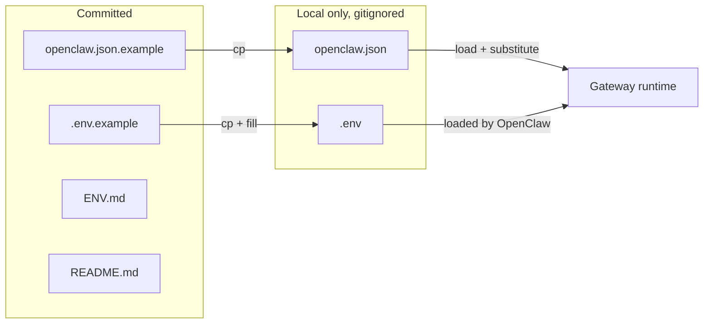

# Plan: Option A env-only credentials

Implement Option A so the repo is safe to share: config template in git, all secrets in environment variables, with a one-time migration from the current openclaw.json and clear docs for clones.

---

## Current state

- [openclaw.json.example](.openclaw/openclaw.json.example) is a **minimal stub** (2 lines, ~1.5 KB). The real [openclaw.json](.openclaw/openclaw.json) is **~537 lines** and includes: full `models.providers` (groq, ollama, openrouter + model list), `agents.defaults` (memorySearch, compaction, heartbeat, model aliases), `messages.tts`, `hooks.mappings` and `hooks.internal`, `canvasHost`, `gateway.trustedProxies` / `gateway.nodes`, `plugins.load.paths`, and richer `tools.media.audio`. The current example **cannot** be used as a drop-in replacement without losing this configuration.
- [.gitignore](.openclaw/.gitignore) ignores `openclaw.json` and `credentials/` but **does not** ignore `.env`.
- [ENV.md](.openclaw/ENV.md) and [README.md](.openclaw/README.md) describe the template and variable list; no migration or clone-setup steps.

OpenClaw loads `~/.openclaw/.env` (or `$OPENCLAW_STATE_DIR/.env`) before config; substitution runs at config load time (see [environment.md](openclaw/docs/help/environment.md)).

## 1. Expand openclaw.json.example to full config shape

**File:** [.openclaw/openclaw.json.example](.openclaw/openclaw.json.example)

- **Derive the example from the current openclaw.json** so it has the same structure and keys (models, agents.defaults including memorySearch/compaction/heartbeat, agents.list, tools.media.audio, messages.tts, hooks.mappings and gmail block, canvasHost, gateway.trustedProxies/nodes, plugins.load.paths, etc.).
- In that full JSON, **replace only the secret values** with `${VAR}`:
  - `tools.web.search.perplexity.apiKey` → `${PERPLEXITY_API_KEY}`
  - `hooks.token` → `${OPENCLAW_HOOKS_TOKEN}`
  - `hooks.gmail.pushToken` → `${GMAIL_PUSH_TOKEN}`
  - `hooks.gmail.account` → `${GMAIL_ACCOUNT}`
  - `hooks.gmail.topic` (project id segment) → `projects/${GCP_PROJECT_ID}/topics/...`
  - `channels.telegram.botToken` and `channels.telegram.accounts.*.botToken` → `${TELEGRAM_BOT_TOKEN}`
  - `gateway.auth.token` → `${OPENCLAW_GATEWAY_TOKEN}`
- **Sanitize for portability:** use `~/.openclaw/` (or a short note in ENV.md) for paths that are currently absolute (e.g. `workspace`, `agentDir`, `plugins.load.paths`) so the example is machine-agnostic; optionally clear or genericize `meta` / `wizard` so the example does not contain timestamps or machine-specific state.
- Result: one full template that can be committed and used as a real drop-in after `cp` and setting env vars.

## 2. Protect `.env` from being committed

**File:** [.openclaw/.gitignore](.openclaw/.gitignore)

- Add `.env` under the "Secrets and credentials" section (e.g. after `credentials/`).
- Ensures the file that holds real values is never committed.

## 3. Add `.env.example` for clones

**File:** `.openclaw/.env.example` (new)

- One line per variable with empty value or a comment, e.g.:
  - `PERPLEXITY_API_KEY=`
  - `OPENCLAW_GATEWAY_TOKEN=`
  - `OPENCLAW_HOOKS_TOKEN=`
  - `TELEGRAM_BOT_TOKEN=`
  - `GMAIL_PUSH_TOKEN=`
  - `GMAIL_ACCOUNT=`
  - `GCP_PROJECT_ID=`
- Optional: brief comment at top: "Copy to .env and fill in. Do not commit .env."
- Commit this file; it contains no secrets and gives clone-users the exact variable names.

## 4. Document Option A setup and migration

**File:** [.openclaw/ENV.md](.openclaw/ENV.md)

- **"Option A: First-time setup (new clone)"**  
  Steps: `cp openclaw.json.example openclaw.json`, `cp .env.example .env`, edit `.env` with real values, restart gateway. Remind not to commit `openclaw.json` or `.env`.
- **"Option A: Migrating from existing openclaw.json"**  
  Steps: (1) Back up current `openclaw.json` (e.g. `openclaw.json.bak`). (2) Copy `openclaw.json.example` to `openclaw.json`. (3) Create `.env` and copy the current secret values from the backup into the corresponding variables (see table). (4) Restart gateway and verify (e.g. `openclaw channels status --probe`, send a test message). (5) Delete backup once satisfied.

**File:** [.openclaw/README.md](.openclaw/README.md)

- Add one line pointing to ENV.md for "Option A setup and migration steps" so the flow is discoverable from the repo root.

## 5. One-time migration (your machine)

- Run the migration steps from ENV.md: backup `openclaw.json`, replace it with the **expanded** example (step 1), create `~/.openclaw/.env` with the seven variables filled from the backup, restart gateway, verify, then remove backup.
- No script required unless you want automation; the plan assumes manual copy from backup into `.env` (keeps implementation simple and avoids handling arbitrary JSON safely).

## Flow summary

## Out of scope

- **No migration script** that parses `openclaw.json` and writes `.env`: optional follow-up; plan uses manual copy from backup.
- **systemd/process managers**: ENV.md can note that systemd units should pass these via `Environment=` or `EnvironmentFile=`; no code changes in this repo.
