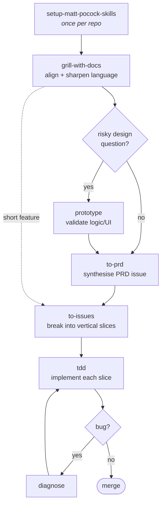
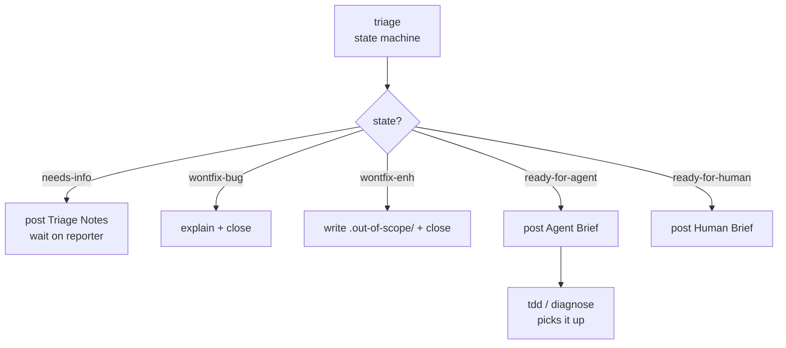
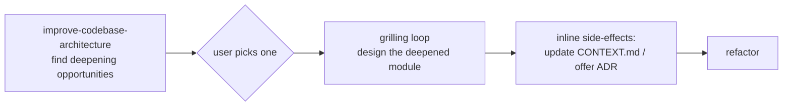

# Matt Pocock Skills — Workflows & Artifacts

A reference for the AI-coding skills in this plugin: how they chain together, what each
one consumes, and what each one produces. Source: `skills/engineering/*` and
`skills/productivity/*`.

The skill set is deliberately **small, composable, and process-light** — unlike
GSD / BMAD / Spec-Kit, it does not own the whole process. You pick the skill that fixes
the failure mode you're hitting. The README frames each skill as a fix for one of four
recurring failure modes:

| Failure mode                                  | Fix                                                                 |
| --------------------------------------------- | ------------------------------------------------------------------- |
| #1 Agent didn't do what I want (misalignment) | `grill-me`, `grill-with-docs`                                       |
| #2 Agent is too verbose (no shared language)  | `grill-with-docs` → `CONTEXT.md`                                    |
| #3 The code doesn't work (no feedback loop)   | `tdd`, `diagnose`                                                   |
| #4 We built a ball of mud (entropy)           | `to-prd` (module quiz), `zoom-out`, `improve-codebase-architecture` |

The five skills you asked about — **grill-with-docs, prototype, to-prd, to-issues, tdd** —
are the spine of the "build a new feature" flow. The rest (`diagnose`, `triage`,
`zoom-out`, `improve-codebase-architecture`, `handoff`, `grill-me`) are supporting skills
that plug into the same artifacts.

---

## 0. Prerequisite — run once per repo

Before any of the engineering skills work correctly, the repo needs config so the skills
know **where issues live**, **what triage labels mean**, and **where domain docs live**.

### `setup-matt-pocock-skills`

*(manual-only — `disable-model-invocation: true`; you must invoke it explicitly)*

|                      |                                                                                                                                                                                                                                                                                                                                   |
| -------------------- | --------------------------------------------------------------------------------------------------------------------------------------------------------------------------------------------------------------------------------------------------------------------------------------------------------------------------------- |
| **Input artifacts**  | Repo state: `git remote -v`, `CLAUDE.md` / `AGENTS.md`, existing `CONTEXT.md` / `CONTEXT-MAP.md`, `docs/adr/`, `.scratch/`                                                                                                                                                                                                        |
| **Output artifacts** | • An `## Agent skills` block written into `CLAUDE.md` **or** `AGENTS.md`<br>• `docs/agents/issue-tracker.md` (GitHub / GitLab / local-markdown / freeform)<br>• `docs/agents/triage-labels.md` (maps the 5 canonical roles to real label strings)<br>• `docs/agents/domain.md` (single- vs multi-context layout + consumer rules) |
| **Consumed by**      | `to-issues`, `to-prd`, `triage`, `diagnose`, `tdd`, `improve-codebase-architecture`, `zoom-out`                                                                                                                                                                                                                                   |

Every downstream skill that touches the issue tracker or domain docs says: *"…should have
been provided to you — run `/setup-matt-pocock-skills` if not."*

---

## 1. Skill catalogue — inputs & outputs at a glance

| Skill                             | Stage          | Input artifacts                                                                              | Output artifacts                                                                                                                                                                            |
| --------------------------------- | -------------- | -------------------------------------------------------------------------------------------- | ------------------------------------------------------------------------------------------------------------------------------------------------------------------------------------------- |
| **setup-matt-pocock-skills**      | Setup          | repo state                                                                                   | `docs/agents/*.md`, `## Agent skills` block in CLAUDE.md/AGENTS.md                                                                                                                          |
| **grill-with-docs**               | Align          | a plan/design (in conversation), `CONTEXT.md`, `docs/adr/`, codebase                         | shared understanding (conversation); updated `CONTEXT.md` (glossary); new ADRs in `docs/adr/` — all written **inline** as decisions crystallise                                             |
| **grill-me**                      | Align          | a plan/design (in conversation), codebase                                                    | shared understanding (conversation only — **no files**)                                                                                                                                     |
| **prototype**                     | Explore        | a design *question* (logic or UI)                                                            | throwaway prototype code (clearly marked); the **answer** captured durably (`NOTES.md`, commit msg, ADR, or issue); optionally a reusable snippet (state machine / reducer / schema / type) |
| **to-prd**                        | Specify        | conversation context + codebase + `CONTEXT.md` glossary + ADRs (+ prototype answer/snippets) | a **PRD** published as an issue on the tracker, labelled `ready-for-agent`                                                                                                                  |
| **to-issues**                     | Specify        | a plan / spec / PRD (conversation or referenced issue) + codebase + `CONTEXT.md` + ADRs      | **multiple issues** on the tracker — tracer-bullet vertical slices with acceptance criteria, blocked-by, HITL/AFK type, labelled `ready-for-agent`                                          |
| **triage**                        | Specify        | an incoming issue + codebase + `CONTEXT.md` + ADRs + `.out-of-scope/`                        | labels applied (1 category + 1 state role); agent-brief comment, triage-notes comment, or `.out-of-scope/*.md` entry. May call `grill-with-docs`                                            |
| **tdd**                           | Build          | an issue / slice / PRD + `CONTEXT.md` glossary + ADRs + agreed interface                     | production code + tests, built one vertical slice at a time (RED→GREEN→refactor)                                                                                                            |
| **zoom-out**                      | Build (helper) | a section of unfamiliar code + `CONTEXT.md`                                                  | a map of relevant modules & callers (conversation only — **no files**)                                                                                                                      |
| **diagnose**                      | Debug          | a bug report + codebase + `CONTEXT.md` + ADRs                                                | a feedback loop (failing test / harness); fix + regression test; post-mortem in commit/PR; cleanup of `[DEBUG-…]` logs. May hand off to `improve-codebase-architecture`                     |
| **improve-codebase-architecture** | Maintain       | codebase + `CONTEXT.md` + `docs/adr/`                                                        | a list of **deepening opportunities**; then refactors; updated `CONTEXT.md`; optionally new ADRs                                                                                            |
| **handoff**                       | Cross-cutting  | the current conversation                                                                     | a handoff doc at `mktemp -t handoff-XXXXXX.md`, referencing (not duplicating) other artifacts                                                                                               |

---

## 2. The shared artifacts (the "spine")

These three artifact families are what make the skills composable — every skill reads and
writes the same set:

- **`CONTEXT.md`** (and `CONTEXT-MAP.md` for monorepos) — the **glossary / ubiquitous
  language**. Pure domain terms, no implementation. Written by `grill-with-docs` and
  `improve-codebase-architecture`; **read by almost everything** so naming stays consistent
  and the agent spends fewer tokens. Format: `skills/engineering/grill-with-docs/CONTEXT-FORMAT.md`.
- **`docs/adr/NNNN-slug.md`** — **Architecture Decision Records**. One short paragraph per
  hard-to-reverse, surprising, trade-off decision. Written by `grill-with-docs`,
  `improve-codebase-architecture`, `prototype`; **respected (not re-litigated)** by every
  build/spec skill. Format: `skills/engineering/grill-with-docs/ADR-FORMAT.md`.
- **The issue tracker** — PRDs and tracer-bullet issues. Written by `to-prd`, `to-issues`,
  `triage`; consumed by `tdd` / `diagnose` as the unit of work. Location & CLI defined in
  `docs/agents/issue-tracker.md`.

---

## 3. Typical workflows

### Workflow A — Build a new feature (the main loop)

The canonical sequence. Optional steps in brackets.



**Step-by-step with artifacts:**

1. **`grill-with-docs`** — relentless one-question-at-a-time interview about the plan.
   *Reads* the existing `CONTEXT.md` + ADRs + codebase; *writes* glossary terms into
   `CONTEXT.md` and (sparingly) new ADRs **inline** as each decision lands. Output is
   alignment + sharpened language.
2. **`prototype`** *(optional)* — only when a design question is hard to settle on paper.
   Branches to a runnable terminal app (LOGIC) for state/business-logic questions, or
   toggleable UI variations (UI). *Writes* throwaway code; the durable output is **the
   answer** (+ optionally a state-machine/schema snippet that `to-prd`/`to-issues` can inline).
3. **`to-prd`** *(optional)* — synthesises everything discussed into a **PRD** (problem,
   solution, user stories, implementation decisions, testing decisions, out-of-scope) and
   publishes it as a `ready-for-agent` issue. Quizzes you on which **deep modules** to build
   and which to test. *No interview* — it just synthesises.
4. **`to-issues`** — breaks the plan/PRD into **tracer-bullet vertical slices** (each cuts
   through every layer end-to-end), tagged HITL/AFK with blocked-by dependencies. Quizzes
   you on granularity, then publishes one issue per slice. (For a small feature you can go
   straight from `grill-with-docs` → `to-issues`, skipping the PRD.)
5. **`tdd`** — implements each slice with RED→GREEN→refactor, **one test at a time**
   (vertical, never "all tests then all code"). Uses `CONTEXT.md` vocabulary for test/interface
   names; respects ADRs.
6. **`diagnose`** *(as needed)* — when the code misbehaves, see Workflow C.

### Workflow B — Triage incoming work (bugs / feature requests from others)

For issues arriving from outside your own head — bug reports, feature requests.



`triage` reproduces bugs, optionally drops into a **`grill-with-docs`** session to flesh
out under-specified issues, applies exactly one category role (`bug`/`enhancement`) + one
state role, and emits the appropriate comment/brief. A `ready-for-agent` brief becomes the
input to `tdd` or `diagnose`.

### Workflow C — Diagnose a hard bug

```
diagnose:
  Phase 1  Build a feedback loop   → failing test / harness  (THE skill)
  Phase 2  Reproduce               → confirmed symptom
  Phase 3  Hypothesise             → 3–5 ranked falsifiable hypotheses
  Phase 4  Instrument              → tagged [DEBUG-xxxx] probes, one var at a time
  Phase 5  Fix + regression test   → test written before fix (if a correct seam exists)
  Phase 6  Cleanup + post-mortem   → remove probes, record root cause in commit/PR
```

If the fix reveals an architectural problem (no good test seam, tangled callers), Phase 6
hands off to **`improve-codebase-architecture`** — *after* the fix lands, not before.

### Workflow D — Pay down architectural debt (periodic, ~every few days)



`improve-codebase-architecture` uses the Explore sub-agent to walk the codebase, applies the
**deletion test** to find shallow modules, presents numbered deepening opportunities (in
`CONTEXT.md` + architecture vocabulary), then grills you on the chosen one — updating
`CONTEXT.md` and offering ADRs inline, same discipline as `grill-with-docs`.

---

## 4. Helper / cross-cutting skills

- **`grill-me`** — the bare grilling interview (no docs side-effects). Use for non-code
  planning. `grill-with-docs` = `grill-me` + `CONTEXT.md`/ADR updates.
- **`zoom-out`** *(manual-only)* — "I don't know this area; go up a layer, map the modules
  and callers using the glossary." A read-only orientation aid during `tdd`/`diagnose`.
- **`handoff`** — compacts the conversation into a temp handoff doc so a fresh agent (often
  out of context window) can continue; references existing PRDs/issues/ADRs rather than
  duplicating them, and suggests which skills the next session should use.

---

## 5. Artifact ownership matrix

Who **creates/writes** (✍️) vs **reads/respects** (👁️) each artifact:

| Artifact                        | setup    | grill-w-docs | prototype | to-prd | to-issues | triage | tdd | diagnose | improve-arch |
| ------------------------------- |:--------:|:------------:|:---------:|:------:|:---------:|:------:|:---:|:--------:|:------------:|
| `docs/agents/*.md`              | ✍️       |              |           | 👁️    | 👁️       | 👁️    | 👁️ | 👁️      | 👁️          |
| `CONTEXT.md` / `CONTEXT-MAP.md` | (layout) | ✍️           |           | 👁️    | 👁️       | 👁️    | 👁️ | 👁️      | ✍️           |
| `docs/adr/`                     | (layout) | ✍️           | ✍️*       | 👁️    | 👁️       | 👁️    | 👁️ | 👁️      | ✍️           |
| Issue tracker (PRD)             | (config) |              |           | ✍️     | 👁️       |        |     |          |              |
| Issue tracker (slices)          | (config) |              |           |        | ✍️        | ✍️     | 👁️ | 👁️      |              |
| Prototype code + answer         |          |              | ✍️        | 👁️*   | 👁️*      |        |     |          |              |
| Production code + tests         |          |              |           |        |           |        | ✍️  | ✍️       | ✍️           |
| Handoff doc (temp)              |          |              |           |        |           |        |     |          |              |

\* `prototype` may capture its answer as an ADR; `to-prd`/`to-issues` may inline a prototype
snippet that encodes a decision precisely.

---

## 6. One-line mental model

> **Align (`grill-with-docs`) → optionally validate (`prototype`) → specify (`to-prd` /
> `to-issues`) → build (`tdd`) → debug (`diagnose`) → maintain (`improve-codebase-architecture`),
> all sharing one glossary (`CONTEXT.md`), one decision log (`docs/adr/`), and one issue
> tracker.**

`setup-matt-pocock-skills` wires the repo once; `triage` feeds external work into the same
pipeline; `zoom-out` and `handoff` are conversational helpers.
